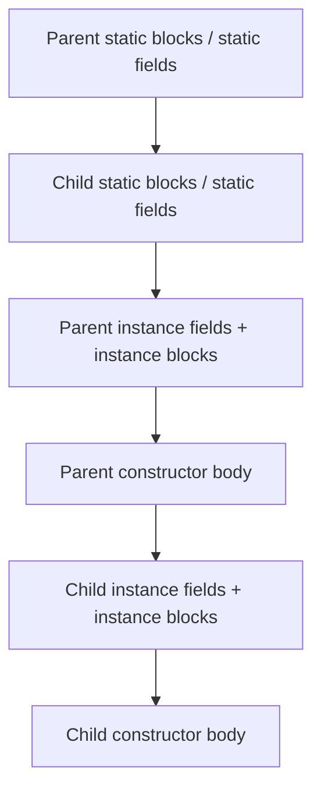
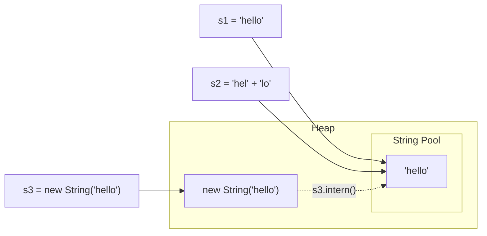
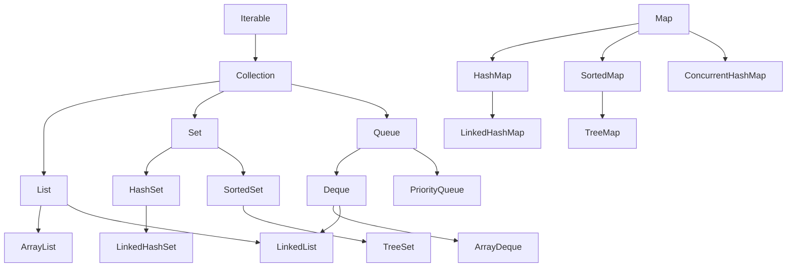
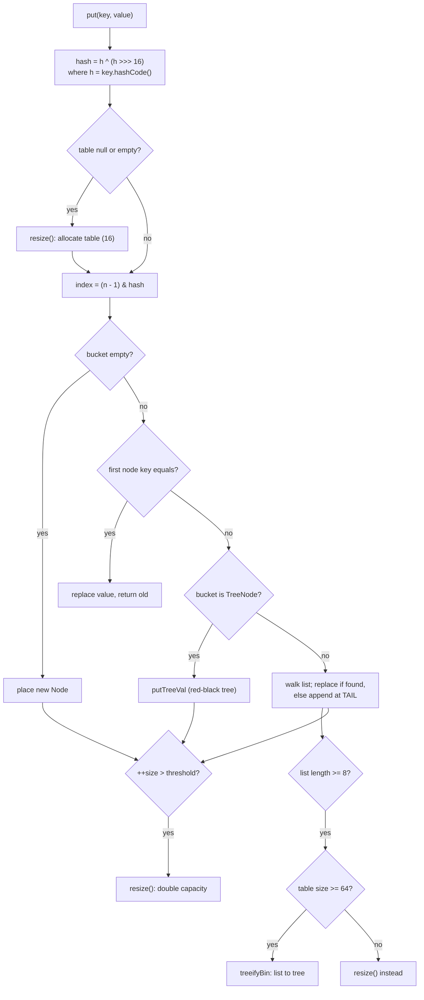
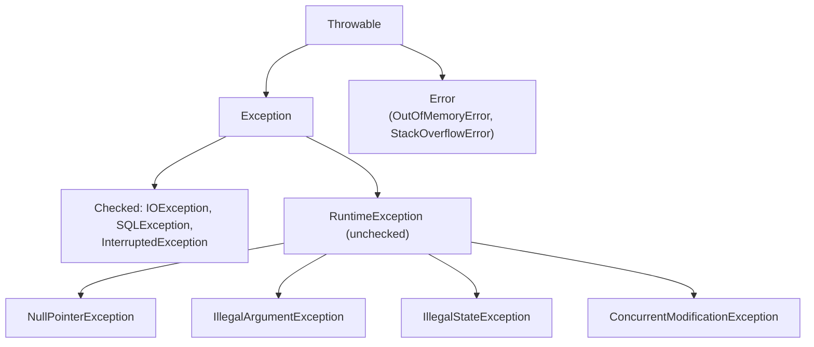
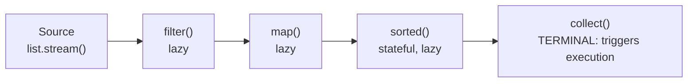
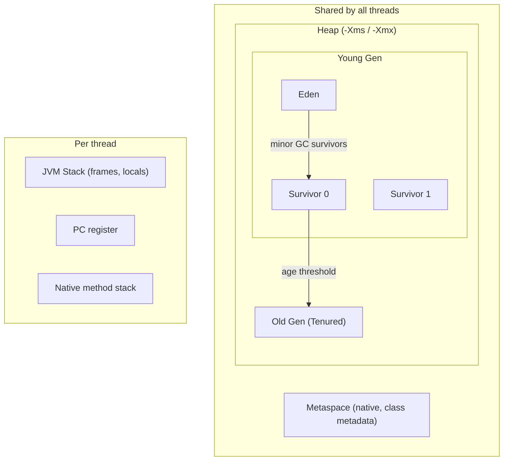
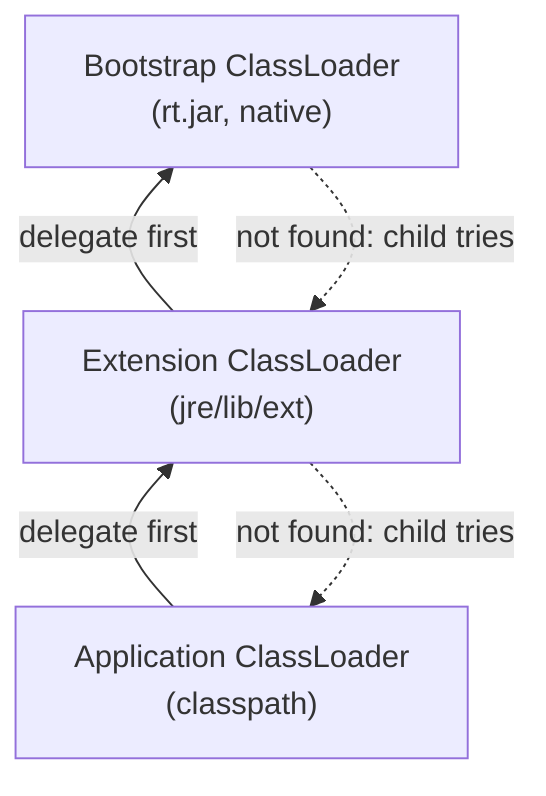
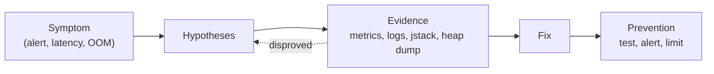

# Core Java (Java 8): Interview Notes

**Why this matters in interviews:** Every senior backend loop opens with Core Java. Interviewers use it to test depth rather than recall. You'll get questions like "how does `HashMap` behave under collision?", "why is `String` immutable?", and "what actually happens on an `OutOfMemoryError`?". Crisp answers here, backed by internals and production stories, set the tone for the rest of the interview.

Difficulty legend: 🟢 Basic · 🟡 Intermediate · 🔴 Advanced · ⚡ Scenario

## Table of Contents

1. [OOP and Language Basics](#1-oop-and-language-basics)
2. [Strings and Immutability](#2-strings-and-immutability)
3. [Object Class: equals, hashCode and Friends](#3-object-class-equals-hashcode-and-friends)
4. [Collections Framework](#4-collections-framework)
5. [Exceptions](#5-exceptions)
6. [Generics](#6-generics)
7. [Java 8: Lambdas, Streams and Optional](#7-java-8-lambdas-streams-and-optional)
8. [JVM Internals, Memory and GC](#8-jvm-internals-memory-and-gc)
9. [Serialization, Reflection and Misc](#9-serialization-reflection-and-misc)
10. [Coding / Hands-on](#10-coding--hands-on)
11. [Production Scenarios](#11-production-scenarios)
12. [Cheat Sheet](#12-cheat-sheet)
13. [Revision Checklist](#13-revision-checklist)
14. [Beyond Java 8](#14-beyond-java-8)

---

## 1. OOP and Language Basics

> **Mental model:** A class is a *blueprint* and an object is a *house* built from it. Encapsulation is the locked front door. Inheritance is a house extension that shares the old walls. Polymorphism is one doorbell that plays a different chime in every house.

### Q1. 🟢 What are the four pillars of OOP?

| Pillar | One-liner | Java mechanism |
|--------|-----------|----------------|
| **Encapsulation** | Hide state, expose behaviour | `private` fields + methods |
| **Abstraction** | Show *what*, hide *how* | interfaces, abstract classes |
| **Inheritance** | Reuse and specialise | `extends`, `implements` |
| **Polymorphism** | One interface, many forms | overloading (compile time), overriding (runtime) |

> [!TIP]
> Don't just list them. Give an example from your own code, for instance: "Our ranking pipeline depends on a `RankingStep` interface, so we add a new rule without touching existing ones. That's abstraction plus runtime polymorphism."

<details><summary>Cross-questions</summary>

**Q:** Is Java 100% object-oriented?

**A:** No. It has primitives (`int`, `boolean`, …) and static members that don't belong to any object.

**Q:** Which pillar do you consider most important?

**A:** Encapsulation. It lets you change internals without breaking callers, and the other pillars build on it.
</details>

### Q2. 🟢 What is the difference between JDK, JRE and JVM?

- **JVM** executes bytecode. It's platform-specific and handles interpreting, JIT compilation, GC and class loading.
- **JRE** = JVM + core libraries. It's what you need to *run* Java.
- **JDK** = JRE + dev tools (`javac`, `jar`, `jstack`, `jmap`, `jcmd`). It's what you need to *build* Java.

<details><summary>Cross-questions</summary>

**Q:** Is bytecode platform-independent?

**A:** Yes, `.class` files are portable. The JVM is the platform-specific part.

**Q:** What does the JIT do?

**A:** It compiles hot methods to native code at runtime (HotSpot C1/C2), with optimisations like inlining and escape analysis.
</details>

### Q3. 🟢 Is Java pass-by-value or pass-by-reference?

**Always pass-by-value.** For objects, the *value* passed is a copy of the reference. So you can mutate the object the reference points to, but reassigning the parameter has no effect on the caller.

```java
public class PassByValue {
    static void change(StringBuilder sb) {
        sb.append(" world");      // mutates the shared object: visible to caller
        sb = new StringBuilder("x"); // reassigns local copy: NOT visible
    }
    public static void main(String[] args) {
        StringBuilder sb = new StringBuilder("hello");
        change(sb);
        System.out.println(sb); // hello world
    }
}
```

> [!WARNING]
> "Objects are passed by reference" is the classic wrong answer. Say "references are passed by value."

<details><summary>Cross-questions</summary>

**Q:** Can you write a `swap(Integer a, Integer b)` that swaps the caller's variables?

**A:** No. Only the local copies get swapped. Return a pair or use a holder or array instead.
</details>

### Q4. 🟢 What is the difference between overloading and overriding?

| | Overloading | Overriding |
|---|---|---|
| Resolved | Compile time (static binding) | Runtime (dynamic dispatch) |
| Signature | Same name, different params | Same name + params |
| Return type | Can differ | Same or **covariant** subtype |
| Access | Any | Cannot be more restrictive |
| Exceptions | Any | Cannot throw broader **checked** exceptions |
| static/private | Can be overloaded | Cannot be overridden (static is *hidden*) |

<details><summary>Cross-questions</summary>

**Q:** Can you override a static method?

**A:** No. A static method with the same signature in the subclass *hides* the parent's. Which one gets called depends on the reference type, not the object.

**Q:** Which overload does `print(null)` pick when you have `print(Object)` and `print(String)`?

**A:** `print(String)`, because the most specific applicable overload wins. If you add `print(Integer)` as well, the call becomes ambiguous and won't compile.
</details>

### Q5. 🟢 Abstract class vs interface in Java 8?

| | Abstract class | Interface (Java 8) |
|---|---|---|
| State | Instance fields allowed | Only `public static final` constants |
| Constructors | Yes | No |
| Methods | Any | abstract, `default`, `static` |
| Multiple inheritance | One class | Many interfaces |
| Use when | Shared state/template | Capability/contract |

**Rule of thumb:** interfaces for *what a thing can do*, abstract classes for *a partial implementation with shared state* (for example, the Template Method pattern).

<details><summary>Cross-questions</summary>

**Q:** What happens if two interfaces provide the same default method?

**A:** The class must override it. It can then delegate explicitly with `A.super.method()`.

**Q:** Why were default methods added?

**A:** To evolve interfaces without breaking implementors. For example, `Collection.stream()` and `Iterable.forEach()` were added to existing interfaces in Java 8.
</details>

### Q6. 🟢 What does `static` mean on a variable, method, block and nested class?

- **static variable**: one copy per class, stored with the class metadata (static fields live in the heap alongside the `Class` object since Java 8).
- **static method**: no `this`; it can't be overridden.
- **static block**: runs once when the class is **initialised**.
- **static nested class**: doesn't hold a reference to an outer instance. Prefer it over inner classes to avoid accidental memory leaks.

<details><summary>Cross-questions</summary>

**Q:** When exactly does a static block run?

**A:** On first active use of the class: creating an instance, calling a static method, or accessing a non-constant static field. Accessing a compile-time `static final` constant doesn't trigger it, because the constant is inlined.
</details>

### Q7. 🟢 What does `final` mean for variables, methods and classes?

- **final variable**: assigned once. For a reference, the *reference* can't change but the object still can.
- **final method**: can't be overridden.
- **final class**: can't be subclassed (for example `String`, `Integer`).

<details><summary>Cross-questions</summary>

**Q:** What's the difference between `final`, `finally` and `finalize`?

**A:** `final` is a modifier. `finally` is a block that always runs after `try`, except on `System.exit` or a JVM crash. `finalize()` is a GC hook that's unreliable; use try-with-resources instead.

**Q:** What is "effectively final"?

**A:** A local variable that's never reassigned after initialisation. Since Java 8, lambdas and anonymous classes can capture it without the explicit `final` keyword.
</details>

### Q8. 🟢 What are the access modifiers?

| Modifier | Class | Package | Subclass (other pkg) | World |
|---|---|---|---|---|
| `private` | ✓ | | | |
| *(default)* | ✓ | ✓ | | |
| `protected` | ✓ | ✓ | ✓ | |
| `public` | ✓ | ✓ | ✓ | ✓ |

<details><summary>Cross-questions</summary>

**Q:** Can a top-level class be `private`?

**A:** No. A top-level class can only be `public` or package-private.
</details>

### Q9. 🟢 What are wrapper classes, and what is autoboxing?

Wrapper classes are object versions of primitives (`Integer`, `Long`, …). **Autoboxing** is the automatic conversion `int` → `Integer` (via `Integer.valueOf`), and **unboxing** is the reverse (via `intValue()`).

> [!WARNING]
> Unboxing `null` throws a `NullPointerException`. A common case is `int count = map.get(key);` when the key is missing.

<details><summary>Cross-questions</summary>

**Q:** What's the performance cost of autoboxing?

**A:** Every boxing call can allocate an object, which means GC pressure. A `Long sum` accumulated in a loop over 200K records creates up to 200K objects, whereas a `long` creates none.
</details>

### Q10. 🟡 What is the Integer cache?

`Integer.valueOf(int)` returns cached instances for **-128 to 127**. You can raise the upper bound with `-XX:AutoBoxCacheMax`. `Short`, `Byte`, `Character` (0–127) and `Long` cache the same range too, but `Float` and `Double` don't cache.

#### 🎯 Predict the output

```java
public class IntegerCache {
    public static void main(String[] args) {
        Integer a = 127, b = 127;
        Integer c = 128, d = 128;
        System.out.println(a == b);
        System.out.println(c == d);
        System.out.println(c.equals(d));
    }
}
```

<details><summary>Answer</summary>

`true`, `false`, `true`. Values in the -128..127 range come from the cache, so `a` and `b` are the same object. 128 is outside the range, so `c` and `d` are two different objects. Always compare wrappers with `equals`.
</details>

<details><summary>Cross-questions</summary>

**Q:** Does `new Integer(127) == new Integer(127)` return true?

**A:** No. `new` always creates a new object, and the constructor bypasses the cache.
</details>

### Q11. 🟢 How do `==` and `equals()` differ?

`==` compares **references** for objects (and values for primitives). `equals()` compares **logical equality** as defined by the class. The default `Object.equals` is just `==`.

<details><summary>Cross-questions</summary>

**Q:** Why does `"a".equals(str)` beat `str.equals("a")`?

**A:** It's null-safe. You can also use `Objects.equals(a, b)`.
</details>

### Q12. 🟡 What is a constructor chain, and what is `this()` vs `super()`?

`this(...)` calls another constructor of the same class, and `super(...)` calls the parent's constructor. Either must be the **first statement**, so you can only use one. If you don't write either, the compiler inserts `super()`.

<details><summary>Cross-questions</summary>

**Q:** What happens if the parent has no no-arg constructor?

**A:** The child must call `super(args)` explicitly, or it won't compile.

**Q:** Is calling an overridable method from a constructor dangerous?

**A:** Yes. The subclass override runs before the subclass's fields are initialised, so it can see `null` or `0`.
</details>

### Q13. 🟡 What is the order of initialisation?



The static steps run **once per class load**. The instance steps run **on every `new`**.

#### 🎯 Predict the output

```java
public class InitOrder {
    static class Parent {
        static { System.out.print("A"); }
        { System.out.print("B"); }
        Parent() { System.out.print("C"); }
    }
    static class Child extends Parent {
        static { System.out.print("D"); }
        { System.out.print("E"); }
        Child() { System.out.print("F"); }
    }
    public static void main(String[] args) {
        new Child();
        new Child();
    }
}
```

<details><summary>Answer</summary>

`ADBCEFBCEF`. The static blocks run once, and the instance blocks and constructors run once per object.
</details>

### Q14. 🟡 Composition vs inheritance?

**Favour composition.** Inheritance is an *is-a* relationship that couples you to the parent's implementation (the "fragile base class" problem). Composition is a *has-a* relationship that swaps implementations easily and is easier to test.

```java
// Composition: the service HAS a cache strategy that can be swapped
interface CacheStrategy { String get(String key); }

class ReportService {
    private final CacheStrategy cache;
    ReportService(CacheStrategy cache) { this.cache = cache; }
    String load(String id) { return cache.get(id); }
}
```

<details><summary>Cross-questions</summary>

**Q:** Can you give a JDK example where inheritance went wrong?

**A:** `Stack extends Vector`. It exposes `add(index, e)`, which breaks LIFO. `Properties extends Hashtable` is another example: it allows non-String values.
</details>

### Q15. 🟡 What are inner, static nested, local and anonymous classes?

| Type | Holds outer instance ref? | Typical use |
|---|---|---|
| Static nested | No | Builders, helpers (`Map.Entry`) |
| Inner (non-static) | **Yes** | Iterators over outer state |
| Local | Yes (if in instance method) | Rare |
| Anonymous | Yes (if in instance method) | Pre-Java 8 callbacks; now mostly lambdas |

> [!WARNING]
> An inner class or anonymous class submitted to a long-lived executor keeps its outer object alive, which is a classic memory leak.

<details><summary>Cross-questions</summary>

**Q:** How does a lambda differ from an anonymous class regarding `this`?

**A:** Inside a lambda, `this` is the enclosing instance. Inside an anonymous class, it's the anonymous object. A lambda also doesn't create a new scope for variable names.
</details>

### Q16. 🟢 What are Java's primitive types and their sizes?

| Type | Bits | Default |
|---|---|---|
| `byte` | 8 | 0 |
| `short` | 16 | 0 |
| `int` | 32 | 0 |
| `long` | 64 | 0L |
| `float` | 32 | 0.0f |
| `double` | 64 | 0.0d |
| `char` | 16 (unsigned UTF-16 unit) | `'\u0000'` |
| `boolean` | JVM-dependent | false |

#### 🎯 Predict the output

```java
public class CharMath {
    public static void main(String[] args) {
        System.out.println('a' + 1);
        System.out.println("" + 'a' + 1);
        System.out.println(1 + 2 + "3" + 4 + 5);
    }
}
```

<details><summary>Answer</summary>

`98`, `a1`, `3345`. `'a' + 1` is int arithmetic, since `'a'` = 97. Evaluation goes left to right, and once one operand is a `String`, `+` means concatenation.
</details>

<details><summary>Cross-questions</summary>

**Q:** Why doesn't `short s = 1; s = s + 1;` compile, while `s += 1;` does?

**A:** `s + 1` is promoted to `int`, so assigning it back to `short` needs a cast. Compound assignment includes an implicit cast.

**Q:** Should you use `double` for money?

**A:** No. `0.1 + 0.2 != 0.3` in binary floating point. Use `BigDecimal` (built from a `String`) or `long` cents.
</details>

---

## 2. Strings and Immutability

> **Mental model:** A `String` is a *printed label*. You can't change the ink, only print a new label. The String pool is a *shared shelf* of labels, so identical text reuses the same one.

### Q17. 🟢 Why is `String` immutable?

1. **Security**: class names, file paths and DB URLs can't be changed after validation.
2. **String pool**: sharing is only safe if nobody can mutate.
3. **Thread safety**: sharing needs no synchronisation.
4. **Hash caching**: `hashCode` is computed once and cached, which makes Strings great `HashMap` keys.

<details><summary>Cross-questions</summary>

**Q:** How is `String` made immutable?

**A:** The class is `final`, the internal `char[]` is `private final` (Java 8), there are no mutators, and methods like `substring` and `concat` return new objects.

**Q:** Can reflection mutate a String?

**A:** Technically yes, by making the internal array accessible. It's a hack that breaks pool invariants, and nobody should do it.
</details>

### Q18. 🟢 What is the String pool, and what does `intern()` do?

String literals are interned into a pool. Since **Java 7**, the pool lives in the **heap** (earlier it was in PermGen). `intern()` returns the pooled instance, adding it first if it isn't already there.



#### 🎯 Predict the output

```java
public class StringPool {
    public static void main(String[] args) {
        String s1 = "hello";
        String s2 = "hel" + "lo";
        String part = "hel";
        String s3 = part + "lo";
        String s4 = new String("hello");
        System.out.println(s1 == s2);
        System.out.println(s1 == s3);
        System.out.println(s1 == s4);
        System.out.println(s1 == s4.intern());
    }
}
```

<details><summary>Answer</summary>

`true`, `false`, `false`, `true`. `"hel" + "lo"` is a compile-time constant, so it's folded and interned. `part + "lo"` is computed at runtime through `StringBuilder`, which creates a new object. If `part` were `final`, the expression would become a constant and the result would be `true`.
</details>

<details><summary>Cross-questions</summary>

**Q:** How many objects does `new String("hello")` create?

**A:** Up to two: the literal in the pool (if it isn't already there) and one new heap object.
</details>

### Q19. 🟢 `String` vs `StringBuilder` vs `StringBuffer`?

| | String | StringBuilder | StringBuffer |
|---|---|---|---|
| Mutable | No | Yes | Yes |
| Thread-safe | Yes (immutable) | No | Yes (synchronized) |
| Speed | Slow for repeated concat | Fastest | Slower (locks) |

Use `StringBuilder` for building strings in loops. `StringBuffer` is legacy and rarely needed.

<details><summary>Cross-questions</summary>

**Q:** Does `a + b + c` in one expression create multiple builders?

**A:** No. `javac` (Java 8) compiles a single expression to one `StringBuilder` chain. The problem is `+=` inside a **loop**, which creates a new builder on every iteration: O(n²) copying.
</details>

### Q20. 🟡 What are the ways to compare strings, and which are the pitfalls?

- `equals`: content, case-sensitive.
- `equalsIgnoreCase`: content, ignoring case.
- `compareTo`: lexicographic order, useful for sorting.
- `==`: reference. It's almost never what you want.

<details><summary>Cross-questions</summary>

**Q:** Why can `toLowerCase()` break comparisons?

**A:** It's locale-sensitive. In the Turkish locale, `"TITLE".toLowerCase()` gives a dotless ı. Use `toLowerCase(Locale.ROOT)` for identifiers.
</details>

### Q21. 🟡 Did `substring` cause memory leaks?

Before **Java 7u6**, `substring` shared the parent's `char[]`. Keeping a small substring of a huge string kept the whole array alive. Since 7u6, `substring` copies the relevant chars.

<details><summary>Cross-questions</summary>

**Q:** What's the trade-off of the change?

**A:** `substring` became O(n) in copy cost, but it no longer causes hidden memory retention.
</details>

### Q22. 🟢 How do you split, join and format strings in Java 8?

```java
import java.util.Arrays;
import java.util.List;
import java.util.StringJoiner;

public class StringOps {
    public static void main(String[] args) {
        String csv = "id,name,,city";
        String[] parts = csv.split(",");            // trailing empties removed; inner kept
        System.out.println(Arrays.toString(parts));   // [id, name, , city]

        List<String> cols = Arrays.asList("a", "b", "c");
        System.out.println(String.join("|", cols));   // a|b|c

        StringJoiner sj = new StringJoiner(", ", "[", "]");
        sj.add("x").add("y");
        System.out.println(sj);                        // [x, y]
    }
}
```

> [!WARNING]
> `split` takes a **regex**. `"a.b".split(".")` returns an empty array. Use `split("\\.")` or `Pattern.quote(".")`.

<details><summary>Cross-questions</summary>

**Q:** How do you keep trailing empty strings?

**A:** Use `split(",", -1)`.

**Q:** Why precompile a `Pattern`?

**A:** `String.split` with a multi-char regex compiles the pattern on every call. In a hot loop over 200K rows, use a `static final Pattern`.
</details>

### Q23. 🟡 How do you make your own class immutable?

1. Declare the class `final`.
2. Make all fields `private final`.
3. Don't write setters.
4. **Defensively copy** mutable inputs and outputs.
5. Don't let `this` escape during construction.

```java
import java.util.ArrayList;
import java.util.Collections;
import java.util.Date;
import java.util.List;

public final class Event {
    private final String id;
    private final Date createdAt;
    private final List<String> tags;

    public Event(String id, Date createdAt, List<String> tags) {
        this.id = id;
        this.createdAt = new Date(createdAt.getTime());          // defensive copy in
        this.tags = Collections.unmodifiableList(new ArrayList<String>(tags));
    }
    public String getId() { return id; }
    public Date getCreatedAt() { return new Date(createdAt.getTime()); } // copy out
    public List<String> getTags() { return tags; }
}
```

<details><summary>Cross-questions</summary>

**Q:** Is `Collections.unmodifiableList(list)` alone enough?

**A:** No. It's only a *view*. If the caller keeps the original list, they can still mutate it. Copy first, then wrap.

**Q:** How does Java 8 help with dates?

**A:** `java.time` classes such as `Instant` and `LocalDate` are immutable, so there's no defensive copying needed.
</details>

### Q24. 🟡 What happened to `String.hashCode` and switch-on-string?

`hashCode` = `s[0]*31^(n-1) + … + s[n-1]`, and it's cached in the `hash` field. `switch` on a String (Java 7+) compiles to a `switch` on `hashCode()`, followed by `equals()` to resolve collisions.

<details><summary>Cross-questions</summary>

**Q:** Why multiply by 31?

**A:** It's an odd prime, which gives a good distribution, and `31 * i` can be optimised to `(i << 5) - i`.

**Q:** What happens if you switch on a null String?

**A:** It throws a `NullPointerException`.
</details>

### Q25. 🟡 Why store passwords in `char[]` rather than `String`?

A `String` is immutable and may be interned, so it stays in memory until GC and can show up in heap dumps. You can zero out a `char[]` (`Arrays.fill(pwd, '\0')`) right after you use it.

<details><summary>Cross-questions</summary>

**Q:** Does that fully protect the secret?

**A:** No. It narrows the window. Real protection comes from secret managers, never logging secrets, and restricting access to heap dumps.
</details>

---

## 3. Object Class: equals, hashCode and Friends

> **Mental model:** `hashCode` picks the *drawer*, and `equals` finds the exact *file* inside it. If two equal files end up in different drawers, you'll never find them again.

### Q26. 🟢 What is the equals/hashCode contract?

- If `a.equals(b)` is true, then `a.hashCode() == b.hashCode()` must be true.
- Equal hash codes **don't** imply equality (collisions are allowed).
- `equals` must be reflexive, symmetric, transitive, consistent, and return `false` for `null`.

```java
import java.util.Objects;

public final class OrderKey {
    private final String tenant;
    private final long orderId;

    public OrderKey(String tenant, long orderId) {
        this.tenant = tenant;
        this.orderId = orderId;
    }
    @Override public boolean equals(Object o) {
        if (this == o) return true;
        if (!(o instanceof OrderKey)) return false;
        OrderKey k = (OrderKey) o;
        return orderId == k.orderId && Objects.equals(tenant, k.tenant);
    }
    @Override public int hashCode() { return Objects.hash(tenant, orderId); }
}
```

<details><summary>Cross-questions</summary>

**Q:** What happens if you override `equals` but not `hashCode`?

**A:** Two equal keys land in different buckets. `map.get(equalKey)` returns `null`, and a `HashSet` stores duplicates.

**Q:** What's the difference between `instanceof` and `getClass()` in `equals`?

**A:** `getClass()` keeps symmetry across subclasses but breaks Liskov substitution. `instanceof` with a `final` class is the common, safe choice.
</details>

### Q27. 🟡 What goes wrong when you use a mutable object as a HashMap key?

If a key field used in `hashCode` changes after insertion, the entry stays in the *old* bucket. Lookups compute the *new* hash and miss. The entry is effectively lost, and that's a memory leak.

#### 🎯 Predict the output

```java
import java.util.HashSet;
import java.util.Set;

public class MutableKey {
    static class Key {
        int id;
        Key(int id) { this.id = id; }
        @Override public boolean equals(Object o) {
            return o instanceof Key && ((Key) o).id == id;
        }
        @Override public int hashCode() { return id; }
    }
    public static void main(String[] args) {
        Set<Key> set = new HashSet<Key>();
        Key k = new Key(1);
        set.add(k);
        k.id = 2;
        System.out.println(set.contains(k));
        System.out.println(set.size());
    }
}
```

<details><summary>Answer</summary>

`false`, `1`. The entry sits in bucket 1, but the lookup goes to bucket 2. Keep keys immutable.
</details>

### Q28. 🟢 What are the methods of `Object`?

`equals`, `hashCode`, `toString`, `getClass`, `clone`, `finalize`, `wait`, `notify`, `notifyAll`.

<details><summary>Cross-questions</summary>

**Q:** Why are `wait` and `notify` on `Object` rather than `Thread`?

**A:** They operate on an object's **monitor**, and any object can be a lock.
</details>

### Q29. 🟡 Shallow copy vs deep copy, and why is `clone()` disliked?

A **shallow** copy copies field values, so nested objects end up shared. A **deep** copy duplicates the nested objects too. `Cloneable` is a marker with no `clone` method on it, `Object.clone()` is `protected` and throws a checked exception, and it bypasses constructors.

**Prefer copy constructors or static factories:**

```java
import java.util.ArrayList;
import java.util.List;

public class Batch {
    private final List<String> ids;
    public Batch(List<String> ids) { this.ids = new ArrayList<String>(ids); }
    public Batch(Batch other) { this(other.ids); } // copy constructor
}
```

<details><summary>Cross-questions</summary>

**Q:** Are arrays cloned deeply?

**A:** No. `arr.clone()` is shallow for object arrays.
</details>

### Q30. 🟡 `Comparable` vs `Comparator`?

| | Comparable | Comparator |
|---|---|---|
| Package | `java.lang` | `java.util` |
| Method | `compareTo(T o)` | `compare(T a, T b)` |
| Defines | Natural order (one) | Any number of external orders |

```java
import java.util.ArrayList;
import java.util.Arrays;
import java.util.Comparator;
import java.util.List;

public class SortDemo {
    static class Emp {
        final String name; final int age;
        Emp(String n, int a) { name = n; age = a; }
        String getName() { return name; }
        int getAge() { return age; }
        @Override public String toString() { return name + ":" + age; }
    }
    public static void main(String[] args) {
        List<Emp> list = new ArrayList<Emp>(Arrays.asList(
            new Emp("Ravi", 30), new Emp("Anu", 30), new Emp("Zed", 25)));
        list.sort(Comparator.comparing(Emp::getAge).reversed()
                            .thenComparing(Emp::getName));
        System.out.println(list); // [Anu:30, Ravi:30, Zed:25]
    }
}
```

> [!WARNING]
> Never write `return a.x - b.x;` in a comparator. It overflows for large or negative ints. Use `Integer.compare(a.x, b.x)`.

<details><summary>Cross-questions</summary>

**Q:** What does "consistent with equals" mean?

**A:** `compareTo == 0` exactly when `equals` is true. `TreeSet` uses `compareTo`, so an inconsistent order silently drops "duplicates". `BigDecimal` is the famous example: `new BigDecimal("1.0")` and `new BigDecimal("1.00")` are not `equals`, but they compare as 0.
</details>

### Q31. 🟡 What does `toString()` return by default, and why override it?

By default it returns `ClassName@hexHashCode`. Override it for meaningful logs, but **never include secrets or PII** (passwords, tokens, emails).

<details><summary>Cross-questions</summary>

**Q:** Can `toString()` cause a performance problem?

**A:** Yes. `log.debug("x " + obj)` builds the string even when debug is off. Use parameterised logging instead: `log.debug("x {}", obj)`.
</details>

### Q32. 🔴 Why is `finalize()` deprecated in spirit, and what replaces it?

It runs at an unpredictable time (or never). It can resurrect objects, it slows GC (finalizable objects need an extra GC cycle), and exceptions thrown in it are swallowed. Use **try-with-resources** / `AutoCloseable` instead, or `PhantomReference` with a `ReferenceQueue` for cleanup.

<details><summary>Cross-questions</summary>

**Q:** How many times does the JVM call `finalize()` on an object?

**A:** At most once.
</details>

---
## 4. Collections Framework

> **Mental model:** Picking a collection is like picking storage. A **List** is a numbered shelf (ordered, duplicates allowed). A **Set** is a guest list (no duplicates). A **Map** is a coat check (ticket → coat). A **Queue** is a line at the counter.



> [!NOTE]
> `Map` does **not** extend `Collection`.

### Q33. 🟢 `ArrayList` vs `LinkedList`?

| Operation | ArrayList | LinkedList |
|---|---|---|
| `get(i)` | **O(1)** | O(n) |
| add at end | Amortised O(1) | O(1) |
| add/remove in middle | O(n) shift | O(n) to find, O(1) to link |
| Memory | Compact array | 2 pointers + header per node |
| Cache locality | Excellent | Poor |

In practice, **`ArrayList` wins almost always**. For a queue or stack, use `ArrayDeque`.

<details><summary>Cross-questions</summary>

**Q:** How does `ArrayList` grow?

**A:** By 1.5× (`old + (old >> 1)`), using `Arrays.copyOf`. `new ArrayList<>()` starts with an empty array, and it allocates capacity 10 on the first `add`.

**Q:** When you know you'll load 200K records, what do you do?

**A:** Presize with `new ArrayList<>(200_000)` to avoid about 20 resize-and-copy cycles.
</details>

### Q34. 🔴 How does `HashMap.put` work internally in Java 8?



Key numbers:

- **Default capacity 16**, **load factor 0.75**, threshold = capacity × LF.
- Capacity is always a **power of two**, so `(n-1) & hash` equals `hash % n`.
- **Treeify** when a bucket reaches 8 nodes **and** the table has at least 64 slots. **Untreeify** at 6 or fewer nodes.
- One `null` key is allowed, and it always goes to bucket 0.

<details><summary>Cross-questions</summary>

**Q:** Why XOR the high 16 bits into the hash?

**A:** The index only uses the low bits, so spreading the high bits reduces collisions for hash codes that differ only in their upper bits.

**Q:** What's the worst-case lookup in Java 8 versus Java 7?

**A:** Java 7 is O(n), because of the linked list. Java 8 is O(log n) once a bucket has been treeified, provided the keys are `Comparable` (otherwise it falls back to tie-breaking and can be slower).

**Q:** How does resize avoid rehashing everything?

**A:** When capacity doubles, each node either stays at index `i` or moves to `i + oldCap`, depending on a single bit (`hash & oldCap`). The list order is preserved.
</details>

### Q35. 🔴 Why was `HashMap` unsafe under concurrency in Java 7, and is it safe in Java 8?

Java 7 used **head insertion** during resize. Two threads resizing at the same time could create a **cycle** in a bucket's list, so a later `get` looped forever at 100% CPU. Java 8 uses **tail insertion** and keeps order, which removes that particular infinite loop. `HashMap` is **still not thread-safe** in Java 8, though: you can lose updates, get a corrupted `size`, or lose entries.

> [!WARNING]
> "Java 8 fixed HashMap thread safety" is wrong. It only removed the resize cycle. Use `ConcurrentHashMap`.

<details><summary>Cross-questions</summary>

**Q:** How would you diagnose that 100% CPU in production?

**A:** Run `top -H` to find the hot thread ID, convert it to hex, and run `jstack <pid>`. You'll see the thread stuck in `HashMap.get` / `getEntry`.
</details>

### Q36. 🔴 How does `ConcurrentHashMap` work in Java 8?

- There are **no segments** anymore; Java 7 used 16 `Segment` locks by default.
- An insert into an **empty bin** uses a **CAS** with no lock.
- An insert into a **non-empty bin** uses `synchronized` on the **first node of that bin** only.
- Reads are **lock-free**, because `volatile` fields make writes visible.
- Resizing is spread across threads: a thread doing `put` during a resize helps transfer bins, and moved bins are marked with a `ForwardingNode`.
- `size()` uses `CounterCell`s, the same idea as `LongAdder`.

> [!NOTE]
> `ConcurrentHashMap` rejects `null` keys **and** values. A `null` from `get` must mean "absent". In a concurrent map, you can't tell "absent" from "mapped to null" in a separate `containsKey` call without a race.

<details><summary>Cross-questions</summary>

**Q:** Is `if (!map.containsKey(k)) map.put(k, v);` safe on a CHM?

**A:** No. It's a check-then-act race. Use `putIfAbsent` or `computeIfAbsent`, which are atomic.

**Q:** Are CHM iterators fail-fast?

**A:** No, they're **weakly consistent**. They never throw `ConcurrentModificationException` and may or may not reflect updates made during iteration.

**Q:** Is there a trap with `computeIfAbsent`?

**A:** Yes. The mapping function runs while the bin lock is held. Keep it short, and never modify the same map from inside it (in Java 8 that can livelock).
</details>

### Q37. 🟡 `HashMap` vs `Hashtable` vs `Collections.synchronizedMap` vs `ConcurrentHashMap`?

| | Null key/value | Thread-safe | Locking | Iterator |
|---|---|---|---|---|
| HashMap | 1 null key, null values | No | None | Fail-fast |
| Hashtable | No | Yes | Whole map | Fail-fast (Enumerator isn't) |
| synchronizedMap | Like wrapped map | Yes | Whole map (mutex) | Fail-fast; **you must sync while iterating** |
| ConcurrentHashMap | No | Yes | Per bin + CAS | Weakly consistent |

<details><summary>Cross-questions</summary>

**Q:** How do you iterate a `synchronizedMap` safely?

**A:** Wrap the iteration in `synchronized (map) { for (...) }`.
</details>

### Q38. 🟡 Fail-fast vs fail-safe iterators?

A **fail-fast** iterator (`ArrayList`, `HashMap`) checks `modCount`, and a structural change made outside the iterator throws `ConcurrentModificationException`. **Fail-safe / weakly consistent** iterators (`CopyOnWriteArrayList`, CHM) work on a snapshot or tolerate concurrent change.

#### 🎯 Predict the output

```java
import java.util.ArrayList;
import java.util.Arrays;
import java.util.List;

public class Cme {
    public static void main(String[] args) {
        List<String> list = new ArrayList<String>(Arrays.asList("a", "b", "c"));
        for (String s : list) {
            if (s.equals("b")) list.remove(s);
        }
        System.out.println(list);
    }
}
```

<details><summary>Answer</summary>

It prints `[a, c]` with **no exception**. Removing the second-to-last element makes `size` drop to 2 while the cursor is at 2, so `hasNext()` returns false and the `modCount` check never runs. Remove `"a"` instead and you get a `ConcurrentModificationException`. The lesson: CME is best-effort, so don't rely on it. Use `iterator.remove()` or `list.removeIf(...)`.
</details>

<details><summary>Cross-questions</summary>

**Q:** Is CME only a multithreading issue?

**A:** No. It's most often single-threaded code modifying a collection inside a for-each loop.
</details>

### Q39. 🟢 How do `HashSet`, `LinkedHashSet` and `TreeSet` differ?

- **HashSet** is backed by a `HashMap` (value = a dummy `PRESENT` object). It's unordered, with O(1) operations.
- **LinkedHashSet** keeps insertion order.
- **TreeSet** is backed by a `TreeMap` (a red-black tree). It's sorted, with O(log n) operations, and it doesn't accept `null` under natural ordering.

<details><summary>Cross-questions</summary>

**Q:** How does a `HashSet` detect duplicates?

**A:** Through `hashCode` and then `equals`, via `map.put(e, PRESENT) == null`.
</details>

### Q40. 🟡 How does `LinkedHashMap` work, and how do you build an LRU cache with it?

It's a `HashMap` plus a doubly linked list through the entries. It keeps insertion order, or **access order** if you pass `accessOrder = true`. Override `removeEldestEntry` to get an LRU cache:

```java
import java.util.LinkedHashMap;
import java.util.Map;

public class LruCache<K, V> extends LinkedHashMap<K, V> {
    private final int maxSize;
    public LruCache(int maxSize) {
        super(16, 0.75f, true);   // accessOrder = true
        this.maxSize = maxSize;
    }
    @Override protected boolean removeEldestEntry(Map.Entry<K, V> eldest) {
        return size() > maxSize;
    }
    public static void main(String[] args) {
        LruCache<String, Integer> c = new LruCache<String, Integer>(2);
        c.put("a", 1); c.put("b", 2);
        c.get("a");          // a becomes most recent
        c.put("c", 3);       // evicts b
        System.out.println(c.keySet()); // [a, c]
    }
}
```

<details><summary>Cross-questions</summary>

**Q:** Is it thread-safe?

**A:** No. Even `get` mutates the list in access-order mode. Wrap it with `Collections.synchronizedMap`, or use Caffeine or Guava cache in production.

**Q:** Why use Redis instead of this in a microservice?

**A:** A local LRU is per instance. Redis gives a shared cache across instances, with TTLs and consistent invalidation.
</details>

### Q41. 🟡 `TreeMap` internals and use cases?

`TreeMap` is a **red-black tree**, so `get`, `put` and `remove` are O(log n). It supports navigation methods: `floorKey`, `ceilingKey`, `headMap`, `tailMap`, `subMap`.

```java
import java.util.TreeMap;

public class RateTier {
    public static void main(String[] args) {
        TreeMap<Integer, String> tiers = new TreeMap<Integer, String>();
        tiers.put(0, "FREE"); tiers.put(1000, "SILVER"); tiers.put(10000, "GOLD");
        System.out.println(tiers.floorEntry(4500).getValue()); // SILVER
    }
}
```

<details><summary>Cross-questions</summary>

**Q:** When would you pick `TreeMap` over `HashMap`?

**A:** When you need sorted keys, range queries, or nearest-key lookups (time-bucketed events, pricing tiers).
</details>

### Q42. 🟡 `PriorityQueue` internals?

It's a **binary min-heap** in an array. `offer` and `poll` are O(log n), and `peek` is O(1). Iterating over it is **not** sorted order. It isn't thread-safe; use `PriorityBlockingQueue` for that.

<details><summary>Cross-questions</summary>

**Q:** How do you get a max-heap?

**A:** `new PriorityQueue<>(Collections.reverseOrder())`, or pass a comparator.

**Q:** How do you get the top-K of N items efficiently?

**A:** Keep a **min-heap of size K**. That's O(N log K) time and O(K) memory.
</details>

### Q43. 🟢 `ArrayDeque` vs `Stack` vs `LinkedList` as a stack or queue?

Use **`ArrayDeque`**. It's a resizable circular array: faster than `LinkedList`, with no synchronisation overhead (unlike `Stack`, which extends `Vector`). It doesn't allow `null`.

<details><summary>Cross-questions</summary>

**Q:** Which methods give you stack semantics?

**A:** `push`, `pop` and `peek` operate on the head.
</details>

### Q44. 🟡 What are the pitfalls of `Arrays.asList`?

- It returns a **fixed-size** list backed by the array. `add` and `remove` throw `UnsupportedOperationException`, while `set` works and writes through to the array.
- `Arrays.asList(intArray)` gives you a `List<int[]>` with one element, not a `List<Integer>`.

<details><summary>Cross-questions</summary>

**Q:** How do you get a mutable list from an array?

**A:** `new ArrayList<>(Arrays.asList(arr))`.
</details>

### Q45. 🟡 Unmodifiable vs immutable collections in Java 8?

`Collections.unmodifiableList(list)` is a **read-only view**, so changes to the underlying list still show through. A truly immutable collection is a copy that no one else references, or you can use Guava's `ImmutableList`. (`List.of` only arrived in Java 9.)

<details><summary>Cross-questions</summary>

**Q:** What does `Collections.emptyList()` return, and can you add to it?

**A:** A shared immutable singleton. `add` throws `UnsupportedOperationException`.
</details>

### Q46. 🟡 `Iterator` vs `ListIterator` vs `forEach`, and how do you remove safely?

```java
import java.util.ArrayList;
import java.util.Arrays;
import java.util.Iterator;
import java.util.List;

public class SafeRemove {
    public static void main(String[] args) {
        List<Integer> nums = new ArrayList<Integer>(Arrays.asList(1, 2, 3, 4));
        Iterator<Integer> it = nums.iterator();
        while (it.hasNext()) {
            if (it.next() % 2 == 0) it.remove();
        }
        nums.removeIf(n -> n > 2);   // Java 8 way
        System.out.println(nums);    // [1]
    }
}
```

`ListIterator` adds bidirectional traversal and `set` / `add`.

<details><summary>Cross-questions</summary>

**Q:** Why does calling `it.remove()` twice in a row throw?

**A:** Because it's only allowed once per `next()`. Otherwise you get an `IllegalStateException`.
</details>

#### 🎯 Predict the output

```java
import java.util.ArrayList;
import java.util.Arrays;
import java.util.List;

public class RemoveOverload {
    public static void main(String[] args) {
        List<Integer> list = new ArrayList<Integer>(Arrays.asList(10, 20, 1, 2));
        list.remove(1);
        list.remove(Integer.valueOf(1));
        System.out.println(list);
    }
}
```

<details><summary>Answer</summary>

`[10, 2]`. `remove(1)` picks `remove(int index)`, which removes 20. `remove(Integer.valueOf(1))` picks `remove(Object)`, which removes the value 1.
</details>

### Q47. 🟡 `CopyOnWriteArrayList`: when should you use it?

Every write copies the whole array, so reads are lock-free and iteration never throws CME. It's ideal for **read-heavy, rarely modified** lists, such as listener registries or config lists. It's terrible for write-heavy data.

<details><summary>Cross-questions</summary>

**Q:** Does its iterator see new elements added during iteration?

**A:** No. It iterates over a snapshot, and `iterator.remove()` is unsupported.
</details>

### Q48. 🟡 `EnumMap` and `EnumSet`: why use them?

They're array or bit-vector backed, very fast and compact, and ordered by enum ordinal. Use them whenever your keys are enums (for example, event type → handler).

<details><summary>Cross-questions</summary>

**Q:** How is `EnumSet` implemented?

**A:** As a `RegularEnumSet` (a single `long` bitmask) for 64 constants or fewer, and a `JumboEnumSet` (a `long[]`) beyond that.
</details>

### Q49. 🟡 What is `WeakHashMap`, and where is it used?

Keys are held by **weak references**. When a key has no other strong reference, GC can clear it and the entry disappears. It's used for metadata caches keyed by objects with their own lifecycle.

> [!WARNING]
> Values are held strongly. If a value references its own key, the entry never goes away.

<details><summary>Cross-questions</summary>

**Q:** What's the difference between Strong, Soft, Weak and Phantom references?

**A:** Strong references are never collected while reachable. Soft references are cleared under memory pressure, which makes them cache-friendly. Weak references are cleared on the next GC. Phantom references are for post-mortem cleanup through a `ReferenceQueue`.
</details>

### Q50. 🟡 `IdentityHashMap`: what is special about it?

It uses `==` and `System.identityHashCode` instead of `equals` and `hashCode`. It's used for graph traversal and serialisation, where you care about object identity.

<details><summary>Cross-questions</summary>

**Q:** What collision strategy does it use?

**A:** Linear probing in a flat array (open addressing), not chaining.
</details>

### Q51. 🟡 How do you choose initial capacity for `HashMap`?

To hold N entries without a resize, use `capacity = (int) (N / 0.75f) + 1`. For 200K entries that's about 266,667, which gets rounded up to 2^19 = 524,288.

<details><summary>Cross-questions</summary>

**Q:** Does `new HashMap<>(100)` allocate 100 buckets?

**A:** No. It rounds up to 128 (a power of two), and the table is allocated lazily on the first `put`.
</details>

### Q52. 🟢 `Collections` utility highlights?

`sort`, `reverse`, `shuffle`, `binarySearch` (requires a sorted list), `frequency`, `nCopies`, `unmodifiableX`, `synchronizedX`, `emptyX`, `singletonList`.

<details><summary>Cross-questions</summary>

**Q:** Which algorithm does `Collections.sort` use?

**A:** In Java 8 it delegates to `List.sort`, which uses **TimSort** for objects: stable, O(n log n), and fast on partially sorted data. `Arrays.sort` on primitives uses **dual-pivot quicksort**, which isn't stable, but stability doesn't matter for primitives.
</details>

### Q53. 🔴 Why are `hashCode`-heavy workloads vulnerable to hash flooding?

An attacker can send keys with the same hash (for example, crafted JSON field names) and degrade a `HashMap` to O(n) per operation, turning parsing into O(n²). Java 8's treeification limits the damage to O(log n) for `Comparable` keys such as `String`.

<details><summary>Cross-questions</summary>

**Q:** What other mitigations are there?

**A:** Limit request payload sizes and field counts, and set parser limits.
</details>

### Q54. 🟡 `Vector` vs `ArrayList`?

`Vector` synchronises every method and grows 2×. It's legacy. If you need a thread-safe list, use `Collections.synchronizedList` or `CopyOnWriteArrayList`, depending on the read/write ratio.

<details><summary>Cross-questions</summary>

**Q:** Is `vector.get(0)` followed by `vector.remove(0)` atomic?

**A:** No. Each call is synchronised, but the combination is a race. You need an external lock.
</details>

### Q55. 🟡 `BlockingQueue` implementations for producer/consumer?

| Queue | Bound | Notes |
|---|---|---|
| `ArrayBlockingQueue` | Bounded | Single lock, fair option |
| `LinkedBlockingQueue` | Optional (default `Integer.MAX_VALUE`) | Separate put/take locks |
| `PriorityBlockingQueue` | Unbounded | Ordered |
| `SynchronousQueue` | Zero capacity | Direct hand-off |
| `DelayQueue` | Unbounded | Elements ready after delay |

> [!WARNING]
> An unbounded `LinkedBlockingQueue` in front of a slow consumer causes OOM under a burst. Always bound queues in ingestion pipelines. That gives you **backpressure**.

<details><summary>Cross-questions</summary>

**Q:** What's the difference between `put` / `take`, `offer` / `poll`, and `add` / `remove`?

**A:** `put` and `take` block. `offer` and `poll` return `false` or `null` (or wait if you pass a timeout). `add` and `remove` throw exceptions.
</details>

---

## 5. Exceptions

> **Mental model:** Exceptions are *fire alarms*. **Checked** ones are drills you must plan for (the compiler enforces it). **Unchecked** ones are bugs in the wiring. **Errors** mean the building itself is collapsing.



### Q56. 🟢 Checked vs unchecked exceptions?

**Checked** exceptions must be caught or declared, because they represent recoverable external conditions (IO, network). **Unchecked** exceptions (`RuntimeException`) represent programming errors. **Errors** are JVM-level problems you usually shouldn't catch.

<details><summary>Cross-questions</summary>

**Q:** Why does Spring wrap checked exceptions in runtime ones?

**A:** Checked exceptions leak implementation details through signatures (for example, `SQLException` in a service layer). Spring's `DataAccessException` hierarchy is unchecked and technology-neutral.
</details>

### Q57. 🟢 How do `finally` and return values interact?

#### 🎯 Predict the output

```java
public class FinallyReturn {
    static int a() {
        try { return 1; } finally { return 2; }
    }
    static int b() {
        int x = 1;
        try { return x; } finally { x++; }
    }
    public static void main(String[] args) {
        System.out.println(a());
        System.out.println(b());
    }
}
```

<details><summary>Answer</summary>

`2`, `1`. A `return` in `finally` overrides the earlier return, and it also swallows any exception, which is a terrible idea. In `b()`, the return value `1` is saved before `finally` runs, so `x++` doesn't affect it.
</details>

<details><summary>Cross-questions</summary>

**Q:** When doesn't `finally` run?

**A:** On `System.exit()`, a JVM crash or kill -9, or if the thread is a daemon and the JVM exits.
</details>

### Q58. 🟢 What is try-with-resources, and what are suppressed exceptions?

Any `AutoCloseable` declared in the header is closed automatically, **in reverse order**. If both the body and `close()` throw, the body's exception is the one thrown, and the close exception is attached through `getSuppressed()`.

```java
import java.io.BufferedReader;
import java.io.FileReader;
import java.io.IOException;

public class Twr {
    static long countLines(String path) throws IOException {
        try (BufferedReader br = new BufferedReader(new FileReader(path))) {
            long n = 0;
            while (br.readLine() != null) n++;
            return n;
        }
    }
}
```

<details><summary>Cross-questions</summary>

**Q:** What did you lose before Java 7?

**A:** An exception thrown by `close()` in `finally` would **replace** the original exception, hiding the root cause.
</details>

### Q59. 🟡 Can you catch multiple exceptions in one block?

Yes. Java 7 added multi-catch: `catch (IOException | SQLException e)`. In it, `e` is implicitly final, and the types can't be subclasses of each other.

<details><summary>Cross-questions</summary>

**Q:** Why won't `catch (Exception e)` followed by `catch (IOException e)` compile?

**A:** The second block is unreachable. Put the specific catch first.
</details>

### Q60. 🟡 What are best practices for custom exceptions?

- Extend `RuntimeException` for business errors in service layers, unless callers can genuinely recover.
- Always pass the **cause**: `new MyException("msg", e)`.
- Give meaningful messages that include identifiers, but **no PII or secrets**.

```java
public class RecordValidationException extends RuntimeException {
    private final String recordId;
    public RecordValidationException(String recordId, String msg, Throwable cause) {
        super("Record " + recordId + ": " + msg, cause);
        this.recordId = recordId;
    }
    public String getRecordId() { return recordId; }
}
```

<details><summary>Cross-questions</summary>

**Q:** Should you use exceptions for control flow?

**A:** No. Building a stack trace is expensive (`fillInStackTrace`). For high-volume validation failures, return a result object, or override `fillInStackTrace` for a lightweight exception.
</details>

### Q61. 🟡 What are the common anti-patterns in exception handling?

- `catch (Exception e) {}`, which swallows the exception.
- `e.printStackTrace()` in server code instead of a logger.
- Logging **and** rethrowing, which produces duplicate logs.
- Catching `Throwable` or `Error`.
- Losing the cause with `throw new X(e.getMessage())`.

> [!TIP]
> Say it like a senior engineer: "Handle an exception once, at the layer that can act on it: retry, fallback or translate to an HTTP status. Everywhere else, propagate with context."

<details><summary>Cross-questions</summary>

**Q:** How do you handle `InterruptedException` correctly?

**A:** Restore the flag with `Thread.currentThread().interrupt()` and exit or propagate. Never swallow it.
</details>

### Q62. 🟡 What is exception chaining, and why does the root cause matter?

`Throwable(String, Throwable)` links the exceptions together, and the stack trace prints `Caused by:` sections. Debugging a Kafka consumer failure often means finding the innermost `Caused by` (for example, a deserialisation error behind a generic `SerializationException`).

<details><summary>Cross-questions</summary>

**Q:** What does "... 12 more" mean in a stack trace?

**A:** Those frames are identical to the enclosing trace, so they're omitted.
</details>

### Q63. 🔴 `StackOverflowError` vs `OutOfMemoryError`?

| | StackOverflowError | OutOfMemoryError |
|---|---|---|
| Area | Thread stack (`-Xss`) | Heap, Metaspace, native, direct memory |
| Typical cause | Deep or infinite recursion, cyclic `toString`/`equals` | Leak, huge batch loaded in memory, too many threads |
| Fix | Iterate instead, fix cycle, raise `-Xss` | Heap dump analysis, streaming, bounded queues |

<details><summary>Cross-questions</summary>

**Q:** Can bidirectional JPA entities cause SOE?

**A:** Yes. Generated `toString`, `hashCode` or Jackson serialisation can recurse forever across `@OneToMany` and `@ManyToOne` relationships.
</details>

### Q64. 🟡 What does overriding allow regarding exceptions?

An overriding method may throw fewer or narrower **checked** exceptions, or none at all. It can throw any unchecked exception.

<details><summary>Cross-questions</summary>

**Q:** Why?

**A:** Callers written against the parent type only handle the parent's declared checked exceptions. That's substitutability (Liskov).
</details>

### Q65. 🟡 What does `throw` vs `throws` mean?

`throw` raises an exception instance. `throws` declares, in the method signature, which checked exceptions the method may propagate.

<details><summary>Cross-questions</summary>

**Q:** Can a lambda throw a checked exception?

**A:** Only if the functional interface declares it. `Function` doesn't, so you wrap the checked exception or define your own `ThrowingFunction`.
</details>

---

## 6. Generics

> **Mental model:** Generics are *labels on boxes* checked at the post office (the compiler). Once shipped (runtime), the labels are peeled off. That peeling is **type erasure**.

### Q66. 🟢 Why do we need generics?

They give compile-time type safety and remove casts. `List<String>` rejects an `Integer` when you compile, instead of failing with a `ClassCastException` at runtime.

<details><summary>Cross-questions</summary>

**Q:** Why is using raw types bad?

**A:** You lose type checks and get "unchecked" warnings, and heap pollution can surface much later, far from the cause.
</details>

### Q67. 🟡 What is type erasure, and what can't you do because of it?

Generic types are replaced by their bounds (or `Object`), and the compiler inserts casts. As a consequence you **can't**:

- `new T()` or `new T[]`.
- `instanceof List<String>`.
- Overload `m(List<String>)` and `m(List<Integer>)` (both erase to the same signature).
- Use primitives as type arguments.

<details><summary>Cross-questions</summary>

**Q:** How do frameworks like Jackson get generic types at runtime?

**A:** Generic info *is* kept in class metadata for fields, method signatures and superclass declarations. `new TypeReference<List<Foo>>() {}` captures it through an anonymous subclass's generic superclass.
</details>

### Q68. 🟡 What is PECS (`? extends` vs `? super`)?

**Producer Extends, Consumer Super.**

- `List<? extends Number>`: you can **read** `Number`s, but you can't add anything except `null`.
- `List<? super Integer>`: you can **add** `Integer`s, but reads come back as `Object`.

```java
import java.util.ArrayList;
import java.util.Arrays;
import java.util.List;

public class Pecs {
    static <T> void copy(List<? super T> dst, List<? extends T> src) {
        for (T t : src) dst.add(t);
    }
    public static void main(String[] args) {
        List<Number> dst = new ArrayList<Number>();
        copy(dst, Arrays.asList(1, 2, 3));
        System.out.println(dst); // [1, 2, 3]
    }
}
```

<details><summary>Cross-questions</summary>

**Q:** Is `List<Integer>` a subtype of `List<Number>`?

**A:** No, generics are **invariant**. Arrays are covariant (`Integer[]` is a `Number[]`), which is why arrays can throw `ArrayStoreException` at runtime.
</details>

### Q69. 🟡 Bounded type parameters?

`<T extends Comparable<? super T>>` means T must be comparable to itself or to a supertype. You can combine bounds with `&`: `<T extends Number & Comparable<T>>` (the class must come first).

<details><summary>Cross-questions</summary>

**Q:** Why `Comparable<? super T>` rather than `Comparable<T>`?

**A:** So that a subclass whose parent implements `Comparable<Parent>` still qualifies.
</details>

### Q70. 🟡 How do you write a generic method?

```java
import java.util.ArrayList;
import java.util.List;

public class Batches {
    // Split any list into fixed-size chunks (used for DB batch inserts of 200K+ rows)
    public static <T> List<List<T>> partition(List<T> src, int size) {
        if (size <= 0) throw new IllegalArgumentException("size must be > 0");
        List<List<T>> out = new ArrayList<List<T>>();
        for (int i = 0; i < src.size(); i += size) {
            out.add(src.subList(i, Math.min(i + size, src.size())));
        }
        return out;
    }
}
```

<details><summary>Cross-questions</summary>

**Q:** What's the risk of returning `subList` views?

**A:** They're views, not copies. A structural change to `src` invalidates them (CME), and they keep the big list alive. Copy them if they'll outlive `src`.
</details>

### Q71. 🔴 What is heap pollution, and what does `@SafeVarargs` do?

Heap pollution happens when a variable of a parameterised type refers to an object of a different parameterisation. Generic varargs create a `T[]` that's really an `Object[]`, which can pollute the heap. `@SafeVarargs` on a `static` or `final` method promises the method doesn't misuse that array.

<details><summary>Cross-questions</summary>

**Q:** Where does the JDK use it?

**A:** `Arrays.asList(T... a)`.
</details>

### Q72. 🟡 Wildcard `?` vs type parameter `T`?

Use `T` when you need to refer to the type again, for example to relate parameters or a return type. Use `?` when you don't care: `void printAll(Collection<?> c)`.

<details><summary>Cross-questions</summary>

**Q:** Why can't you add a String to a `List<?>`?

**A:** The actual type is unknown, so only `null` is safe to add.
</details>

---
## 7. Java 8: Lambdas, Streams and Optional

> **Mental model:** A stream is an *assembly line*. The source puts items on the belt, intermediate operations are stations that are set up but idle, and nothing moves until the terminal operation presses **Start**. Each item then travels through every station before the next item is fed in.



### Q73. 🟢 What is a functional interface?

An interface with **exactly one abstract method**. Default and static methods, and methods from `Object`, don't count. `@FunctionalInterface` makes the compiler check that rule.

| Interface | Signature | Example |
|---|---|---|
| `Function<T,R>` | `R apply(T)` | map an event to a DTO |
| `Predicate<T>` | `boolean test(T)` | filter valid records |
| `Consumer<T>` | `void accept(T)` | publish to Kafka |
| `Supplier<T>` | `T get()` | lazy default |
| `BiFunction<T,U,R>` | `R apply(T,U)` | merge |
| `UnaryOperator<T>` | `T apply(T)` | normalise |
| `BinaryOperator<T>` | `T apply(T,T)` | reduce |

<details><summary>Cross-questions</summary>

**Q:** Is `Comparator` a functional interface even though it declares `equals`?

**A:** Yes. `equals` is a public `Object` method, so it doesn't count toward the abstract method total.

**Q:** Why do `IntPredicate` and `ToLongFunction` exist?

**A:** To avoid boxing in primitive-heavy code paths.
</details>

### Q74. 🟢 What is a lambda, and how is it compiled?

It's a concise implementation of a functional interface. It's **not** compiled to an anonymous inner class file. `javac` emits an `invokedynamic` instruction, and at runtime `LambdaMetafactory` spins up the implementation. Non-capturing lambdas are typically reused as singletons.

<details><summary>Cross-questions</summary>

**Q:** Why must captured local variables be effectively final?

**A:** The lambda captures a *copy* of the value, and it may run on another thread later. Allowing mutation would create confusing, racy semantics.
</details>

### Q75. 🟢 What are the four kinds of method reference?

| Kind | Example | Lambda equivalent |
|---|---|---|
| Static | `Integer::parseInt` | `s -> Integer.parseInt(s)` |
| Bound instance | `System.out::println` | `x -> System.out.println(x)` |
| Unbound instance | `String::toUpperCase` | `s -> s.toUpperCase()` |
| Constructor | `ArrayList::new` | `() -> new ArrayList<>()` |

<details><summary>Cross-questions</summary>

**Q:** When is a method reference evaluated for a bound receiver?

**A:** The receiver expression is evaluated **when the reference is created**. `obj::m` with `obj == null` throws an NPE immediately.
</details>

### Q76. 🟢 Intermediate vs terminal operations?

- **Intermediate** (lazy, return a Stream): `filter`, `map`, `flatMap`, `distinct`, `sorted`, `peek`, `limit`, `skip`.
- **Terminal** (trigger execution): `collect`, `forEach`, `reduce`, `count`, `anyMatch`, `findFirst`, `min`, `max`, `toArray`.
- **Short-circuiting**: `limit`, `findFirst`, `anyMatch`, `allMatch`, `noneMatch`.

#### 🎯 Predict the output

```java
import java.util.Arrays;
import java.util.stream.Stream;

public class Lazy {
    public static void main(String[] args) {
        Stream<String> s = Arrays.asList("a", "b", "c").stream()
            .peek(x -> System.out.print("P" + x + " "));
        System.out.println("built");
        s.filter(x -> !x.equals("a")).findFirst().ifPresent(System.out::println);
    }
}
```

<details><summary>Answer</summary>

```text
built
Pa Pb b
```

Nothing runs until the terminal `findFirst`. Items flow through one at a time, and `findFirst` short-circuits after `b`, so `c` is never peeked.
</details>

<details><summary>Cross-questions</summary>

**Q:** Can you reuse a stream?

**A:** No. A second terminal operation throws `IllegalStateException: stream has already been operated upon or closed`.
</details>

### Q77. 🟢 `map` vs `flatMap`?

`map` transforms each element into exactly one element. `flatMap` transforms each element into a **stream** and flattens the results.

```java
import java.util.Arrays;
import java.util.List;
import java.util.stream.Collectors;

public class FlatMapDemo {
    public static void main(String[] args) {
        List<List<String>> batches = Arrays.asList(
            Arrays.asList("e1", "e2"), Arrays.asList("e3"));
        List<String> all = batches.stream()
            .flatMap(List::stream)
            .collect(Collectors.toList());
        System.out.println(all); // [e1, e2, e3]
    }
}
```

<details><summary>Cross-questions</summary>

**Q:** What does `Optional.flatMap` do?

**A:** It avoids `Optional<Optional<T>>` when the mapping function itself returns an `Optional`.
</details>

### Q78. 🟡 What are the most important Collectors?

```java
import java.util.Arrays;
import java.util.List;
import java.util.Map;
import java.util.stream.Collectors;

public class CollectorsDemo {
    static class Event {
        final String source; final String type; final long bytes;
        Event(String s, String t, long b) { source = s; type = t; bytes = b; }
        String getSource() { return source; }
        String getType() { return type; }
        long getBytes() { return bytes; }
    }
    public static void main(String[] args) {
        List<Event> events = Arrays.asList(
            new Event("ANDROID", "click", 120), new Event("IOS", "view", 300),
            new Event("ANDROID", "view", 80), new Event("WEB", "click", 50));

        Map<String, Long> countBySource = events.stream()
            .collect(Collectors.groupingBy(Event::getSource, Collectors.counting()));

        Map<String, Long> bytesBySource = events.stream()
            .collect(Collectors.groupingBy(Event::getSource,
                     Collectors.summingLong(Event::getBytes)));

        Map<Boolean, List<Event>> bigOrSmall = events.stream()
            .collect(Collectors.partitioningBy(e -> e.getBytes() > 100));

        String types = events.stream().map(Event::getType).distinct()
            .collect(Collectors.joining(",", "[", "]"));

        System.out.println(countBySource);   // e.g. {WEB=1, IOS=1, ANDROID=2}
        System.out.println(bytesBySource);
        System.out.println(bigOrSmall.get(true).size()); // 2
        System.out.println(types);           // [click,view]
    }
}
```

<details><summary>Cross-questions</summary>

**Q:** Is the `groupingBy` result ordered?

**A:** It's a `HashMap` by default. Pass a map factory for order: `groupingBy(f, TreeMap::new, downstream)`.

**Q:** What's the difference between `partitioningBy` and `groupingBy`?

**A:** `partitioningBy` always returns both the `true` and `false` keys, even when one side is empty.
</details>

### Q79. 🟡 What is the `Collectors.toMap` trap?

A duplicate key throws `IllegalStateException: Duplicate key`, and a `null` value throws an NPE (because `HashMap.merge` rejects null values).

```java
import java.util.Arrays;
import java.util.LinkedHashMap;
import java.util.List;
import java.util.Map;
import java.util.function.Function;
import java.util.stream.Collectors;

public class ToMapDemo {
    public static void main(String[] args) {
        List<String> words = Arrays.asList("apple", "avocado", "banana");
        Map<Character, String> byFirst = words.stream().collect(Collectors.toMap(
            w -> w.charAt(0),
            Function.identity(),
            (a, b) -> a,              // merge function resolves duplicates
            LinkedHashMap::new));     // keep order
        System.out.println(byFirst);  // {a=apple, b=banana}
    }
}
```

<details><summary>Cross-questions</summary>

**Q:** Is there a production example?

**A:** Deduplicating ingestion events by `eventId` with `toMap` and no merge function crashed the whole batch the first time a client retried and sent a duplicate.
</details>

### Q80. 🟡 `reduce` vs `collect`?

`reduce` is for **immutable** combination (sum, max). `collect` is **mutable reduction** into a container (list, map, `StringBuilder`). Using `reduce` to build collections creates a new container at every step, which is slow and unsafe in parallel.

```java
import java.util.Arrays;
import java.util.List;

public class ReduceDemo {
    public static void main(String[] args) {
        List<Integer> nums = Arrays.asList(1, 2, 3, 4);
        int sum = nums.stream().reduce(0, Integer::sum);
        int sum2 = nums.stream().mapToInt(Integer::intValue).sum(); // no boxing
        System.out.println(sum + " " + sum2); // 10 10
    }
}
```

<details><summary>Cross-questions</summary>

**Q:** What are the requirements for the identity and accumulator in parallel?

**A:** The identity must truly be an identity (0 for sum, not 10), and the accumulator must be **associative** and stateless.
</details>

### Q81. 🟡 How do parallel streams work, and when should you avoid them?

They split the source using a `Spliterator` and run the pieces on **`ForkJoinPool.commonPool()`**, which has `availableProcessors() - 1` threads by default.

**Avoid them when:**

- Tasks do **blocking IO** (DB or HTTP calls). They starve the shared common pool, which affects the whole JVM.
- The source splits badly (`LinkedList`, `Stream.iterate`).
- The data set is small, or the operations are cheap (the overhead outweighs the gain).
- You rely on ordering or shared mutable state.

> [!TIP]
> Say it like a senior engineer: "For our 200K-record batch job, I used a bounded `ThreadPoolExecutor` with explicit chunking rather than `parallelStream()`. The work was IO-bound, and I wanted to control pool size, backpressure and error handling. That, together with batching and caching, cut runtime by about 40%."

<details><summary>Cross-questions</summary>

**Q:** Can you run a parallel stream in a custom pool?

**A:** Yes: `customPool.submit(() -> list.parallelStream()...).get()`. The tasks run inside that pool. This behaviour is an implementation detail, but it's widely relied upon.

**Q:** Is `forEach` ordered on a parallel stream?

**A:** No. `forEachOrdered` is, at the cost of parallelism.
</details>

### Q82. 🟡 Stateful operations and side effects?

`sorted` and `distinct` are **stateful**: they must see the whole stream (or a lot of it), which kills laziness. Don't mutate external collections inside `map` or `forEach` in parallel streams; use collectors instead.

#### 🎯 Predict the output

```java
import java.util.ArrayList;
import java.util.List;
import java.util.stream.IntStream;

public class SideEffect {
    public static void main(String[] args) {
        List<Integer> out = new ArrayList<Integer>();
        IntStream.range(0, 10000).parallel().forEach(out::add);
        System.out.println(out.size() == 10000);
    }
}
```

<details><summary>Answer</summary>

Usually `false`, and sometimes it throws `ArrayIndexOutOfBoundsException`. `ArrayList` isn't thread-safe. Use `.boxed().collect(Collectors.toList())` instead.
</details>

### Q83. 🟢 What is `Optional` for, and what are the misuses?

`Optional` is for **return types** that may be absent. It forces the caller to deal with absence.

**Don't:**

- Use it for fields, method parameters or collections (return an empty list instead).
- Call `get()` without checking. Use `orElse`, `orElseGet`, `orElseThrow`, `map` or `ifPresent`.
- Return `null` from a method whose return type is `Optional`.

<details><summary>Cross-questions</summary>

**Q:** Is `Optional` serialisable?

**A:** No. That's one reason it shouldn't be a field.
</details>

### Q84. 🟡 `orElse` vs `orElseGet`?

#### 🎯 Predict the output

```java
import java.util.Optional;

public class OrElse {
    static String expensive() { System.out.print("CALLED "); return "default"; }
    public static void main(String[] args) {
        Optional<String> o = Optional.of("value");
        System.out.println(o.orElse(expensive()));
        System.out.println(o.orElseGet(OrElse::expensive));
    }
}
```

<details><summary>Answer</summary>

```text
CALLED value
value
```

The argument to `orElse` is **always evaluated**. `orElseGet` only calls the supplier when the Optional is empty. Use `orElseGet` for DB calls or object creation.
</details>

### Q85. 🟡 What is `java.time`, and why replace `Date` and `SimpleDateFormat`?

`Date` is mutable and badly designed, and **`SimpleDateFormat` isn't thread-safe**: a shared static formatter corrupts dates under load. `java.time` (JSR-310) is immutable and thread-safe.

| Class | Meaning |
|---|---|
| `Instant` | Machine timestamp (UTC) |
| `LocalDate` / `LocalDateTime` | No time zone |
| `ZonedDateTime` | With zone rules (DST) |
| `Duration` / `Period` | Time-based / date-based amount |
| `DateTimeFormatter` | Thread-safe formatter |

```java
import java.time.Instant;
import java.time.ZoneId;
import java.time.format.DateTimeFormatter;

public class TimeDemo {
    private static final DateTimeFormatter FMT =
        DateTimeFormatter.ofPattern("yyyy-MM-dd HH:mm:ss").withZone(ZoneId.of("UTC"));
    public static void main(String[] args) {
        System.out.println(FMT.format(Instant.ofEpochMilli(0))); // 1970-01-01 00:00:00
    }
}
```

<details><summary>Cross-questions</summary>

**Q:** Which type do you store event timestamps as?

**A:** `Instant` (UTC) in storage and on the wire. Convert to a zone only for display.
</details>

### Q86. 🟡 What are default and static interface methods good for?

Default methods let you evolve APIs (`List.sort`, `Map.getOrDefault`, `Map.computeIfAbsent`). Static methods hold factory or helper code (`Comparator.comparing`).

<details><summary>Cross-questions</summary>

**Q:** Can a default method override `equals` or `hashCode`?

**A:** No. A default method can't override an `Object` method; it's a compile error.
</details>

### Q87. 🟡 What new `Map` methods arrived in Java 8?

```java
import java.util.HashMap;
import java.util.Map;

public class MapJava8 {
    public static void main(String[] args) {
        Map<String, Integer> counts = new HashMap<String, Integer>();
        for (String s : new String[]{"a", "b", "a"}) {
            counts.merge(s, 1, Integer::sum);          // word count in one line
        }
        counts.computeIfAbsent("c", k -> 0);
        counts.computeIfPresent("b", (k, v) -> v + 10);
        System.out.println(counts.getOrDefault("z", -1)); // -1
        System.out.println(counts); // {a=2, b=11, c=0}
    }
}
```

<details><summary>Cross-questions</summary>

**Q:** What happens when a `merge` or `compute` function returns `null`?

**A:** The entry is **removed**.
</details>

### Q88. 🟡 Function composition, and how does it relate to a ranking pipeline?

`Function.andThen` and `Function.compose`, plus `Predicate.and`, `Predicate.or` and `Predicate.negate`, let you build pipelines from small, testable steps.

```java
import java.util.function.Function;
import java.util.function.Predicate;

public class Compose {
    public static void main(String[] args) {
        Function<Double, Double> boostRecent = s -> s * 1.2;
        Function<Double, Double> penaliseSpam = s -> s - 5;
        Function<Double, Double> pipeline = boostRecent.andThen(penaliseSpam);
        System.out.println(pipeline.apply(10.0)); // 7.0

        Predicate<String> notBlank = s -> s != null && !s.trim().isEmpty();
        Predicate<String> shortText = s -> s.length() < 5;
        System.out.println(notBlank.and(shortText.negate()).test("hello world")); // true
    }
}
```

<details><summary>Cross-questions</summary>

**Q:** When would you use Chain of Responsibility classes instead of composed functions?

**A:** When steps need names, configuration, metrics, the ability to short-circuit, or dependency injection. That's why the ranking pipeline used CoR classes rather than raw lambdas.
</details>

### Q89. 🟡 What are primitive streams and ranges?

`IntStream`, `LongStream` and `DoubleStream` avoid boxing and add `sum`, `average` and `summaryStatistics`. `IntStream.range(0, n)` excludes n, while `rangeClosed` includes it. Convert with `mapToInt` and `boxed`.

<details><summary>Cross-questions</summary>

**Q:** Why does `average()` return `OptionalDouble`?

**A:** Because an empty stream has no average.
</details>

### Q90. 🔴 How do you handle checked exceptions inside lambdas?

```java
import java.util.function.Function;

public class Unchecked {
    @FunctionalInterface
    interface ThrowingFunction<T, R> { R apply(T t) throws Exception; }

    static <T, R> Function<T, R> wrap(ThrowingFunction<T, R> f) {
        return t -> {
            try { return f.apply(t); }
            catch (RuntimeException e) { throw e; }
            catch (Exception e) { throw new RuntimeException(e); }
        };
    }
}
```

Usage: `paths.stream().map(wrap(Files::readAllBytes))`.

<details><summary>Cross-questions</summary>

**Q:** What's the downside?

**A:** The first failure aborts the whole stream. For batch jobs, you often want to collect per-record errors instead, returning a result or error object and continuing.
</details>

### Q91. 🟡 `findFirst` vs `findAny`, and `anyMatch` on empty streams?

`findAny` may return any element, which is faster in parallel. `anyMatch` on an empty stream returns `false`, and `allMatch` on an empty stream returns **`true`** (vacuous truth).

<details><summary>Cross-questions</summary>

**Q:** Where does vacuous truth bite?

**A:** In a validation like `records.stream().allMatch(valid)` that "passes" on an empty batch. Check for emptiness explicitly.
</details>

### Q92. 🔴 How does `sorted()` interact with `limit()`, and what about infinite streams?

`sorted()` must consume the whole upstream before emitting anything, so `Stream.iterate(1, x -> x + 1).sorted().limit(5)` **never terminates**, and eventually it hits OOM. Put `limit` before `sorted` when the stream is infinite.

<details><summary>Cross-questions</summary>

**Q:** Is `distinct()` on an infinite stream safe with `limit`?

**A:** Yes, provided there are enough distinct elements. `distinct` is stateful but emits elements incrementally. Its seen-set keeps growing, though.
</details>

---

## 8. JVM Internals, Memory and GC

> **Mental model:** The JVM is a *restaurant*. The **class loader** is the supplier bringing in recipes. The **stack** is each chef's personal notepad (one per thread). The **heap** is the shared kitchen where food (objects) is made. **GC** is the cleaning crew: it's fast for the counters (young gen) and slow and disruptive for the storeroom (old gen).



### Q93. 🟢 Stack vs heap?

| | Stack | Heap |
|---|---|---|
| Stores | Frames: primitives, references, return addresses | Objects, arrays |
| Scope | Per thread | Shared |
| Lifetime | Method call | Until unreachable plus GC |
| Error | `StackOverflowError` | `OutOfMemoryError: Java heap space` |
| Speed | Very fast (pointer bump) | Fast allocation (TLAB), GC cost |

<details><summary>Cross-questions</summary>

**Q:** Are all objects on the heap?

**A:** Logically, yes. The JIT's **escape analysis** can scalar-replace objects that never escape a method, so they're never actually allocated.

**Q:** What is a TLAB?

**A:** A Thread-Local Allocation Buffer: a per-thread chunk of Eden, so allocation is a lock-free pointer bump.
</details>

### Q94. 🟡 PermGen vs Metaspace?

Java 8 **removed PermGen**. Class metadata moved to **Metaspace** in native memory, which is unbounded by default. Set `-XX:MaxMetaspaceSize` to cap it. Interned strings and static fields had already moved to the heap in Java 7 and 8.

<details><summary>Cross-questions</summary>

**Q:** What causes `OutOfMemoryError: Metaspace`?

**A:** Class loader leaks. Examples include repeated hot redeploys in app servers, and dynamic proxy or bytecode generation (CGLIB, Groovy) creating unbounded numbers of classes.
</details>

### Q95. 🟡 How does class loading work?

The phases are **Loading → Linking (Verify, Prepare, Resolve) → Initialisation**. Class loaders use **parent-first delegation**.



<details><summary>Cross-questions</summary>

**Q:** Why delegate to the parent first?

**A:** Security and consistency. You can't sneak in your own `java.lang.String`.

**Q:** Why do we get "ClassCastException: com.X cannot be cast to com.X"?

**A:** The same class was loaded by two different class loaders. A class's identity is its name **plus** its loader.

**Q:** What is the difference between `NoClassDefFoundError` and `ClassNotFoundException`?

**A:** `ClassNotFoundException` is checked and thrown by explicit loading (`Class.forName`). `NoClassDefFoundError` means a class present at compile time is missing at runtime, or its static initialiser failed earlier.
</details>

### Q96. 🟡 How does generational GC work?

It rests on the **weak generational hypothesis**: most objects die young.

1. New objects go into **Eden**.
2. A **minor GC** copies live objects from Eden and one survivor space into the other survivor space, and their age increments.
3. Objects older than the tenuring threshold (max 15) are **promoted** to the Old generation.
4. When the Old generation fills up, a **major or full GC** runs, which is expensive.

GC roots include local variables on stacks, static fields, active threads and JNI references.

<details><summary>Cross-questions</summary>

**Q:** Does Java use reference counting?

**A:** No. It uses **tracing from GC roots**, so cycles are collected fine.

**Q:** What's a "stop-the-world" pause?

**A:** All application threads pause at a safepoint while the GC does work that can't run concurrently.
</details>

### Q97. 🔴 Which GC algorithms are available in Java 8?

| Collector | Flag | Traits |
|---|---|---|
| Serial | `-XX:+UseSerialGC` | Single thread, small heaps |
| **Parallel** (Java 8 default on server-class machines) | `-XX:+UseParallelGC` | Throughput-focused, STW multi-threaded |
| CMS | `-XX:+UseConcMarkSweepGC` | Low pause, concurrent old gen, fragmentation, deprecated in 9 |
| G1 | `-XX:+UseG1GC` | Region-based, pause target `-XX:MaxGCPauseMillis`, default from Java 9 |

> [!TIP]
> Say it like a senior engineer: "For latency-sensitive consumers on Java 8, I'd pick G1 with a pause target, size the heap from the live-set measured in GC logs, and then verify with the logs before and after the change."

<details><summary>Cross-questions</summary>

**Q:** How does G1 decide what to collect?

**A:** The heap is split into equal regions. G1 collects the regions with the most garbage first (hence "Garbage First") to stay within its pause target.

**Q:** What are humongous objects?

**A:** In G1, objects of at least half a region are allocated directly into contiguous humongous regions. Many large byte arrays (for example, big payloads) can cause premature full GCs.
</details>

### Q98. 🟡 Which JVM flags matter in production (Java 8)?

```bash
java -Xms2g -Xmx2g \
     -XX:+UseG1GC -XX:MaxGCPauseMillis=200 \
     -XX:MaxMetaspaceSize=256m \
     -XX:+HeapDumpOnOutOfMemoryError -XX:HeapDumpPath=/dumps \
     -XX:+PrintGCDetails -XX:+PrintGCDateStamps -Xloggc:/logs/gc.log \
     -XX:+UseGCLogFileRotation -XX:NumberOfGCLogFiles=5 -XX:GCLogFileSize=20m \
     -jar app.jar
```

Setting `-Xms` equal to `-Xmx` avoids heap resizing pauses.

<details><summary>Cross-questions</summary>

**Q:** How should Java 8 run in containers?

**A:** From 8u191, container support is on by default. Use `-XX:MaxRAMPercentage=75.0` instead of a hard `-Xmx`, so the heap scales with the container memory limit. Older builds read host memory and got OOM-killed.
</details>

### Q99. 🔴 What are the types of `OutOfMemoryError`, and what does each mean?

| Message | Meaning | First move |
|---|---|---|
| `Java heap space` | Heap full of live objects | Heap dump → MAT dominator tree |
| `GC overhead limit exceeded` | More than 98% of time in GC recovering less than 2% | Same: leak or undersized heap |
| `Metaspace` | Class metadata limit | Class loader leak, proxy generation |
| `unable to create new native thread` | OS thread or memory limit | Thread leak, unbounded pools |
| `Direct buffer memory` | NIO off-heap limit | Netty or Kafka buffers, `-XX:MaxDirectMemorySize` |
| `Requested array size exceeds VM limit` | Array too big | Bug in sizing |

<details><summary>Cross-questions</summary>

**Q:** Should you catch `OutOfMemoryError` and continue?

**A:** Almost never. The state may be inconsistent. Let the process die and restart (orchestrators handle that), after capturing a heap dump.
</details>

### Q100. 🔴 Which JVM diagnostic tools do you use, and when?

| Symptom | Tool | Command |
|---|---|---|
| High CPU | `top -H` + `jstack` | `jstack <pid> > t.txt` (take 3 dumps, 5 s apart) |
| Deadlock | `jstack` | Look for "Found one Java-level deadlock" |
| Memory growth | `jmap` / `jcmd` | `jmap -histo:live <pid>` / `jcmd <pid> GC.heap_dump f.hprof` |
| GC behaviour | `jstat` | `jstat -gcutil <pid> 1000` |
| Flags | `jcmd` | `jcmd <pid> VM.flags` |
| Deep profiling | JFR / VisualVM / async-profiler | JFR is commercial in Oracle JDK 8 before 8u262 and free in OpenJDK 8u262+ |

<details><summary>Cross-questions</summary>

**Q:** Why take several thread dumps instead of one?

**A:** One dump is a snapshot. The same thread stuck at the same frame across several dumps is the real signal.

**Q:** Does `jmap -histo:live` affect the application?

**A:** Yes. `:live` triggers a full GC first. Be careful in production.
</details>

### Q101. 🔴 How do you find a memory leak in a heap dump?

1. Capture two dumps some time apart (or take one on OOM).
2. Open them in **Eclipse MAT** and check the **Leak Suspects** report.
3. Look at the **Dominator Tree** for the biggest retained sizes.
4. Follow **Path to GC Roots** (excluding weak and soft references) to find who's holding on.
5. Common culprits: static `Map`s used as caches without eviction, `ThreadLocal`s in pooled threads, listeners that are never deregistered, unbounded queues.

<details><summary>Cross-questions</summary>

**Q:** What's the difference between shallow heap and retained heap?

**A:** Shallow heap is the object's own size. Retained heap is everything that would be freed if that object were collected.
</details>

### Q102. 🔴 How does `ThreadLocal` leak memory?

Each thread has a `ThreadLocalMap` with **weak keys** (the `ThreadLocal`) and **strong values**. In **thread pools**, threads live forever. If you never call `remove()`, values accumulate or **leak across requests**. For example, user context from request A shows up in request B.

```java
public class RequestContext {
    private static final ThreadLocal<String> USER = new ThreadLocal<String>();
    public static void run(String user, Runnable r) {
        USER.set(user);
        try { r.run(); }
        finally { USER.remove(); }   // mandatory in pooled threads
    }
    public static String currentUser() { return USER.get(); }
}
```

<details><summary>Cross-questions</summary>

**Q:** Does `ThreadLocal` propagate to `@Async` or executor threads?

**A:** No. You have to copy it explicitly (with a decorating `Runnable`), or Spring Security's context will be missing in async tasks.
</details>

### Q103. 🟡 What is the JIT, and what are warm-up effects?

HotSpot interprets code first, profiles it, and compiles hot methods with C1 (quick) and then C2 (optimised). This is **tiered compilation**, on by default in Java 8. Benchmarks without warm-up are misleading, so use **JMH**.

<details><summary>Cross-questions</summary>

**Q:** What's deoptimisation?

**A:** When the JIT's speculative assumptions become invalid (for example, a new subclass gets loaded), the JVM falls back to interpreted code and may recompile.
</details>

### Q104. 🟡 What is the Java Memory Model, briefly?

The JMM defines **happens-before** rules: when writes from one thread are guaranteed visible to another. Key edges are unlocking a monitor → a later lock of it, a `volatile` write → a later read, `Thread.start()`, `Thread.join()`, and `final` field freeze at the end of the constructor. (It's covered in depth in [02_Multithreading_Concurrency.md](02_Multithreading_Concurrency.md).)

<details><summary>Cross-questions</summary>

**Q:** Why are `final` fields special?

**A:** A properly constructed object's `final` fields are visible to all threads without synchronisation, provided `this` didn't escape during construction.
</details>

### Q105. 🟡 What does `System.gc()` do?

It *suggests* a full GC, and the JVM may honour it, which usually means an expensive STW pause. `-XX:+DisableExplicitGC` ignores it. Don't call it in application code.

<details><summary>Cross-questions</summary>

**Q:** Who calls it legitimately?

**A:** RMI's distributed GC (hourly, by default) and some NIO direct-buffer cleanup paths. That's why `DisableExplicitGC` can backfire with heavy direct-buffer use.
</details>

### Q106. 🔴 What are compressed oops?

On 64-bit JVMs with heaps under about 32 GB, references are stored as 32-bit offsets (`-XX:+UseCompressedOops`, on by default). That saves significant memory. Going just past 32 GB can mean *less* usable space than 31 GB.

<details><summary>Cross-questions</summary>

**Q:** What's the practical advice?

**A:** Keep heaps at or below about 31 GB, or jump well beyond 32 GB. Don't land just above it.
</details>

---

## 9. Serialization, Reflection and Misc

> **Mental model:** Serialisation is *freeze-drying* an object to ship it. Reflection is *X-ray vision* into a class at runtime. Both are powerful, slow, and a common source of security bugs.

### Q107. 🟡 How does Java serialisation work, and what is `serialVersionUID`?

A class implements the marker `Serializable`, and `ObjectOutputStream` writes the non-`transient`, non-static fields. `serialVersionUID` is a version stamp. If the sender and receiver disagree, deserialisation throws `InvalidClassException`. Declare it explicitly, because the auto-generated value changes with trivial edits.

<details><summary>Cross-questions</summary>

**Q:** Why do we prefer JSON, Avro or Protobuf for events on Kafka or Pub/Sub?

**A:** Java serialisation is Java-only and brittle across versions, and it's a **remote code execution risk** when deserialising untrusted data (gadget chains). Schema-based formats like Avro add schema evolution plus a schema registry.

**Q:** Is a parent's field serialised if the parent isn't `Serializable`?

**A:** No. The parent's no-arg constructor runs during deserialisation to initialise those fields.
</details>

### Q108. 🟡 What do `transient` and `static` mean in serialisation?

`transient` fields are skipped and restored to their default values (null, 0). `static` fields belong to the class and are never serialised.

<details><summary>Cross-questions</summary>

**Q:** How do you customise serialisation?

**A:** With private `writeObject` and `readObject` methods, or with `Externalizable`, where you control everything and a public no-arg constructor is required.
</details>

### Q109. 🟡 What is reflection used for, and what does it cost?

Frameworks use reflection for DI (Spring), ORM (Hibernate), JSON mapping (Jackson) and testing. The costs are slower calls (mitigated by caching `Method` objects and the JIT), broken encapsulation (`setAccessible`), and errors that only show up at runtime rather than compile time.

<details><summary>Cross-questions</summary>

**Q:** How do Spring AOP proxies differ?

**A:** A JDK dynamic proxy (`java.lang.reflect.Proxy`) implements interfaces only. CGLIB creates a subclass, so it can't proxy `final` classes or `final` methods.
</details>

### Q110. 🟡 How do you implement Singleton properly in Java 8?

```java
public class Singletons {
    // 1. Enum: serialization- and reflection-safe (Effective Java recommendation)
    public enum ConfigHolder { INSTANCE; public String get(String k) { return k; } }

    // 2. Initialization-on-demand holder: lazy, thread-safe via class init
    public static class Registry {
        private Registry() {}
        private static class Holder { static final Registry INSTANCE = new Registry(); }
        public static Registry getInstance() { return Holder.INSTANCE; }
    }

    // 3. Double-checked locking: volatile is REQUIRED
    public static class Dcl {
        private static volatile Dcl instance;
        private Dcl() {}
        public static Dcl getInstance() {
            Dcl local = instance;
            if (local == null) {
                synchronized (Dcl.class) {
                    local = instance;
                    if (local == null) instance = local = new Dcl();
                }
            }
            return local;
        }
    }
}
```

<details><summary>Cross-questions</summary>

**Q:** Why is `volatile` needed in double-checked locking?

**A:** Without it, the write of the reference can be reordered before the constructor's writes. Another thread could then see a non-null but partially constructed object.

**Q:** How can a Singleton be broken?

**A:** Through reflection (calling the private constructor), deserialisation (fix it with `readResolve`), cloning, or multiple class loaders. The enum approach defends against the first three.
</details>

### Q111. 🟢 What are enums beyond constants?

They're full classes: fields, constructors (implicitly private), methods, constant-specific bodies, and they can implement interfaces. `values()`, `valueOf()` and `ordinal()` are generated.

```java
public enum Priority {
    HIGH(3) { @Override boolean urgent() { return true; } },
    LOW(1);
    private final int weight;
    Priority(int w) { weight = w; }
    int weight() { return weight; }
    boolean urgent() { return false; }
}
```

> [!WARNING]
> Don't persist `ordinal()`. Reordering the constants silently corrupts data. In JPA, use `@Enumerated(EnumType.STRING)`.

<details><summary>Cross-questions</summary>

**Q:** Can you use `==` to compare enums?

**A:** Yes. Each constant is a single instance, and `==` is also null-safe.
</details>

### Q112. 🟡 Marker interfaces vs annotations?

Marker interfaces (`Serializable`, `Cloneable`, `RandomAccess`) define a **type**, so they can be checked at compile time. Annotations carry richer metadata and are processed through reflection or annotation processors. Retention can be `SOURCE`, `CLASS` or `RUNTIME`.

<details><summary>Cross-questions</summary>

**Q:** What does `RandomAccess` do?

**A:** Algorithms check for it to choose an index loop instead of an iterator. `ArrayList` has it, and `LinkedList` doesn't.
</details>

### Q113. 🟡 What does `volatile` guarantee versus `synchronized` (the one-minute version)?

`volatile` gives **visibility and ordering** but not atomicity, so `count++` is still racy. `synchronized` gives mutual exclusion **and** visibility. (See file 02 for the deep dive.)

<details><summary>Cross-questions</summary>

**Q:** What should you use for a shared counter?

**A:** `AtomicLong`, or `LongAdder` under high contention.
</details>

### Q114. 🟡 How does `BigDecimal` behave?

- Build it from a `String` or with `BigDecimal.valueOf(double)`, **not** `new BigDecimal(0.1)` (that gives 0.1000000000000000055…).
- `equals` compares scale, so `1.0` isn't equal to `1.00`. Use `compareTo`.
- Division that doesn't terminate throws `ArithmeticException` unless you pass a scale and a `RoundingMode`.

<details><summary>Cross-questions</summary>

**Q:** Where did you use it?

**A:** For any money or aggregate totals in reports where rounding must be deterministic.
</details>

---
## 10. Coding / Hands-on

> **Mental model:** In live coding, the interviewer grades your *process* as much as the result: clarify the requirements → state the brute force → optimise → handle edge cases → state the complexity.

### Q115. 🟢 How do you reverse a string, and check whether it's a palindrome?

```java
public class Palindrome {
    static boolean isPalindrome(String s) {
        if (s == null) return false;
        int i = 0, j = s.length() - 1;
        while (i < j) {
            if (s.charAt(i++) != s.charAt(j--)) return false;
        }
        return true;
    }
    public static void main(String[] args) {
        System.out.println(new StringBuilder("level").reverse().toString()); // level
        System.out.println(isPalindrome("racecar")); // true
        System.out.println(isPalindrome("java"));    // false
    }
}
```

<details><summary>Cross-questions</summary>

**Q:** What about ignoring case and non-alphanumerics?

**A:** Skip characters that fail `Character.isLetterOrDigit`, and compare with `Character.toLowerCase`.

**Q:** Does `StringBuilder.reverse` handle surrogate pairs (emoji)?

**A:** Yes, it keeps surrogate pairs intact.
</details>

### Q116. 🟡 How do you find the first non-repeated character?

```java
import java.util.LinkedHashMap;
import java.util.Map;
import java.util.function.Function;
import java.util.stream.Collectors;

public class FirstUnique {
    static Character firstUnique(String s) {
        Map<Character, Long> counts = s.chars()
            .mapToObj(c -> (char) c)
            .collect(Collectors.groupingBy(Function.identity(),
                     LinkedHashMap::new, Collectors.counting()));
        for (Map.Entry<Character, Long> e : counts.entrySet()) {
            if (e.getValue() == 1L) return e.getKey();
        }
        return null;
    }
    public static void main(String[] args) {
        System.out.println(firstUnique("swiss")); // w
    }
}
```

This runs in **O(n)** time and uses O(k) space, where k is the number of distinct characters. `LinkedHashMap` keeps the order of first appearance.

<details><summary>Cross-questions</summary>

**Q:** Can you do it without a map for ASCII input?

**A:** Yes, with an `int[128]` count array and two passes.
</details>

### Q117. 🟡 How do you find duplicates in a list, with and without streams?

```java
import java.util.Arrays;
import java.util.HashSet;
import java.util.List;
import java.util.Set;
import java.util.stream.Collectors;

public class Duplicates {
    public static void main(String[] args) {
        List<String> ids = Arrays.asList("e1", "e2", "e1", "e3", "e2");
        Set<String> seen = new HashSet<String>();
        Set<String> dups = ids.stream()
            .filter(id -> !seen.add(id))          // add returns false if present
            .collect(Collectors.toSet());
        System.out.println(dups); // [e1, e2] (order not guaranteed)
    }
}
```

> [!WARNING]
> The stateful lambda (`seen`) is fine for a **sequential** stream but broken for a parallel one. The alternative is `groupingBy(identity, counting())` followed by a filter on count > 1.

<details><summary>Cross-questions</summary>

**Q:** How do you dedupe 50M event IDs that don't fit in memory?

**A:** Dedupe in the store (a unique constraint or `ON CONFLICT DO NOTHING`), use a Redis `SET` with a TTL for recent IDs, or accept a small false-positive rate with a Bloom filter.
</details>

### Q118. 🟡 How do you find the top K most frequent elements?

```java
import java.util.ArrayList;
import java.util.Arrays;
import java.util.Collections;
import java.util.HashMap;
import java.util.List;
import java.util.Map;
import java.util.PriorityQueue;

public class TopK {
    static List<String> topK(List<String> words, int k) {
        Map<String, Integer> freq = new HashMap<String, Integer>();
        for (String w : words) freq.merge(w, 1, Integer::sum);

        PriorityQueue<Map.Entry<String, Integer>> heap = new PriorityQueue<Map.Entry<String, Integer>>(
            (a, b) -> Integer.compare(a.getValue(), b.getValue())); // min-heap by count
        for (Map.Entry<String, Integer> e : freq.entrySet()) {
            heap.offer(e);
            if (heap.size() > k) heap.poll();
        }
        List<String> result = new ArrayList<String>();
        while (!heap.isEmpty()) result.add(heap.poll().getKey());
        Collections.reverse(result);
        return result;
    }
    public static void main(String[] args) {
        System.out.println(topK(Arrays.asList("a", "b", "a", "c", "b", "a"), 2)); // [a, b]
    }
}
```

This runs in **O(n log k)** time.

<details><summary>Cross-questions</summary>

**Q:** How do you do this across a distributed stream of events?

**A:** Compute per-partition counts (Kafka Streams, Flink) and merge them. For approximate answers at scale, use a Count-Min Sketch. Or push the query into SQL with `GROUP BY ... ORDER BY count DESC LIMIT k`.
</details>

### Q119. 🟡 How do you check whether two strings are anagrams?

```java
public class Anagram {
    static boolean isAnagram(String a, String b) {
        if (a.length() != b.length()) return false;
        int[] counts = new int[26];
        for (int i = 0; i < a.length(); i++) {
            counts[a.charAt(i) - 'a']++;
            counts[b.charAt(i) - 'a']--;
        }
        for (int c : counts) if (c != 0) return false;
        return true;
    }
    public static void main(String[] args) {
        System.out.println(isAnagram("listen", "silent")); // true
    }
}
```

This assumes lowercase a–z input. For Unicode input, use a `Map<Integer, Integer>` over code points.

<details><summary>Cross-questions</summary>

**Q:** How do you group anagrams?

**A:** Key a map on the sorted characters (or the count signature): `groupingBy(s -> sortChars(s))`.
</details>

### Q120. 🟡 How do you implement a simple thread-safe in-memory cache with TTL?

```java
import java.util.concurrent.ConcurrentHashMap;
import java.util.function.Function;

public class TtlCache<K, V> {
    private static final class Entry<V> {
        final V value; final long expiresAt;
        Entry(V v, long e) { value = v; expiresAt = e; }
    }
    private final ConcurrentHashMap<K, Entry<V>> map = new ConcurrentHashMap<K, Entry<V>>();
    private final long ttlMillis;

    public TtlCache(long ttlMillis) { this.ttlMillis = ttlMillis; }

    public V get(K key, Function<K, V> loader) {
        long now = System.currentTimeMillis();
        Entry<V> e = map.get(key);
        if (e == null || e.expiresAt < now) {
            V v = loader.apply(key);
            map.put(key, new Entry<V>(v, now + ttlMillis));
            return v;
        }
        return e.value;
    }
}
```

<details><summary>Cross-questions</summary>

**Q:** What problems remain?

**A:** There's no size bound (you'd need eviction), expired entries are never removed unless they're read again, and many threads can load the same key at the same moment (a cache stampede). To fix that last one, use `compute` so only one thread loads, or use Caffeine's `LoadingCache`.
</details>

### Q121. 🟡 How do you group records and compute aggregates for a report?

```java
import java.util.Arrays;
import java.util.DoubleSummaryStatistics;
import java.util.List;
import java.util.Map;
import java.util.TreeMap;
import java.util.stream.Collectors;

public class ReportAgg {
    static class Txn {
        final String region; final double amount;
        Txn(String r, double a) { region = r; amount = a; }
        String getRegion() { return region; }
        double getAmount() { return amount; }
    }
    public static void main(String[] args) {
        List<Txn> txns = Arrays.asList(new Txn("EU", 10), new Txn("US", 30), new Txn("EU", 20));
        Map<String, DoubleSummaryStatistics> stats = txns.stream().collect(
            Collectors.groupingBy(Txn::getRegion, TreeMap::new,
                                  Collectors.summarizingDouble(Txn::getAmount)));
        stats.forEach((r, s) ->
            System.out.println(r + " count=" + s.getCount() + " avg=" + s.getAverage()));
        // EU count=2 avg=15.0
        // US count=1 avg=30.0
    }
}
```

<details><summary>Cross-questions</summary>

**Q:** When should you aggregate in the DB instead?

**A:** Almost always, for large data. Move the computation to the data (`GROUP BY`) and stream only the results. Only aggregate in Java when the data is already in memory or comes from several sources.
</details>

### Q122. 🔴 How do you process 200K records in chunks with a bounded thread pool?

```java
import java.util.ArrayList;
import java.util.List;
import java.util.concurrent.ArrayBlockingQueue;
import java.util.concurrent.ExecutionException;
import java.util.concurrent.ExecutorService;
import java.util.concurrent.Future;
import java.util.concurrent.ThreadPoolExecutor;
import java.util.concurrent.TimeUnit;

public class ChunkedProcessor {
    public static void main(String[] args) throws InterruptedException, ExecutionException {
        List<Integer> records = new ArrayList<Integer>(200_000);
        for (int i = 0; i < 200_000; i++) records.add(i);

        ExecutorService pool = new ThreadPoolExecutor(
            8, 8, 0L, TimeUnit.MILLISECONDS,
            new ArrayBlockingQueue<Runnable>(16),          // bounded queue = backpressure
            new ThreadPoolExecutor.CallerRunsPolicy());   // slow producer instead of rejecting

        int chunk = 1_000;
        List<Future<Integer>> futures = new ArrayList<Future<Integer>>();
        for (int i = 0; i < records.size(); i += chunk) {
            final List<Integer> slice =
                new ArrayList<Integer>(records.subList(i, Math.min(i + chunk, records.size())));
            futures.add(pool.submit(() -> processChunk(slice)));
        }
        long total = 0;
        for (Future<Integer> f : futures) total += f.get();   // surfaces failures
        pool.shutdown();
        pool.awaitTermination(1, TimeUnit.MINUTES);
        System.out.println("processed=" + total); // processed=200000
    }

    static int processChunk(List<Integer> slice) {
        // real code: validate, enrich from cache, JDBC batch insert (addBatch/executeBatch)
        return slice.size();
    }
}
```

> [!TIP]
> This is the shape of the "40% faster batch" story: **chunking** (fewer round trips, JDBC batch), **bounded parallelism** (saturate the DB without overwhelming it), and **caching** reference lookups (no N+1 calls per record). Quote the before and after numbers, and name the bottleneck you measured.

<details><summary>Cross-questions</summary>

**Q:** How did you pick 8 threads and a chunk size of 1,000?

**A:** By measuring. The pool size is bounded by DB connections (the Hikari pool), and I tuned the chunk size by testing 500, 1K and 5K for the best throughput without lock contention or long transactions.

**Q:** What happens if one chunk fails?

**A:** `f.get()` throws `ExecutionException`. Decide per business rule whether to retry the chunk, send it to a dead-letter table, or fail the job. Idempotent upserts make retries safe.

**Q:** Why copy the `subList`?

**A:** So each task owns an independent list, rather than a view tied to the big list.
</details>

### Q123. 🟡 How do you implement an immutable Builder?

```java
public final class QueryRequest {
    private final String sql;
    private final int limit;
    private final String format;

    private QueryRequest(Builder b) { sql = b.sql; limit = b.limit; format = b.format; }

    public static Builder builder() { return new Builder(); }

    public static final class Builder {
        private String sql; private int limit = 1000; private String format = "CSV";
        public Builder sql(String s) { sql = s; return this; }
        public Builder limit(int l) { limit = l; return this; }
        public Builder format(String f) { format = f; return this; }
        public QueryRequest build() {
            if (sql == null || sql.trim().isEmpty()) throw new IllegalStateException("sql required");
            return new QueryRequest(this);
        }
    }
    @Override public String toString() { return format + ":" + limit + ":" + sql; }
}
```

<details><summary>Cross-questions</summary>

**Q:** Why validate in `build()`?

**A:** So an invalid object can never exist. That's the invariant immutability gives you.
</details>

### Q124. 🟡 Can you write a producer-consumer with `BlockingQueue` and a poison pill?

```java
import java.util.concurrent.ArrayBlockingQueue;
import java.util.concurrent.BlockingQueue;

public class ProducerConsumer {
    private static final String POISON = "__END__";

    public static void main(String[] args) throws InterruptedException {
        BlockingQueue<String> q = new ArrayBlockingQueue<String>(100);
        Thread consumer = new Thread(() -> {
            try {
                while (true) {
                    String msg = q.take();
                    if (POISON.equals(msg)) break;
                    System.out.println("consumed " + msg);
                }
            } catch (InterruptedException e) {
                Thread.currentThread().interrupt();
            }
        });
        consumer.start();
        for (int i = 0; i < 3; i++) q.put("event-" + i);
        q.put(POISON);
        consumer.join();
    }
}
```

<details><summary>Cross-questions</summary>

**Q:** What changes if there are N consumers?

**A:** Send N poison pills, or use `ExecutorService.shutdown()` and interrupt the consumers.
</details>

---

## 11. Production Scenarios

> **Mental model:** Frame every scenario answer the same way: **Symptom → Hypothesis → Evidence (tools) → Fix → Prevention**. Interviewers want your debugging process, not a lucky guess.



### Q125. ⚡ A batch job loading 200K records dies with `OutOfMemoryError: Java heap space`. What do you do?

1. **Evidence:** Run with `-XX:+HeapDumpOnOutOfMemoryError`. Open the dump in MAT, whose dominator tree typically shows a giant `ArrayList` of entities or a Hibernate persistence context.
2. **Typical cause:** Loading everything with `findAll()`, holding every entity in the JPA first-level cache, or building the whole output file in memory.
3. **Fix:** **Stream or page** the input (keyset pagination, or a JDBC `fetchSize`). Process in **chunks** and **clear the persistence context** after each chunk (`flush()` + `clear()`). Write output incrementally.
4. **Prevention:** Memory proportional to *chunk size*, not data size. Add a load test with a production-sized data set.

<details><summary>Cross-questions</summary>

**Q:** Why not just raise `-Xmx`?

**A:** It hides the design flaw. Data grows, and the job fails again at 400K. Aim for O(chunk) memory.

**Q:** Why is `OFFSET` pagination slow on large tables?

**A:** The DB still scans and discards the skipped rows. Keyset pagination (`WHERE id > :lastId ORDER BY id LIMIT n`) stays O(n) per page.
</details>

### Q126. ⚡ CPU is at 100% on one service instance, but traffic is normal. How do you debug it?

1. `top -H -p <pid>` → find the hottest native thread ID and convert it to hex (`printf '%x' <tid>`).
2. `jstack <pid>` → search for `nid=0x<hex>`. Take three dumps, 5 seconds apart.
3. **Common findings:** a tight loop over a corrupted `HashMap` shared without synchronisation; catastrophic **regex backtracking** on user input; GC threads burning CPU (check `jstat -gcutil`, where old gen sits near 100%); a spinning retry loop without backoff.
4. **Fix** the root cause, and add timeouts and backoff.

<details><summary>Cross-questions</summary>

**Q:** How do you tell GC thrash apart from application CPU?

**A:** GC thrash shows `GC task thread` or `G1 ...` threads in the hot list, a high FGC count in `jstat`, and long pauses in the GC log.
</details>

### Q127. ⚡ Users occasionally see *another user's* data in responses. What would you suspect?

1. **`ThreadLocal` not cleared** in pooled threads (for example, a custom user context without `remove()` in `finally`).
2. **Shared mutable state in singleton Spring beans** (an instance field storing per-request data).
3. A **caching key** missing the user or tenant dimension (a Redis key `report:123` instead of `tenant:42:report:123`).

**Fix:** clear context in a `finally` or a filter, keep beans stateless, include the tenant or user in cache keys, and add a test that runs concurrent requests as different users.

<details><summary>Cross-questions</summary>

**Q:** Why is this a security incident and not just a bug?

**A:** It's a data leak across authorisation boundaries. Escalate it, assess the exposure, and fix it before anything else.
</details>

### Q128. ⚡ After a deploy, dates in a report are occasionally garbled, like the wrong year or `NumberFormatException`. Why?

A `static SimpleDateFormat` is being shared across threads. It keeps an internal `Calendar`, so concurrent `parse` and `format` calls corrupt each other. **Fix:** switch to `DateTimeFormatter`, which is immutable and thread-safe. The Java 7 fallbacks were a `ThreadLocal<SimpleDateFormat>` or creating one per call.

<details><summary>Cross-questions</summary>

**Q:** Why did it only appear under load?

**A:** Races need concurrent access. A single-user test never triggers them.
</details>

### Q129. ⚡ Heap usage grows steadily over days until the service restarts. Where do you look?

- Unbounded static caches (`static Map` with no eviction).
- Listeners, callbacks or subscribers that are never removed.
- `ThreadLocal` values in pooled threads.
- Keys whose `hashCode` changes (lost entries).
- Growing in-memory retry queues, or unbounded `LinkedBlockingQueue`s in executors.

**Process:** compare two heap dumps taken hours apart, or use `jmap -histo:live` snapshots and look for classes whose counts keep rising. Then follow the path to GC roots.

<details><summary>Cross-questions</summary>

**Q:** Is heap growth alone proof of a leak?

**A:** No. Check the heap *after full GC*. If the post-GC baseline keeps rising, that's a leak. A sawtooth pattern with a stable floor is normal.
</details>

### Q130. ⚡ A Kafka consumer keeps getting kicked out of the group, causing rebalance storms. What's the Core Java angle?

Long **GC pauses** or slow processing between `poll()` calls can exceed `max.poll.interval.ms`, which evicts the consumer. Other consumers stall during the rebalance, lag grows, and processing slows further: a feedback loop.

**Check:** GC logs for long pauses, and per-batch processing time. **Fix:** reduce `max.poll.records`, move heavy work to a bounded worker pool (managing offsets carefully), tune the heap and GC (G1 with a pause target), and cut allocation (boxing, huge intermediate lists).

<details><summary>Cross-questions</summary>

**Q:** What's the difference between `session.timeout.ms` and `max.poll.interval.ms`?

**A:** `session.timeout.ms` is driven by heartbeats from a background thread; it catches a dead process. `max.poll.interval.ms` catches a live process that's stuck in processing.
</details>

### Q131. ⚡ `ConcurrentModificationException` in an event-processing loop that is single-threaded. How?

The code is modifying the list while iterating it: for example, removing processed events inside a for-each, or a callback invoked during iteration that adds to the same list. **Fix:** use `iterator.remove()` or `removeIf`, collect changes and apply them after the loop, or iterate over a copy.

<details><summary>Cross-questions</summary>

**Q:** Would a `CopyOnWriteArrayList` fix it?

**A:** It avoids the exception, but at a large cost per write. It's fine for small listener lists and wrong for event buffers.
</details>

### Q132. ⚡ Batch time is too slow and profiling shows most time in `Long.valueOf` and `HashMap.resize`. What do you change?

- Replace `Map<Long, Long>` counters or boxed `Long` sums with primitives (`long[]`, `LongStream`, or a primitive-map library).
- **Presize** maps and lists for the known volume.
- Avoid `String.format` and regex in the hot loop, and precompile `Pattern`s.
- Re-measure after each change. These micro-fixes add up, but the big wins usually come from IO: batching, caching and parallelism.

<details><summary>Cross-questions</summary>

**Q:** Which profiler would you use?

**A:** async-profiler, or JFR for CPU and allocation flame graphs. Allocation profiling is what exposes the boxing cost.
</details>

### Q133. ⚡ The app fails with `OutOfMemoryError: unable to create new native thread`. What happened?

Something is creating threads without bounds: `new Thread()` per request, or `Executors.newCachedThreadPool()` under a burst of slow tasks. Each thread reserves stack memory and an OS process slot, so the OS (`ulimit -u`) or the container memory limit is hit first.

**Fix:** use bounded `ThreadPoolExecutor`s with bounded queues and a rejection policy. Check the thread count with `jstack | grep -c 'java.lang.Thread.State'` or through JMX.

<details><summary>Cross-questions</summary>

**Q:** Why is `newCachedThreadPool` dangerous?

**A:** It has unbounded max threads and a `SynchronousQueue`. If tasks are slow, every new task creates a new thread.
</details>

### Q134. ⚡ A report service slows down and GC logs show frequent full GCs right after large CSV and Parquet exports. Why?

Building an entire export in memory (a `byte[]` or `StringBuilder`) creates **huge objects**. In G1, those become humongous allocations, and they fill the old generation directly. **Fix:** **stream** the rows from the DB cursor straight into the output (a CSV writer or a Parquet writer with row groups) and on to GCS in chunks (a resumable upload), so the memory used doesn't depend on the report size.

<details><summary>Cross-questions</summary>

**Q:** How do you prove the fix?

**A:** Compare the before and after allocation profile and GC logs (fewer full GCs, and a flat old generation), plus the p95 export latency.
</details>

---

## 12. Cheat Sheet

| Topic | Key facts |
|---|---|
| Pass-by | Always by value; object refs are copied |
| Integer cache | -128..127 via `valueOf`; compare wrappers with `equals` |
| String | Immutable, final, pool in heap since Java 7; `+=` in loop → `StringBuilder` |
| equals/hashCode | Equal objects ⇒ equal hashes; keys must be immutable |
| HashMap | Cap 16, LF 0.75, power of 2, `h ^ h>>>16`, treeify at 8 (table ≥ 64), untreeify at 6, tail insert (Java 8) |
| ConcurrentHashMap | CAS for empty bin + `synchronized` on bin head; no nulls; weakly consistent iterators |
| ArrayList | Grows 1.5×; default 10 on first add; presize for bulk |
| Fail-fast | `modCount` → CME (best effort); use `iterator.remove` or `removeIf` |
| Arrays.asList | Fixed size, write-through |
| Exceptions | Checked = recoverable, must declare; `finally` return overrides; try-with-resources → suppressed |
| Generics | Erasure; invariant; PECS |
| Streams | Lazy; single use; `toMap` dup key → ISE; `orElse` eager vs `orElseGet` lazy |
| Parallel streams | Common FJ pool (cores-1); avoid for blocking IO |
| java.time | Immutable, thread-safe; `SimpleDateFormat` is NOT |
| Memory | Stack per thread; heap shared; Metaspace replaced PermGen (Java 8) |
| GC (Java 8) | Default Parallel; G1 for low pause (`MaxGCPauseMillis`); CMS deprecated in 9 |
| OOM types | heap space, GC overhead, Metaspace, native thread, direct buffer |
| Tools | `jstack`, `jmap -histo`, `jcmd GC.heap_dump`, `jstat -gcutil`, MAT, JFR |
| Singleton | Enum or holder idiom; DCL needs `volatile` |
| ThreadLocal | Always `remove()` in `finally` in pools |
| Money | `BigDecimal` from String, compare with `compareTo` |

---

## 13. Revision Checklist

- [ ] Explain pass-by-value with an object example
- [ ] Draw the `HashMap.put` flow, including treeify and resize
- [ ] Explain `ConcurrentHashMap` Java 8 locking and why nulls are banned
- [ ] Write a correct `equals`/`hashCode` and explain the mutable-key trap
- [ ] Solve all the "Predict the output" puzzles without peeking
- [ ] Compare `ArrayList`/`LinkedList`, `HashMap`/`TreeMap`/`LinkedHashMap`
- [ ] Build an LRU cache with `LinkedHashMap`
- [ ] Explain checked vs unchecked exceptions and try-with-resources suppression
- [ ] Explain PECS with a `copy` method
- [ ] Use `groupingBy`, `partitioningBy` and `toMap` with a merge function from memory
- [ ] Explain why parallel streams are risky for IO work
- [ ] Draw the JVM memory layout and generational GC
- [ ] List the OOM types and the first diagnostic step for each
- [ ] Walk through the high-CPU debugging steps (`top -H` → `jstack`)
- [ ] Explain the `ThreadLocal` leak and the `SimpleDateFormat` race
- [ ] Tell the 200K-record / 40%-faster batch story with numbers and trade-offs

---

## 14. Beyond Java 8

These are features to *mention* when asked, not to use in Java 8 code:

- **Java 9:** `List.of` / `Set.of` / `Map.of` immutable factories, modules (JPMS), G1 as the default GC, compact strings (Java 9, `byte[]` + coder).
- **Java 10:** `var` for local type inference.
- **Java 11 (LTS):** `HttpClient`, `String.isBlank` / `lines` / `strip`, and ZGC (experimental).
- **Java 14–17:** switch expressions, text blocks, records, pattern matching for `instanceof`, sealed classes. Java 17 is an LTS.
- **Java 21 (LTS):** virtual threads (Project Loom), record patterns, pattern matching for switch, sequenced collections, and generational ZGC.
