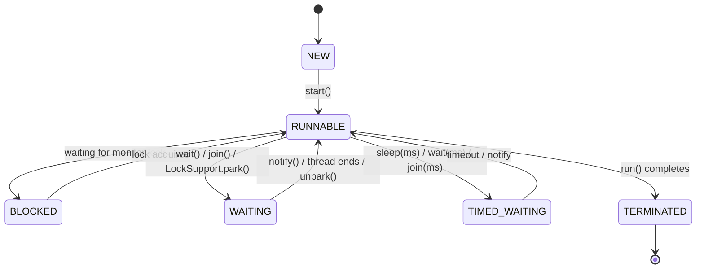
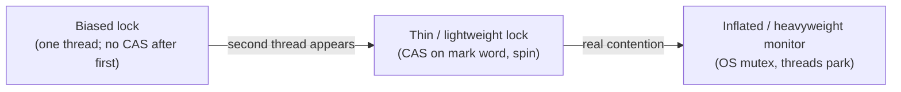
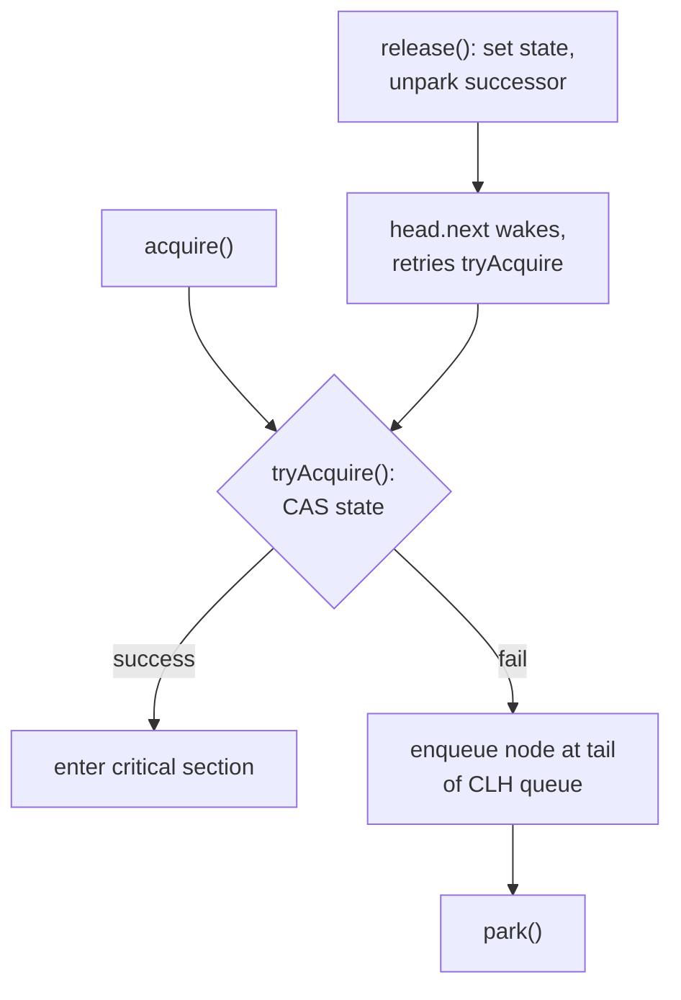
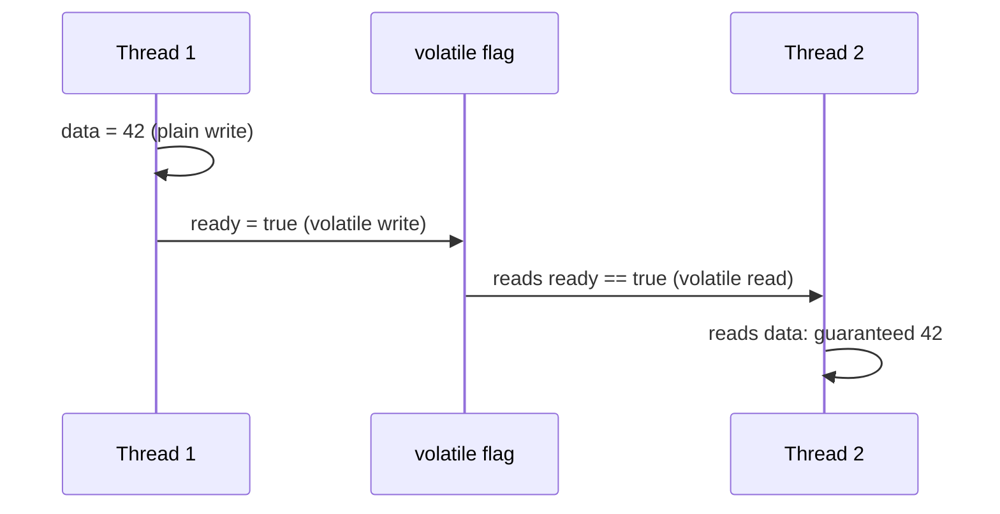
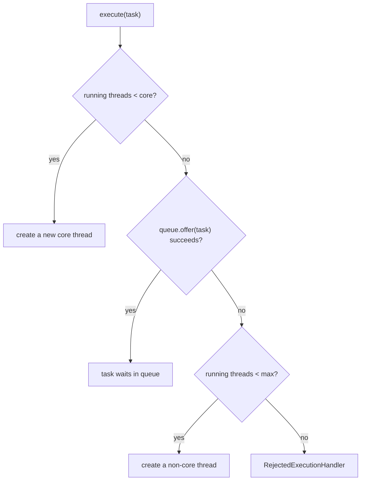
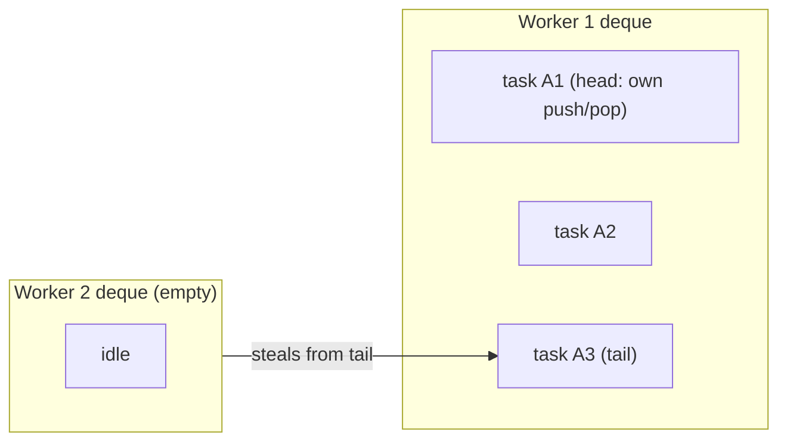
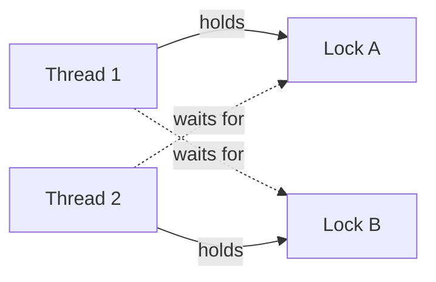
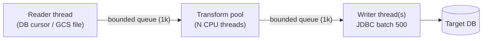

# Multithreading & Concurrency (Java 8): Interview Notes

**Why this matters in interviews:** Concurrency is where senior candidates separate themselves from the rest. Interviewers probe whether you understand *why* code is thread-safe (visibility, atomicity, ordering), not just which class to use. They also want proof that you have tuned real thread pools, debugged deadlocks, and pushed high-volume batch and event pipelines hard without melting a database.

Difficulty legend: 🟢 Basic · 🟡 Intermediate · 🔴 Advanced · ⚡ Scenario

## Table of Contents

1. [Thread Fundamentals](#1-thread-fundamentals)
2. [synchronized, Locks and Monitors](#2-synchronized-locks-and-monitors)
3. [Java Memory Model and volatile](#3-java-memory-model-and-volatile)
4. [Atomics and CAS](#4-atomics-and-cas)
5. [Executors and Thread Pools](#5-executors-and-thread-pools)
6. [CompletableFuture](#6-completablefuture)
7. [Concurrent Collections and Synchronizers](#7-concurrent-collections-and-synchronizers)
8. [Deadlocks, Liveness and Debugging](#8-deadlocks-liveness-and-debugging)
9. [Coding / Hands-on](#9-coding--hands-on)
10. [Production Scenarios](#10-production-scenarios)
11. [Cheat Sheet](#11-cheat-sheet)
12. [Revision Checklist](#12-revision-checklist)
13. [Beyond Java 8](#13-beyond-java-8)

---

## 1. Thread Fundamentals

> **Mental model:** A process is a *kitchen*, and threads are *chefs* sharing it. Every chef has a private notepad (the stack), and they all share the fridge (the heap). Chefs make progress in parallel, but two chefs grabbing the same pan at once is how accidents happen.

### Q1. 🟢 What is the difference between a process and a thread?

| | Process | Thread |
|---|---|---|
| Memory | Own address space | Shares heap with other threads of the process |
| Creation cost | High | Lower (still an OS thread in Java 8) |
| Communication | IPC (sockets, pipes) | Shared memory (needs synchronisation) |
| Crash impact | Isolated | An uncaught `Error` can take the JVM down |

<details><summary>Cross-questions</summary>

**Q:** Is a Java thread an OS thread?

**A:** In Java 8 on HotSpot, yes. Every `Thread` maps 1:1 to a native thread, and each one reserves stack memory (`-Xss`, 1 MB by default on 64-bit Linux).
</details>

### Q2. 🟢 What are the ways to create a thread?

1. Extend `Thread` and override `run()`.
2. Implement `Runnable` and pass it to a `Thread`.
3. Implement `Callable<V>` (which returns a value and can throw) and submit it to an `ExecutorService`.
4. Use `CompletableFuture.supplyAsync` or `runAsync`.

```java
import java.util.concurrent.Callable;
import java.util.concurrent.ExecutorService;
import java.util.concurrent.Executors;
import java.util.concurrent.Future;

public class CreateThreads {
    public static void main(String[] args) throws Exception {
        Thread t = new Thread(() -> System.out.println("runnable on " + Thread.currentThread().getName()));
        t.start();
        t.join();

        ExecutorService pool = Executors.newSingleThreadExecutor();
        Callable<Integer> task = () -> 42;
        Future<Integer> f = pool.submit(task);
        System.out.println("callable returned " + f.get());
        pool.shutdown();
    }
}
```

> [!TIP]
> Prefer `Runnable` or `Callable` plus an executor. Extending `Thread` couples the *task* to the *mechanism* and uses up your single inheritance slot.

<details><summary>Cross-questions</summary>

**Q:** What is the difference between `Runnable` and `Callable`?

**A:** `Callable` returns a value and can throw checked exceptions. `Runnable.run()` returns `void` and can't throw checked exceptions.
</details>

### Q3. 🟢 What is the difference between `start()` and `run()`?

`start()` asks the JVM to create a new thread, which then calls `run()`. Calling `run()` directly just executes the method on the **current** thread, with no concurrency at all.

#### 🎯 Predict the output

```java
public class StartVsRun {
    public static void main(String[] args) {
        Thread t = new Thread(() -> System.out.println(Thread.currentThread().getName()), "worker");
        t.run();
        t.start();
        try { t.start(); } catch (IllegalThreadStateException e) { System.out.println("ISE"); }
    }
}
```

<details><summary>Answer</summary>

`main` is printed first, because `run()` executed on the caller's thread. Then `worker` and `ISE` are printed, in either order. A thread can only be started **once**, so the second `start()` throws `IllegalThreadStateException`.
</details>

### Q4. 🟢 What are the thread states?



> [!NOTE]
> `RUNNABLE` in Java covers both "running" and "ready to run". A thread blocked on socket IO also shows as `RUNNABLE` in `jstack`, because the JVM can't see that it's waiting inside a native read.

<details><summary>Cross-questions</summary>

**Q:** What is the difference between BLOCKED and WAITING?

**A:** BLOCKED means the thread is trying to enter a `synchronized` block that someone else holds. WAITING means it voluntarily waits for a signal (`wait`, `join`, `park`). `ReentrantLock` waiters show as WAITING (parked), not BLOCKED.
</details>

### Q5. 🟢 How do `sleep()`, `wait()`, `join()` and `yield()` differ?

| Method | Class | Releases lock? | Purpose |
|---|---|---|---|
| `sleep(ms)` | `Thread` (static) | **No** | Pause current thread |
| `wait()` | `Object` | **Yes** (must hold it) | Wait for a condition |
| `join()` | `Thread` | N/A (uses `wait` on the thread object) | Wait for another thread to finish |
| `yield()` | `Thread` (static) | No | Hint to the scheduler; often a no-op |

<details><summary>Cross-questions</summary>

**Q:** Why must `wait()` be called inside `synchronized`?

**A:** Otherwise it throws `IllegalMonitorStateException`. The check-condition-then-wait sequence must be atomic with respect to the notifier, or you'll miss a signal (the lost-wakeup problem).
</details>

### Q6. 🟡 Why must `wait()` be called in a `while` loop?

There are two reasons. **Spurious wakeups** are allowed by the spec. And even after a genuine `notify`, another thread may consume the condition before you reacquire the lock.

```java
public class BoundedBuffer {
    private final Object lock = new Object();
    private String item;

    public void put(String s) throws InterruptedException {
        synchronized (lock) {
            while (item != null) lock.wait();   // while, NOT if
            item = s;
            lock.notifyAll();
        }
    }
    public String take() throws InterruptedException {
        synchronized (lock) {
            while (item == null) lock.wait();
            String s = item;
            item = null;
            lock.notifyAll();
            return s;
        }
    }
}
```

<details><summary>Cross-questions</summary>

**Q:** Should you use `notify()` or `notifyAll()`?

**A:** Default to `notifyAll()`. `notify()` wakes one arbitrary waiter, which may be waiting for a *different* condition. The signal is then lost and threads can hang. `notify()` is only safe when all waiters wait for the same condition and any one of them can proceed.
</details>

### Q7. 🟡 How does interruption work?

`t.interrupt()` sets a **flag**. It doesn't stop the thread. Blocking methods (`sleep`, `wait`, `join`, `BlockingQueue.take`) respond by throwing `InterruptedException` **and clearing the flag**. Your code must check the flag cooperatively.

#### 🎯 Predict the output

```java
public class InterruptFlag {
    public static void main(String[] args) {
        Thread.currentThread().interrupt();
        System.out.println(Thread.currentThread().isInterrupted());
        System.out.println(Thread.interrupted());
        System.out.println(Thread.interrupted());
    }
}
```

<details><summary>Answer</summary>

`true`, `true`, `false`. `isInterrupted()` only reads the flag. The static `Thread.interrupted()` reads **and clears** it.
</details>

<details><summary>Cross-questions</summary>

**Q:** What is the correct way to handle `InterruptedException` in a `Runnable`?

**A:** Restore the flag with `Thread.currentThread().interrupt()` and exit, so the code above you, such as an executor's `shutdownNow()`, knows about the interruption.

**Q:** Can you interrupt a thread blocked on classic `java.io` socket IO?

**A:** No. Close the socket instead, or use NIO interruptible channels.
</details>

### Q8. 🟢 What is a daemon thread?

It's a background thread that doesn't keep the JVM alive. When only daemon threads remain, the JVM exits, and **their `finally` blocks may never run**. Set it with `setDaemon(true)` *before* `start()`.

<details><summary>Cross-questions</summary>

**Q:** Should batch writers run as daemon threads?

**A:** No. You could lose data on shutdown. Use non-daemon threads plus an orderly shutdown hook, or executor `shutdown()` followed by `awaitTermination`.
</details>

### Q9. 🟢 What are thread priorities, and are they reliable?

They range from 1 to 10 (default 5). They're only hints, and the OS may ignore them (on Linux, by default, they're effectively ignored). Never rely on priorities for correctness.

<details><summary>Cross-questions</summary>

**Q:** How do you prioritise work in a pool instead?

**A:** Use a `PriorityBlockingQueue` as the work queue, or run separate pools per priority class.
</details>

### Q10. 🟡 How do you handle uncaught exceptions in threads?

An exception thrown from `run()` kills that thread, and by default its stack trace goes to `System.err`. Set a `Thread.UncaughtExceptionHandler` per thread, or a default one for all threads, so the error reaches your logger.

```java
import java.util.concurrent.ThreadFactory;
import java.util.concurrent.atomic.AtomicInteger;

public class NamedThreadFactory implements ThreadFactory {
    private final String prefix;
    private final AtomicInteger n = new AtomicInteger();
    public NamedThreadFactory(String prefix) { this.prefix = prefix; }
    @Override public Thread newThread(Runnable r) {
        Thread t = new Thread(r, prefix + "-" + n.incrementAndGet());
        t.setUncaughtExceptionHandler((th, ex) ->
            System.err.println("Uncaught in " + th.getName() + ": " + ex));
        return t;
    }
}
```

> [!TIP]
> Always give pools **named threads** (for example `ingest-kafka-3`). In a 400-thread dump at 3 a.m., names are the difference between minutes and hours.

<details><summary>Cross-questions</summary>

**Q:** Does the handler fire for tasks passed to `executor.submit()`?

**A:** No. `submit` wraps the task in a `FutureTask`, which captures the exception into the `Future`. It surfaces only when someone calls `get()`. `execute()` does reach the handler.
</details>

### Q11. 🟡 What is a race condition, and what is a data race?

A **race condition** means the result depends on timing, as in check-then-act (`if (!map.containsKey(k)) map.put(k, v)`) or read-modify-write (`count++`). A **data race**, in JMM terms, means two threads access the same variable, at least one of them writes, and nothing orders the accesses (no happens-before).

<details><summary>Cross-questions</summary>

**Q:** Why isn't `count++` atomic?

**A:** It's three steps: read, add, write. Two threads can both read 5 and both write 6, so an increment is lost.
</details>

### Q12. 🟡 What does thread-safe mean, and what are the strategies?

A class is thread-safe when it behaves correctly under concurrent access with no extra synchronisation from the caller. The strategies, from best to worst:

1. **Don't share**: thread confinement, local variables, `ThreadLocal`.
2. **Don't mutate**: immutable objects.
3. **Use thread-safe building blocks**: `ConcurrentHashMap`, atomics, `BlockingQueue`.
4. **Synchronise** access to shared mutable state.

<details><summary>Cross-questions</summary>

**Q:** Are Spring singleton beans thread-safe?

**A:** Only if they're stateless or use thread-safe fields. Spring doesn't synchronise anything for you.
</details>

### Q13. 🟢 What is context switching, and why does it matter?

The CPU saves one thread's registers and state and loads another's. That costs microseconds, plus cache pollution. Too many runnable threads means more time switching than working, which is why pool size matters.

<details><summary>Cross-questions</summary>

**Q:** How do you observe it?

**A:** Use `vmstat 1` (the `cs` column) or `pidstat -w` on Linux.
</details>

### Q14. 🟡 What is concurrency vs parallelism?

**Concurrency** is *dealing with* many things at once: structure and interleaving, possible on one core. **Parallelism** is *doing* many things at once, simultaneously, on multiple cores.

<details><summary>Cross-questions</summary>

**Q:** Which one did the batch optimisation need?

**A:** Both. It needed concurrency to overlap IO waits (DB and API calls), and parallelism to spread the CPU work (parsing and validation) across cores.
</details>

---

## 2. synchronized, Locks and Monitors

> **Mental model:** A monitor is a *single-occupancy bathroom with a key*. `synchronized` means "take the key, do your thing, return the key". `wait()` means "give the key back and nap in the waiting room until someone rings". `ReentrantLock` is the same bathroom with a smart lock: you can try it, time out, or be interrupted while you queue.

### Q15. 🟢 What does `synchronized` guarantee?

1. **Mutual exclusion**: only one thread at a time holds the monitor.
2. **Visibility**: releasing a monitor *happens-before* every later acquire of the same monitor, so writes made inside are visible to the next holder.
3. **Reentrancy**: the same thread can re-acquire a monitor it already holds.

```java
public class Counter {
    private long count;
    public synchronized void increment() { count++; }
    public synchronized long get() { return count; }   // reads need sync too, for visibility
}
```

<details><summary>Cross-questions</summary>

**Q:** Why must `get()` also be synchronised?

**A:** Without it, a reader may see a stale value. There's no happens-before edge to the writer.
</details>

### Q16. 🟢 Instance lock vs class lock?

A `synchronized` instance method locks `this`. A `static synchronized` method locks the `Class` object (`Counter.class`). They're **different** locks, so a static and an instance synchronised method can run at the same time.

<details><summary>Cross-questions</summary>

**Q:** Why prefer a private lock object over `synchronized(this)`?

**A:** External code can lock on your object and cause contention or deadlock. With `private final Object lock = new Object();` you own the lock completely.
</details>

### Q17. 🟡 What should you never lock on?

- **String literals** (they're interned, so shared across the whole JVM).
- **Boxed values** such as `Integer` (cached instances, and the reference changes when the value changes).
- **A non-final field** (after reassignment, different threads lock different objects).
- **`getClass()`** in an inheritable class (a subclass locks a different `Class`).

<details><summary>Cross-questions</summary>

**Q:** Can you give a real bug?

**A:** `synchronized (userId)` where `userId` is a `String` from a request. Equal strings may be different objects, so there's no mutual exclusion, while interned constants lock unrelated code. Use a striped lock or a `ConcurrentHashMap` of locks instead.
</details>

### Q18. 🔴 How is `synchronized` implemented, and what are lock states in Java 8?

`javac` emits `monitorenter` and `monitorexit` for blocks, and the `ACC_SYNCHRONIZED` flag for methods. HotSpot (Java 8) escalates the lock through three states:



> [!NOTE]
> Biased locking was on by default in Java 8, and was deprecated and disabled by default in Java 15. Revoking a bias needs a safepoint, which can appear as unexplained pauses in heavily contended apps.

<details><summary>Cross-questions</summary>

**Q:** What are lock elision and lock coarsening?

**A:** Both are JIT optimisations. **Elision** removes locks on objects that never escape a thread (proved by escape analysis), for example a local `StringBuffer`. **Coarsening** merges adjacent lock and unlock pairs on the same object into one.
</details>

### Q19. 🟡 `ReentrantLock` vs `synchronized`?

| Feature | synchronized | ReentrantLock |
|---|---|---|
| Unlock | Automatic | Manual, **in `finally`** |
| Try without blocking | No | `tryLock()` |
| Timeout | No | `tryLock(time, unit)` |
| Interruptible wait | No | `lockInterruptibly()` |
| Fairness | No | `new ReentrantLock(true)` |
| Multiple conditions | One wait set | Many `Condition`s |
| Diagnostics | jstack shows owner | `isLocked`, `getQueueLength` |

```java
import java.util.concurrent.TimeUnit;
import java.util.concurrent.locks.ReentrantLock;

public class Transfer {
    private final ReentrantLock lock = new ReentrantLock();
    private long balance = 100;

    public boolean withdraw(long amt) throws InterruptedException {
        if (!lock.tryLock(500, TimeUnit.MILLISECONDS)) return false; // don't wait forever
        try {
            if (balance < amt) return false;
            balance -= amt;
            return true;
        } finally {
            lock.unlock();
        }
    }
}
```

<details><summary>Cross-questions</summary>

**Q:** Why isn't fairness the default?

**A:** Fair locks hand over strictly in FIFO order, which forces a context switch on every hand-off. Throughput can drop sharply. Unfair locks allow **barging**, where a running thread grabs the lock before a parked one wakes, and that's faster.

**Q:** What happens if you forget `unlock()`?

**A:** The lock is held forever and every other thread hangs. Always unlock in `finally`, and call `lock()` **before** the `try`.
</details>

### Q20. 🟡 What is a `Condition`, and why is it better than `wait` and `notify`?

A `Condition` gives you **multiple wait sets per lock**, such as `notFull` and `notEmpty`. You can signal exactly the threads that care, instead of waking everyone with `notifyAll()`.

```java
import java.util.LinkedList;
import java.util.Queue;
import java.util.concurrent.locks.Condition;
import java.util.concurrent.locks.ReentrantLock;

public class BoundedQueue<T> {
    private final Queue<T> q = new LinkedList<T>();
    private final int cap;
    private final ReentrantLock lock = new ReentrantLock();
    private final Condition notFull = lock.newCondition();
    private final Condition notEmpty = lock.newCondition();

    public BoundedQueue(int cap) { this.cap = cap; }

    public void put(T t) throws InterruptedException {
        lock.lock();
        try {
            while (q.size() == cap) notFull.await();
            q.add(t);
            notEmpty.signal();
        } finally { lock.unlock(); }
    }
    public T take() throws InterruptedException {
        lock.lock();
        try {
            while (q.isEmpty()) notEmpty.await();
            T t = q.poll();
            notFull.signal();
            return t;
        } finally { lock.unlock(); }
    }
}
```

<details><summary>Cross-questions</summary>

**Q:** Which JDK class looks exactly like this?

**A:** `ArrayBlockingQueue`: one lock with `notEmpty` and `notFull` conditions.
</details>

### Q21. 🟡 `ReadWriteLock`: when does it help?

`ReentrantReadWriteLock` lets **many readers** hold the lock together, while a **writer** gets exclusive access. It helps with read-mostly data that has expensive reads, such as a config map refreshed rarely.

<details><summary>Cross-questions</summary>

**Q:** Can a reader upgrade to a write lock?

**A:** No. Trying to acquire the write lock while holding the read lock **deadlocks**. Downgrading is allowed: take the write lock, take the read lock, then release the write lock.

**Q:** When is it slower than a plain lock?

**A:** With short critical sections or many writers. The bookkeeping overhead dominates.
</details>

### Q22. 🔴 What is `StampedLock` (Java 8)?

It supports write, read and **optimistic read** modes. An optimistic read takes no lock at all: you read, then call `validate(stamp)` to check that no write happened in between.

```java
import java.util.concurrent.locks.StampedLock;

public class Point {
    private double x, y;
    private final StampedLock sl = new StampedLock();

    public void move(double dx, double dy) {
        long stamp = sl.writeLock();
        try { x += dx; y += dy; } finally { sl.unlockWrite(stamp); }
    }
    public double distanceFromOrigin() {
        long stamp = sl.tryOptimisticRead();
        double cx = x, cy = y;
        if (!sl.validate(stamp)) {                 // a write happened: fall back
            stamp = sl.readLock();
            try { cx = x; cy = y; } finally { sl.unlockRead(stamp); }
        }
        return Math.sqrt(cx * cx + cy * cy);
    }
}
```

> [!WARNING]
> `StampedLock` is **not reentrant** and has no `Condition`s. Re-acquiring it on the same thread deadlocks.

<details><summary>Cross-questions</summary>

**Q:** When would you choose it?

**A:** For very read-heavy, hot data where even read-lock CAS contention shows up in profiles.
</details>

### Q23. 🟡 What does reentrancy mean, and why does it matter?

A thread holding a lock can acquire it again, and a hold count tracks how many times. Without reentrancy, a synchronised method calling another synchronised method on the same object would deadlock with itself. That includes overriding methods that call `super`.

<details><summary>Cross-questions</summary>

**Q:** How many `unlock()` calls do you need after three `lock()` calls?

**A:** Three.
</details>

### Q24. 🟡 How do you minimise lock contention?

- **Shrink** critical sections: do IO and expensive computation outside the lock.
- **Split** locks (separate locks for independent state) or **stripe** them (N locks keyed by hash, the way `ConcurrentHashMap` does).
- Use **lock-free** structures (atomics, `LongAdder`, `ConcurrentLinkedQueue`).
- Use **immutable snapshots** with copy-on-write for read-mostly data.
- Batch updates so you lock once per batch, not once per item.

<details><summary>Cross-questions</summary>

**Q:** How do you *see* contention?

**A:** Look for many threads `BLOCKED` on the same monitor in `jstack` ("waiting to lock <0x...>"), or use JFR's lock contention events.
</details>

### Q25. 🟡 Can two threads call two different `synchronized` methods of the same object at the same time?

No. Both lock `this`. They can, however, call one synchronised method and one **unsynchronised** method at the same time, or two methods that lock different objects.

<details><summary>Cross-questions</summary>

**Q:** Is `Collections.synchronizedList(list).stream()` safe?

**A:** No. Streaming (like iterating) isn't covered by the per-method lock. You must `synchronized(list)` around it.
</details>

### Q26. 🟡 What is `LockSupport.park()` and `unpark()`?

They're the low-level primitives under `ReentrantLock`, the AQS family, and `FutureTask`. `park` blocks the current thread unless it has a *permit*. `unpark(t)` gives `t` a permit, and it can be called **before** `park` without losing the signal (unlike `notify`).

<details><summary>Cross-questions</summary>

**Q:** What is AQS?

**A:** `AbstractQueuedSynchronizer`. It holds an `int state` and a FIFO queue of parked threads, and it's the framework behind `ReentrantLock`, `Semaphore`, `CountDownLatch` and `ReentrantReadWriteLock`.
</details>

### Q27. 🔴 How does AQS work, at a high level?



Subclasses define what `state` means. For `ReentrantLock` it's the hold count, for `Semaphore` the permits, and for `CountDownLatch` the remaining count.

<details><summary>Cross-questions</summary>

**Q:** What is the difference between exclusive and shared mode?

**A:** Exclusive mode admits one owner (a lock). Shared mode can let several threads acquire at once (Semaphore permits, a latch reaching 0, RW read locks).
</details>

### Q28. 🟡 Is `synchronized` slow?

Not in modern JVMs when **uncontended**. Biased and thin locks are cheap. The cost comes from **contention**: parking, context switches and cache-line bouncing. Profile before replacing it.

<details><summary>Cross-questions</summary>

**Q:** Is there a Java 8 pitfall with `synchronized` and long IO?

**A:** Holding a monitor during a DB or HTTP call serialises every caller behind the slowest request. Move the IO outside the lock.
</details>

---

## 3. Java Memory Model and volatile

> **Mental model:** Each CPU core works from its own *whiteboard* (cache and registers), and the compiler and CPU may rearrange your steps to go faster. The JMM is the *contract* that says when one core's whiteboard edits must be visible on another's. **Happens-before** is the "copy this over now" rule.

### Q29. 🟡 What are the three concurrency problems the JMM addresses?

1. **Atomicity**: an operation happens all at once or not at all.
2. **Visibility**: a write by one thread becomes visible to others.
3. **Ordering**: the compiler, JIT and CPU may reorder instructions that look independent.

<details><summary>Cross-questions</summary>

**Q:** Which of the three does `volatile` solve?

**A:** Visibility and ordering. It doesn't make compound actions atomic.
</details>

### Q30. 🔴 What are the key happens-before rules?

- **Program order**: each action in a thread happens-before the later actions in that thread.
- **Monitor lock**: an unlock happens-before every later lock of the same monitor.
- **volatile**: a write happens-before every later read of the same variable.
- **Thread start**: `t.start()` happens-before any action in `t`.
- **Thread join**: every action in `t` happens-before `t.join()` returns.
- **Transitivity**: if A → B and B → C, then A → C.
- Also: `Executor.submit` → task execution, task completion → `Future.get` returning, and concurrent-collection `put` → later `get`.



<details><summary>Cross-questions</summary>

**Q:** Why is `data` visible even though it isn't volatile?

**A:** Program order gives `data=42` → the volatile write. The volatile rule gives the write → the read. Program order in thread 2 gives the read → the `data` read. By transitivity, thread 2 sees 42. This is called **piggybacking** on volatile.
</details>

### Q31. 🟢 What does `volatile` guarantee, and what doesn't it?

| Guarantees | Doesn't guarantee |
|---|---|
| Every read sees the latest write | Atomicity of `x++` or check-then-act |
| No reordering across the volatile access (acts as a fence) | Mutual exclusion |
| Atomic reads and writes of `long` and `double` | Safety for compound invariants across several fields |

The classic valid use is a **stop flag**:

```java
public class Worker implements Runnable {
    private volatile boolean running = true;
    public void stop() { running = false; }
    @Override public void run() {
        while (running) {
            // poll and process
        }
    }
}
```

<details><summary>Cross-questions</summary>

**Q:** What happens to the loop if `running` isn't volatile?

**A:** The JIT may hoist the read out of the loop, so it becomes `if (running) while (true)`. The thread then never stops. This bug often shows up only on the server JIT, not in a debugger.

**Q:** Are `long` and `double` writes atomic without volatile?

**A:** Not guaranteed. The JLS allows a 64-bit write to be split into two 32-bit halves (word tearing), though 64-bit JVMs don't do it in practice.
</details>

### Q32. 🟡 `volatile` vs `synchronized` vs `Atomic*`?

| Need | Use |
|---|---|
| One writer, many readers of a flag or reference | `volatile` |
| Single-variable read-modify-write (counter, max) | `AtomicLong`, `LongAdder`, `AtomicReference` |
| Invariant spanning multiple fields | `synchronized` or `Lock` |

<details><summary>Cross-questions</summary>

**Q:** Can two `volatile` fields keep an invariant like `lower <= upper`?

**A:** No. Each field is individually visible, but a reader can see the new `lower` with the old `upper`. Lock them together, or hold them in one immutable object behind an `AtomicReference`.
</details>

### Q33. 🔴 What is safe publication?

An object is **safely published** when another thread sees both the reference and a fully constructed state. The ways to do it:

- Initialise it from a static initialiser.
- Store the reference in a `volatile` field or an `AtomicReference`.
- Store it in a `final` field of a properly constructed object.
- Store it in a field guarded by a lock, or put it into a concurrent collection.

<details><summary>Cross-questions</summary>

**Q:** What's unsafe publication?

**A:** Assigning to a plain field that another thread reads. The reader may see a non-null reference whose fields still hold default values, because of reordering.

**Q:** What does "`this` escaping" mean?

**A:** Registering a listener or starting a thread from inside a constructor. Other threads can then see a half-built object, and even the `final` field guarantees don't apply.
</details>

### Q34. 🟡 What is instruction reordering? Can you show it?

The compiler or CPU may execute `a = 1; flag = true;` as `flag = true; a = 1;`, because they look independent to a single thread. A second thread reading `flag` then `a` might see `flag == true` and `a == 0`. Making `flag` volatile forbids this reordering.

<details><summary>Cross-questions</summary>

**Q:** Why does double-checked locking need `volatile`?

**A:** `instance = new X()` is allocate → construct → assign. Without volatile, the *assign* step can become visible before *construct* has finished.
</details>

### Q35. 🟡 What is false sharing?

Two threads write **different** variables that sit on the **same cache line** (64 bytes). Each write invalidates the other core's line, so throughput collapses even though there's no logical sharing. Java 8 has `@sun.misc.Contended`, which needs `-XX:-RestrictContended` for user code. `LongAdder`'s cells are padded for exactly this reason.

<details><summary>Cross-questions</summary>

**Q:** How would you notice it?

**A:** Adding threads makes throughput *worse* even with no lock contention. Hardware counters (perf) show high cache-miss rates.
</details>

### Q36. 🟡 What are `ThreadLocal`'s correct uses?

- **Per-thread non-thread-safe helpers**: `SimpleDateFormat` in Java 7, a `MessageDigest`.
- **Request context propagation**: trace ID, user, transaction (Spring's `SecurityContextHolder` and `TransactionSynchronizationManager` both use it).

Always call `remove()` in `finally` when you're on pooled threads.

<details><summary>Cross-questions</summary>

**Q:** What is `InheritableThreadLocal`?

**A:** Child threads copy the parent's value **at thread creation**. That's useless with pools, where threads are created once and reused. You need a task decorator instead.
</details>

### Q37. 🔴 What guarantees do `final` fields provide?

After a constructor finishes, other threads that get the reference through *any* path (even a data race) see the correctly initialised values of `final` fields, and of anything reachable through them as of construction time. That holds as long as `this` didn't escape. This is the foundation of immutable objects being thread-safe.

<details><summary>Cross-questions</summary>

**Q:** Does this cover a `final List` whose contents change later?

**A:** No. Only the state at the end of construction is guaranteed. Later mutations need their own synchronisation.
</details>

### Q38. 🟡 Why can `System.out.println` in a loop "fix" a visibility bug?

`PrintStream.println` is synchronised internally, so it adds lock operations to the loop. In practice that stops the JIT from hoisting the read, so the bug appears to go away. It's accidental, **not guaranteed**, and it disappears as soon as you remove the logging. Fix the real problem with `volatile`.

<details><summary>Cross-questions</summary>

**Q:** Why is this a warning sign during debugging?

**A:** It's a Heisenbug: observing it changes the behaviour. When one appears, suspect visibility or data-race problems.
</details>

---
## 4. Atomics and CAS

> **Mental model:** CAS is a *polite edit*. It says "change this value to 6, but only if it's still 5". If someone else changed it first, you re-read and try again. No one ever waits in a queue, but under heavy contention everyone keeps retrying.

### Q39. 🟡 What is CAS, and how do atomics use it?

**Compare-And-Swap** is a CPU instruction (`cmpxchg` on x86) that atomically sets a memory location to a new value only if it still holds the expected value. `AtomicInteger.incrementAndGet()` is a CAS loop:

```java
import java.util.concurrent.atomic.AtomicInteger;

public class CasLoop {
    private final AtomicInteger value = new AtomicInteger();

    // What incrementAndGet conceptually does:
    public int increment() {
        for (;;) {
            int current = value.get();
            int next = current + 1;
            if (value.compareAndSet(current, next)) return next;
        }
    }
}
```

> [!NOTE]
> In Java 8, `AtomicInteger.getAndIncrement` is implemented with `Unsafe.getAndAddInt`, which the JIT turns into a single `lock xadd` instruction on x86. There's no retry loop at the hardware level.

<details><summary>Cross-questions</summary>

**Q:** Is CAS always faster than locks?

**A:** When contention is low to moderate, yes. Under very high contention, threads burn CPU retrying. `LongAdder` spreads the contention across cells.
</details>

### Q40. 🟡 `AtomicLong` vs `LongAdder`?

| | AtomicLong | LongAdder |
|---|---|---|
| Internals | One CAS'd value | Base + array of padded **cells**; threads hash to different cells |
| Write under contention | Degrades (retries) | Scales well |
| `sum()` | Exact, immediate | Sums the cells; **not an atomic snapshot** during concurrent updates |
| Use for | Sequence IDs, CAS logic | Metrics and counters (events processed) |

<details><summary>Cross-questions</summary>

**Q:** Can `LongAdder` generate unique IDs?

**A:** No. It has no `incrementAndGet` that returns a unique value. Use `AtomicLong`.
</details>

### Q41. 🔴 What is the ABA problem?

A thread reads A. Another thread changes the value A → B → A. The first thread's CAS succeeds even though the state changed in between. This matters for lock-free stacks and queues built on node references. **Fix:** `AtomicStampedReference`, which pairs the value with a version stamp.

<details><summary>Cross-questions</summary>

**Q:** Does ABA matter for a simple counter?

**A:** No. Only the value matters there, not its history.
</details>

### Q42. 🟡 How does `AtomicReference` help with immutable state?

Hold an **immutable snapshot** in an `AtomicReference`, then use a CAS loop (or `updateAndGet`) to swap in a new snapshot. That keeps multi-field invariants consistent without a lock.

```java
import java.util.concurrent.atomic.AtomicReference;

public class Range {
    private static final class Bounds {
        final int lo, hi;
        Bounds(int lo, int hi) { this.lo = lo; this.hi = hi; }
    }
    private final AtomicReference<Bounds> ref = new AtomicReference<Bounds>(new Bounds(0, 10));

    public void setLower(int lo) {
        ref.updateAndGet(b -> {
            if (lo > b.hi) throw new IllegalArgumentException("lo > hi");
            return new Bounds(lo, b.hi);
        });
    }
}
```

<details><summary>Cross-questions</summary>

**Q:** Why must the `updateAndGet` function have no side effects?

**A:** It may be called **several times** when the CAS retries.
</details>

### Q43. 🟡 Which atomic classes exist besides `AtomicInteger`?

- `AtomicBoolean`, `AtomicLong`, `AtomicReference`.
- The array versions: `AtomicIntegerArray`, `AtomicLongArray`, `AtomicReferenceArray`.
- The field updaters `AtomicIntegerFieldUpdater` and `AtomicReferenceFieldUpdater`, which run CAS against a `volatile` field and save memory when you have millions of objects.
- The Java 8 accumulators: `LongAdder`, `LongAccumulator`, `DoubleAdder`, `DoubleAccumulator`.

<details><summary>Cross-questions</summary>

**Q:** What does `LongAccumulator` add?

**A:** A custom associative function. For example, `new LongAccumulator(Long::max, Long.MIN_VALUE)` tracks the maximum latency seen.
</details>

### Q44. 🟡 How do you build a one-time initialisation guard with `AtomicBoolean`?

```java
import java.util.concurrent.atomic.AtomicBoolean;

public class Once {
    private final AtomicBoolean started = new AtomicBoolean(false);
    public void startOnce(Runnable r) {
        if (started.compareAndSet(false, true)) r.run();
    }
}
```

<details><summary>Cross-questions</summary>

**Q:** Is there a problem with this pattern?

**A:** Other callers return immediately, even while the initialisation is still running. If they need the result, use a `CountDownLatch` or a `CompletableFuture` that they wait on.
</details>

### Q45. 🟡 What does "lock-free" mean vs "wait-free"?

**Lock-free** means that at least one thread always makes progress; others may retry. **Wait-free** means every thread finishes in a bounded number of steps. Most JDK atomics are lock-free. `ConcurrentLinkedQueue` is lock-free, based on Michael-Scott.

<details><summary>Cross-questions</summary>

**Q:** Why does it matter?

**A:** A thread that's pre-empted while holding a lock can stall everyone. Lock-free structures don't have that failure mode.
</details>

---

## 5. Executors and Thread Pools

> **Mental model:** A thread pool is a *taxi company*. **Core threads** are the full-time drivers, the **queue** is the waiting line of passengers, and **max threads** are part-time drivers who are only called in when the line is *full*. The **rejection policy** decides what happens when the line overflows.

### Q46. 🟡 What are the `ThreadPoolExecutor` parameters?

```java
import java.util.concurrent.ArrayBlockingQueue;
import java.util.concurrent.ThreadPoolExecutor;
import java.util.concurrent.TimeUnit;

public class PoolFactory {
    public static ThreadPoolExecutor ingestPool() {
        return new ThreadPoolExecutor(
            8,                                   // corePoolSize
            16,                                  // maximumPoolSize
            60, TimeUnit.SECONDS,                // keepAliveTime for threads above core
            new ArrayBlockingQueue<Runnable>(500),        // BOUNDED work queue
            new NamedThreadFactory("ingest"),             // see Q10
            new ThreadPoolExecutor.CallerRunsPolicy());   // backpressure on overflow
    }
}
```

<details><summary>Cross-questions</summary>

**Q:** Can core threads time out?

**A:** Only if you call `allowCoreThreadTimeOut(true)`.

**Q:** Are core threads started eagerly?

**A:** No, they start lazily as tasks arrive. `prestartAllCoreThreads()` starts them all up front.
</details>

### Q47. 🔴 In what order does `ThreadPoolExecutor` handle a new task?



> [!WARNING]
> The pool **fills the queue before it grows beyond core**. With an unbounded `LinkedBlockingQueue`, `maximumPoolSize` is **never used**. That surprises a lot of people who expect extra threads to appear under load.

<details><summary>Cross-questions</summary>

**Q:** How do you make a pool grow threads *before* queueing?

**A:** Use a `SynchronousQueue` (direct hand-off, as in `newCachedThreadPool`), or a custom queue whose `offer` returns `false` while `poolSize < max`, as Tomcat's `TaskQueue` does.
</details>

### Q48. 🔴 Why are the `Executors` factory methods dangerous in production?

| Factory | Hidden config | Risk |
|---|---|---|
| `newFixedThreadPool(n)` | **Unbounded** `LinkedBlockingQueue` | Queue grows without limit → OOM |
| `newSingleThreadExecutor()` | Unbounded queue | Same |
| `newCachedThreadPool()` | max = `Integer.MAX_VALUE`, `SynchronousQueue` | Unlimited threads → "unable to create native thread" |
| `newScheduledThreadPool(n)` | Unbounded delay queue | Queue growth |

> [!TIP]
> Say it like a senior engineer: "In production I construct `ThreadPoolExecutor` directly, with a bounded queue, named threads, an explicit rejection policy and metrics on active count and queue depth. The factory methods hide unbounded resources."

<details><summary>Cross-questions</summary>

**Q:** Is `newFixedThreadPool` ever OK?

**A:** Yes, for bounded, controlled inputs such as a CLI tool or tests, where the number of tasks is known.
</details>

### Q49. 🟡 What rejection policies are there?

| Policy | Behaviour | Use when |
|---|---|---|
| `AbortPolicy` (default) | Throws `RejectedExecutionException` | Caller can handle or retry |
| `CallerRunsPolicy` | Submitting thread runs the task | **Natural backpressure** for producers |
| `DiscardPolicy` | Silently drops | Almost never; data loss |
| `DiscardOldestPolicy` | Drops head of queue, retries | Latest-value-wins (e.g., UI refresh) |

<details><summary>Cross-questions</summary>

**Q:** Is there a trap with `CallerRunsPolicy` in a web server?

**A:** The request thread (or a Kafka listener thread) runs the task itself, so its latency goes up and it may exceed `max.poll.interval.ms`. That's backpressure working as designed, but you need to plan for it.
</details>

### Q50. 🟡 How do you size a thread pool?

- **CPU-bound:** threads ≈ number of cores (or cores + 1).
- **IO-bound:** threads ≈ cores × (1 + wait time / compute time). This is Brian Goetz's formula.
- **Bounded by downstream:** never more concurrent DB tasks than **connection pool size**. Extra threads just queue on `getConnection()`.

> [!TIP]
> Say it like a senior engineer: "Formulas give a starting point. I load-test at 0.5×, 1× and 2× that value and pick the knee of the throughput and latency curve, watching DB CPU and connection wait time."

<details><summary>Cross-questions</summary>

**Q:** Why would 200 threads against a 10-connection Hikari pool be bad?

**A:** 190 threads block waiting for a connection (up to `connectionTimeout`), which adds memory, context switches and timeout errors without any extra throughput.

**Q:** What does `availableProcessors()` return in a Docker container on Java 8?

**A:** On 8u191+, the container's CPU limit. On older builds, the host's core count, which led to oversized pools.
</details>

### Q51. 🟡 `execute()` vs `submit()`?

| | execute(Runnable) | submit(Runnable/Callable) |
|---|---|---|
| Returns | void | `Future` |
| Exception | Propagates → thread dies → UncaughtExceptionHandler | **Captured in the Future**; silent unless `get()` is called |

#### 🎯 Predict the output

```java
import java.util.concurrent.ExecutorService;
import java.util.concurrent.Executors;
import java.util.concurrent.TimeUnit;

public class SwallowedException {
    public static void main(String[] args) throws InterruptedException {
        ExecutorService pool = Executors.newSingleThreadExecutor();
        pool.submit(() -> { throw new IllegalStateException("boom"); });
        pool.shutdown();
        pool.awaitTermination(1, TimeUnit.SECONDS);
        System.out.println("done");
    }
}
```

<details><summary>Answer</summary>

Only `done` is printed. The exception is stored inside the `Future`, which nobody reads, so it vanishes. This is a classic cause of "the batch silently skipped records". Always call `get()`, or wrap tasks with try/catch and logging.
</details>

### Q52. 🟡 `shutdown()` vs `shutdownNow()` vs `awaitTermination()`?

- `shutdown()` stops accepting new tasks and lets queued and running tasks finish.
- `shutdownNow()` interrupts running tasks and **returns the queued tasks** that never ran.
- `awaitTermination(t)` blocks until everything finishes or the timeout passes.

```java
import java.util.concurrent.ExecutorService;
import java.util.concurrent.TimeUnit;

public final class Shutdown {
    public static void gracefully(ExecutorService pool) {
        pool.shutdown();
        try {
            if (!pool.awaitTermination(30, TimeUnit.SECONDS)) {
                pool.shutdownNow();
                pool.awaitTermination(10, TimeUnit.SECONDS);
            }
        } catch (InterruptedException e) {
            pool.shutdownNow();
            Thread.currentThread().interrupt();
        }
    }
}
```

<details><summary>Cross-questions</summary>

**Q:** Does `shutdownNow()` guarantee that tasks stop?

**A:** No. It only interrupts them. Tasks that ignore interruption keep running.
</details>

### Q53. 🟡 How does `Future` work, and what are its limitations?

`Future` gives you `get()` (blocking, with an optional timeout), `cancel()`, `isDone()` and `isCancelled()`. It can't be composed, has no callbacks, can't be completed manually, and combining several futures means blocking on each one. `CompletableFuture` fixes all of this.

<details><summary>Cross-questions</summary>

**Q:** What does `cancel(true)` do?

**A:** It interrupts the running thread when the task has started. `cancel(false)` only prevents a task that hasn't started from running.
</details>

### Q54. 🟡 `ScheduledExecutorService`: `scheduleAtFixedRate` vs `scheduleWithFixedDelay`?

- **Fixed rate** starts runs at t0, t0+p, t0+2p. If a run takes longer than the period, the next one starts late, and runs never overlap.
- **Fixed delay** waits the delay *after each run finishes*.

> [!WARNING]
> If a scheduled task **throws**, all later runs are **silently cancelled**. Wrap the body in try/catch.

<details><summary>Cross-questions</summary>

**Q:** Why not use `java.util.Timer`?

**A:** It has a single thread, an exception in one task kills the timer for every task, and it depends on the system clock.
</details>

### Q55. 🔴 What is `ForkJoinPool`, and how does work stealing work?

Each worker has its own **deque**. It pushes and pops its own tasks from the head (LIFO, which is cache-friendly). Idle workers **steal** from the *tail* of other workers' deques (FIFO, which takes big chunks). It's designed for recursive divide-and-conquer tasks (`RecursiveTask`).



<details><summary>Cross-questions</summary>

**Q:** Why is blocking inside a FJ task bad?

**A:** The pool has a fixed number of threads (the parallelism level). A blocked worker isn't replaced unless you use `ManagedBlocker`, so the whole common pool, shared by parallel streams and `CompletableFuture` async methods, can stall.
</details>

### Q56. 🟡 What does `invokeAll` vs `invokeAny` do?

- `invokeAll(tasks)` waits for **all** tasks and returns their futures in order. An overload takes a timeout and cancels the stragglers.
- `invokeAny(tasks)` returns the result of the **first** task that succeeds, and cancels the rest.

<details><summary>Cross-questions</summary>

**Q:** Where would `invokeAny` be useful?

**A:** For hedged requests: query two replicas and take the fastest answer.
</details>

### Q57. 🟡 How do you monitor a thread pool?

Expose `getActiveCount()`, `getQueue().size()`, `getCompletedTaskCount()`, `getPoolSize()` and `getLargestPoolSize()`, plus the rejection count (from a wrapped handler), through Micrometer gauges. Alert on queue depth or rejections, not just on errors.

<details><summary>Cross-questions</summary>

**Q:** How do you measure task latency, including time spent in the queue?

**A:** Wrap tasks so they record the submit timestamp, then measure queue wait and execution time separately. Override `beforeExecute` and `afterExecute`, or use Micrometer's `ExecutorServiceMetrics`.
</details>

### Q58. 🟡 How does `@Async` work in Spring, and what are the pitfalls?

`@EnableAsync` plus `@Async` wraps the bean in a proxy that submits the call to a `TaskExecutor`.

- **Self-invocation** (`this.asyncMethod()`) bypasses the proxy, so the method runs synchronously.
- Spring Boot 2.1+ auto-configures a `ThreadPoolTaskExecutor` (core 8, **unbounded queue**). Without Boot's auto-config, plain Spring falls back to `SimpleAsyncTaskExecutor`, which creates **a new thread per task**. Define your own bounded executor.
- Exceptions from `void` `@Async` methods go to an `AsyncUncaughtExceptionHandler`. Return a `CompletableFuture` so callers see failures.
- `SecurityContext` and MDC don't propagate automatically. Use a `TaskDecorator` or `DelegatingSecurityContextAsyncTaskExecutor`.

<details><summary>Cross-questions</summary>

**Q:** Does `@Transactional` carry over into an `@Async` method?

**A:** No. Transactions are bound to a thread through `ThreadLocal`, so the async method needs its own transaction.
</details>

### Q59. 🟡 What is a `TaskDecorator`, and why use it?

It wraps every `Runnable` submitted to a Spring `ThreadPoolTaskExecutor`. That's the place to copy **MDC** (trace IDs) and the security context from the submitting thread to the worker, and to clear them afterwards.

```java
import java.util.Map;
import org.slf4j.MDC;
import org.springframework.core.task.TaskDecorator;

public class MdcTaskDecorator implements TaskDecorator {
    @Override public Runnable decorate(Runnable r) {
        final Map<String, String> ctx = MDC.getCopyOfContextMap();
        return () -> {
            Map<String, String> previous = MDC.getCopyOfContextMap();
            if (ctx != null) MDC.setContextMap(ctx); else MDC.clear();
            try { r.run(); }
            finally {
                if (previous != null) MDC.setContextMap(previous); else MDC.clear();
            }
        };
    }
}
```

<details><summary>Cross-questions</summary>

**Q:** Why restore the previous context and not just clear it?

**A:** With `CallerRunsPolicy`, the task can run on the *caller's* thread. Clearing would wipe the caller's own MDC.
</details>

### Q60. 🔴 How do you process messages in parallel but keep per-key ordering?

Route each key to a fixed **single-threaded lane**: `lane = abs(hash(key) % N)`, where each lane is a single-thread executor or a queue with one worker. Events for the same user or device stay ordered, and different keys run in parallel. This is exactly how Kafka partitions work.

```java
import java.util.ArrayList;
import java.util.List;
import java.util.concurrent.ExecutorService;
import java.util.concurrent.Executors;

public class KeyedExecutor {
    private final List<ExecutorService> lanes = new ArrayList<ExecutorService>();
    public KeyedExecutor(int n) {
        for (int i = 0; i < n; i++) lanes.add(Executors.newSingleThreadExecutor());
    }
    public void submit(String key, Runnable task) {
        int lane = (key.hashCode() & 0x7fffffff) % lanes.size();
        lanes.get(lane).execute(task);
    }
    public void shutdown() { for (ExecutorService e : lanes) e.shutdown(); }
}
```

<details><summary>Cross-questions</summary>

**Q:** Why `& 0x7fffffff` rather than `Math.abs`?

**A:** `Math.abs(Integer.MIN_VALUE)` is still negative, which would give a negative index.

**Q:** What's the risk?

**A:** A hot key overloads a single lane. Also, the production version needs bounded queues per lane (these are unbounded).
</details>

### Q61. 🟡 Can a task submitted to a pool wait on another task in the same pool?

It's dangerous. If every thread is waiting on tasks that are still sitting in the queue, the pool **deadlocks** (thread-starvation deadlock). Use separate pools for dependent stages, or non-blocking composition (`thenCompose`).

<details><summary>Cross-questions</summary>

**Q:** How does this show up in `jstack`?

**A:** Every pool thread is in `WAITING` on `FutureTask.get`, the queue is non-empty, and CPU is at zero.
</details>

### Q62. 🟡 Why should you isolate pools per dependency (bulkheads)?

A slow downstream (say, a reporting DB) can occupy every thread in a shared pool and starve unrelated work. **Separate pools** per downstream contain the failure, the same way a ship's bulkheads contain a flood.

<details><summary>Cross-questions</summary>

**Q:** Which library formalises this?

**A:** Resilience4j `Bulkhead` (semaphore or thread-pool based), usually combined with timeouts and circuit breakers.
</details>

---

## 6. CompletableFuture

> **Mental model:** A `CompletableFuture` is an *order receipt with instructions attached*: "when the pizza's ready, box it (`thenApply`), then call a driver (`thenCompose`), and if the oven breaks, give a refund (`exceptionally`)". You never stand at the counter blocking.

### Q63. 🟡 What are the key `CompletableFuture` methods?

| Method | Input → Output | Analogy |
|---|---|---|
| `supplyAsync(s)` | start with value | kick off async |
| `thenApply(f)` | T → U | `map` |
| `thenCompose(f)` | T → CF<U> | `flatMap` (async chaining) |
| `thenCombine(cf, bf)` | (T, U) → V | zip two independent results |
| `thenAccept(c)` / `thenRun(r)` | consume / run | side effect |
| `allOf(cfs...)` | → CF<Void> | wait for all |
| `anyOf(cfs...)` | → CF<Object> | first to complete |
| `exceptionally(f)` | Throwable → T | recover |
| `handle(bf)` | (T, Throwable) → U | recover or transform |
| `whenComplete(bc)` | (T, Throwable) → same | peek (logging) |

```java
import java.util.concurrent.CompletableFuture;
import java.util.concurrent.ExecutorService;
import java.util.concurrent.Executors;

public class CfDemo {
    public static void main(String[] args) {
        ExecutorService io = Executors.newFixedThreadPool(4);
        CompletableFuture<String> user = CompletableFuture.supplyAsync(() -> "user-7", io);
        CompletableFuture<Integer> score = CompletableFuture.supplyAsync(() -> 88, io);

        String result = user.thenCombine(score, (u, s) -> u + " scored " + s)
                            .thenApply(String::toUpperCase)
                            .exceptionally(ex -> "fallback")
                            .join();
        System.out.println(result); // USER-7 SCORED 88
        io.shutdown();
    }
}
```

<details><summary>Cross-questions</summary>

**Q:** What's the difference between `join()` and `get()`?

**A:** `join()` throws an unchecked `CompletionException`. `get()` throws the checked `ExecutionException` and `InterruptedException`, and has a timeout overload.
</details>

### Q64. 🔴 Which thread runs `thenApply` vs `thenApplyAsync`?

- `thenApply` runs **on the thread that completes the previous stage**. If that stage is already complete when you attach it, it runs **on the calling thread**.
- `thenApplyAsync(f)` runs on `ForkJoinPool.commonPool()`.
- `thenApplyAsync(f, executor)` runs on the executor you pass.

> [!WARNING]
> `supplyAsync(supplier)` without an executor uses the **common pool**. Blocking IO there (JDBC, HTTP) starves parallel streams and every other async user in the JVM. Always pass a dedicated executor for IO.

<details><summary>Cross-questions</summary>

**Q:** What if the common pool parallelism is 1, for example on a 2-core container?

**A:** Then `CompletableFuture` creates a **new thread per task** (`ThreadPerTaskExecutor`), because the common pool's parallelism is below 2. That's another reason to pass your own executor.
</details>

### Q65. 🟡 `thenApply` vs `thenCompose`?

Use `thenCompose` when your function **itself returns a `CompletableFuture`**, for example an async DB call. With `thenApply` you'd get `CF<CF<U>>`.

<details><summary>Cross-questions</summary>

**Q:** Which Optional or Stream methods is this analogous to?

**A:** `Optional.flatMap` and `Stream.flatMap`.
</details>

### Q66. 🟡 How do you fan out N calls and gather the results?

```java
import java.util.ArrayList;
import java.util.Arrays;
import java.util.List;
import java.util.concurrent.CompletableFuture;
import java.util.concurrent.ExecutorService;
import java.util.concurrent.Executors;
import java.util.stream.Collectors;

public class FanOut {
    public static void main(String[] args) {
        ExecutorService io = Executors.newFixedThreadPool(8);
        List<String> ids = Arrays.asList("a", "b", "c");

        List<CompletableFuture<String>> futures = new ArrayList<CompletableFuture<String>>();
        for (String id : ids) {
            futures.add(CompletableFuture.supplyAsync(() -> "enriched-" + id, io));
        }
        CompletableFuture<Void> all = CompletableFuture.allOf(
            futures.toArray(new CompletableFuture[0]));

        List<String> results = all.thenApply(v ->
            futures.stream().map(CompletableFuture::join).collect(Collectors.toList())).join();
        System.out.println(results); // [enriched-a, enriched-b, enriched-c]
        io.shutdown();
    }
}
```

<details><summary>Cross-questions</summary>

**Q:** What if one of the calls fails?

**A:** `allOf` completes exceptionally, but only after **all** the calls finish. To tolerate partial failure, give each future its own `.exceptionally(...)` or `handle` before calling `allOf`.

**Q:** Should you fan out 10,000 futures at once?

**A:** No. Bound the concurrency with the executor size, or process in chunks, so you don't overwhelm the downstream.
</details>

### Q67. 🟡 How are exceptions handled in `CompletableFuture`?

An exception skips the rest of the `thenApply` chain until it reaches an `exceptionally`, `handle` or `whenComplete` stage. Inside those stages, the exception is often **wrapped in `CompletionException`**, so unwrap it with `getCause()`.

#### 🎯 Predict the output

```java
import java.util.concurrent.CompletableFuture;

public class CfError {
    public static void main(String[] args) {
        String r = CompletableFuture.supplyAsync(() -> {
                    if (true) throw new IllegalArgumentException("bad");
                    return "ok";
                })
                .thenApply(s -> s + "-mapped")
                .exceptionally(ex -> "recovered:" + ex.getClass().getSimpleName())
                .join();
        System.out.println(r);
    }
}
```

<details><summary>Answer</summary>

`recovered:CompletionException`. `thenApply` is skipped. The exception reaches `exceptionally` wrapped in a `CompletionException`, so use `ex.getCause()` to get the `IllegalArgumentException`.
</details>

### Q68. 🔴 How do you add a timeout in Java 8 (no `orTimeout`)?

```java
import java.util.concurrent.CompletableFuture;
import java.util.concurrent.Executors;
import java.util.concurrent.ScheduledExecutorService;
import java.util.concurrent.TimeUnit;
import java.util.concurrent.TimeoutException;

public class CfTimeout {
    private static final ScheduledExecutorService SCHED = Executors.newSingleThreadScheduledExecutor();

    public static <T> CompletableFuture<T> within(CompletableFuture<T> cf, long ms) {
        CompletableFuture<T> timeout = new CompletableFuture<T>();
        SCHED.schedule(() -> timeout.completeExceptionally(new TimeoutException()), ms, TimeUnit.MILLISECONDS);
        return cf.applyToEither(timeout, t -> t);
    }
}
```

<details><summary>Cross-questions</summary>

**Q:** Does the timeout stop the underlying work?

**A:** No. `cancel(true)` on a `CompletableFuture` **doesn't interrupt** the running thread. Put timeouts on the IO itself (HTTP client and JDBC timeouts).
</details>

### Q69. 🟡 `handle` vs `whenComplete` vs `exceptionally`?

- `exceptionally` runs only on failure and can **replace** the result.
- `handle` always runs and can **transform** both success and failure.
- `whenComplete` always runs but **can't change** the result. It's for logging and metrics.

<details><summary>Cross-questions</summary>

**Q:** What happens if the `whenComplete` callback itself throws?

**A:** If the original stage succeeded, the resulting stage completes with the callback's exception. If it had already failed, the original exception is kept.
</details>

### Q70. 🟡 How do you complete a `CompletableFuture` manually?

`new CompletableFuture<>()`, then `complete(value)` or `completeExceptionally(ex)`. This is useful for bridging a callback-based API, such as a Kafka producer `send` callback or a Pub/Sub publish `ApiFuture`, into a composable future.

```java
import java.util.concurrent.CompletableFuture;
import org.apache.kafka.clients.producer.KafkaProducer;
import org.apache.kafka.clients.producer.ProducerRecord;
import org.apache.kafka.clients.producer.RecordMetadata;

public class KafkaBridge {
    public static CompletableFuture<RecordMetadata> send(
            KafkaProducer<String, String> producer, ProducerRecord<String, String> record) {
        CompletableFuture<RecordMetadata> cf = new CompletableFuture<RecordMetadata>();
        producer.send(record, (meta, ex) -> {
            if (ex != null) cf.completeExceptionally(ex); else cf.complete(meta);
        });
        return cf;
    }
}
```

<details><summary>Cross-questions</summary>

**Q:** Which thread runs the Kafka callback?

**A:** The producer's single **I/O thread**. Never block in it. Hand heavy work to another executor with `thenApplyAsync(f, exec)`.
</details>

### Q71. 🟡 `allOf` vs `anyOf`?

`allOf` completes when every future completes, and returns `CF<Void>` (you gather the results yourself). `anyOf` completes with the first result **or exception** from any future, typed as `CF<Object>`.

<details><summary>Cross-questions</summary>

**Q:** Does `anyOf` cancel the losers?

**A:** No. You have to cancel them explicitly if needed.
</details>

### Q72. 🔴 What are common `CompletableFuture` anti-patterns?

- Calling `.join()` or `.get()` right after `supplyAsync`. That's just blocking with extra steps.
- Blocking IO on the common pool.
- Forgetting exception handling, so failures vanish into futures nobody reads.
- Unbounded fan-out.
- Mixing in `ThreadLocal`-based context (MDC, security) without propagating it.

<details><summary>Cross-questions</summary>

**Q:** When is blocking with `join()` acceptable?

**A:** At the **edge**: the end of a batch step or a CLI main. Anywhere else inside an async pipeline, it isn't.
</details>

---
## 7. Concurrent Collections and Synchronizers

> **Mental model:** Synchronizers are *traffic signals* for threads. A **CountDownLatch** is a starting gun that fires once. A **CyclicBarrier** is a tour guide who waits until the whole group arrives, then moves on and repeats at the next stop. A **Semaphore** is a parking lot with N spaces.

### Q73. 🟡 How does `CountDownLatch` work?

It's initialised with a count. `countDown()` decrements the count, and `await()` blocks until it reaches zero. It's **one-shot**: you can't reset it.

```java
import java.util.concurrent.CountDownLatch;
import java.util.concurrent.ExecutorService;
import java.util.concurrent.Executors;

public class LatchDemo {
    public static void main(String[] args) throws InterruptedException {
        int workers = 3;
        CountDownLatch done = new CountDownLatch(workers);
        ExecutorService pool = Executors.newFixedThreadPool(workers);
        for (int i = 0; i < workers; i++) {
            final int id = i;
            pool.execute(() -> {
                try { System.out.println("loaded partition " + id); }
                finally { done.countDown(); }      // always count down, even on failure
            });
        }
        done.await();
        System.out.println("all partitions loaded");
        pool.shutdown();
    }
}
```

<details><summary>Cross-questions</summary>

**Q:** What happens if a worker throws before calling `countDown()`?

**A:** `await()` hangs forever. Put `countDown()` in `finally`, and use `await(timeout, unit)`.
</details>

### Q74. 🟡 How does `CyclicBarrier` differ from `CountDownLatch`?

| | CountDownLatch | CyclicBarrier |
|---|---|---|
| Who waits | Any threads wait for N events | N **parties** wait for **each other** |
| Reusable | No | Yes (auto-resets) |
| Barrier action | No | Optional `Runnable` when all arrive |
| Broken state | N/A | If one party times out or is interrupted, others get `BrokenBarrierException` |

<details><summary>Cross-questions</summary>

**Q:** Where would you use a barrier?

**A:** For iterative parallel computation, where every worker must finish phase k before any worker starts phase k+1.
</details>

### Q75. 🟡 How does `Semaphore` limit concurrency?

```java
import java.util.concurrent.Semaphore;

public class ThrottledClient {
    private final Semaphore permits = new Semaphore(10);   // max 10 concurrent calls

    public String call(String req) throws InterruptedException {
        permits.acquire();
        try {
            return "response to " + req;      // real code: downstream HTTP call
        } finally {
            permits.release();
        }
    }
}
```

<details><summary>Cross-questions</summary>

**Q:** Is a semaphore owned by a thread?

**A:** No. Any thread can `release()`, and a bug can inflate the permit count beyond its initial value. That's why `release` goes in `finally`, paired exactly with `acquire`.

**Q:** Semaphore or thread pool for limiting calls?

**A:** A semaphore limits concurrency *without* extra threads, using the caller's own thread. A pool adds isolation and asynchrony. Resilience4j offers both kinds of bulkhead.
</details>

### Q76. 🟡 What are `Phaser` and `Exchanger`?

- **Phaser** is a reusable barrier where the number of parties can change (`register` and `arriveAndDeregister`).
- **Exchanger** lets two threads swap objects at a rendezvous point, for example double buffering.

<details><summary>Cross-questions</summary>

**Q:** Have you used them in production?

**A:** Rarely. Be honest in the interview. Knowing that they exist and when they apply is enough.
</details>

### Q77. 🟡 `ConcurrentHashMap` atomic operations, and a production pattern?

```java
import java.util.concurrent.ConcurrentHashMap;
import java.util.concurrent.atomic.LongAdder;

public class EventCounters {
    private final ConcurrentHashMap<String, LongAdder> counts = new ConcurrentHashMap<String, LongAdder>();

    public void record(String source) {           // e.g. ANDROID / IOS / WEB
        counts.computeIfAbsent(source, k -> new LongAdder()).increment();
    }
    public long get(String source) {
        LongAdder a = counts.get(source);
        return a == null ? 0 : a.sum();
    }
}
```

<details><summary>Cross-questions</summary>

**Q:** Why not `counts.put(k, counts.get(k) + 1)`?

**A:** It's a lost-update race. Even `merge(k, 1L, Long::sum)` is atomic but contends on the bin. `LongAdder` per key scales best for hot counters.

**Q:** Are `size()` and `isEmpty()` exact on a CHM?

**A:** They're estimates under concurrent modification. Use `mappingCount()` for large maps (it returns a `long`).
</details>

### Q78. 🟡 `ConcurrentLinkedQueue` vs `LinkedBlockingQueue`?

`ConcurrentLinkedQueue` is **lock-free and non-blocking**: `poll` returns `null` when the queue is empty, and it's unbounded. `LinkedBlockingQueue` uses locks, can block (`take` and `put`), and can be bounded. Producer/consumer pipelines usually want **blocking and bounded**.

<details><summary>Cross-questions</summary>

**Q:** Is `size()` on `ConcurrentLinkedQueue` cheap?

**A:** No. It's O(n) and only approximate during concurrent modification.
</details>

### Q79. 🟡 What is `ConcurrentSkipListMap` for?

It's a concurrent, **sorted** map (a skip list) with O(log n) operations and navigation methods like `ceilingKey` and `headMap`. It's the concurrent counterpart of `TreeMap`.

<details><summary>Cross-questions</summary>

**Q:** Can you give a use case?

**A:** A time-ordered in-memory window of events, where you evict everything older than now minus 5 minutes with `headMap(cutoff).clear()`.
</details>

### Q80. 🟡 When would you use `CopyOnWriteArrayList` in concurrent code?

For listener or observer lists and config snapshots, where reads vastly outnumber writes, and where iteration must not throw or need a lock.

<details><summary>Cross-questions</summary>

**Q:** What's the cost of `add`?

**A:** O(n): it copies the whole array under a lock.
</details>

### Q81. 🟡 How do you do a `BlockingQueue` drain for batching?

`drainTo(collection, max)` removes up to `max` elements at once, in a single lock acquisition. It's ideal for **micro-batching** DB writes or publishes.

```java
import java.util.ArrayList;
import java.util.List;
import java.util.concurrent.BlockingQueue;
import java.util.concurrent.TimeUnit;

public class MicroBatcher implements Runnable {
    private final BlockingQueue<String> queue;
    private volatile boolean running = true;
    public MicroBatcher(BlockingQueue<String> q) { this.queue = q; }
    public void stop() { running = false; }

    @Override public void run() {
        List<String> batch = new ArrayList<String>(500);
        while (running || !queue.isEmpty()) {
            try {
                String first = queue.poll(200, TimeUnit.MILLISECONDS);   // wait for at least one
                if (first == null) continue;
                batch.add(first);
                queue.drainTo(batch, 499);                              // grab the rest cheaply
                flush(batch);
                batch.clear();
            } catch (InterruptedException e) {
                Thread.currentThread().interrupt();
                return;
            }
        }
    }
    private void flush(List<String> batch) {
        // real code: JDBC batch insert / bulk publish
    }
}
```

<details><summary>Cross-questions</summary>

**Q:** What's the trade-off in the batch size and poll timeout?

**A:** Bigger batches mean higher throughput but also higher latency and memory. The timeout caps latency when traffic is light.
</details>

### Q82. 🟡 `Collections.synchronizedMap` vs `ConcurrentHashMap` for a cache?

`ConcurrentHashMap` wins: it uses per-bin locking, has lock-free reads, and offers atomic compound operations. `synchronizedMap` serialises every access behind one mutex.

<details><summary>Cross-questions</summary>

**Q:** Would you use CHM as your production cache?

**A:** Only for small, bounded data. It has no eviction or TTL. Use Caffeine locally, or Redis for a shared cache.
</details>

### Q83. 🟡 What is `DelayQueue`?

An unbounded blocking queue of `Delayed` elements. `take()` only returns an element once its delay has expired. It's useful for retry-with-delay and TTL expiry within a process.

<details><summary>Cross-questions</summary>

**Q:** Would you use it for retries across restarts?

**A:** No. It's in memory only, so it's lost on restart. For durable retries, use Kafka retry topics or the database.
</details>

### Q84. 🟡 `SynchronousQueue`: what is it?

A queue with **zero capacity**. Every `put` waits for a `take`, making it a direct hand-off. `newCachedThreadPool` uses it, so each task either finds an idle thread or creates a new one.

<details><summary>Cross-questions</summary>

**Q:** What does `offer()` return when there's no waiting consumer?

**A:** `false`, immediately.
</details>

### Q85. 🟡 How do you make a non-thread-safe library (for example, a parser) safe to use from many threads?

Options, from best to worst:

1. Create one instance per task, if that's cheap.
2. Use a `ThreadLocal` instance, and clean it up if it's heavy or holds context.
3. Use an object pool (for example, Apache Commons Pool).
4. Synchronise around the calls, if contention is low.

<details><summary>Cross-questions</summary>

**Q:** Is Jackson's `ObjectMapper` thread-safe?

**A:** Yes, after configuration. Share a single instance, and prefer `ObjectReader` and `ObjectWriter` if you need per-call config.
</details>

### Q86. 🟡 What is `ThreadLocalRandom`, and why use it?

`java.util.Random` is thread-safe, but it contends on one `AtomicLong` seed. `ThreadLocalRandom.current()` gives each thread its own generator, with no contention. Use it for jitter in backoff calculations.

<details><summary>Cross-questions</summary>

**Q:** What's the pitfall with `ThreadLocalRandom`?

**A:** Don't store `ThreadLocalRandom.current()` in a field and share it between threads. Call `current()` each time.
</details>

---

## 8. Deadlocks, Liveness and Debugging

> **Mental model:** A deadlock is *two cars at a one-lane bridge*, each waiting for the other to back up. A livelock is *two polite people in a corridor* who keep stepping aside in the same direction. Starvation is *the quiet customer who never gets served*.

### Q87. 🟡 What are the four conditions for deadlock (Coffman)?

1. **Mutual exclusion**: resources can't be shared.
2. **Hold and wait**: a thread holds one lock while waiting for another.
3. **No pre-emption**: locks can't be forcibly taken away.
4. **Circular wait**: T1 waits for T2, and T2 waits for T1.

Break **any one** of these and the deadlock can't happen. In practice, you break **circular wait** with global **lock ordering**, or **hold and wait** with `tryLock` and a timeout.



<details><summary>Cross-questions</summary>

**Q:** Can a single thread deadlock with itself?

**A:** With a non-reentrant lock, yes, for example `StampedLock`, or a read-to-write upgrade in `ReentrantReadWriteLock`. It can also happen in a thread-starvation deadlock within a pool.
</details>

### Q88. 🟡 Can you write a deadlock and then fix it with lock ordering?

```java
public class Accounts {
    static class Account {
        final long id; long balance;
        Account(long id, long balance) { this.id = id; this.balance = balance; }
    }

    // DEADLOCK-PRONE: transfer(a,b) and transfer(b,a) lock in opposite order
    static void transferUnsafe(Account from, Account to, long amt) {
        synchronized (from) {
            synchronized (to) { from.balance -= amt; to.balance += amt; }
        }
    }

    // FIX: always lock the lower id first
    static void transfer(Account from, Account to, long amt) {
        Account first = from.id < to.id ? from : to;
        Account second = first == from ? to : from;
        synchronized (first) {
            synchronized (second) { from.balance -= amt; to.balance += amt; }
        }
    }
}
```

<details><summary>Cross-questions</summary>

**Q:** What if the IDs are equal (a self-transfer) or there's no natural order?

**A:** Handle `from == to` separately. Otherwise order by `System.identityHashCode`, with a global tie-breaker lock when the hashes are equal. (This is Goetz's approach.)
</details>

### Q89. 🟡 How do you detect a deadlock in production?

- Run `jstack <pid>` (or `jcmd <pid> Thread.print`). The JVM prints **"Found one Java-level deadlock"** along with the cycle, for both monitors and `ReentrantLock`s (ownable synchronizers).
- Programmatically, `ThreadMXBean.findDeadlockedThreads()` can back a health check.

<details><summary>Cross-questions</summary>

**Q:** Will `jstack` detect a DB-level deadlock?

**A:** No. The database detects those itself (for example, PostgreSQL's "deadlock detected" error) and aborts one transaction. Look at the DB logs.
</details>

### Q90. 🟡 What are livelock and starvation?

**Livelock:** threads stay active but make no progress, for example two consumers endlessly retrying and rolling back against each other. **Fix:** randomised backoff (jitter).

**Starvation:** a thread never gets the resource. Causes include unfair locks with constant barging, low priority, or a greedy task hogging a pool. **Fix:** fair locks, separate pools, time slicing.

<details><summary>Cross-questions</summary>

**Q:** Where does livelock show up in messaging?

**A:** A poison message that fails, gets redelivered immediately, and fails again forever. Cap the retries and send it to a **DLQ**.
</details>

### Q91. 🔴 How do you read a thread dump?

For each thread, look at:

- **Name, state and native ID** (`nid`).
- **The top frames**: what it's doing right now.
- **Lock lines**: `- locked <0x..>`, `- waiting to lock <0x..>`, `- parking to wait for <0x..>`.

Patterns to look for:

| Pattern | Meaning |
|---|---|
| Many `BLOCKED` on same `<0x..>` | Hot monitor / contention |
| Pool threads all `WAITING` on `FutureTask.get` | Thread-starvation deadlock |
| Many `RUNNABLE` in `SocketInputStream.socketRead0` | Waiting on slow downstream (no timeout?) |
| Many `TIMED_WAITING` in `HikariPool.getConnection` | Connection pool exhausted |
| Hot `RUNNABLE` in same frame across dumps | CPU loop |

<details><summary>Cross-questions</summary>

**Q:** Which tool helps with large thread dumps?

**A:** fastThread.io or IBM TMDA group identical stacks and highlight locks.
</details>

### Q92. 🟡 Why is a missing timeout a concurrency bug?

A blocking call without a timeout (HTTP, JDBC, `Future.get()`, `queue.take()`) can pin a thread **forever**. When enough threads are pinned, the pool is exhausted and the service stops responding, even though its CPU is idle.

> [!TIP]
> Say it like a senior engineer: "Every remote call has a connect timeout, a read timeout and an overall deadline. Every wait has a bound."

<details><summary>Cross-questions</summary>

**Q:** Which timeouts do you set on a Spring `RestTemplate` in Java 8?

**A:** The connect timeout and the read (socket) timeout, through the request factory, plus the connection-request timeout for the pool when using Apache HttpClient.
</details>

### Q93. 🟡 How do you test concurrent code?

- Stress it with **many threads and iterations**, starting them together with a `CountDownLatch` so they collide.
- Use **jcstress** for JMM-level tests.
- Make timing deterministic by injecting clocks and executors (for example, a synchronous executor in unit tests).
- Run static analysis (SpotBugs flags inconsistent synchronisation).

<details><summary>Cross-questions</summary>

**Q:** Why do concurrency bugs pass unit tests?

**A:** A single-threaded test, a warm cache or a quiet laptop rarely produces the interleavings that 32 cores at peak load do.
</details>

### Q94. 🟡 What is thread confinement, and how does the Kafka consumer enforce it?

Thread confinement means an object is only ever used by one thread, so it needs no locks. `KafkaConsumer` is **not thread-safe**. It detects multi-threaded access and throws `ConcurrentModificationException`, and only `wakeup()` may be called from another thread.

<details><summary>Cross-questions</summary>

**Q:** Then how do you consume in parallel?

**A:** Run one consumer per thread (up to the partition count), or use one consumer that hands records to a worker pool while you manage offset commits carefully.
</details>

### Q95. 🔴 How does lock ordering relate to database row locks?

The same principle applies. If two transactions update rows in opposite order, the DB deadlocks. **Fix:** update rows in a consistent order (sort the IDs before a batch update), keep transactions short, and retry on deadlock errors.

<details><summary>Cross-questions</summary>

**Q:** Where did this come up in batch work?

**A:** Parallel chunks upserting overlapping keys. Sorting each chunk by primary key, and partitioning chunks by key range so they don't overlap, removed the deadlocks.
</details>

### Q96. 🟡 How do you stop a thread safely?

Cooperatively: use a `volatile` flag or interruption, check it regularly, and exit cleanly. `Thread.stop()` is deprecated because it releases every monitor mid-operation and leaves objects in a corrupted state.

<details><summary>Cross-questions</summary>

**Q:** How do you stop a `KafkaConsumer` poll loop?

**A:** Call `consumer.wakeup()` from the shutdown hook. The next `poll()` throws `WakeupException`, and you close the consumer in `finally`, which commits offsets if configured.
</details>

---
## 9. Coding / Hands-on

> **Mental model:** For concurrency coding rounds, say your **invariants** out loud before you type: what's shared, who writes it, and what guards it. Then code. Interviewers care more about that narration than about syntax.

### Q97. 🟢 How do you print odd and even numbers alternately with two threads?

```java
public class OddEven {
    private int n = 1;
    private final int max = 10;
    private final Object lock = new Object();

    void print(boolean odd) {
        synchronized (lock) {
            while (n <= max) {
                if ((n % 2 == 1) == odd) {
                    System.out.println(Thread.currentThread().getName() + " " + n++);
                    lock.notifyAll();
                } else {
                    try { lock.wait(); }
                    catch (InterruptedException e) { Thread.currentThread().interrupt(); return; }
                }
            }
            lock.notifyAll();   // release the other thread at the end
        }
    }
    public static void main(String[] args) throws InterruptedException {
        OddEven p = new OddEven();
        Thread t1 = new Thread(() -> p.print(true), "odd");
        Thread t2 = new Thread(() -> p.print(false), "even");
        t1.start(); t2.start(); t1.join(); t2.join();
    }
}
```

<details><summary>Cross-questions</summary>

**Q:** How would you do it with semaphores?

**A:** Use two semaphores, `odd(1)` and `even(0)`. Each thread acquires its own semaphore, prints, then releases the other one.

**Q:** Why the final `notifyAll()`?

**A:** Otherwise the thread that didn't print last could stay in `wait()` forever after the loop condition becomes false.
</details>

### Q98. 🟡 Which counter is guaranteed correct?

#### 🎯 Predict the output

```java
import java.util.concurrent.atomic.AtomicInteger;

public class Counters {
    static int plain = 0;
    static volatile int vol = 0;
    static final AtomicInteger atomic = new AtomicInteger();

    public static void main(String[] args) throws InterruptedException {
        Runnable r = () -> {
            for (int i = 0; i < 100_000; i++) { plain++; vol++; atomic.incrementAndGet(); }
        };
        Thread a = new Thread(r), b = new Thread(r);
        a.start(); b.start(); a.join(); b.join();
        System.out.println(atomic.get());
        System.out.println(plain <= 200_000 && vol <= 200_000);
    }
}
```

<details><summary>Answer</summary>

`200000`, then `true`. Only the atomic counter is guaranteed to reach 200000. `plain` and `vol` usually come out **lower**, because `++` isn't atomic, and `volatile` doesn't fix that. `join()` gives main visibility of the final values.
</details>

### Q99. 🟡 How do you implement a thread-safe singleton lazy cache loader with `computeIfAbsent`?

```java
import java.util.concurrent.ConcurrentHashMap;
import java.util.function.Function;

public class ReferenceDataCache {
    private final ConcurrentHashMap<String, String> cache = new ConcurrentHashMap<String, String>();
    private final Function<String, String> loader;

    public ReferenceDataCache(Function<String, String> loader) { this.loader = loader; }

    public String get(String key) {
        return cache.computeIfAbsent(key, loader);  // loader runs at most once per key
    }
}
```

<details><summary>Cross-questions</summary>

**Q:** Is it OK for the loader to be slow, like a 2-second DB call?

**A:** Other keys in the **same bin** block while it runs. For slow loads, cache a `CompletableFuture<V>` instead (`computeIfAbsent(k, key -> supplyAsync(...))`), so the lock is held only while the future is created.
</details>

### Q100. 🟡 How do you run tasks with a concurrency limit and collect the results in order?

```java
import java.util.ArrayList;
import java.util.List;
import java.util.concurrent.ExecutorService;
import java.util.concurrent.Executors;
import java.util.concurrent.Future;

public class OrderedResults {
    public static void main(String[] args) throws Exception {
        ExecutorService pool = Executors.newFixedThreadPool(4);
        List<Future<Integer>> fs = new ArrayList<Future<Integer>>();
        for (int i = 1; i <= 5; i++) {
            final int x = i;
            fs.add(pool.submit(() -> x * x));
        }
        List<Integer> out = new ArrayList<Integer>();
        for (Future<Integer> f : fs) out.add(f.get());   // order of submission preserved
        System.out.println(out); // [1, 4, 9, 16, 25]
        pool.shutdown();
    }
}
```

<details><summary>Cross-questions</summary>

**Q:** What if you want the results in *completion* order?

**A:** Use `ExecutorCompletionService`. `take()` returns futures as they finish.
</details>

### Q101. 🟡 How do you implement a simple rate limiter (token bucket)?

```java
public class TokenBucket {
    private final long capacity;
    private final double refillPerNano;
    private double tokens;
    private long last;

    public TokenBucket(long capacity, long refillPerSecond) {
        this.capacity = capacity;
        this.refillPerNano = refillPerSecond / 1_000_000_000.0;
        this.tokens = capacity;
        this.last = System.nanoTime();
    }
    public synchronized boolean tryAcquire() {
        long now = System.nanoTime();
        tokens = Math.min(capacity, tokens + (now - last) * refillPerNano);
        last = now;
        if (tokens >= 1) { tokens -= 1; return true; }
        return false;
    }
}
```

<details><summary>Cross-questions</summary>

**Q:** Why `nanoTime` and not `currentTimeMillis`?

**A:** `nanoTime` is monotonic. Wall-clock time can jump backwards with NTP adjustments.

**Q:** How do you rate-limit across 10 instances?

**A:** With a distributed limiter, for example a Redis `INCR` with `EXPIRE` per window, or a Lua script implementing the token bucket atomically.
</details>

### Q102. 🟡 Can you write a `CountDownLatch`-style "start gate" for a load test?

```java
import java.util.concurrent.CountDownLatch;

public class StartGate {
    public static long timeTasks(int n, Runnable task) throws InterruptedException {
        CountDownLatch start = new CountDownLatch(1);
        CountDownLatch end = new CountDownLatch(n);
        for (int i = 0; i < n; i++) {
            new Thread(() -> {
                try {
                    start.await();
                    try { task.run(); } finally { end.countDown(); }
                } catch (InterruptedException e) { Thread.currentThread().interrupt(); }
            }).start();
        }
        long t0 = System.nanoTime();
        start.countDown();        // release all threads at once
        end.await();
        return System.nanoTime() - t0;
    }
}
```

<details><summary>Cross-questions</summary>

**Q:** Why use a start gate at all?

**A:** Threads start at different times. Without the gate, the early threads finish before the late ones begin, and you measure almost no concurrency.
</details>

### Q103. 🔴 How do you implement a bounded blocking queue with only `synchronized`, `wait` and `notifyAll`?

```java
import java.util.ArrayDeque;
import java.util.Deque;

public class SimpleBlockingQueue<T> {
    private final Deque<T> items = new ArrayDeque<T>();
    private final int capacity;

    public SimpleBlockingQueue(int capacity) { this.capacity = capacity; }

    public synchronized void put(T t) throws InterruptedException {
        while (items.size() == capacity) wait();
        items.addLast(t);
        notifyAll();
    }
    public synchronized T take() throws InterruptedException {
        while (items.isEmpty()) wait();
        T t = items.removeFirst();
        notifyAll();
        return t;
    }
}
```

<details><summary>Cross-questions</summary>

**Q:** Why `notifyAll` here rather than `notify`?

**A:** Producers and consumers share one wait set. `notify` might wake another producer when the queue is full (instead of a consumer), and the signal would be lost. See Q20 for the `Condition` version, which can signal precisely.
</details>

### Q104. 🟡 How do you retry with exponential backoff and jitter?

```java
import java.util.concurrent.Callable;
import java.util.concurrent.ThreadLocalRandom;

public class Retry {
    public static <T> T withBackoff(Callable<T> call, int maxAttempts, long baseMs) throws Exception {
        for (int attempt = 1; ; attempt++) {
            try {
                return call.call();
            } catch (Exception e) {
                if (attempt >= maxAttempts) throw e;
                long cap = baseMs * (1L << (attempt - 1));
                long sleep = ThreadLocalRandom.current().nextLong(cap + 1);  // "full jitter"
                Thread.sleep(sleep);
            }
        }
    }
}
```

<details><summary>Cross-questions</summary>

**Q:** Why add jitter?

**A:** Without it, all clients retry at exactly the same moments. That's the "thundering herd" that keeps a recovering service down.

**Q:** Should you retry everything?

**A:** No. Only **transient** and **idempotent** operations. Never retry a 400 or a validation error.
</details>

### Q105. 🟡 How do you parallelise a CPU-heavy computation with `RecursiveTask`?

```java
import java.util.concurrent.ForkJoinPool;
import java.util.concurrent.RecursiveTask;

public class SumTask extends RecursiveTask<Long> {
    private static final int THRESHOLD = 10_000;
    private final long[] arr; private final int lo, hi;

    public SumTask(long[] arr, int lo, int hi) { this.arr = arr; this.lo = lo; this.hi = hi; }

    @Override protected Long compute() {
        if (hi - lo <= THRESHOLD) {
            long s = 0;
            for (int i = lo; i < hi; i++) s += arr[i];
            return s;
        }
        int mid = (lo + hi) >>> 1;
        SumTask left = new SumTask(arr, lo, mid);
        left.fork();
        long right = new SumTask(arr, mid, hi).compute();
        return right + left.join();
    }
    public static void main(String[] args) {
        long[] a = new long[1_000_000];
        for (int i = 0; i < a.length; i++) a[i] = i;
        System.out.println(ForkJoinPool.commonPool().invoke(new SumTask(a, 0, a.length))); // 499999500000
    }
}
```

<details><summary>Cross-questions</summary>

**Q:** Why do we `compute()` the right half ourselves instead of forking both halves?

**A:** The current thread does useful work instead of sitting idle, which halves the number of tasks created.
</details>

### Q106. 🔴 How do you design a parallel batch pipeline: read → transform → write with bounded stages?



The key points:

- **Bounded queues** between stages give backpressure. A slow writer slows the reader automatically, and memory stays flat.
- **Pool size per stage** matches that stage's bottleneck: CPU for the transform, connections for the writer.
- **A poison pill or a completion latch** gives you a clean end.
- Track the **error count** per stage, and send failed records to a dead-letter table instead of aborting.

<details><summary>Cross-questions</summary>

**Q:** How does this compare to Spring Batch?

**A:** Spring Batch gives you chunk-oriented steps, restartability (job repository), skip and retry policies, and partitioning, all out of the box. A hand-rolled pipeline like this suits a lighter or embedded use case.
</details>

---

## 10. Production Scenarios

> **Mental model:** Nearly every concurrency incident falls into one of three buckets. **Too much concurrency** (DB or downstream overwhelmed, pools exhausted), **too little** (serialised on a lock or a single thread), or **invisible failure** (swallowed exceptions, lost signals). Name the bucket first.

### Q107. ⚡ You reduced batch time by 40%. Walk through what you changed and why.

A strong answer structure:

1. **Baseline:** Profiling showed a single-threaded loop over 200K records, one DB round trip per record, and repeated lookups of the same reference data.
2. **Batching:** JDBC `addBatch` and `executeBatch` in chunks of about 500–1,000 (`rewriteBatchedStatements=true` on MySQL, `reWriteBatchedInserts=true` on PostgreSQL).
3. **Multithreading:** A bounded `ThreadPoolExecutor` sized to the connection pool, processing independent chunks in parallel, with `CallerRunsPolicy` for backpressure.
4. **Caching:** Reference data loaded once into a `ConcurrentHashMap` (or Redis for data shared across instances), which removed N+1 lookups.
5. **Result:** About 40% less wall-clock time, verified over several runs. DB CPU stayed within limits.
6. **Trade-offs:** More complex error handling (per-chunk retry, idempotent upserts), and ordering isn't guaranteed.

> [!TIP]
> Interviewers probe the **why behind the numbers**. Know your chunk size, pool size, connection pool size and what the bottleneck was. Mention the things you *tried that didn't help*; it shows real engineering.

<details><summary>Cross-questions</summary>

**Q:** Why not use 50 threads to go faster?

**A:** The DB was the bottleneck. More threads than connections only adds waiting and lock contention. Throughput plateaued at around the size of the connection pool.

**Q:** How did you keep the job restartable?

**A:** We tracked the last committed chunk or key, and made the writes idempotent upserts, so a rerun resumes without creating duplicates.
</details>

### Q108. ⚡ Service latency spikes and a thread dump shows 200 threads `TIMED_WAITING` in `HikariPool.getConnection`. Diagnosis?

The **connection pool is exhausted**. Possible causes:

- Slow queries holding connections (look at the DB's slow query log).
- Long transactions that include remote calls (an HTTP call made inside `@Transactional`).
- A **connection leak**: a connection that's never closed. Hikari's `leakDetectionThreshold` logs where it was borrowed.
- More worker threads than connections.

**Fix:** Move remote calls out of transactions, add query indexes or timeouts, size the pools consistently, and set `leakDetectionThreshold`.

<details><summary>Cross-questions</summary>

**Q:** Should you just raise `maximumPoolSize` to 100?

**A:** Usually no. The DB has limited cores, and more concurrent queries means more contention. The HikariCP wiki's starting formula is `(cores * 2) + effective spindle count`.
</details>

### Q109. ⚡ A consumer processes events from a `BlockingQueue` and memory keeps growing until OOM during traffic peaks. What happened?

The producer (Kafka poll, MQ listener or Pub/Sub callback) is faster than the consumer, and the queue is **unbounded** (`newFixedThreadPool`'s `LinkedBlockingQueue`). **Fix:** use a bounded queue plus a backpressure policy (`CallerRunsPolicy`, or blocking `put`), and for Kafka also pause fetching (`consumer.pause(partitions)`) or reduce `max.poll.records`. Pub/Sub has built-in **flow control** settings (max outstanding messages and bytes).

<details><summary>Cross-questions</summary>

**Q:** Why is backpressure better than a larger heap?

**A:** Bursts can be unbounded. A durable broker is a far better buffer than your heap.
</details>

### Q110. ⚡ Records are silently missing after a parallel batch run, with no errors in the logs. Where would you look?

1. `submit()`ed tasks whose `Future`s are never checked, so their exceptions were swallowed (Q51).
2. A shared non-thread-safe collection (`ArrayList` or `HashMap`) that multiple workers write to, losing updates.
3. `DiscardPolicy` silently dropping tasks.
4. Scheduled tasks that died after one exception (Q54).
5. Workers exiting on a swallowed `InterruptedException`.

**Fix:** check every future, collect per-chunk results or errors, reconcile counts (records in = written + failed), and alert on mismatch.

<details><summary>Cross-questions</summary>

**Q:** What single metric would have caught it?

**A:** An **input count vs output count reconciliation** at the end of each job.
</details>

### Q111. ⚡ After adding `@Async` to an audit method, the audits don't appear to run asynchronously, and sometimes the security context is missing. Why?

- The method is called from **within the same bean** (`this.audit()`), so the proxy is bypassed and it runs synchronously.
- When it *does* run async, `SecurityContextHolder`'s `ThreadLocal` doesn't propagate, so the user is `null`.

**Fix:** Call it through another bean (or an injected self-proxy), configure a bounded executor with a `TaskDecorator`, or use `DelegatingSecurityContextAsyncTaskExecutor`, or pass the user explicitly as an argument.

<details><summary>Cross-questions</summary>

**Q:** Which is the most robust fix?

**A:** Passing the needed data (user ID, tenant) **explicitly** as arguments. It doesn't rely on thread-local magic at all.
</details>

### Q112. ⚡ The application hangs at startup, and the thread dump shows two threads each in a `static` initialiser. What's going on?

This is a **class-initialisation deadlock**. Class A's static initialiser touches class B, while another thread is initialising B, whose static initialiser touches A. Each thread holds its class's init lock. **Fix:** remove the circular static dependencies, and use lazy holders.

<details><summary>Cross-questions</summary>

**Q:** Will `jstack` label it a deadlock?

**A:** Often not, because class-init locks aren't Java monitors. You'll see the threads `RUNNABLE` or waiting in `<clinit>`, which is the clue.
</details>

### Q113. ⚡ A report export endpoint uses `parallelStream()` to call GCS or a DB per file, and the whole service becomes slow, including unrelated endpoints. Why?

`parallelStream()` runs on the shared **ForkJoin common pool** (cores − 1 threads). Blocking IO occupies every common-pool worker, so every other parallel stream and default `CompletableFuture` async call in the JVM queues up behind it. **Fix:** use a dedicated bounded IO executor with `CompletableFuture.supplyAsync(task, ioPool)`, and put timeouts on the IO.

<details><summary>Cross-questions</summary>

**Q:** Can you enlarge the common pool?

**A:** Yes, with `-Djava.util.concurrent.ForkJoinPool.common.parallelism=N`. But that's global and just hides the real problem. Isolation is better.
</details>

### Q114. ⚡ A Kafka consumer with an internal worker pool occasionally loses messages after a rebalance. What's the concurrency bug?

The poll thread **commits offsets** for records whose processing is still in flight on worker threads. When a rebalance moves the partition, the new owner starts after the committed offset, and the unfinished records are lost. **Fix:**

- Track completion per partition and commit only up to the highest *contiguous* completed offset.
- In `onPartitionsRevoked`, wait for or finish in-flight work, then commit synchronously.
- Or keep it simple: process on the poll thread and scale out with more partitions and consumers.

<details><summary>Cross-questions</summary>

**Q:** What delivery semantics does this give you?

**A:** **At-least-once** (a crash after processing but before the commit means redelivery), so consumers must be **idempotent**.
</details>

### Q115. ⚡ CPU is low, throughput is low, and all threads are `BLOCKED` on one monitor in a logging or metrics class. What would you do?

A synchronised hotspot is serialising the whole application. Common culprits are a synchronous file appender under heavy logging, a `synchronized` metrics map, or a synchronised `SimpleDateFormat` wrapper. **Fix:** switch to async logging (Logback `AsyncAppender`, Log4j2 async loggers), use `LongAdder` or `ConcurrentHashMap` for metrics, and use `DateTimeFormatter`. Lower the log level on the hot paths.

<details><summary>Cross-questions</summary>

**Q:** What's the trade-off with async logging?

**A:** If the buffer fills up, it either blocks or drops events (configurable), and on a crash the last logs may be lost.
</details>

### Q116. ⚡ An in-memory cache refresh (every 5 minutes) sometimes causes readers to see a half-populated map. How do you fix it?

The refresh clears and repopulates the *same* map while readers are reading it. **Fix:** build a **new** map off to the side, then publish it atomically with a single `volatile` reference swap or an `AtomicReference.set`. Readers always see a complete old or complete new snapshot.

```java
import java.util.Collections;
import java.util.HashMap;
import java.util.Map;

public class SnapshotCache {
    private volatile Map<String, String> snapshot = Collections.emptyMap();

    public String get(String k) { return snapshot.get(k); }

    public void refresh(Map<String, String> fresh) {
        snapshot = Collections.unmodifiableMap(new HashMap<String, String>(fresh)); // atomic publish
    }
}
```

<details><summary>Cross-questions</summary>

**Q:** Why does a plain `HashMap` work inside the snapshot?

**A:** It's never modified after publication, and the volatile write safely publishes the fully built map.
</details>

---

## 11. Cheat Sheet

| Topic | Key facts |
|---|---|
| Thread states | NEW, RUNNABLE, BLOCKED, WAITING, TIMED_WAITING, TERMINATED |
| start vs run | `run()` = same thread; second `start()` → `IllegalThreadStateException` |
| sleep vs wait | sleep keeps lock; wait releases, needs monitor, use in `while` loop |
| Interrupt | Sets a flag; blocking calls throw & **clear** it; restore with `interrupt()` |
| synchronized | Mutual exclusion + visibility + reentrant; Java 8: biased → thin → inflated |
| ReentrantLock | tryLock, timeout, interruptible, fairness, Conditions; unlock in `finally` |
| RW / Stamped | RW: no read→write upgrade; Stamped: optimistic read, **not reentrant** |
| volatile | Visibility + ordering, **not atomicity**; stop flags, safe publication |
| Happens-before | unlock→lock, volatile write→read, start, join, transitivity |
| CAS | `compareAndSet`; ABA → `AtomicStampedReference`; hot counters → `LongAdder` |
| TPE order | core → **queue** → max → reject |
| Executors factories | Fixed/single: unbounded queue; cached: unbounded threads |
| Sizing | CPU ≈ cores; IO ≈ cores × (1 + W/C); ≤ DB connections for DB work |
| submit vs execute | submit hides exceptions in the Future |
| CompletableFuture | Default = common pool (avoid for IO); `thenCompose` = flatMap; exceptions wrapped in `CompletionException`; no `orTimeout` in Java 8 |
| Synchronizers | Latch = one-shot; Barrier = reusable, parties wait for each other; Semaphore = N permits |
| Deadlock | Coffman 4; fix via lock ordering / tryLock timeout; detect with `jstack` |
| @Async | Proxy-based (no self-invocation); ThreadLocals don't propagate |
| Production must-haves | Bounded queues, named threads, timeouts everywhere, reconcile counts |

---

## 12. Revision Checklist

- [ ] Draw the thread state diagram and explain BLOCKED vs WAITING
- [ ] Explain why `wait()` needs `synchronized` and a `while` loop
- [ ] Handle `InterruptedException` correctly
- [ ] Compare `synchronized`, `ReentrantLock`, `ReadWriteLock` and `StampedLock`
- [ ] Explain happens-before with the volatile flag + data example
- [ ] Explain why double-checked locking needs `volatile`
- [ ] Explain CAS, ABA, and `AtomicLong` vs `LongAdder`
- [ ] Draw the `ThreadPoolExecutor` task-submission flow from memory
- [ ] List the hidden dangers of each `Executors` factory
- [ ] Size a pool for CPU, IO and DB-bound work
- [ ] Explain `thenApply` vs `thenApplyAsync` vs `thenCompose`, and the common-pool trap
- [ ] Compare CountDownLatch, CyclicBarrier and Semaphore
- [ ] Write a deadlock and fix it with lock ordering
- [ ] Read a thread dump: spot pool exhaustion, a deadlock, a CPU loop
- [ ] Write odd/even printing, a bounded blocking queue and a token bucket from scratch
- [ ] Tell the 40% batch optimisation story with numbers and trade-offs
- [ ] Explain the offset-commit race with a Kafka worker pool

---

## 13. Beyond Java 8

- **Java 9:** `CompletableFuture.orTimeout` / `completeOnTimeout` / `delayedExecutor`, `Flow` (reactive streams interfaces), `VarHandle` (replacing many `Unsafe` uses), `Thread.onSpinWait`.
- **Java 15:** biased locking deprecated and disabled by default.
- **Java 19–21:** **Virtual threads** (Project Loom, final in 21). These are cheap user-mode threads for blocking-style IO code, and `Executors.newVirtualThreadPerTaskExecutor()` creates one. Pinning inside `synchronized` was a known limitation in 21 that later releases address.
- **Java 21:** structured concurrency and scoped values are preview APIs, offered as safer alternatives to `ThreadLocal` for request context.
