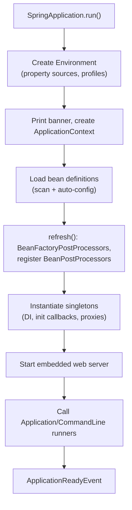
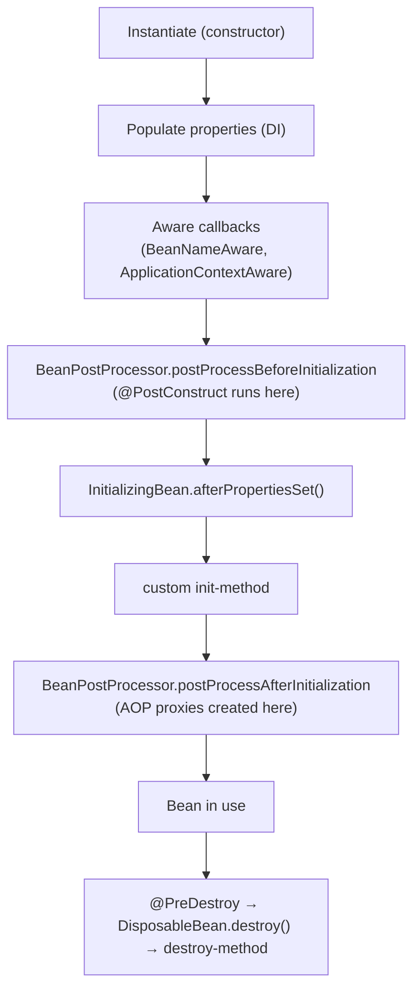
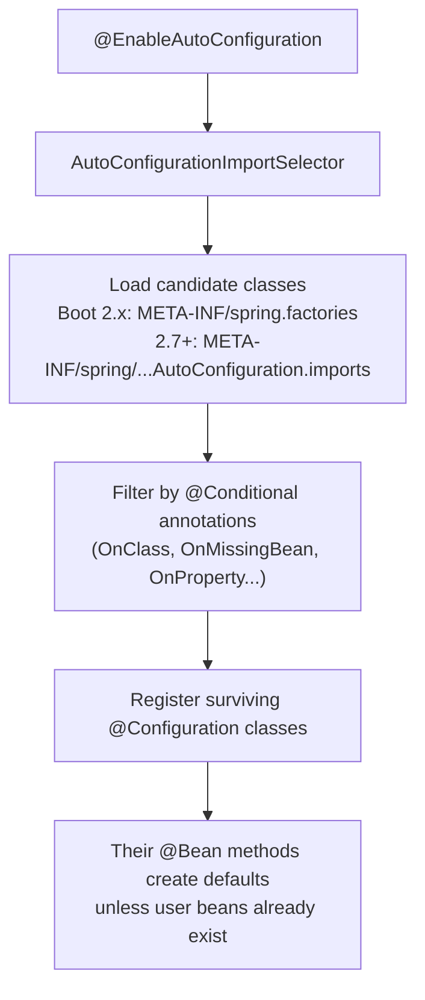
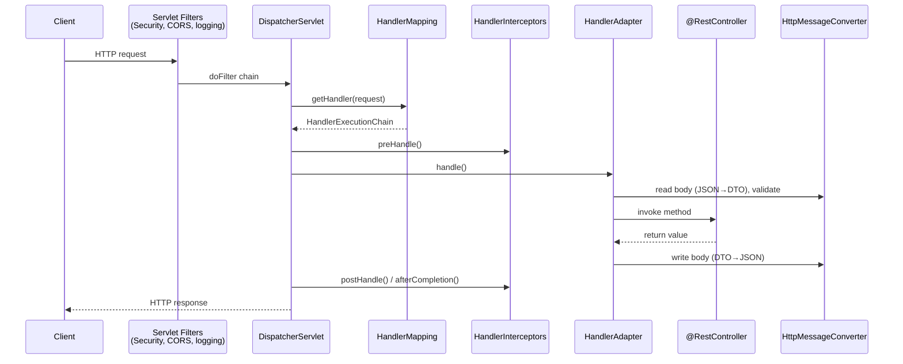
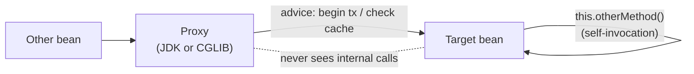
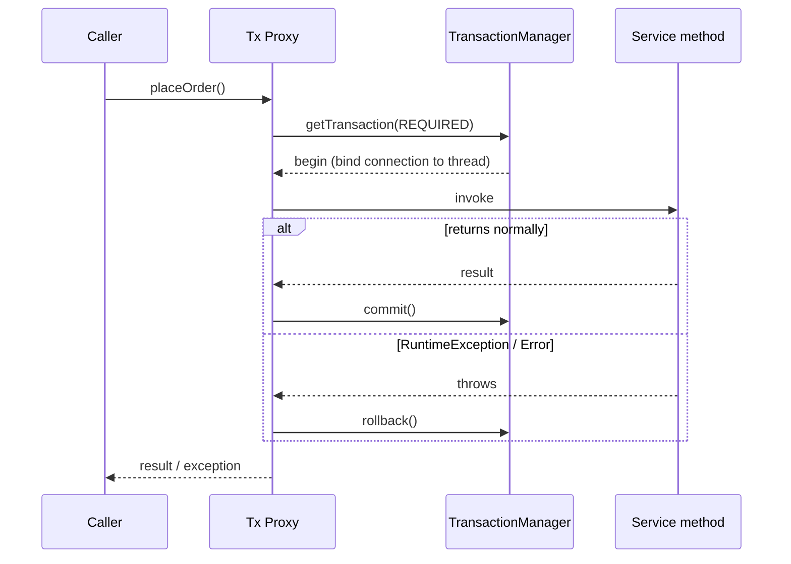

# Spring Boot (2.x on Java 8): Interview Notes

**Why this matters in interviews:** Spring Boot is the default Java backend stack, so interviewers assume you use it daily. What they really test is whether you know what happens *under* the annotations: how auto-configuration decides what to create, why `@Transactional` sometimes does nothing, and how a request travels through `DispatcherServlet`. That's how they tell someone who has debugged Boot in production from someone who has only followed tutorials.

> [!NOTE]
> These notes target **Spring Boot 2.x / Spring Framework 5.x**, the last line that supports Java 8. Boot 3 requires Java 17 and moves to `jakarta.*`. See [Beyond Java 8](#12-beyond-java-8).

Difficulty legend: 🟢 Basic · 🟡 Intermediate · 🔴 Advanced · ⚡ Scenario

## Table of Contents

1. [IoC, DI and the ApplicationContext](#1-ioc-di-and-the-applicationcontext)
2. [Bean Lifecycle and Scopes](#2-bean-lifecycle-and-scopes)
3. [Auto-configuration and Starters](#3-auto-configuration-and-starters)
4. [Configuration, Properties and Profiles](#4-configuration-properties-and-profiles)
5. [Web Layer: REST, Validation and Errors](#5-web-layer-rest-validation-and-errors)
6. [AOP, Proxies and Transactions](#6-aop-proxies-and-transactions)
7. [Actuator, Observability and Testing](#7-actuator-observability-and-testing)
8. [Coding / Hands-on](#8-coding--hands-on)
9. [Production Scenarios](#9-production-scenarios)
10. [Cheat Sheet](#10-cheat-sheet)
11. [Revision Checklist](#11-revision-checklist)
12. [Beyond Java 8](#12-beyond-java-8)

---

## 1. IoC, DI and the ApplicationContext

> **Mental model:** Without Spring, your classes *go shopping* for their own dependencies (`new`). With IoC, they write a *shopping list* (constructor parameters), and the container *delivers* everything, already assembled. You write the recipe, and Spring runs the kitchen.

### Q1. 🟢 What are Inversion of Control and Dependency Injection?

**IoC** means the framework, not your code, controls object creation and wiring. **DI** is how Spring implements IoC: dependencies are *given* to an object rather than created by it. The benefits are loose coupling, easy testing (you can inject mocks), and central configuration.

<details><summary>Cross-questions</summary>

**Q:** Are IoC and DI the same thing?

**A:** DI is one form of IoC. Others include the template method pattern and event callbacks, where the framework calls your code.
</details>

### Q2. 🟢 What are constructor, setter and field injection, and which should you prefer?

| Type | Pros | Cons |
|---|---|---|
| **Constructor** | Immutable (`final`), mandatory deps explicit, easy to unit test, fails fast | Long constructors expose too many deps (a smell) |
| Setter | Optional deps, reconfigurable | Object can be half-initialised |
| Field (`@Autowired` on field) | Short | Hidden deps, needs reflection to test, can't be `final` |

```java
import org.springframework.stereotype.Service;

@Service
public class ReportService {
    private final QueryExecutor executor;
    private final StorageClient storage;

    // Single constructor: @Autowired is optional since Spring 4.3
    public ReportService(QueryExecutor executor, StorageClient storage) {
        this.executor = executor;
        this.storage = storage;
    }
}

interface QueryExecutor { }
interface StorageClient { }
```

> [!TIP]
> Say it like a senior engineer: "I use constructor injection everywhere. If a constructor needs more than about five dependencies, the class is doing too much, and that's a design smell I can see immediately."

<details><summary>Cross-questions</summary>

**Q:** How does constructor injection help with circular dependencies?

**A:** It makes them **fail fast** at startup (`BeanCurrentlyInCreationException`) instead of hiding them. Spring Boot 2.6+ also prohibits circular references by default.
</details>

### Q3. 🟢 `BeanFactory` vs `ApplicationContext`?

`BeanFactory` is the basic container: lazy creation and DI. `ApplicationContext` extends it and adds eager singleton creation, event publishing, i18n (`MessageSource`), resource loading, environment and profiles, and automatic registration of `BeanPostProcessor`s. You always use `ApplicationContext` in practice.

<details><summary>Cross-questions</summary>

**Q:** Which context does a Boot web app use?

**A:** In Boot 2.x a servlet app uses `AnnotationConfigServletWebServerApplicationContext`, and a WebFlux app uses the reactive equivalent.
</details>

### Q4. 🟢 What is the difference between `@Component`, `@Service`, `@Repository` and `@Controller`?

They're all `@Component` stereotypes that component scanning picks up. The specialisations are:

- `@Repository`: enables **exception translation** (a `PersistenceExceptionTranslationPostProcessor` converts vendor exceptions into `DataAccessException`).
- `@Controller` / `@RestController`: picked up by MVC handler mapping. `@RestController` = `@Controller` + `@ResponseBody`.
- `@Service`: semantic only.

<details><summary>Cross-questions</summary>

**Q:** Can you use `@Component` on a DAO?

**A:** It works, but you lose the automatic exception translation.
</details>

### Q5. 🟢 `@Bean` vs `@Component`?

`@Component` goes on **your own classes** and is found by scanning. `@Bean` goes on a factory method in a `@Configuration` class, and it's used for **third-party classes** you can't annotate, or when creation needs logic.

```java
import java.util.concurrent.ArrayBlockingQueue;
import java.util.concurrent.ThreadPoolExecutor;
import java.util.concurrent.TimeUnit;
import org.springframework.context.annotation.Bean;
import org.springframework.context.annotation.Configuration;

@Configuration
public class ExecutorConfig {
    @Bean(destroyMethod = "shutdown")
    public ThreadPoolExecutor ingestExecutor() {
        return new ThreadPoolExecutor(8, 8, 0L, TimeUnit.MILLISECONDS,
            new ArrayBlockingQueue<Runnable>(500), new ThreadPoolExecutor.CallerRunsPolicy());
    }
}
```

<details><summary>Cross-questions</summary>

**Q:** What's the default bean name for a `@Bean` method?

**A:** The method name (`ingestExecutor`). For a `@Component`, it's the class name with a lower-case first letter.
</details>

### Q6. 🟡 How does Spring resolve which bean to inject when there are several candidates?

The order is: by **type** → narrow with `@Qualifier` → prefer `@Primary` → fall back to matching the **parameter or field name** against the bean name. If it's still ambiguous, startup fails with `NoUniqueBeanDefinitionException`.

```java
import org.springframework.beans.factory.annotation.Qualifier;
import org.springframework.stereotype.Component;

interface Publisher { void publish(String msg); }

@Component("kafkaPublisher")
class KafkaPublisher implements Publisher { public void publish(String m) { } }

@Component("pubsubPublisher")
class PubSubPublisher implements Publisher { public void publish(String m) { } }

@Component
public class EventRouter {
    private final Publisher publisher;
    public EventRouter(@Qualifier("kafkaPublisher") Publisher publisher) { this.publisher = publisher; }
}
```

<details><summary>Cross-questions</summary>

**Q:** How do you inject *all* the implementations?

**A:** Inject a `List<Publisher>` (ordered by `@Order` or `Ordered`) or a `Map<String, Publisher>` keyed by bean name. This is how to wire a **Chain of Responsibility** of ranking steps.
</details>

### Q7. 🟡 How do you inject an ordered list of beans to build a chain (for example, a ranking pipeline)?

```java
import java.util.List;
import org.springframework.core.annotation.Order;
import org.springframework.stereotype.Component;

interface RankingStep { double apply(String item, double score); }

@Component @Order(1)
class RecencyBoost implements RankingStep {
    public double apply(String item, double s) { return s * 1.2; }
}

@Component @Order(2)
class SpamPenalty implements RankingStep {
    public double apply(String item, double s) { return s - 5; }
}

@Component
public class RankingPipeline {
    private final List<RankingStep> steps;          // injected in @Order order
    public RankingPipeline(List<RankingStep> steps) { this.steps = steps; }

    public double score(String item, double base) {
        double s = base;
        for (RankingStep step : steps) s = step.apply(item, s);
        return s;
    }
}
```

> [!TIP]
> This is a good place to bring in your experience: "Each rule is a bean, so adding a rule means adding a class, with no edits to the pipeline (the Open/Closed principle). `@Order` controls precedence, and a feature flag can switch individual steps off."

<details><summary>Cross-questions</summary>

**Q:** How would you let a step short-circuit the chain?

**A:** Give the step a context object with a `stop` flag, or use the classic CoR shape where each handler holds a `next` reference and decides whether to call it.
</details>

### Q8. 🟡 What does `@Configuration(proxyBeanMethods = true)` do?

The `@Configuration` class is **CGLIB-subclassed**, so calling one `@Bean` method from another returns the **same singleton** rather than a new instance. With `proxyBeanMethods = false` (lite mode, available since Boot 2.2 / Spring 5.2), inter-bean calls create new objects, but startup is faster. Boot's own auto-configs use lite mode.

<details><summary>Cross-questions</summary>

**Q:** What happens to `@Bean` methods inside a `@Component` class?

**A:** That's lite mode too. Calling one `@Bean` method from another is a plain Java call and creates a new instance.
</details>

### Q9. 🟡 How does component scanning work?

`@ComponentScan` (included in `@SpringBootApplication`) scans the **main class's package and all its sub-packages**. Beans outside that tree aren't found unless you add them explicitly with `scanBasePackages` or `@Import`.

<details><summary>Cross-questions</summary>

**Q:** Why put the main class in the root package?

**A:** So scanning covers the whole application. A main class in a sub-package silently misses sibling packages.
</details>

### Q10. 🟡 What do `@Lazy` and `spring.main.lazy-initialization` do?

`@Lazy` creates a bean on first use instead of at startup. The global lazy flag (Boot 2.2+) speeds up startup, but it **moves errors to runtime**, so the first request fails instead of the deploy.

<details><summary>Cross-questions</summary>

**Q:** Where is `@Lazy` genuinely useful?

**A:** For breaking an unavoidable circular dependency (`@Lazy` on an injection point creates a proxy), or for rarely used heavyweight beans.
</details>

### Q11. 🟡 What is `ObjectProvider`, and when would you use it?

It's a lazy, optional handle to a bean: `getIfAvailable()`, `getIfUnique()`, and `stream()` over all candidates. It's useful for optional dependencies, and for getting a fresh **prototype** instance from inside a singleton.

<details><summary>Cross-questions</summary>

**Q:** How does it differ from `Optional<T>` injection?

**A:** An injected `Optional` is resolved once, at injection time. `ObjectProvider` resolves on every call.
</details>

### Q12. 🟡 What are Spring application events?

`ApplicationEventPublisher.publishEvent(obj)` publishes an event, and `@EventListener` methods handle it. Delivery is **synchronous by default**, on the caller's thread. Add `@Async` for asynchronous delivery, or use `@TransactionalEventListener(phase = AFTER_COMMIT)` to react only after the transaction commits.

<details><summary>Cross-questions</summary>

**Q:** Why use `AFTER_COMMIT` when publishing to Kafka?

**A:** If you publish inside the transaction and it later rolls back, consumers see an event for data that doesn't exist. `AFTER_COMMIT` avoids that, but a crash between the commit and the publish can still lose the event. For guaranteed delivery, use the **outbox pattern**.
</details>

### Q13. 🟢 What are `CommandLineRunner` and `ApplicationRunner`?

Both run after the context has started. `ApplicationRunner` gets parsed `ApplicationArguments`, while `CommandLineRunner` gets raw `String[]`. They're used for warm-up and one-off jobs.

<details><summary>Cross-questions</summary>

**Q:** Is the application "ready" while runners execute?

**A:** No. `ApplicationReadyEvent` fires **after** the runners complete, so a slow runner delays readiness.
</details>

### Q14. 🟡 What does `SpringApplication.run()` do at a high level?



<details><summary>Cross-questions</summary>

**Q:** What's a `BeanFactoryPostProcessor` vs a `BeanPostProcessor`?

**A:** A BFPP modifies bean **definitions** before any bean is created (for example, resolving `${...}` placeholders). A BPP modifies bean **instances** after they're created (for example, wrapping them in AOP proxies).
</details>

### Q15. 🟡 How does Spring handle circular dependencies?

For **singleton** beans with setter or field injection, Spring resolves cycles using a three-level cache that exposes early references. **Constructor** cycles can't be resolved. Since **Boot 2.6**, cycles are prohibited by default (`spring.main.allow-circular-references=false`).

<details><summary>Cross-questions</summary>

**Q:** What's the right fix for a cycle?

**A:** Redesign it: extract the shared logic into a third bean, or use events. `@Lazy` is only a stopgap.
</details>

---

## 2. Bean Lifecycle and Scopes

> **Mental model:** A bean's life is like *hiring an employee*. Recruit them (instantiate), give them tools (inject), onboard them (`@PostConstruct`), security issues a badge that may be a disguise (the BPP wraps them in a proxy), they work, then there's an exit interview (`@PreDestroy`).

### Q16. 🟡 What is the full bean lifecycle?



<details><summary>Cross-questions</summary>

**Q:** Why can't you rely on `@Transactional` behaviour inside `@PostConstruct`?

**A:** `@PostConstruct` runs on the **raw object before the proxy exists**, so calls made from it bypass the transactional proxy. Use `ApplicationReadyEvent` or a `SmartInitializingSingleton` instead.

**Q:** Are `@PreDestroy` methods called for prototype beans?

**A:** No. Spring doesn't manage a prototype's destruction.
</details>

### Q17. 🟢 What are the bean scopes?

| Scope | Instances | Notes |
|---|---|---|
| **singleton** (default) | One per container | Must be thread-safe |
| prototype | New per injection/lookup | No destroy callbacks |
| request | One per HTTP request | Web only |
| session | One per HTTP session | Web only |
| application | One per `ServletContext` | Web only |
| websocket | One per WebSocket session | |

<details><summary>Cross-questions</summary>

**Q:** Is a Spring singleton the same as the GoF Singleton pattern?

**A:** No. Spring's singleton is one per **container** per bean definition, and you can define two beans of the same class. GoF means one per class loader.
</details>

### Q18. 🟡 What happens when you inject a prototype into a singleton?

It's injected **once**, so the singleton always holds the same instance. The fixes:

- `ObjectProvider<Proto>.getObject()` on each use.
- A `@Lookup` method.
- `@Scope(value = "prototype", proxyMode = ScopedProxyMode.TARGET_CLASS)`.

<details><summary>Cross-questions</summary>

**Q:** How does a request-scoped bean inject into a singleton controller?

**A:** Through a **scoped proxy**. The singleton holds a proxy, and each call delegates to the current request's instance.
</details>

### Q19. 🟡 Are singleton beans thread-safe?

Spring doesn't make them thread-safe. They're safe if they're **stateless**, holding only injected, thread-safe dependencies and `final` config. Mutable instance fields that hold per-request data are a classic bug that leaks data between users.

<details><summary>Cross-questions</summary>

**Q:** How would you store per-request data?

**A:** Pass it as method parameters, use a request-scoped bean, or use a `ThreadLocal` that's cleared in a filter.
</details>

### Q20. 🟡 Which bean initialisation callbacks exist, and in what order do they run?

1. `@PostConstruct`
2. `InitializingBean.afterPropertiesSet()`
3. `@Bean(initMethod = "...")`

Destruction runs in the same order, with the equivalent callbacks. Prefer the annotations, because they don't couple your class to Spring interfaces.

<details><summary>Cross-questions</summary>

**Q:** On Java 11+, where does `@PostConstruct` come from?

**A:** `javax.annotation-api` (Boot 2.x includes it), and `jakarta.annotation` in Boot 3. It was removed from the JDK in Java 11.
</details>

### Q21. 🟡 What is a `BeanPostProcessor`? Can you give a real use?

It's a hook that runs around the initialisation of **every** bean. Spring uses BPPs for `@Autowired` (`AutowiredAnnotationBeanPostProcessor`), `@PostConstruct`, `@Async`, `@Scheduled` and AOP auto-proxying. A custom BPP might, for example, wrap every `DataSource` bean with metrics.

<details><summary>Cross-questions</summary>

**Q:** Why are BPPs created early, and what's the side effect?

**A:** They must exist before other beans. Beans that a BPP depends on are created too early to be post-processed themselves, and the log warns "not eligible for getting processed by all BeanPostProcessors".
</details>

### Q22. 🟡 What are `Aware` interfaces?

They let a bean receive container objects: `ApplicationContextAware`, `BeanNameAware`, `EnvironmentAware`, `ResourceLoaderAware`. Use them sparingly, because they couple your code to Spring. Constructor injection of `Environment` usually works instead.

<details><summary>Cross-questions</summary>

**Q:** Why is `ApplicationContext.getBean()` in business code a smell?

**A:** It's the service-locator pattern. It hides dependencies and makes tests harder.
</details>

### Q23. 🟡 How do you control bean creation order?

Normally you don't need to, because dependencies define the order. When there's no direct dependency, use `@DependsOn("otherBean")`. `@Order` controls the order of beans *within a collection* and of listeners, **not** creation order.

<details><summary>Cross-questions</summary>

**Q:** Does `@Order` on a `@Component` make it initialise first?

**A:** No. It's a common misconception.
</details>

### Q24. 🟢 What does `@Scope("prototype")` on a `@Bean` give you, and when is it useful?

A new instance per request from the container. It suits stateful, non-thread-safe helpers, such as a per-job context or a stateful parser.

<details><summary>Cross-questions</summary>

**Q:** Who cleans up the resources held by a prototype bean?

**A:** You do. Spring won't call its destroy callbacks.
</details>

### Q25. 🟡 How does graceful shutdown work in Spring Boot?

With `server.shutdown=graceful` (Boot 2.3+), the web server stops accepting new requests and waits for in-flight ones, up to `spring.lifecycle.timeout-per-shutdown-phase` (30 s by default). The context then closes, and `@PreDestroy` hooks and `SmartLifecycle.stop()` run. The whole sequence is triggered by SIGTERM through the JVM shutdown hook.

<details><summary>Cross-questions</summary>

**Q:** How do you stop a Kafka listener cleanly?

**A:** Spring Kafka's listener containers are `SmartLifecycle`. They stop polling and commit offsets during context close. Keep processing time per poll below the shutdown timeout.

**Q:** Why doesn't `kill -9` run any of this?

**A:** SIGKILL can't be caught, so no shutdown hooks run. Kubernetes sends SIGTERM first and SIGKILL only after `terminationGracePeriodSeconds`.
</details>

### Q26. 🟡 What is `SmartLifecycle`?

It's an interface for components that start and stop with the context (`start`, `stop`, `isRunning`), ordered by `getPhase()`. Components with a lower phase start first and stop last. Message listener containers and schedulers use it.

<details><summary>Cross-questions</summary>

**Q:** Why implement it for a custom consumer loop?

**A:** So the loop starts only after all its dependencies are ready, and stops *before* those dependencies are destroyed.
</details>

---

## 3. Auto-configuration and Starters

> **Mental model:** Auto-configuration is a *smart butler*. It checks the house ("is there a `DataSource` class on the classpath? Did the owner already define one?") and sets up sensible defaults only where you haven't made your own choice. You're always allowed to overrule the butler.

### Q27. 🟢 What does `@SpringBootApplication` contain?

It combines three annotations:

- `@SpringBootConfiguration`, which is a specialised `@Configuration`.
- `@EnableAutoConfiguration`.
- `@ComponentScan`, which scans the package of the annotated class.

<details><summary>Cross-questions</summary>

**Q:** How do you exclude an auto-config?

**A:** With `@SpringBootApplication(exclude = DataSourceAutoConfiguration.class)`, or the property `spring.autoconfigure.exclude=...`.
</details>

### Q28. 🔴 How does auto-configuration work internally?



Auto-configs are processed **after** user configuration, so `@ConditionalOnMissingBean` can see your beans and back off.

<details><summary>Cross-questions</summary>

**Q:** How do you see what was auto-configured and why?

**A:** Start with `--debug` (or `debug=true`) to print the **Condition Evaluation Report** of positive and negative matches, or use the Actuator `/actuator/conditions` endpoint.
</details>

### Q29. 🟡 What are the most important `@Conditional` annotations?

| Annotation | Condition |
|---|---|
| `@ConditionalOnClass` | Class present on classpath |
| `@ConditionalOnMissingClass` | Class absent |
| `@ConditionalOnBean` / `@ConditionalOnMissingBean` | Bean (not) already defined |
| `@ConditionalOnProperty` | Property has value (`havingValue`, `matchIfMissing`) |
| `@ConditionalOnWebApplication` | Servlet/reactive app |
| `@ConditionalOnResource` | Resource exists |
| `@ConditionalOnExpression` | SpEL is true |

<details><summary>Cross-questions</summary>

**Q:** How do you feature-flag a Kafka consumer bean?

**A:** `@ConditionalOnProperty(name = "ingest.kafka.enabled", havingValue = "true")`.
</details>

### Q30. 🟢 What is a starter?

A starter is a dependency descriptor with no code. It pulls in a coherent set of libraries and the auto-configuration that goes with them. For example, `spring-boot-starter-web` brings Spring MVC, Jackson, embedded Tomcat and validation (before 2.3).

<details><summary>Cross-questions</summary>

**Q:** Which starter do you need for `@Valid` in Boot 2.3+?

**A:** `spring-boot-starter-validation`. It was removed from the web starter in 2.3.
</details>

### Q31. 🟡 How do you swap Tomcat for Jetty or Undertow?

Exclude `spring-boot-starter-tomcat` from the web starter and add `spring-boot-starter-jetty` or `spring-boot-starter-undertow`. Auto-configuration detects which server is on the classpath.

```xml
<dependency>
  <groupId>org.springframework.boot</groupId>
  <artifactId>spring-boot-starter-web</artifactId>
  <exclusions>
    <exclusion>
      <groupId>org.springframework.boot</groupId>
      <artifactId>spring-boot-starter-tomcat</artifactId>
    </exclusion>
  </exclusions>
</dependency>
<dependency>
  <groupId>org.springframework.boot</groupId>
  <artifactId>spring-boot-starter-undertow</artifactId>
</dependency>
```

<details><summary>Cross-questions</summary>

**Q:** What are the default Tomcat thread settings?

**A:** Max 200 worker threads (`server.tomcat.threads.max` in 2.3+, `server.tomcat.max-threads` before that), a minimum of 10 spare threads, and a default accept count of 100.
</details>

### Q32. 🔴 How do you write a custom auto-configuration or starter?

1. Write a `@Configuration` class (lite mode) with `@ConditionalOn...` guards and `@ConditionalOnMissingBean` on each `@Bean`, so users can override it.
2. Bind the settings with a `@ConfigurationProperties` class.
3. Register the class in `META-INF/spring.factories` under `org.springframework.boot.autoconfigure.EnableAutoConfiguration`. In Boot 2.7+, use `META-INF/spring/org.springframework.boot.autoconfigure.AutoConfiguration.imports` instead.
4. Publish two modules: `xyz-spring-boot-autoconfigure` and `xyz-spring-boot-starter`.

<details><summary>Cross-questions</summary>

**Q:** Where would a custom starter help?

**A:** For a company-wide "event-ingest starter" that auto-configures the Kafka or Pub/Sub publishers, standard headers, metrics and a DLQ, so every team gets consistent behaviour.
</details>

### Q33. 🟡 What is `spring-boot-starter-parent`, and what is BOM dependency management?

The parent POM sets Java and plugin defaults and imports `spring-boot-dependencies`, a **BOM** that pins compatible versions of hundreds of libraries. Because of that, you leave out `<version>` for managed dependencies.

<details><summary>Cross-questions</summary>

**Q:** How do you override a managed version, for example to patch a CVE?

**A:** Set the matching property, such as `<jackson-bom.version>`, or declare the dependency version explicitly in `dependencyManagement`.
</details>

### Q34. 🟡 How is an executable fat jar laid out?

The Boot Maven or Gradle plugin repackages the app. `BOOT-INF/classes` holds your code, `BOOT-INF/lib` holds the dependency jars, and `org/springframework/boot/loader` holds the launcher. `META-INF/MANIFEST.MF` sets `Main-Class: JarLauncher` and `Start-Class: your main`. Nested jars are loaded by Boot's custom class loader.

<details><summary>Cross-questions</summary>

**Q:** What are layered jars good for in Docker?

**A:** Boot 2.3+ can split the jar into layers: dependencies, the Spring Boot loader, snapshot dependencies and application code. Dependencies change rarely, so Docker caches that layer, which makes rebuilds and pushes faster.
</details>

### Q35. 🟡 What is Spring Boot DevTools?

It gives you automatic restart using two class loaders (only your code reloads), LiveReload, and dev-friendly defaults like disabled template caching. It's disabled automatically when the app runs as a fully packaged jar.

<details><summary>Cross-questions</summary>

**Q:** Should DevTools ever ship to production?

**A:** No. Mark it `optional` or `developmentOnly`.
</details>

### Q36. 🟡 What does `DataSourceAutoConfiguration` do?

If a JDBC driver and a pool are on the classpath and you haven't defined a `DataSource`, it creates one from `spring.datasource.*`. The pool preference is **HikariCP** first (the default in Boot 2), then Tomcat JDBC, then Commons DBCP2. With an embedded DB (H2) on the classpath and no URL set, it configures the embedded DB.

<details><summary>Cross-questions</summary>

**Q:** What's Hikari's default max pool size?

**A:** 10.
</details>

### Q37. 🟡 How do you override Jackson settings?

Use properties (`spring.jackson.serialization.write-dates-as-timestamps=false`, `spring.jackson.default-property-inclusion=non_null`), or a `Jackson2ObjectMapperBuilderCustomizer` bean. Defining your own `ObjectMapper` bean replaces Boot's entirely, and you lose its defaults.

<details><summary>Cross-questions</summary>

**Q:** Which Jackson modules does Boot register automatically?

**A:** When they're on the classpath: `JavaTimeModule` (jsr310), `Jdk8Module` and `ParameterNamesModule`.
</details>

### Q38. 🟡 How do you disable the web server for a batch or consumer-only app?

Set `spring.main.web-application-type=none`. The context runs without Tomcat, and the process stays alive as long as non-daemon threads (for example, a Kafka listener container) are running.

<details><summary>Cross-questions</summary>

**Q:** How does Kubernetes check the health of an app with no web server?

**A:** Keep the management endpoints on (use `web-application-type=servlet` with a separate `management.server.port`), or use exec or TCP probes.
</details>

---
## 4. Configuration, Properties and Profiles

> **Mental model:** Configuration is a *stack of transparent sheets*. The defaults sit at the bottom, then `application.yml`, then profile files, then environment variables, and command-line arguments on top. Where the sheets overlap, you read the top one.

### Q39. 🟡 What is the property source precedence (simplified, highest first)?

1. Command-line arguments (`--server.port=9090`)
2. `SPRING_APPLICATION_JSON`
3. Java system properties (`-Dkey=value`)
4. OS environment variables
5. Profile-specific files **outside** the jar, then **inside** the jar (`application-prod.yml`)
6. `application.yml` / `.properties` **outside** the jar, then **inside** the jar
7. `@PropertySource` on `@Configuration` classes
8. Defaults (`SpringApplication.setDefaultProperties`)

> [!NOTE]
> Test annotations (`@TestPropertySource`, `@SpringBootTest(properties=...)`) and devtools global settings sit even higher. The full list is in the Boot reference guide.

<details><summary>Cross-questions</summary>

**Q:** How does `SPRING_DATASOURCE_URL` map to `spring.datasource.url`?

**A:** Through **relaxed binding**: upper-case letters and underscores map to lower-case letters and dots.

**Q:** Where do secrets belong?

**A:** In environment variables injected from a secret manager (Kubernetes Secrets, Vault, GCP Secret Manager). Never in `application.yml` committed to git.
</details>

### Q40. 🟢 `@Value` vs `@ConfigurationProperties`?

| | `@Value` | `@ConfigurationProperties` |
|---|---|---|
| Granularity | One property | Group with a prefix |
| Relaxed binding | Limited | Full |
| Validation | No | `@Validated` + JSR-303 |
| Type-safety & IDE metadata | No | Yes (with config processor) |
| SpEL | Yes | No |

```java
import javax.validation.constraints.Max;
import javax.validation.constraints.Min;
import javax.validation.constraints.NotBlank;
import org.springframework.boot.context.properties.ConfigurationProperties;
import org.springframework.validation.annotation.Validated;

@Validated
@ConfigurationProperties(prefix = "ingest")
public class IngestProperties {
    @NotBlank private String topic;
    @Min(1) @Max(5000) private int batchSize = 500;
    private boolean enabled = true;

    public String getTopic() { return topic; }
    public void setTopic(String topic) { this.topic = topic; }
    public int getBatchSize() { return batchSize; }
    public void setBatchSize(int batchSize) { this.batchSize = batchSize; }
    public boolean isEnabled() { return enabled; }
    public void setEnabled(boolean enabled) { this.enabled = enabled; }
}
```

```yaml
ingest:
  topic: mobile-events
  batch-size: 1000
  enabled: true
```

Register the class with `@EnableConfigurationProperties(IngestProperties.class)` or `@ConfigurationPropertiesScan` (2.2+).

<details><summary>Cross-questions</summary>

**Q:** Why validate configuration at all?

**A:** A bad value (say, a batch size of 0) should **fail at startup**, not at 2 a.m. while processing.
</details>

### Q41. 🟢 How do profiles work?

`spring.profiles.active=prod` activates `application-prod.yml` alongside the defaults. `@Profile("prod")` on beans creates them only when that profile is active. You can activate several profiles at once.

<details><summary>Cross-questions</summary>

**Q:** Is using profiles for every environment difference an anti-pattern?

**A:** Often, yes. Prefer **one artifact, with configuration supplied by the environment** (12-factor). Use profiles for genuinely different wiring (a `local` profile with embedded stubs), not to hold every environment's values in the jar.
</details>

### Q42. 🟡 What changed about profile-specific documents in Boot 2.4?

Boot 2.4 introduced `spring.config.activate.on-profile` for multi-document YAML (replacing `spring.profiles` inside documents), plus `spring.config.import` for importing extra config (`configtree:`, `optional:file:`, and Spring Cloud Config through `configserver:`). It also clarified the processing order.

<details><summary>Cross-questions</summary>

**Q:** Why was that change made?

**A:** The earlier rules for profile documents were confusing, especially with Kubernetes config trees mounted as volumes.
</details>

### Q43. 🟡 How do you refresh configuration without a restart?

Spring Cloud's `@RefreshScope` beans are rebuilt when `/actuator/refresh` is called or a Spring Cloud Bus event arrives. `@ConfigurationProperties` beans are rebound. Plain Boot has no hot reload: you restart, which with rolling deploys causes no downtime.

<details><summary>Cross-questions</summary>

**Q:** What's the risk of refreshing config live?

**A:** Inconsistent state across instances and hard-to-reproduce behaviour. Prefer immutable config plus rolling restarts, except for feature flags.
</details>

### Q44. 🟡 How do you give a property a default, and reference other properties?

`@Value("${ingest.batch-size:500}")` sets a default. `app.url=${HOST:localhost}:${PORT:8080}` shows placeholder composition. An unresolved placeholder with no default fails startup.

<details><summary>Cross-questions</summary>

**Q:** What does `#{...}` mean, compared with `${...}`?

**A:** `#{}` is a **SpEL** expression evaluated at runtime, for example `#{${a} * 2}`. `${}` is a placeholder resolved from the Environment.
</details>

### Q45. 🟡 How do you bind lists, maps and durations?

```yaml
reporting:
  formats: [CSV, JSON, AVRO, PARQUET]
  bucket-by-tenant:
    tenantA: gs://reports-a
    tenantB: gs://reports-b
  query-timeout: 30s          # binds to java.time.Duration
  max-upload: 50MB            # binds to DataSize
```

<details><summary>Cross-questions</summary>

**Q:** What's the unit if you write `query-timeout: 30`?

**A:** Milliseconds by default, unless the field is annotated with `@DurationUnit`.
</details>

### Q46. 🟡 How do you keep secrets out of configuration files?

Inject them as environment variables or mounted files, from Kubernetes Secrets, Vault (Spring Cloud Vault) or GCP Secret Manager. Reference them with placeholders (`${DB_PASSWORD}`). Never log the resolved values, and restrict access to `/actuator/env` (it masks keys that look sensitive by default, but don't rely on that).

<details><summary>Cross-questions</summary>

**Q:** How do you rotate a DB password without downtime?

**A:** Support two valid credentials during rotation, and do a rolling restart (or refresh the pool), so each instance picks up the new secret before the old one is revoked.
</details>

### Q47. 🟢 How do you change the server port or context path?

Use `server.port=8081` and `server.servlet.context-path=/api`. `server.port=0` picks a random free port, which is handy in tests.

<details><summary>Cross-questions</summary>

**Q:** How do you expose management endpoints on a separate port?

**A:** Set `management.server.port=8081`, so internal probes aren't exposed through the public ingress.
</details>

### Q48. 🟡 What is the `Environment` abstraction?

`Environment` combines **profiles** and an ordered list of **PropertySource**s. Everything (`@Value`, `@ConfigurationProperties`, conditions) reads from it. You can add custom sources through `EnvironmentPostProcessor`.

<details><summary>Cross-questions</summary>

**Q:** When would you write an `EnvironmentPostProcessor`?

**A:** To load properties from a custom source (a decrypted file, a remote store) **before** the context refreshes.
</details>

---

## 5. Web Layer: REST, Validation and Errors

> **Mental model:** `DispatcherServlet` is a *hotel front desk*. Every guest (request) comes to it. It looks up the right room (handler mapping), hands you over to the concierge who speaks your language (handler adapter + message converters), and if something goes wrong, the manager on duty (`@ControllerAdvice`) handles the complaint.

### Q49. 🔴 What is the request lifecycle in Spring MVC?



<details><summary>Cross-questions</summary>

**Q:** What's the difference between a Filter and a HandlerInterceptor?

**A:** A **Filter** is Servlet-level and runs before `DispatcherServlet` for every request, including static content. Spring Security works as filters. An **Interceptor** is MVC-level and knows which handler method will run.

**Q:** Where does an exception thrown in a filter go?

**A:** Not to `@ControllerAdvice`, because that only covers the MVC dispatch. It goes to the container's error handling, which Boot maps to `/error`.
</details>

### Q50. 🟢 What are the core REST annotations?

`@RestController`, `@RequestMapping`, and the shortcuts `@GetMapping` / `@PostMapping` / `@PutMapping` / `@PatchMapping` / `@DeleteMapping`. Inputs come from `@PathVariable`, `@RequestParam`, `@RequestBody` and `@RequestHeader`. `ResponseEntity` gives you control over the status and headers.

```java
import java.net.URI;
import javax.validation.Valid;
import javax.validation.constraints.NotBlank;
import org.springframework.http.ResponseEntity;
import org.springframework.web.bind.annotation.GetMapping;
import org.springframework.web.bind.annotation.PathVariable;
import org.springframework.web.bind.annotation.PostMapping;
import org.springframework.web.bind.annotation.RequestBody;
import org.springframework.web.bind.annotation.RequestMapping;
import org.springframework.web.bind.annotation.RequestParam;
import org.springframework.web.bind.annotation.RestController;

@RestController
@RequestMapping("/api/v1/reports")
public class ReportController {

    public static class CreateReportRequest {
        @NotBlank public String query;
        @NotBlank public String format;   // CSV, JSON, AVRO, PARQUET
    }

    @PostMapping
    public ResponseEntity<String> create(@Valid @RequestBody CreateReportRequest req) {
        String id = "r-123";                                   // real code: enqueue job
        return ResponseEntity.created(URI.create("/api/v1/reports/" + id)).body(id);
    }

    @GetMapping("/{id}")
    public ResponseEntity<String> status(@PathVariable String id,
                                         @RequestParam(defaultValue = "false") boolean verbose) {
        return ResponseEntity.ok("RUNNING");
    }
}
```

<details><summary>Cross-questions</summary>

**Q:** Why return `201 Created` with a `Location` header?

**A:** It's REST semantics for creating a resource. The client learns the new resource's URI.

**Q:** Should a report taking 5 minutes be generated synchronously?

**A:** No. Return **`202 Accepted`** with a job ID, process the report asynchronously, and let the client poll for status (or receive a webhook). Then serve the file through a GCS signed URL.
</details>

### Q51. 🟡 How does request validation work, and which exceptions does it produce?

`@Valid` on `@RequestBody` → `MethodArgumentNotValidException` (400).
`@Validated` on the class plus constraints on `@RequestParam` / `@PathVariable` → `ConstraintViolationException`. That one isn't mapped to 400 by default, so handle it yourself.
Binding or type errors → `MethodArgumentTypeMismatchException` or `HttpMessageNotReadableException` (malformed JSON).

<details><summary>Cross-questions</summary>

**Q:** What's the difference between `@Valid` and `@Validated`?

**A:** `@Valid` is standard JSR-303 and supports cascading. `@Validated` is Spring's version, and it supports **validation groups** and method-level validation through a proxy.
</details>

### Q52. 🟡 How do you implement global exception handling?

```java
import java.util.LinkedHashMap;
import java.util.Map;
import org.springframework.http.HttpStatus;
import org.springframework.http.ResponseEntity;
import org.springframework.web.bind.MethodArgumentNotValidException;
import org.springframework.web.bind.annotation.ExceptionHandler;
import org.springframework.web.bind.annotation.RestControllerAdvice;

@RestControllerAdvice
public class GlobalErrors {

    @ExceptionHandler(MethodArgumentNotValidException.class)
    public ResponseEntity<Map<String, Object>> invalid(MethodArgumentNotValidException ex) {
        Map<String, Object> body = new LinkedHashMap<String, Object>();
        body.put("error", "VALIDATION_FAILED");
        Map<String, String> fields = new LinkedHashMap<String, String>();
        ex.getBindingResult().getFieldErrors()
          .forEach(fe -> fields.put(fe.getField(), fe.getDefaultMessage()));
        body.put("fields", fields);
        return ResponseEntity.badRequest().body(body);
    }

    @ExceptionHandler(IllegalStateException.class)
    public ResponseEntity<Map<String, Object>> conflict(IllegalStateException ex) {
        Map<String, Object> body = new LinkedHashMap<String, Object>();
        body.put("error", "CONFLICT");
        body.put("message", ex.getMessage());
        return ResponseEntity.status(HttpStatus.CONFLICT).body(body);
    }

    @ExceptionHandler(Exception.class)
    public ResponseEntity<Map<String, Object>> fallback(Exception ex) {
        // log with trace id; never leak stack traces or internals to clients
        Map<String, Object> body = new LinkedHashMap<String, Object>();
        body.put("error", "INTERNAL_ERROR");
        return ResponseEntity.status(HttpStatus.INTERNAL_SERVER_ERROR).body(body);
    }
}
```

<details><summary>Cross-questions</summary>

**Q:** How is the most specific handler chosen?

**A:** By the closest exception type in the class hierarchy. Handlers in the controller itself beat those in `@ControllerAdvice`, and several advices are ordered with `@Order`.

**Q:** What should an error response contain?

**A:** A stable error code, a human-readable message, a trace or correlation ID, and field errors. Never include stack traces, SQL or internal hostnames.
</details>

### Q53. 🟡 How do Spring MVC and Tomcat handle concurrency?

Tomcat runs **one worker thread per in-flight request** (200 by default). Controllers are singletons called concurrently by those threads. A slow downstream call holds its thread for the full duration, so thread exhaustion leads to request queueing and then connection refusals.

<details><summary>Cross-questions</summary>

**Q:** How do you free Tomcat threads during long operations?

**A:** Return `Callable`, `DeferredResult` or `CompletableFuture` (Servlet 3 async), or offload the work to a job queue and return 202. WebFlux is the reactive alternative.
</details>

### Q54. 🟡 How do `HttpMessageConverter`s and content negotiation work?

The converter is chosen from the `Content-Type` of the request and the `Accept` header of the response. Jackson handles JSON, and you can register converters for XML, CSV, Protobuf and so on. A mismatch produces `415 Unsupported Media Type` or `406 Not Acceptable`.

<details><summary>Cross-questions</summary>

**Q:** How would you stream a 2 GB CSV export?

**A:** Don't build it in memory. Use `StreamingResponseBody`, or write to `HttpServletResponse.getOutputStream()` row by row from a DB cursor. Even better, generate it asynchronously to GCS and return a signed URL.
</details>

### Q55. 🟡 How do you stream a large response in Spring MVC?

```java
import java.io.BufferedWriter;
import java.io.OutputStreamWriter;
import java.nio.charset.StandardCharsets;
import org.springframework.http.MediaType;
import org.springframework.http.ResponseEntity;
import org.springframework.web.bind.annotation.GetMapping;
import org.springframework.web.bind.annotation.RestController;
import org.springframework.web.servlet.mvc.method.annotation.StreamingResponseBody;

@RestController
public class ExportController {
    @GetMapping(value = "/export.csv")
    public ResponseEntity<StreamingResponseBody> export() {
        StreamingResponseBody body = out -> {
            BufferedWriter w = new BufferedWriter(new OutputStreamWriter(out, StandardCharsets.UTF_8));
            w.write("id,name\n");
            for (int i = 0; i < 200_000; i++) {           // real code: iterate a DB cursor
                w.write(i + ",row" + i + "\n");
            }
            w.flush();
        };
        return ResponseEntity.ok()
            .contentType(MediaType.parseMediaType("text/csv"))
            .header("Content-Disposition", "attachment; filename=export.csv")
            .body(body);
    }
}
```

<details><summary>Cross-questions</summary>

**Q:** Which thread writes the body?

**A:** An async MVC executor thread, so configure `spring.mvc.async.request-timeout` and a proper `TaskExecutor`. Otherwise Boot's default async executor is used.
</details>

### Q56. 🟢 What is the difference between `@RequestParam` and `@PathVariable`?

`@PathVariable` identifies a **resource** (`/orders/{id}`). `@RequestParam` carries **filters and options** (`?status=OPEN&page=2`).

<details><summary>Cross-questions</summary>

**Q:** What happens when a required `@RequestParam` is missing?

**A:** Spring returns 400 (`MissingServletRequestParameterException`). Use `required = false` or `defaultValue` to make it optional.
</details>

### Q57. 🟡 How do you configure CORS?

Use `@CrossOrigin` per controller, or a global `WebMvcConfigurer.addCorsMappings`. If Spring Security is on the classpath, you **must** also enable `http.cors()`, so that preflight `OPTIONS` requests aren't rejected before they reach MVC.

<details><summary>Cross-questions</summary>

**Q:** What's wrong with `allowedOrigins("*")` together with `allowCredentials(true)`?

**A:** Browsers reject it, and it's insecure. List explicit origins, or use `allowedOriginPatterns` (5.3+).
</details>

### Q58. 🟡 How do you version an API?

The options are URI versioning (`/api/v1/...`, simple and visible), a header (`Accept: application/vnd.x.v2+json`), or a query parameter. Pick one approach, keep old versions until clients migrate, and make changes **additively** (new optional fields) wherever possible.

<details><summary>Cross-questions</summary>

**Q:** Is adding a new enum value a breaking change?

**A:** It can be. Clients with strict deserialisation fail on unknown values. Document tolerant-reader expectations.
</details>

### Q59. 🟡 How do you make a POST endpoint idempotent?

Accept an `Idempotency-Key` header, store the key with the result (in the DB or Redis with a TTL) the first time, and return the stored result on a retry. Make the store atomic with `SETNX` or a unique constraint.

<details><summary>Cross-questions</summary>

**Q:** Why does it matter for mobile event ingestion?

**A:** Mobile clients retry on flaky networks. Without idempotency, the same event gets counted twice.
</details>

### Q60. 🟡 How do you implement pagination?

Use Spring Data's `Pageable` (`?page=0&size=50&sort=createdAt,desc`), which returns `Page<T>` with totals. For large tables or infinite scroll, prefer **keyset or cursor pagination** (`?after=<lastId>`), because offset pagination slows down as the offset grows.

<details><summary>Cross-questions</summary>

**Q:** Why is `Page<T>` expensive?

**A:** It runs an extra `COUNT(*)` query. Use `Slice<T>` when you don't need a total.
</details>

### Q61. 🟡 How do you call other services: `RestTemplate` or `WebClient`?

`RestTemplate` is blocking, simple, and in maintenance mode since Spring 5. `WebClient` is non-blocking and reactive, but you can call it from MVC code with `.block()`. Whichever you use, **always configure timeouts** and a connection pool.

```java
import org.springframework.boot.web.client.RestTemplateBuilder;
import org.springframework.context.annotation.Bean;
import org.springframework.context.annotation.Configuration;
import org.springframework.web.client.RestTemplate;
import java.time.Duration;

@Configuration
public class HttpClients {
    @Bean
    public RestTemplate restTemplate(RestTemplateBuilder builder) {
        return builder
            .setConnectTimeout(Duration.ofSeconds(2))
            .setReadTimeout(Duration.ofSeconds(5))
            .build();
    }
}
```

<details><summary>Cross-questions</summary>

**Q:** What's the default timeout of `new RestTemplate()`?

**A:** Infinite, with the default `SimpleClientHttpRequestFactory`. It's a classic production outage.
</details>

### Q62. 🟡 What are `HandlerInterceptor`'s three methods used for?

- `preHandle` runs before the controller, and returning `false` stops the request. It's used for auth checks, rate limiting and MDC setup.
- `postHandle` runs after the controller, before the view renders. It isn't called if the controller throws.
- `afterCompletion` always runs. Use it for cleanup and timing.

<details><summary>Cross-questions</summary>

**Q:** Where should you clear the MDC or a `ThreadLocal`?

**A:** In `afterCompletion`, or in the `finally` block of a filter, because they always run.
</details>

### Q63. 🟡 How do you add a correlation ID to every log line?

Use a `OncePerRequestFilter` that reads `X-Request-Id` (or generates one), puts it into the **MDC**, and removes it in `finally`. Include `%X{traceId}` in the log pattern. Spring Cloud Sleuth (Boot 2) does this automatically, together with trace propagation.

```java
import java.io.IOException;
import java.util.UUID;
import javax.servlet.FilterChain;
import javax.servlet.ServletException;
import javax.servlet.http.HttpServletRequest;
import javax.servlet.http.HttpServletResponse;
import org.slf4j.MDC;
import org.springframework.stereotype.Component;
import org.springframework.web.filter.OncePerRequestFilter;

@Component
public class CorrelationIdFilter extends OncePerRequestFilter {
    @Override
    protected void doFilterInternal(HttpServletRequest req, HttpServletResponse res, FilterChain chain)
            throws ServletException, IOException {
        String id = req.getHeader("X-Request-Id");
        if (id == null || id.isEmpty()) id = UUID.randomUUID().toString();
        MDC.put("traceId", id);
        res.setHeader("X-Request-Id", id);
        try { chain.doFilter(req, res); }
        finally { MDC.remove("traceId"); }
    }
}
```

<details><summary>Cross-questions</summary>

**Q:** How does the ID reach Kafka consumers?

**A:** Put it in a Kafka **record header** when producing, and restore it into the MDC in the consumer.
</details>

### Q64. 🟡 How do you upload files, and what are the limits?

Accept a `MultipartFile`. Limits are set by `spring.servlet.multipart.max-file-size` (1 MB by default) and `max-request-size` (10 MB by default). For large files, stream them directly to object storage (a GCS signed upload URL), so the bytes never go through your app.

<details><summary>Cross-questions</summary>

**Q:** Where is a multipart file stored while it's being uploaded?

**A:** In memory, then in a temp file on disk once it passes `file-size-threshold`. Watch disk space on containers.
</details>

### Q65. 🟡 What are Spring's HTTP caching and compression options?

`server.compression.enabled=true` (with mime types and a minimum response size) turns on gzip. For caching, use `ETag` (`ShallowEtagHeaderFilter`) or `ResponseEntity.ok().cacheControl(...)`, so clients can revalidate and get a `304`.

<details><summary>Cross-questions</summary>

**Q:** Does the shallow ETag filter save server work?

**A:** No. It still generates the whole response and hashes it. It only saves bandwidth.
</details>

### Q66. 🟡 What happens when two handler methods map to the same URL?

Startup fails with `IllegalStateException: Ambiguous mapping`, unless the two methods are distinguished by HTTP method, `params`, `headers`, `consumes` or `produces`.

<details><summary>Cross-questions</summary>

**Q:** Which mapping wins between `/users/{id}` and `/users/me`?

**A:** The **more specific** pattern, `/users/me`.
</details>

---
## 6. AOP, Proxies and Transactions

> **Mental model:** A Spring proxy is a *receptionist* sitting in front of your bean. Calls from outside go through the receptionist, who starts a transaction, checks the cache or logs the call. But when the bean calls **itself**, it's talking to itself in its own office, and the receptionist never hears about it.



### Q67. 🟡 What are the core AOP concepts?

| Term | Meaning |
|---|---|
| **Aspect** | Module of cross-cutting logic (`@Aspect`) |
| **Join point** | A point in execution. In Spring AOP, always a **method execution** |
| **Pointcut** | Expression selecting join points (`execution(* com.x..*Service.*(..))`) |
| **Advice** | Code run at the join point: `@Before`, `@After`, `@AfterReturning`, `@AfterThrowing`, `@Around` |
| **Weaving** | Linking aspects to targets. Spring: at runtime with proxies |

<details><summary>Cross-questions</summary>

**Q:** Spring AOP vs AspectJ?

**A:** Spring AOP is proxy-based, works only on method calls to Spring beans, and misses self-invocation. AspectJ weaves bytecode at compile or load time, and it can intercept fields, constructors and self-calls.
</details>

### Q68. 🟡 JDK dynamic proxy vs CGLIB?

| | JDK proxy | CGLIB |
|---|---|---|
| Requires | An interface | A non-final class |
| Mechanism | Implements the interfaces | Subclasses the class |
| Limits | Only interface methods | Can't proxy `final` classes or methods, or `private` methods |
| Spring Boot 2 default | | **CGLIB** (`spring.aop.proxy-target-class=true`) |

<details><summary>Cross-questions</summary>

**Q:** Why does `@Transactional` on a `final` method silently do nothing with CGLIB?

**A:** A subclass can't override a `final` method, so the call goes straight to the target without any advice.
</details>

### Q69. 🟡 How do you write an `@Around` aspect for timing?

```java
import org.aspectj.lang.ProceedingJoinPoint;
import org.aspectj.lang.annotation.Around;
import org.aspectj.lang.annotation.Aspect;
import org.springframework.stereotype.Component;

@Aspect
@Component
public class TimingAspect {
    @Around("execution(public * com.example.report..*Service.*(..))")
    public Object time(ProceedingJoinPoint pjp) throws Throwable {
        long start = System.nanoTime();
        try {
            return pjp.proceed();
        } finally {
            long ms = (System.nanoTime() - start) / 1_000_000;
            System.out.println(pjp.getSignature().toShortString() + " took " + ms + " ms");
        }
    }
}
```

<details><summary>Cross-questions</summary>

**Q:** What happens if an `@Around` advice forgets to call `proceed()`?

**A:** The target method never runs, and the caller gets whatever the advice returns (for example `null`).
</details>

### Q70. 🔴 What is the self-invocation problem?

#### 🎯 Predict the output

```java
import org.aspectj.lang.ProceedingJoinPoint;
import org.aspectj.lang.annotation.Around;
import org.aspectj.lang.annotation.Aspect;
import org.springframework.context.annotation.AnnotationConfigApplicationContext;
import org.springframework.context.annotation.Bean;
import org.springframework.context.annotation.Configuration;
import org.springframework.context.annotation.EnableAspectJAutoProxy;

public class SelfInvocation {
    public static class Worker {
        public void outer() { System.out.println("outer"); inner(); }
        public void inner() { System.out.println("inner"); }
    }

    @Aspect
    public static class Logger {
        @Around("execution(* SelfInvocation.Worker.*(..))")
        public Object log(ProceedingJoinPoint pjp) throws Throwable {
            System.out.println("ADVICE " + pjp.getSignature().getName());
            return pjp.proceed();
        }
    }

    @Configuration
    @EnableAspectJAutoProxy
    public static class Config {
        @Bean public Worker worker() { return new Worker(); }
        @Bean public Logger logger() { return new Logger(); }
    }

    public static void main(String[] args) {
        AnnotationConfigApplicationContext ctx = new AnnotationConfigApplicationContext(Config.class);
        ctx.getBean(Worker.class).outer();
        ctx.close();
    }
}
```

<details><summary>Answer</summary>

```text
ADVICE outer
outer
inner
```

The call to `inner()` happens on `this` (the raw target), not on the proxy, so the advice never runs for it. The same applies to `@Transactional`, `@Cacheable`, `@Async` and `@Retryable`.
</details>

<details><summary>Cross-questions</summary>

**Q:** What are the fixes?

**A:** Move the method to another bean (the cleanest fix). Other options: inject the bean into itself with `@Lazy`, call `AopContext.currentProxy()` (which needs `exposeProxy = true`), use `TransactionTemplate` programmatically, or switch to AspectJ weaving.
</details>

### Q71. 🟡 How does `@Transactional` work?

A proxy (via `TransactionInterceptor`) asks the `PlatformTransactionManager` to begin a transaction, binds the connection to the **current thread** (`TransactionSynchronizationManager`), calls the method, then commits or rolls back.



<details><summary>Cross-questions</summary>

**Q:** Why doesn't a transaction started on thread A cover work on thread B?

**A:** The transaction is bound to thread A through a `ThreadLocal`. Work in `@Async` methods, executors or parallel streams runs outside it.
</details>

### Q72. 🔴 What are the default rollback rules?

By default the transaction rolls back on **unchecked exceptions** (`RuntimeException`) and `Error`, and **commits on checked exceptions**. Change that with `rollbackFor = Exception.class` or `noRollbackFor`.

> [!WARNING]
> If you catch an exception inside the `@Transactional` method and don't rethrow it, the proxy sees a normal return and **commits**. If an inner `REQUIRED` method has already marked the transaction rollback-only, you get `UnexpectedRollbackException` at commit.

<details><summary>Cross-questions</summary>

**Q:** Why was checked-exception commit chosen as the default?

**A:** It follows the EJB convention that checked exceptions are recoverable business outcomes. Many teams set `rollbackFor = Exception.class` as a convention.
</details>

### Q73. 🔴 What are the propagation types?

| Propagation | Existing tx | No tx |
|---|---|---|
| **REQUIRED** (default) | Join | Create |
| **REQUIRES_NEW** | **Suspend** it, create new | Create |
| SUPPORTS | Join | Run without |
| NOT_SUPPORTED | Suspend, run without | Run without |
| MANDATORY | Join | **Throw** |
| NEVER | **Throw** | Run without |
| NESTED | Savepoint inside current | Create |

<details><summary>Cross-questions</summary>

**Q:** Where did you use `REQUIRES_NEW`?

**A:** For audit or failure logging that must persist **even if** the main transaction rolls back. For example, recording a failed batch chunk in an error table.

**Q:** What's the risk with `REQUIRES_NEW`?

**A:** It takes a **second connection** while the first one is held. Under load, that can exhaust the pool and deadlock at the pool level.
</details>

### Q74. 🟡 What are isolation levels, and what's the default?

`DEFAULT` uses the database's own default: **READ COMMITTED** in PostgreSQL, **REPEATABLE READ** in MySQL InnoDB. The other options are `READ_UNCOMMITTED`, `READ_COMMITTED`, `REPEATABLE_READ` and `SERIALIZABLE`. See file 09 for the anomalies each level prevents.

<details><summary>Cross-questions</summary>

**Q:** Does `@Transactional(readOnly = true)` prevent writes?

**A:** It's a hint. With Hibernate, it sets the flush mode to MANUAL (so dirty checking is skipped), and the JDBC connection may be set read-only (some drivers or DBs enforce it). It can also route to read replicas with a routing DataSource.
</details>

### Q75. 🟡 Which `@Transactional` pitfalls come up most?

1. Self-invocation, so there's no proxy.
2. A non-public method. The proxy ignores it in Spring 5.x.
3. Checked exceptions commit.
4. Exceptions swallowed inside the method.
5. A long-running transaction that includes remote calls (HTTP, Kafka), which holds a connection and locks.
6. Transactions in `@PostConstruct`.
7. The wrong transaction manager when there are several DataSources.

<details><summary>Cross-questions</summary>

**Q:** Should `@Transactional` go on the controller, service or repository?

**A:** On the **service** layer, which defines the business unit of work. Spring Data repositories are already transactional per method.
</details>

### Q76. 🟡 How do you use programmatic transactions?

`TransactionTemplate.execute(status -> {...})` gives fine-grained control. You can commit per chunk inside a loop, or set `status.setRollbackOnly()`, and there's no proxy involved.

```java
import org.springframework.stereotype.Service;
import org.springframework.transaction.support.TransactionTemplate;

@Service
public class ChunkWriter {
    private final TransactionTemplate tx;
    public ChunkWriter(TransactionTemplate tx) { this.tx = tx; }

    public void writeAll(java.util.List<java.util.List<String>> chunks) {
        for (java.util.List<String> chunk : chunks) {
            tx.executeWithoutResult(status -> persist(chunk));   // one tx per chunk
        }
    }
    private void persist(java.util.List<String> chunk) { /* JDBC batch insert */ }
}
```

<details><summary>Cross-questions</summary>

**Q:** Why commit per chunk instead of once for all 200K records?

**A:** A single huge transaction holds locks and undo/WAL for a long time, risks timeouts, and a failure at record 199,999 loses all the work. Per-chunk commits plus restartability are safer.
</details>

### Q77. 🟡 How do `@Cacheable`, `@CachePut` and `@CacheEvict` work?

They're proxy-based. `@Cacheable` checks the cache first and only calls the method on a miss. `@CachePut` always calls the method and updates the cache. `@CacheEvict` removes entries. With `spring-boot-starter-data-redis` on the classpath plus `@EnableCaching`, Boot configures a `RedisCacheManager`.

```java
import org.springframework.cache.annotation.CacheEvict;
import org.springframework.cache.annotation.Cacheable;
import org.springframework.stereotype.Service;

@Service
public class ReferenceDataService {
    @Cacheable(cacheNames = "country", key = "#code", unless = "#result == null")
    public String countryName(String code) {
        return "India";        // real code: DB lookup
    }
    @CacheEvict(cacheNames = "country", key = "#code")
    public void evict(String code) { }
}
```

<details><summary>Cross-questions</summary>

**Q:** How do you set a TTL for a Redis cache?

**A:** Use `spring.cache.redis.time-to-live=10m`, or per cache with a `RedisCacheManagerBuilderCustomizer`.

**Q:** Why can `@Cacheable` cause a stampede, and how do you mitigate it?

**A:** On expiry, many concurrent misses all hit the DB at once. `sync = true` locks per key *within one JVM*. Across instances, use jittered TTLs, early refresh, or a distributed lock.
</details>

### Q78. 🟡 What does `@Async` need, and how does it interact with proxies?

It needs `@EnableAsync`, and it's proxy-based, so self-invocation doesn't work. Use a `void` or `CompletableFuture` return type, and configure a bounded executor. See the concurrency file, Q58.

<details><summary>Cross-questions</summary>

**Q:** Can `@Async` and `@Transactional` sit on the same method?

**A:** Yes. The async proxy moves the call to a new thread, and the transaction starts there.
</details>

### Q79. 🟡 How does `@Scheduled` work, and what are its pitfalls?

It needs `@EnableScheduling`. It supports `fixedRate`, `fixedDelay` and `cron`. By default, **every scheduled task shares a single thread**, so one slow job delays all the others. Set `spring.task.scheduling.pool.size` (Boot 2.1+). In a cluster, **every instance runs the job**, so use ShedLock or a leader-election mechanism.

<details><summary>Cross-questions</summary>

**Q:** How does ShedLock work?

**A:** It holds a lock row or key in a shared store (DB, Redis) with `lockAtMostFor` and `lockAtLeastFor`. Only the instance that acquires the lock runs the job.
</details>

### Q80. 🟡 What is `@Retryable` (Spring Retry)?

A proxy-based retry for a method, with `maxAttempts`, `backoff` and a `@Recover` fallback. Use it only for **idempotent** operations and transient errors.

<details><summary>Cross-questions</summary>

**Q:** What happens with `@Retryable` and `@Transactional` on the same method?

**A:** The order matters. The retry must wrap the transaction, so each attempt gets a fresh transaction. Otherwise you retry inside a transaction that's already marked rollback-only.
</details>

### Q81. 🟡 In what order do advisors run?

`@Order` or `Ordered` on the aspects decides it: the **lower value is the outer** advice. Transaction and cache advisors have configurable order too (`@EnableTransactionManagement(order = ...)`).

<details><summary>Cross-questions</summary>

**Q:** Should a logging aspect run inside or outside the transaction?

**A:** Usually outside, so the log records the commit or rollback result and the total time.
</details>

### Q82. 🟡 How do you check whether a bean is proxied?

`AopUtils.isAopProxy(bean)`, `isCglibProxy` and `isJdkDynamicProxy`. The class name looks like `MyService$$EnhancerBySpringCGLIB$$...`.

<details><summary>Cross-questions</summary>

**Q:** Why does `bean.getClass() == MyService.class` fail?

**A:** You're holding the proxy subclass. Use `AopUtils.getTargetClass(bean)`.
</details>

---

## 7. Actuator, Observability and Testing

> **Mental model:** Actuator is the *dashboard and diagnostic port* of your car: health, metrics and configuration, all without opening the engine. Tests are the *crash tests*. Slice tests check one component on a bench, and `@SpringBootTest` crashes the whole car.

### Q83. 🟢 What is Spring Boot Actuator, and which endpoints matter?

| Endpoint | Use |
|---|---|
| `/actuator/health` | Liveness/readiness, dependency checks |
| `/actuator/info` | Build/git info |
| `/actuator/metrics` | Micrometer metrics |
| `/actuator/prometheus` | Scrape endpoint (with `micrometer-registry-prometheus`) |
| `/actuator/loggers` | View/change log levels at runtime |
| `/actuator/env`, `/configprops` | Resolved config (sensitive: restrict) |
| `/actuator/threaddump`, `/heapdump` | Diagnostics (very sensitive) |
| `/actuator/conditions`, `/beans`, `/mappings` | Auto-config and wiring debug |

By default, Boot 2.x exposes only `health` over HTTP (plus `info` before 2.5). Opt in with `management.endpoints.web.exposure.include`.

<details><summary>Cross-questions</summary>

**Q:** How do you secure Actuator?

**A:** Run it on a separate management port that isn't exposed publicly, require auth for everything except health, and never expose `heapdump` or `env` publicly. A heap dump can contain secrets.
</details>

### Q84. 🟡 How do liveness and readiness probes differ?

- **Liveness** asks "is the process healthy, or should Kubernetes restart it?" It should **not** check downstream dependencies. If a DB outage failed liveness, every pod would restart at once.
- **Readiness** asks "can this instance serve traffic right now?" It can include critical dependencies and warm-up.

Boot 2.3+ exposes `/actuator/health/liveness` and `/actuator/health/readiness`, and turns them on automatically when it runs on Kubernetes.

<details><summary>Cross-questions</summary>

**Q:** What happens to readiness during graceful shutdown?

**A:** Boot sets it to `REFUSING_TRAFFIC`, so the load balancer stops sending new requests while in-flight requests finish.
</details>

### Q85. 🟡 How do you write a custom `HealthIndicator`?

```java
import org.springframework.boot.actuate.health.Health;
import org.springframework.boot.actuate.health.HealthIndicator;
import org.springframework.stereotype.Component;

@Component
public class IngestLagHealth implements HealthIndicator {
    @Override
    public Health health() {
        long lag = currentConsumerLag();
        return lag < 100_000
            ? Health.up().withDetail("lag", lag).build()
            : Health.status("DEGRADED").withDetail("lag", lag).build();
    }
    private long currentConsumerLag() { return 42; }   // real code: admin client / metrics
}
```

<details><summary>Cross-questions</summary>

**Q:** Should Kafka consumer lag drive liveness?

**A:** No. Restarting doesn't fix lag, and it causes rebalances that make lag worse. Alert on lag instead.
</details>

### Q86. 🟡 How do you add custom metrics with Micrometer?

```java
import io.micrometer.core.instrument.Counter;
import io.micrometer.core.instrument.MeterRegistry;
import io.micrometer.core.instrument.Timer;
import org.springframework.stereotype.Component;

@Component
public class IngestMetrics {
    private final Counter received;
    private final Timer processing;

    public IngestMetrics(MeterRegistry registry) {
        this.received = Counter.builder("ingest.events.received")
            .tag("source", "mobile").register(registry);
        this.processing = Timer.builder("ingest.events.processing")
            .publishPercentiles(0.5, 0.95, 0.99).register(registry);
    }
    public void onEvent(Runnable work) {
        received.increment();
        processing.record(work);
    }
}
```

> [!WARNING]
> Never use unbounded values (user IDs, event IDs, URLs with IDs) as metric **tags**. The cardinality explosion will kill your metrics backend.

<details><summary>Cross-questions</summary>

**Q:** What are the RED and USE methods?

**A:** RED (**R**ate, **E**rrors, **D**uration) is for request-driven services. USE (**U**tilisation, **S**aturation, **E**rrors) is for resources like pools and queues.
</details>

### Q87. 🟡 How do you change log levels at runtime?

`POST /actuator/loggers/com.example.ingest` with `{"configuredLevel":"DEBUG"}`. It's handy during an incident, but remember to set the level back.

<details><summary>Cross-questions</summary>

**Q:** Why prefer structured (JSON) logs?

**A:** Log platforms (ELK, Cloud Logging) can index fields like `traceId`, `tenant` and `eventType` for fast filtering.
</details>

### Q88. 🟡 How do you do distributed tracing in Boot 2?

Use **Spring Cloud Sleuth**: it adds trace and span IDs to the MDC, propagates B3 or W3C headers over HTTP and messaging, and exports to Zipkin, or to OpenTelemetry through a bridge. Boot 3 replaced it with Micrometer Tracing.

<details><summary>Cross-questions</summary>

**Q:** What's the difference between a trace and a span?

**A:** A trace is the whole request journey across services. A span is one timed operation within it.
</details>

### Q89. 🟢 What are the testing slices?

| Annotation | Loads | Use |
|---|---|---|
| `@SpringBootTest` | Full context | Integration tests |
| `@WebMvcTest(Controller.class)` | MVC layer only + MockMvc | Controller tests |
| `@DataJpaTest` | JPA, repositories, embedded DB, rollback per test | Repository tests |
| `@JsonTest` | Jackson | Serialization |
| `@RestClientTest` | RestTemplate + MockRestServiceServer | HTTP clients |

<details><summary>Cross-questions</summary>

**Q:** Why prefer slices over `@SpringBootTest` everywhere?

**A:** Speed and focus. A full context for every test class makes the suite slow. Spring does cache contexts that share an identical configuration.
</details>

### Q90. 🟡 Can you write a `@WebMvcTest` with MockMvc?

```java
import static org.mockito.BDDMockito.given;
import static org.springframework.test.web.servlet.request.MockMvcRequestBuilders.get;
import static org.springframework.test.web.servlet.result.MockMvcResultMatchers.content;
import static org.springframework.test.web.servlet.result.MockMvcResultMatchers.status;

import org.junit.jupiter.api.Test;
import org.springframework.beans.factory.annotation.Autowired;
import org.springframework.boot.test.autoconfigure.web.servlet.WebMvcTest;
import org.springframework.boot.test.mock.mockito.MockBean;
import org.springframework.test.web.servlet.MockMvc;
import org.springframework.web.bind.annotation.GetMapping;
import org.springframework.web.bind.annotation.PathVariable;
import org.springframework.web.bind.annotation.RestController;

@WebMvcTest(StatusControllerTest.StatusController.class)
class StatusControllerTest {

    interface JobService { String status(String id); }

    @RestController
    static class StatusController {
        private final JobService jobs;
        StatusController(JobService jobs) { this.jobs = jobs; }
        @GetMapping("/jobs/{id}") String get(@PathVariable String id) { return jobs.status(id); }
    }

    @Autowired MockMvc mvc;
    @MockBean JobService jobs;

    @Test
    void returnsStatus() throws Exception {
        given(jobs.status("42")).willReturn("DONE");
        mvc.perform(get("/jobs/42"))
           .andExpect(status().isOk())
           .andExpect(content().string("DONE"));
    }
}
```

<details><summary>Cross-questions</summary>

**Q:** What's the difference between `@MockBean` and `@Mock`?

**A:** `@MockBean` replaces or adds a bean **in the Spring context**, and it changes the context cache key. `@Mock` is a plain Mockito mock with no Spring involved.
</details>

### Q91. 🟡 How do you test against real infrastructure (DB, Kafka, Redis)?

Use **Testcontainers**: disposable Docker containers per test class or suite, wired in through `@DynamicPropertySource` (Spring 5.2.5+). That's far more faithful than H2, which differs from PostgreSQL in SQL dialect, locking and JSON support.

<details><summary>Cross-questions</summary>

**Q:** Why can H2 tests pass while production fails?

**A:** Dialect differences (upsert syntax, JSONB, window functions), different isolation behaviour, and missing extensions.
</details>

### Q92. 🟡 How do you make integration tests fast?

- Reuse contexts: keep the configuration identical and avoid many different `@MockBean` sets.
- Use slices.
- Reuse containers across tests (a singleton container pattern).
- Run in parallel where tests are isolated.
- Avoid `@DirtiesContext`.

<details><summary>Cross-questions</summary>

**Q:** Why is `@DirtiesContext` expensive?

**A:** It throws away the cached context, so the next test class rebuilds it from scratch.
</details>

### Q93. 🟡 How do you test `@Transactional` behaviour?

`@DataJpaTest` and `@Transactional` tests **roll back** after each test by default. To test commit behaviour (for example, `@TransactionalEventListener(AFTER_COMMIT)`), disable that with `@Transactional(propagation = NOT_SUPPORTED)` on the test, or use `TestTransaction.flagForCommit()` and `end()`.

<details><summary>Cross-questions</summary>

**Q:** What bug can a test-managed transaction hide?

**A:** A `LazyInitializationException`. In the test, the session stays open for the whole test, so lazy loading works there but fails in production.
</details>

### Q94. 🟡 How do you test a scheduled or async method deterministically?

Test the logic directly by calling the method on the bean, not the schedule. For async code, inject a **synchronous** `TaskExecutor` in tests, or wait for the condition with Awaitility.

<details><summary>Cross-questions</summary>

**Q:** Why avoid `Thread.sleep` in tests?

**A:** It makes tests slow and flaky. Poll for the condition with a timeout (Awaitility) instead.
</details>

---
## 8. Coding / Hands-on

> **Mental model:** Spring coding rounds are usually "build a small endpoint or config properly". Show layering (controller → service → repository), validation, error handling, timeouts and tests. The annotations matter less than the decisions behind them.

### Q95. 🟡 What does a prototype bean injected into a singleton look like in practice?

#### 🎯 Predict the output

```java
import org.springframework.beans.factory.ObjectProvider;
import org.springframework.context.annotation.AnnotationConfigApplicationContext;
import org.springframework.context.annotation.Bean;
import org.springframework.context.annotation.Configuration;
import org.springframework.context.annotation.Scope;

public class ScopeDemo {
    public static class Job {
        private static int counter = 0;
        final int id = ++counter;
    }
    public static class Runner {
        final Job job;
        final ObjectProvider<Job> jobs;
        Runner(Job job, ObjectProvider<Job> jobs) { this.job = job; this.jobs = jobs; }
    }

    @Configuration
    public static class Config {
        @Bean @Scope("prototype") public Job job() { return new Job(); }
        @Bean public Runner runner(Job job, ObjectProvider<Job> jobs) { return new Runner(job, jobs); }
    }

    public static void main(String[] args) {
        AnnotationConfigApplicationContext ctx = new AnnotationConfigApplicationContext(Config.class);
        Runner r = ctx.getBean(Runner.class);
        System.out.println(r.job.id + " " + r.job.id);
        System.out.println(r.jobs.getObject().id + " " + r.jobs.getObject().id);
        System.out.println(ctx.getBean(Runner.class) == r);
        ctx.close();
    }
}
```

<details><summary>Answer</summary>

```text
1 1
2 3
true
```

The prototype was injected **once** into the singleton, so the same `Job` is used every time. `ObjectProvider.getObject()` creates a new prototype on each call. The runner is a singleton, so `getBean` returns the same instance.
</details>

### Q96. 🟡 How do you build a typed configuration and a feature-flagged bean?

```java
import org.springframework.boot.autoconfigure.condition.ConditionalOnProperty;
import org.springframework.boot.context.properties.ConfigurationProperties;
import org.springframework.boot.context.properties.EnableConfigurationProperties;
import org.springframework.context.annotation.Bean;
import org.springframework.context.annotation.Configuration;

@Configuration
@EnableConfigurationProperties(PublisherConfig.PubSubProps.class)
public class PublisherConfig {

    @ConfigurationProperties(prefix = "pubsub")
    public static class PubSubProps {
        private String topic = "events";
        public String getTopic() { return topic; }
        public void setTopic(String topic) { this.topic = topic; }
    }

    public interface EventPublisher { void publish(String payload); }

    @Bean
    @ConditionalOnProperty(name = "pubsub.enabled", havingValue = "true")
    public EventPublisher pubSubPublisher(PubSubProps props) {
        return payload -> System.out.println("publish to " + props.getTopic());
    }

    @Bean
    @ConditionalOnProperty(name = "pubsub.enabled", havingValue = "false", matchIfMissing = true)
    public EventPublisher noopPublisher() {
        return payload -> { };
    }
}
```

<details><summary>Cross-questions</summary>

**Q:** Why add a no-op fallback bean?

**A:** So dependents always find an `EventPublisher`. Otherwise startup fails whenever the flag is off.
</details>

### Q97. 🟡 How do you write a service with validation, a transaction and a clean exception?

```java
import java.util.Map;
import java.util.concurrent.ConcurrentHashMap;
import org.springframework.stereotype.Service;
import org.springframework.transaction.annotation.Transactional;

@Service
public class AccountService {
    public static class InsufficientFundsException extends RuntimeException {
        public InsufficientFundsException(String msg) { super(msg); }
    }
    private final Map<String, Long> balances = new ConcurrentHashMap<String, Long>(); // stand-in for a repository

    @Transactional(rollbackFor = Exception.class)
    public void transfer(String from, String to, long amount) {
        if (amount <= 0) throw new IllegalArgumentException("amount must be positive");
        long fromBal = balances.getOrDefault(from, 0L);
        if (fromBal < amount) throw new InsufficientFundsException("insufficient funds in " + from);
        balances.put(from, fromBal - amount);
        balances.merge(to, amount, Long::sum);
    }
}
```

<details><summary>Cross-questions</summary>

**Q:** How would a real repository version stop two concurrent transfers from overdrawing?

**A:** Use `SELECT ... FOR UPDATE` (a pessimistic lock), a `@Version` field (optimistic locking with a retry), or an atomic `UPDATE ... SET balance = balance - ? WHERE id = ? AND balance >= ?` that checks the affected row count.
</details>

### Q98. 🟡 How do you implement a simple API-key filter?

```java
import java.io.IOException;
import javax.servlet.FilterChain;
import javax.servlet.ServletException;
import javax.servlet.http.HttpServletRequest;
import javax.servlet.http.HttpServletResponse;
import org.springframework.web.filter.OncePerRequestFilter;

public class ApiKeyFilter extends OncePerRequestFilter {
    private final String expected;
    public ApiKeyFilter(String expected) { this.expected = expected; }

    @Override
    protected void doFilterInternal(HttpServletRequest req, HttpServletResponse res, FilterChain chain)
            throws ServletException, IOException {
        String key = req.getHeader("X-API-Key");
        if (key == null || !java.security.MessageDigest.isEqual(key.getBytes(), expected.getBytes())) {
            res.sendError(HttpServletResponse.SC_UNAUTHORIZED);
            return;
        }
        chain.doFilter(req, res);
    }
}
```

<details><summary>Cross-questions</summary>

**Q:** Why use `MessageDigest.isEqual` rather than `String.equals`?

**A:** It's a constant-time comparison, which avoids timing attacks. In a real system, use Spring Security (see file 04) rather than a hand-rolled filter.
</details>

### Q99. 🟡 How do you run a job asynchronously and expose its status (the 202 pattern)?

```java
import java.util.Map;
import java.util.UUID;
import java.util.concurrent.ConcurrentHashMap;
import java.util.concurrent.ExecutorService;
import org.springframework.http.ResponseEntity;
import org.springframework.web.bind.annotation.GetMapping;
import org.springframework.web.bind.annotation.PathVariable;
import org.springframework.web.bind.annotation.PostMapping;
import org.springframework.web.bind.annotation.RestController;

@RestController
public class JobController {
    private final Map<String, String> status = new ConcurrentHashMap<String, String>();
    private final ExecutorService executor;

    public JobController(ExecutorService executor) { this.executor = executor; }

    @PostMapping("/jobs")
    public ResponseEntity<String> submit() {
        String id = UUID.randomUUID().toString();
        status.put(id, "QUEUED");
        executor.submit(() -> {
            status.put(id, "RUNNING");
            try { /* run query, write Parquet to GCS */ status.put(id, "DONE"); }
            catch (Exception e) { status.put(id, "FAILED"); }
        });
        return ResponseEntity.accepted().header("Location", "/jobs/" + id).body(id);
    }

    @GetMapping("/jobs/{id}")
    public ResponseEntity<String> get(@PathVariable String id) {
        String s = status.get(id);
        return s == null ? ResponseEntity.notFound().build() : ResponseEntity.ok(s);
    }
}
```

<details><summary>Cross-questions</summary>

**Q:** What breaks with more than one instance?

**A:** The status map is local to each instance, and jobs are lost on restart. Store job state in the DB or Redis, and use a durable queue (Pub/Sub, Kafka) for the work.
</details>

### Q100. 🟡 How do you register a filter with a specific order and URL pattern?

```java
import org.springframework.boot.web.servlet.FilterRegistrationBean;
import org.springframework.context.annotation.Bean;
import org.springframework.context.annotation.Configuration;
import org.springframework.core.Ordered;

@Configuration
public class FilterConfig {
    @Bean
    public FilterRegistrationBean<ApiKeyFilter> apiKeyFilter() {
        FilterRegistrationBean<ApiKeyFilter> reg =
            new FilterRegistrationBean<ApiKeyFilter>(new ApiKeyFilter("change-me"));
        reg.addUrlPatterns("/internal/*");
        reg.setOrder(Ordered.HIGHEST_PRECEDENCE + 10);
        return reg;
    }
}
```

<details><summary>Cross-questions</summary>

**Q:** What happens if you also annotate the filter class with `@Component`?

**A:** Boot registers it **twice**: once automatically for `/*`, and once through the registration bean. Pick one approach.
</details>

### Q101. 🟡 How do you load reference data once at startup, safely?

Listen for `ApplicationReadyEvent`, so it runs after the context is fully ready, with proxies in place, and before readiness is reported. Load into an immutable snapshot and swap it in with a `volatile` reference, then refresh it periodically with `@Scheduled`.

```java
import java.util.Collections;
import java.util.HashMap;
import java.util.Map;
import org.springframework.boot.context.event.ApplicationReadyEvent;
import org.springframework.context.event.EventListener;
import org.springframework.stereotype.Component;

@Component
public class CountryCache {
    private volatile Map<String, String> byCode = Collections.emptyMap();

    @EventListener(ApplicationReadyEvent.class)
    public void load() {
        Map<String, String> m = new HashMap<String, String>();
        m.put("IN", "India");                 // real code: repository.findAll()
        byCode = Collections.unmodifiableMap(m);
    }
    public String name(String code) { return byCode.get(code); }
}
```

<details><summary>Cross-questions</summary>

**Q:** Why not use `@PostConstruct`?

**A:** Proxies (for example `@Transactional` on the repository call path) may not be ready, and a slow load would block context creation.
</details>

### Q102. 🟡 How do you write a clean Kafka listener with Spring Kafka?

```java
import org.apache.kafka.clients.consumer.ConsumerRecord;
import org.springframework.kafka.annotation.KafkaListener;
import org.springframework.kafka.support.Acknowledgment;
import org.springframework.stereotype.Component;

@Component
public class MobileEventListener {
    @KafkaListener(topics = "mobile-events", groupId = "ingest", concurrency = "3")
    public void onEvent(ConsumerRecord<String, String> record, Acknowledgment ack) {
        // idempotent processing keyed by event id
        process(record.key(), record.value());
        ack.acknowledge();       // needs ack-mode MANUAL / MANUAL_IMMEDIATE
    }
    private void process(String key, String value) { }
}
```

<details><summary>Cross-questions</summary>

**Q:** What does `concurrency = "3"` do?

**A:** It creates 3 consumer threads (listener containers) in the group. It only helps when the topic has at least 3 partitions. File 07 covers this in depth.
</details>

---

## 9. Production Scenarios

> **Mental model:** Most Spring Boot production issues are **configuration or proxy surprises**: a missing timeout, an unbounded default, or an annotation that silently didn't apply. Check the defaults first.

### Q103. ⚡ A `@Transactional` method saves an entity and then throws a checked exception, and the data is still committed. Why?

The default rules commit on checked exceptions (Q72). **Fix:** `@Transactional(rollbackFor = Exception.class)`, or throw a runtime business exception. Also confirm the method is public and called through the proxy.

<details><summary>Cross-questions</summary>

**Q:** How would you catch this in tests?

**A:** With an integration test that asserts the DB state after the exception, using a test that isn't wrapped in its own rollback-only transaction.
</details>

### Q104. ⚡ After a deploy, the service starts, but the first requests take 10+ seconds, and later requests are fast. Why?

The causes are usually cold-start effects: JIT warm-up, lazy initialisation (`lazy-initialization=true`), connection pools creating connections on the first request, class loading of heavy libraries, or cache misses. **Fix:** warm up in an `ApplicationReadyEvent` listener (ping the DB, pre-load caches), set Hikari `minimumIdle`, only report readiness after the warm-up, and let Kubernetes route traffic only once the pod is ready.

<details><summary>Cross-questions</summary>

**Q:** Why can a readiness probe that's too optimistic cause errors during a rolling deploy?

**A:** Traffic reaches the pod before it can serve, so users see the timeouts.
</details>

### Q105. ⚡ The service becomes unresponsive under load. The thread dump shows all 200 Tomcat threads waiting on a downstream HTTP call. What do you do?

A slow dependency with **no timeouts** has exhausted the request threads. **Fix:**

- Set connect and read timeouts on the client.
- Add a **circuit breaker** (Resilience4j) and a **bulkhead**, so a limited number of threads can call that dependency.
- Return fast fallbacks.
- Consider async processing.

Monitor the dependency's latency and the Tomcat busy-thread count.

<details><summary>Cross-questions</summary>

**Q:** Would raising `server.tomcat.threads.max` to 1000 help?

**A:** It delays the failure and increases memory and context switching. The real fix is bounded waiting.
</details>

### Q106. ⚡ Memory grows after enabling `@Cacheable` with the default cache manager. Why?

Without Redis, Caffeine or another provider, Boot falls back to `ConcurrentMapCacheManager`: **unbounded, with no TTL**. Every distinct key stays forever. **Fix:** use Caffeine with `maximumSize` and `expireAfterWrite`, or Redis with a TTL, and review the key cardinality.

<details><summary>Cross-questions</summary>

**Q:** How do you confirm it?

**A:** In a heap dump, a `ConcurrentHashMap` inside `ConcurrentMapCache` dominates the retained size.
</details>

### Q107. ⚡ A scheduled cleanup job runs 5 times at midnight, once per instance. How do you fix it?

`@Scheduled` runs on every instance. **Fix:** use **ShedLock** (a DB or Redis lock), leader election, or move the job to a single scheduler, such as a Kubernetes CronJob or Cloud Scheduler calling an endpoint or publishing to Pub/Sub. Make the job idempotent anyway.

<details><summary>Cross-questions</summary>

**Q:** What if the lock holder crashes mid-job?

**A:** `lockAtMostFor` releases the lock eventually. The job must also be safe to rerun, since it's idempotent.
</details>

### Q108. ⚡ The app fails at startup with "Parameter 0 of constructor required a bean of type X that could not be found". How do you debug it?

1. Is X in a package under the main class, so it's scanned?
2. Is it conditional (`@Profile`, `@ConditionalOnProperty`) and currently switched off?
3. Is its auto-configuration excluded, or is a starter missing?

Run with `--debug` and read the **Condition Evaluation Report**, or check `/actuator/conditions`.

<details><summary>Cross-questions</summary>

**Q:** What about "expected single matching bean but found 2"?

**A:** Add `@Qualifier` or `@Primary`, or inject a `List` if you want all of them.
</details>

### Q109. ⚡ Users sometimes get 500 errors with `LazyInitializationException` in JSON serialisation. Why, and what's the right fix?

The controller returns JPA entities, and Jackson touches lazy associations **after** the transaction and session have closed. **Fix:** map to **DTOs** inside the service transaction, using fetch joins or an entity graph for what you need. Don't use Open Session In View as a crutch.

> [!NOTE]
> Boot enables `spring.jpa.open-in-view=true` by default and logs a warning about it at startup. OSIV keeps a DB connection for the whole request, including view rendering, which hurts under load.

<details><summary>Cross-questions</summary>

**Q:** Why are DTOs better even beyond this bug?

**A:** They make a stable API contract, give you no accidental over-fetching or N+1 queries, don't leak internal fields, and avoid infinite recursion on bidirectional relations.
</details>

### Q110. ⚡ Pods get OOM-killed by Kubernetes even though the heap looks fine. What's wrong?

Container memory = heap + **Metaspace + thread stacks + direct buffers + code cache + GC overhead**. Setting `-Xmx` close to the container limit leaves no room for the rest. **Fix:** use `-XX:MaxRAMPercentage=70–75` (8u191+), cap the thread pools, and check the Netty and Kafka direct buffers. Then compare `jcmd VM.native_memory` (with NMT enabled) against the container's usage.

<details><summary>Cross-questions</summary>

**Q:** How do you tell an OOMKill apart from a Java OOM?

**A:** An OOMKill shows `OOMKilled` / exit code 137 in the pod status, with no Java stack trace. A Java OOM throws `OutOfMemoryError` and writes a heap dump if that's configured.
</details>

### Q111. ⚡ An endpoint that returns a 200K-row CSV causes GC pauses and timeouts. How do you redesign it?

Stop building the file in memory. Either **stream** it (`StreamingResponseBody` plus a JDBC cursor with `fetchSize`), or, better for large or long-running exports, make it **asynchronous**: return 202, generate the CSV, JSON, Avro or Parquet file to **GCS** in chunks, and give the client a signed URL. That frees Tomcat threads and survives client disconnects.

<details><summary>Cross-questions</summary>

**Q:** Which JDBC setting matters for streaming in PostgreSQL?

**A:** `fetchSize` only takes effect when **autocommit is off** (inside a transaction). Otherwise the driver loads the whole result set into memory.
</details>

### Q112. ⚡ `/actuator/env` and `/actuator/heapdump` were found exposed on a public URL. What's the impact, and what do you do?

The impact is **critical**: a heap dump contains secrets, tokens and user data, and `env` may reveal configuration. **Response:**

1. Close the exposure immediately.
2. **Rotate every credential** that could have leaked.
3. Check the access logs.
4. Move management to a separate internal port, require authentication, and limit `exposure.include` to `health`, `info` and `prometheus`.

<details><summary>Cross-questions</summary>

**Q:** How do you stop this happening again?

**A:** Enforce a baseline config through a shared starter, add CI checks or security scans for exposed endpoints, and apply network policies.
</details>

### Q113. ⚡ After upgrading Spring Boot, the app fails with "circular references are prohibited". What changed, and how do you fix it?

Boot **2.6** made circular references fail by default. The temporary workaround is `spring.main.allow-circular-references=true`. The real fix is to break the cycle: extract a shared component, use events, or inject lazily as a last resort.

<details><summary>Cross-questions</summary>

**Q:** What's your general strategy for major Boot upgrades?

**A:** Upgrade one minor version at a time, read the release notes and the migration guide, add `spring-boot-properties-migrator` temporarily to catch renamed properties, and run the full integration suite.
</details>

### Q114. ⚡ Logs show duplicate Kafka events being processed after each deployment. Where do you look?

Shutdown isn't graceful. Pods are killed before they commit offsets, so after the rebalance another consumer reprocesses from the last committed offset. **Fix:** `server.shutdown=graceful`, an adequate `terminationGracePeriodSeconds`, and letting the listener containers stop and commit. Also make processing **idempotent**, because some duplicates are inherent to at-least-once delivery.

<details><summary>Cross-questions</summary>

**Q:** Can Kafka give you exactly-once here?

**A:** Only for read-process-write *within Kafka* (transactions with `read_committed`). Side effects in external systems still need idempotency.
</details>

---

## 10. Cheat Sheet

| Topic | Key facts |
|---|---|
| Version | Java 8 → Spring Boot 2.x / Spring 5.x (Boot 3 needs Java 17, `jakarta.*`) |
| DI | Prefer constructor injection; `@Qualifier` > `@Primary` > name match |
| @SpringBootApplication | `@SpringBootConfiguration` + `@EnableAutoConfiguration` + `@ComponentScan` |
| Auto-config | `spring.factories` (2.x) / `AutoConfiguration.imports` (2.7+) + `@Conditional*`; debug with `--debug` |
| Lifecycle | construct → DI → Aware → `@PostConstruct` → afterPropertiesSet → init → BPP after (proxies) → `@PreDestroy` |
| Scopes | singleton (default), prototype, request, session, application, websocket |
| Prototype in singleton | Injected once; use `ObjectProvider` / `@Lookup` / scoped proxy |
| Circular deps | Constructor cycles fail; Boot 2.6+ prohibits all by default |
| Properties | CLI > env > profile files > application.yml; `@ConfigurationProperties` + `@Validated` |
| MVC flow | Filters → DispatcherServlet → HandlerMapping → Interceptors → Adapter → Converters |
| Errors | `@RestControllerAdvice` + `@ExceptionHandler`; filter exceptions bypass it |
| Proxies | CGLIB default in Boot 2; no self-invocation, no final/private methods |
| @Transactional | Rollback on unchecked + Error only; REQUIRED default; REQUIRES_NEW takes a 2nd connection |
| Defaults to know | Tomcat 200 threads, Hikari 10, multipart 1MB/10MB, OSIV on, `@Scheduled` single thread, `RestTemplate` no timeout |
| Actuator | Only health (+info < 2.5) exposed; liveness ≠ readiness; secure heapdump/env |
| Testing | `@WebMvcTest`, `@DataJpaTest`, `@SpringBootTest` + Testcontainers; `@MockBean` |

---

## 11. Revision Checklist

- [ ] Explain IoC vs DI, and why constructor injection is preferred
- [ ] Draw the bean lifecycle and say where proxies are created
- [ ] Explain the prototype-in-singleton problem and its three fixes
- [ ] Explain how auto-configuration decides what to create, and how to debug it
- [ ] Write a custom `@ConfigurationProperties` with validation
- [ ] Explain property precedence and where secrets belong
- [ ] Draw the DispatcherServlet request flow, and filter vs interceptor
- [ ] Build global error handling with `@RestControllerAdvice`
- [ ] Explain JDK vs CGLIB proxies and the self-invocation trap
- [ ] Explain `@Transactional` rollback rules and propagation (REQUIRED vs REQUIRES_NEW)
- [ ] List five `@Transactional` pitfalls
- [ ] Configure `@Cacheable` with Redis and explain stampedes
- [ ] Explain liveness vs readiness and graceful shutdown
- [ ] Write a `@WebMvcTest` with `@MockBean`
- [ ] Know the risky defaults (Tomcat threads, Hikari, OSIV, RestTemplate timeouts, `@Scheduled` thread)

---

## 12. Beyond Java 8

- **Spring Boot 3 / Spring 6** (Java 17+): `javax.*` → `jakarta.*`, auto-configuration only through `AutoConfiguration.imports`, **Micrometer Tracing** replaces Sleuth, and **ProblemDetail** (RFC 7807) is built in for errors.
- **GraalVM native images** (AOT processing) give fast startup and low memory, with reflection constraints.
- **Boot 3.2+:** `RestClient` (a fluent, synchronous client), `JdbcClient`, and virtual threads through `spring.threads.virtual.enabled=true` (on Java 21).
- **HTTP interface clients** (`@HttpExchange`) arrived as declarative clients in Spring 6.
