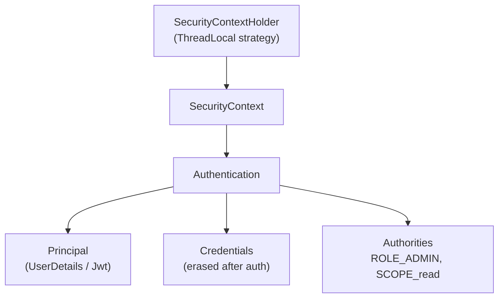
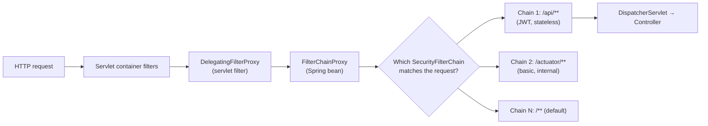
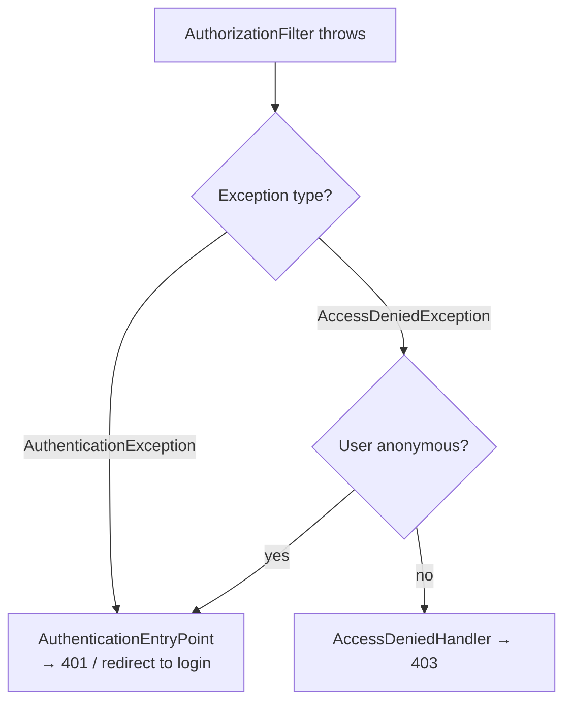
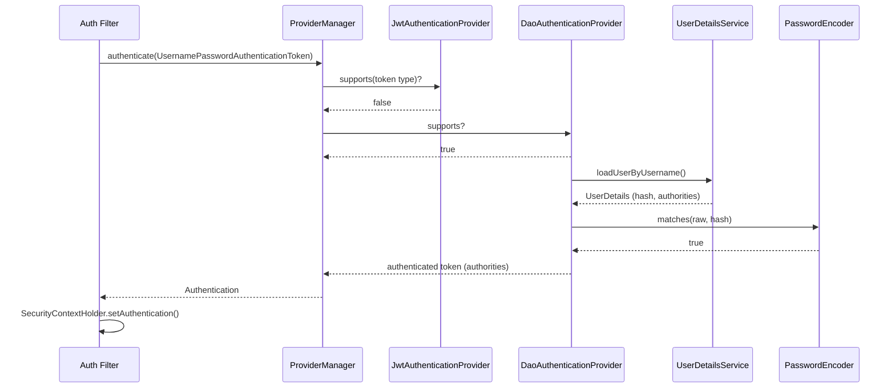
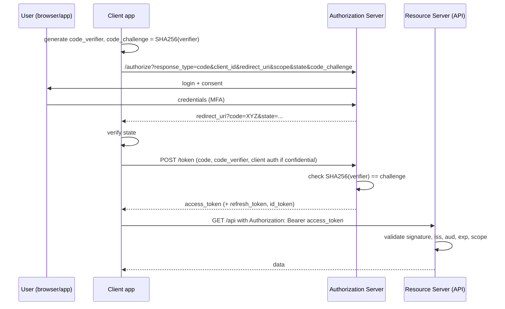
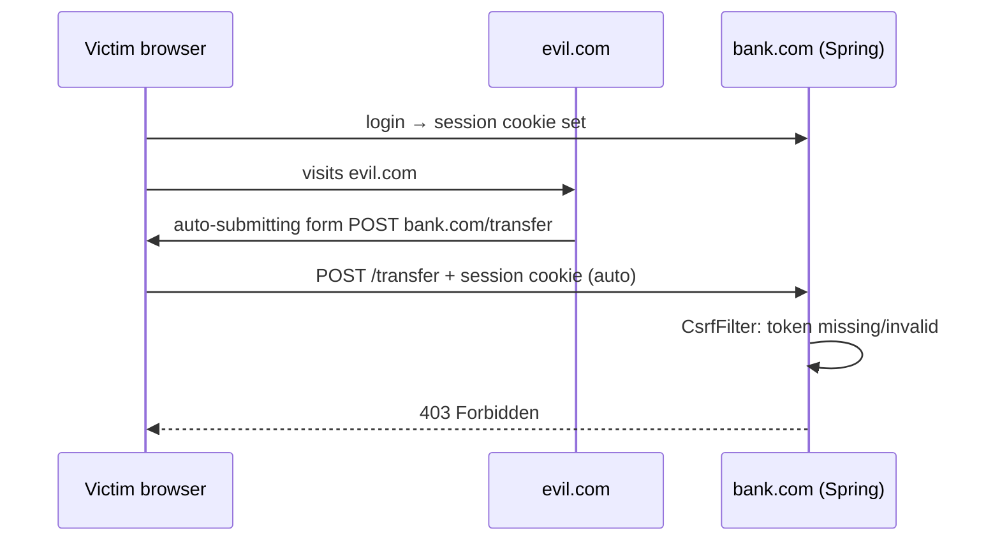

# Spring Security (5.x on Java 8): Interview Notes

**Why this matters in interviews:** Security questions show whether you understand *how a request becomes trusted*, not just whether you can paste a config. Senior interviews go straight to the filter chain, the gap between authentication and authorisation, JWT trade-offs, OAuth2 flows, and incidents like leaked tokens or missing CSRF protection. Getting security wrong is a breach, so confident, precise answers here carry a lot of weight.

> [!NOTE]
> These notes target **Spring Security 5.7.x**, which ships with Spring Boot 2.7 and supports Java 8. `WebSecurityConfigurerAdapter` is deprecated from 5.7, so all examples use the component-based `SecurityFilterChain` bean style. Spring Security 6 needs Java 17. See [Beyond Java 8](#13-beyond-java-8).

Difficulty legend: 🟢 Basic · 🟡 Intermediate · 🔴 Advanced · ⚡ Scenario

## Table of Contents

1. [Fundamentals](#1-fundamentals)
2. [The Filter Chain](#2-the-filter-chain)
3. [Authentication](#3-authentication)
4. [Authorization](#4-authorization)
5. [Stateless APIs and JWT](#5-stateless-apis-and-jwt)
6. [OAuth2 and OpenID Connect](#6-oauth2-and-openid-connect)
7. [Web Protections: CSRF, CORS, Headers, Sessions](#7-web-protections-csrf-cors-headers-sessions)
8. [Testing Security](#8-testing-security)
9. [Coding / Hands-on](#9-coding--hands-on)
10. [Production Scenarios](#10-production-scenarios)
11. [Cheat Sheet](#11-cheat-sheet)
12. [Revision Checklist](#12-revision-checklist)
13. [Beyond Java 8](#13-beyond-java-8)

---

## 1. Fundamentals

> **Mental model:** Think of an office building. **Authentication** is the reception desk checking your ID and giving you a badge. **Authorization** is each door's badge reader deciding whether *your* badge opens *that* door. The **SecurityContext** is the badge you carry around for the rest of the visit, which is one request.

### Q1. 🟢 What is the difference between authentication and authorization?

| | Authentication (AuthN) | Authorization (AuthZ) |
|---|---|---|
| Question | *Who are you?* | *What may you do?* |
| Inputs | Credentials (password, token, cert) | Identity + authorities + resource |
| Failure HTTP status | **401 Unauthorized** | **403 Forbidden** |
| Spring component | `AuthenticationManager` | `AccessDecisionManager` / `AuthorizationManager` |

<details><summary>Cross-questions</summary>

**Q:** Why is 401 called "Unauthorized" if it really means "unauthenticated"?

**A:** It's a historical naming quirk in HTTP. 401 means "you aren't authenticated, send credentials" and is sent with `WWW-Authenticate`. 403 means "I know who you are, and the answer is no."
</details>

### Q2. 🟢 What happens when you add `spring-boot-starter-security`?

Boot auto-configures a default `SecurityFilterChain`:

- **Every endpoint** requires authentication.
- Form login and HTTP Basic are turned on.
- A single in-memory user named `user` is created, with a random password printed in the startup log.
- CSRF protection and the default security headers are enabled.

Once you define your own `SecurityFilterChain` bean, Boot's default backs off.

<details><summary>Cross-questions</summary>

**Q:** How do you fix the default user's credentials for local development?

**A:** Set `spring.security.user.name` and `spring.security.user.password`. Never use this in production.
</details>

### Q3. 🟢 What are the core objects: `Authentication`, `Principal`, `GrantedAuthority`, `SecurityContext`?

- **`Authentication`**: the token for a request or an authenticated user. It holds the principal, the credentials, the authorities, the details, and an `isAuthenticated()` flag.
- **Principal**: *who* the user is, usually a `UserDetails` object or a `Jwt`.
- **`GrantedAuthority`**: a permission string such as `ROLE_ADMIN` or `SCOPE_reports:read`.
- **`SecurityContext`**: holds the current `Authentication`.
- **`SecurityContextHolder`**: gives access to the context, stored in a `ThreadLocal` by default.



<details><summary>Cross-questions</summary>

**Q:** Why are credentials erased after authentication?

**A:** `ProviderManager` calls `eraseCredentials()` (controlled by `eraseCredentialsAfterAuthentication`, which defaults to true), so the password doesn't linger in memory or in the session.
</details>

### Q4. 🟢 Roles vs authorities?

An **authority** is any permission string. A **role** is an authority with the `ROLE_` prefix. `hasRole('ADMIN')` checks for `ROLE_ADMIN`, while `hasAuthority('ADMIN')` checks the exact string.

> [!WARNING]
> A very common bug: storing `ADMIN` in the database and then checking `hasRole('ADMIN')`. The check looks for `ROLE_ADMIN`, so access is denied. Keep the naming consistent, or use `hasAuthority`.

<details><summary>Cross-questions</summary>

**Q:** What authorities does a JWT resource server create from scopes?

**A:** `SCOPE_<scope>` (for example `SCOPE_reports:read`), taken from the `scope` or `scp` claim by default.
</details>

### Q5. 🟡 How does `SecurityContextHolder` work across threads?

By default it uses `MODE_THREADLOCAL`, so the context belongs to the request thread only. The other strategies are `MODE_INHERITABLETHREADLOCAL` (copied to child threads when they're *created*, which is useless with pools) and `MODE_GLOBAL`.

#### 🎯 Predict the output

```java
import java.util.Collections;
import org.springframework.security.authentication.UsernamePasswordAuthenticationToken;
import org.springframework.security.core.context.SecurityContextHolder;

public class ContextThreads {
    public static void main(String[] args) throws InterruptedException {
        SecurityContextHolder.getContext().setAuthentication(
            new UsernamePasswordAuthenticationToken("dipendu", null, Collections.emptyList()));
        System.out.println(SecurityContextHolder.getContext().getAuthentication().getName());

        Thread t = new Thread(() ->
            System.out.println(SecurityContextHolder.getContext().getAuthentication()));
        t.start();
        t.join();
        SecurityContextHolder.clearContext();
    }
}
```

<details><summary>Answer</summary>

```text
dipendu
null
```

The new thread has its own empty `ThreadLocal` context. For `@Async` methods and executors, wrap the executor with `DelegatingSecurityContextExecutor`, or use a `TaskDecorator`.
</details>

### Q6. 🟢 What is the principle of least privilege, and how does it apply here?

Give each user, service and token **only the permissions it needs**. Examples: fine-grained scopes (`reports:read` vs `reports:write`), deny by default (`anyRequest().authenticated()` or `denyAll()`), separate service accounts per service, and short-lived tokens.

<details><summary>Cross-questions</summary>

**Q:** What does "deny by default" look like in config?

**A:** End the rules with `.anyRequest().denyAll()` (or `.authenticated()`) so that any endpoint nobody thought about isn't publicly reachable.
</details>

### Q7. 🟢 Stateful vs stateless authentication?

| | Session-based (stateful) | Token-based (stateless) |
|---|---|---|
| Server stores | Session (in memory/Redis) | Nothing per user (token is self-contained) |
| Client sends | `JSESSIONID` cookie | `Authorization: Bearer <token>` |
| Logout/revocation | Easy (invalidate session) | Hard (token valid until expiry) |
| Scaling | Needs sticky sessions or shared store | Any instance can verify |
| CSRF risk | Yes (cookies auto-sent) | Low if token isn't in a cookie |

<details><summary>Cross-questions</summary>

**Q:** Which suits mobile clients (Android and iOS) that send events?

**A:** Token-based. Mobile apps don't handle cookies naturally. Use short-lived access tokens plus refresh tokens from an identity provider.
</details>

### Q8. 🟢 What is `UserDetails` / `UserDetailsService`?

`UserDetailsService.loadUserByUsername(username)` returns a `UserDetails` object containing the username, the password hash, the authorities, and the account flags (enabled, locked, expired). `DaoAuthenticationProvider` uses it to check passwords.

<details><summary>Cross-questions</summary>

**Q:** What should happen when the user doesn't exist?

**A:** Throw `UsernameNotFoundException`. By default Spring turns it into a generic `BadCredentialsException` (`hideUserNotFoundExceptions`), so attackers can't discover which usernames exist.
</details>

### Q9. 🟢 Which authentication mechanisms does Spring Security support?

Form login, HTTP Basic, OAuth2 login (OIDC), OAuth2 resource server (JWT and opaque tokens), SAML2, LDAP, X.509 (mTLS), remember-me, and custom mechanisms through your own filters and providers.

<details><summary>Cross-questions</summary>

**Q:** Is HTTP Basic ever acceptable?

**A:** Only over HTTPS, for internal or machine clients, or for simple tools. The credentials are sent with **every** request, only Base64-encoded, which isn't encryption.
</details>

### Q10. 🟡 What is `DelegatingFilterProxy`, and why does it exist?

The servlet container only knows servlet filters, not Spring beans. `DelegatingFilterProxy` is a plain servlet filter registered with the container (named `springSecurityFilterChain`). It looks up the Spring bean **`FilterChainProxy`** and delegates each request to it. That's how Spring-managed security filters take part in the servlet pipeline.

<details><summary>Cross-questions</summary>

**Q:** Why can't Spring register every security filter directly with the container?

**A:** Spring Security needs its own ordering, several chains, request matching, and firewalling (`HttpFirewall`), all managed as beans. One delegating entry point keeps all of that under Spring's control.
</details>

### Q11. 🟡 What is `HttpFirewall`?

`StrictHttpFirewall` is the default. `FilterChainProxy` uses it to reject malicious URLs before any other processing: encoded slashes, `..` path traversal, semicolons, and HTTP methods that aren't allowed. A rejected request throws `RequestRejectedException`.

<details><summary>Cross-questions</summary>

**Q:** Should you relax it when a client sends an odd URL?

**A:** Only as narrowly as possible (for example, `setAllowSemicolon` if you truly need it). These checks block real path-confusion attacks.
</details>

### Q12. 🟡 What does the `@EnableWebSecurity` annotation do?

It imports the web security configuration: it creates `FilterChainProxy` and makes the `HttpSecurity` builder available. In Spring Boot it's applied automatically when Spring Security is on the classpath. You add it explicitly mainly in non-Boot apps, or to turn on `debug = true`.

<details><summary>Cross-questions</summary>

**Q:** What does `@EnableWebSecurity(debug = true)` do?

**A:** It logs every request together with the filter chain that handled it. It's useful locally, but **never in production**, because it logs sensitive request details.
</details>

### Q13. 🟢 Why is `WebSecurityConfigurerAdapter` deprecated?

Spring Security 5.7 moved to **component-based configuration**: you declare `SecurityFilterChain`, `UserDetailsService` and `WebSecurityCustomizer` beans instead of extending a base class. That's more composable, supports several chains cleanly, and fits Boot's bean model. The adapter class was removed in 6.0.

<details><summary>Cross-questions</summary>

**Q:** How do you migrate `configure(HttpSecurity)`?

**A:** Move the body into a `@Bean SecurityFilterChain filterChain(HttpSecurity http)` method that returns `http.build()`.
</details>

### Q14. 🟡 What are the OWASP Top 10 risks most relevant to Spring backends?

| Category | Example | Spring mitigation |
|---|---|---|
| Broken Access Control | Missing ownership check (IDOR) | Method security, ownership checks in service |
| Cryptographic Failures | Plain/MD5 passwords | BCrypt/Argon2 via `PasswordEncoder` |
| Injection | SQL concatenation | Prepared statements, JPA params |
| Security Misconfiguration | Exposed actuator, verbose errors | Lock down endpoints, generic errors |
| Identification & Auth Failures | No rate limit on login | Lockout, throttling, MFA |
| SSRF | Fetch arbitrary URL from user | Allow-list outbound hosts |

<details><summary>Cross-questions</summary>

**Q:** What is IDOR?

**A:** Insecure Direct Object Reference. For example, `GET /reports/123` returns report 123 without checking that it belongs to the caller. Authentication alone doesn't stop it; you need a per-object authorization check.
</details>

---

## 2. The Filter Chain

> **Mental model:** A request goes through **airport security lanes**. Each filter is one checkpoint: CORS checks the boarding pass format, CSRF checks the seal on your bag, the authentication filters check your passport, and the final gate (the authorization filter) checks whether your ticket lets you board *this* flight. Any checkpoint can send you back.

### Q15. 🔴 Draw the Spring Security architecture from container to controller.



`FilterChainProxy` picks the **first** `SecurityFilterChain` whose matcher fits the request, and runs **only** that chain.

<details><summary>Cross-questions</summary>

**Q:** What if two chains match the same request?

**A:** The first chain in `@Order` wins. Put specific matchers (such as `/api/**`) at a lower order number than the catch-all.
</details>

### Q16. 🔴 What is the order of the main security filters (Spring Security 5.7)?

| Order | Filter | Job |
|---|---|---|
| 1 | `DisableEncodeUrlFilter` / `WebAsyncManagerIntegrationFilter` | Housekeeping, propagate context to async MVC |
| 2 | `SecurityContextPersistenceFilter` | Load/save `SecurityContext` (from session) |
| 3 | `HeaderWriterFilter` | Security headers |
| 4 | `CorsFilter` | CORS preflight handling |
| 5 | `CsrfFilter` | CSRF token check |
| 6 | `LogoutFilter` | Handle logout URL |
| 7 | `UsernamePasswordAuthenticationFilter` | Form login |
| 8 | `BearerTokenAuthenticationFilter` | JWT/opaque bearer tokens (resource server) |
| 9 | `BasicAuthenticationFilter` | HTTP Basic |
| 10 | `RequestCacheAwareFilter` | Resume saved request after login |
| 11 | `SecurityContextHolderAwareRequestFilter` | Servlet API integration (`request.isUserInRole`) |
| 12 | `AnonymousAuthenticationFilter` | Anonymous token if none set |
| 13 | `SessionManagementFilter` | Session fixation, concurrency |
| 14 | `ExceptionTranslationFilter` | Converts security exceptions → 401/403 |
| 15 | `FilterSecurityInterceptor` / `AuthorizationFilter` | **Final authorization decision** |

> [!TIP]
> Say it like a senior engineer: "Authentication filters populate the `SecurityContext`, `ExceptionTranslationFilter` wraps everything after it, and the **last** filter makes the access decision. So a custom auth filter must sit **before** `AuthorizationFilter`, usually before `UsernamePasswordAuthenticationFilter`."

<details><summary>Cross-questions</summary>

**Q:** How do you print the actual filter list for your app?

**A:** Set the `org.springframework.security` log level to DEBUG. At startup the log lists the filters in each chain ("Will secure any request with [...]").
</details>

### Q17. 🟡 What does `ExceptionTranslationFilter` do?

It catches `AuthenticationException` and `AccessDeniedException` thrown **by the filters after it**:

- `AuthenticationException`, or access denied for an **anonymous** user → clears the context and calls the **`AuthenticationEntryPoint`** (401, a redirect to login, or `WWW-Authenticate: Bearer`).
- `AccessDeniedException` for an authenticated user → **`AccessDeniedHandler`** (403).



<details><summary>Cross-questions</summary>

**Q:** Why doesn't `@ControllerAdvice` see these exceptions?

**A:** Most of them are thrown in the filter chain, before `DispatcherServlet`. Exceptions from `@PreAuthorize` method security *are* thrown inside MVC, so an advice that catches `AccessDeniedException` can intercept them (and may accidentally turn a 403 into a 500).
</details>

### Q18. 🟡 How do you add a custom filter in the right place?

```java
import java.io.IOException;
import javax.servlet.FilterChain;
import javax.servlet.ServletException;
import javax.servlet.http.HttpServletRequest;
import javax.servlet.http.HttpServletResponse;
import org.springframework.context.annotation.Bean;
import org.springframework.context.annotation.Configuration;
import org.springframework.security.config.annotation.web.builders.HttpSecurity;
import org.springframework.security.web.SecurityFilterChain;
import org.springframework.security.web.authentication.UsernamePasswordAuthenticationFilter;
import org.springframework.web.filter.OncePerRequestFilter;

@Configuration
public class CustomFilterConfig {

    static class RequestAuditFilter extends OncePerRequestFilter {
        @Override
        protected void doFilterInternal(HttpServletRequest req, HttpServletResponse res, FilterChain chain)
                throws ServletException, IOException {
            // e.g. record client type (android/ios/web) for metrics; never log tokens
            chain.doFilter(req, res);
        }
    }

    @Bean
    public SecurityFilterChain api(HttpSecurity http) throws Exception {
        http.addFilterBefore(new RequestAuditFilter(), UsernamePasswordAuthenticationFilter.class)
            .authorizeHttpRequests(a -> a.anyRequest().authenticated())
            .httpBasic();
        return http.build();
    }
}
```

> [!WARNING]
> If you also annotate a custom `Filter` with `@Component`, Boot registers it with the **servlet container** as well, so it runs twice (once outside the security chain). Either don't make it a bean, or disable the container registration with a `FilterRegistrationBean` that has `setEnabled(false)`.

<details><summary>Cross-questions</summary>

**Q:** Why extend `OncePerRequestFilter`?

**A:** It guarantees the filter runs only once per request, even across forwards, includes and async re-dispatches.
</details>

### Q19. 🟡 How do you define multiple filter chains (for example API vs Actuator)?

```java
import org.springframework.context.annotation.Bean;
import org.springframework.context.annotation.Configuration;
import org.springframework.core.annotation.Order;
import org.springframework.security.config.annotation.web.builders.HttpSecurity;
import org.springframework.security.config.http.SessionCreationPolicy;
import org.springframework.security.web.SecurityFilterChain;

@Configuration
public class MultiChainConfig {

    @Bean @Order(1)
    public SecurityFilterChain actuatorChain(HttpSecurity http) throws Exception {
        http.antMatcher("/actuator/**")
            .authorizeHttpRequests(a -> a
                .antMatchers("/actuator/health/**").permitAll()
                .anyRequest().hasRole("OPS"))
            .httpBasic();
        return http.build();
    }

    @Bean @Order(2)
    public SecurityFilterChain apiChain(HttpSecurity http) throws Exception {
        http.antMatcher("/api/**")
            .csrf().disable()
            .sessionManagement(s -> s.sessionCreationPolicy(SessionCreationPolicy.STATELESS))
            .authorizeHttpRequests(a -> a.anyRequest().authenticated())
            .oauth2ResourceServer(o -> o.jwt());
        return http.build();
    }
}
```

<details><summary>Cross-questions</summary>

**Q:** What's the difference between `http.antMatcher(...)` and `authorizeHttpRequests().antMatchers(...)`?

**A:** `http.antMatcher` decides **which requests this chain handles at all**. The matchers inside `authorizeHttpRequests` decide **access rules** within that chain. (5.8+ renames them to `securityMatcher` and `requestMatchers`.)
</details>

### Q20. 🟡 How does `SecurityContextPersistenceFilter` work, and what changed in newer versions?

At the start of a request it loads the `SecurityContext` from the `SecurityContextRepository` (by default the `HttpSession`), and at the end it saves it back and clears the `ThreadLocal`. In 5.7 there's also a newer `SecurityContextHolderFilter` that doesn't save automatically; 6.0 makes it the default, and authentication mechanisms save the context explicitly.

<details><summary>Cross-questions</summary>

**Q:** With `STATELESS` session policy, where does the context come from on each request?

**A:** Nothing is stored between requests. The bearer token filter authenticates every request from the token again.
</details>

### Q21. 🟡 `web.ignoring()` vs `permitAll()`?

- `WebSecurityCustomizer` → `web.ignoring()` **skips the whole security chain**: no security headers, no firewall, and no `SecurityContext`.
- `permitAll()` still runs the chain (headers, CSRF, anonymous auth) but allows access.

Spring logs a warning when you use `ignoring()` for anything other than static resources. Prefer `permitAll()`.

<details><summary>Cross-questions</summary>

**Q:** Why can `ignoring()` be a security bug?

**A:** Endpoints under an ignored path lose headers such as `X-Content-Type-Options`, and code that reads `SecurityContextHolder` gets `null` instead of an anonymous token.
</details>

### Q22. 🟡 What is the `AnonymousAuthenticationFilter` for?

If nothing has authenticated the request by that point, it puts an `AnonymousAuthenticationToken` into the context, with the authority `ROLE_ANONYMOUS`. Authorization rules can then treat "not logged in" uniformly, and `ExceptionTranslationFilter` knows to send a 401 rather than a 403.

<details><summary>Cross-questions</summary>

**Q:** Does `isAuthenticated()` return true for the anonymous token?

**A:** The token's `isAuthenticated()` returns true. The SpEL `isAuthenticated()` expression returns **false** for anonymous users, because it uses `AuthenticationTrustResolver`. Use the SpEL expressions, not the raw flag.
</details>

### Q23. 🟡 How is logout handled?

`LogoutFilter` matches `/logout` (a POST when CSRF is enabled). It runs `LogoutHandler`s (invalidate the session, clear the context, delete cookies, remove remember-me tokens), then a `LogoutSuccessHandler`. With stateless JWT there's nothing to invalidate on the server. The client discards its tokens, and you revoke the refresh token at the identity provider.

<details><summary>Cross-questions</summary>

**Q:** How do you "log out" an access token that was stolen?

**A:** Keep access tokens short-lived (5–15 minutes) and revoke refresh tokens. For immediate cut-off you need a denylist (for example, a Redis set of revoked `jti` values until they expire) or opaque tokens with introspection.
</details>

### Q24. 🟡 What does `RequestCacheAwareFilter` do?

When an unauthenticated user hits a protected page, the original request is saved (`HttpSessionRequestCache`). After login, the user is redirected back to it. This only matters for browser flows, so disable it for stateless APIs (`http.requestCache().disable()`), otherwise it creates sessions.

<details><summary>Cross-questions</summary>

**Q:** Why would a stateless API still create `JSESSIONID` cookies?

**A:** The request cache, CSRF token storage in the session, or form login is still active. Set the session policy to `STATELESS`, and disable the request cache and form login.
</details>

### Q25. 🔴 `FilterSecurityInterceptor` vs `AuthorizationFilter`?

`FilterSecurityInterceptor` is the legacy approach (`authorizeRequests()`), built on `AccessDecisionManager` with voters. `AuthorizationFilter` (`authorizeHttpRequests()`, 5.5+) is built on the simpler `AuthorizationManager` API. It's the recommended approach, and the default in 6.x.

<details><summary>Cross-questions</summary>

**Q:** What is a voter?

**A:** An `AccessDecisionVoter` returns GRANTED, DENIED or ABSTAIN. `AffirmativeBased` (grant if any voter grants), `ConsensusBased` and `UnanimousBased` combine the votes. `AuthorizationManager` replaces this with a single `check()` method.
</details>

### Q26. 🟡 How do you secure async requests and executors?

- `WebAsyncManagerIntegrationFilter` propagates the context into Servlet 3 async (`Callable`) processing.
- For your own executors, use `DelegatingSecurityContextExecutorService` or `DelegatingSecurityContextAsyncTaskExecutor`.
- For `@Async`, wrap the configured executor.

<details><summary>Cross-questions</summary>

**Q:** What's the risk of a global `MODE_INHERITABLETHREADLOCAL`?

**A:** Pooled threads keep the *first* user's context and serve it to later tasks. That's a data-leak bug.
</details>

### Q27. 🟡 How does the Actuator interact with security?

With Spring Security on the classpath and no custom chain, every Actuator endpoint except `/health` requires authentication. Once you define your own chains, securing the actuator is your job: use `EndpointRequest.toAnyEndpoint()` matchers, give it its own chain or management port, and require an ops role.

<details><summary>Cross-questions</summary>

**Q:** Should `/actuator/health` show component details publicly?

**A:** No. Set `management.endpoint.health.show-details=when_authorized`, because the details reveal infrastructure (DB type, disk and so on).
</details>

### Q28. 🟡 Why can't a security filter use `@ControllerAdvice` error formatting, and what should you do instead?

Filters run before the MVC layer. For consistent JSON error bodies, implement your own `AuthenticationEntryPoint` and `AccessDeniedHandler` that write the same error format as your advice.

```java
import java.io.IOException;
import javax.servlet.http.HttpServletRequest;
import javax.servlet.http.HttpServletResponse;
import org.springframework.security.core.AuthenticationException;
import org.springframework.security.web.AuthenticationEntryPoint;

public class JsonEntryPoint implements AuthenticationEntryPoint {
    @Override
    public void commence(HttpServletRequest req, HttpServletResponse res, AuthenticationException ex)
            throws IOException {
        res.setStatus(HttpServletResponse.SC_UNAUTHORIZED);
        res.setContentType("application/json");
        res.getWriter().write("{\"error\":\"UNAUTHENTICATED\"}");   // no exception details
    }
}
```

<details><summary>Cross-questions</summary>

**Q:** Why not include `ex.getMessage()` in the response?

**A:** It can reveal *why* authentication failed (for example, "user locked" vs "bad password"), which helps attackers enumerate accounts.
</details>

---
## 3. Authentication

> **Mental model:** The `AuthenticationManager` is a *front desk manager* with a team of specialists (the providers). One knows passwords, one knows JWTs, one knows LDAP. The manager hands your credentials to each specialist in turn until one says "I can handle this", and then either stamps your badge or rejects you.

### Q29. 🔴 How does `AuthenticationManager` / `ProviderManager` / `AuthenticationProvider` work?



<details><summary>Cross-questions</summary>

**Q:** What happens if no provider supports the token?

**A:** `ProviderManager` delegates to its **parent** manager if there is one. Otherwise it throws `ProviderNotFoundException`.

**Q:** How do you add LDAP next to database login?

**A:** Register both providers. The first one that supports the token and succeeds wins. If a provider fails, `ProviderManager` tries the next one and throws the last exception only when all of them fail.
</details>

### Q30. 🟢 Why hash passwords, and why BCrypt?

Store **one-way, salted, deliberately slow** hashes, so that a database leak doesn't reveal the passwords. BCrypt includes a random salt and an adjustable **work factor** (the default strength is 10), so brute force stays expensive as hardware gets faster. Argon2 and SCrypt are also supported, and they're memory-hard.

#### 🎯 Predict the output

```java
import org.springframework.security.crypto.bcrypt.BCryptPasswordEncoder;

public class BcryptDemo {
    public static void main(String[] args) {
        BCryptPasswordEncoder enc = new BCryptPasswordEncoder();
        String h1 = enc.encode("secret");
        String h2 = enc.encode("secret");
        System.out.println(h1.equals(h2));
        System.out.println(enc.matches("secret", h1) && enc.matches("secret", h2));
        System.out.println(h1.startsWith("$2a$10$"));
    }
}
```

<details><summary>Answer</summary>

`false`, `true`, `true`. Each hash gets a **random salt**, so hashing the same password twice produces different strings, and both still match. `$2a$10$` shows the algorithm version and a cost of 10, which means 2^10 rounds.
</details>

> [!WARNING]
> Never use MD5, SHA-1 or unsalted SHA-256 for passwords. They're fast, and speed is exactly what an attacker wants.

<details><summary>Cross-questions</summary>

**Q:** How long should a hash take to compute?

**A:** Tune it to roughly 100 ms to 1 s on your hardware. Slow enough to hurt brute force, fast enough for logins.
</details>

### Q31. 🟡 What is `DelegatingPasswordEncoder`, and why use it?

`PasswordEncoderFactories.createDelegatingPasswordEncoder()` stores hashes with an ID prefix, such as `{bcrypt}$2a$10$...`. That lets you **migrate algorithms** gradually: old hashes keep working, and new hashes use the current default. `upgradeEncoding` can re-hash a password transparently when the user logs in.

<details><summary>Cross-questions</summary>

**Q:** What happens if a stored password has no `{id}` prefix?

**A:** Matching throws `IllegalArgumentException: There is no PasswordEncoder mapped for the id "null"`, unless you configure `setDefaultPasswordEncoderForMatches`.
</details>

### Q32. 🟡 How do you implement a DB-backed `UserDetailsService`?

```java
import java.util.Collections;
import org.springframework.security.core.authority.SimpleGrantedAuthority;
import org.springframework.security.core.userdetails.User;
import org.springframework.security.core.userdetails.UserDetails;
import org.springframework.security.core.userdetails.UserDetailsService;
import org.springframework.security.core.userdetails.UsernameNotFoundException;
import org.springframework.stereotype.Service;

@Service
public class DbUserDetailsService implements UserDetailsService {

    interface UserRepo { AppUser findByUsername(String u); }
    static class AppUser { String username; String passwordHash; String role; boolean active; }

    private final UserRepo repo;
    public DbUserDetailsService(UserRepo repo) { this.repo = repo; }

    @Override
    public UserDetails loadUserByUsername(String username) {
        AppUser u = repo.findByUsername(username);
        if (u == null) throw new UsernameNotFoundException("not found");
        return User.withUsername(u.username)
                   .password(u.passwordHash)                 // already hashed
                   .authorities(Collections.singletonList(new SimpleGrantedAuthority("ROLE_" + u.role)))
                   .disabled(!u.active)
                   .build();
    }
}
```

<details><summary>Cross-questions</summary>

**Q:** Should `loadUserByUsername` be cached?

**A:** Cautiously. A cached `UserDetails` delays disabling or locking a user. If you cache, use a short TTL and evict on change.
</details>

### Q33. 🟡 How do you write a custom `AuthenticationProvider` (for example, for an API key)?

```java
import java.util.Collections;
import org.springframework.security.authentication.AbstractAuthenticationToken;
import org.springframework.security.authentication.AuthenticationProvider;
import org.springframework.security.authentication.BadCredentialsException;
import org.springframework.security.core.Authentication;
import org.springframework.security.core.authority.SimpleGrantedAuthority;

public class ApiKeyAuthenticationProvider implements AuthenticationProvider {

    public static class ApiKeyToken extends AbstractAuthenticationToken {
        private final String key; private final String client;
        public ApiKeyToken(String key) { super(null); this.key = key; this.client = null; }
        public ApiKeyToken(String client, String role) {
            super(Collections.singletonList(new SimpleGrantedAuthority(role)));
            this.key = null; this.client = client; setAuthenticated(true);
        }
        @Override public Object getCredentials() { return key; }
        @Override public Object getPrincipal() { return client; }
    }

    public interface ApiKeyStore { String clientForHashedKey(String rawKey); }
    private final ApiKeyStore store;
    public ApiKeyAuthenticationProvider(ApiKeyStore store) { this.store = store; }

    @Override
    public Authentication authenticate(Authentication auth) {
        String raw = (String) auth.getCredentials();
        String client = store.clientForHashedKey(raw);        // compare hashed keys, not plain
        if (client == null) throw new BadCredentialsException("invalid key");
        return new ApiKeyToken(client, "ROLE_PARTNER");
    }
    @Override
    public boolean supports(Class<?> type) { return ApiKeyToken.class.isAssignableFrom(type); }
}
```

<details><summary>Cross-questions</summary>

**Q:** Why store API keys hashed?

**A:** For the same reason as passwords: a leaked DB mustn't hand out usable keys. Show the key once at creation, then store only its hash (SHA-256 is fine here, because the keys are long and random).
</details>

### Q34. 🟡 How does form login work, in brief?

`UsernamePasswordAuthenticationFilter` handles `POST /login`, builds a token, and calls the manager. On success, the `AuthenticationSuccessHandler` stores the context in the session (changing the session ID) and redirects. On failure, the `AuthenticationFailureHandler` redirects to `/login?error`.

<details><summary>Cross-questions</summary>

**Q:** What is session fixation, and how does Spring prevent it?

**A:** An attacker plants a known session ID before login and reuses it afterwards. By default Spring **changes the session ID on authentication** (`changeSessionId`).
</details>

### Q35. 🟡 How does remember-me work?

Remember-me issues a long-lived cookie. There are two strategies:

- **Hash-based:** the cookie holds the username, the expiry, and a hash of those values together with the password and a key.
- **Persistent token:** a series and token pair stored in the DB. It's safer, because each token is single-use and theft is detected.

Users logged in through remember-me aren't "fully authenticated", so require a fresh login for sensitive operations (`fullyAuthenticated()`).

<details><summary>Cross-questions</summary>

**Q:** Should an API use remember-me?

**A:** No. It's a browser session feature. APIs use refresh tokens instead.
</details>

### Q36. 🟡 How do you implement account lockout or brute-force protection?

- Count failed attempts per user and per IP (in Redis with a TTL), triggered from `AuthenticationFailureBadCredentialsEvent`.
- Lock the account temporarily (`accountNonLocked = false`) or add increasing delays.
- Rate-limit the login endpoint.
- Add CAPTCHA or MFA after N failures.
- Clear the counter on `AuthenticationSuccessEvent`.

<details><summary>Cross-questions</summary>

**Q:** What's the risk of a hard lockout?

**A:** Denial of service: an attacker can lock out real users on purpose. Prefer time-limited locks, progressive delays and IP throttling.
</details>

### Q37. 🟡 How do you listen to authentication events?

Spring publishes `AuthenticationSuccessEvent`, `AbstractAuthenticationFailureEvent` subtypes and `AuthorizationDeniedEvent` (5.7+) through `AuthenticationEventPublisher`. Handle them with an `@EventListener` for audit logs and metrics.

<details><summary>Cross-questions</summary>

**Q:** What should an audit log record?

**A:** Who (the principal ID), what, when, from where (IP or client), and the outcome. Never the passwords or tokens.
</details>

### Q38. 🟡 How does X.509 / mTLS authentication work for service-to-service calls?

Both sides present certificates during the TLS handshake. `x509()` extracts the client certificate's subject (a CN regex) and maps it to a `UserDetails`. It's a strong machine identity with no shared secrets in headers. In Kubernetes, a service mesh (Istio) often handles mTLS transparently.

<details><summary>Cross-questions</summary>

**Q:** mTLS vs OAuth2 client credentials?

**A:** mTLS authenticates the *connection*, at the transport layer. Client credentials authenticate the *call* with scoped tokens, at the application layer. They're often used together.
</details>

### Q39. 🟡 How does multi-factor authentication fit in?

In practice MFA is delegated to the **identity provider** (Okta, Keycloak, Azure AD or Google Identity) through OIDC, and your app trusts the `amr` / `acr` claims. Building MFA yourself (TOTP) means an extra step after the password, and granting full authorities only after the second factor.

<details><summary>Cross-questions</summary>

**Q:** Why delegate to an IdP?

**A:** Security features like MFA, password policies, breach detection and account recovery are hard to get right. A specialised IdP maintains them.
</details>

### Q40. 🟡 How do you get the current user in a controller?

Options:

- `@AuthenticationPrincipal UserDetails user`, or `@AuthenticationPrincipal Jwt jwt`.
- A `Principal` or `Authentication` method parameter.
- `SecurityContextHolder.getContext().getAuthentication()` in service code (use this sparingly).

<details><summary>Cross-questions</summary>

**Q:** Why prefer passing the user ID explicitly into service methods?

**A:** It makes services testable and independent of the thread, which matters in `@Async` code, batch jobs and Kafka consumers, where there's no HTTP security context.
</details>

### Q41. 🟡 How do you expose the `AuthenticationManager` as a bean in 5.7+?

```java
import org.springframework.context.annotation.Bean;
import org.springframework.context.annotation.Configuration;
import org.springframework.security.authentication.AuthenticationManager;
import org.springframework.security.config.annotation.authentication.configuration.AuthenticationConfiguration;

@Configuration
public class AuthManagerConfig {
    @Bean
    public AuthenticationManager authenticationManager(AuthenticationConfiguration config) throws Exception {
        return config.getAuthenticationManager();
    }
}
```

<details><summary>Cross-questions</summary>

**Q:** When would you need it?

**A:** For a custom login endpoint (for example, `POST /auth/token`) that authenticates credentials and then issues a token.
</details>

### Q42. 🟡 What account status flags does `UserDetails` have, and how are they checked?

`isEnabled`, `isAccountNonLocked`, `isAccountNonExpired` and `isCredentialsNonExpired`. `DaoAuthenticationProvider` checks them with pre- and post-authentication checkers and throws `DisabledException`, `LockedException` and so on.

<details><summary>Cross-questions</summary>

**Q:** Are the flags checked before or after the password?

**A:** Locked, disabled and expired are checked **before** the password (pre-auth checks). Credentials expiry is checked **after**.
</details>

---

## 4. Authorization

> **Mental model:** URL rules are *building-level* access: "only staff past this door". Method security is *room-level*: "only managers in this meeting room". Ownership checks are *locker-level*: "only you can open locker 123". Real systems need all three.

### Q43. 🟢 How do you configure URL-based authorization?

```java
import org.springframework.context.annotation.Bean;
import org.springframework.context.annotation.Configuration;
import org.springframework.http.HttpMethod;
import org.springframework.security.config.annotation.web.builders.HttpSecurity;
import org.springframework.security.web.SecurityFilterChain;

@Configuration
public class UrlAuthzConfig {
    @Bean
    public SecurityFilterChain chain(HttpSecurity http) throws Exception {
        http.authorizeHttpRequests(a -> a
                .antMatchers("/public/**").permitAll()
                .antMatchers(HttpMethod.GET, "/api/reports/**").hasAuthority("SCOPE_reports:read")
                .antMatchers(HttpMethod.POST, "/api/reports/**").hasAuthority("SCOPE_reports:write")
                .antMatchers("/api/admin/**").hasRole("ADMIN")
                .anyRequest().authenticated())
            .oauth2ResourceServer(o -> o.jwt());
        return http.build();
    }
}
```

> [!WARNING]
> **Order matters.** The first matching rule wins. Putting `.anyRequest().authenticated()` or a broad `/api/**` rule first makes the specific rules after it unreachable.

<details><summary>Cross-questions</summary>

**Q:** `antMatchers` vs `mvcMatchers`?

**A:** `mvcMatchers` uses Spring MVC's own path matching, so `/admin` also covers `/admin/` and `/admin.json`. `antMatchers("/admin")` doesn't, which can leave a bypass. Prefer `mvcMatchers` (or `requestMatchers` in 5.8+) for MVC endpoints.
</details>

### Q44. 🟡 How do you enable method security, and what annotations are there?

`@EnableGlobalMethodSecurity(prePostEnabled = true)` in 5.x, or `@EnableMethodSecurity` in 5.6+, where pre/post is on by default.

| Annotation | Evaluated | Example |
|---|---|---|
| `@PreAuthorize` | Before method, SpEL | `@PreAuthorize("hasRole('ADMIN')")` |
| `@PostAuthorize` | After, can check `returnObject` | `@PostAuthorize("returnObject.owner == authentication.name")` |
| `@PreFilter` / `@PostFilter` | Filter collection args/results | `@PostFilter("filterObject.tenant == principal.tenant")` |
| `@Secured` | Before, roles only | `@Secured("ROLE_ADMIN")` |
| `@RolesAllowed` | JSR-250 | `@RolesAllowed("ADMIN")` |

<details><summary>Cross-questions</summary>

**Q:** Does method security suffer from self-invocation?

**A:** Yes. It's proxy-based, like `@Transactional`, so internal `this.` calls skip the check.

**Q:** Why is `@PostFilter` on a large list a performance trap?

**A:** It loads **everything** and filters in memory. Filter in the query instead (`WHERE tenant_id = ?`).
</details>

### Q45. 🟡 How do you implement ownership checks (IDOR protection)?

```java
import org.springframework.security.access.prepost.PreAuthorize;
import org.springframework.stereotype.Component;
import org.springframework.stereotype.Service;

@Component("reportAuthz")
class ReportAuthz {
    public boolean canRead(String reportId, String username) {
        return lookupOwner(reportId).equals(username);        // real code: repository query
    }
    private String lookupOwner(String id) { return "dipendu"; }
}

@Service
public class ReportQueryService {
    @PreAuthorize("hasRole('ADMIN') or @reportAuthz.canRead(#reportId, authentication.name)")
    public String download(String reportId) {
        return "signed-url-for-" + reportId;
    }
}
```

<details><summary>Cross-questions</summary>

**Q:** Is `#reportId` always available in SpEL?

**A:** Only if parameter names are available at runtime: compile with `-parameters` (Boot's Maven plugin does), or annotate the parameter with `@P("reportId")`.

**Q:** What's an alternative to per-call checks?

**A:** **Scope the query** to the caller: `findByIdAndOwner(id, user)`. It returns 404 for other users' data, which also avoids revealing that the resource exists.
</details>

### Q46. 🟡 404 or 403 for resources the user can't access?

Returning **404** for resources that exist but belong to someone else hides their existence and prevents enumeration. 403 is correct when the resource is known or public but the action isn't allowed. Stay consistent within an API.

<details><summary>Cross-questions</summary>

**Q:** When is 403 clearly better?

**A:** When the user can see a resource but can't modify it (read allowed, write denied).
</details>

### Q47. 🟡 How do you model a role hierarchy?

```java
import org.springframework.context.annotation.Bean;
import org.springframework.context.annotation.Configuration;
import org.springframework.security.access.hierarchicalroles.RoleHierarchy;
import org.springframework.security.access.hierarchicalroles.RoleHierarchyImpl;

@Configuration
public class RoleHierarchyConfig {
    @Bean
    public RoleHierarchy roleHierarchy() {
        RoleHierarchyImpl h = new RoleHierarchyImpl();
        h.setHierarchy("ROLE_ADMIN > ROLE_ANALYST\nROLE_ANALYST > ROLE_VIEWER");
        return h;
    }
}
```

An ADMIN now automatically has ANALYST and VIEWER permissions.

<details><summary>Cross-questions</summary>

**Q:** Is the hierarchy applied automatically everywhere?

**A:** Not in every version and path. In 5.x it has to be wired into the expression handlers for URL and method security. Verify it with tests.
</details>

### Q48. 🟡 RBAC vs ABAC?

- **RBAC** (role-based): permissions come through roles. It's simple, but you get role explosion for fine-grained rules.
- **ABAC** (attribute-based): decisions use attributes of the user, resource and context (tenant, region, time, ownership). It's more expressive, and in Spring you implement it with custom SpEL beans or an `AuthorizationManager`, or with an external engine like OPA.

<details><summary>Cross-questions</summary>

**Q:** Which did the reporting platform need?

**A:** A mix: RBAC for features (who can run ad-hoc queries), plus ABAC for data (tenant and dataset-level access to query results).
</details>

### Q49. 🟡 How do you implement multi-tenancy isolation in security?

Put the tenant ID in the token (a claim), extract it into the security context, and **enforce it at the data layer** on every query (a Hibernate filter, row-level security in PostgreSQL, or repository methods that always take a tenant). Include the tenant in cache keys and in storage paths (GCS prefixes).

<details><summary>Cross-questions</summary>

**Q:** What's the worst multi-tenant bug?

**A:** A cache key without the tenant, which serves tenant A's report to tenant B. Every layer (DB, cache, storage, logs) must be tenant-aware.
</details>

### Q50. 🔴 How do you write a custom `AuthorizationManager` (5.5+)?

```java
import java.util.function.Supplier;
import org.springframework.security.authorization.AuthorizationDecision;
import org.springframework.security.authorization.AuthorizationManager;
import org.springframework.security.core.Authentication;
import org.springframework.security.web.access.intercept.RequestAuthorizationContext;

public class BusinessHoursAuthz implements AuthorizationManager<RequestAuthorizationContext> {
    @Override
    public AuthorizationDecision check(Supplier<Authentication> auth, RequestAuthorizationContext ctx) {
        int hour = java.time.LocalTime.now(java.time.ZoneOffset.UTC).getHour();
        boolean ok = auth.get().isAuthenticated() && hour >= 6 && hour < 22;
        return new AuthorizationDecision(ok);
    }
}
```

Use it with `.antMatchers("/api/bulk-export/**").access(new BusinessHoursAuthz())`.

<details><summary>Cross-questions</summary>

**Q:** Why is the `Authentication` passed as a `Supplier`?

**A:** Lazy evaluation: rules that don't need it (for example `permitAll`) never trigger the lookup.
</details>

### Q51. 🟢 What SpEL expressions are commonly used?

`hasRole`, `hasAnyRole`, `hasAuthority`, `hasAnyAuthority`, `isAuthenticated()`, `isAnonymous()`, `isFullyAuthenticated()`, `permitAll`, `denyAll`, `principal`, `authentication`, plus bean references (`@bean.method(...)`) and method arguments (`#arg`).

<details><summary>Cross-questions</summary>

**Q:** What's the difference between `principal` and `authentication.name`?

**A:** `principal` is the principal object (`UserDetails`, `Jwt`, or a String). `authentication.name` is always a String (the username or the `sub` claim).
</details>

### Q52. 🟡 Where should authorization live: gateway, service or DB?

In **defence in depth**, each layer checks something:

- **The gateway** checks coarse things: a valid token and the API scope.
- **The service** checks business rules and ownership.
- **The database** uses least-privilege accounts, and possibly row-level security.

Never rely only on the gateway. Internal calls or a misrouted request can bypass it.

<details><summary>Cross-questions</summary>

**Q:** Is "the network is internal, so skip auth" OK?

**A:** No. Zero-trust networking assumes the internal network is hostile too. At minimum use mTLS or service tokens.
</details>

### Q53. 🟡 How do you secure Kafka and Pub/Sub consumers, where there's no HTTP request?

Security happens at the **broker and IAM level**:

- **Kafka:** SASL (SCRAM or OAUTHBEARER) or mTLS authentication, plus **ACLs** per topic and consumer group.
- **Pub/Sub:** IAM roles (`roles/pubsub.subscriber` on the subscription) for the service account.

Inside the message, validate the schema and never trust user IDs embedded in the payload without a verified source.

<details><summary>Cross-questions</summary>

**Q:** How do you carry the user's identity through async events?

**A:** Put the **verified** user ID (not a raw token) into an event header or field at the edge, where it was authenticated. Downstream consumers trust the producer through broker ACLs.
</details>

### Q54. 🟡 How do you protect ad-hoc query execution endpoints (a reporting platform)?

- Allow-list the query templates, or use parameterised queries. **Never** concatenate user input into SQL.
- Run queries with a **read-only, least-privilege DB user** and a statement timeout.
- Apply row and column restrictions per tenant.
- Limit result sizes, and rate-limit per user.
- Audit every query execution.

<details><summary>Cross-questions</summary>

**Q:** What if power users *must* write raw SQL?

**A:** Run it against a sandboxed, read-only replica or warehouse, with a restricted role, row-level security, timeouts and cost limits, plus a SQL parser to block DDL and DML.
</details>

### Q55. 🟡 How do you deny by default at the method level?

Secure the classes and methods with explicit annotations, and add tests (or an ArchUnit rule) that fail the build if a public service method lacks a security annotation. In 6.x you can also apply an `AuthorizationManager` to all methods.

<details><summary>Cross-questions</summary>

**Q:** Why do tests for authorization rules matter?

**A:** Refactors quietly break rules, for example by moving a method or renaming a role. Security regression tests catch that.
</details>

### Q56. 🟡 What's the difference between `@Secured("ROLE_ADMIN")` and `@PreAuthorize("hasRole('ADMIN')")`?

`@Secured` only takes role names (with the `ROLE_` prefix) and doesn't support SpEL. `@PreAuthorize` supports full SpEL: parameters, beans and combined conditions. Prefer `@PreAuthorize`.

<details><summary>Cross-questions</summary>

**Q:** Which setting enables `@Secured`?

**A:** `securedEnabled = true` on `@EnableGlobalMethodSecurity` (or `@EnableMethodSecurity`).
</details>

---
## 5. Stateless APIs and JWT

> **Mental model:** A JWT is a *tamper-evident wristband* at a festival. Anyone can **read** what's printed on it (it's only Base64), but nobody can **change** it without breaking the seal (the signature). The gate staff can check the seal without phoning head office, which is why it's stateless. The catch: you can't un-issue a wristband before it expires.

### Q57. 🟢 What is a JWT, and how is it structured?

`header.payload.signature`, where each part is **Base64URL-encoded**:

- **Header:** `{"alg":"RS256","typ":"JWT","kid":"key-1"}`
- **Payload (claims):** `sub`, `iss`, `aud`, `exp`, `iat`, `nbf`, `jti`, plus custom claims (`scope`, `tenant`)
- **Signature:** `sign(base64(header) + "." + base64(payload), key)`

#### 🎯 Predict the output

```java
import java.nio.charset.StandardCharsets;
import java.util.Base64;

public class JwtIsNotEncrypted {
    public static void main(String[] args) {
        String payloadJson = "{\"sub\":\"user-42\",\"role\":\"ADMIN\"}";
        String encoded = Base64.getUrlEncoder().withoutPadding()
            .encodeToString(payloadJson.getBytes(StandardCharsets.UTF_8));
        // anyone who intercepts the token can do this:
        String decoded = new String(Base64.getUrlDecoder().decode(encoded), StandardCharsets.UTF_8);
        System.out.println(decoded);
    }
}
```

<details><summary>Answer</summary>

`{"sub":"user-42","role":"ADMIN"}`. A signed JWT (JWS) is **readable by anyone**. The signature protects **integrity**, not **confidentiality**. Never put secrets or sensitive PII in a JWT. If you really need confidentiality, use JWE (encrypted JWTs).
</details>

<details><summary>Cross-questions</summary>

**Q:** Which claims must the server validate?

**A:** The signature (with the expected algorithm), `exp` and `nbf` (allowing a small clock skew), `iss` (a trusted issuer), and `aud` (the token was meant for *this* API).
</details>

### Q58. 🟡 HS256 vs RS256 (or ES256)?

| | HS256 (HMAC) | RS256 / ES256 (asymmetric) |
|---|---|---|
| Keys | One shared secret | Private key signs, public key verifies |
| Who can mint tokens | Anyone with the secret (every verifier!) | Only the issuer |
| Distribution | Secret must be shared securely | Public keys via **JWKS** endpoint |
| Use | Single service issuing & verifying | Multiple services / external IdP |

> [!TIP]
> Say it like a senior engineer: "With many microservices, I use asymmetric signing. Each service fetches the IdP's JWKS and caches it by `kid`, so key rotation needs no redeploy, and a compromised service can't forge tokens."

<details><summary>Cross-questions</summary>

**Q:** What is the `alg: none` attack?

**A:** Some libraries accepted unsigned tokens that declared `"alg":"none"`. Always pin the expected algorithms on the server. Spring's `NimbusJwtDecoder` does, based on its configuration.

**Q:** What is algorithm confusion?

**A:** Tricking a verifier into using the RSA *public* key as an HMAC secret. Again, the fix is to pin algorithms per key.
</details>

### Q59. 🟡 How do you configure a JWT resource server in Spring Boot?

```yaml
spring:
  security:
    oauth2:
      resourceserver:
        jwt:
          issuer-uri: https://idp.example.com/realms/reports   # discovers JWKS + validates iss
```

```java
import org.springframework.context.annotation.Bean;
import org.springframework.context.annotation.Configuration;
import org.springframework.security.config.annotation.web.builders.HttpSecurity;
import org.springframework.security.config.http.SessionCreationPolicy;
import org.springframework.security.web.SecurityFilterChain;

@Configuration
public class ResourceServerConfig {
    @Bean
    public SecurityFilterChain api(HttpSecurity http) throws Exception {
        http.csrf().disable()
            .sessionManagement(s -> s.sessionCreationPolicy(SessionCreationPolicy.STATELESS))
            .authorizeHttpRequests(a -> a
                .antMatchers("/actuator/health/**").permitAll()
                .anyRequest().authenticated())
            .oauth2ResourceServer(o -> o.jwt());
        return http.build();
    }
}
```

<details><summary>Cross-questions</summary>

**Q:** What does `issuer-uri` do at startup?

**A:** It calls the IdP's discovery endpoint (`/.well-known/openid-configuration`) to find the JWKS URI. If the IdP is down, startup fails. `jwk-set-uri` avoids that call at startup, but then you must validate `iss` yourself.
</details>

### Q60. 🟡 How do you map custom JWT claims to authorities?

```java
import org.springframework.context.annotation.Bean;
import org.springframework.context.annotation.Configuration;
import org.springframework.security.oauth2.server.resource.authentication.JwtAuthenticationConverter;
import org.springframework.security.oauth2.server.resource.authentication.JwtGrantedAuthoritiesConverter;

@Configuration
public class JwtClaimsConfig {
    @Bean
    public JwtAuthenticationConverter jwtAuthenticationConverter() {
        JwtGrantedAuthoritiesConverter roles = new JwtGrantedAuthoritiesConverter();
        roles.setAuthoritiesClaimName("roles");     // e.g. {"roles":["ADMIN","ANALYST"]}
        roles.setAuthorityPrefix("ROLE_");
        JwtAuthenticationConverter conv = new JwtAuthenticationConverter();
        conv.setJwtGrantedAuthoritiesConverter(roles);
        conv.setPrincipalClaimName("preferred_username");
        return conv;
    }
}
```

<details><summary>Cross-questions</summary>

**Q:** How do you add an audience check?

**A:** Build a `NimbusJwtDecoder` and set a `DelegatingOAuth2TokenValidator` that combines `JwtValidators.createDefaultWithIssuer(...)` with a custom `aud` validator. (Boot 2.7 has no `audiences` property; that arrived in Boot 3.)
</details>

### Q61. 🟡 Access tokens vs refresh tokens?

| | Access token | Refresh token |
|---|---|---|
| Lifetime | Short (5–15 min) | Long (hours–days) |
| Sent to | Every API call | Only the token endpoint |
| Format | Often JWT | Often opaque, stored server-side |
| Revocable | Hard (until expiry) | Yes (IdP revokes) |

**Refresh token rotation:** each use returns a new refresh token and invalidates the old one. If an old token is ever reused, that signals theft, and the whole token family is revoked.

<details><summary>Cross-questions</summary>

**Q:** Where should a browser SPA keep its tokens?

**A:** Nowhere reachable by JavaScript, if you can avoid it. The **BFF pattern** keeps the tokens on the server behind an `HttpOnly`, `Secure`, `SameSite` session cookie. `localStorage` is exposed to XSS.
</details>

### Q62. 🟡 How do you revoke JWTs before they expire?

The options, from simplest to most robust:

1. Keep access tokens short-lived and revoke the refresh token.
2. Keep a **denylist** of `jti` values (Redis with a TTL equal to the remaining lifetime) and check it in a filter.
3. Keep a per-user `tokenVersion` (or "valid after" timestamp) and reject older tokens.
4. Use **opaque tokens** with introspection, which revokes instantly but costs a network call per request (cache the result briefly).

<details><summary>Cross-questions</summary>

**Q:** Doesn't a denylist make JWT stateful again?

**A:** Partly, yes. It's a trade-off: you get a small, fast lookup of recent revocations instead of full session storage.
</details>

### Q63. 🟡 JWT vs opaque tokens?

| | JWT | Opaque |
|---|---|---|
| Validation | Local (signature) — fast | Introspection call to IdP |
| Size | Larger (claims inside) | Small random string |
| Revocation | Hard | Easy |
| Info leakage | Claims readable | None |

<details><summary>Cross-questions</summary>

**Q:** How does Spring configure opaque tokens?

**A:** With `oauth2ResourceServer(o -> o.opaqueToken())` plus the introspection URI and client credentials.
</details>

### Q64. 🟡 Can you sign and verify an HS256 JWT by hand, to show you understand it?

```java
import java.nio.charset.StandardCharsets;
import java.security.MessageDigest;
import java.util.Base64;
import javax.crypto.Mac;
import javax.crypto.spec.SecretKeySpec;

public class MiniJwt {
    private static final Base64.Encoder ENC = Base64.getUrlEncoder().withoutPadding();

    static String sign(String headerJson, String payloadJson, byte[] key) throws Exception {
        String h = ENC.encodeToString(headerJson.getBytes(StandardCharsets.UTF_8));
        String p = ENC.encodeToString(payloadJson.getBytes(StandardCharsets.UTF_8));
        return h + "." + p + "." + ENC.encodeToString(hmac(h + "." + p, key));
    }
    static boolean verify(String jwt, byte[] key) throws Exception {
        String[] parts = jwt.split("\\.");
        if (parts.length != 3) return false;
        byte[] expected = hmac(parts[0] + "." + parts[1], key);
        byte[] actual = Base64.getUrlDecoder().decode(parts[2]);
        return MessageDigest.isEqual(expected, actual);   // constant-time compare
    }
    private static byte[] hmac(String data, byte[] key) throws Exception {
        Mac mac = Mac.getInstance("HmacSHA256");
        mac.init(new SecretKeySpec(key, "HmacSHA256"));
        return mac.doFinal(data.getBytes(StandardCharsets.UTF_8));
    }
    public static void main(String[] args) throws Exception {
        byte[] key = "a-32-byte-minimum-secret-key-123".getBytes(StandardCharsets.UTF_8);
        String jwt = sign("{\"alg\":\"HS256\",\"typ\":\"JWT\"}", "{\"sub\":\"u1\",\"exp\":4102444800}", key);
        System.out.println(verify(jwt, key));                                   // true
        String tampered = jwt.substring(0, jwt.lastIndexOf('.') - 2) + "xx" + jwt.substring(jwt.lastIndexOf('.'));
        System.out.println(verify(tampered, key));                              // false
    }
}
```

> [!WARNING]
> This is for understanding only. In production, use a vetted library (Nimbus, which Spring uses, or jjwt) that validates `exp`, `iss`, `aud` and algorithms. This sketch skips all of those.

<details><summary>Cross-questions</summary>

**Q:** How long should an HS256 secret be?

**A:** At least 256 bits (32 bytes) of random data. Nimbus rejects shorter keys.
</details>

### Q65. 🟡 Where does the bearer token come from, and how is it parsed?

`BearerTokenAuthenticationFilter` uses a `BearerTokenResolver` (by default the `Authorization: Bearer <token>` header). Query parameter and form-body tokens are **disabled by default**, because URLs end up in logs. It builds a `BearerTokenAuthenticationToken`, and `JwtAuthenticationProvider` decodes, validates and converts it.

<details><summary>Cross-questions</summary>

**Q:** Why are tokens in query strings dangerous?

**A:** URLs are logged by proxies, servers and browsers, and they leak through the `Referer` header.
</details>

### Q66. 🟡 How is clock skew handled?

`JwtTimestampValidator` allows **60 seconds** of skew by default for `exp` and `nbf`. Keep server clocks in sync with NTP. If you raise the skew, you extend the life of stolen tokens.

<details><summary>Cross-questions</summary>

**Q:** What symptom does clock drift produce?

**A:** Intermittent 401s ("Jwt expired" or "not yet valid") on just one node, right after a token is issued.
</details>

### Q67. 🟡 How does JWKS key rotation work?

The IdP publishes several public keys on its JWKS endpoint, each with a `kid`. Tokens carry a `kid` header. `NimbusJwtDecoder` caches the JWKS, and when it sees an **unknown `kid`** it refreshes the cache (with rate limiting). The rotation sequence is: publish the new key → start signing with it → remove the old key once every old token has expired.

<details><summary>Cross-questions</summary>

**Q:** What goes wrong if the IdP removes the old key too early?

**A:** Tokens that are still valid but signed with the old key fail with 401 until users re-authenticate.
</details>

### Q68. 🟡 What are the common JWT mistakes?

- Putting sensitive data in the payload.
- Long-lived access tokens with no revocation strategy.
- Not validating `aud` (a token for API A gets accepted by API B).
- Storing tokens in `localStorage`.
- Using a weak HMAC secret shared across services.
- Logging full tokens.
- Trusting `role` claims from tokens you didn't issue or verify.

<details><summary>Cross-questions</summary>

**Q:** How do you debug a token without logging it?

**A:** Log only the non-sensitive claims (`sub`, `iss`, `aud`, `exp`, `kid`, `jti`) after validation, or a hash of the token.
</details>

### Q69. 🟡 Should the app issue its own JWTs or use an IdP?

**Prefer an IdP** (Keycloak, Okta, Auth0, Cognito, Google Identity Platform). They handle login UX, MFA, password policies, rotation, revocation and standards compliance. Issue your own tokens only for narrow internal cases. Spring Authorization Server is available if you must run your own.

<details><summary>Cross-questions</summary>

**Q:** What happened to the old Spring Security OAuth project?

**A:** `spring-security-oauth2` (the legacy authorization server) is end-of-life. Resource server and client support moved into Spring Security 5 itself, and the authorization server became the separate **Spring Authorization Server** project.
</details>

### Q70. 🟡 How do you authenticate high-volume mobile event ingestion?

- Android, iOS and web clients get **user or device tokens** from the IdP (the OAuth2 authorization code flow with PKCE). The ingestion endpoint validates the JWT locally, with no per-request IdP call, which is vital at high volume.
- **Don't embed long-lived API keys in mobile apps.** Apps can be decompiled. Where appropriate, add app attestation (Play Integrity, App Attest).
- Rate-limit per device or user, and validate the payload schema.
- Behind the edge, the service publishes to Kafka, Pub/Sub or IBM MQ using its **own** service identity, not the user's token.

<details><summary>Cross-questions</summary>

**Q:** How do you keep JWT validation cheap at 10K+ requests per second?

**A:** Cache the JWKS locally, use asymmetric verification (fast for RSA and EC public keys), avoid per-request introspection or DB lookups, and put the validation at the gateway or edge if many services share it.
</details>

### Q71. 🟡 Should you use sessions or JWT for a server-rendered admin UI?

**Sessions** (with a Redis-backed Spring Session for multiple instances). A server-rendered UI benefits from easy revocation, small cookies and CSRF protection. JWT gives it no advantage.

<details><summary>Cross-questions</summary>

**Q:** How do sessions scale across instances?

**A:** With Spring Session backed by Redis or JDBC. Every instance reads the same session store, so you don't need sticky sessions.
</details>

### Q72. 🔴 How do you propagate identity between microservices?

The options:

1. **Token relay:** forward the user's JWT downstream. It's simple and keeps the user context, but the token's audience must include the downstream service.
2. **Token exchange** (RFC 8693): swap it for a downstream-scoped token.
3. **Service identity** (client credentials) plus a trusted `X-User-Id` header, only across authenticated service-to-service channels.

Never forward tokens to third parties.

<details><summary>Cross-questions</summary>

**Q:** Which is best for audit trails?

**A:** Token relay or exchange. Each service sees a verifiable user identity, not just a header anyone could set.
</details>

---

## 6. OAuth2 and OpenID Connect

> **Mental model:** OAuth2 is a *hotel key card system*. You (the **resource owner**) authorise the front desk (the **authorization server**) to give a valet (the **client**) a card that only opens the parking garage (the **scope**) for a few hours. The garage (the **resource server**) checks the card, not your passport. **OIDC** adds an ID card to the key card that says who you are.

### Q73. 🟢 What are the OAuth2 roles?

- **Resource owner:** the user.
- **Client:** the app that wants access (SPA, mobile app, backend).
- **Authorization server:** issues the tokens (the IdP).
- **Resource server:** the API that validates tokens (your Spring service).

<details><summary>Cross-questions</summary>

**Q:** Is OAuth2 an authentication protocol?

**A:** No. It's **delegated authorization**. OIDC is the authentication layer built on top of it (ID token, `userinfo`, standard claims).
</details>

### Q74. 🟡 Which grant types should be used today?

| Grant | Use | Status |
|---|---|---|
| **Authorization Code + PKCE** | Web apps, SPAs, mobile | Recommended |
| **Client Credentials** | Service-to-service (no user) | Recommended |
| Refresh Token | Renew access tokens | Recommended (with rotation) |
| Device Code | TVs/CLIs without browser | Niche |
| Implicit | Old SPAs | **Deprecated** (tokens in URL) |
| Resource Owner Password | App collects user password | **Deprecated** |

<details><summary>Cross-questions</summary>

**Q:** Why was the Implicit grant deprecated?

**A:** Tokens were returned in the URL fragment, where they were exposed to browser history, `Referer` leaks and injection. Authorization code with PKCE replaced it.
</details>

### Q75. 🔴 Walk through the Authorization Code flow with PKCE.



<details><summary>Cross-questions</summary>

**Q:** What does PKCE protect against?

**A:** **Authorization code interception**. A malicious app that steals the code can't exchange it without the `code_verifier`, which never left the real client.

**Q:** What is `state` for?

**A:** CSRF protection for the redirect. It ties the callback to the request that started the flow.
</details>

### Q76. 🟡 How does the Client Credentials flow work, and how do you use it in Spring?

The service authenticates to the token endpoint with its own client ID and secret (or a private key JWT or mTLS), and gets back a token that has **no user**, only service scopes. In Spring, configure a client registration with `authorization-grant-type: client_credentials`, and let `OAuth2AuthorizedClientManager` or a WebClient filter fetch and cache tokens automatically.

```yaml
spring:
  security:
    oauth2:
      client:
        registration:
          reporting-api:
            provider: corp-idp
            client-id: ingest-service
            client-secret: ${INGEST_CLIENT_SECRET}
            authorization-grant-type: client_credentials
            scope: reports:write
        provider:
          corp-idp:
            token-uri: https://idp.example.com/oauth2/token
```

<details><summary>Cross-questions</summary>

**Q:** Should the service fetch a new token for every call?

**A:** No. Cache it until shortly before it expires. Spring's authorized client manager does this for you.
</details>

### Q77. 🟡 What's the difference between an ID token and an access token?

| | ID token (OIDC) | Access token |
|---|---|---|
| Audience | The **client** | The **resource server (API)** |
| Purpose | Tell client who logged in | Authorise API calls |
| Format | Always JWT | JWT or opaque |
| Send to APIs? | **No** | Yes |

<details><summary>Cross-questions</summary>

**Q:** Why shouldn't an API accept ID tokens?

**A:** The ID token's audience is the client, and it doesn't carry API scopes. Accepting it breaks the audience model and lets any client's login token call your API.
</details>

### Q78. 🟡 How do you implement "Login with Google or Keycloak" in a Spring web app?

Add `spring-boot-starter-oauth2-client`, configure `spring.security.oauth2.client.registration.<id>`, and call `http.oauth2Login()`. Spring handles the redirect, the code exchange and the ID token validation, then creates an `OidcUser` principal backed by a session.

<details><summary>Cross-questions</summary>

**Q:** How do you map IdP groups to app roles?

**A:** With a custom `OidcUserService` or a `GrantedAuthoritiesMapper` that converts the groups claim into `ROLE_*` authorities.
</details>

### Q79. 🟡 What are scopes vs roles vs claims?

- **Scopes** are what the *client* is allowed to do on the user's behalf (`reports:read`).
- **Roles** are what the *user* is allowed to do.
- **Claims** are statements in the token (`sub`, `email`, `tenant`).

Your API should check **both** the scope and the user's role or ownership where it matters.

<details><summary>Cross-questions</summary>

**Q:** Why isn't scope alone enough?

**A:** A token with `reports:read` doesn't mean the user can read *every* report. Ownership and tenant checks are still required.
</details>

### Q80. 🟡 What is token introspection?

RFC 7662. The resource server POSTs the token to the authorization server's `/introspect` endpoint and gets back `active: true/false` plus the claims. It's needed for opaque tokens and for checking revocation. Cache the results briefly to limit the load.

<details><summary>Cross-questions</summary>

**Q:** What is the downside at high volume?

**A:** Latency and an availability dependency on the IdP for every request. That's why JWTs are popular at scale.
</details>

### Q81. 🟡 What does OIDC discovery provide?

`/.well-known/openid-configuration` lists the issuer, the authorization, token and userinfo endpoints, the `jwks_uri`, and the supported scopes and algorithms. Spring uses it to configure itself from `issuer-uri`.

<details><summary>Cross-questions</summary>

**Q:** Why must the issuer match exactly?

**A:** An `iss` mismatch (a trailing slash, http vs https) fails validation. Configure the issuer exactly as the IdP emits it.
</details>

### Q82. 🟡 What is the BFF (Backend-for-Frontend) pattern for security?

The SPA talks only to its own backend, using a secure session cookie. The BFF performs the OAuth2 flows, stores the tokens server-side, and attaches them when calling APIs. JavaScript never sees a token, which removes token theft through XSS.

<details><summary>Cross-questions</summary>

**Q:** Which Spring component helps build a BFF?

**A:** Spring Cloud Gateway with `oauth2Login` and the `TokenRelay` filter.
</details>

### Q83. 🟡 How do you secure a Spring Cloud Gateway edge?

Validate JWTs at the gateway (`oauth2ResourceServer` on WebFlux), apply coarse scope checks and rate limiting (the Redis rate limiter), strip untrusted incoming identity headers, and relay the token downstream. Services **still validate** the tokens themselves (defence in depth).

<details><summary>Cross-questions</summary>

**Q:** Why strip incoming `X-User-Id` headers at the gateway?

**A:** Otherwise a client can spoof its identity to internal services that trust that header.
</details>

### Q84. 🟡 What's the difference between confidential and public clients?

**Confidential** clients (server-side apps) can keep a secret, so they authenticate at the token endpoint. **Public** clients (SPAs, mobile apps) can't keep secrets, so they rely on **PKCE** and must not hold client secrets.

<details><summary>Cross-questions</summary>

**Q:** Is a client secret inside an Android APK safe?

**A:** No. It can be extracted from the binary. Treat mobile apps as public clients.
</details>

### Q85. 🟡 Where does SAML fit versus OIDC?

SAML is XML-based, older and common in enterprise SSO. OIDC is JSON- and JWT-based and suits APIs and mobile. Spring Security supports SAML2 login (`saml2Login()`). Many enterprises bridge SAML to OIDC through the IdP.

<details><summary>Cross-questions</summary>

**Q:** Which would you choose for a new API platform?

**A:** OIDC plus OAuth2. It's lighter, API-friendly, and supported everywhere.
</details>

### Q86. 🟡 How do you call a downstream API as the user versus as the service?

- **As the user:** relay or exchange the user's token, so the downstream service enforces the user's permissions.
- **As the service:** use client credentials, so the downstream service trusts the calling service. Use this for batch jobs, Kafka consumers and scheduled reports, where there's no user.

<details><summary>Cross-questions</summary>

**Q:** Which applies to a nightly 200K-record batch?

**A:** The service identity (client credentials or workload identity). There's no interactive user, and the job needs its own least-privilege scopes.
</details>

---
## 7. Web Protections: CSRF, CORS, Headers, Sessions

> **Mental model:** Browsers are *helpful to a fault*. They automatically attach your cookies to any request, including one triggered by an evil site. **CSRF** protection makes the request prove it came from your own page. **CORS** is the browser asking the API "may this other site read your responses?". **Security headers** are the house rules you hand the browser.

### Q87. 🟡 What is CSRF, and how does Spring prevent it?

**Cross-Site Request Forgery:** a malicious site makes the victim's browser send a state-changing request (for example `POST /transfer`) to your site, and the browser **automatically includes the session cookie**. Spring's `CsrfFilter` requires a secret **CSRF token** (a form field or the `X-CSRF-TOKEN` / `X-XSRF-TOKEN` header) on unsafe methods. The attacker's site can't read that token.



<details><summary>Cross-questions</summary>

**Q:** When is it safe to disable CSRF protection?

**A:** For **stateless APIs** authenticated by a bearer token in the `Authorization` header. Browsers don't attach that header automatically. If the auth relies on **cookies** (sessions, or a JWT stored in a cookie), keep CSRF protection on.

**Q:** Do GET requests need CSRF tokens?

**A:** No. GET must be safe, with no state changes. If a GET changes state, that's the actual bug.
</details>

### Q88. 🟡 How do you configure CSRF for an SPA that uses cookies?

Use `CookieCsrfTokenRepository.withHttpOnlyFalse()`: Spring sets an `XSRF-TOKEN` cookie that JavaScript can read, and the SPA echoes it back in the `X-XSRF-TOKEN` header (Angular and Axios do this automatically). Combine it with `SameSite` cookies for defence in depth.

<details><summary>Cross-questions</summary>

**Q:** Why must that cookie *not* be `HttpOnly`?

**A:** The SPA's JavaScript needs to read it in order to copy it into the header. It's safe because another origin can't read your cookies.
</details>

### Q89. 🟡 What does `SameSite` do, and does it replace CSRF tokens?

`SameSite=Lax` (the default in modern browsers when the attribute is missing) blocks cookies on cross-site POSTs, but still sends them on top-level GET navigations. `Strict` blocks all cross-site sends. `None` requires `Secure`. It's strong **defence in depth**, but keep the tokens: not every browser or scenario (for example, subdomains within the same site) is covered.

<details><summary>Cross-questions</summary>

**Q:** Are subdomains considered "same-site"?

**A:** Yes. `a.example.com` and `b.example.com` are the same site, so a compromised subdomain can still perform CSRF.
</details>

### Q90. 🟡 What is CORS, and how do you configure it with Spring Security?

CORS lets a browser page from origin A **read responses** from API origin B. The browser sends a preflight `OPTIONS` for non-simple requests. You must enable CORS in the security chain, or the preflight gets rejected with a 401 or 403.

```java
import java.util.Arrays;
import org.springframework.context.annotation.Bean;
import org.springframework.context.annotation.Configuration;
import org.springframework.security.config.annotation.web.builders.HttpSecurity;
import org.springframework.security.web.SecurityFilterChain;
import org.springframework.web.cors.CorsConfiguration;
import org.springframework.web.cors.CorsConfigurationSource;
import org.springframework.web.cors.UrlBasedCorsConfigurationSource;

@Configuration
public class CorsSecurityConfig {
    @Bean
    public CorsConfigurationSource corsConfigurationSource() {
        CorsConfiguration c = new CorsConfiguration();
        c.setAllowedOrigins(Arrays.asList("https://app.example.com"));
        c.setAllowedMethods(Arrays.asList("GET", "POST", "PUT", "DELETE"));
        c.setAllowedHeaders(Arrays.asList("Authorization", "Content-Type"));
        c.setMaxAge(3600L);
        UrlBasedCorsConfigurationSource src = new UrlBasedCorsConfigurationSource();
        src.registerCorsConfiguration("/api/**", c);
        return src;
    }

    @Bean
    public SecurityFilterChain chain(HttpSecurity http) throws Exception {
        http.cors()                                      // uses the bean above
            .and().authorizeHttpRequests(a -> a.anyRequest().authenticated())
            .oauth2ResourceServer(o -> o.jwt());
        return http.build();
    }
}
```

> [!WARNING]
> CORS is **not** a server-side access control. `curl` and server-to-server calls ignore it completely. It only governs what *browsers* let pages read.

<details><summary>Cross-questions</summary>

**Q:** Does CORS protect against CSRF?

**A:** No. A cross-site form POST (a "simple request") is still **sent**; CORS only stops the attacker from reading the response. CSRF tokens stop the side effect.
</details>

### Q91. 🟡 Which security headers does Spring add by default?

| Header | Protects against |
|---|---|
| `X-Content-Type-Options: nosniff` | MIME sniffing |
| `X-Frame-Options: DENY` | Clickjacking |
| `Strict-Transport-Security` (HTTPS only) | Protocol downgrade |
| `Cache-Control: no-cache, no-store, ...` | Caching sensitive responses |
| `X-XSS-Protection` | Legacy browser XSS filter |

A **Content-Security-Policy** isn't added by default. Configure it yourself (`http.headers().contentSecurityPolicy(...)`) for apps that serve HTML.

<details><summary>Cross-questions</summary>

**Q:** Why are cache headers there by default?

**A:** So authenticated responses (user data) aren't stored by browsers or shared proxies.
</details>

### Q92. 🟡 What session management options are there?

- `SessionCreationPolicy`: `ALWAYS`, `IF_REQUIRED` (the default), `NEVER` (don't create a session, but use one if it exists), `STATELESS` (never create or use one).
- **Session fixation protection:** `changeSessionId` (the default).
- **Concurrent session control:** `maximumSessions(1)` with `maxSessionsPreventsLogin`.
- **Timeout:** `server.servlet.session.timeout`.

<details><summary>Cross-questions</summary>

**Q:** How does "log out other devices" work?

**A:** Use a `SessionRegistry` (Spring Session supports finding sessions by principal name) and expire all of that user's sessions.
</details>

### Q93. 🟡 How do you secure cookies?

Mark session and auth cookies `HttpOnly` (unreadable to JavaScript), `Secure` (HTTPS only) and `SameSite=Lax` or `Strict`, and scope them with the narrowest `Path` and `Domain`. In Boot: `server.servlet.session.cookie.http-only=true` and `secure=true` (the `same-site` property arrived in Boot 2.6).

<details><summary>Cross-questions</summary>

**Q:** Why can't `HttpOnly` stop CSRF?

**A:** CSRF doesn't need to *read* the cookie. The browser sends it automatically.
</details>

### Q94. 🟡 How do you prevent XSS in a JSON API backend?

- Return JSON with the correct `Content-Type` and `nosniff`.
- Encode on **output** in the UI layer, not by altering stored data.
- Validate input.
- Set a CSP on the frontends.
- Never reflect untrusted input into HTML error pages.

<details><summary>Cross-questions</summary>

**Q:** Where does XSS hurt token-based SPAs most?

**A:** Tokens in `localStorage` can be stolen by any injected script. That's why the BFF pattern and `HttpOnly` cookies exist.
</details>

### Q95. 🟡 How do you prevent SQL injection in Spring apps?

Use **parameterised queries** everywhere: `JdbcTemplate` with `?` placeholders, JPA parameters (`:name`), and Spring Data derived queries. Never concatenate user input into SQL or JPQL. For dynamic sort columns, **allow-list** the column names, because they can't be parameterised.

```java
import java.util.Arrays;
import java.util.HashSet;
import java.util.Set;

public class SortWhitelist {
    private static final Set<String> ALLOWED = new HashSet<String>(Arrays.asList("created_at", "name", "status"));

    static String orderBy(String requested) {
        if (!ALLOWED.contains(requested)) throw new IllegalArgumentException("bad sort column");
        return " ORDER BY " + requested;
    }
    public static void main(String[] args) {
        System.out.println(orderBy("name"));
        try { orderBy("name; DROP TABLE users"); }
        catch (IllegalArgumentException e) { System.out.println("rejected"); }
    }
}
```

<details><summary>Cross-questions</summary>

**Q:** Is a JPA `@Query` with string concatenation safe?

**A:** No. JPQL injection is real. Always use bound parameters.
</details>

### Q96. 🟡 How do you enforce HTTPS?

Terminate TLS at the load balancer or ingress, and forward `X-Forwarded-Proto`. Set `server.forward-headers-strategy=native` or `framework`, so Spring knows the original scheme. Then use `requiresChannel().anyRequest().requiresSecure()` if needed, and send HSTS.

<details><summary>Cross-questions</summary>

**Q:** What bug appears when forwarded headers aren't configured?

**A:** Redirects (for example, OAuth2 login callbacks) are built with `http://` and internal hostnames, which breaks the login flows.
</details>

### Q97. 🟡 How do you rate-limit an API?

Rate-limit at the edge (API gateway, Cloud Armor, Nginx) or in the app with Bucket4j or Resilience4j `RateLimiter`, keyed by user, API key or IP. Use Redis-backed counters when there are several instances. Return `429 Too Many Requests` with a `Retry-After` header.

<details><summary>Cross-questions</summary>

**Q:** Why rate-limit the login and token endpoints separately?

**A:** They're the targets for credential stuffing and brute force, so they need stricter limits than normal API calls.
</details>

### Q98. 🟡 How do you manage secrets in Spring apps?

Keep secrets out of code, git and images. Use Kubernetes Secrets (ideally with encryption at rest or External Secrets), Vault (Spring Cloud Vault) or GCP Secret Manager. On GCP, prefer **Workload Identity** for Google APIs, so there are no key files at all. Rotate secrets regularly, and scan repositories (gitleaks) in CI.

<details><summary>Cross-questions</summary>

**Q:** A secret was committed to git. Is deleting the file in a new commit enough?

**A:** No. It stays in the history and in any clones. **Rotate the secret immediately**. Cleaning the history is secondary.
</details>

### Q99. 🟡 How do you log safely?

Never log passwords, tokens, API keys, full card numbers or sensitive PII. Mask them in `toString()` and in the log layout. Log security events (logins, failures, access denied) with a user ID, IP and trace ID. Guard against **log injection** by encoding newlines in user input.

<details><summary>Cross-questions</summary>

**Q:** Where do tokens accidentally get logged?

**A:** In HTTP client wire logs at DEBUG level, in request logging filters that dump every header, and in exception messages that include the full request.
</details>

### Q100. 🟡 What is SSRF, and how do you prevent it?

**Server-Side Request Forgery:** the server fetches a URL that the user supplied, and an attacker points it at internal services or cloud metadata (`169.254.169.254`) to steal credentials. **Prevent it** with allow-lists of hosts or schemes, by blocking private and link-local ranges after DNS resolution, and by not following redirects blindly. On GCP, metadata requests require the `Metadata-Flavor: Google` header, which helps but isn't a complete defence.

<details><summary>Cross-questions</summary>

**Q:** Where could SSRF appear in a reporting platform?

**A:** In "export to this URL" or "import from URL" features. Restrict them to approved buckets and endpoints.
</details>

---

## 8. Testing Security

> **Mental model:** Security tests are *locksmith checks*. Try the right key (expect 200), the wrong key (401), a valid key for the wrong door (403), and no key at all. Every rule deserves a test for each case.

### Q101. 🟡 How do you test secured endpoints with MockMvc?

```java
import static org.springframework.security.test.web.servlet.request.SecurityMockMvcRequestPostProcessors.jwt;
import static org.springframework.test.web.servlet.request.MockMvcRequestBuilders.get;
import static org.springframework.test.web.servlet.result.MockMvcResultMatchers.status;

import org.junit.jupiter.api.Test;
import org.springframework.beans.factory.annotation.Autowired;
import org.springframework.boot.test.autoconfigure.web.servlet.AutoConfigureMockMvc;
import org.springframework.boot.test.context.SpringBootTest;
import org.springframework.security.core.authority.SimpleGrantedAuthority;
import org.springframework.security.test.context.support.WithMockUser;
import org.springframework.test.web.servlet.MockMvc;

@SpringBootTest
@AutoConfigureMockMvc
class ReportSecurityTest {
    @Autowired MockMvc mvc;

    @Test void anonymousGets401() throws Exception {
        mvc.perform(get("/api/reports/1")).andExpect(status().isUnauthorized());
    }

    @Test void wrongScopeGets403() throws Exception {
        mvc.perform(get("/api/reports/1")
                .with(jwt().authorities(new SimpleGrantedAuthority("SCOPE_other"))))
           .andExpect(status().isForbidden());
    }

    @Test @WithMockUser(roles = "ADMIN")
    void adminCanAccessAdmin() throws Exception {
        mvc.perform(get("/api/admin/stats")).andExpect(status().isOk());
    }
}
```

<details><summary>Cross-questions</summary>

**Q:** Does `jwt()` validate a real signature?

**A:** No. It injects an already-authenticated `JwtAuthenticationToken` and bypasses decoding. Test the decoder configuration (issuer, audience) separately.
</details>

### Q102. 🟡 How do you test method security without MVC?

Load the service in a Spring test context (so the proxies exist), then call it under `@WithMockUser` or `@WithUserDetails`. Assert `AccessDeniedException` for callers who shouldn't get in.

<details><summary>Cross-questions</summary>

**Q:** Why does a plain `new MyService()` test prove nothing about `@PreAuthorize`?

**A:** There's no proxy, so the annotation is never evaluated.
</details>

### Q103. 🟡 How do you create a custom security context annotation for tests?

Write a meta-annotation using `@WithSecurityContext(factory = ...)`, whose factory builds your custom principal (for example, with a tenant). It keeps multi-tenant tests readable: `@WithTenantUser(tenant = "A")`.

<details><summary>Cross-questions</summary>

**Q:** When is `@WithUserDetails` preferable?

**A:** When you want the real `UserDetailsService` to load the user, including their DB authorities, in integration tests.
</details>

### Q104. 🟡 What security tests belong in CI?

- Unit and integration tests for authorization rules (the 401, 403 and 200 matrix).
- Dependency vulnerability scanning (OWASP Dependency-Check, Snyk, Dependabot).
- Secret scanning.
- SAST (static analysis).
- DAST (for example, an OWASP ZAP baseline scan) against a staging environment.
- Container image scanning.

<details><summary>Cross-questions</summary>

**Q:** How do you handle a critical CVE in a transitive dependency?

**A:** Override the version through `dependencyManagement` or a BOM property, run the tests, and deploy. Then track the fix upstream.
</details>

### Q105. 🟡 How do you test CSRF-protected endpoints?

Add `.with(csrf())` from `SecurityMockMvcRequestPostProcessors` to the POST, PUT and DELETE requests in MockMvc. Also write a test **without** it that expects 403, to prove the protection is on.

<details><summary>Cross-questions</summary>

**Q:** Why test that CSRF protection is *on*?

**A:** A future config change (for example, a global `csrf().disable()` copied from an API chain) can silently remove it.
</details>

---

## 9. Coding / Hands-on

> **Mental model:** In security coding rounds, the interviewer watches for **defaults you remember to lock down**: stateless sessions, CSRF decisions, deny-by-default, password hashing, and error responses that don't leak details.

### Q106. 🟡 How do you write a complete stateless API security configuration?

```java
import org.springframework.context.annotation.Bean;
import org.springframework.context.annotation.Configuration;
import org.springframework.http.HttpMethod;
import org.springframework.security.config.annotation.method.configuration.EnableMethodSecurity;
import org.springframework.security.config.annotation.web.builders.HttpSecurity;
import org.springframework.security.config.http.SessionCreationPolicy;
import org.springframework.security.web.SecurityFilterChain;

@Configuration
@EnableMethodSecurity
public class ApiSecurity {
    @Bean
    public SecurityFilterChain apiChain(HttpSecurity http) throws Exception {
        http.csrf().disable()                                         // bearer tokens only, no cookies
            .cors().and()
            .sessionManagement(s -> s.sessionCreationPolicy(SessionCreationPolicy.STATELESS))
            .requestCache().disable()
            .formLogin().disable()
            .httpBasic().disable()
            .authorizeHttpRequests(a -> a
                .antMatchers("/actuator/health/**").permitAll()
                .antMatchers(HttpMethod.POST, "/api/events/**").hasAuthority("SCOPE_events:write")
                .antMatchers("/api/reports/**").hasAuthority("SCOPE_reports:read")
                .anyRequest().denyAll())                              // deny by default
            .oauth2ResourceServer(o -> o.jwt())
            .exceptionHandling(e -> e
                .authenticationEntryPoint(new JsonEntryPoint()));     // from Q28
        return http.build();
    }
}
```

<details><summary>Cross-questions</summary>

**Q:** Why `denyAll()` rather than `authenticated()` at the end?

**A:** New endpoints are then blocked until someone writes an explicit rule for them. That's least privilege by construction.
</details>

### Q107. 🟡 How do you write a `JwtDecoder` with issuer and audience validation?

```java
import org.springframework.context.annotation.Bean;
import org.springframework.context.annotation.Configuration;
import org.springframework.security.oauth2.core.DelegatingOAuth2TokenValidator;
import org.springframework.security.oauth2.core.OAuth2Error;
import org.springframework.security.oauth2.core.OAuth2TokenValidator;
import org.springframework.security.oauth2.core.OAuth2TokenValidatorResult;
import org.springframework.security.oauth2.jwt.Jwt;
import org.springframework.security.oauth2.jwt.JwtDecoder;
import org.springframework.security.oauth2.jwt.JwtValidators;
import org.springframework.security.oauth2.jwt.NimbusJwtDecoder;

@Configuration
public class DecoderConfig {
    private static final String ISSUER = "https://idp.example.com/realms/reports";

    @Bean
    public JwtDecoder jwtDecoder() {
        NimbusJwtDecoder decoder = NimbusJwtDecoder
            .withJwkSetUri(ISSUER + "/protocol/openid-connect/certs").build();
        OAuth2TokenValidator<Jwt> audience = jwt ->
            jwt.getAudience() != null && jwt.getAudience().contains("reporting-api")
                ? OAuth2TokenValidatorResult.success()
                : OAuth2TokenValidatorResult.failure(
                    new OAuth2Error("invalid_token", "wrong audience", null));
        decoder.setJwtValidator(new DelegatingOAuth2TokenValidator<Jwt>(
            JwtValidators.createDefaultWithIssuer(ISSUER), audience));
        return decoder;
    }
}
```

<details><summary>Cross-questions</summary>

**Q:** What does `createDefaultWithIssuer` include?

**A:** Timestamp validation (`exp` and `nbf` with 60 s of skew) plus an exact issuer check.
</details>

### Q108. 🟡 How do you write an API-key authentication filter that plugs into the `AuthenticationManager`?

```java
import java.io.IOException;
import javax.servlet.FilterChain;
import javax.servlet.ServletException;
import javax.servlet.http.HttpServletRequest;
import javax.servlet.http.HttpServletResponse;
import org.springframework.security.authentication.AuthenticationManager;
import org.springframework.security.core.Authentication;
import org.springframework.security.core.AuthenticationException;
import org.springframework.security.core.context.SecurityContextHolder;
import org.springframework.web.filter.OncePerRequestFilter;

public class ApiKeyFilter extends OncePerRequestFilter {
    private final AuthenticationManager manager;
    public ApiKeyFilter(AuthenticationManager manager) { this.manager = manager; }

    @Override
    protected void doFilterInternal(HttpServletRequest req, HttpServletResponse res, FilterChain chain)
            throws ServletException, IOException {
        String key = req.getHeader("X-API-Key");
        if (key != null) {
            try {
                Authentication result = manager.authenticate(
                    new ApiKeyAuthenticationProvider.ApiKeyToken(key));     // Q33
                SecurityContextHolder.getContext().setAuthentication(result);
            } catch (AuthenticationException ex) {
                SecurityContextHolder.clearContext();
                res.sendError(HttpServletResponse.SC_UNAUTHORIZED);
                return;
            }
        }
        chain.doFilter(req, res);
    }
}
```

<details><summary>Cross-questions</summary>

**Q:** Why continue the chain when there's no key?

**A:** Another mechanism (JWT) might authenticate the request. If none does, the authorization filter rejects it as anonymous.
</details>

### Q109. 🟡 How do you run an async task with the caller's security context?

```java
import java.util.concurrent.ExecutorService;
import java.util.concurrent.Executors;
import org.springframework.security.concurrent.DelegatingSecurityContextExecutorService;

public class SecureExecutors {
    public static ExecutorService securePool(int threads) {
        // copies the SecurityContext of the *submitting* thread into each task
        return new DelegatingSecurityContextExecutorService(Executors.newFixedThreadPool(threads));
    }
}
```

<details><summary>Cross-questions</summary>

**Q:** Why is passing the user ID explicitly often better?

**A:** Batch and Kafka paths have no HTTP context, and explicit parameters make the data flow obvious and testable.
</details>

### Q110. 🟡 How do you implement a password-change endpoint safely?

Require the **current password** (re-authentication), validate strength (length, and a check against breached-password lists), hash with the `PasswordEncoder`, **invalidate other sessions and refresh tokens**, and send a notification. Rate-limit it, and log it as a security event.

<details><summary>Cross-questions</summary>

**Q:** Why invalidate the other sessions?

**A:** If the password change is a response to a compromise, the attacker's existing sessions must die too.
</details>

---

## 10. Production Scenarios

> **Mental model:** For a security incident, answer **Contain → Assess → Eradicate → Recover → Learn**. For a security *bug*, show you understand both the fix and the blast radius.

### Q111. ⚡ After adding Spring Security, the SPA gets CORS errors on every call, while Postman works. Why?

The browser's preflight `OPTIONS` request has no `Authorization` header, so the security chain rejects it with a 401 before CORS is handled. Postman doesn't do preflights. **Fix:** enable `http.cors()` with a `CorsConfigurationSource`, so `CorsFilter` answers the preflight early.

<details><summary>Cross-questions</summary>

**Q:** Should you just `permitAll()` for `OPTIONS /**`?

**A:** It works, but it's cruder than proper CORS config, and you still need the correct `Access-Control-*` headers.
</details>

### Q112. ⚡ Users get intermittent 401 "Jwt expired" errors, even immediately after logging in. What would you check?

1. **Clock skew** on one node (compare the `exp` and `iat` claims with server time, and check NTP).
2. **Very short token lifetime**, with the client not refreshing proactively.
3. Tokens cached in the client beyond their expiry.
4. Several IdP environments, so an issuer mismatch shows up as a different error.

**Fix:** NTP sync, clients that refresh shortly before `exp`, and sensible lifetimes.

<details><summary>Cross-questions</summary>

**Q:** How do you find the bad node quickly?

**A:** Correlate the 401s with the instance ID in the logs. If they're all on one pod, check its clock.
</details>

### Q113. ⚡ A penetration test finds `GET /api/reports/{id}` returns any tenant's report. How do you fix it and prevent regressions?

This is IDOR, or broken access control. **Fix:** scope the queries by tenant and owner (`findByIdAndTenantId`), add `@PreAuthorize` ownership checks for sensitive operations, return 404 for foreign resources, and include the tenant in cache keys and GCS paths. **Prevent:** automated tests with two tenants that assert cross-access fails, and a review checklist item for every new endpoint.

<details><summary>Cross-questions</summary>

**Q:** What's the incident response?

**A:** Check the access logs to see whether it was exploited, assess what data was exposed, notify according to policy or regulation, and fix and deploy quickly.
</details>

### Q114. ⚡ An API key used by a partner was leaked in a public GitHub repository. What do you do?

1. **Revoke or rotate** the key immediately, and issue a new one to the partner.
2. Check the logs for unusual use of the key (IPs, volume, endpoints).
3. Assess the data exposure.
4. Add controls: IP allow-listing, scoped keys, expiry, rate limits.
5. Enable secret scanning (GitHub push protection).

<details><summary>Cross-questions</summary>

**Q:** How do you design keys so rotation is painless?

**A:** Allow **several active keys per client** with overlapping validity, identify keys by prefix, and store only their hashes.
</details>

### Q115. ⚡ After switching to stateless JWT, `JSESSIONID` cookies still appear, and memory grows. Why?

Some component is still creating sessions: the request cache, form login, the CSRF token repository (session-based), or `SessionCreationPolicy.IF_REQUIRED`. **Fix:** set `STATELESS`, disable the request cache, form login and HTTP Basic, and use CSRF only where cookies are used. Confirm by checking the `Set-Cookie` headers.

<details><summary>Cross-questions</summary>

**Q:** Can application code create sessions too?

**A:** Yes: a `request.getSession()` call anywhere (a filter, a library) creates one. Search for it.
</details>

### Q116. ⚡ Login latency jumped to 2 seconds after a security hardening change. What happened?

Most likely the BCrypt strength was raised (each +1 doubles the time), or someone switched to Argon2 with heavy memory parameters. Other possibilities are an LDAP or IdP call without connection pooling, or new per-login DB lookups. **Fix:** tune the cost to roughly 100–300 ms, which keeps logins bearable, and rate-limit to protect CPU. Measure with the login timing metric.

<details><summary>Cross-questions</summary>

**Q:** Can slow hashing become a DoS vector?

**A:** Yes. An attacker floods the login endpoint and burns CPU. Rate-limit and throttle the login path.
</details>

### Q117. ⚡ `@PreAuthorize` checks work in one service method but are ignored in another. Why?

Possible causes:

- The ignored method is called **from inside the same class** (self-invocation).
- It's `private` or `final`, so the proxy can't intercept it.
- The bean isn't a Spring bean, because it was created with `new`.
- Method security isn't enabled in the context that owns that bean (a child context).

**Fix:** move the method to another bean, make it public, and make sure `@EnableMethodSecurity` covers that bean.

<details><summary>Cross-questions</summary>

**Q:** How do you guard against this systematically?

**A:** Write security tests for every protected method, and add ArchUnit rules (for example, "no calls to `@PreAuthorize` methods from within the same class").
</details>

### Q118. ⚡ The ingestion endpoint (mobile events) is hit by a bot sending millions of fake events. How do you respond?

- **Short term:** rate-limit per device, token and IP at the edge (Cloud Armor or the gateway), and block the abusive ranges.
- **Medium term:** require valid user or device tokens, add app attestation, validate schemas and reject anomalies.
- **Protect downstream:** a bounded ingestion buffer, and broker quotas on Kafka and Pub/Sub, so fake traffic can't starve real events.
- **Clean up:** filter or tag the suspect events in analytics.

<details><summary>Cross-questions</summary>

**Q:** Why validate events at the edge rather than in consumers?

**A:** Rejecting early saves broker capacity, storage and consumer CPU, and keeps poisoned data out of the pipeline.
</details>

### Q119. ⚡ A new endpoint was accidentally public in production because someone added it under `/public/**`. How do you prevent this class of bug?

- Default to deny (`anyRequest().denyAll()`).
- Keep public paths minimal and explicit.
- Add **automated authorization tests** that enumerate every mapping (from `RequestMappingHandlerMapping`) and assert that anonymous requests get 401 unless the endpoint is on an allow-list.
- Make security-config changes need a code-owner review.

<details><summary>Cross-questions</summary>

**Q:** How do you list every endpoint programmatically?

**A:** Inject `RequestMappingHandlerMapping` and iterate `getHandlerMethods()`, or read `/actuator/mappings` in a test.
</details>

### Q120. ⚡ A service must call Google Cloud Storage and Pub/Sub from GKE. How do you authenticate without key files?

Use **Workload Identity**: bind the Kubernetes service account to a Google service account that has least-privilege IAM roles (for example, `roles/pubsub.publisher` on one topic and `roles/storage.objectCreator` on one bucket). The Google client libraries pick up the credentials automatically through Application Default Credentials. There's no JSON key to leak or rotate.

<details><summary>Cross-questions</summary>

**Q:** Why are service account key files discouraged?

**A:** They're long-lived bearer credentials that get copied into images, repositories and laptops, and rotating them is manual and error-prone.
</details>

---

## 11. Cheat Sheet

| Topic | Key facts |
|---|---|
| AuthN vs AuthZ | Who you are (401) vs what you may do (403) |
| Entry point | `DelegatingFilterProxy` → `FilterChainProxy` → first matching `SecurityFilterChain` |
| Key filters | SecurityContextPersistence → Headers → CORS → CSRF → Logout → auth filters → Anonymous → ExceptionTranslation → Authorization (last) |
| Context | `SecurityContextHolder` = ThreadLocal; doesn't cross threads; use `DelegatingSecurityContext*` |
| Auth flow | Filter → `ProviderManager` → `AuthenticationProvider.supports/authenticate` → `UserDetailsService` + `PasswordEncoder` |
| Passwords | BCrypt (strength 10 default), random salt; `DelegatingPasswordEncoder` `{bcrypt}` prefix |
| Roles | `hasRole('X')` checks `ROLE_X`; JWT scopes → `SCOPE_x` |
| Config style 5.7+ | `SecurityFilterChain` bean; adapter deprecated; order rules specific → general, deny by default |
| Method security | `@EnableMethodSecurity`; `@PreAuthorize` SpEL; proxy-based (no self-invocation) |
| JWT | Base64 (readable!), signed; validate sig/alg, exp, iss, aud; short-lived + refresh rotation |
| HS vs RS | Shared secret vs private-sign/public-verify via JWKS (`kid`) |
| OAuth2 grants | Auth Code + PKCE (users), Client Credentials (services); Implicit & Password deprecated |
| ID vs access token | ID token → client; access token → API |
| CSRF | Needed for cookie auth; disable only for bearer-header APIs |
| CORS | Browser read permission, not access control; enable in security chain |
| Stateless | `STATELESS` + no request cache/form login; else sessions sneak in |
| Test | `@WithMockUser`, `jwt()`, `csrf()`; test 401/403/200 matrix |

---

## 12. Revision Checklist

- [ ] Explain authentication vs authorization with the 401 vs 403 distinction
- [ ] Draw `DelegatingFilterProxy` → `FilterChainProxy` → chains
- [ ] List the key filters in order and say where a custom filter goes
- [ ] Explain the `ExceptionTranslationFilter` decision (entry point vs access denied)
- [ ] Walk through `ProviderManager` → `DaoAuthenticationProvider` → `PasswordEncoder`
- [ ] Explain why BCrypt hashes differ each time yet still match
- [ ] Configure a stateless JWT resource server with deny-by-default
- [ ] Explain the JWT structure, what must be validated, and why it isn't encrypted
- [ ] Compare HS256 and RS256, and explain JWKS rotation
- [ ] Describe token revocation strategies
- [ ] Draw the Authorization Code + PKCE flow
- [ ] Explain Client Credentials for service-to-service and batch jobs
- [ ] Explain CSRF, when to disable it, and SameSite
- [ ] Configure CORS with Spring Security and explain the preflight problem
- [ ] Implement an ownership (IDOR) check with `@PreAuthorize` or scoped queries
- [ ] Write MockMvc security tests for 401, 403 and 200

---

## 13. Beyond Java 8

- **Spring Security 6** (Java 17, Boot 3): `authorizeHttpRequests` and `requestMatchers` only (`antMatchers` and `mvcMatchers` removed), `SecurityContextHolderFilter` by default (explicit saving of the context), `@EnableMethodSecurity` by default, and `AuthorizationManager` everywhere.
- **Spring Authorization Server 1.x** for running your own OAuth2/OIDC server.
- **Passkeys / WebAuthn** support arrived in newer Spring Security 6.x releases.
- **Boot 3** adds the `spring.security.oauth2.resourceserver.jwt.audiences` property for audience validation.
