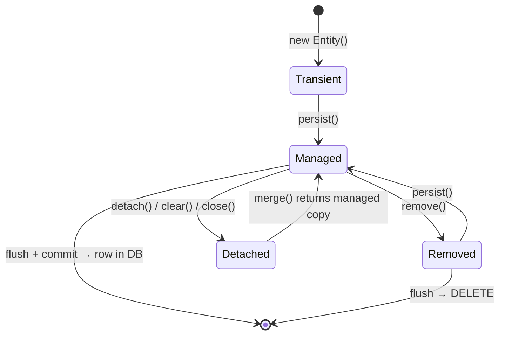
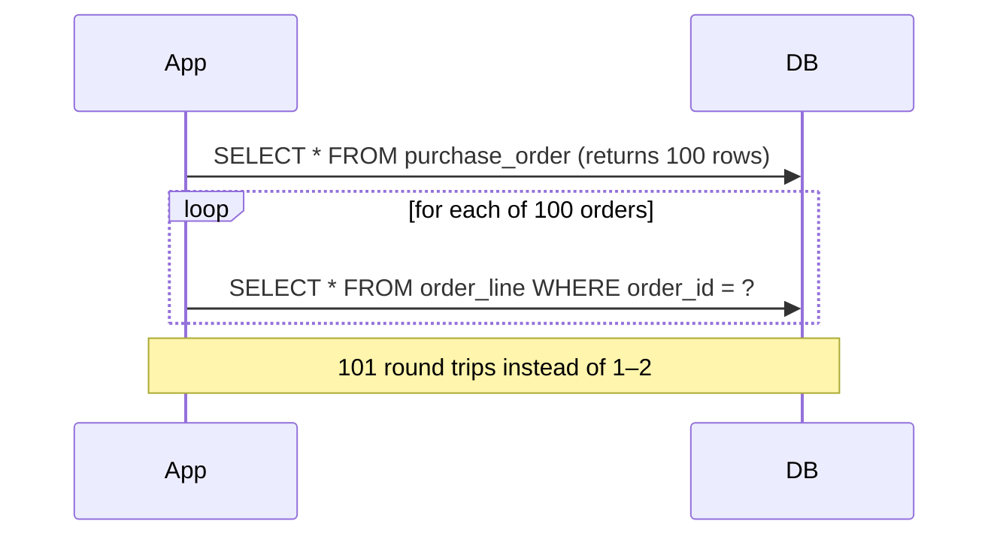
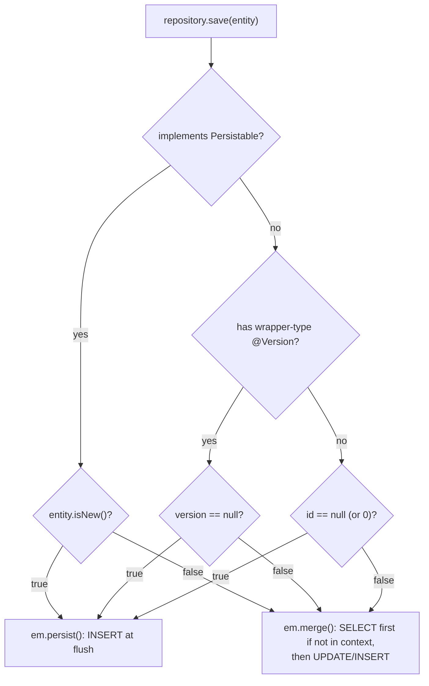
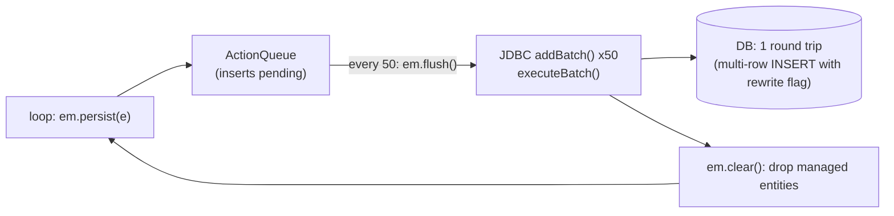

# Spring Data JPA & Hibernate (Java 8): Interview Notes

**Why this matters in interviews:** Most backend performance incidents are really *data access* incidents: N+1 queries, a bloated persistence context in a batch job, a missing index, or a lazy-loading exception in production. Interviewers use JPA to check whether you understand what SQL your code actually produces. Senior candidates get asked to explain the persistence context, fetching strategies, locking and batching, with numbers.

> [!NOTE]
> These notes target **Spring Boot 2.7 / Spring Data JPA 2.7 / Hibernate 5.6** with `javax.persistence`. Hibernate 6 and `jakarta.persistence` need Boot 3 and Java 17. See [Beyond Java 8](#12-beyond-java-8). Every "Predict the output" puzzle below was run against Hibernate 5.6 + H2.

Difficulty legend: 🟢 Basic · 🟡 Intermediate · 🔴 Advanced · ⚡ Scenario

## Table of Contents

1. [JPA Basics and Entity Mapping](#1-jpa-basics-and-entity-mapping)
2. [Persistence Context and Entity Lifecycle](#2-persistence-context-and-entity-lifecycle)
3. [Relationships, Fetching and N+1](#3-relationships-fetching-and-n1)
4. [Spring Data Repositories and Queries](#4-spring-data-repositories-and-queries)
5. [Transactions, Locking and Concurrency](#5-transactions-locking-and-concurrency)
6. [Performance: Batching, Caching, Projections](#6-performance-batching-caching-projections)
7. [Coding / Hands-on](#7-coding--hands-on)
8. [Production Scenarios](#8-production-scenarios)
9. [Cheat Sheet](#9-cheat-sheet)
10. [Revision Checklist](#10-revision-checklist)
11. [Puzzle Harness](#11-puzzle-harness)
12. [Beyond Java 8](#12-beyond-java-8)

---

## 1. JPA Basics and Entity Mapping

> **Mental model:** JPA is a *translator* between two languages: objects (graphs and references) and tables (rows and foreign keys). The translation is never perfect (the "object-relational impedance mismatch"). Good JPA work means knowing *which SQL* each Java line turns into.

### Q1. 🟢 JPA vs Hibernate vs Spring Data JPA?

| Layer | What it is |
|---|---|
| **JPA** | A *specification* (`javax.persistence`): annotations, `EntityManager`, JPQL |
| **Hibernate** | The most popular JPA *implementation* (plus extras: `@BatchSize`, filters, `StatelessSession`) |
| **Spring Data JPA** | Repository *abstraction* on top of JPA: derived queries, paging, auditing |
| **JDBC** | What all of the above eventually call |

<details><summary>Cross-questions</summary>

**Q:** Can you use Spring Data JPA without Hibernate?

**A:** Yes, with another provider such as EclipseLink, though Boot defaults to Hibernate.
</details>

### Q2. 🟢 What makes a class an entity?

It needs:

- `@Entity`.
- An `@Id`.
- A **no-arg constructor** (public or protected, because Hibernate instantiates entities reflectively).
- To be non-final, with non-final persistent methods, if you want lazy proxies.

Map the table with `@Table(name = ...)` and the columns with `@Column`.

```java
import javax.persistence.Column;
import javax.persistence.Entity;
import javax.persistence.EnumType;
import javax.persistence.Enumerated;
import javax.persistence.GeneratedValue;
import javax.persistence.GenerationType;
import javax.persistence.Id;
import javax.persistence.SequenceGenerator;
import javax.persistence.Table;

@Entity
@Table(name = "events")
public class EventEntity {
    public enum Source { ANDROID, IOS, WEB }

    @Id
    @GeneratedValue(strategy = GenerationType.SEQUENCE, generator = "event_seq")
    @SequenceGenerator(name = "event_seq", sequenceName = "event_seq", allocationSize = 50)
    private Long id;

    @Column(name = "event_id", nullable = false, unique = true, length = 64)
    private String eventId;           // client-generated id → idempotency

    @Enumerated(EnumType.STRING)
    @Column(nullable = false, length = 16)
    private Source source;

    protected EventEntity() { }       // for JPA
    public EventEntity(String eventId, Source source) { this.eventId = eventId; this.source = source; }
    public Long getId() { return id; }
    public String getEventId() { return eventId; }
}
```

<details><summary>Cross-questions</summary>

**Q:** Why `EnumType.STRING`?

**A:** The default `ORDINAL` stores the enum's position. Reordering or inserting a constant silently corrupts the existing data.
</details>

### Q3. 🟡 What are the ID generation strategies, and which one allows batch inserts?

| Strategy | How | Batch inserts in Hibernate? |
|---|---|---|
| `IDENTITY` | DB auto-increment column | **No**: Hibernate must execute each INSERT immediately to learn the id |
| `SEQUENCE` | DB sequence; with `allocationSize` > 1 fetches ids in blocks (pooled optimizer) | **Yes** |
| `TABLE` | Emulates a sequence with a table + row lock | Yes, but slow and contended |
| `AUTO` | Provider picks (Hibernate 5 on MySQL → TABLE unless `use-new-id-generator-mappings=false`) | Depends |
| UUID (assigned) | App generates | Yes |

> [!TIP]
> Say it like a senior engineer: "On PostgreSQL I use `SEQUENCE` with `allocationSize` matching the sequence's `INCREMENT BY` (for example 50), so Hibernate can batch inserts. `IDENTITY` quietly disables JDBC batching. That was one reason our 200K-row load was slow."

<details><summary>Cross-questions</summary>

**Q:** What goes wrong if `allocationSize` doesn't match the sequence's `INCREMENT BY`?

**A:** You get duplicate-key errors or gaps, because the pooled optimizer assumes each sequence call reserves `allocationSize` values.

**Q:** Are random UUID primary keys bad for B-tree indexes?

**A:** Random UUIDv4 values scatter inserts across the index, which causes page splits and poor cache locality on large tables. Time-ordered IDs (sequences, or ULID/UUIDv7) are friendlier.
</details>

### Q4. 🟢 What do `@Column` attributes do at runtime vs schema generation?

`nullable`, `unique`, `length` and `columnDefinition` mostly affect **DDL generation**. They don't validate at runtime (Hibernate doesn't check `length` before an insert). For runtime validation, use Bean Validation (`@NotNull`, `@Size`), which Hibernate runs before persist and update when the validator is on the classpath.

<details><summary>Cross-questions</summary>

**Q:** Should production use `ddl-auto=update`?

**A:** No. Use **Flyway or Liquibase** migrations, with `ddl-auto=validate` (or `none`) as a safety check.
</details>

### Q5. 🟡 What does `spring.jpa.hibernate.ddl-auto` do?

| Value | Effect |
|---|---|
| `none` | Nothing |
| `validate` | Check schema matches entities; fail startup if not |
| `update` | Add missing tables/columns (never drops); unsafe for prod |
| `create` | Drop & create on startup |
| `create-drop` | Create on start, drop on shutdown (default for embedded DBs) |

<details><summary>Cross-questions</summary>

**Q:** Why is `update` dangerous?

**A:** It can't rename or drop columns, it generates schema changes nobody reviewed, and several instances starting at once can race.
</details>

### Q6. 🟡 What are `@Embeddable` and `@Embedded` for?

They map a **value object** (such as `Address` or `Money`) to columns in the owner's table. It has no identity of its own, and its lifecycle is tied to the owner. Rename the columns with `@AttributeOverrides`.

<details><summary>Cross-questions</summary>

**Q:** What's the difference between an embeddable and an entity?

**A:** An entity has its own identity and table, and it can be shared. An embeddable is part of its owner, stored in the same row.
</details>

### Q7. 🟡 What are the inheritance mapping strategies?

| Strategy | Tables | Pros | Cons |
|---|---|---|---|
| `SINGLE_TABLE` (default) | One table + discriminator | Fast, no joins, polymorphic queries easy | Nullable subclass columns |
| `JOINED` | Table per class, joined by PK | Normalised | Joins on every read |
| `TABLE_PER_CLASS` | Table per concrete class | No joins for concrete queries | Polymorphic queries use UNION |
| `@MappedSuperclass` | No table for parent | Share fields (id, audit) | Not queryable polymorphically |

<details><summary>Cross-questions</summary>

**Q:** Which is most common for shared audit fields?

**A:** `@MappedSuperclass`, for example a `BaseEntity` that holds the id, `createdAt` and `updatedAt`.
</details>

### Q8. 🟡 What is an `AttributeConverter`?

It maps a Java type to a column type, for example a JSON string, an encrypted value, or a legacy code, using `@Converter(autoApply = true)` or `@Convert` on the field.

```java
import javax.persistence.AttributeConverter;
import javax.persistence.Converter;

@Converter
public class YesNoConverter implements AttributeConverter<Boolean, String> {
    @Override public String convertToDatabaseColumn(Boolean b) { return b == null ? null : (b ? "Y" : "N"); }
    @Override public Boolean convertToEntityAttribute(String s) { return s == null ? null : "Y".equals(s); }
}
```

<details><summary>Cross-questions</summary>

**Q:** Can you query on a converted attribute?

**A:** Yes. JPQL parameters are converted too. You can't use DB functions that expect the raw type, though.
</details>

### Q9. 🟡 How should you implement `equals` and `hashCode` for entities?

The pitfalls: generated IDs are `null` before `persist`, and Hibernate proxies are subclasses. Safe options:

1. Use a **natural or business key** that's immutable (for example `eventId`).
2. Use the ID with a **constant** `hashCode` (`getClass().hashCode()`), and `equals` that checks `id != null && id.equals(other.id)`.

```java
import java.util.Objects;
import javax.persistence.Entity;
import javax.persistence.Id;

@Entity
public class Customer {
    @Id private Long id;
    private String email;

    @Override public boolean equals(Object o) {
        if (this == o) return true;
        if (!(o instanceof Customer)) return false;         // instanceof works with proxies
        Customer other = (Customer) o;
        return id != null && Objects.equals(id, other.getId()); // use getter: proxy-safe
    }
    @Override public int hashCode() { return getClass().hashCode(); }   // stable across persist
    public Long getId() { return id; }
}
```

> [!WARNING]
> Never include lazy collections in `equals`, `hashCode` or `toString`. Lombok's `@Data` on entities is a classic cause of N+1 queries and `StackOverflowError`.

<details><summary>Cross-questions</summary>

**Q:** Why does a hash based on a generated ID break `HashSet`s?

**A:** The hash changes from `null` to a real value at persist time, so the entity is "lost" in the set it was added to before persisting.
</details>

### Q10. 🟢 What is JPQL, and how does it differ from SQL?

JPQL queries **entities and fields**, not tables and columns: `SELECT e FROM EventEntity e WHERE e.source = :src`. It's portable across databases, and the provider translates it into dialect-specific SQL.

<details><summary>Cross-questions</summary>

**Q:** When do you use native SQL?

**A:** For DB-specific features: window functions (pre-Hibernate 6), `ON CONFLICT` upserts, JSONB operators, CTEs, and hints.
</details>

### Q11. 🟡 What is `@ElementCollection`?

A collection of basic values or embeddables stored in a separate table, owned entirely by the parent (for example `Set<String> tags`). Updates can be inefficient: for a `List` without an order column, Hibernate deletes and re-inserts **every** row.

<details><summary>Cross-questions</summary>

**Q:** When should it become an entity instead?

**A:** When the collection grows large, needs its own queries, or is modified often.
</details>

### Q12. 🟡 How do you implement auditing?

Add `@EnableJpaAuditing`, annotate the entity with `@EntityListeners(AuditingEntityListener.class)`, and mark the fields with `@CreatedDate`, `@LastModifiedDate`, `@CreatedBy` and `@LastModifiedBy`. An `AuditorAware<String>` bean supplies the current user, for example from `SecurityContextHolder`.

<details><summary>Cross-questions</summary>

**Q:** What does `@CreatedBy` return for batch jobs or consumers?

**A:** Whatever `AuditorAware` returns without an HTTP user. Return a system identity such as `"batch-ingest"`, not null.
</details>

### Q13. 🟡 How do you implement soft delete in Hibernate 5?

Use `@SQLDelete(sql = "UPDATE t SET deleted = true WHERE id = ?")` plus `@Where(clause = "deleted = false")` on the entity. Deletes become updates, and reads filter automatically.

<details><summary>Cross-questions</summary>

**Q:** What are the downsides?

**A:** Unique constraints must include the deleted flag (or use partial indexes). Native queries bypass `@Where`, and the table keeps growing. Add archival.
</details>

### Q14. 🟢 What are `@Transient` and `transient`?

`@Transient` (JPA) excludes a field from persistence. The Java `transient` keyword excludes it from Java serialisation, and JPA also treats it as not persistent.

<details><summary>Cross-questions</summary>

**Q:** Where would you use `@Transient`?

**A:** For computed values, such as a `score` calculated in the ranking pipeline that isn't stored.
</details>

### Q15. 🟡 How do you use a composite primary key?

Either with `@IdClass`, or with `@EmbeddedId` holding an `@Embeddable` key class. The key class must be `Serializable` and implement `equals` and `hashCode`.

<details><summary>Cross-questions</summary>

**Q:** Surrogate or composite key?

**A:** Prefer a surrogate key plus a unique constraint on the natural key. It makes relationships simpler and keeps FKs smaller.
</details>

### Q16. 🟡 How do you store JSON columns (for example, PostgreSQL JSONB) in Hibernate 5?

Hibernate 5 has no built-in JSON type. Use an `AttributeConverter` to a String (with `columnDefinition = "jsonb"` and the right casting), or the widely used `hibernate-types` library. Hibernate 6 supports JSON natively.

<details><summary>Cross-questions</summary>

**Q:** When should JSON be a column rather than normalised tables?

**A:** For semi-structured, rarely queried attributes, such as raw event payloads. Anything you filter or join on often belongs in real columns.
</details>

---

## 2. Persistence Context and Entity Lifecycle

> **Mental model:** The persistence context is a *workbench*. Entities you load or persist sit on the bench, and Hibernate remembers what each one looked like when it arrived (the snapshot). At **flush** time, it compares every item with its snapshot and writes SQL only for the ones you changed. Leave 200K items on the bench and it collapses.



### Q17. 🟢 What are the entity states?

| State | In persistence context? | Has DB row? |
|---|---|---|
| **Transient / New** | No | No |
| **Managed** | Yes (tracked, dirty-checked) | Yes or pending insert |
| **Detached** | No (context closed/cleared) | Yes |
| **Removed** | Yes, scheduled for delete | Until flush |

<details><summary>Cross-questions</summary>

**Q:** Are entities returned from a Spring Data repository call managed?

**A:** Yes, while the transaction or persistence context is still open. After it ends (for example, in the controller with OSIV off), they're detached.
</details>

### Q18. 🟡 What is the first-level cache, and why does it guarantee identity?

Within one persistence context, each database row maps to **exactly one** Java object. `find` checks the context first. This is the *identity map* pattern, and it's always on and scoped to the `EntityManager`.

#### 🎯 Predict the output

```java
import javax.persistence.EntityManager;
import javax.persistence.Entity;
import javax.persistence.Id;

public class FirstLevelCache {
    @Entity(name = "Product")
    public static class Product {
        @Id Long id; String name;
        protected Product() { }
        Product(Long id, String name) { this.id = id; this.name = name; }
    }

    public static void main(String[] args) {
        PuzzleDb.run(new Class<?>[]{Product.class}, sf -> {
            EntityManager em = sf.createEntityManager();
            em.getTransaction().begin();
            em.persist(new Product(1L, "pen"));
            em.getTransaction().commit();
            em.clear();

            Product a = em.find(Product.class, 1L);   // SELECT
            Product b = em.find(Product.class, 1L);   // no SELECT
            System.out.println(a == b);
            em.clear();
            Product c = em.find(Product.class, 1L);   // SELECT again
            System.out.println(a == c);
            em.close();
        });
    }
}
```

<details><summary>Answer</summary>

`true`, then `false`, with two SELECTs in total. Within one persistence context, the same row gives the same instance. After `clear()`, the context is empty, so a new instance is loaded. (`PuzzleDb` is the small bootstrap helper shown in [Puzzle Harness](#11-puzzle-harness).)
</details>

<details><summary>Cross-questions</summary>

**Q:** Does a JPQL query use the first-level cache?

**A:** The query **always goes to the DB**. For each row it returns, Hibernate then hands back the already-managed instance if there is one, so unflushed in-memory changes win over the DB values.
</details>

### Q19. 🟡 What is dirty checking?

When an entity is loaded, Hibernate keeps a **snapshot** of its state. At flush, it compares each managed entity with its snapshot and issues `UPDATE`s for the changed ones. There's no need to call `save()` on managed entities.

#### 🎯 Predict the output

```java
import javax.persistence.EntityManager;
import javax.persistence.Entity;
import javax.persistence.Id;

public class DirtyChecking {
    @Entity(name = "Account")
    public static class Account {
        @Id Long id; long balance;
        protected Account() { }
        Account(Long id, long b) { this.id = id; this.balance = b; }
    }

    public static void main(String[] args) {
        PuzzleDb.run(new Class<?>[]{Account.class}, sf -> {
            EntityManager em = sf.createEntityManager();
            em.getTransaction().begin();
            em.persist(new Account(1L, 100));
            em.getTransaction().commit();

            em.getTransaction().begin();
            Account acc = em.find(Account.class, 1L);
            acc.balance = 250;                        // no save()/merge() call
            em.getTransaction().commit();             // flush → dirty check → UPDATE
            em.clear();

            System.out.println(em.find(Account.class, 1L).balance);
            em.close();
        });
    }
}
```

<details><summary>Answer</summary>

`250`. The managed entity was changed, and the commit triggered a flush, which detected the change and issued an `UPDATE`.
</details>

<details><summary>Cross-questions</summary>

**Q:** What's the cost of dirty checking?

**A:** Every managed entity is compared at each flush. With 100K managed entities, flushing gets slow and memory doubles because of the snapshots. Use `readOnly` transactions or read-only queries, and `clear()` in batches.
</details>

### Q20. 🟡 When does a flush happen?

With `FlushModeType.AUTO` (the default):

- Before a transaction **commit**.
- Before executing a **query** whose results could be affected by pending changes. Native SQL queries trigger a full flush in Hibernate's JPA mode.
- When you call `em.flush()` explicitly.

`COMMIT` mode flushes only at commit.

<details><summary>Cross-questions</summary>

**Q:** Does `flush()` commit?

**A:** No. It sends SQL inside the current transaction, which can still roll back.
</details>

### Q21. 🟡 `persist` vs `merge` (vs Hibernate `save` / `update`)?

| | `persist(e)` | `merge(e)` |
|---|---|---|
| Input | New entity | Detached (or new) entity |
| Returns | void; `e` becomes managed | A **managed copy**; the argument stays detached |
| Detached input | Throws `EntityExistsException` / `PersistentObjectException` | Copies state onto managed instance (SELECT if needed) |

> [!WARNING]
> After `Foo managed = em.merge(detached)`, keep working with **`managed`**. Later changes made to `detached` are ignored.

<details><summary>Cross-questions</summary>

**Q:** What does Spring Data's `save()` call?

**A:** `persist` if `entityInformation.isNew(entity)` returns true, otherwise `merge`. See Q55 for how it decides whether an entity is new.
</details>

### Q22. 🟡 `find` vs `getReference`?

`find` hits the DB (or the context) and returns `null` when the entity doesn't exist. `getReference` (Spring Data's `getReferenceById` / `getById`) returns a **proxy without querying**, and it throws `EntityNotFoundException` only when the proxy is first used and the row is missing.

<details><summary>Cross-questions</summary>

**Q:** When is `getReference` useful?

**A:** When you set a foreign key without loading the parent: `order.setCustomer(em.getReference(Customer.class, id))` saves a SELECT per insert, which matters in batch loads.
</details>

### Q23. 🟡 What is `LazyInitializationException`?

It happens when you access an uninitialised lazy association or proxy **after the persistence context has closed**, for example in a controller or during Jackson serialisation.

**Fixes:** fetch what you need inside the transaction (a fetch join or an entity graph), map to DTOs inside the service, or use `Hibernate.initialize()`. Avoid the Open-Session-In-View crutch and `enable_lazy_load_no_trans`.

<details><summary>Cross-questions</summary>

**Q:** Why is `hibernate.enable_lazy_load_no_trans=true` bad?

**A:** Every lazy access opens a **new session and connection**. It hides N+1 queries and exhausts the pool.
</details>

### Q24. 🟡 What is Open Session In View (OSIV)?

`spring.jpa.open-in-view=true` (Boot's default, and Boot logs a warning about it) keeps the `EntityManager` open for the whole web request, so lazy loading works in controllers and views. The cost: a DB connection can be held for the whole request, and hidden lazy queries fire outside any service transaction.

<details><summary>Cross-questions</summary>

**Q:** What do you recommend?

**A:** Set `open-in-view=false`, fetch explicitly in services, and return DTOs. Any hidden lazy access then fails fast in tests.
</details>

### Q25. 🟡 `detach`, `clear` and `close`: what's the difference?

`detach(e)` removes one entity from the context. `clear()` detaches **all** of them, and discards any **unflushed** changes, so flush first. `close()` ends the `EntityManager`.

<details><summary>Cross-questions</summary>

**Q:** What's the batch-processing pattern?

**A:** Every N records, call `flush()` then `clear()`, so memory stays flat and dirty checking stays cheap.
</details>

### Q26. 🟡 What does `@Transactional(readOnly = true)` do for Hibernate?

Spring sets the Hibernate session's flush mode to **MANUAL**, so there's no automatic flush and no dirty checking at commit. It also marks the JDBC connection read-only (a driver or DB hint). The read-only hint also means Hibernate may skip keeping snapshots for loaded entities. Together these save memory and CPU on large reads.

<details><summary>Cross-questions</summary>

**Q:** Can a read-only transaction still write?

**A:** Your changes won't be flushed automatically, but an explicit `flush()` or a native update may still run, depending on the driver and DB. Don't rely on it as a security control.
</details>

### Q27. 🔴 How do Hibernate proxies work?

For lazy `@ManyToOne` associations and `getReference`, Hibernate creates a **ByteBuddy subclass** of the entity. It holds the ID and loads the real state on the first method call (other than `getId()`). Consequences:

- `getClass()` returns the proxy class.
- Direct field access on the proxy from another object sees defaults (`null`). Use getters.
- `final` classes and methods can't be proxied, which disables laziness.

<details><summary>Cross-questions</summary>

**Q:** How do you unwrap a proxy?

**A:** `Hibernate.unproxy(entity)` (5.2.10+), or `Hibernate.getClass(entity)` to get the real class.
</details>

### Q28. 🟡 What are cascade types, and when do you use them?

`CascadeType.PERSIST`, `MERGE`, `REMOVE`, `REFRESH`, `DETACH` and `ALL` propagate operations from parent to child. Use them for **aggregate roots** (an `Order` owns its `OrderLine`s). Never cascade `REMOVE` from a child to a shared parent.

<details><summary>Cross-questions</summary>

**Q:** What happens with `CascadeType.REMOVE` on `@ManyToMany`?

**A:** Deleting one side deletes the associated entities on the other side, including ones still referenced elsewhere. It's almost always a bug.
</details>

### Q29. 🟡 `orphanRemoval = true` vs `CascadeType.REMOVE`?

`CascadeType.REMOVE` deletes the children when the **parent** is deleted. `orphanRemoval` also deletes a child when it's **removed from the parent's collection** (disassociated).

<details><summary>Cross-questions</summary>

**Q:** Is there a gotcha with replacing the collection instance?

**A:** Yes. With `orphanRemoval`, never do `parent.setChildren(newList)`. Hibernate tracks the original collection, and you'll get "A collection with cascade=all-delete-orphan was no longer referenced". Use `clear()` and `addAll()` instead.
</details>

### Q30. 🔴 How does write-behind ordering work at flush?

Hibernate doesn't run SQL in the order your code made the calls. `ActionQueue` orders operations as: inserts → updates → collection removals → collection updates and inserts → **deletes**. This can surprise you, for example by violating a unique constraint when you delete and re-insert the same key in one flush.

<details><summary>Cross-questions</summary>

**Q:** How do you force the order?

**A:** Call `em.flush()` between the delete and the insert.
</details>

---
## 3. Relationships, Fetching and N+1

> **Mental model:** Associations are *doors between rooms*. **EAGER** means every door is thrown open the moment you enter, whether you need the other rooms or not. **LAZY** means doors open only when you walk through them, but if you walk through 100 doors one at a time, that's 100 trips (N+1). A **fetch join** plans the whole route in one trip.

### Q31. 🟢 What are the relationship annotations and their default fetch types?

| Annotation | Default fetch | Typical owning side |
|---|---|---|
| `@ManyToOne` | **EAGER** | This side (has FK) |
| `@OneToOne` | **EAGER** | Side with FK |
| `@OneToMany` | LAZY | Usually inverse (`mappedBy`) |
| `@ManyToMany` | LAZY | Either; join table |

> [!TIP]
> Say it like a senior engineer: "I make every association `LAZY`, including `@ManyToOne(fetch = LAZY)`, and fetch explicitly per use case with join fetch or entity graphs. EAGER defaults cause surprise joins and N+1 queries that you can't turn off per query."

<details><summary>Cross-questions</summary>

**Q:** Why can EAGER cause N+1 queries even with no lazy access?

**A:** A JPQL query ignores EAGER mappings when building its own SQL. Hibernate then loads each EAGER association with a **separate select per row** after the query returns.
</details>

### Q32. 🟡 What are the owning side and the inverse side (`mappedBy`)?

The **owning side** controls the foreign key column, and only changes on that side are persisted. The inverse side declares `mappedBy = "fieldOnOwner"`. For `@OneToMany` / `@ManyToOne`, the **many side owns** the FK.

```java
import java.util.ArrayList;
import java.util.List;
import javax.persistence.CascadeType;
import javax.persistence.Entity;
import javax.persistence.FetchType;
import javax.persistence.GeneratedValue;
import javax.persistence.Id;
import javax.persistence.JoinColumn;
import javax.persistence.ManyToOne;
import javax.persistence.OneToMany;

@Entity
public class PurchaseOrder {
    @Id @GeneratedValue private Long id;

    @OneToMany(mappedBy = "order", cascade = CascadeType.ALL, orphanRemoval = true)
    private List<OrderLine> lines = new ArrayList<OrderLine>();

    // helper keeps BOTH sides in sync
    public void addLine(OrderLine l) { lines.add(l); l.setOrder(this); }
    public void removeLine(OrderLine l) { lines.remove(l); l.setOrder(null); }
}

@Entity
class OrderLine {
    @Id @GeneratedValue private Long id;

    @ManyToOne(fetch = FetchType.LAZY)
    @JoinColumn(name = "order_id")
    private PurchaseOrder order;          // owning side (FK)

    void setOrder(PurchaseOrder o) { this.order = o; }
}
```

<details><summary>Cross-questions</summary>

**Q:** What happens if you only call `order.getLines().add(line)` without setting `line.order`?

**A:** The FK stays null, because the inverse side isn't persisted. Always sync both sides with helper methods.

**Q:** What does a unidirectional `@OneToMany` without `@JoinColumn` do?

**A:** Hibernate creates a **join table** and, on updates, may delete and re-insert rows. Prefer bidirectional mappings, or `@ManyToOne` only.
</details>

### Q33. 🔴 What is the N+1 select problem?

You load N parents with one query, then touching a lazy association on each parent fires **one more query per parent**: 1 + N queries in total.



#### 🎯 Predict the output

```java
import java.util.ArrayList;
import java.util.List;
import javax.persistence.Entity;
import javax.persistence.EntityManager;
import javax.persistence.FetchType;
import javax.persistence.GeneratedValue;
import javax.persistence.Id;
import javax.persistence.ManyToOne;
import javax.persistence.OneToMany;
import org.hibernate.SessionFactory;

public class NPlusOne {
    @Entity(name = "Author")
    public static class Author {
        @Id @GeneratedValue Long id;
        @OneToMany(mappedBy = "author") List<Book> books = new ArrayList<Book>();
    }
    @Entity(name = "Book")
    public static class Book {
        @Id @GeneratedValue Long id;
        @ManyToOne(fetch = FetchType.LAZY) Author author;
    }

    static long statementsFor(SessionFactory sf, String jpql) {
        EntityManager em = sf.createEntityManager();
        sf.getStatistics().clear();
        int total = 0;
        for (Author a : em.createQuery(jpql, Author.class).getResultList()) total += a.books.size();
        em.close();
        return sf.getStatistics().getPrepareStatementCount();
    }

    public static void main(String[] args) {
        PuzzleDb.run(new Class<?>[]{Author.class, Book.class}, sf -> {
            EntityManager em = sf.createEntityManager();
            em.getTransaction().begin();
            for (int i = 0; i < 5; i++) {
                Author a = new Author(); em.persist(a);
                for (int j = 0; j < 3; j++) { Book b = new Book(); b.author = a; em.persist(b); }
            }
            em.getTransaction().commit();
            em.close();

            System.out.println(statementsFor(sf, "select a from Author a"));
            System.out.println(statementsFor(sf, "select distinct a from Author a join fetch a.books"));
        });
    }
}
```

<details><summary>Answer</summary>

`6`, then `1`. The plain query runs 1 SELECT for the authors plus 5 lazy SELECTs, one per author's books. The `join fetch` loads everything in a single SELECT.
</details>

<details><summary>Cross-questions</summary>

**Q:** How do you detect N+1 queries before production?

**A:** Enable `hibernate.generate_statistics` in tests and assert query counts, use a library such as datasource-proxy, or log SQL in dev and look for repeated statements.
</details>

### Q34. 🟡 What are the ways to fix N+1?

| Fix | How | Best for |
|---|---|---|
| **JOIN FETCH** | `select o from Order o join fetch o.lines` | One use case, single collection |
| **@EntityGraph** | `@EntityGraph(attributePaths = "lines")` on repo method | Spring Data methods |
| **Batch fetching** | `@BatchSize(size = 50)` or `hibernate.default_batch_fetch_size=50` → `WHERE id IN (...)` | Many lazy loads, pagination-friendly |
| **DTO projection** | `select new com.x.Dto(o.id, count(l)) ...` | Read-only views/reports |
| **Subselect fetch** | `@Fetch(FetchMode.SUBSELECT)` | Load all collections of the previously loaded parents |

<details><summary>Cross-questions</summary>

**Q:** Why set a global `default_batch_fetch_size`?

**A:** It turns unexpected N+1 queries into roughly N/50 queries automatically, with no code changes. It's a cheap safety net.
</details>

### Q35. 🔴 Why is JOIN FETCH combined with pagination dangerous?

When you fetch-join a **collection** and use `setMaxResults` or `Pageable`, the SQL returns parent × child rows, so Hibernate can't apply `LIMIT` in SQL. It logs **HHH000104: firstResult/maxResults specified with collection fetch; applying in memory!**, loads *everything*, and pages in memory.

**Fix:** use a two-step query. First page the parent IDs, then fetch those parents with their collections: `where o.id in :ids`. Alternatively, use batch fetching.

<details><summary>Cross-questions</summary>

**Q:** Does this also apply to `@ManyToOne` fetch joins?

**A:** No. To-one joins don't multiply rows, so pagination works normally.
</details>

### Q36. 🔴 What is `MultipleBagFetchException`?

You get it when you fetch-join **two or more `List` (bag) collections** in one query. The Cartesian product makes the bag semantics ambiguous. Changing to `Set` "fixes" the exception but produces a **Cartesian explosion** (rows = a × b). The better fix is to fetch one collection per query (the second query reuses the persistence context), or to use batch fetching.

<details><summary>Cross-questions</summary>

**Q:** Why is the Cartesian product so bad?

**A:** With 100 orders × 20 lines × 10 payments you get 20,000 rows transferred and processed for 3,000 real entities.
</details>

### Q37. 🟡 What does `distinct` do in a fetch-join JPQL query (Hibernate 5)?

It removes the **duplicate parent references** in the Java result list (the join returns one row per child). In Hibernate 5 it's also passed to SQL, which is unnecessary work. Add the hint `hibernate.query.passDistinctThrough=false` to deduplicate only in memory.

<details><summary>Cross-questions</summary>

**Q:** Is this still needed in Hibernate 6?

**A:** No. Hibernate 6 deduplicates parents automatically for fetch joins.
</details>

### Q38. 🟡 How do you define an `@EntityGraph`?

```java
import java.util.List;
import org.springframework.data.jpa.repository.EntityGraph;
import org.springframework.data.jpa.repository.JpaRepository;
import org.springframework.data.jpa.repository.Query;

public interface OrderRepository extends JpaRepository<PurchaseOrder, Long> {

    @EntityGraph(attributePaths = {"lines"})
    List<PurchaseOrder> findByIdIn(List<Long> ids);

    @Query("select o from PurchaseOrder o")
    @EntityGraph(attributePaths = {"lines"})
    List<PurchaseOrder> findAllWithLines();
}
```

<details><summary>Cross-questions</summary>

**Q:** What's the difference between a fetch graph and a load graph?

**A:** A **fetch** graph treats unlisted attributes as LAZY. A **load** graph uses their mapped defaults. Spring's `@EntityGraph` defaults to FETCH.
</details>

### Q39. 🟡 Why is `@OneToOne` lazy loading tricky?

On the **non-owning side** (with `mappedBy`), Hibernate can't know whether the associated row exists without querying, because a `null` has to be represented. So it loads the association **eagerly**, even when it's marked LAZY. Fixes:

- Map it with `@MapsId` (a shared primary key) and query from the owning side.
- Make it unidirectional.
- Use bytecode enhancement.

<details><summary>Cross-questions</summary>

**Q:** Can you give an example of a one-to-one?

**A:** `User` ↔ `UserProfile`. With `@MapsId`, the profile's primary key is the user's ID, so you can fetch it lazily by ID.
</details>

### Q40. 🟡 How should you model `@ManyToMany`?

For anything beyond a pure link, **replace it with an explicit join entity** (for example `UserRole` with `grantedAt` and `grantedBy`) and two `@ManyToOne`s. With a pure `@ManyToMany`, use `Set` rather than `List` (a `List` causes delete-all-and-reinsert on changes), and avoid cascading `REMOVE`.

<details><summary>Cross-questions</summary>

**Q:** Why does a `List` `@ManyToMany` perform badly?

**A:** A bag has no identity per row, so removing one element makes Hibernate delete every join row for the owner and re-insert the rest.
</details>

### Q41. 🟡 How do you order a collection?

`@OrderBy("createdAt DESC")` sorts in SQL when loading. `@OrderColumn` persists the list index in a column, which is expensive on inserts in the middle. For large collections, don't map them at all. Query them with paging instead.

<details><summary>Cross-questions</summary>

**Q:** Should an `Author` have `List<Book>` if they can have 100K books?

**A:** No. Loading it would be enormous. Keep only `Book.author`, and query books by author with paging.
</details>

### Q42. 🟡 Fetch strategy vs fetch type?

- **FetchType** (LAZY or EAGER) is *when* data is loaded.
- **FetchMode** (Hibernate: `JOIN`, `SELECT`, `SUBSELECT`) is *how* it's loaded.

`@Fetch(FetchMode.JOIN)` forces eager joining for `find()`, while JPQL queries follow the query itself.

<details><summary>Cross-questions</summary>

**Q:** Does `FetchMode.JOIN` apply to JPQL queries?

**A:** No. JPQL defines its own joins, and the mapping's `FetchMode.JOIN` is ignored there.
</details>

### Q43. 🟡 How do you load only a count of children without loading them?

Use `select count(l) from OrderLine l where l.order.id = :id`, or `size(o.lines)` in JPQL, or `@Formula` (Hibernate) for a computed read-only attribute. Loading the collection just to call `.size()` is the N+1 anti-pattern in disguise.

<details><summary>Cross-questions</summary>

**Q:** What is `@LazyCollection(EXTRA)`?

**A:** A Hibernate feature that makes `size()` and `contains()` run SQL instead of loading the collection. It's niche, and a query is usually clearer.
</details>

### Q44. 🟡 Why does `toString()` or Jackson on entities trigger surprise queries?

They walk every getter, including lazy associations. In a transaction that fires queries (N+1). Outside one, it throws `LazyInitializationException`. With bidirectional relations, it recurses infinitely. **Use DTOs for the API**, and keep entity `toString()` limited to the ID and simple fields.

<details><summary>Cross-questions</summary>

**Q:** Is `@JsonIgnore` on the back reference a good fix?

**A:** It stops the recursion, but it still ties your API to your schema. DTOs are the clean boundary.
</details>

### Q45. 🟡 What's the difference between `JOIN` and `JOIN FETCH` in JPQL?

`join` is for filtering and projection: the associated entities **aren't initialised**. `join fetch` initialises the association in the returned entities. You can't give a fetch-joined path an alias to use in the WHERE clause (the spec disallows it, though Hibernate permits it with caveats).

<details><summary>Cross-questions</summary>

**Q:** Why is filtering a fetch-joined collection risky?

**A:** The entity's collection would then contain only the *filtered* children, which misrepresents its real state and can corrupt it when it's saved later.
</details>

### Q46. 🟡 What is `@BatchSize`, and how does it work?

When the first lazy proxy or collection is initialised, Hibernate loads **up to N pending ones together** with `WHERE id IN (?, ?, ...)`. It turns N+1 into 1 + ceil(N / size) queries. You can set it per association or entity, or globally with `hibernate.default_batch_fetch_size`.

<details><summary>Cross-questions</summary>

**Q:** Why do people pick 16, 32 or 50 rather than 1000?

**A:** Very large `IN` lists hurt plan caching and can hit DB parameter limits. Moderate sizes give most of the benefit.
</details>

### Q47. 🔴 What is bytecode enhancement, and when is it worth it?

Hibernate's build plugin enhances entities to support **lazy basic attributes** (for example, a large `@Lob`), true lazy `@OneToOne` on the inverse side, and faster dirty tracking (no snapshot comparison). It adds build complexity, so use it when profiling shows the need.

<details><summary>Cross-questions</summary>

**Q:** Is there an alternative for a large column?

**A:** Move it into a separate entity or table that's loaded only on demand, or use a projection that excludes it.
</details>

### Q48. 🟡 How do you delete a parent with thousands of children efficiently?

Don't load them all and remove them one by one (N deletes plus dirty checking). Use a bulk `delete from OrderLine l where l.order.id = :id`, then delete the parent, or rely on `ON DELETE CASCADE` in the database. Remember that **bulk operations bypass the persistence context**, so clear it afterwards.

<details><summary>Cross-questions</summary>

**Q:** What about entity lifecycle callbacks (`@PreRemove`) with bulk deletes?

**A:** They **don't fire**. If you rely on them (for example, audit events), handle that explicitly.
</details>

---

## 4. Spring Data Repositories and Queries

> **Mental model:** A Spring Data repository is an *order form*. You write the method name, or the query, and Spring generates the implementation at startup through a proxy. It's great for 80% of queries. For the other 20% (bulk, reporting, complex SQL), drop down to `@Query`, `JdbcTemplate` or a custom repository.

### Q49. 🟢 What is the repository hierarchy?

`Repository` → `CrudRepository` (`save`, `findById`, `delete`, `count`) → `PagingAndSortingRepository` (`findAll(Pageable)`, `findAll(Sort)`) → `JpaRepository` (`flush`, `saveAndFlush`, `deleteAllInBatch`, `getReferenceById`, and a `List` return type).

<details><summary>Cross-questions</summary>

**Q:** How do you expose only some methods?

**A:** Extend `Repository<T, ID>` and declare only the methods you want, which is good for read-only aggregates.
</details>

### Q50. 🟢 How do derived query methods work?

Spring parses the method name: `findBySourceAndCreatedAtAfterOrderByCreatedAtDesc(Source s, Instant t)`. Supported keywords include `And`, `Or`, `Between`, `LessThan`, `Like`, `In`, `IsNull`, `OrderBy`, `Top` / `First`, `Distinct`, `countBy`, `existsBy` and `deleteBy`.

<details><summary>Cross-questions</summary>

**Q:** When should you stop using derived names?

**A:** When the name gets unreadable (more than about 3 conditions). Use `@Query` or Specifications instead.
</details>

### Q51. 🟡 What can `@Query` do, and when do you need `@Modifying`?

```java
import java.time.Instant;
import java.util.List;
import org.springframework.data.jpa.repository.JpaRepository;
import org.springframework.data.jpa.repository.Modifying;
import org.springframework.data.jpa.repository.Query;
import org.springframework.data.repository.query.Param;
import org.springframework.transaction.annotation.Transactional;

public interface EventRepository extends JpaRepository<EventEntity, Long> {

    @Query("select e from EventEntity e where e.source = :src")
    List<EventEntity> bySource(@Param("src") EventEntity.Source src);

    @Query(value = "select count(*) from events where created_at > :since", nativeQuery = true)
    long countSince(@Param("since") Instant since);

    @Transactional
    @Modifying(clearAutomatically = true, flushAutomatically = true)
    @Query("update EventEntity e set e.source = :to where e.source = :from")
    int migrateSource(@Param("from") EventEntity.Source from, @Param("to") EventEntity.Source to);
}
```

<details><summary>Cross-questions</summary>

**Q:** Why `clearAutomatically = true`?

**A:** Bulk updates bypass the persistence context. Managed entities would keep showing **stale values** unless the context is cleared.
</details>

### Q52. 🟡 What projections does Spring Data support?

| Type | Example | Notes |
|---|---|---|
| **Interface (closed)** | `interface EventView { String getEventId(); }` | Selects only needed columns |
| Interface (open, SpEL) | `@Value("#{target.a + target.b}")` | Loads full entity — no column savings |
| **Class/DTO** | `select new com.x.EventDto(e.eventId, e.source) ...` | Constructor expression; immutable DTOs |
| Dynamic | `<T> List<T> findBySource(Source s, Class<T> type)` | Caller chooses projection |

<details><summary>Cross-questions</summary>

**Q:** Why are projections faster for reports?

**A:** They load fewer columns, create no managed entities, and skip snapshots and dirty checking.
</details>

### Q53. 🟡 `Page` vs `Slice` vs `Stream`?

- `Page<T>` gives the content plus the **total count**, which costs an extra `COUNT` query.
- `Slice<T>` only says whether there's a next page (it fetches size + 1 rows).
- `Stream<T>` (inside a transaction, and closed afterwards) streams results with a cursor, which suits large exports. `List<T>` loads everything.

<details><summary>Cross-questions</summary>

**Q:** How do you avoid the expensive `COUNT` on a big table?

**A:** Use `Slice`, supply a cheaper `countQuery` in `@Query`, or show "more results" instead of exact totals.
</details>

### Q54. 🟡 What are Specifications, and when do you use them?

`JpaSpecificationExecutor<T>` plus `Specification<T>` build dynamic `WHERE` clauses from optional filters, such as report filters from a UI. They compose with `and()` and `or()`. Querydsl is a type-safe alternative.

```java
import java.time.Instant;
import org.springframework.data.jpa.domain.Specification;

public final class EventSpecs {
    private EventSpecs() { }
    public static Specification<EventEntity> hasSource(EventEntity.Source s) {
        return (root, q, cb) -> s == null ? null : cb.equal(root.get("source"), s);
    }
    public static Specification<EventEntity> createdAfter(Instant t) {
        return (root, q, cb) -> t == null ? null : cb.greaterThan(root.<Instant>get("createdAt"), t);
    }
}
// usage: repo.findAll(Specification.where(hasSource(src)).and(createdAfter(since)), pageable)
```

<details><summary>Cross-questions</summary>

**Q:** Why return `null` from a spec?

**A:** Spring Data ignores `null` predicates, so optional filters simply drop out.
</details>

### Q55. 🔴 How does `save()` decide between `persist` and `merge`?

`JpaEntityInformation.isNew(entity)`:



- If the entity has a **`@Version`** field of wrapper type, it's new when the version is `null`.
- Otherwise it's new when the **ID is null** (or 0 for a primitive ID).
- If it implements `Persistable`, its own `isNew()` decides.

> [!WARNING]
> With **assigned IDs** (for example, a client-supplied UUID or `eventId` used as the PK), the ID isn't null, so `save()` calls **`merge`**, which first runs a **SELECT** per entity. For 200K inserts that's 200K extra selects. **Fix:** implement `Persistable<ID>` with an `isNew` flag, or add a `@Version` field.

<details><summary>Cross-questions</summary>

**Q:** Why does `save()` return a value you should use?

**A:** For merge, the returned instance is the managed one, and the argument remains detached.
</details>

### Q56. 🟡 Why can `deleteBy...` and `deleteAll()` be slow?

Derived `deleteByX` and `deleteAll()` **load every entity** and call `em.remove` on each one (so lifecycle callbacks and cascades run). For bulk removal, use `deleteAllInBatch()` or a `@Modifying @Query("delete ...")`, which issue a single SQL statement.

<details><summary>Cross-questions</summary>

**Q:** What do you give up with bulk delete?

**A:** Cascades, `@PreRemove` callbacks, orphan handling, and first-level cache consistency.
</details>

### Q57. 🟡 How do you write a custom repository implementation?

Define `EventRepositoryCustom` with your methods, implement it in `EventRepositoryImpl` (the `Impl` suffix matters), and have `EventRepository extends JpaRepository<...>, EventRepositoryCustom`. Inside the implementation, inject `EntityManager` or `JdbcTemplate` for complex or bulk work.

<details><summary>Cross-questions</summary>

**Q:** Where would you use it?

**A:** For bulk upserts with `JdbcTemplate.batchUpdate` and `ON CONFLICT DO NOTHING`, which is much faster than JPA for ingestion.
</details>

### Q58. 🟡 How do you stream a large result set safely?

```java
import java.util.stream.Stream;
import javax.persistence.QueryHint;
import org.springframework.data.jpa.repository.Query;
import org.springframework.data.jpa.repository.QueryHints;
import org.springframework.data.repository.Repository;

public interface EventExportRepository extends Repository<EventEntity, Long> {
    @QueryHints({
        @QueryHint(name = "org.hibernate.fetchSize", value = "1000"),
        @QueryHint(name = "org.hibernate.readOnly", value = "true")
    })
    @Query("select e from EventEntity e")
    Stream<EventEntity> streamAll();
}
```

Consume it inside a `@Transactional(readOnly = true)` method with try-with-resources, and `detach` or `clear` periodically so the persistence context doesn't grow.

<details><summary>Cross-questions</summary>

**Q:** What's special about MySQL and PostgreSQL here?

**A:** PostgreSQL only uses a cursor when **autocommit is off** and a fetch size is set. MySQL Connector/J streams row by row only with `fetchSize = Integer.MIN_VALUE`, or it needs `useCursorFetch=true` for a positive fetch size.
</details>

### Q59. 🟡 How do you implement keyset (seek) pagination?

```java
import java.util.List;
import org.springframework.data.domain.Pageable;
import org.springframework.data.jpa.repository.JpaRepository;
import org.springframework.data.jpa.repository.Query;
import org.springframework.data.repository.query.Param;

public interface KeysetRepo extends JpaRepository<EventEntity, Long> {
    @Query("select e from EventEntity e where e.id > :lastId order by e.id")
    List<EventEntity> nextPage(@Param("lastId") long lastId, Pageable limitOnly);
}
// loop: lastId = 0; do { page = repo.nextPage(lastId, PageRequest.of(0, 1000)); ... lastId = last.getId(); }
```

<details><summary>Cross-questions</summary>

**Q:** Why is it faster than `OFFSET`?

**A:** It seeks through the index straight to `id > lastId`. `OFFSET 190000` makes the DB read and throw away 190K rows.
</details>

### Q60. 🟡 What are query-by-example and `ExampleMatcher`?

You build a probe entity, with matchers for case-insensitive or `startsWith` matching, and call `findAll(Example.of(probe))`. It's handy for simple admin search screens. It can't express ranges or OR across fields.

<details><summary>Cross-questions</summary>

**Q:** Specifications or QBE?

**A:** Specifications for anything non-trivial.
</details>

### Q61. 🟡 What do `@Transactional` defaults on Spring Data repositories look like?

`SimpleJpaRepository` is annotated `@Transactional(readOnly = true)` at class level, and its write methods (`save`, `delete*`) override that with `@Transactional`. Your custom `@Modifying` queries need `@Transactional` themselves, or a transactional caller.

<details><summary>Cross-questions</summary>

**Q:** Should services still declare transactions if repositories are already transactional?

**A:** Yes. Several repository calls in one business operation must share **one** transaction.
</details>

### Q62. 🟡 Can a repository method return `Optional`, `Stream`, `CompletableFuture` and other types?

Yes: `Optional<T>`, `List`, `Page`, `Slice`, `Stream`, and `@Async` + `CompletableFuture<T>`. Plus projections, and `long` or `boolean` for count and exists queries.

<details><summary>Cross-questions</summary>

**Q:** Is `existsBy` cheaper than `countBy`?

**A:** Usually, yes. It can stop at the first match (`LIMIT 1`).
</details>

### Q63. 🟡 How do you call stored procedures or database functions?

Use `@Procedure` on a repository method, `@NamedStoredProcedureQuery`, or plain `JdbcTemplate` / `SimpleJdbcCall`. For functions inside JPQL, `function('name', args)` works in Hibernate 5.

<details><summary>Cross-questions</summary>

**Q:** Should business logic live in stored procedures?

**A:** Rarely. It's harder to test, version and scale. Use them for heavy, set-based data operations close to the data.
</details>

### Q64. 🟡 JPA or `JdbcTemplate`: when do you pick each?

| Use JPA | Use JdbcTemplate / jOOQ |
|---|---|
| Rich domain aggregates, CRUD, dirty checking | Bulk inserts/upserts, ETL, reports |
| Relationships managed as objects | Complex SQL, window functions, CTEs |
| Moderate data volumes | Streaming huge result sets |

<details><summary>Cross-questions</summary>

**Q:** Can both share one transaction?

**A:** Yes. `JpaTransactionManager` exposes the JDBC connection, so `JdbcTemplate` calls take part. Flush the `EntityManager` first if the SQL must see pending JPA changes.
</details>

### Q65. 🟡 What is Spring Data's `@Lock`?

It sets the lock mode for a repository query, for example `@Lock(LockModeType.PESSIMISTIC_WRITE)` → `SELECT ... FOR UPDATE`. Section 5 covers locking in detail.

<details><summary>Cross-questions</summary>

**Q:** Does `@Lock` work without a transaction?

**A:** No. You get `TransactionRequiredException`, because the lock only lasts as long as the transaction.
</details>

### Q66. 🟡 How do you handle unique-constraint violations for idempotent inserts?

Catch `DataIntegrityViolationException` (Spring's translation), which works if the whole transaction can be discarded. For batch ingestion, prefer a native `INSERT ... ON CONFLICT (event_id) DO NOTHING` (PostgreSQL) or `INSERT IGNORE` / `ON DUPLICATE KEY UPDATE` (MySQL). These don't abort the transaction.

<details><summary>Cross-questions</summary>

**Q:** Why can't you keep using the transaction after the exception in PostgreSQL?

**A:** PostgreSQL marks the transaction **aborted**, and later statements fail until rollback. You'd need savepoints. `ON CONFLICT` avoids the error entirely.
</details>

---
## 5. Transactions, Locking and Concurrency

> **Mental model:** **Optimistic locking** is editing a shared Google Doc offline. When you sync, if someone else changed it first, your save is rejected and you merge. **Pessimistic locking** is checking the paper file out of the cabinet: nobody else can touch it until you give it back. The first scales; the second is safer when conflicts are frequent.

### Q67. 🟡 How does optimistic locking with `@Version` work?

Hibernate adds `WHERE id = ? AND version = ?` to every UPDATE and DELETE, and increments the version. If zero rows are updated, someone else changed the row first, so it throws `OptimisticLockException` (in Spring: `ObjectOptimisticLockingFailureException`).

#### 🎯 Predict the output

```java
import javax.persistence.Entity;
import javax.persistence.EntityManager;
import javax.persistence.Id;
import javax.persistence.Version;

public class OptimisticLock {
    @Entity(name = "Stock")
    public static class Stock {
        @Id Long id; int qty;
        @Version Long version;
        protected Stock() { }
        Stock(Long id, int qty) { this.id = id; this.qty = qty; }
    }

    public static void main(String[] args) {
        PuzzleDb.run(new Class<?>[]{Stock.class}, sf -> {
            EntityManager setup = sf.createEntityManager();
            setup.getTransaction().begin();
            setup.persist(new Stock(1L, 10));
            setup.getTransaction().commit();
            setup.close();

            EntityManager alice = sf.createEntityManager();
            EntityManager bob = sf.createEntityManager();
            alice.getTransaction().begin();
            bob.getTransaction().begin();
            Stock a = alice.find(Stock.class, 1L);   // version 0
            Stock b = bob.find(Stock.class, 1L);     // version 0
            a.qty -= 3;
            alice.getTransaction().commit();         // version -> 1
            b.qty -= 5;
            try {
                bob.getTransaction().commit();       // WHERE version = 0 → 0 rows
                System.out.println("bob committed");
            } catch (RuntimeException e) {
                Throwable t = e;
                while (t.getCause() != null) t = t.getCause();
                System.out.println("bob failed: " + t.getClass().getSimpleName());
            }
            EntityManager check = sf.createEntityManager();
            Stock s = check.find(Stock.class, 1L);
            System.out.println(s.qty + " v" + s.version);
        });
    }
}
```

<details><summary>Answer</summary>

```text
bob failed: StaleStateException
7 v1
```

Bob's UPDATE matched zero rows because the version had moved on. Hibernate's root cause is `StaleStateException` ("Batch update returned unexpected row count"), which the JPA layer surfaces as `OptimisticLockException` inside a `RollbackException`. In Spring, it arrives as `ObjectOptimisticLockingFailureException`. Alice's change (10 − 3 = 7, version 1) survives, and **no update is lost**.
</details>

<details><summary>Cross-questions</summary>

**Q:** How do you handle the exception?

**A:** Retry the whole operation (re-read, re-apply), for example with `@Retryable` around a new transaction, or return 409 Conflict to the client with the current state.

**Q:** Does `@Version` protect against lost updates across HTTP requests?

**A:** Only if the client sends back the version it read (for example, an `ETag` / `If-Match` header) and you check it. Otherwise each request re-reads the latest version.
</details>

### Q68. 🟡 How does pessimistic locking work in JPA?

| Lock mode | SQL (typical) | Use |
|---|---|---|
| `PESSIMISTIC_READ` | `FOR SHARE` (Postgres) / `LOCK IN SHARE MODE` (MySQL) | Prevent writes while reading |
| `PESSIMISTIC_WRITE` | `SELECT ... FOR UPDATE` | Exclusive: read-modify-write |
| `PESSIMISTIC_FORCE_INCREMENT` | FOR UPDATE + version bump | Lock + signal change |

Set a **lock timeout** (`javax.persistence.lock.timeout` hint), or waiting threads queue up behind a slow transaction.

<details><summary>Cross-questions</summary>

**Q:** When should you choose pessimistic locking?

**A:** When conflicts are frequent and retries would be expensive, such as a hot inventory row or sequential allocation. Keep the transactions very short.

**Q:** What is `FOR UPDATE SKIP LOCKED`?

**A:** It skips rows that are already locked. It's perfect for **DB-backed job queues**, where many workers each claim different pending jobs. It's supported in PostgreSQL 9.5+ and MySQL 8+, through a native query.
</details>

### Q69. 🟡 Optimistic or pessimistic locking?

| | Optimistic | Pessimistic |
|---|---|---|
| Conflicts | Rare | Frequent |
| Cost when no conflict | ~Zero | Lock overhead, blocking |
| Failure mode | Exception → retry | Waiting, deadlocks, timeouts |
| Works across requests | Yes (with version) | No (DB locks die with tx) |

<details><summary>Cross-questions</summary>

**Q:** Is an atomic UPDATE sometimes better than either?

**A:** Yes. `UPDATE stock SET qty = qty - :n WHERE id = :id AND qty >= :n`, then check the affected row count. It's one statement, with no read-modify-write race.
</details>

### Q70. 🟡 What are isolation levels, and which anomalies do they prevent?

| Level | Dirty read | Non-repeatable read | Phantom read |
|---|---|---|---|
| READ UNCOMMITTED | Possible | Possible | Possible |
| READ COMMITTED | Prevented | Possible | Possible |
| REPEATABLE READ | Prevented | Prevented | Possible (per SQL standard) |
| SERIALIZABLE | Prevented | Prevented | Prevented |

Defaults: **PostgreSQL = READ COMMITTED**, **MySQL InnoDB = REPEATABLE READ**. There are DB-specific details (for example, PostgreSQL's REPEATABLE READ also prevents phantoms). File 09 covers them.

<details><summary>Cross-questions</summary>

**Q:** Does a higher isolation level fix lost updates in read-modify-write code?

**A:** Not by itself at READ COMMITTED. Use versioning, `FOR UPDATE`, or atomic updates. Under SERIALIZABLE, the DB aborts one of the transactions, and you must retry.
</details>

### Q71. 🟡 How do `@Transactional` propagation and JPA interact?

One transaction means one `EntityManager`, bound to the thread. `REQUIRES_NEW` suspends the outer transaction and opens a **new** `EntityManager` and connection. Entities loaded in the outer one are **detached** from the inner one's perspective.

<details><summary>Cross-questions</summary>

**Q:** Why can passing an entity into a `REQUIRES_NEW` method cause problems?

**A:** In the new context it's detached. Modifying it doesn't persist unless you `merge()` it, and lazy access may fail.
</details>

### Q72. 🟡 Why must you avoid remote calls inside a DB transaction?

The transaction holds a **DB connection and locks** for the duration of the HTTP or Kafka call. A slow downstream then exhausts the pool and increases lock contention. And if the remote call succeeds but the DB commit fails, the two systems disagree. **Pattern:** do the DB work in a short transaction, then make the remote call, or use the **outbox pattern** for reliable publishing.

<details><summary>Cross-questions</summary>

**Q:** What is the transactional outbox?

**A:** In the same transaction as the business change, insert the event into an `outbox` table. A separate relay (a poller or CDC with Debezium) publishes it to Kafka or Pub/Sub, and marks it sent. That gives at-least-once delivery with no dual-write inconsistency.
</details>

### Q73. 🟡 What happens when a `RuntimeException` is thrown inside a transaction and caught by the caller?

The transaction is marked **rollback-only**. If an outer method catches the exception and tries to commit, you get `UnexpectedRollbackException: Transaction silently rolled back because it has been marked as rollback-only`.

<details><summary>Cross-questions</summary>

**Q:** How do you make "record the failure, but continue" work?

**A:** Run the failure logging in `REQUIRES_NEW`, or structure the code so the inner work is its own transaction (per chunk or per record).
</details>

### Q74. 🟡 How do you handle deadlocks from JPA batch updates?

Update rows in a **consistent order** (sort by PK), keep transactions short, avoid touching overlapping key ranges from parallel workers, and **retry** on deadlock errors (Spring's `DeadlockLoserDataAccessException` or `CannotAcquireLockException`).

<details><summary>Cross-questions</summary>

**Q:** Does Hibernate's `order_updates` help?

**A:** Yes. `hibernate.order_updates=true` sorts the updates by entity and ID within a flush, which gives a consistent lock order and enables batching.
</details>

### Q75. 🟡 What does "lost update" look like in JPA code?

```java
// Two threads/requests run this concurrently for the same account:
// Account a = repo.findById(id).get();   // both read balance=100
// a.setBalance(a.getBalance() - 10);     // both compute 90
// repo.save(a);                          // both write 90 → one debit lost
```

**Fix:** use `@Version`, `PESSIMISTIC_WRITE`, or an atomic update query.

```sql
UPDATE account SET balance = balance - 10 WHERE id = 42 AND balance >= 10;
```

<details><summary>Cross-questions</summary>

**Q:** Which fix would you choose for a payments ledger?

**A:** Append-only ledger entries (insert-only), with the balance derived or updated atomically, plus idempotency keys. Avoid mutable balances where you can.
</details>

### Q76. 🟡 How do you add a lock timeout to a Spring Data query?

```java
import java.util.Optional;
import javax.persistence.LockModeType;
import javax.persistence.QueryHint;
import org.springframework.data.jpa.repository.JpaRepository;
import org.springframework.data.jpa.repository.Lock;
import org.springframework.data.jpa.repository.Query;
import org.springframework.data.jpa.repository.QueryHints;
import org.springframework.data.repository.query.Param;

public interface LockingRepo extends JpaRepository<EventEntity, Long> {
    @Lock(LockModeType.PESSIMISTIC_WRITE)
    @QueryHints(@QueryHint(name = "javax.persistence.lock.timeout", value = "3000"))
    @Query("select e from EventEntity e where e.id = :id")
    Optional<EventEntity> lockById(@Param("id") Long id);
}
```

<details><summary>Cross-questions</summary>

**Q:** Do all databases honour the timeout hint?

**A:** No. Support varies. PostgreSQL ignores per-statement values except `0` (NOWAIT), so use `SET LOCAL lock_timeout`. Oracle and others map it to `WAIT n`. Test it on your DB.
</details>

### Q77. 🟡 What happens to the persistence context when a transaction rolls back?

The entities in it may hold **inconsistent in-memory state** (the changes rolled back in the DB but not in the objects). With Spring's transaction-scoped `EntityManager`, the context is discarded at the end of the transaction, so don't reuse those entity instances after the rollback.

<details><summary>Cross-questions</summary>

**Q:** Are generated IDs rolled back?

**A:** DB sequences are **not** transactional, so values are consumed and you get gaps. That's normal. Never rely on gapless IDs.
</details>

### Q78. 🟡 How do you implement a DB-backed job queue safely across instances?

```sql
-- claim up to 100 pending jobs; other workers skip locked rows
SELECT id FROM report_job
WHERE status = 'PENDING'
ORDER BY created_at
LIMIT 100
FOR UPDATE SKIP LOCKED;
-- then in the same tx: UPDATE report_job SET status='RUNNING', owner=:me WHERE id IN (...)
```

Add a heartbeat or timeout so jobs whose owner died go back to PENDING.

<details><summary>Cross-questions</summary>

**Q:** When would you use a broker instead?

**A:** At high throughput or with fan-out. Kafka, Pub/Sub and MQ are built for that. The DB queue suits a modest volume where transactional coupling with the data is valuable.
</details>

### Q79. 🟡 How does `readOnly` interact with replicas?

You can route `readOnly = true` transactions to a read replica with `AbstractRoutingDataSource` plus `LazyConnectionDataSourceProxy`, which delays connection acquisition until the read-only flag is known. Beware of **replication lag**: a user may not see their own just-written data.

<details><summary>Cross-questions</summary>

**Q:** How do you handle read-your-writes?

**A:** Route that user's reads to the primary for a short window after a write, or read critical data from the primary.
</details>

### Q80. 🟡 Why can entity listeners with Spring beans be tricky?

JPA instantiates `@EntityListeners` itself, not Spring. Spring Boot 2.1+ configures Hibernate with a `SpringBeanContainer`, so listeners **can** get injected beans. Keep the listeners lightweight, and never call repositories from them (you'd get recursive flushes).

<details><summary>Cross-questions</summary>

**Q:** Where should "publish an event when an entity changes" logic live?

**A:** In the service layer (application events plus `@TransactionalEventListener`), or in an outbox. Not in JPA listeners.
</details>

---

## 6. Performance: Batching, Caching, Projections

> **Mental model:** JPA performance comes down to three levers: **fewer round trips** (batching, fetch joins), **less data** (projections, pagination) and **less bookkeeping** (read-only, clear, stateless sessions). Every fix pulls one of these levers.

### Q81. 🔴 How do you enable JDBC batch inserts and updates with Hibernate?

```yaml
spring:
  jpa:
    properties:
      hibernate:
        jdbc:
          batch_size: 50
        order_inserts: true
        order_updates: true
  datasource:
    url: jdbc:postgresql://db/app?reWriteBatchedInserts=true   # Postgres: multi-row INSERT
    # MySQL: jdbc:mysql://db/app?rewriteBatchedStatements=true
```



The requirements:

1. **No `IDENTITY` IDs**. Use `SEQUENCE` with a pooled `allocationSize`, or assigned IDs.
2. **Flush and clear** every batch in long loops.
3. Use the driver flags that rewrite batches into multi-row statements.

<details><summary>Cross-questions</summary>

**Q:** How do you verify batching actually happens?

**A:** Use `hibernate.generate_statistics` ("N JDBC batches executed"), datasource-proxy logs, or DB-side statement counts. `show_sql` still prints each statement, even when they're batched.
</details>

### Q82. 🔴 What does the batch insert loop look like for 200K records?

```java
import java.util.List;
import javax.persistence.EntityManager;
import javax.persistence.PersistenceContext;
import org.springframework.stereotype.Service;
import org.springframework.transaction.annotation.Transactional;

@Service
public class BulkLoader {
    private static final int BATCH = 50;          // = hibernate.jdbc.batch_size
    @PersistenceContext private EntityManager em;

    @Transactional
    public void loadChunk(List<EventEntity> chunk) {  // caller splits 200K into chunks of ~5K
        for (int i = 0; i < chunk.size(); i++) {
            em.persist(chunk.get(i));
            if ((i + 1) % BATCH == 0) {
                em.flush();   // send the batch
                em.clear();   // drop managed entities → flat memory, cheap dirty checks
            }
        }
    }
}
```

> [!TIP]
> Connect this to your batch story: "Moving from `save()` per record with IDENTITY IDs to sequence IDs, JDBC batching, periodic flush/clear, and per-chunk transactions was a large part of the 40% gain. The rest came from parallel chunks and caching reference lookups."

<details><summary>Cross-questions</summary>

**Q:** Why chunked transactions instead of one transaction for 200K?

**A:** Shorter locks, bounded undo/WAL, restartability, and a failure only loses one chunk.

**Q:** Is JPA even the right tool here?

**A:** For pure inserts, `JdbcTemplate.batchUpdate` or PostgreSQL `COPY` are faster still, with no entity overhead. Use JPA when you need its domain logic.
</details>

### Q83. 🟡 What is `StatelessSession`?

It's a Hibernate session with **no persistence context**: no first-level cache, no dirty checking, no cascades or lazy loading. Every `insert` or `update` goes straight to JDBC (it can still batch). It's ideal for bulk ETL.

<details><summary>Cross-questions</summary>

**Q:** What do you lose?

**A:** Cascades, interceptors and events, lazy loading, and automatic change detection. You call `update` explicitly.
</details>

### Q84. 🟡 What is the second-level cache, and when is it worth it?

It's a cache **shared across sessions**, per entity, collection or query, using a provider through JCache (Ehcache 3, Caffeine and so on). Enable it with `hibernate.cache.use_second_level_cache=true` and `@Cacheable` plus `@org.hibernate.annotations.Cache(usage = READ_WRITE)` on entities.

Good candidates are **read-mostly reference data** (countries, configs). Poor candidates are frequently updated rows, and multi-instance deployments without a distributed or invalidating cache.

<details><summary>Cross-questions</summary>

**Q:** Does the second-level cache see bulk updates and native SQL?

**A:** Hibernate invalidates the affected entity regions on bulk JPQL. For native SQL, it may invalidate broadly unless you specify the synchronised entities. Updates made outside the app (other services) are never seen.

**Q:** Why did we use Redis instead?

**A:** A Spring `@Cacheable` over Redis caches **service-level results** (DTOs), shared across all instances with TTLs. That's simpler to reason about than the entity-level second-level cache.
</details>

### Q85. 🟡 What is the query cache, and why is it often counterproductive?

It caches query results as **lists of IDs** keyed by the query and parameters, and it's invalidated whenever *any* table the query touches changes. With frequent writes, the hit rate collapses and the overhead dominates. It needs the second-level cache to be effective.

<details><summary>Cross-questions</summary>

**Q:** When is it useful?

**A:** For rarely changing tables queried with the same parameters repeatedly.
</details>

### Q86. 🟡 How do projections improve report queries?

```java
import java.util.List;
import org.springframework.data.jpa.repository.Query;
import org.springframework.data.repository.Repository;

public interface ReportRepo extends Repository<EventEntity, Long> {

    class SourceCount {
        private final EventEntity.Source source; private final long total;
        public SourceCount(EventEntity.Source source, long total) { this.source = source; this.total = total; }
        public EventEntity.Source getSource() { return source; }
        public long getTotal() { return total; }
    }

    @Query("select new com.example.jpa.ReportRepo$SourceCount(e.source, count(e)) "
         + "from EventEntity e group by e.source")
    List<SourceCount> countBySource();
}
```

This returns only the aggregated numbers, with no entity loading at all.

> [!NOTE]
> A JPQL constructor expression needs the **fully qualified** class name, and nested classes use `$`. Adjust the package to your code. Many teams use a top-level DTO class for readability.

<details><summary>Cross-questions</summary>

**Q:** Interface projection or DTO class?

**A:** Both avoid loading entities. DTO classes are explicit and immutable. Closed interface projections are concise and work with derived queries.
</details>

### Q87. 🟡 Which Hibernate properties do you check first for performance?

| Property | Why |
|---|---|
| `hibernate.jdbc.batch_size`, `order_inserts/updates` | Batching |
| `hibernate.default_batch_fetch_size` | N+1 mitigation |
| `hibernate.jdbc.fetch_size` | Streaming big reads |
| `spring.jpa.open-in-view=false` | Connection holding, hidden queries |
| `hibernate.generate_statistics` (non-prod) | Measure |
| `hibernate.query.in_clause_parameter_padding=true` | Better plan cache reuse for IN lists |
| `hibernate.query.plan_cache_max_size` | Memory of query plan cache |

<details><summary>Cross-questions</summary>

**Q:** What does IN-clause padding do?

**A:** It pads `IN (?, ?, ?)` up to the next power of two, so different list sizes reuse the same SQL and plan.
</details>

### Q88. 🔴 How can the Hibernate query plan cache cause memory problems?

Every distinct JPQL string is compiled and cached. Queries built by **string concatenation** with literal values, or `IN` lists of many different sizes, create thousands of unique plans, and the memory can reach hundreds of MB (`QueryPlanCache`). **Fix:** bind parameters, use IN-clause padding, and cap `plan_cache_max_size`.

<details><summary>Cross-questions</summary>

**Q:** How would you spot it?

**A:** A heap dump dominated by `QueryPlanCache` / `BoundedConcurrentHashMap` entries holding HQL strings.
</details>

### Q89. 🟡 How do you log the SQL and parameters correctly?

In development: `logging.level.org.hibernate.SQL=DEBUG` and `logging.level.org.hibernate.type.descriptor.sql.BasicBinder=TRACE` (Hibernate 5) for the bind values. Avoid `show_sql`, which writes to stdout without the logger. In production, prefer datasource-proxy or p6spy with slow-query thresholds. **Never** log bind values that contain PII.

<details><summary>Cross-questions</summary>

**Q:** How do you find slow queries in production?

**A:** From the DB side: `pg_stat_statements`, MySQL's slow query log, and `EXPLAIN (ANALYZE)` on the worst offenders.
</details>

### Q90. 🟡 Why does `findAll()` on a large table kill the app?

It loads every row as managed entities, with snapshots, EAGER associations and an N+1 risk, into one `List`. That means heap exhaustion and long GC. Use pagination or keyset queries, streaming, projections, or push the computation into SQL.

<details><summary>Cross-questions</summary>

**Q:** Is `findAll(Pageable)` with a large page number fine?

**A:** No. `OFFSET` cost grows with the page number. Use keyset pagination.
</details>

### Q91. 🟡 How do you speed up existence checks and counts?

Use `existsBy...` (it stops at the first row), `count` queries instead of loading, and make sure indexes cover the filter columns. For "insert if not exists", let a unique constraint with `ON CONFLICT` do the work instead of check-then-insert, which is racy and costs two round trips.

<details><summary>Cross-questions</summary>

**Q:** Why is check-then-insert wrong under concurrency?

**A:** Two transactions can both see "not exists" and both insert. Only a unique constraint guarantees uniqueness.
</details>

### Q92. 🟡 What connection pool settings matter (HikariCP)?

`maximumPoolSize` (10 by default), `minimumIdle`, `connectionTimeout` (30 s), `maxLifetime` (30 minutes, which must be less than the DB or proxy idle timeout), `idleTimeout`, and `leakDetectionThreshold`. Size the pool against DB capacity, not thread count.

<details><summary>Cross-questions</summary>

**Q:** What symptom does a `maxLifetime` above the firewall's idle timeout produce?

**A:** Connections that were silently dropped cause intermittent "connection reset" errors on the first query after a quiet period.
</details>

### Q93. 🟡 How do you avoid loading entities just to update one field?

Use a bulk JPQL `update ... where id = :id` (it bypasses the context, so clear it afterwards), `@DynamicUpdate` (it only updates changed columns, which helps with wide tables), or `getReference` together with a targeted update.

<details><summary>Cross-questions</summary>

**Q:** What does `@DynamicUpdate` cost?

**A:** The SQL is generated per update (no static statement reuse), and it hurts batching when different rows change different columns.
</details>

### Q94. 🟡 Why do indexes matter even when you use JPA?

JPA generates SQL, and the database executes it. Every `WHERE`, `JOIN` and `ORDER BY` column that's queried often needs a suitable index. Foreign keys aren't indexed automatically in PostgreSQL. Define the indexes in migrations, and check plans with `EXPLAIN`.

<details><summary>Cross-questions</summary>

**Q:** What does `@Index` in `@Table(indexes = ...)` do?

**A:** It's only for schema generation. In production, create indexes through Flyway or Liquibase.
</details>

### Q95. 🟡 How do you reduce memory for read-heavy transactions?

Use `readOnly = true` (no snapshots, no flush), projections, `stream` + `detach`, and the `org.hibernate.readOnly` query hint. Keep the persistence context small with `clear()`.

<details><summary>Cross-questions</summary>

**Q:** Does `readOnly` apply to entities loaded by lazy initialisation later?

**A:** With Spring's read-only transaction, the session default is read-only, so yes, within that session.
</details>

### Q96. 🟡 When should you denormalise or pre-aggregate for reports?

When reports scan large volumes repeatedly (daily event counts per source, for example). Maintain summary tables (updated by batch or streaming jobs) or materialised views, or move analytics to a warehouse (BigQuery). The OLTP database serves transactions, and the warehouse serves analytics.

<details><summary>Cross-questions</summary>

**Q:** What did the reporting platform do for large outputs?

**A:** It ran the query (a warehouse or read replica), streamed the rows into CSV, JSON, Avro or Parquet files on GCS, and returned signed URLs. No heavy aggregation ran on the OLTP database during peak hours.
</details>

---
## 7. Coding / Hands-on

> **Mental model:** In JPA coding rounds, say the SQL out loud: "this line triggers a SELECT, this collection access triggers N more, this flush sends one batch". Interviewers want to see that you can predict the database traffic.

### Q97. 🟡 What does `merge` return?

#### 🎯 Predict the output

```java
import javax.persistence.Entity;
import javax.persistence.EntityManager;
import javax.persistence.Id;

public class MergeDemo {
    @Entity(name = "Note")
    public static class Note {
        @Id Long id; String text;
        protected Note() { }
        Note(Long id, String text) { this.id = id; this.text = text; }
    }

    public static void main(String[] args) {
        PuzzleDb.run(new Class<?>[]{Note.class}, sf -> {
            EntityManager em = sf.createEntityManager();
            em.getTransaction().begin();
            em.persist(new Note(1L, "v1"));
            em.getTransaction().commit();
            em.close();

            Note detached = new Note(1L, "v2");       // e.g. built from a request DTO
            EntityManager em2 = sf.createEntityManager();
            em2.getTransaction().begin();
            Note managed = em2.merge(detached);
            detached.text = "v3";                     // change the WRONG instance
            em2.getTransaction().commit();
            System.out.println(managed == detached);
            System.out.println(em2.contains(detached) + " " + em2.contains(managed));
            em2.clear();
            System.out.println(em2.find(Note.class, 1L).text);
            em2.close();
        });
    }
}
```

<details><summary>Answer</summary>

```text
false
false true
v2
```

`merge` copies the state onto a **managed copy** and returns it. The argument stays detached, so the later change to `detached` ("v3") is never saved.
</details>

### Q98. 🟡 How do you model an aggregate with safe collection helpers?

This is the `PurchaseOrder` / `OrderLine` mapping in Q32. The key points:

- The `List` is initialised in the field, and never replaced when `orphanRemoval` is on.
- `add` and `remove` helpers keep both sides in sync.
- `cascade = ALL` goes from the root only.
- `@ManyToOne(fetch = LAZY)` goes on the child.

<details><summary>Cross-questions</summary>

**Q:** Should `getLines()` return the mutable list?

**A:** Better to return `Collections.unmodifiableList(lines)`, so callers must go through the helpers that keep the invariants.
</details>

### Q99. 🟡 How do you write an idempotent upsert for ingestion with `JdbcTemplate` (PostgreSQL)?

```java
import java.sql.PreparedStatement;
import java.sql.SQLException;
import java.util.List;
import org.springframework.jdbc.core.BatchPreparedStatementSetter;
import org.springframework.jdbc.core.JdbcTemplate;
import org.springframework.stereotype.Repository;

@Repository
public class EventUpsertDao {
    private final JdbcTemplate jdbc;
    public EventUpsertDao(JdbcTemplate jdbc) { this.jdbc = jdbc; }

    public int[] insertIgnoreDuplicates(final List<String[]> rows) {   // [eventId, source, payload]
        String sql = "INSERT INTO events(event_id, source, payload) VALUES (?, ?, ?) "
                   + "ON CONFLICT (event_id) DO NOTHING";
        return jdbc.batchUpdate(sql, new BatchPreparedStatementSetter() {
            @Override public void setValues(PreparedStatement ps, int i) throws SQLException {
                String[] r = rows.get(i);
                ps.setString(1, r[0]);
                ps.setString(2, r[1]);
                ps.setString(3, r[2]);
            }
            @Override public int getBatchSize() { return rows.size(); }
        });
    }
}
```

<details><summary>Cross-questions</summary>

**Q:** What's the MySQL equivalent?

**A:** `INSERT IGNORE` (which also ignores other errors, so be careful), or `INSERT ... ON DUPLICATE KEY UPDATE event_id = event_id`.
</details>

### Q100. 🟡 How do you fetch a page of parents with their children without HHH000104?

```java
import java.util.List;
import org.springframework.data.domain.Page;
import org.springframework.data.domain.Pageable;
import org.springframework.data.jpa.repository.JpaRepository;
import org.springframework.data.jpa.repository.Query;
import org.springframework.data.repository.query.Param;

public interface OrderPageRepo extends JpaRepository<PurchaseOrder, Long> {
    @Query(value = "select o.id from PurchaseOrder o",
           countQuery = "select count(o) from PurchaseOrder o")
    Page<Long> pageIds(Pageable pageable);                                  // step 1: SQL LIMIT works

    @Query("select distinct o from PurchaseOrder o left join fetch o.lines where o.id in :ids")
    List<PurchaseOrder> fetchWithLines(@Param("ids") List<Long> ids);       // step 2: one fetch query
}
```

<details><summary>Cross-questions</summary>

**Q:** Does step 2 preserve the page's order?

**A:** Not necessarily. Re-sort in memory by the ID order from step 1, or add the same `ORDER BY`.
</details>

### Q101. 🟡 How do you write a persistable entity with an assigned ID to avoid merge-SELECTs?

```java
import javax.persistence.Entity;
import javax.persistence.Id;
import javax.persistence.PostLoad;
import javax.persistence.PostPersist;
import javax.persistence.Transient;
import org.springframework.data.domain.Persistable;

@Entity
public class IngestedEvent implements Persistable<String> {
    @Id private String eventId;                 // client-supplied, globally unique
    private String payload;
    @Transient private boolean isNew = true;

    protected IngestedEvent() { }
    public IngestedEvent(String eventId, String payload) { this.eventId = eventId; this.payload = payload; }

    @Override public String getId() { return eventId; }
    @Override public boolean isNew() { return isNew; }

    @PostLoad @PostPersist
    void markNotNew() { this.isNew = false; }
}
```

<details><summary>Cross-questions</summary>

**Q:** What happens if a duplicate `eventId` arrives?

**A:** `persist` fails with a constraint violation at flush. For high-volume ingestion, use the `ON CONFLICT` DAO (Q99) instead.
</details>

### Q102. 🟡 How do you run a dynamic report filter with Specifications and paging?

```java
import java.time.Instant;
import org.springframework.data.domain.Page;
import org.springframework.data.domain.PageRequest;
import org.springframework.data.domain.Sort;
import org.springframework.data.jpa.domain.Specification;
import org.springframework.data.jpa.repository.JpaRepository;
import org.springframework.data.jpa.repository.JpaSpecificationExecutor;
import org.springframework.stereotype.Service;

interface SearchableEventRepo extends JpaRepository<EventEntity, Long>, JpaSpecificationExecutor<EventEntity> { }

@Service
public class EventSearch {
    private final SearchableEventRepo repo;
    public EventSearch(SearchableEventRepo repo) { this.repo = repo; }

    public Page<EventEntity> search(EventEntity.Source src, Instant since, int page) {
        Specification<EventEntity> spec = Specification.where(EventSpecs.hasSource(src))
                                                       .and(EventSpecs.createdAfter(since));
        return repo.findAll(spec, PageRequest.of(page, 50, Sort.by("id").descending()));
    }
}
```

<details><summary>Cross-questions</summary>

**Q:** How do you stop callers from sorting by an unindexed or arbitrary column?

**A:** Validate the sort properties against an allow-list before building the `Sort`.
</details>

### Q103. 🟡 How do you count queries in a test to guard against N+1?

Enable `hibernate.generate_statistics=true` in the test profile, then assert on `SessionFactory.getStatistics().getPrepareStatementCount()` around the code under test, as in the N+1 puzzle (Q33). Libraries like `datasource-proxy` give per-type counts (select, insert).

<details><summary>Cross-questions</summary>

**Q:** Why is this worth it?

**A:** N+1 regressions creep in with innocent-looking changes (a new field in a DTO mapper). A failing test catches them before production.
</details>

### Q104. 🟡 How do you export a large table to CSV in a streaming way with JPA?

```java
import java.io.IOException;
import java.io.Writer;
import java.util.stream.Stream;
import javax.persistence.EntityManager;
import javax.persistence.PersistenceContext;
import org.springframework.stereotype.Service;
import org.springframework.transaction.annotation.Transactional;

@Service
public class CsvExporter {
    private final EventExportRepository repo;          // Q58
    @PersistenceContext private EntityManager em;

    public CsvExporter(EventExportRepository repo) { this.repo = repo; }

    @Transactional(readOnly = true)
    public void export(Writer out) throws IOException {
        out.write("id,event_id\n");
        int n = 0;
        try (Stream<EventEntity> rows = repo.streamAll()) {
            java.util.Iterator<EventEntity> it = rows.iterator();
            while (it.hasNext()) {
                EventEntity e = it.next();
                out.write(e.getId() + "," + e.getEventId() + "\n");
                em.detach(e);                             // keep persistence context small
                if (++n % 1000 == 0) out.flush();
            }
        }
        out.flush();
    }
}
```

<details><summary>Cross-questions</summary>

**Q:** Why use an iterator instead of `forEach` with a lambda?

**A:** `Writer.write` throws the checked `IOException`, which a `Consumer` can't propagate.
</details>

---

## 8. Production Scenarios

> **Mental model:** JPA incidents usually show up as **"the DB is slow"** or **"memory is exploding"**. Look at the *number* of queries, the *size* of the persistence context, and *connection hold time* before touching DB settings.

### Q105. ⚡ A list endpoint takes 8 seconds. The logs show hundreds of similar SELECTs per request. What do you do?

This is a classic **N+1**. Identify the association being walked (often in DTO mapping or JSON serialisation). **Fix:** a fetch join or `@EntityGraph` for that use case, or a DTO projection query. Set `default_batch_fetch_size` globally as a safety net, and add a query-count test. Also turn OSIV off, so hidden lazy loads fail fast in tests.

<details><summary>Cross-questions</summary>

**Q:** What if the page also needs pagination over a collection fetch?

**A:** Use the two-step ID query (Q100), or batch fetching instead of a collection fetch join.
</details>

### Q106. ⚡ A nightly batch that imports 200K rows through `repository.save()` takes 45 minutes and the heap climbs to its maximum. What's your plan?

1. **Diagnose:** Is batching disabled? (IDENTITY IDs, `batch_size` not set.) Is the persistence context growing? (There's no `clear()`.) Does merge run a SELECT per assigned-ID entity?
2. **Fix:** Switch to SEQUENCE IDs with a pooled optimizer, set `batch_size` and `order_inserts`, flush and clear every 50, use **per-chunk transactions**, use `Persistable` or `ON CONFLICT` for assigned IDs, and cache the reference lookups.
3. **Scale:** Process independent chunks in parallel with a bounded pool sized to the connection pool.
4. **Measure** each change. In the story you tell, the combination gives the ~40% reduction.

<details><summary>Cross-questions</summary>

**Q:** Which change usually gives the biggest single win?

**A:** Enabling true JDBC batching (sequence IDs + `batch_size` + driver rewrite). It removes thousands of round trips.
</details>

### Q107. ⚡ Production logs show `LazyInitializationException` after OSIV was disabled. What's the right way forward?

Don't re-enable OSIV. Find each code path that touches lazy associations outside the transaction (the controller, serialisation), and either fetch explicitly in the service (a fetch join, an entity graph or a projection), or map to DTOs inside the transaction. Add tests for those endpoints.

<details><summary>Cross-questions</summary>

**Q:** Is `Hibernate.initialize()` a good fix?

**A:** It's acceptable for one-off cases, but it's still one query per call. Prefer a fetch strategy that loads everything in one query.
</details>

### Q108. ⚡ Users report an "UnexpectedRollbackException" when an order is saved, even though the code catches the exception. Why?

An inner `@Transactional` (REQUIRED) method threw a runtime exception, which marked the **shared** transaction rollback-only. The outer method caught the exception and returned normally, and the commit then failed. **Fix:** let the exception propagate, run the inner optional work in `REQUIRES_NEW`, or restructure it so the optional step isn't part of the main transaction.

<details><summary>Cross-questions</summary>

**Q:** How does logging of a failed record usually go wrong here?

**A:** Writing the failure row in the same transaction means it gets rolled back too. The audit must go in `REQUIRES_NEW`.
</details>

### Q109. ⚡ Two instances process the same Pub/Sub event (redelivery), and duplicate rows appear. How do you make it idempotent at the DB level?

Add a **unique constraint** on the business idempotency key (`event_id`), and insert with `ON CONFLICT DO NOTHING`, or catch the constraint violation and treat it as success. Application-level check-then-insert can't stop the race.

<details><summary>Cross-questions</summary>

**Q:** What if processing has side effects beyond the insert?

**A:** Record "processed event IDs" in the **same transaction** as the side-effect data (a processed-messages table), so replays are detected atomically.
</details>

### Q110. ⚡ Hikari logs "Connection is not available, request timed out after 30000ms" during peak. The DB CPU is low. Why?

Connections are **held, not used**. Likely causes:

- Transactions that wrap slow HTTP, Kafka or GCS calls.
- OSIV holding connections through view rendering.
- `REQUIRES_NEW` nesting that needs 2 connections per request.
- Leaks, where a connection is never returned.

**Fix:** narrow the transaction boundaries, disable OSIV, and set `leakDetectionThreshold` to find the leak.

<details><summary>Cross-questions</summary>

**Q:** Why would raising `maximumPoolSize` not help?

**A:** Hold time is the problem. More connections just hide it until the next spike, and they can overload the DB.
</details>

### Q111. ⚡ After adding `@Version`, a batch job starts failing with `ObjectOptimisticLockingFailureException`. What's happening?

A concurrent writer, such as another job instance, a user edit or a parallel chunk touching the same rows, updated the entities first. **Options:** partition the work so chunks don't overlap, retry the failed chunk with fresh reads, or, for a bulk "set status" operation, use a bulk update that bypasses per-entity versioning (and bump the version explicitly if that matters).

<details><summary>Cross-questions</summary>

**Q:** Is the exception a bug?

**A:** No. It's the lock doing its job. Without it, one of those updates would have been lost silently.
</details>

### Q112. ⚡ Memory grows steadily in a long-running Kafka consumer that uses JPA. Heap dumps show thousands of entities in `StatefulPersistenceContext`. Why?

The consumer uses one long-lived `EntityManager` or transaction scope across many messages (for example, a manually created `EntityManager` that's never cleared, or a transaction around the whole poll loop). **Fix:** one transaction per message or batch (`@Transactional` on the handler method, called through the proxy), or `clear()` after each batch.

<details><summary>Cross-questions</summary>

**Q:** What about the query plan cache or the second-level cache?

**A:** They're also possible sources of growth. Check the dominator tree: persistence contexts, plan cache (Q88) and L2 regions each have distinctive classes.
</details>

### Q113. ⚡ A report query is fast in dev but times out in production. How do you investigate?

1. Capture the actual SQL and parameters.
2. Run `EXPLAIN (ANALYZE, BUFFERS)` on production-like data (sequential scan? bad join order?).
3. Check that the indexes exist in production (migrations drift).
4. Check the statistics (`ANALYZE`) and **parameter sniffing / generic plans** (PostgreSQL prepared statements can switch to a generic plan after 5 executions).
5. Check lock waits.

Then **fix:** add an index, rewrite the query, use keyset pagination, or move the work to a replica or warehouse.

<details><summary>Cross-questions</summary>

**Q:** Why is dev fast?

**A:** A tiny data set fits in memory, different statistics give different plans, and there's no concurrent load.
</details>

### Q114. ⚡ A column was renamed in a Flyway migration, and the deploy caused errors on old pods during the rolling update. How do you avoid that?

Use **expand/contract** migrations, which keep both versions of the app compatible with the schema:

1. Add the new column and write to both columns (deploy 1).
2. Backfill the new column.
3. Switch reads to the new column (deploy 2).
4. Drop the old column in a later release (deploy 3).

Never make a breaking schema change in the same deploy as the code change.

<details><summary>Cross-questions</summary>

**Q:** How does `ddl-auto=validate` help?

**A:** It fails startup if the entities and the schema diverge, which catches missing migrations before traffic hits.
</details>

---

## 9. Cheat Sheet

| Topic | Key facts |
|---|---|
| Stack (Java 8) | Boot 2.7, Spring Data JPA 2.7, Hibernate 5.6, `javax.persistence` |
| Entity states | Transient → Managed (persist) → Detached (clear/close) → merge → Managed; Removed |
| 1st-level cache | Per EntityManager; identity guarantee; JPQL always hits DB |
| Dirty checking | Snapshot compare at flush; no `save()` needed for managed entities |
| Flush (AUTO) | Before commit, before affected queries, on `flush()` |
| persist vs merge | persist: new → managed; merge: returns managed **copy** |
| save() | `isNew`: @Version null → id null → `Persistable`; assigned id ⇒ merge + SELECT |
| Default fetch | ToOne = EAGER, ToMany = LAZY → make everything LAZY |
| N+1 fixes | JOIN FETCH, @EntityGraph, @BatchSize/default_batch_fetch_size, DTO projections |
| Traps | HHH000104 (collection fetch + paging), MultipleBagFetchException, LazyInitializationException, OSIV on by default |
| IDs | IDENTITY disables insert batching; SEQUENCE + allocationSize enables |
| Batching | batch_size, order_inserts/updates, flush+clear every N, driver rewrite flag |
| Locking | `@Version` → OptimisticLockException; `PESSIMISTIC_WRITE` → FOR UPDATE; SKIP LOCKED for queues |
| Isolation defaults | PostgreSQL READ COMMITTED; MySQL REPEATABLE READ |
| Bulk ops | Bypass persistence context & callbacks → `clearAutomatically` |
| Big reads | Keyset pagination, Stream + fetchSize (Postgres needs autocommit off), projections, readOnly |
| Schema | Flyway/Liquibase + `ddl-auto=validate`; expand/contract migrations |

---

## 10. Revision Checklist

- [ ] Explain JPA vs Hibernate vs Spring Data JPA
- [ ] Draw the entity state diagram and explain persist vs merge
- [ ] Explain the first-level cache, dirty checking and flush timing
- [ ] Explain how `save()` decides between new and existing, and the assigned-ID trap
- [ ] State the default fetch types and why to make everything LAZY
- [ ] Explain N+1 and the four fixes, with trade-offs
- [ ] Explain HHH000104 and the two-step pagination fix
- [ ] Explain MultipleBagFetchException and the Cartesian product
- [ ] Explain the owning side, `mappedBy` and the sync helpers
- [ ] Configure JDBC batching and explain why IDENTITY breaks it
- [ ] Write the flush/clear batch loop and justify per-chunk transactions
- [ ] Compare optimistic and pessimistic locking, and know SKIP LOCKED
- [ ] Explain rollback-only / `UnexpectedRollbackException`
- [ ] Explain OSIV and `LazyInitializationException` fixes
- [ ] Explain when to use `JdbcTemplate` / `ON CONFLICT` instead of JPA
- [ ] Solve all the puzzles (first-level cache, dirty checking, N+1 count, optimistic lock, merge)

---

## 11. Puzzle Harness

Every puzzle in this file uses this small helper to boot Hibernate 5.6 on an in-memory H2 database. It compiles on Java 8 with `hibernate-core` and `h2` on the classpath.

```java
import java.util.function.Consumer;
import org.hibernate.SessionFactory;
import org.hibernate.cfg.Configuration;

public final class PuzzleDb {
    private PuzzleDb() { }

    public static void run(Class<?>[] entities, Consumer<SessionFactory> body) {
        Configuration cfg = new Configuration()
            .setProperty("hibernate.connection.url", "jdbc:h2:mem:puzzle;DB_CLOSE_DELAY=-1")
            .setProperty("hibernate.dialect", "org.hibernate.dialect.H2Dialect")
            .setProperty("hibernate.hbm2ddl.auto", "create-drop")
            .setProperty("hibernate.generate_statistics", "true");
        for (Class<?> c : entities) cfg.addAnnotatedClass(c);
        SessionFactory sf = cfg.buildSessionFactory();
        try { body.accept(sf); } finally { sf.close(); }
    }
}
```

---

## 12. Beyond Java 8

- **Hibernate 6 / Boot 3 / `jakarta.persistence`:** a new SQL AST (window functions, CTEs, set operations and more in HQL), native JSON mapping, automatic deduplication of fetch-join parents, and better batch-fetching algorithms.
- **Spring Data 3:** `ListCrudRepository`, `Limit`, and scroll APIs (`Window`, `KeysetScrollPosition`) for first-class keyset pagination.
- **Java 16+ records** work well as DTO projections, but can't be entities.
- **Virtual threads** (Java 21) make blocking JDBC cheaper per request, but the **connection pool is still the bottleneck**, so size it deliberately.
