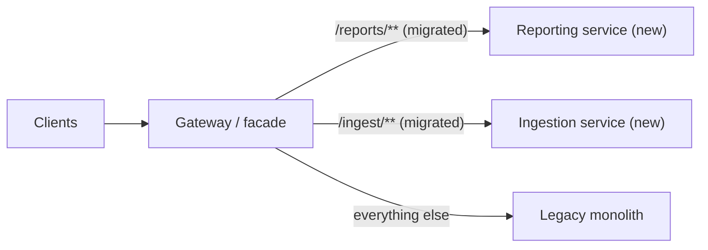
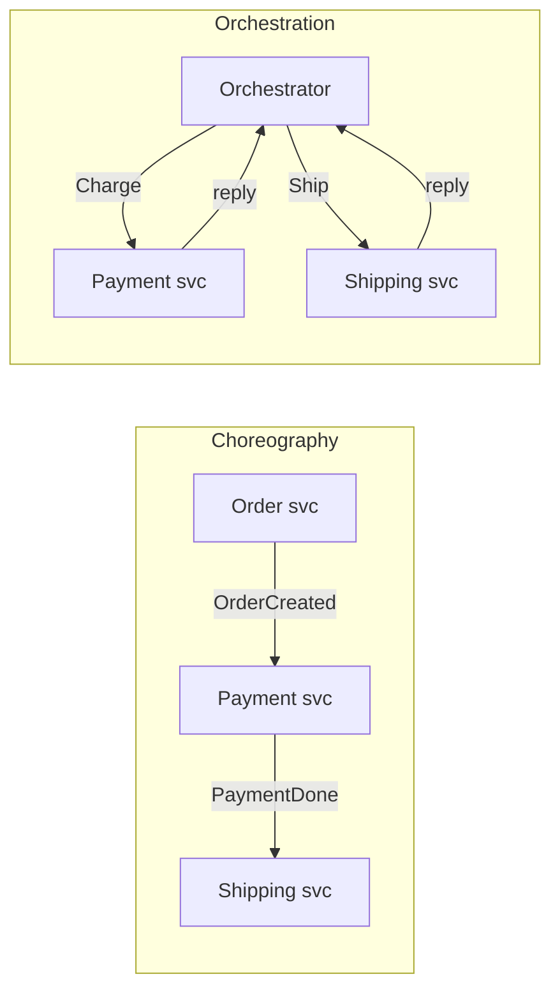
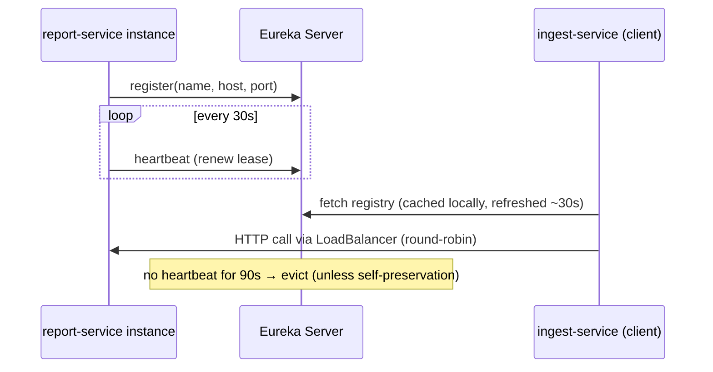
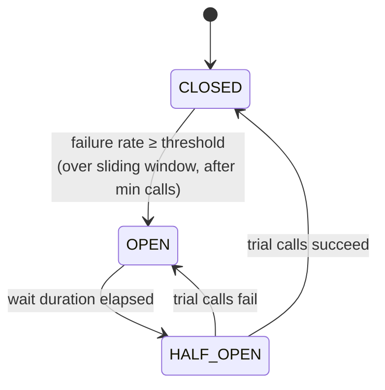
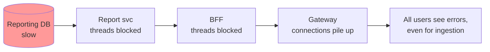
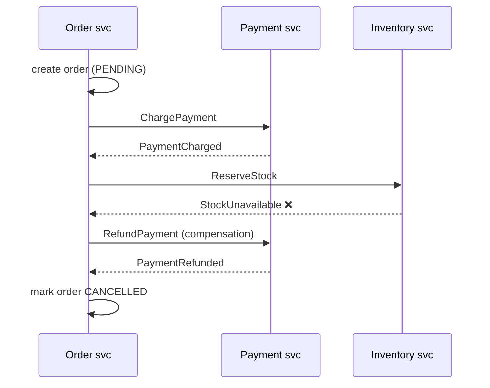
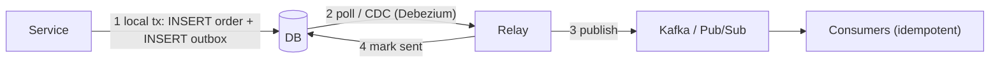
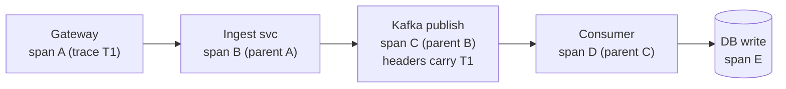

# Microservices & Spring Cloud (Java 8): Interview Notes

**Why this matters in interviews:** "Design it as microservices" is where senior interviews become system-design conversations. Interviewers want to hear trade-offs, not buzzwords: when *not* to split a service, how services talk, what happens when one of them is slow, and how data stays consistent without distributed transactions. Being able to talk through timeouts, retries, sagas and idempotency, grounded in real event pipelines, is what separates senior answers.

> [!NOTE]
> These notes target **Spring Cloud 2021.0.x** with Spring Boot 2.6/2.7, the last release train that supports Java 8. Netflix Ribbon, Hystrix and Zuul 1 were **removed** in 2020.0. Their replacements are Spring Cloud LoadBalancer, Resilience4j (through Spring Cloud CircuitBreaker) and Spring Cloud Gateway.

Difficulty legend: 🟢 Basic · 🟡 Intermediate · 🔴 Advanced · ⚡ Scenario

## Table of Contents

1. [Microservices Fundamentals](#1-microservices-fundamentals)
2. [Service Communication](#2-service-communication)
3. [Discovery, Configuration and Gateway](#3-discovery-configuration-and-gateway)
4. [Resilience Patterns](#4-resilience-patterns)
5. [Data Management and Consistency](#5-data-management-and-consistency)
6. [Observability and Deployment](#6-observability-and-deployment)
7. [Coding / Hands-on](#7-coding--hands-on)
8. [Production Scenarios](#8-production-scenarios)
9. [Cheat Sheet](#9-cheat-sheet)
10. [Revision Checklist](#10-revision-checklist)
11. [Beyond Java 8](#11-beyond-java-8)

---

## 1. Microservices Fundamentals

> **Mental model:** A monolith is *one big restaurant kitchen*: efficient, but one grease fire closes everything. Microservices are a *food court*. Every stall has its own staff, menu and fridge, and one stall closing doesn't shut the court, but now you need signs, shared seating and a way to pay across stalls. You trade **code complexity** for **operational complexity**.

### Q1. 🟢 What are microservices?

An architecture where an application is made of **small, independently deployable services**, each owning one **business capability** and **its own data**, communicating over the network (HTTP/gRPC or messaging), and owned by a small team.

<details><summary>Cross-questions</summary>

**Q:** What's the single most important property?

**A:** **Independent deployability.** If services must be released together, you have a distributed monolith, which combines the worst of both worlds.
</details>

### Q2. 🟢 Monolith vs microservices?

| | Monolith | Microservices |
|---|---|---|
| Deploy | One unit | Per service |
| Scaling | Whole app | Per service (scale ingestion ≠ reporting) |
| Tech stack | One | Per service (polyglot, with limits) |
| Data | One DB, ACID joins | DB per service, eventual consistency |
| Failure | Process-wide | Partial failures, network faults |
| Ops cost | Low | High: discovery, tracing, CI/CD per service |
| Team fit | Small team | Many teams, clear ownership |

<details><summary>Cross-questions</summary>

**Q:** When would you **not** use microservices?

**A:** With a small team, an unclear domain, or an early-stage product. Start with a **modular monolith** with clean module boundaries, and extract services when there's a clear scaling or ownership need.
</details>

### Q3. 🟡 How do you decide service boundaries?

Use **Domain-Driven Design**: identify **bounded contexts** (Ingestion, Reporting, Identity, Billing), where each has its own model and language. Split along business capabilities with high cohesion inside and loose coupling between them, not along technical layers ("a DB service", "a validation service").

<details><summary>Cross-questions</summary>

**Q:** What's a sign that the boundaries are wrong?

**A:** Chatty synchronous calls between two services for most requests, shared tables, or changes that always touch both services. Those services probably belong together.
</details>

### Q4. 🟡 What is a distributed monolith?

Services that are **separately deployed but tightly coupled**: shared databases, synchronous call chains where every hop is required, lockstep releases, and shared domain libraries that change often. You pay the network costs without getting the independence.

<details><summary>Cross-questions</summary>

**Q:** How do you escape one?

**A:** Break shared databases apart (use APIs or events), replace synchronous chains with events where possible, version the APIs, and shrink the shared libraries down to stable utilities.
</details>

### Q5. 🟢 What are the 12-factor app principles most relevant to microservices?

- **Config in the environment.**
- **Stateless processes** (state lives in backing services).
- **Backing services as attached resources** (DB, Kafka, Redis through URLs).
- **Disposability**: fast startup and graceful shutdown.
- **Dev/prod parity.**
- **Logs as event streams** (stdout).
- **One codebase, many deploys.**

<details><summary>Cross-questions</summary>

**Q:** Why do stateless processes matter for Kubernetes?

**A:** Pods get killed, rescheduled and scaled at any time. Any in-memory state (sessions, job status) is lost, or it breaks load balancing.
</details>

### Q6. 🟡 What are the fallacies of distributed computing?

The network is reliable; latency is zero; bandwidth is infinite; the network is secure; topology doesn't change; there's one administrator; transport cost is zero; the network is homogeneous. Every one of them is **false**, and every resilience pattern exists because of that.

<details><summary>Cross-questions</summary>

**Q:** Which fallacy causes the most outages in practice?

**A:** "Latency is zero", and its cousin "the dependency will answer". Missing timeouts turn a slow service into a cascading failure.
</details>

### Q7. 🟡 What is Conway's law, and why does it matter?

"Organisations design systems that mirror their communication structure." Service boundaries should align with team boundaries, and one team should own a service end to end (you build it, you run it).

<details><summary>Cross-questions</summary>

**Q:** What's the "inverse Conway manoeuvre"?

**A:** Structuring teams deliberately to get the architecture you want.
</details>

### Q8. 🟡 What is the strangler fig pattern?

You migrate a monolith incrementally. Put a facade or gateway in front of it, route one capability at a time to a new service, and retire the old code paths. The monolith "withers" away without a risky big-bang rewrite.



<details><summary>Cross-questions</summary>

**Q:** How do you handle the data during a strangler migration?

**A:** At first the new service may read from the monolith's database or sync through CDC events. Eventually it owns its own data, and the monolith calls the service instead.
</details>

### Q9. 🟢 What does "database per service" mean?

Each service **owns its schema** exclusively. Other services access the data only through the owner's API or events. That enables independent schema evolution and scaling. The cost is that there are no cross-service joins or ACID transactions.

<details><summary>Cross-questions</summary>

**Q:** Does it mean one physical DB server per service?

**A:** No. Separate **schemas or users** on a shared server is often fine to start with. The rule is about ownership and access, not hardware.
</details>

### Q10. 🟡 What is the API gateway pattern?

A single entry point for clients that handles routing, authentication and token validation, rate limiting, TLS termination, request aggregation, and cross-cutting headers. In the Spring world, that's **Spring Cloud Gateway**.

<details><summary>Cross-questions</summary>

**Q:** What must a gateway *not* become?

**A:** A home for business logic, or a single team's bottleneck. Keep it thin and declarative.
</details>

### Q11. 🟡 What is the Backend-for-Frontend (BFF) pattern?

A separate API layer per client type (mobile, web, partner) that shapes and aggregates data for that client's needs. Mobile gets smaller payloads, and web gets richer views.

<details><summary>Cross-questions</summary>

**Q:** What's the risk?

**A:** Logic gets duplicated across BFFs. Keep them to presentation and aggregation, and keep domain logic in the core services.
</details>

### Q12. 🟡 What does "smart endpoints, dumb pipes" mean?

Business logic lives in the services, and the transport (HTTP, a message broker) just moves messages. It's the opposite of the ESB era, where orchestration and transformation lived in the middleware.

<details><summary>Cross-questions</summary>

**Q:** Does Kafka Streams violate this?

**A:** No. Kafka Streams runs **inside your service** as a library. The broker itself stays a dumb, durable log.
</details>

### Q13. 🟡 How do you version service APIs?

Prefer **backward-compatible evolution**: add optional fields, never remove or rename fields, and use tolerant readers. For breaking changes, run `/v1` and `/v2` in parallel and deprecate `v1` with a timeline. Use schema registries for events (Avro or Protobuf compatibility rules).

<details><summary>Cross-questions</summary>

**Q:** What are consumer-driven contract tests?

**A:** Consumers publish their expectations (Spring Cloud Contract, Pact), and the provider's CI verifies them, so breaking changes fail the build before deploy.
</details>

### Q14. 🟡 What does a microservice "chassis" give you?

It's a shared foundation, such as an internal Spring Boot starter, with standard logging, metrics, tracing, health checks, security config, error format and client defaults (timeouts, retries). Every service then starts production-ready, with consistent behaviour.

<details><summary>Cross-questions</summary>

**Q:** What's the risk of a shared chassis?

**A:** Coupling. Keep it versioned, backward-compatible and small, and let teams upgrade on their own schedule.
</details>

---

## 2. Service Communication

> **Mental model:** A **synchronous call** is a *phone call*: you wait on the line, and if they don't pick up, you're stuck. An **asynchronous message** is a *text message*: you send it and carry on, and they reply when they can. Phone calls are simple and immediate. Texts survive the other person being busy.

### Q15. 🟢 Synchronous vs asynchronous communication?

| | Sync (REST/gRPC) | Async (Kafka, Pub/Sub, MQ) |
|---|---|---|
| Coupling | Temporal: both must be up | Decoupled in time |
| Latency | Immediate response | Eventual |
| Failure | Caller must handle errors/timeouts | Broker buffers; retry/DLQ |
| Use for | Queries, user-facing request/response | Events, workflows, high-volume ingestion |
| Complexity | Lower | Ordering, duplicates, idempotency |

<details><summary>Cross-questions</summary>

**Q:** Why was mobile, iOS and web event ingestion built on Kafka, IBM MQ and Pub/Sub instead of synchronous calls to downstream services?

**A:** Ingestion must **accept events fast and never lose them**, even when downstream consumers are slow or down. A durable broker absorbs the bursts, decouples producers from consumers, and lets several consumers (analytics, notifications, storage) process the same events independently.
</details>

### Q16. 🟡 REST vs gRPC?

| | REST/JSON | gRPC/Protobuf |
|---|---|---|
| Transport | HTTP/1.1 or 2 | HTTP/2 |
| Payload | Text JSON | Binary, schema-first |
| Contracts | OpenAPI (optional) | `.proto` (mandatory, codegen) |
| Streaming | Limited (SSE, chunked) | Bi-directional streaming |
| Browser support | Native | Needs gRPC-Web |
| Best for | Public APIs, simplicity | Internal high-throughput, low-latency calls |

<details><summary>Cross-questions</summary>

**Q:** Why can load balancing be tricky with gRPC?

**A:** HTTP/2 keeps **long-lived connections**, so a connection-level L4 balancer pins all of a client's requests to one pod. Use L7 (request-level) balancing or client-side balancing.
</details>

### Q17. 🟡 What are events vs commands vs queries?

- **Command:** "do this" (`GenerateReport`). There's one intended handler, and it may be rejected.
- **Event:** "this happened" (`ReportGenerated`). It's a past-tense fact with many possible consumers, and the publisher doesn't know who they are.
- **Query:** "tell me" (`GetReportStatus`). It has no side effects.

<details><summary>Cross-questions</summary>

**Q:** Why prefer events for integration?

**A:** The producer doesn't need to know its consumers. Adding a new consumer (say, fraud detection) needs no change on the producer.
</details>

### Q18. 🟡 Event notification vs event-carried state transfer?

- **Notification:** the event is thin (`{orderId}`), and consumers call back for details. The payload is small, but there's coupling and extra load on the source.
- **State transfer:** the event carries the data consumers need. Consumers keep local copies and don't need to call back, at the cost of larger events and data duplication.

<details><summary>Cross-questions</summary>

**Q:** Which suits high-volume ingestion?

**A:** State transfer. Consumers process the events on their own, with no fan-in of callbacks to the producer.
</details>

### Q19. 🟡 How do you call another service with OpenFeign?

```java
import org.springframework.cloud.openfeign.FeignClient;
import org.springframework.web.bind.annotation.GetMapping;
import org.springframework.web.bind.annotation.PathVariable;

@FeignClient(name = "user-service", path = "/api/v1/users")
public interface UserClient {
    @GetMapping("/{id}")
    UserDto getUser(@PathVariable("id") String id);

    class UserDto {
        public String id;
        public String tenant;
    }
}
```

Enable it with `@EnableFeignClients`. With Spring Cloud LoadBalancer on the classpath, `name` resolves through discovery.

```yaml
feign:
  client:
    config:
      default:
        connectTimeout: 2000
        readTimeout: 5000
        loggerLevel: basic
  circuitbreaker:
    enabled: true            # wrap calls with Spring Cloud CircuitBreaker (Resilience4j)
```

<details><summary>Cross-questions</summary>

**Q:** Why set `connectTimeout` and `readTimeout` explicitly?

**A:** The Feign defaults (10 s connect and 60 s read) are far too long for synchronous request paths, and they exhaust threads under failure.

**Q:** How do you map remote errors?

**A:** A custom `ErrorDecoder` that converts status codes into domain exceptions (a 404 becomes `UserNotFound`, a 503 becomes a retryable exception).
</details>

### Q20. 🟡 Client-side vs server-side load balancing?

- **Client-side** (Spring Cloud LoadBalancer): the client fetches instances from discovery and picks one (round-robin by default).
- **Server-side**: a load balancer or proxy (Kubernetes Service, a cloud LB, an Envoy sidecar) distributes the traffic.

On Kubernetes, the Service DNS plus kube-proxy or a mesh usually makes client-side balancing unnecessary.

<details><summary>Cross-questions</summary>

**Q:** What replaced Ribbon?

**A:** Spring Cloud LoadBalancer. Ribbon was removed in 2020.0.
</details>

### Q21. 🟡 What is request aggregation (API composition), and what are its pitfalls?

A composite endpoint calls several services and merges the results. The pitfalls: latency is the **slowest** call, availability is the **product** of the dependencies' availabilities, and you get partial failures. Mitigations: call **in parallel** with `CompletableFuture`, set per-call timeouts, and allow partial responses with fallbacks.

<details><summary>Cross-questions</summary>

**Q:** If 5 dependencies each have 99.9% availability, what's the composite availability?

**A:** 0.999^5 ≈ 99.5%, which is about 3.6 hours of downtime a month, compared with 43 minutes for each one alone.
</details>

### Q22. 🟡 How do you pass context (trace ID, user, tenant) across services?

In HTTP headers (`traceparent` or B3 for tracing, and an authenticated token or trusted headers for identity), and in **message headers** for Kafka, Pub/Sub attributes and MQ properties. Sleuth propagates tracing headers automatically for RestTemplate, Feign, WebClient and Kafka in Boot 2.

<details><summary>Cross-questions</summary>

**Q:** Why do message headers matter for async flows?

**A:** Without the trace ID in the headers, you can't connect the producer's request to the consumer's processing when you debug.
</details>

### Q23. 🟡 What is Spring Cloud Stream?

It's an abstraction over brokers (Kafka, RabbitMQ, Pub/Sub, Solace and others) through **binders**. Since 3.x, you write plain functional beans (`Supplier`, `Function`, `Consumer`), and bindings map them to destinations.

```java
import java.util.function.Consumer;
import java.util.function.Function;
import org.springframework.context.annotation.Bean;
import org.springframework.context.annotation.Configuration;

@Configuration
public class StreamFunctions {
    @Bean
    public Function<String, String> enrich() {              // binding: enrich-in-0 → enrich-out-0
        return raw -> raw.trim().toUpperCase();
    }
    @Bean
    public Consumer<String> audit() {                        // binding: audit-in-0
        return msg -> System.out.println("audit " + msg);
    }
}
```

```yaml
spring:
  cloud:
    function:
      definition: enrich;audit
    stream:
      bindings:
        enrich-in-0:  { destination: mobile-events, group: enricher }
        enrich-out-0: { destination: enriched-events }
        audit-in-0:   { destination: enriched-events, group: audit }
```

<details><summary>Cross-questions</summary>

**Q:** What does `group` do?

**A:** It creates a **consumer group**, so each message goes to one instance in the group (competing consumers). Without a group, every instance gets every message (anonymous subscribers).
</details>

### Q24. 🟡 Choreography vs orchestration?

| | Choreography | Orchestration |
|---|---|---|
| Control | Each service reacts to events | Central orchestrator sends commands |
| Coupling | Loose; no central brain | Orchestrator knows all steps |
| Visibility | Harder to see the whole flow | Flow explicit in one place |
| Good for | Simple flows, few steps | Complex workflows, compensations, timeouts |



<details><summary>Cross-questions</summary>

**Q:** What tools implement orchestration?

**A:** Temporal, Camunda, AWS Step Functions and GCP Workflows, or a hand-rolled state machine persisted in a DB.
</details>

### Q25. 🟡 How do you make an HTTP call idempotent across retries?

GET, PUT and DELETE are idempotent by definition. For POST, use an **`Idempotency-Key`** header: store the key with the result (with a unique constraint or Redis `SETNX`), and return the stored result on a repeat. Retries are safe only when the operation is idempotent.

<details><summary>Cross-questions</summary>

**Q:** How long should idempotency keys be kept?

**A:** At least as long as the maximum retry window of the clients and brokers (hours to days), with a TTL.
</details>

### Q26. 🟡 How should services handle a slow consumer when the producer is fast?

With **backpressure**. Using a broker, the queue or log absorbs the backlog, consumers scale out (up to the partition count) and use flow control. Using sync calls, return 429 or 503 with `Retry-After` and have clients back off. Never buffer without bounds in memory.

<details><summary>Cross-questions</summary>

**Q:** What's Pub/Sub's built-in flow control?

**A:** The subscriber client has `maxOutstandingElementCount` and `maxOutstandingRequestBytes`. It stops pulling when too many messages are unacked.
</details>

### Q27. 🟡 What is a service mesh, and when is it worth it?

A sidecar proxy (Envoy) per pod, managed by a control plane (Istio, Linkerd), handles **mTLS, retries, timeouts, traffic splitting and telemetry** transparently. It's worth it once you have many services and polyglot stacks. It adds operational complexity and a little latency.

<details><summary>Cross-questions</summary>

**Q:** Should you use mesh retries *and* app retries?

**A:** Be careful: stacked retries multiply. 3 × 3 × 3 = 27 attempts. Retry at one layer only.
</details>

### Q28. 🟡 WebClient vs RestTemplate vs Feign in Spring Cloud apps?

| | RestTemplate | WebClient | OpenFeign |
|---|---|---|---|
| Style | Imperative | Reactive (can block) | Declarative interface |
| Status | Maintenance | Recommended (Spring 5+) | Popular in Spring Cloud |
| Load balancing | `@LoadBalanced` | `@LoadBalanced` builder | Built-in |

<details><summary>Cross-questions</summary>

**Q:** Which default should you never keep?

**A:** Infinite or very long timeouts. Configure connect and read timeouts, and a connection pool, on all of them.
</details>

---
## 3. Discovery, Configuration and Gateway

> **Mental model:** **Service discovery** is a *phone book* that updates itself as people move house. **Config Server** is the *company handbook* that everyone reads from instead of keeping their own printed copy. The **Gateway** is the *reception desk*: visitors never wander the corridors looking for the right office.

### Q29. 🟢 Why do we need service discovery?

Instances scale up and down and move between IPs. Hard-coded addresses break. With a registry, services register themselves (name → instances), and clients look them up by name. The options are **Eureka**, Consul, ZooKeeper, or Kubernetes' built-in DNS and Endpoints.

<details><summary>Cross-questions</summary>

**Q:** Do you need Eureka on Kubernetes?

**A:** Usually not. Kubernetes Services give you stable DNS names and load balancing. Eureka makes sense on VMs, or across mixed environments.
</details>

### Q30. 🟡 How does Eureka work?

Clients **register** at startup and send **heartbeats** (every 30 s by default). The server evicts instances that miss heartbeats (90 s lease expiry by default). Clients **cache the registry locally** and refresh it (every 30 s), so calls keep working even if the Eureka server is briefly down.



<details><summary>Cross-questions</summary>

**Q:** What is Eureka's self-preservation mode?

**A:** If too many heartbeats are lost at once (which could be a network partition rather than real deaths), Eureka **stops evicting** instances, preferring stale entries over mass eviction. That's AP behaviour, in CAP terms.

**Q:** Why can a just-stopped instance still receive traffic?

**A:** The client caches and lease timeouts. Mitigate with graceful deregistration on shutdown, retries to another instance, and short cache refresh intervals.
</details>

### Q31. 🟡 How does Spring Cloud Config work?

The Config Server serves configuration from a **git repository** (or Vault, a JDBC database, or native files), keyed by `{application}-{profile}` and label (branch). Clients import it at startup (`spring.config.import=configserver:http://config:8888` in Boot 2.4+).

<details><summary>Cross-questions</summary>

**Q:** What happens if the Config Server is down at startup?

**A:** With `optional:configserver:`, the client starts on local defaults. Without it, startup fails, which is fail-fast. Enable retries with `spring.cloud.config.retry`.

**Q:** How do you refresh config at runtime?

**A:** `@RefreshScope` beans plus `POST /actuator/refresh`, or Spring Cloud Bus (Kafka or RabbitMQ) to broadcast the refresh to every instance.
</details>

### Q32. 🟡 Config Server or Kubernetes ConfigMaps and Secrets?

On Kubernetes, **ConfigMaps and Secrets** (mounted as files or env vars, or read with Spring Cloud Kubernetes) are simpler, with no extra server. Config Server shines when you need git-based auditing, many environments outside Kubernetes, or encrypted properties (`{cipher}`).

<details><summary>Cross-questions</summary>

**Q:** Where do secrets belong either way?

**A:** In a secret manager (Vault, GCP Secret Manager, External Secrets), never in plain git.
</details>

### Q33. 🟡 What does Spring Cloud Gateway do, and how is it built?

It's built on **Spring WebFlux / Netty** (reactive and non-blocking). It matches **routes** with **predicates** (path, host, header, method) and applies **filters** (rewrite path, add headers, circuit breaker, rate limiter, retry).

```yaml
spring:
  cloud:
    gateway:
      routes:
        - id: ingest
          uri: lb://ingest-service           # lb:// = resolve via discovery/LoadBalancer
          predicates:
            - Path=/api/ingest/**
          filters:
            - StripPrefix=1
            - name: RequestRateLimiter
              args:
                redis-rate-limiter.replenishRate: 500
                redis-rate-limiter.burstCapacity: 1000
                key-resolver: "#{@clientKeyResolver}"
        - id: reports
          uri: lb://report-service
          predicates:
            - Path=/api/reports/**
          filters:
            - name: CircuitBreaker
              args:
                name: reportsCb
                fallbackUri: forward:/fallback/reports
```

<details><summary>Cross-questions</summary>

**Q:** Why must you never block inside a gateway filter?

**A:** Netty has a few event-loop threads. Blocking one (JDBC, a blocking HTTP call) stalls all the requests on it.

**Q:** Gateway vs Zuul 1?

**A:** Zuul 1 was servlet-based and blocking, and it was removed from Spring Cloud in 2020.0. The Gateway is non-blocking and actively maintained.
</details>

### Q34. 🟡 How does Redis-based rate limiting work in Spring Cloud Gateway?

`RedisRateLimiter` implements a **token bucket** with a Lua script in Redis (atomic, shared across gateway instances). `replenishRate` is tokens per second, and `burstCapacity` is the bucket size. The `KeyResolver` chooses the bucket key (user, API key or IP). Rejected requests get **429**.

<details><summary>Cross-questions</summary>

**Q:** What happens if Redis is down?

**A:** By default the limiter **allows** requests (fails open), to preserve availability. Decide consciously whether that's acceptable.
</details>

### Q35. 🟡 What cross-cutting concerns belong in the gateway?

TLS termination, token validation (coarse), rate limiting, request size limits, CORS, request IDs and trace headers, routing, canary traffic splitting, and stripping untrusted headers. **Not** business rules or data joins.

<details><summary>Cross-questions</summary>

**Q:** Should the gateway be the only place authorization happens?

**A:** No. Services must enforce their own authorization (defence in depth).
</details>

### Q36. 🟡 How does Spring Cloud LoadBalancer choose an instance?

By default, `RoundRobinLoadBalancer` works over the instances returned by a `ServiceInstanceListSupplier` (discovery, with caching). A random load balancer and zone preference are also available, as are health-check-based suppliers and a same-instance preference for sticky behaviour.

<details><summary>Cross-questions</summary>

**Q:** How do you use it with `RestTemplate`?

**A:** Annotate the `RestTemplate` bean with `@LoadBalanced`, then call `http://service-name/path`.
</details>

### Q37. 🟡 What are health checks for in discovery and load balancing?

Registries and load balancers should route only to **healthy, ready** instances. On Kubernetes, the readiness probe removes a pod from the Service endpoints. With Eureka, the instance status comes from `/actuator/health` if `eureka.client.healthcheck.enabled=true`.

<details><summary>Cross-questions</summary>

**Q:** Why should readiness check dependencies but liveness shouldn't?

**A:** Covered in file 03 (Q84). A shared dependency failure must not restart every pod at once.
</details>

### Q38. 🟡 How do you do canary releases or traffic splitting?

Route a small percentage of traffic to the new version (with Gateway weight predicates, mesh virtual services, or two Kubernetes Deployments behind one Service), compare error rates and latency, then ramp up or roll back.

<details><summary>Cross-questions</summary>

**Q:** How is it different from blue-green?

**A:** Blue-green switches **all** traffic between two full environments at once, with instant rollback. A canary shifts traffic **gradually**, with metric gates.
</details>

### Q39. 🟡 What is a sidecar?

It's a helper container that runs next to the app in the same pod (a proxy, log shipper, or secrets agent). It adds capabilities without changing the app's code.

<details><summary>Cross-questions</summary>

**Q:** Can you give an example outside the mesh?

**A:** The Cloud SQL Auth Proxy sidecar, which handles IAM authentication and TLS to Cloud SQL.
</details>

### Q40. 🟡 How do you handle configuration drift across 20 services?

Use shared defaults through a common starter or chassis, environment-specific values in one place (a Config Server repository or Helm values), validation at startup (`@ConfigurationProperties` + `@Validated`), and audits (`/actuator/configprops`, restricted).

<details><summary>Cross-questions</summary>

**Q:** What's the most dangerous drift?

**A:** Timeouts and pool sizes that differ from what capacity planning assumed.
</details>

### Q41. 🟡 How do you secure service-to-service calls?

Use **mTLS** (from a mesh or certificates) for transport identity, and **OAuth2 client credentials** or token relay for application-level authorization. Add network policies that limit which pods can talk to each other. See file 04.

<details><summary>Cross-questions</summary>

**Q:** Is an internal network enough?

**A:** No. Assume zero trust.
</details>

### Q42. 🟡 How does Spring Cloud Bus work?

It connects instances through a broker (Kafka or RabbitMQ) to broadcast management events, typically **config refresh** (`/actuator/busrefresh` on one node refreshes every node).

<details><summary>Cross-questions</summary>

**Q:** Is it needed on Kubernetes?

**A:** Often not. Rolling restarts or ConfigMap reload tools cover most needs.
</details>

### Q43. 🟡 What is the Gateway's `lb://` scheme, and what are its common pitfalls?

`lb://service-name` resolves the service through Spring Cloud LoadBalancer. The pitfalls: missing the `spring-cloud-starter-loadbalancer` dependency (routes fail with 503), stale instance caches during deploys, and forgetting `StripPrefix` or `RewritePath`, so the downstream service gets the wrong path.

<details><summary>Cross-questions</summary>

**Q:** How do you debug gateway routing?

**A:** Use `/actuator/gateway/routes` and DEBUG logging for `org.springframework.cloud.gateway`.
</details>

### Q44. 🟡 Where should request timeouts be configured in a gateway → service → DB path?

At **every hop**, with **decreasing budgets**. For example: gateway 10 s > service's outbound call 5 s > DB statement 3 s. The inner layers should time out first, so the outer ones get a meaningful error instead of timing out blindly.

<details><summary>Cross-questions</summary>

**Q:** What is deadline propagation?

**A:** Passing the remaining time budget downstream (gRPC deadlines, or a custom header), so deep calls don't keep working after the caller has given up.
</details>

---

## 4. Resilience Patterns

> **Mental model:** Resilience patterns are an *electrical system's safety devices*. **Timeouts** are fuses that pop instead of letting the wire burn. **Circuit breakers** are breakers that trip after repeated faults and reset after a pause. **Bulkheads** are separate circuits, so a fault in the kitchen doesn't black out the bedroom. **Retries** are flipping the switch again, which is fine once and dangerous in a loop.

### Q45. 🟢 Which resilience patterns should every senior engineer know?

| Pattern | Problem solved |
|---|---|
| **Timeout** | Don't wait forever on a slow dependency |
| **Retry (with backoff + jitter)** | Transient failures |
| **Circuit breaker** | Stop hammering a failing dependency; fail fast |
| **Bulkhead** | Isolate resources per dependency |
| **Rate limiter** | Protect yourself/others from overload |
| **Fallback** | Degraded but useful response |
| **Idempotency** | Make retries safe |
| **Load shedding** | Reject early when saturated |

<details><summary>Cross-questions</summary>

**Q:** Which one would you add first?

**A:** **Timeouts.** Every other pattern depends on failures being detected quickly.
</details>

### Q46. 🟡 How does a circuit breaker work (Resilience4j)?



- **CLOSED:** calls flow through, and the outcomes are recorded in a count- or time-based sliding window.
- **OPEN:** calls are rejected immediately (`CallNotPermittedException`), and the fallback runs.
- **HALF_OPEN:** a limited number of trial calls decide whether to close or re-open.

#### 🎯 Predict the output

```java
import io.github.resilience4j.circuitbreaker.CallNotPermittedException;
import io.github.resilience4j.circuitbreaker.CircuitBreaker;
import io.github.resilience4j.circuitbreaker.CircuitBreakerConfig;
import java.time.Duration;
import java.util.function.Supplier;

public class BreakerDemo {
    public static void main(String[] args) {
        CircuitBreakerConfig cfg = CircuitBreakerConfig.custom()
            .slidingWindowType(CircuitBreakerConfig.SlidingWindowType.COUNT_BASED)
            .slidingWindowSize(4)
            .minimumNumberOfCalls(4)
            .failureRateThreshold(50)
            .waitDurationInOpenState(Duration.ofSeconds(30))
            .build();
        CircuitBreaker cb = CircuitBreaker.of("reports", cfg);

        boolean[] outcomes = {true, false, true, false, true};   // true = success
        for (boolean ok : outcomes) {
            Supplier<String> call = CircuitBreaker.decorateSupplier(cb, () -> {
                if (!ok) throw new IllegalStateException("downstream 503");
                return "ok";
            });
            try {
                System.out.println(call.get() + " " + cb.getState());
            } catch (CallNotPermittedException e) {
                System.out.println("rejected " + cb.getState());
            } catch (IllegalStateException e) {
                System.out.println("failed " + cb.getState());
            }
        }
    }
}
```

<details><summary>Answer</summary>

```text
ok CLOSED
failed CLOSED
ok CLOSED
failed OPEN
rejected OPEN
```

After 4 calls (the minimum), the failure rate is 2/4 = 50%, which is ≥ the threshold, so the breaker **opens** on the 4th call. The 5th call is rejected immediately, without touching the downstream service.
</details>

<details><summary>Cross-questions</summary>

**Q:** Why have a `minimumNumberOfCalls`?

**A:** So one early failure (1/1 = 100%) doesn't trip the breaker on low traffic.

**Q:** Do slow calls count?

**A:** Yes, if you configure `slowCallDurationThreshold` and `slowCallRateThreshold`. Slowness is often worse than errors.
</details>

### Q47. 🟡 How do you use Resilience4j annotations in Spring Boot?

```java
import io.github.resilience4j.circuitbreaker.annotation.CircuitBreaker;
import io.github.resilience4j.retry.annotation.Retry;
import org.springframework.stereotype.Service;

@Service
public class UserLookup {
    private final UserClient client;          // Feign client from Q19
    public UserLookup(UserClient client) { this.client = client; }

    @CircuitBreaker(name = "userService", fallbackMethod = "fallback")
    @Retry(name = "userService")
    public UserClient.UserDto find(String id) {
        return client.getUser(id);
    }

    // same signature + Throwable as last parameter
    private UserClient.UserDto fallback(String id, Throwable t) {
        UserClient.UserDto dto = new UserClient.UserDto();
        dto.id = id;
        dto.tenant = "UNKNOWN";
        return dto;
    }
}
```

```yaml
resilience4j:
  circuitbreaker:
    instances:
      userService:
        sliding-window-size: 20
        minimum-number-of-calls: 10
        failure-rate-threshold: 50
        wait-duration-in-open-state: 20s
        slow-call-duration-threshold: 2s
        slow-call-rate-threshold: 50
  retry:
    instances:
      userService:
        max-attempts: 3
        wait-duration: 200ms
        enable-exponential-backoff: true
        exponential-backoff-multiplier: 2
        retry-exceptions: [java.io.IOException, feign.RetryableException]
```

<details><summary>Cross-questions</summary>

**Q:** In which order do Retry and CircuitBreaker apply with annotations?

**A:** Resilience4j's default aspect order is `Retry( CircuitBreaker( RateLimiter( TimeLimiter( Bulkhead( call )))))`, so Retry is outermost. Each retry attempt is recorded by the breaker, and once it's open, the retries get `CallNotPermittedException` quickly.

**Q:** They're proxy-based. What's the familiar trap?

**A:** Self-invocation bypasses them, the same as with `@Transactional`.
</details>

### Q48. 🟡 What are the retry best practices?

- Retry only **transient** failures (timeouts, 503, connection reset), never 4xx or validation errors.
- Retry only **idempotent** operations, or use idempotency keys.
- Use **exponential backoff with jitter**.
- Cap the attempts and the total time.
- **Retry at one layer only** (client, mesh or gateway, not all of them).
- Respect `Retry-After`.

<details><summary>Cross-questions</summary>

**Q:** What's a retry storm?

**A:** When a dependency slows down, every caller retries, multiplying the load on something already overloaded. Circuit breakers and retry budgets prevent it.
</details>

### Q49. 🟡 What is the bulkhead pattern in practice?

It limits concurrency per dependency. A **semaphore bulkhead** (max N concurrent calls, on the caller's thread) or a **thread-pool bulkhead** (a dedicated pool plus queue) means a slow reporting database can't consume every Tomcat thread that ingestion also needs.

<details><summary>Cross-questions</summary>

**Q:** Semaphore or thread-pool bulkhead?

**A:** A semaphore is lightweight and keeps the caller's thread and context. A thread pool adds isolation and asynchronous timeouts, at the cost of context propagation.
</details>

### Q50. 🟡 What is a good fallback, and what is a bad one?

**Good fallbacks:** cached or stale data (last known config), a default ("recommendations unavailable"), queuing the work for later, or a degraded feature. **Bad fallbacks:** silently returning wrong data (for example, a zero balance), or a fallback that calls the same failing dependency.

<details><summary>Cross-questions</summary>

**Q:** When is failing better than falling back?

**A:** When correctness matters more than availability, as with payments or authorization decisions. Fail closed.
</details>

### Q51. 🟡 What's the difference between a TimeLimiter and an HTTP client timeout?

A Resilience4j `TimeLimiter` times out a `CompletableFuture` or `Future`, but it **doesn't stop the underlying work**. The HTTP client's read timeout actually aborts the socket. Configure both; the client timeout is what frees the resources.

<details><summary>Cross-questions</summary>

**Q:** What happens to a thread if only a TimeLimiter is set?

**A:** The caller moves on, but the worker thread stays blocked on the socket until the client timeout, or forever if there isn't one.
</details>

### Q52. 🟡 What is load shedding?

When saturated, **reject early and cheaply** (fast 503s, dropping low-priority work) instead of accepting everything and timing out everywhere. It uses queue-length limits, concurrency limits, priority lanes, and adaptive limits (such as Netflix's concurrency-limits).

<details><summary>Cross-questions</summary>

**Q:** Why is fast rejection kinder than slow success?

**A:** Clients can retry elsewhere or back off. A slow, overloaded service drags down every caller's resources too.
</details>

### Q53. 🔴 What is a cascading failure? Walk through one.

1. The reporting DB slows down.
2. The report service's threads block on the DB, and its pool is exhausted.
3. Callers (the gateway, the BFF) block on the report service, with no timeouts, so *their* pools are exhausted.
4. Unrelated endpoints on those callers fail too.
5. Retries amplify the load.



**Breakers:** timeouts, circuit breakers, bulkheads per dependency, and load shedding.

<details><summary>Cross-questions</summary>

**Q:** Which single change stops step 3?

**A:** A client timeout plus a circuit breaker on the BFF's calls to the report service.
</details>

### Q54. 🟡 How do you choose timeout values?

Base them on the dependency's **measured latency** (p99 or p99.9), plus a margin, within the caller's own SLA budget. Set them per endpoint where latencies differ (a report export vs a status lookup). Revisit them as traffic changes.

<details><summary>Cross-questions</summary>

**Q:** What's wrong with a timeout set at p50?

**A:** Half of normal requests would time out. Timeouts should cut off the tail, not the typical request.
</details>

### Q55. 🟡 What is hedging (hedged requests)?

If a request hasn't answered within, say, its p95 latency, send a **duplicate** to another replica and take the first response. It reduces tail latency, but it adds load, so it's only for idempotent reads.

<details><summary>Cross-questions</summary>

**Q:** Where have you seen this used?

**A:** In large-scale storage and search systems ("The Tail at Scale"). It's rarely needed in typical CRUD services.
</details>

### Q56. 🟡 How do you rate-limit outbound calls to a partner API with a quota?

Use a **client-side rate limiter** (Resilience4j `RateLimiter`, or a Redis-backed limiter shared across instances) matched to the partner's quota, plus queueing or backoff when the limit is hit. Honour the partner's 429 and `Retry-After`.

<details><summary>Cross-questions</summary>

**Q:** Why share the limiter across instances?

**A:** A per-instance limit of 100/s × 10 instances is 1000/s, which exceeds the quota.
</details>

### Q57. 🟡 How do you test resilience?

Write unit tests for the breaker and retry configuration, run integration tests with fault injection (WireMock delays and 503s, Toxiproxy for network faults), and run **chaos experiments** in staging (kill pods, add latency) with the observability to verify the behaviour.

<details><summary>Cross-questions</summary>

**Q:** What should a chaos experiment always have?

**A:** A hypothesis, a small blast radius, abort conditions, and monitoring.
</details>

### Q58. 🟡 How do Kubernetes probes and resource limits relate to resilience?

Readiness removes unhealthy pods from traffic. Liveness restarts stuck pods. CPU and memory **requests and limits** prevent noisy neighbours. A PodDisruptionBudget keeps a minimum number of replicas during node maintenance, and the HPA scales on load.

<details><summary>Cross-questions</summary>

**Q:** Why can a tight CPU limit cause latency spikes in Java?

**A:** CFS **throttling**. JIT and GC threads burst past the quota, and the whole container gets paused for the rest of the period.
</details>

### Q59. 🟡 What's the difference between graceful degradation and failover?

**Degradation** keeps working with reduced features (no recommendations, cached report lists). **Failover** switches to a redundant copy (a replica DB, another region). Well-designed systems use both.

<details><summary>Cross-questions</summary>

**Q:** Can you give an ingestion example of degradation?

**A:** If enrichment (a geo lookup) is down, still accept and store the raw event with an "unenriched" flag, and enrich it later from a replay.
</details>

### Q60. 🟡 What SLO and error-budget thinking should inform resilience work?

Define **SLOs** (for example, 99.9% of ingestion requests succeed within 300 ms). The **error budget** (0.1%) then guides your priorities: when it's burning fast, freeze feature releases and invest in reliability. Alert on **burn rate**, not on every error.

<details><summary>Cross-questions</summary>

**Q:** What's the difference between SLI, SLO and SLA?

**A:** The SLI is the measured indicator. The SLO is the internal target. The SLA is the contractual promise, with penalties, and it's usually looser than the SLO.
</details>

---
## 5. Data Management and Consistency

> **Mental model:** Without a shared database, every service is a *separate bank branch with its own ledger*. You can't lock two ledgers in one transaction, so you **send letters** (events) and **correct mistakes with reversing entries** (compensations). Consistency arrives, just not instantly.

### Q61. 🟡 Why are distributed transactions (2PC / XA) avoided in microservices?

Two-phase commit needs every participant to support XA, **blocks** while the coordinator is uncertain, reduces availability (any participant failing blocks everyone), and scales poorly. Most brokers and cloud databases don't support it well. Instead, use **local transactions plus events** (sagas, outbox) and accept eventual consistency.

<details><summary>Cross-questions</summary>

**Q:** Did IBM MQ support XA with databases?

**A:** Yes. MQ and JMS can take part in XA transactions with a DB through a JTA transaction manager. It's used in some enterprise setups, and it's heavy. The outbox pattern and idempotent consumers are the more common modern approach.
</details>

### Q62. 🔴 What is the Saga pattern?

A saga is a sequence of **local transactions**. Each step publishes an event or command that triggers the next step. If a step fails, **compensating transactions** undo the previous steps in reverse order.



<details><summary>Cross-questions</summary>

**Q:** What properties must compensations have?

**A:** They must be **idempotent** and retryable, because they may run more than once. They must also be semantically correct: a refund isn't the same as "the charge never happened", because the customer may have seen it.

**Q:** What's the isolation problem with sagas?

**A:** Intermediate states are visible (the order is PENDING, the payment already charged). Use semantic locks (status fields), commutative updates, or re-reading values to limit the anomalies.
</details>

### Q63. 🔴 What is the Transactional Outbox pattern?

It solves the **dual-write problem**: "update the DB *and* publish to Kafka" can't be atomic. Instead, write the business change **and** an `outbox` row in **one local transaction**. A relay then reads the outbox and publishes the events, either by polling or by **CDC** (Debezium reading the WAL or binlog).



<details><summary>Cross-questions</summary>

**Q:** What delivery guarantee does the outbox give?

**A:** **At-least-once**. The relay can crash after publishing but before marking the row sent, so consumers must be idempotent.

**Q:** Polling or CDC?

**A:** Polling is simple, but it adds latency and DB load. CDC is low-latency and preserves order, but it needs more infrastructure (Kafka Connect, Debezium).
</details>

### Q64. 🟡 What is the inbox (idempotent consumer) pattern?

The consumer records processed message IDs in a `processed_messages` table **in the same transaction** as its side effects. A redelivered message hits the unique key, and processing is skipped. Together with the outbox, it gives you **effectively-once** processing.

```sql
CREATE TABLE processed_messages (
  message_id  VARCHAR(64) PRIMARY KEY,
  processed_at TIMESTAMP NOT NULL DEFAULT CURRENT_TIMESTAMP
);
```

<details><summary>Cross-questions</summary>

**Q:** Why not dedupe in Redis instead?

**A:** Redis and the DB aren't in one transaction. A crash between the two can lose or duplicate work. Redis is fine as a fast pre-check, but the DB constraint is the real guarantee.
</details>

### Q65. 🟡 What is CQRS?

**Command Query Responsibility Segregation** separates the **write model** (commands, validation, normalised data) from **read models** (denormalised views optimised for queries), usually kept in sync by events. It's useful when reads and writes have very different shapes or scale, as in reporting dashboards over high-volume ingestion.

<details><summary>Cross-questions</summary>

**Q:** What's the cost?

**A:** Eventual consistency between the models (users may briefly see stale reads), more moving parts, and projections to rebuild when they change.
</details>

### Q66. 🟡 What is event sourcing?

You store **state changes as an append-only sequence of events**, and current state is derived by replaying them (with snapshots for speed). You get a full audit trail and time travel. The costs are complexity, schema evolution of old events, and query needs that require projections (CQRS).

<details><summary>Cross-questions</summary>

**Q:** Is Kafka an event store?

**A:** Kafka can retain events and replay them, but it lacks per-entity streams with optimistic concurrency checks. Event-sourced systems typically use a DB or EventStoreDB, with Kafka for distribution.
</details>

### Q67. 🟡 How do you query data owned by several services?

The options:

1. **API composition** at a BFF or gateway (simple, but its latency and availability are the product of all calls).
2. **CQRS read models / materialised views** built from events (fast, eventually consistent).
3. **Data warehouse** for analytics (BigQuery, fed by CDC or streams).

Never let services read each other's databases directly.

<details><summary>Cross-questions</summary>

**Q:** Which suits the reporting platform?

**A:** Analytics queries go to a warehouse or replica. Operational dashboards use read models built from events.
</details>

### Q68. 🟡 How do you keep a local copy of another service's data?

Subscribe to its events (event-carried state transfer) and upsert a local, **read-only** replica of the fields you need. Handle out-of-order events with versions or timestamps ("apply only if newer"). Rebuild by replaying from Kafka (with compacted topics) or by re-exporting a snapshot.

<details><summary>Cross-questions</summary>

**Q:** What is a compacted topic?

**A:** Kafka keeps at least the **latest value per key**, which makes it a changelog you can rebuild state from.
</details>

### Q69. 🟡 Idempotency: which techniques exist at each layer?

| Layer | Technique |
|---|---|
| API | `Idempotency-Key` + stored response |
| Consumer | Processed-message table / unique event_id |
| DB write | Upsert (`ON CONFLICT`), natural keys, conditional updates |
| Kafka producer | `enable.idempotence=true` (dedup on broker per partition/session) |
| Business | Make operations naturally idempotent ("set status = SHIPPED", not "toggle") |

<details><summary>Cross-questions</summary>

**Q:** Why prefer "set" semantics over "increment"?

**A:** A replayed "set X = 5" is harmless. A replayed "X += 5" double-counts.
</details>

### Q70. 🟡 How do you handle ordering of events across services?

Kafka only guarantees order **per partition**, so key by the entity ID (order ID, user ID or device ID) to keep one entity's events in order. Across entities or topics there's no global order. Consumers should tolerate reordering by using versions or sequence numbers and ignoring stale updates.

<details><summary>Cross-questions</summary>

**Q:** What breaks ordering even within a partition?

**A:** Producer retries with `max.in.flight.requests.per.connection > 1` *without* idempotence (fixed by the idempotent producer), and consumers that process one partition's records in parallel.
</details>

### Q71. 🟡 Eventual consistency: how do you explain it to product teams?

"After a change, other views catch up within X seconds (the SLO), not instantly." Design the UX for it: show "processing" states, read your own writes from the source, and send notifications when the work is done. Measure and alert on the lag.

<details><summary>Cross-questions</summary>

**Q:** Which metric shows eventual-consistency health?

**A:** The consumer lag and the end-to-end event latency (event time → processed time).
</details>

### Q72. 🟡 What is a poison message, and how do you handle it?

A message that **always fails** processing (bad schema, a bug) and blocks the partition or queue, because it keeps getting redelivered. Handle it by catching the failure, retrying a few times with backoff (retry topics), and then sending it to a **dead-letter topic or queue** with the error metadata. Alert on DLQ growth, and provide a replay tool.

<details><summary>Cross-questions</summary>

**Q:** How do Kafka, Pub/Sub and IBM MQ do DLQs?

**A:** Kafka has no built-in DLQ; Spring Kafka's `DeadLetterPublishingRecoverer` provides one. Pub/Sub has a native **dead-letter topic** with max delivery attempts. IBM MQ has the queue's **backout queue and threshold** (`BOQNAME` / `BOTHRESH`), plus the queue manager's dead-letter queue. File 08 covers the details.
</details>

### Q73. 🟡 Shared database or API between two services: when is sharing acceptable?

Rarely: read-only reporting replicas or a transitional migration phase. Even then, prefer **views** as a contract, and have one owner for writes. Shared writable tables couple schemas and deploys.

<details><summary>Cross-questions</summary>

**Q:** How can a warehouse reduce the pressure to share?

**A:** Analytics reads everything from the warehouse, so no service needs direct access to another's OLTP database.
</details>

### Q74. 🟡 How do you evolve event schemas safely?

Use a **schema registry** (Confluent Schema Registry, or Pub/Sub schemas) with compatibility rules. For Avro **backward compatibility**, add fields with defaults and never remove required fields or change types. Version the event types when semantics change. Consumers should ignore unknown fields.

<details><summary>Cross-questions</summary>

**Q:** Backward vs forward compatibility?

**A:** **Backward** means new consumers can read old data. **Forward** means old consumers can read new data. **Full** is both.
</details>

### Q75. 🟡 How do you run a saga reliably (not losing progress on crash)?

Persist the saga state (step, status, correlation ID) in the orchestrator's database, drive the steps with outbox-published commands, handle replies idempotently, and add **timeouts** for steps that never reply, triggering compensation or retries. Workflow engines (Temporal, Camunda) give you this built in.

<details><summary>Cross-questions</summary>

**Q:** What's a pivot transaction?

**A:** The step after which the saga can't be compensated, only retried forward (for example, "shipped"). Put the steps that can fail before it.
</details>

### Q76. 🟡 How do you ensure a report job and its notification stay consistent?

Update the job status to DONE **and** write a `ReportReady` outbox event in one transaction. The relay publishes it, and the notification service consumes it idempotently. The user never gets a "ready" email for a job that's actually still failed.

<details><summary>Cross-questions</summary>

**Q:** What if the GCS upload succeeded but the DB update failed?

**A:** Make the upload idempotent (a deterministic object name), retry the DB update, and let a cleanup job delete orphaned files after a TTL.
</details>

---

## 6. Observability and Deployment

> **Mental model:** Observability is the system's *flight recorder*. **Metrics** are the dashboard gauges (what's wrong). **Logs** are the cockpit voice recording (what happened). **Traces** are the flight path across airports (where the time went). You need all three to answer "why is it slow for these users?".

### Q77. 🟢 What are the three pillars of observability?

| Pillar | Answers | Tools |
|---|---|---|
| **Metrics** | Is something wrong? How much? | Micrometer → Prometheus/Cloud Monitoring; Grafana |
| **Logs** | What exactly happened? | Structured JSON → ELK/Cloud Logging |
| **Traces** | Where did the latency go across services? | Sleuth/OpenTelemetry → Zipkin/Jaeger/Cloud Trace |

<details><summary>Cross-questions</summary>

**Q:** How do you connect the three?

**A:** Put the **trace ID** in every log line (MDC) and use exemplars on metrics, so you can jump from an alert to a trace to its logs.
</details>

### Q78. 🟡 How does distributed tracing work?

The first service creates a **trace ID**. Each operation is a **span** (with a parent span ID). The IDs travel in headers (W3C `traceparent`, or B3) to downstream calls and messages. Spans are sampled and exported to a backend, which draws the timeline.



<details><summary>Cross-questions</summary>

**Q:** Why sample at all?

**A:** Tracing every request at high volume costs a lot. Head-based sampling (for example 10%) or tail-based sampling (keep the slow and error traces) balances cost against insight.
</details>

### Q79. 🟡 Which metrics should every service expose?

The **RED** metrics per endpoint (rate, errors, duration percentiles), the **USE** metrics for resources (thread pools, connection pools, queue depth, JVM heap and GC), business metrics (events ingested per source, reports generated), and **consumer lag** for messaging.

<details><summary>Cross-questions</summary>

**Q:** Why percentiles and not averages?

**A:** Averages hide the tail. p99 latency is what your unhappiest 1% of users feel, and high-fanout requests hit the tail often.
</details>

### Q80. 🟡 What makes good logs in microservices?

Structured JSON, consistent fields (`service`, `env`, `traceId`, `spanId`, `tenant`, `eventId`), the right levels (ERROR only for actionable failures), no secrets or PII, and correlation IDs across async hops. Logs go to stdout, and the platform ships them.

<details><summary>Cross-questions</summary>

**Q:** What's wrong with logging every event at INFO in high-volume ingestion?

**A:** Log volume and cost explode, and the signal gets buried. Log summaries and metrics, log errors individually, and sample the debug logs.
</details>

### Q81. 🟡 What deployment strategies are there?

| Strategy | How | Rollback |
|---|---|---|
| Rolling (K8s default) | Replace pods gradually | Roll back deployment |
| Blue-green | Two environments, switch traffic | Instant switch back |
| Canary | Small % to new version, metric gates | Shift traffic back |
| Feature flags | Deploy dark, enable per user/tenant | Toggle off |

<details><summary>Cross-questions</summary>

**Q:** Why are feature flags useful even with canaries?

**A:** They separate **deploy** from **release**. You can turn off one risky feature without redeploying.
</details>

### Q82. 🟡 How do you manage backward compatibility during rolling deploys?

Both the old and new versions run at the same time. So: API changes must be additive, DB migrations must be expand/contract, events must be compatible in both directions, and consumers must tolerate unknown fields. File 05 (Q114) covers the migration side.

<details><summary>Cross-questions</summary>

**Q:** What breaks most often?

**A:** A new producer emits a field or enum value that old consumers reject, or a migration drops a column the old pods still read.
</details>

### Q83. 🟡 How do you autoscale microservices?

With the Kubernetes **HPA** on CPU or memory, or custom metrics (requests per second, **Kafka consumer lag**, Pub/Sub undelivered messages through KEDA or the external metrics API). Scale consumers up to the partition count. Beyond that, extra consumers sit idle.

<details><summary>Cross-questions</summary>

**Q:** Why is CPU a poor scaling signal for an IO-bound consumer?

**A:** It stays low while lag grows. Scale on lag, or on the age of the oldest unacked message.
</details>

### Q84. 🟡 What is a readiness gate for consumers?

A consumer pod should only start consuming once its dependencies are ready (DB, caches warmed). Otherwise it pulls messages, fails, and triggers redeliveries or DLQ writes. Start the listener containers after `ApplicationReadyEvent`, or use `autoStartup=false` and start them explicitly.

<details><summary>Cross-questions</summary>

**Q:** And on shutdown?

**A:** Stop consuming first, finish in-flight messages, commit or ack them, then close the resources (graceful shutdown).
</details>

### Q85. 🟡 How do you debug a request that fails intermittently across 4 services?

Find the trace ID (from the error response header or logs), open the trace to see which span errored or was slow, then filter the logs by trace ID across the services. Check the dependency metrics at that time: pool saturation, GC and deploys.

<details><summary>Cross-questions</summary>

**Q:** What if tracing is missing for the async hop?

**A:** Check that the producer puts trace headers on the messages and the consumer restores them. Sleuth's Kafka instrumentation, or manual header propagation, does this.
</details>

### Q86. 🟡 What are the testing strategies for microservices?

The test pyramid: unit tests → component tests (the service with stubs or Testcontainers) → **contract tests** (Pact, Spring Cloud Contract) → a few end-to-end tests. Heavy E2E suites across 20 services are slow and flaky, so contracts carry most of the integration confidence.

<details><summary>Cross-questions</summary>

**Q:** How do you test Kafka consumers?

**A:** Use Testcontainers Kafka (or `@EmbeddedKafka`), produce test records, and assert the side effects with Awaitility. Include poison-message and duplicate cases.
</details>

### Q87. 🟡 How do you handle multi-region or disaster recovery for microservices?

Define an **RPO and RTO** per service. Options include active-passive (replicate data, fail over DNS or traffic) and active-active (data partitioned by region, or conflict-tolerant). Replicate the messaging too (Kafka MirrorMaker 2 or cluster linking; Pub/Sub is global). Practise failovers.

<details><summary>Cross-questions</summary>

**Q:** What's the hardest part?

**A:** The data: replication lag, conflicts, and making sure consumers don't double-process after failover (which again comes down to idempotency).
</details>

### Q88. 🟡 What does "you build it, you run it" imply for engineers?

Teams own their service's on-call, dashboards, alerts, runbooks and SLOs. That pushes teams to design for operability: clear errors, health endpoints, safe defaults, and automated rollbacks.

<details><summary>Cross-questions</summary>

**Q:** What belongs in a runbook?

**A:** The symptoms, the dashboards to check, common causes, mitigation steps (scale, toggle a flag, drain the DLQ), escalation contacts and rollback steps.
</details>

---
## 7. Coding / Hands-on

> **Mental model:** Microservices coding rounds test **failure thinking**. After writing the happy path, immediately ask out loud: "what if this call times out, what if this message arrives twice, and what if we crash right here?"

### Q89. 🟡 How do you write an orchestrated saga with compensation, in plain Java?

#### 🎯 Predict the output

```java
import java.util.ArrayDeque;
import java.util.Deque;

public class SagaDemo {
    interface Step {
        String name();
        void execute();
        void compensate();
    }

    static Step step(final String name, final boolean fail) {
        return new Step() {
            public String name() { return name; }
            public void execute() {
                if (fail) throw new IllegalStateException(name + " failed");
                System.out.println("do " + name);
            }
            public void compensate() { System.out.println("undo " + name); }
        };
    }

    static void run(Step... steps) {
        Deque<Step> done = new ArrayDeque<Step>();
        for (Step s : steps) {
            try {
                s.execute();
                done.push(s);                      // remember completed steps (LIFO)
            } catch (RuntimeException e) {
                System.out.println("error: " + e.getMessage());
                while (!done.isEmpty()) done.pop().compensate();   // reverse order
                return;
            }
        }
        System.out.println("saga completed");
    }

    public static void main(String[] args) {
        run(step("reserveQuota", false), step("chargeCredits", false),
            step("generateReport", true), step("notifyUser", false));
    }
}
```

<details><summary>Answer</summary>

```text
do reserveQuota
do chargeCredits
error: generateReport failed
undo chargeCredits
undo reserveQuota
```

The completed steps are compensated in **reverse order**. `notifyUser` never runs. In a real system, each step and compensation is a message and is idempotent, and the saga state is persisted.
</details>

### Q90. 🟡 How do you write an idempotent consumer with a processed-message table?

```java
import org.springframework.dao.DuplicateKeyException;
import org.springframework.jdbc.core.JdbcTemplate;
import org.springframework.stereotype.Service;
import org.springframework.transaction.annotation.Transactional;

@Service
public class IdempotentEventHandler {
    private final JdbcTemplate jdbc;
    public IdempotentEventHandler(JdbcTemplate jdbc) { this.jdbc = jdbc; }

    @Transactional
    public void handle(String messageId, String payload) {
        try {
            jdbc.update("INSERT INTO processed_messages(message_id) VALUES (?)", messageId);
        } catch (DuplicateKeyException dup) {
            return;                                    // already processed → ack and skip
        }
        // side effects in the SAME transaction
        jdbc.update("INSERT INTO report_requests(message_id, payload) VALUES (?, ?)", messageId, payload);
    }
}
```

> [!WARNING]
> In PostgreSQL, the failed INSERT **aborts the transaction**, so any later statement in it would fail. Here we return immediately, and the proxy rolls back, which is fine because nothing else ran. If you need to continue, use `INSERT ... ON CONFLICT DO NOTHING` and check the affected row count.

<details><summary>Cross-questions</summary>

**Q:** When is it safe to ack the message?

**A:** Only **after** the transaction commits. Acking before the commit risks losing the message. Acking after means a crash in between just causes a harmless redelivery.
</details>

### Q91. 🟡 How do you implement a polling outbox relay?

```java
import java.util.List;
import java.util.Map;
import org.springframework.jdbc.core.JdbcTemplate;
import org.springframework.scheduling.annotation.Scheduled;
import org.springframework.stereotype.Component;
import org.springframework.transaction.annotation.Transactional;

@Component
public class OutboxRelay {
    public interface EventPublisher { void publish(String topic, String key, String payload); }

    private final JdbcTemplate jdbc;
    private final EventPublisher publisher;

    public OutboxRelay(JdbcTemplate jdbc, EventPublisher publisher) {
        this.jdbc = jdbc; this.publisher = publisher;
    }

    @Scheduled(fixedDelay = 500)
    @Transactional
    public void relay() {
        List<Map<String, Object>> rows = jdbc.queryForList(
            "SELECT id, topic, agg_key, payload FROM outbox WHERE sent_at IS NULL "
          + "ORDER BY id LIMIT 100 FOR UPDATE SKIP LOCKED");        // safe with many relay instances
        for (Map<String, Object> r : rows) {
            publisher.publish((String) r.get("topic"), (String) r.get("agg_key"), (String) r.get("payload"));
            jdbc.update("UPDATE outbox SET sent_at = now() WHERE id = ?", r.get("id"));
        }
    }
}
```

<details><summary>Cross-questions</summary>

**Q:** Is `publish` inside the DB transaction a problem?

**A:** The publish must be **synchronous and confirmed** (for example, Kafka `send().get()` with `acks=all`). If it fails, the transaction rolls back and the row stays unsent, so it's retried. Duplicates can still happen (the publish succeeded but the commit failed), so consumers dedupe.

**Q:** Does `SKIP LOCKED` keep global order?

**A:** No. Several relays interleave. If per-aggregate order matters, partition the relays by aggregate key, or use CDC.
</details>

### Q92. 🟡 How do you compute exponential backoff with a cap, and how many attempts fit in a budget?

#### 🎯 Predict the output

```java
public class BackoffBudget {
    public static void main(String[] args) {
        long base = 100, cap = 2000, budget = 5000, spent = 0;
        int attempt = 0;
        StringBuilder waits = new StringBuilder();
        while (true) {
            long wait = Math.min(cap, base * (1L << attempt));   // 100, 200, 400, ...
            if (spent + wait > budget) break;
            spent += wait;
            waits.append(wait).append(' ');
            attempt++;
        }
        System.out.println(waits.toString().trim());
        System.out.println("retries=" + attempt + " spent=" + spent);
    }
}
```

<details><summary>Answer</summary>

```text
100 200 400 800 1600
retries=5 spent=3100
```

The waits double each time (100 × 2^n). The next one would be min(3200, cap 2000) = 2000 ms, and 3100 + 2000 = 5100 would exceed the 5 s budget, so the loop stops. The cap only matters from the sixth attempt onward. In production, add **jitter** to each wait, so clients don't retry in lockstep.
</details>

### Q93. 🟡 How do you call three services in parallel with per-call timeouts and fallbacks?

```java
import java.util.concurrent.CompletableFuture;
import java.util.concurrent.ExecutorService;
import java.util.concurrent.Executors;
import java.util.concurrent.TimeUnit;
import java.util.concurrent.TimeoutException;

public class Composition {
    static final ExecutorService IO = Executors.newFixedThreadPool(8);

    static CompletableFuture<String> call(String name, long latencyMs) {
        CompletableFuture<String> cf = CompletableFuture.supplyAsync(() -> {
            sleep(latencyMs);
            return name + "-data";
        }, IO);
        CompletableFuture<String> timeout = new CompletableFuture<String>();
        IO.submit(() -> { sleep(300); timeout.completeExceptionally(new TimeoutException(name)); });
        return cf.applyToEither(timeout, v -> v).exceptionally(ex -> name + "-fallback");
    }

    static void sleep(long ms) {
        try { TimeUnit.MILLISECONDS.sleep(ms); } catch (InterruptedException e) { Thread.currentThread().interrupt(); }
    }

    public static void main(String[] args) {
        CompletableFuture<String> user = call("user", 50);
        CompletableFuture<String> quota = call("quota", 1000);   // too slow → fallback
        CompletableFuture<String> prefs = call("prefs", 80);
        String page = user.thenCombine(quota, (u, q) -> u + "," + q)
                          .thenCombine(prefs, (uq, p) -> uq + "," + p).join();
        System.out.println(page);   // user-data,quota-fallback,prefs-data
        IO.shutdownNow();
    }
}
```

<details><summary>Cross-questions</summary>

**Q:** What's still wrong for production?

**A:** The slow call keeps its thread busy after the timeout (so set real client timeouts). A scheduled executor for timeouts is better than sleeping pool threads. And the response should mark which parts are degraded.
</details>

### Q94. 🟡 How do you write a Feign `ErrorDecoder` that classifies retryable errors?

```java
import feign.Response;
import feign.RetryableException;
import feign.codec.ErrorDecoder;

public class ClassifyingErrorDecoder implements ErrorDecoder {
    private final ErrorDecoder fallback = new ErrorDecoder.Default();

    @Override
    public Exception decode(String methodKey, Response response) {
        int s = response.status();
        if (s == 503 || s == 429) {
            return new RetryableException(s, "retryable " + s, response.request().httpMethod(),
                                          null, response.request());
        }
        if (s == 404) return new IllegalArgumentException("not found: " + methodKey);
        return fallback.decode(methodKey, response);
    }
}
```

<details><summary>Cross-questions</summary>

**Q:** Should a 500 be retried?

**A:** Only if the operation is idempotent and the error is likely to be transient. Many teams retry 502, 503 and 504 but not 500.
</details>

### Q95. 🟡 How do you design an API endpoint that accepts events from mobile clients at high volume?

- **Validate** the schema and size quickly, and authenticate with a JWT (validated locally).
- **Publish** to a broker (Kafka, Pub/Sub, MQ) with a bounded in-memory buffer and backpressure.
- **Respond 202** once the broker acknowledges durability (or batch the acks).
- **Idempotency** with a client-generated `eventId`.
- **Rate-limit** per device or user.
- **Metrics:** accepted, rejected, and publish latency.

No synchronous calls to downstream processors.

<details><summary>Cross-questions</summary>

**Q:** Why accept batches of events from clients?

**A:** Mobile networks are expensive per request. Batching (for example, up to 100 events or 1 MB) cuts overhead and battery use, but you need partial-failure reporting per event.
</details>

### Q96. 🟡 How do you implement a key-based consistent router for consumers or shards?

```java
import java.util.SortedMap;
import java.util.TreeMap;

public class ConsistentHash {
    private final TreeMap<Integer, String> ring = new TreeMap<Integer, String>();

    public ConsistentHash(String[] nodes, int vnodes) {
        for (String n : nodes)
            for (int v = 0; v < vnodes; v++) ring.put(hash(n + "#" + v), n);
    }
    public String nodeFor(String key) {
        SortedMap<Integer, String> tail = ring.tailMap(hash(key));
        return tail.isEmpty() ? ring.firstEntry().getValue() : tail.get(tail.firstKey());
    }
    private static int hash(String s) {
        int h = s.hashCode();
        return (h ^ (h >>> 16)) & 0x7fffffff;
    }
    public static void main(String[] args) {
        ConsistentHash ch = new ConsistentHash(new String[]{"node-a", "node-b", "node-c"}, 50);
        System.out.println(ch.nodeFor("device-42").equals(ch.nodeFor("device-42")));  // true: stable
    }
}
```

<details><summary>Cross-questions</summary>

**Q:** Why consistent hashing instead of `hash % N`?

**A:** Adding or removing a node only remaps about 1/N of the keys, instead of nearly all of them. Virtual nodes smooth out the distribution. (In real code, use a better hash, such as murmur3.)
</details>

---

## 8. Production Scenarios

> **Mental model:** In microservices incidents, the failing service is often **not** the broken one. Follow the dependency graph downstream until you find the saturated resource, then check why the upstream services didn't protect themselves.

### Q97. ⚡ The report service's DB slows down, and suddenly the ingestion API returns 503s too. Why, and how do you fix it?

This is a cascading failure through **shared resources**. The BFF or gateway uses one thread pool or connection pool for both routes, and the report calls, which have no timeouts, have exhausted it. **Fix:** per-route timeouts, circuit breakers on the report calls, **bulkheads** (separate pools or semaphores per downstream), and separate deployments or scaling for ingestion. Longer term, move heavy reports to async jobs.

<details><summary>Cross-questions</summary>

**Q:** What dashboard would have shown this early?

**A:** Pool saturation (active threads and connections) per downstream, together with p99 latency per route.
</details>

### Q98. ⚡ After a deploy, services intermittently get 503 from Spring Cloud Gateway for about a minute. Why?

The gateway's LoadBalancer or discovery **cache** still holds instances that were shut down. Or pods were killed before they deregistered or finished in-flight requests. **Fix:** graceful shutdown with a preStop delay (so endpoints are removed before the process stops), readiness-based endpoints, shorter cache TTLs, and retries on connection errors for idempotent requests.

<details><summary>Cross-questions</summary>

**Q:** Why add a `preStop` sleep of about 10 s?

**A:** Kubernetes removes the pod from the endpoints **asynchronously**. The sleep gives kube-proxy, the gateway and the load balancers time to stop sending traffic before the app stops accepting it.
</details>

### Q99. ⚡ Duplicate charges appear occasionally after network glitches between the order and payment services. What's happening?

The client retried a POST that had actually succeeded, but whose response was lost. That's a non-idempotent retry. **Fix:** idempotency keys on payment requests (stored with the result), and upsert or unique constraints on the payment ID. Retry only idempotent operations.

<details><summary>Cross-questions</summary>

**Q:** Where should the idempotency key come from?

**A:** From the **originating** request (for example, an order ID plus the attempt purpose), generated once and reused on every retry. Not regenerated per attempt.
</details>

### Q100. ⚡ The circuit breaker keeps flapping between OPEN and CLOSED every few seconds. How do you tune it?

The window is too small, or the minimum call count is too low. A few failures in a small window trip it, and the half-open trial calls succeed briefly. **Fix:** a larger sliding window (time-based at high traffic), a sensible `minimumNumberOfCalls`, more permitted half-open calls, a longer `waitDurationInOpenState`, and counting only relevant exceptions (not 4xx). Also check whether the downstream really is intermittently unhealthy.

<details><summary>Cross-questions</summary>

**Q:** Should business exceptions (for example "user not found") count as failures?

**A:** No. Configure `ignoreExceptions` or `recordExceptions`, so only infrastructure failures count.
</details>

### Q101. ⚡ A saga leaves some orders stuck in PENDING forever. What's missing?

There's no **timeout handling**: a reply event was lost, or a participant crashed without replying. **Fix:** persist the saga state with deadlines, and have a scheduler find expired steps and retry or compensate them. Make the participants idempotent so re-sent commands are safe, and add an alert on the PENDING age.

<details><summary>Cross-questions</summary>

**Q:** How would a workflow engine help?

**A:** Timers, retries and state persistence are built in (Temporal activities with timeouts and retry policies), so you don't hand-roll a scheduler.
</details>

### Q102. ⚡ The event consumer lag keeps growing during peak hours even though CPU is at 30%. What do you check?

1. **Partition count** vs consumer instances. Extra consumers beyond the partition count sit idle.
2. **Per-record blocking IO** (DB or HTTP calls), where batching would help.
3. A **slow downstream** (DB locks, rate limits).
4. **Rebalance storms** (look for `max.poll.interval.ms` exceeded in the logs).
5. A **hot partition** from a skewed key.

**Fix:** batch the writes, add partitions (planning for the key-to-partition remapping), scale consumers on lag, fix the key skew, and parallelise within a partition while preserving per-key order.

<details><summary>Cross-questions</summary>

**Q:** Why doesn't CPU show the problem?

**A:** The consumers are waiting on IO, not computing. Lag and processing time per record are the real signals.
</details>

### Q103. ⚡ Config was changed in the Config Server, but only some instances picked it up. Why?

`/actuator/refresh` was called on a single instance, without Spring Cloud Bus, or the bus message was missed. Beans without `@RefreshScope` (or not using `@ConfigurationProperties`) never re-read the value. **Fix:** use a bus refresh or a rolling restart, and verify through `/actuator/env` on every pod. Prefer immutable config plus rolling restarts for anything critical.

<details><summary>Cross-questions</summary>

**Q:** Which settings should never be hot-refreshed?

**A:** Pool sizes, security settings and topic names. Anything that changes how resources are wired should go through a controlled restart.
</details>

### Q104. ⚡ A downstream partner API rate-limits you (429), and your retries make it worse. How do you redesign?

- Honour `Retry-After` and back off exponentially with jitter.
- Put a **shared client-side rate limiter** in front of the calls (Redis-backed across instances), matched to the quota.
- **Queue** the requests (Kafka or Pub/Sub) and drain them at the allowed rate.
- Cache the responses.
- Make the circuit breaker treat 429 as "open for a while".

<details><summary>Cross-questions</summary>

**Q:** How do you prioritise when the quota is scarce?

**A:** Use separate queues or lanes per priority (interactive users before batch backfills), with weighted draining.
</details>

### Q105. ⚡ Traces show a request spending 2 s "between" two spans, with no child span. What could it be?

Time that isn't instrumented: waiting for a **pool connection** (thread pool queue, Hikari), GC pauses, a thread-pool queue before an `@Async` task starts, DNS resolution, or TLS handshakes. Check the pool wait metrics and GC logs, and add spans around the queueing points.

<details><summary>Cross-questions</summary>

**Q:** How can you make queue time visible?

**A:** Record the submit timestamp in the task, and emit a queue-wait timer or span when it starts running.
</details>

### Q106. ⚡ You must split reporting out of a monolith that shares tables with ingestion. What's your plan?

1. Put a reporting API facade inside the monolith first (strangler).
2. Stand up the reporting service that reads from a **replica** or **CDC-fed** store, not the shared tables directly.
3. Route report traffic to the new service through the gateway.
4. Move the write paths or ownership as needed.
5. Remove the monolith's report code.
6. Keep contracts and feature flags for rollback at every step.

<details><summary>Cross-questions</summary>

**Q:** How do you verify parity before cutting over?

**A:** Shadow traffic or dual-run: compute the report both ways, compare the outputs automatically, and alert on differences.
</details>

### Q107. ⚡ A single noisy tenant's huge report jobs slow everyone down. What do you do?

Add **per-tenant quotas** and rate limits, separate queues or priority lanes, run heavy jobs in an isolated worker pool (bulkhead), cap query cost and time (statement timeouts, row limits), and schedule big exports off-peak. Expose per-tenant usage metrics.

<details><summary>Cross-questions</summary>

**Q:** Is this a technical or a product problem?

**A:** Both. Fair-use limits and paid tiers are product decisions, and the platform enforces them.
</details>

### Q108. ⚡ An incident shows that a fallback was returning empty report lists for 2 hours, and nobody noticed. How do you prevent silent degradation?

Emit **metrics and alerts** whenever a fallback runs (a fallback-rate SLI), tag degraded responses (a header or flag), show degraded state in the UI, and add circuit breaker state to dashboards. Fallbacks must be observable; otherwise they hide outages.

<details><summary>Cross-questions</summary>

**Q:** What's a reasonable alert?

**A:** "Fallback ratio above 5% for 5 minutes" per dependency, routed to the owning team.
</details>

---

## 9. Cheat Sheet

| Topic | Key facts |
|---|---|
| Stack (Java 8) | Spring Cloud 2021.0 + Boot 2.6/2.7; Ribbon/Hystrix/Zuul removed in 2020.0 |
| Replacements | Spring Cloud LoadBalancer, Resilience4j (CircuitBreaker), Spring Cloud Gateway (WebFlux) |
| When not to split | Small team, unclear domain → modular monolith first |
| Boundaries | DDD bounded contexts, business capabilities, team ownership (Conway) |
| Communication | Sync for queries; async events for workflows & high-volume ingestion |
| Feign defaults | 10s connect / 60s read → always override |
| Eureka | Heartbeat 30s, eviction 90s, client cache; self-preservation (AP) |
| Gateway | Routes = predicates + filters; `lb://`; Redis token-bucket rate limiter; never block |
| Circuit breaker | CLOSED → OPEN (failure/slow rate ≥ threshold after min calls) → HALF_OPEN |
| R4j order | Retry(CircuitBreaker(RateLimiter(TimeLimiter(Bulkhead(call))))) |
| Retries | Transient + idempotent only; backoff + jitter; one layer only |
| Timeouts | Everywhere, decreasing budgets inward; TimeLimiter ≠ socket timeout |
| Consistency | No 2PC; sagas (compensations), outbox (at-least-once), inbox (dedupe) |
| Ordering | Per Kafka partition only → key by entity id |
| CQRS / ES | Separate read models; event log as source of truth (costly) |
| Observability | Metrics (RED/USE), structured logs with traceId, distributed traces |
| Deploys | Rolling/blue-green/canary + feature flags; expand/contract; preStop + graceful shutdown |
| Scaling consumers | Up to partition count; scale on lag, not CPU |

---

## 10. Revision Checklist

- [ ] Argue for and against microservices for a given team and domain
- [ ] Explain bounded contexts and spot a distributed monolith
- [ ] Draw the strangler fig migration
- [ ] Compare sync and async communication, and REST and gRPC
- [ ] Configure Feign with timeouts and an error decoder
- [ ] Explain Eureka heartbeats, caching and self-preservation
- [ ] Configure Gateway routes with rate limiting and a circuit breaker
- [ ] Draw the circuit breaker state machine and solve the Resilience4j puzzle
- [ ] Explain retry best practices and retry storms
- [ ] Walk through a cascading failure and the patterns that stop it
- [ ] Explain why 2PC is avoided, and draw a saga with compensations
- [ ] Draw the transactional outbox, and explain the inbox and idempotent consumers
- [ ] Explain CQRS and event sourcing trade-offs
- [ ] Explain ordering guarantees and poison-message and DLQ handling
- [ ] Explain the three pillars of observability and trace propagation across Kafka
- [ ] Explain safe rolling deploys (preStop, graceful shutdown, compatibility)

---

## 11. Beyond Java 8

- **Spring Cloud 2022.0+** (Boot 3, Java 17): Micrometer Tracing + OpenTelemetry replace Sleuth, and `@HttpExchange` interface clients are an alternative to Feign.
- **Spring Cloud Gateway MVC** (servlet-based) arrived for teams that don't want WebFlux.
- **Virtual threads** (Java 21) make blocking-style service code scale better per instance, but timeouts, bulkheads and backpressure are still required: downstream capacity doesn't grow with your thread count.
- **Service meshes** have moved toward ambient/sidecar-less modes (Istio ambient), which reduces the per-pod proxy overhead.
