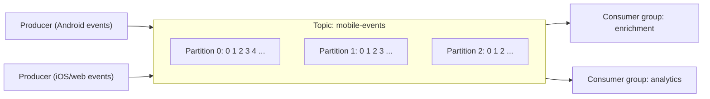
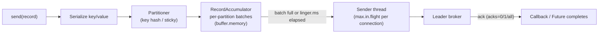
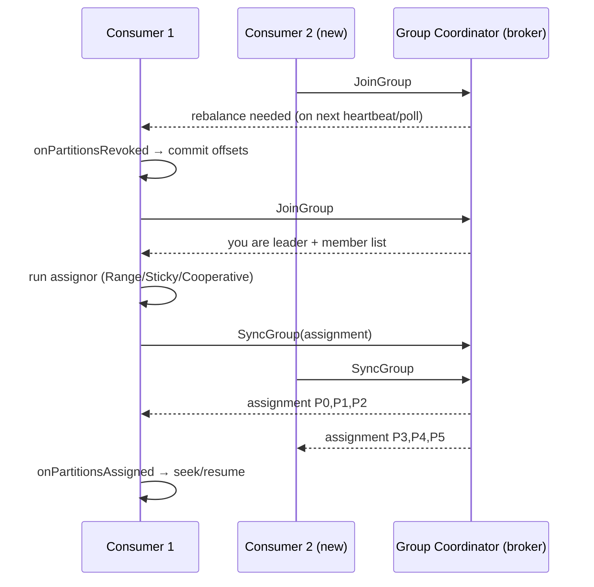
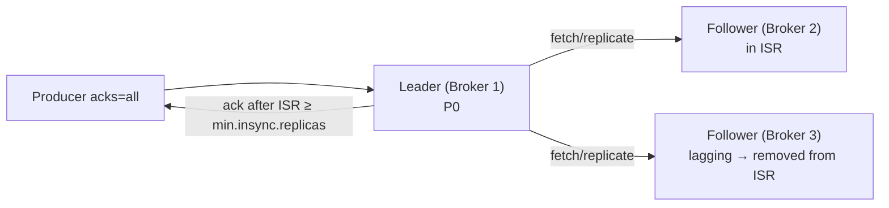
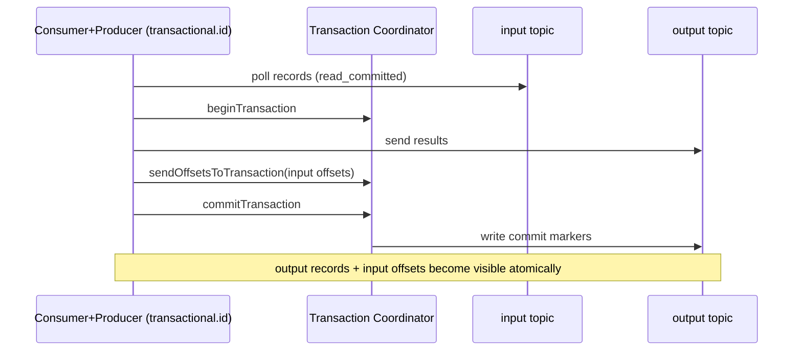
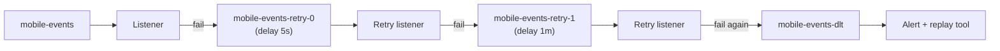

# Apache Kafka: Interview Notes

**Why this matters in interviews:** Kafka is the backbone of event-driven backends, and it's where senior interviews get deep fast. Expect questions like "how do you guarantee no data loss?", "why did the consumer group keep rebalancing?", "how do you keep order and still scale?" and "is exactly-once real?". Interviewers want the internals (partitions, ISR, offsets, rebalancing) tied to production decisions. High-volume event ingestion from Android, iOS and web clients is exactly that story.

> [!NOTE]
> Client-side code targets **Java 8** with `kafka-clients` 3.x and **Spring Kafka 2.9** (Boot 2.7). Java 8 support in the Kafka clients is deprecated since 3.0 and removed in 4.0. Default values are quoted for Kafka **3.x**. Every puzzle below runs without a broker, using the client library's own mocks and partitioner code.

Difficulty legend: 🟢 Basic · 🟡 Intermediate · 🔴 Advanced · ⚡ Scenario

## Table of Contents

1. [Core Concepts](#1-core-concepts)
2. [Producer Internals](#2-producer-internals)
3. [Consumers and Consumer Groups](#3-consumers-and-consumer-groups)
4. [Replication, Durability and Storage](#4-replication-durability-and-storage)
5. [Delivery Semantics, Ordering and Exactly-Once](#5-delivery-semantics-ordering-and-exactly-once)
6. [Spring Kafka](#6-spring-kafka)
7. [Ecosystem: Streams, Connect, Schema Registry](#7-ecosystem-streams-connect-schema-registry)
8. [Coding / Hands-on](#8-coding--hands-on)
9. [Production Scenarios](#9-production-scenarios)
10. [Cheat Sheet](#10-cheat-sheet)
11. [Revision Checklist](#11-revision-checklist)
12. [Beyond Java 8](#12-beyond-java-8)

---

## 1. Core Concepts

> **Mental model:** Kafka is a **commit log**: an append-only notebook that many people read at their own pace, each keeping their own bookmark (the **offset**). The notebook is split into several **partitions** so many writers and readers can work in parallel. Reading doesn't tear pages out; entries stay until the retention policy removes them.



### Q1. 🟢 What is Kafka, and when do you use it?

It's a distributed, partitioned, replicated **commit log** used for event streaming. Use it for high-throughput event ingestion, decoupling producers from consumers, stream processing, CDC pipelines, log and metrics aggregation, and replayable event history.

<details><summary>Cross-questions</summary>

**Q:** Is Kafka a message queue?

**A:** It can act like one (consumer groups share the work), but it's fundamentally a **log**. Messages aren't deleted when consumed, several independent groups can read the same data, and consumers can **replay** by resetting their offsets.
</details>

### Q2. 🟢 What are topics, partitions and offsets?

- **Topic**: a named stream of records (for example `mobile-events`).
- **Partition**: an ordered, append-only log. It's the unit of **parallelism and ordering**.
- **Offset**: a record's sequential position within a partition, unique only per partition.

<details><summary>Cross-questions</summary>

**Q:** Does Kafka guarantee order across a whole topic?

**A:** No, only **within a partition**. Use a single partition for global order, at the cost of all parallelism.
</details>

### Q3. 🟢 What is a broker, a cluster, and the controller?

A **broker** is a Kafka server that stores partitions and serves clients. A **cluster** is a group of brokers. The **controller** manages cluster metadata (partition leaders, ISR changes, broker membership). In ZooKeeper mode, one broker is elected controller. In **KRaft** mode, a Raft quorum of controller nodes manages the metadata.

<details><summary>Cross-questions</summary>

**Q:** What's KRaft, and why did Kafka drop ZooKeeper?

**A:** KRaft moves metadata into an internal Raft-replicated log. That means one system to operate, faster controller failover, and support for far more partitions. It's production-ready since 3.3, and ZooKeeper mode was removed in 4.0.
</details>

### Q4. 🟢 What does a Kafka record contain?

A **key** (optional, which decides the partition), a **value**, **headers** (metadata such as trace ID or schema info), a **timestamp** (create time or log-append time), and after it's written, its **partition and offset**.

<details><summary>Cross-questions</summary>

**Q:** What would you put in headers for mobile events?

**A:** The trace or correlation ID, event type, schema version, and source (ANDROID, IOS or WEB). Routing metadata goes in headers so consumers can filter without deserialising the payload.
</details>

### Q5. 🟢 What is a consumer group?

A set of consumers sharing a `group.id`. Each partition is assigned to **exactly one consumer in the group**, so the group shares the work. Different groups each receive **all** the data independently (publish-subscribe).

<details><summary>Cross-questions</summary>

**Q:** With 6 partitions and 8 consumers in one group, what happens?

**A:** 6 consumers get one partition each, and **2 sit idle**. The partition count caps a group's parallelism.
</details>

### Q6. 🟡 Why is Kafka so fast?

- **Sequential disk IO**: it's append-only, with no random writes.
- **OS page cache**: Kafka relies on it instead of a JVM heap cache.
- **Zero-copy** (`sendfile`): data goes from page cache to socket without passing through user space (for plaintext; TLS needs a copy).
- **Batching and compression**, end to end.
- **Partitioning**, which spreads load across brokers and disks.
- **Simple consumers** that keep their own offsets, so the broker holds little per-consumer state.

<details><summary>Cross-questions</summary>

**Q:** Why does Kafka recommend a modest JVM heap for brokers?

**A:** Most of the caching happens in the **OS page cache**, so a huge heap only adds GC cost and steals memory from the page cache.
</details>

### Q7. 🟡 Kafka vs RabbitMQ vs IBM MQ vs Pub/Sub?

| | Kafka | RabbitMQ | IBM MQ | GCP Pub/Sub |
|---|---|---|---|---|
| Model | Partitioned log | Broker queues/exchanges | Enterprise queues (JMS) | Managed pub/sub |
| Retention/replay | Yes (time/size, compaction) | Consumed = removed (streams aside) | Consumed = removed | Seek/replay within retention |
| Ordering | Per partition | Per queue | Per queue | Per ordering key (opt-in) |
| Throughput | Very high | Moderate | Moderate–high | Very high, autoscaled |
| Ops | You run it (or Confluent/MSK) | You run it | You run it (licensed) | Fully managed |
| Sweet spot | Event streaming, replay, CDC | Task queues, routing | Transactional enterprise integration | Cloud-native async on GCP |

<details><summary>Cross-questions</summary>

**Q:** Why might one company use all three (Kafka, IBM MQ, Pub/Sub)?

**A:** Different systems have different constraints. Legacy enterprise systems speak MQ with transactional guarantees, GCP-native services use Pub/Sub, and high-volume streaming with replay uses Kafka. Ingestion services often bridge between them. File 08 covers MQ and Pub/Sub.
</details>

### Q8. 🟡 How do you choose the number of partitions?

Base it on the **target throughput ÷ per-partition throughput** (measured for both producers and consumers), the maximum consumer parallelism you need, and headroom for growth. More partitions give more parallelism, but also more open files, longer leader elections, and more memory in clients.

<details><summary>Cross-questions</summary>

**Q:** Can you change the partition count later?

**A:** You can **increase** it, but never decrease it. Increasing it **changes the key → partition mapping** for new records, which breaks per-key ordering across the change. Plan capacity up front for keyed topics.
</details>

### Q9. 🟢 What is retention, and what cleanup policies exist?

- `cleanup.policy=delete` (the default) removes whole **segments** older than `retention.ms` (7 days by default) or beyond `retention.bytes`.
- `cleanup.policy=compact` keeps at least the **latest record per key**, which suits changelogs and current state.
- You can combine them: `compact,delete`.

<details><summary>Cross-questions</summary>

**Q:** Why is deletion per segment and not per record?

**A:** Segments are files, and deleting whole files is cheap. A record can outlive its retention until its segment rolls and becomes eligible for deletion.
</details>

### Q10. 🟡 What is log compaction, and what is a tombstone?

A background cleaner rewrites segments and keeps only the latest value for each key. A record with a **null value** is a **tombstone**: it marks the key as deleted, and the tombstone itself is removed after `delete.retention.ms`.

<details><summary>Cross-questions</summary>

**Q:** Where would you use a compacted topic?

**A:** User or device profiles, config state, Kafka Streams changelogs, and outbox or CDC "latest state" topics. Consumers can rebuild the current state by reading from the beginning.
</details>

### Q11. 🟢 What are segments and indexes?

Each partition is stored as **segment files** (`log.segment.bytes`, 1 GB by default) plus an **offset index** and a **time index**, so the broker can find an offset or timestamp quickly. Only the **active** (latest) segment receives writes.

<details><summary>Cross-questions</summary>

**Q:** How does a consumer seek to "records from 2 hours ago"?

**A:** `offsetsForTimes()` uses the time index to find the earliest offset whose timestamp is at or after the given time.
</details>

### Q12. 🟢 What are replication factor, leader and followers?

Each partition has **RF** replicas on different brokers. One is the **leader**, which serves producer writes and, by default, consumer reads. The **followers** replicate from the leader. RF=3 is the production norm.

<details><summary>Cross-questions</summary>

**Q:** Can consumers read from followers?

**A:** Yes, since Kafka 2.4 (KIP-392). Configure `client.rack` and a replica selector on the brokers, so consumers can fetch from the nearest replica and save cross-AZ traffic costs.
</details>

### Q13. 🟢 What is `__consumer_offsets`?

It's an internal **compacted** topic where consumer groups commit their offsets (key = group + topic + partition). A broker acting as **group coordinator** for each group manages membership and commits.

<details><summary>Cross-questions</summary>

**Q:** What happens to committed offsets of a group that's gone idle for a long time?

**A:** They're removed after `offsets.retention.minutes` (7 days by default since 2.0), counted from when the group becomes empty. On restart, the group then falls back to `auto.offset.reset`.
</details>

### Q14. 🟡 What is `auto.offset.reset`?

It decides what a consumer does when there's **no committed offset**, or the committed offset is out of range:

- `latest` (the default) starts from new records only.
- `earliest` starts from the oldest retained record.
- `none` throws an exception.

> [!WARNING]
> A new consumer group with the default `latest` silently **skips everything already in the topic**. For a new pipeline that must process the backlog, set `earliest` on purpose.

<details><summary>Cross-questions</summary>

**Q:** How do you reprocess the last 24 hours for one group?

**A:** Stop the group, then run `kafka-consumer-groups.sh --reset-offsets --to-datetime ... --execute`, or seek programmatically with `offsetsForTimes`. Consumers must be idempotent.
</details>

### Q15. 🟡 How big can a Kafka message be?

The broker's default `message.max.bytes` is about 1 MB. The producer's `max.request.size`, the topic's `max.message.bytes` and the consumer's fetch sizes must all line up. For large payloads (files, reports), store the object in **GCS or S3** and send a **reference** (the claim-check pattern).

<details><summary>Cross-questions</summary>

**Q:** Why not just raise the limits to 50 MB?

**A:** Large messages hurt broker memory, replication latency and consumer batching, and they increase GC pressure. Claim-check is the standard pattern.
</details>

### Q16. 🟡 What are ZooKeeper-mode and KRaft metadata used for?

They track broker membership, the controller, topic and partition configuration, leaders and ISR, and ACLs. Clients never talk to ZooKeeper directly (they haven't needed to since the old consumer was removed). They discover metadata from **brokers** through metadata requests.

<details><summary>Cross-questions</summary>

**Q:** What does `bootstrap.servers` need to list?

**A:** Just a few brokers to get the initial metadata. The client learns the full cluster from them. List more than one for resilience.
</details>

---

## 2. Producer Internals

> **Mental model:** The producer is a *post office sorting room*. `send()` drops each letter into a per-partition **bag** (a batch) in memory. A background **sender thread** ships a bag when it's full (`batch.size`) or when it's waited long enough (`linger.ms`). The broker's receipt (**ack**) comes back asynchronously.



### Q17. 🟢 What happens when you call `producer.send()`?

1. Interceptors run.
2. The key and value are serialised.
3. The partitioner picks a partition.
4. The record is appended to a batch in the **RecordAccumulator**.
5. `send()` returns a `Future` immediately.

The background **sender thread** later groups ready batches per broker, sends them, handles retries, and completes the futures and callbacks.

<details><summary>Cross-questions</summary>

**Q:** When can `send()` block?

**A:** When fetching metadata for a new topic, or when `buffer.memory` (32 MB by default) is full. It blocks up to `max.block.ms` (60 s by default), then throws a `TimeoutException`.
</details>

### Q18. 🟡 How does the default partitioner choose a partition?

- **Key present**: `murmur2(keyBytes)` made positive, modulo the number of partitions, so the **same key always goes to the same partition** (as long as the partition count doesn't change).
- **No key**: the **sticky partitioner** (2.4+) fills a batch for one partition, then switches, which gives better batching than round-robin.
- An explicit partition in the record overrides both.

#### 🎯 Predict the output

```java
import java.nio.charset.StandardCharsets;
import org.apache.kafka.common.utils.Utils;

public class KeyPartition {
    static int partitionFor(String key, int numPartitions) {
        byte[] bytes = key.getBytes(StandardCharsets.UTF_8);
        return Utils.toPositive(Utils.murmur2(bytes)) % numPartitions;   // what the default partitioner does for keyed records
    }
    public static void main(String[] args) {
        int a = partitionFor("device-42", 6);
        int b = partitionFor("device-42", 6);
        int c = partitionFor("device-42", 12);
        System.out.println(a == b);
        System.out.println(a >= 0 && a < 6);
        System.out.println(c >= 0 && c < 12);
    }
}
```

<details><summary>Answer</summary>

`true`, `true`, `true`. The same key and the same partition count always give the same partition, which is the basis of per-key ordering. With 12 partitions the key may land on a **different** partition than with 6, which is why adding partitions breaks key affinity for new records.
</details>

<details><summary>Cross-questions</summary>

**Q:** What's a hot partition, and how do you fix it?

**A:** One key (a big tenant, a bot device) gets most of the traffic, so a single partition, and the single consumer reading it, becomes the bottleneck. Fix it by salting the key (`key + "#" + n`) when strict ordering isn't needed per key, by using a custom partitioner, or by isolating heavy keys to their own topic.
</details>

### Q19. 🟡 What are `acks=0`, `acks=1` and `acks=all`?

| acks | Producer waits for | Data-loss risk |
|---|---|---|
| `0` | Nothing | High (fire-and-forget) |
| `1` | Leader write | Lost if leader dies before followers copy |
| `all` (`-1`) | All **in-sync replicas** | Lowest (with `min.insync.replicas` ≥ 2) |

Since **Kafka 3.0**, the producer defaults are `acks=all` and `enable.idempotence=true`.

<details><summary>Cross-questions</summary>

**Q:** Does `acks=all` alone guarantee no loss?

**A:** No. If the ISR shrinks to just the leader, "all" means only one replica. Pair it with `min.insync.replicas=2` on RF=3, so writes **fail** rather than being accepted with a single copy.
</details>

### Q20. 🟡 What do `batch.size` and `linger.ms` do?

- `batch.size` (16 KB by default) is the maximum bytes per partition batch.
- `linger.ms` (0 by default in 3.x) is how long to wait for more records before sending a batch that isn't full.

Raising `linger.ms` to 5–20 ms and `batch.size` to 64–256 KB, plus **compression**, often multiplies throughput for a small latency cost.

<details><summary>Cross-questions</summary>

**Q:** Why does `linger.ms=0` still batch?

**A:** Records arriving while the sender is busy with previous requests pile up in batches anyway. Under load you get natural batching.
</details>

### Q21. 🟡 Which compression codecs are available, and which should you use?

`gzip` gives a high ratio and costs more CPU. `snappy` is fast with a moderate ratio. `lz4` is very fast and a good default. `zstd` (2.1+) gives a high ratio at good speed. Compression works **per batch**, so batching makes it effective. Brokers keep the producer's compression when the topic's `compression.type=producer`.

<details><summary>Cross-questions</summary>

**Q:** Where does compression help most?

**A:** With JSON events (repetitive field names). Ratios of 3–10× are common, saving network, disk and replication bandwidth.
</details>

### Q22. 🟡 What do `retries`, `delivery.timeout.ms` and `request.timeout.ms` do?

- `retries` is effectively infinite (`Integer.MAX_VALUE`) by default since 2.1.
- `delivery.timeout.ms` (120 s by default) is the **upper bound** on the whole send, including retries. After it, the callback gets an error.
- `request.timeout.ms` (30 s) is the per-request wait for a broker response.
- `retry.backoff.ms` is the pause between retries.

<details><summary>Cross-questions</summary>

**Q:** What must the application do when the callback reports an error after `delivery.timeout.ms`?

**A:** The record was **not** delivered. Log it, fall back (to a local spill, a DLQ or an outbox), or fail the upstream request. Never ignore the callback.
</details>

### Q23. 🔴 How does the idempotent producer work?

The broker assigns the producer a **producer ID (PID)**, and each record batch carries a **sequence number** per partition. The broker rejects duplicates (retries of batches it already wrote) and detects gaps. This makes retries **safe and ordered** within a partition, for up to 5 in-flight requests per connection.

<details><summary>Cross-questions</summary>

**Q:** Does idempotence dedupe duplicates that my application sends twice?

**A:** No. It only dedupes **internal retries within one producer session**. If your code calls `send()` twice, or the process restarts and resends, those are new records. Use consumer-side idempotency (event IDs).

**Q:** Why was `max.in.flight.requests.per.connection=1` the old advice for ordering?

**A:** Without idempotence, a failed batch retried after a later batch succeeded would reorder records. With idempotence, ordering is preserved for up to 5 in-flight requests.
</details>

### Q24. 🟡 Sync vs async send?

- `send(record).get()` is **synchronous**: simple and safe, but slow, because each call waits a full round trip.
- `send(record, callback)` is **asynchronous**: high throughput, and the errors are handled in the callback.
- For batch loads, send asynchronously and then `flush()` (or wait on all the futures) at checkpoints.

```java
import java.util.Properties;
import org.apache.kafka.clients.producer.KafkaProducer;
import org.apache.kafka.clients.producer.ProducerConfig;
import org.apache.kafka.clients.producer.ProducerRecord;
import org.apache.kafka.common.serialization.StringSerializer;

public class ReliableProducer {
    public static KafkaProducer<String, String> create(String bootstrap) {
        Properties p = new Properties();
        p.put(ProducerConfig.BOOTSTRAP_SERVERS_CONFIG, bootstrap);
        p.put(ProducerConfig.KEY_SERIALIZER_CLASS_CONFIG, StringSerializer.class.getName());
        p.put(ProducerConfig.VALUE_SERIALIZER_CLASS_CONFIG, StringSerializer.class.getName());
        p.put(ProducerConfig.ACKS_CONFIG, "all");
        p.put(ProducerConfig.ENABLE_IDEMPOTENCE_CONFIG, "true");
        p.put(ProducerConfig.LINGER_MS_CONFIG, "10");
        p.put(ProducerConfig.BATCH_SIZE_CONFIG, String.valueOf(128 * 1024));
        p.put(ProducerConfig.COMPRESSION_TYPE_CONFIG, "lz4");
        p.put(ProducerConfig.DELIVERY_TIMEOUT_MS_CONFIG, "120000");
        return new KafkaProducer<String, String>(p);
    }

    public static void publish(KafkaProducer<String, String> producer, String deviceId, String json) {
        producer.send(new ProducerRecord<String, String>("mobile-events", deviceId, json), (meta, ex) -> {
            if (ex != null) {
                // not delivered after retries: spill/DLQ/alert, never ignore
                System.err.println("send failed for key " + deviceId + ": " + ex);
            }
        });
    }
}
```

<details><summary>Cross-questions</summary>

**Q:** Which thread runs the callback, and what's the rule?

**A:** The producer's single **I/O (sender) thread**. Keep callbacks tiny and never block in them, or every send stalls.
</details>

### Q25. 🟡 Is `KafkaProducer` thread-safe?

Yes. **Share one producer per application** (per configuration). It batches across threads efficiently. Creating a producer per request is a classic anti-pattern: every instance opens connections and allocates its own buffer.

<details><summary>Cross-questions</summary>

**Q:** Is `KafkaConsumer` thread-safe?

**A:** No. Use one consumer per thread. Section 3 covers this.
</details>

### Q26. 🟡 What does `buffer.memory` protect against, and what happens when it's full?

It caps the memory used for unsent batches (32 MB by default). When the brokers are slow or unreachable, the buffer fills up and `send()` **blocks** up to `max.block.ms`, then throws. That's backpressure reaching your application threads.

<details><summary>Cross-questions</summary>

**Q:** How should an ingestion API react?

**A:** Fail fast (503 with `Retry-After`) rather than blocking request threads for 60 s. Lower `max.block.ms` on request paths.
</details>

### Q27. 🟡 How do serialisers work, and which formats do people use?

The producer turns the key and value into bytes with a `Serializer` (String, JSON, **Avro**, Protobuf). Schema-based formats with a **schema registry** give compact messages and enforced compatibility, and consumers use the matching `Deserializer`.

<details><summary>Cross-questions</summary>

**Q:** How does the Confluent Avro serialiser tag a message with its schema?

**A:** It writes a magic byte plus a **4-byte schema ID**, followed by the Avro binary. The consumer fetches and caches the schema by ID.
</details>

### Q28. 🟡 What are producer interceptors used for?

`ProducerInterceptor.onSend` and `onAcknowledgement` add headers (trace ID), metrics, or auditing without touching application code. Keep them fast and exception-safe.

<details><summary>Cross-questions</summary>

**Q:** Where does Sleuth or OpenTelemetry instrumentation hook in?

**A:** It wraps the producer and consumer (or uses interceptors) to inject and extract trace context through record headers.
</details>

### Q29. 🟡 How do you preserve ordering for a key while scaling producers?

Use the **same key** for the entity (device ID, user ID), so all its events land in one partition, keep idempotence enabled, and never override the partition. Different producer instances writing the same key still land on the same partition, but order *across producers* is only as good as the order in which they send.

<details><summary>Cross-questions</summary>

**Q:** Two app instances both publish events for device-42. Is their relative order guaranteed?

**A:** No. Kafka orders records by arrival at the partition. If ordering matters across instances, route one device's traffic through a single producer, or carry a sequence number or timestamp so consumers can reorder or ignore stale events.
</details>

### Q30. 🟡 How do you publish a batch of 200K records efficiently?

Use one shared producer and async sends with callbacks, a larger `linger.ms` and `batch.size`, and compression. Keep a bounded number of in-flight records (a semaphore), and call `flush()` at the end (or per chunk), checking for callback errors. Parallel producer threads help up to the point where the network or broker saturates.

<details><summary>Cross-questions</summary>

**Q:** How do you know every record was delivered?

**A:** Count successful callbacks against the records sent, collect failures, and fail or retry the chunk if any are missing, with idempotent keys on the consumer side.
</details>

### Q31. 🟡 What is the difference between the record timestamp types?

`CreateTime` (the default) is set by the producer, and it's used for event-time processing. `LogAppendTime` (a topic config) is set by the broker at write time. Choose it based on whether you trust client clocks: mobile device clocks are often wrong.

<details><summary>Cross-questions</summary>

**Q:** Which timestamp would you use for "events per hour" analytics from mobile clients?

**A:** Keep **both**: the device event time inside the payload for the business meaning, and the server receive time for SLAs and late-arrival handling.
</details>

### Q32. 🟡 How do you handle "topic doesn't exist" on the producer?

The broker setting `auto.create.topics.enable` (true by default) creates topics with the default settings on first use, which usually gives the wrong partition count and RF. In production, **disable** auto-creation and create topics explicitly (IaC or `AdminClient`) with reviewed configs.

<details><summary>Cross-questions</summary>

**Q:** Which topic configs do you always set?

**A:** Partitions, RF=3, `min.insync.replicas=2`, retention, cleanup policy and max message size.
</details>

### Q33. 🔴 What does a transactional producer do?

With a `transactional.id`, a producer can write to **several partitions and topics atomically**, and include consumer offsets (`sendOffsetsToTransaction`) in the same transaction. Consumers with `isolation.level=read_committed` see only committed data. **Zombie fencing**: a new producer with the same `transactional.id` bumps an epoch, and the old instance gets fenced.

<details><summary>Cross-questions</summary>

**Q:** What's the cost?

**A:** Extra round trips to the transaction coordinator, transaction markers in the log, and `read_committed` consumers waiting for open transactions (the last stable offset). Throughput drops somewhat, and latency rises with the commit interval.
</details>

### Q34. 🟡 What are the common producer misconfigurations?

- `acks=1` or `0` for critical data.
- No callback error handling.
- One producer per request.
- `linger.ms=0` with tiny batches at high volume.
- Huge messages instead of claim-check.
- Auto-created topics.
- `max.block.ms` too long on request paths.

<details><summary>Cross-questions</summary>

**Q:** Which of these causes silent data loss?

**A:** Ignoring callbacks (or fire-and-forget with `acks=0`), combined with `acks=1` during a leader failover.
</details>

---
## 3. Consumers and Consumer Groups

> **Mental model:** A consumer group is a *team of readers sharing a set of notebooks*. Each notebook (partition) goes to exactly one reader, and each reader bookmarks their page (the committed offset). When someone joins or leaves, the team **reshuffles notebooks** (a rebalance), and everyone stops reading while that happens, unless they use the cooperative protocol.

### Q35. 🟢 How does the consumer poll loop work?

```java
import java.time.Duration;
import java.util.Collections;
import java.util.Properties;
import org.apache.kafka.clients.consumer.ConsumerConfig;
import org.apache.kafka.clients.consumer.ConsumerRecord;
import org.apache.kafka.clients.consumer.ConsumerRecords;
import org.apache.kafka.clients.consumer.KafkaConsumer;
import org.apache.kafka.common.errors.WakeupException;
import org.apache.kafka.common.serialization.StringDeserializer;

public class PollLoop {
    public static void main(String[] args) {
        Properties p = new Properties();
        p.put(ConsumerConfig.BOOTSTRAP_SERVERS_CONFIG, "localhost:9092");
        p.put(ConsumerConfig.GROUP_ID_CONFIG, "enrichment");
        p.put(ConsumerConfig.KEY_DESERIALIZER_CLASS_CONFIG, StringDeserializer.class.getName());
        p.put(ConsumerConfig.VALUE_DESERIALIZER_CLASS_CONFIG, StringDeserializer.class.getName());
        p.put(ConsumerConfig.ENABLE_AUTO_COMMIT_CONFIG, "false");
        p.put(ConsumerConfig.AUTO_OFFSET_RESET_CONFIG, "earliest");
        p.put(ConsumerConfig.MAX_POLL_RECORDS_CONFIG, "200");

        final KafkaConsumer<String, String> consumer = new KafkaConsumer<String, String>(p);
        Runtime.getRuntime().addShutdownHook(new Thread(consumer::wakeup));   // clean exit
        try {
            consumer.subscribe(Collections.singletonList("mobile-events"));
            while (true) {
                ConsumerRecords<String, String> records = consumer.poll(Duration.ofMillis(500));
                for (ConsumerRecord<String, String> r : records) {
                    process(r);                                   // must be idempotent
                }
                if (!records.isEmpty()) consumer.commitSync();    // at-least-once
            }
        } catch (WakeupException e) {
            // shutdown signal
        } finally {
            consumer.close();
        }
    }
    static void process(ConsumerRecord<String, String> r) { }
}
```

<details><summary>Cross-questions</summary>

**Q:** Why commit **after** processing?

**A:** It gives **at-least-once** delivery. A crash before the commit means the records are redelivered and processed again (hence idempotency). Committing before processing gives at-most-once: a crash loses them.

**Q:** Why is `consumer.wakeup()` the only safe cross-thread call?

**A:** `KafkaConsumer` isn't thread-safe. `wakeup()` is designed to be called from another thread, and it makes the blocked `poll()` throw `WakeupException`.
</details>

### Q36. 🟡 What does a committed offset mean exactly?

The committed offset is the **next offset to read**, not the last offset processed. After processing offset 41, you commit **42**.

#### 🎯 Predict the output

```java
import java.time.Duration;
import java.util.Collections;
import java.util.HashMap;
import java.util.Map;
import org.apache.kafka.clients.consumer.ConsumerRecord;
import org.apache.kafka.clients.consumer.ConsumerRecords;
import org.apache.kafka.clients.consumer.MockConsumer;
import org.apache.kafka.clients.consumer.OffsetResetStrategy;
import org.apache.kafka.common.TopicPartition;

public class CommittedOffset {
    public static void main(String[] args) {
        MockConsumer<String, String> c = new MockConsumer<String, String>(OffsetResetStrategy.EARLIEST);
        TopicPartition tp = new TopicPartition("mobile-events", 0);
        c.assign(Collections.singletonList(tp));
        Map<TopicPartition, Long> begin = new HashMap<TopicPartition, Long>();
        begin.put(tp, 0L);
        c.updateBeginningOffsets(begin);
        for (long off = 0; off < 5; off++) {
            c.addRecord(new ConsumerRecord<String, String>("mobile-events", 0, off, "device-1", "e" + off));
        }
        ConsumerRecords<String, String> recs = c.poll(Duration.ofMillis(100));
        long last = -1;
        for (ConsumerRecord<String, String> r : recs) last = r.offset();
        c.commitSync();
        System.out.println("processed up to " + last);
        System.out.println("position " + c.position(tp));
        System.out.println("committed " + c.committed(Collections.singleton(tp)).get(tp).offset());
    }
}
```

<details><summary>Answer</summary>

```text
processed up to 4
position 5
committed 5
```

The position and the committed offset are the **next** offset to consume. A restarted consumer resumes at 5, so offsets 0–4 aren't re-read.
</details>

<details><summary>Cross-questions</summary>

**Q:** What's the classic bug when committing offsets manually per record?

**A:** Committing `record.offset()` instead of `record.offset() + 1`, which makes the last record be re-read after every restart.
</details>

### Q37. 🟡 Auto commit vs manual commit?

`enable.auto.commit=true` (the default) commits the offsets returned by previous polls every `auto.commit.interval.ms` (5 s), **during `poll()`**. It's simple, but if processing happens asynchronously on other threads, offsets can be committed before the work finishes, and a crash **loses** those records. Manual `commitSync` or `commitAsync` after processing gives you precise control.

<details><summary>Cross-questions</summary>

**Q:** Is auto commit ever safe?

**A:** Yes, when processing is **synchronous inside the poll loop**. Offsets are then only committed for records returned before the current poll, which were already processed. The risk is duplicates after a crash, not loss.
</details>

### Q38. 🟡 `commitSync` vs `commitAsync`?

`commitSync` blocks and retries until it succeeds or hits an unrecoverable error. `commitAsync` doesn't block and **doesn't retry** (a retry could commit an older offset after a newer one). The common pattern is `commitAsync` in the loop and `commitSync` in `finally` on shutdown and in the rebalance callback.

<details><summary>Cross-questions</summary>

**Q:** Why doesn't `commitAsync` retry?

**A:** Ordering. A retried commit of offset 100 could land after a successful commit of 200 and rewind the group.
</details>

### Q39. 🔴 What happens during a consumer group rebalance?



A rebalance is triggered by a consumer joining or leaving, a consumer missing `session.timeout.ms` (heartbeats), a consumer exceeding `max.poll.interval.ms`, or a change in the partitions or subscription.

<details><summary>Cross-questions</summary>

**Q:** Who calculates the assignment, the broker or the client?

**A:** In the classic protocol, the **group leader consumer** runs the assignor, and the coordinator distributes the result. (KIP-848's new protocol moves assignment to the broker. It's generally available in Kafka 4.0.)
</details>

### Q40. 🔴 Eager vs cooperative rebalancing?

| | Eager (Range/RoundRobin/Sticky) | Cooperative (CooperativeStickyAssignor) |
|---|---|---|
| On rebalance | **All** consumers revoke **all** partitions (stop-the-world) | Only partitions that must move are revoked |
| Rounds | One | Two (revoke, then assign) |
| Impact | Whole group pauses | Minimal disruption |

The default in 3.x is `[RangeAssignor, CooperativeStickyAssignor]`, which allows a rolling upgrade to cooperative.

<details><summary>Cross-questions</summary>

**Q:** How do you switch a running group to cooperative?

**A:** Do a rolling bounce with both assignors listed (cooperative included), then a second rolling bounce with **only** `CooperativeStickyAssignor`.
</details>

### Q41. 🟡 What do `session.timeout.ms`, `heartbeat.interval.ms` and `max.poll.interval.ms` do?

| Setting | Default (3.x) | Detects |
|---|---|---|
| `session.timeout.ms` | 45 s (was 10 s before 3.0) | **Dead process** (heartbeats from background thread stop) |
| `heartbeat.interval.ms` | 3 s | Heartbeat frequency (≈ ⅓ session timeout) |
| `max.poll.interval.ms` | 5 min | **Stuck/slow processing** (no `poll()` in time) |

<details><summary>Cross-questions</summary>

**Q:** A consumer is alive but processing one batch takes 7 minutes. What happens?

**A:** It exceeds `max.poll.interval.ms`, so it leaves the group and a rebalance follows. Its later commit fails with `CommitFailedException`, and another consumer re-processes the batch. **Fix:** lower `max.poll.records`, speed up processing, or raise the interval deliberately.
</details>

### Q42. 🟡 What is static group membership?

Set `group.instance.id` to a stable ID per consumer (for example, the pod name in a StatefulSet). A restart within `session.timeout.ms` then **doesn't trigger a rebalance**: the member rejoins with the same assignment. It's great for rolling deploys.

<details><summary>Cross-questions</summary>

**Q:** What's the trade-off?

**A:** If an instance really dies, its partitions aren't reassigned until the session timeout expires, so there's a longer pause for those partitions.
</details>

### Q43. 🟡 How do you use `ConsumerRebalanceListener` correctly?

In `onPartitionsRevoked`, **finish or commit the in-flight work** for those partitions (`commitSync`). In `onPartitionsAssigned`, initialise state, or `seek` to offsets stored externally (for example, offsets kept in a DB alongside the results for exactly-once).

<details><summary>Cross-questions</summary>

**Q:** With cooperative rebalancing, what's different?

**A:** `onPartitionsRevoked` is called only for the partitions actually being taken away, and `onPartitionsLost` handles partitions lost without a clean revoke (when you can't commit).
</details>

### Q44. 🟡 How do you consume with multiple threads?

| Model | How | Pros | Cons |
|---|---|---|---|
| **Consumer per thread** | N consumers in group, each own thread | Simple, ordering per partition | Parallelism ≤ partitions |
| **Poll thread + worker pool** | One consumer hands records to executor | Parallelism > partitions | Offset tracking, ordering, rebalance handling are hard |
| **Key-ordered parallelism** | Workers per key within partition (e.g., Confluent Parallel Consumer) | Order per key + high parallelism | Library/complexity |

<details><summary>Cross-questions</summary>

**Q:** What is the main pitfall of a worker pool?

**A:** Committing offsets for records that are still in flight (they're lost on crash or rebalance), and processing records of the same key out of order. The concurrency file (Q114) covers it.
</details>

### Q45. 🟡 `subscribe` vs `assign`?

`subscribe(topics)` uses **group management**: the coordinator assigns partitions and rebalances automatically. `assign(partitions)` means **manual assignment**, with no group coordination or rebalances. It's used for replay tools, or when an external system decides the partition ownership.

<details><summary>Cross-questions</summary>

**Q:** Can you commit offsets with `assign`?

**A:** Yes, if `group.id` is set. They're stored for that group, but there's no membership. Don't mix `assign` and `subscribe` in the same group.
</details>

### Q46. 🟡 What is consumer lag, and how do you monitor it?

**Lag = log end offset − committed offset**, per partition. Monitor it with `kafka-consumer-groups.sh --describe`, Burrow, the Kafka exporter for Prometheus, or cloud metrics. Alert on **lag growth and time lag** (the age of the oldest unprocessed record), not on an absolute number.

#### 🎯 Predict the output

```java
import java.util.LinkedHashMap;
import java.util.Map;

public class LagCalc {
    public static void main(String[] args) {
        Map<Integer, long[]> parts = new LinkedHashMap<Integer, long[]>();   // partition → {logEnd, committed}
        parts.put(0, new long[]{1_000, 1_000});
        parts.put(1, new long[]{5_400, 2_100});
        parts.put(2, new long[]{900, 880});
        long total = 0; int worst = -1; long worstLag = -1;
        for (Map.Entry<Integer, long[]> e : parts.entrySet()) {
            long lag = e.getValue()[0] - e.getValue()[1];
            total += lag;
            if (lag > worstLag) { worstLag = lag; worst = e.getKey(); }
        }
        System.out.println("total=" + total + " worst=p" + worst + " (" + worstLag + ")");
    }
}
```

<details><summary>Answer</summary>

`total=3320 worst=p1 (3300)`. Nearly all the lag is on **one partition**, which points to a hot key or a stuck consumer rather than under-provisioning overall.
</details>

<details><summary>Cross-questions</summary>

**Q:** Why can total lag look fine while users complain?

**A:** One partition can be stuck (a poison message, a hot key) while the others are at zero. Look per partition, and at time lag.
</details>

### Q47. 🟡 What do `fetch.min.bytes`, `fetch.max.wait.ms` and `max.poll.records` do?

`fetch.min.bytes` (1) and `fetch.max.wait.ms` (500 ms) make the broker wait for more data before answering, which trades a little latency for bigger batches. `max.poll.records` (500) caps how many records one `poll()` returns, which controls the processing time per poll.

<details><summary>Cross-questions</summary>

**Q:** Which one do you lower when processing is slow and you hit `max.poll.interval.ms`?

**A:** `max.poll.records`.
</details>

### Q48. 🟡 How do `pause()` and `resume()` help?

`pause(partitions)` stops fetching from those partitions while you keep calling `poll()`, so the consumer stays in the group. Use it for **backpressure** (downstream is slow, the internal queue is full) without triggering a rebalance.

<details><summary>Cross-questions</summary>

**Q:** Why not just sleep instead of polling?

**A:** Sleeping longer than `max.poll.interval.ms` gets the consumer kicked out of the group.
</details>

### Q49. 🟡 How do you seek or replay?

Use `seek(tp, offset)`, `seekToBeginning` and `seekToEnd`, or `offsetsForTimes` for timestamp-based replay, or the CLI `--reset-offsets` while the group is **inactive**. Replays need idempotent consumers and sometimes a separate group ID to avoid disturbing production.

<details><summary>Cross-questions</summary>

**Q:** How do you reprocess without affecting the live group?

**A:** Start a new group ID (for example `enrichment-replay-2024xx`), with `earliest` or a seek, writing to a separate sink or an idempotent one.
</details>

### Q50. 🟡 How do you handle deserialisation errors (a poison pill at the byte level)?

A bad payload that fails deserialisation throws inside `poll()`, and the consumer is stuck on that offset forever. **Fix:** use Spring Kafka's `ErrorHandlingDeserializer` (it wraps the failure so the error handler can send the record to a DLT), or deserialise raw bytes yourself and handle the failure per record.

<details><summary>Cross-questions</summary>

**Q:** Why is this worse than a processing error?

**A:** The failure happens before your code sees the record, so a normal try/catch in the listener never gets a chance.
</details>

### Q51. 🟡 What does `isolation.level` do?

`read_uncommitted` (the default) returns everything, including records from aborted or open transactions. `read_committed` returns only committed transactional records, and it stops at the **last stable offset** while transactions are open.

<details><summary>Cross-questions</summary>

**Q:** When must you use `read_committed`?

**A:** When consuming the output of transactional producers (Kafka Streams with EOS, or read-process-write apps), so you don't see aborted data.
</details>

### Q52. 🟡 How do consumers scale on Kubernetes?

Run a Deployment with N replicas (N ≤ partitions), and scale on **lag** (KEDA's Kafka scaler). Use static membership or cooperative rebalancing to reduce rebalance cost during scaling and deploys. Set a PodDisruptionBudget so node drains don't evict too many pods at once.

<details><summary>Cross-questions</summary>

**Q:** Why can aggressive autoscaling make lag worse?

**A:** Each scale event causes a rebalance, which pauses consumption. Frequent scaling means frequent pauses. Add stabilisation windows.
</details>

### Q53. 🟡 What does `client.id` do, and why set it?

It labels the client in broker logs, metrics and quotas. Set a meaningful value (`ingest-producer-${pod}`) so you can find noisy clients and apply per-client quotas.

<details><summary>Cross-questions</summary>

**Q:** What are Kafka quotas?

**A:** Broker-enforced byte-rate and request-rate limits per user or client ID. They protect the cluster from a runaway producer or consumer.
</details>

### Q54. 🟡 Can two consumer groups get different subsets of the same topic?

Not directly. Every group gets **all** partitions, and filtering happens in the consumer. To split the data, produce to separate topics (routing at produce time, or a stream processor that splits the topic), or filter on headers, which is cheap.

<details><summary>Cross-questions</summary>

**Q:** Why do headers help filtering?

**A:** Consumers can skip a record by looking at a header without deserialising the payload.
</details>

---

## 4. Replication, Durability and Storage

> **Mental model:** Each partition has one **leader** (the original document) and several **followers** (photocopies kept in other buildings). The **ISR** is the list of photocopies that are *up to date*. A write only counts as safe once enough up-to-date copies exist (`acks=all` + `min.insync.replicas`). If the original's building burns down, an up-to-date copy becomes the new original.



### Q55. 🟡 What is the ISR?

The **In-Sync Replicas**: the leader plus the followers that have caught up to the leader within `replica.lag.time.max.ms` (30 s by default in 3.x). With `acks=all`, the leader waits for **all ISR members**. A lagging follower is removed from the ISR, and it's added back once it catches up.

<details><summary>Cross-questions</summary>

**Q:** Why does the ISR shrink during broker trouble?

**A:** Slow disks, GC pauses, network issues or overload stop followers from fetching in time. Alert on `UnderReplicatedPartitions` and ISR shrink rates.
</details>

### Q56. 🔴 Walk through the `min.insync.replicas` semantics.

With RF=3, `min.insync.replicas=2` and `acks=all`:

| ISR size | Produce result |
|---|---|
| 3 | Success after 3 copies |
| 2 | Success after 2 copies (still durable to 1 broker loss) |
| 1 | **Fails** with `NotEnoughReplicasException` — availability sacrificed for durability |

<details><summary>Cross-questions</summary>

**Q:** Why not `min.insync.replicas=3` with RF=3?

**A:** Then any single broker restart makes every such partition unwritable. RF=3 with min ISR 2 is the standard balance.
</details>

### Q57. 🟡 What are the high watermark and the log end offset?

The **LEO** is the next offset the leader will write. The **high watermark (HW)** is the highest offset replicated to all ISR members. Consumers can only read up to the HW, so they never see data that could vanish after a leader failover.

<details><summary>Cross-questions</summary>

**Q:** How does that protect consumers?

**A:** Records above the HW could be truncated if the leader fails before replicating them. Hiding them prevents "phantom reads".
</details>

### Q58. 🟡 What is unclean leader election?

When every ISR replica is down, Kafka can either wait (the partition stays **unavailable**) or elect an **out-of-sync** replica, which **loses** the records it missed. `unclean.leader.election.enable` is **false** by default: consistency over availability.

<details><summary>Cross-questions</summary>

**Q:** When would someone enable it?

**A:** For low-value data where availability matters more than completeness (for example, some metrics). Never for business events.
</details>

### Q59. 🟡 How does leader failover work?

The controller detects the broker failure (a missed session or heartbeat). It picks a new leader for each affected partition **from the ISR**, updates the metadata, and clients refresh their metadata and retry. It usually takes seconds, and idempotent producers retry safely.

<details><summary>Cross-questions</summary>

**Q:** What's preferred leader election?

**A:** After the broker returns, leadership moves back to the "preferred" replica (the first in the assignment) so load stays balanced (`auto.leader.rebalance.enable`).
</details>

### Q60. 🟡 How do you make a cluster rack- or zone-aware?

Set `broker.rack` per availability zone. Kafka then spreads a partition's replicas across racks, so losing one AZ keeps a copy. Combine it with follower fetching (`client.rack`) to cut cross-AZ traffic costs.

<details><summary>Cross-questions</summary>

**Q:** RF=3 across 3 AZs: what survives?

**A:** The loss of a whole AZ, with min ISR 2 still satisfied.
</details>

### Q61. 🟡 Does Kafka fsync every message?

By default, **no**. It relies on **replication** for durability and lets the OS flush the page cache (`log.flush.*` settings are left at their defaults). Losing the data needs every in-sync replica to fail before it's flushed, which is why RF and the ISR matter more than fsync.

<details><summary>Cross-questions</summary>

**Q:** Is there a scenario where this matters?

**A:** A correlated power loss of all the replica brokers at once, for example all in one rack or AZ. Rack awareness is the defence.
</details>

### Q62. 🟡 What is tiered storage?

It offloads older segments to object storage (S3 or GCS) while recent data stays on local disk. You get much longer retention cheaply. It's in early access in 3.6, and generally available later in 3.x.

<details><summary>Cross-questions</summary>

**Q:** Why does it matter for replay?

**A:** You can keep months of events replayable without buying huge broker disks.
</details>

### Q63. 🟡 How do you monitor broker health?

Watch these key metrics:

- `UnderReplicatedPartitions` (should be 0) and `OfflinePartitionsCount` (0).
- `ActiveControllerCount` (exactly 1 in the cluster).
- Request latency (produce and fetch p99).
- Network and request handler idle ratios.
- ISR shrinks and expands.
- Disk usage.
- Consumer lag.

<details><summary>Cross-questions</summary>

**Q:** Which single metric most often signals trouble first?

**A:** Under-replicated partitions. A broker is struggling or down.
</details>

### Q64. 🟡 How do you reassign partitions or add brokers?

New brokers get no existing partitions automatically. Use `kafka-reassign-partitions.sh` (or Cruise Control) to move replicas, with **throttling** so the replication traffic doesn't starve production traffic.

<details><summary>Cross-questions</summary>

**Q:** Why throttle?

**A:** Copying terabytes at full speed saturates disks and the network, and client latency spikes.
</details>

### Q65. 🟡 What happens when a broker's disk fills up?

The broker takes the affected log directory offline, and its partitions go under-replicated or offline. Prevent it with retention by bytes and time, disk alerts, capacity planning, and tiered storage.

<details><summary>Cross-questions</summary>

**Q:** What's the fastest emergency action?

**A:** Temporarily lower retention on the largest topics, then add capacity or reassign partitions. Communicate the data-loss implications first.
</details>

### Q66. 🟡 How does Kafka handle consumer reads of old data vs new data?

New data is usually served from the **page cache**, which is fast. Old data (a replay) comes from **disk**, which can evict hot pages and slow down real-time consumers on the same broker. Plan replays off-peak, throttle them, or serve them from tiered storage.

<details><summary>Cross-questions</summary>

**Q:** Why can a big backfill job hurt real-time latency?

**A:** Page-cache pollution and extra disk IO on the same brokers.
</details>

### Q67. 🟡 What security features does Kafka have?

- **TLS** for encryption in transit.
- **SASL** authentication (SCRAM, OAUTHBEARER, GSSAPI/Kerberos) or mTLS.
- **ACLs** per principal for topic, group and cluster operations.
- Quotas.
- Encryption at rest is done at the disk or cloud level.

<details><summary>Cross-questions</summary>

**Q:** What minimum ACLs does a consumer need?

**A:** `READ` on the topic and `READ` on the consumer group.
</details>

### Q68. 🟡 How do you run Kafka on a cloud?

The options are self-managed on VMs or Kubernetes (the Strimzi operator), **Confluent Cloud**, **Amazon MSK**, or Google's Managed Service for Apache Kafka. Managed offerings take on broker ops, upgrades and scaling. You still own topic design, client configuration and consumer behaviour.

<details><summary>Cross-questions</summary>

**Q:** If you're already on GCP, why not use Pub/Sub for everything?

**A:** Kafka gives partition ordering semantics, compacted topics, replay by offset, Kafka Streams and Connect ecosystems, and portability. Pub/Sub gives zero ops and global autoscaling. The choice depends on the workload (see file 08).
</details>

### Q69. 🟡 What is `replica.lag.time.max.ms`?

It's the maximum time a follower can go without catching up to the leader's LEO before it's dropped from the ISR (30 s in 3.x). Too low means ISR flapping. Too high means slow detection of dead followers, and `acks=all` waiting on them longer.

<details><summary>Cross-questions</summary>

**Q:** How does this interact with `acks=all` latency?

**A:** Produce latency is bounded by the slowest ISR follower. A struggling follower slows producers until it's kicked out of the ISR.
</details>

### Q70. 🟡 Why must RF be ≤ the number of brokers, and why is RF=2 risky?

Each replica needs its own broker. RF=2 with min ISR 2 blocks writes during **any** broker restart, and RF=2 with min ISR 1 risks loss during failover. RF=3 with min ISR 2 is the standard.

<details><summary>Cross-questions</summary>

**Q:** How many brokers do you need for RF=3 to survive maintenance plus a failure?

**A:** At least 3 for RF=3. More brokers (4 or more) give headroom, so a rolling restart plus one failure doesn't block writes on every partition.
</details>

---
## 5. Delivery Semantics, Ordering and Exactly-Once

> **Mental model:** Delivery guarantees are *registered mail options*. **At-most-once** is dropping the letter in the box with no receipt, so it may get lost. **At-least-once** means resending until you get a receipt, so the recipient may get two copies. **Exactly-once** needs the sender and recipient to share one ledger, which Kafka only provides *inside Kafka*.

### Q71. 🟢 What are the three delivery semantics?

| Semantics | How (consumer side) | Risk |
|---|---|---|
| At-most-once | Commit **before** processing | Loss on crash |
| **At-least-once** | Commit **after** processing | Duplicates on crash/rebalance → idempotency |
| Exactly-once | Transactions (Kafka→Kafka) or atomic offset+result storage | Complexity/throughput |

<details><summary>Cross-questions</summary>

**Q:** Which is the practical default?

**A:** At-least-once plus **idempotent consumers**. It's simple, robust, and correct for most business pipelines.
</details>

### Q72. 🔴 Is exactly-once real in Kafka?

**Within Kafka**, yes: an idempotent producer plus transactions plus `read_committed` consumers make a **read-process-write** cycle atomic (consumed offsets and produced records commit together). Kafka Streams enables this with `processing.guarantee=exactly_once_v2`.

With **external side effects** (DB writes, emails, HTTP calls), Kafka can't make them exactly-once. You need idempotent writes, or you store the offsets **in the same DB transaction** as the results.



<details><summary>Cross-questions</summary>

**Q:** How do you get effectively-once into PostgreSQL?

**A:** In one DB transaction, write the results **and** the consumed offsets (per partition) to a table. On startup or assignment, `seek` to the stored offsets and don't commit offsets to Kafka at all. Or use idempotent upserts keyed by event ID.
</details>

### Q73. 🟡 Where do duplicates come from in an at-least-once pipeline?

- Producer retries without idempotence, or application-level resends.
- A consumer crash after processing but before the commit.
- A **rebalance** in the middle of a batch, after `max.poll.interval.ms` was exceeded.
- Offset resets and replays.
- Upstream clients (mobile) retrying their HTTP calls.

<details><summary>Cross-questions</summary>

**Q:** Where do you dedupe mobile events?

**A:** With a client-generated `eventId` (a UUID per event) enforced by a unique key or upsert at the sink, plus an optional short-TTL Redis check for hot duplicates.
</details>

### Q74. 🟡 How do you keep ordering *and* scale?

Key by the entity whose order matters (device ID, user ID, order ID). Partitions give parallelism **across** keys, and order is preserved **within** a key. Consumers process one partition sequentially, or parallelise by key inside the partition.

<details><summary>Cross-questions</summary>

**Q:** What breaks ordering in consumers?

**A:** Retrying a failed record **later** (a retry topic) while newer records for the same key go ahead. Non-blocking retries trade ordering for throughput, so choose per use case.
</details>

### Q75. 🟡 Blocking vs non-blocking retries in consumers?

- **Blocking** (retry in place, with backoff): keeps the order, but it stalls the whole partition, and long backoffs risk `max.poll.interval.ms`.
- **Non-blocking** (retry topics: `topic-retry-5s`, `topic-retry-1m`, then the DLT): the main partition keeps flowing, but **ordering per key is lost** for the retried records.



<details><summary>Cross-questions</summary>

**Q:** Which errors deserve retries?

**A:** Transient ones (a timeout, the DB unavailable). Validation or deserialisation errors go straight to the DLT, because retrying won't help.
</details>

### Q76. 🟡 What should a dead-letter record contain?

The original key, value and headers, plus the **error class and message**, the original topic, partition and offset, a timestamp, the attempt count, and the consumer group. Spring's `DeadLetterPublishingRecoverer` adds `kafka_dlt-*` headers automatically. Build a **replay tool** that republishes the fixed records after a code fix.

<details><summary>Cross-questions</summary>

**Q:** What's the most common DLQ mistake?

**A:** Nobody watches it. Alert on DLT growth, and assign an owner and a runbook.
</details>

### Q77. 🟡 How do you order events from several producers for one entity?

Kafka orders by arrival at the partition. If two services emit events about the same order, include a **version or sequence number** (or event time plus a tiebreaker), and have consumers apply "last-writer-wins by version", ignoring stale updates.

<details><summary>Cross-questions</summary>

**Q:** Is the timestamp enough?

**A:** Not with clock skew across machines (especially mobile devices). Prefer a monotonic version from the entity's owner.
</details>

### Q78. 🟡 What is the dual-write problem with Kafka?

Writing to the DB and then publishing to Kafka (or the other way round) isn't atomic, so a crash between them causes inconsistency. **Fix:** the transactional outbox (a DB row plus a relay or CDC with Debezium), or make Kafka the source of truth and derive the DB from it. File 06 (Q63) covers the outbox.

<details><summary>Cross-questions</summary>

**Q:** Does `@TransactionalEventListener(AFTER_COMMIT)` solve it?

**A:** It avoids publishing events for rolled-back data, but a crash after the commit and before the publish still loses the event. The outbox closes that gap.
</details>

### Q79. 🟡 What does Kafka guarantee when a producer retries after a timeout?

With idempotence enabled (the default in 3.x), the broker dedupes the retried batch within the producer session. Without it, a timeout where the write actually succeeded leads to a **duplicate** record.

<details><summary>Cross-questions</summary>

**Q:** What about after the producer process restarts?

**A:** It gets a new PID, so dedup doesn't carry over (unless it's transactional with the same `transactional.id`). Consumer-side idempotency covers it.
</details>

### Q80. 🟡 How do you guarantee "no data loss" end to end?

- **Producer:** `acks=all`, idempotence, callback error handling, and a spill or retry strategy.
- **Topic:** RF=3, `min.insync.replicas=2`, unclean election off, and enough retention.
- **Consumer:** manual commit after processing, idempotent sink, a DLT instead of dropping records, and lag and DLT alerts.
- **Operations:** monitor under-replicated partitions, and test failovers.

<details><summary>Cross-questions</summary>

**Q:** Where does data most often get lost in practice?

**A:** In application code: ignored producer callbacks, catch-and-log-and-commit in consumers, and auto commit with async processing.
</details>

### Q81. 🟡 What's the "last stable offset" (LSO)?

It's the offset below which every transaction is decided (committed or aborted). `read_committed` consumers can't read past it, so a long-open transaction **stalls** those consumers.

<details><summary>Cross-questions</summary>

**Q:** What causes a stuck LSO?

**A:** A transactional producer that died without aborting. It resolves after `transaction.timeout.ms`, or when a new producer with the same `transactional.id` fences it.
</details>

### Q82. 🟡 How do you handle schema changes without breaking consumers?

Use a schema registry with **backward** or **full** compatibility, add fields with defaults, never repurpose fields, deploy consumers that tolerate the new fields **before** producers emit them, and version the event types for semantic changes.

<details><summary>Cross-questions</summary>

**Q:** With JSON and no registry, what's your safety net?

**A:** JSON Schema validation in CI, tolerant readers (`FAIL_ON_UNKNOWN_PROPERTIES=false`), contract tests, and an explicit `schemaVersion` header.
</details>

---

## 6. Spring Kafka

> **Mental model:** Spring Kafka is the *building manager* for your consumers and producers. It runs the poll loops in **listener containers**, handles commits, errors, retries and DLTs, and propagates transactions, so your code is just a method that handles one record or a batch.

### Q83. 🟢 How do you write a basic listener and producer with Spring Kafka?

```java
import org.apache.kafka.clients.consumer.ConsumerRecord;
import org.springframework.kafka.annotation.KafkaListener;
import org.springframework.kafka.core.KafkaTemplate;
import org.springframework.stereotype.Service;

@Service
public class EventPipeline {
    private final KafkaTemplate<String, String> template;
    public EventPipeline(KafkaTemplate<String, String> template) { this.template = template; }

    public void publish(String deviceId, String json) {
        template.send("mobile-events", deviceId, json)
                .addCallback(
                    ok -> { },                                            // SendResult metadata
                    ex -> System.err.println("publish failed: " + ex));   // never ignore
    }

    @KafkaListener(topics = "mobile-events", groupId = "enrichment", concurrency = "3")
    public void onEvent(ConsumerRecord<String, String> record) {
        // idempotent processing keyed by event id
    }
}
```

```yaml
spring:
  kafka:
    bootstrap-servers: kafka:9092
    producer:
      acks: all
      properties:
        enable.idempotence: true
        linger.ms: 10
        compression.type: lz4
    consumer:
      group-id: enrichment
      auto-offset-reset: earliest
      max-poll-records: 200
    listener:
      ack-mode: record          # default is BATCH
```

<details><summary>Cross-questions</summary>

**Q:** What does `KafkaTemplate.send` return in Spring Kafka 2.x vs 3.x?

**A:** A `ListenableFuture<SendResult>` in 2.x, and a `CompletableFuture<SendResult>` in 3.x.
</details>

### Q84. 🟡 What are the listener container ack modes?

| AckMode | Commits when |
|---|---|
| `BATCH` (default) | After all records from a `poll()` are processed |
| `RECORD` | After each record |
| `TIME` / `COUNT` / `COUNT_TIME` | After time/count thresholds |
| `MANUAL` | You call `Acknowledgment.acknowledge()`; committed with next poll batch |
| `MANUAL_IMMEDIATE` | Commit immediately on `acknowledge()` |

Spring Kafka sets `enable.auto.commit=false` by default (since 2.3), so the container manages commits.

<details><summary>Cross-questions</summary>

**Q:** RECORD vs BATCH trade-off?

**A:** RECORD means fewer duplicates after a crash, at the cost of more commit traffic. BATCH gives better throughput, but a crash replays up to one poll's worth of records.
</details>

### Q85. 🟡 What does `concurrency` on `@KafkaListener` do?

It creates N `KafkaMessageListenerContainer`s (each with its own consumer thread) inside a `ConcurrentMessageListenerContainer`. The effective parallelism is **min(concurrency × instances, partitions)**.

<details><summary>Cross-questions</summary>

**Q:** With 3 pods × concurrency 4 and 6 partitions, how many consumers are active?

**A:** Six. The other six consumers are idle.
</details>

### Q86. 🔴 How does `DefaultErrorHandler` work (Spring Kafka 2.8+)?

When the listener throws, the handler **seeks** back to the failed record so it's redelivered (a blocking retry) according to a `BackOff`. The default is `FixedBackOff(0, 9)`: 10 attempts in total. After the retries are exhausted, a **recoverer** runs. By default it logs; with `DeadLetterPublishingRecoverer`, it publishes to `<topic>.DLT` on the same partition number.

```java
import org.springframework.context.annotation.Bean;
import org.springframework.context.annotation.Configuration;
import org.springframework.kafka.core.KafkaTemplate;
import org.springframework.kafka.listener.DeadLetterPublishingRecoverer;
import org.springframework.kafka.listener.DefaultErrorHandler;
import org.springframework.util.backoff.ExponentialBackOff;

@Configuration
public class KafkaErrorConfig {
    @Bean
    public DefaultErrorHandler errorHandler(KafkaTemplate<Object, Object> template) {
        ExponentialBackOff backOff = new ExponentialBackOff(500L, 2.0);
        backOff.setMaxElapsedTime(10_000L);                         // keep well below max.poll.interval.ms
        DefaultErrorHandler handler = new DefaultErrorHandler(
            new DeadLetterPublishingRecoverer(template), backOff);
        handler.addNotRetryableExceptions(IllegalArgumentException.class);  // validation → DLT immediately
        return handler;
    }
}
```

Boot auto-wires a single `CommonErrorHandler` bean into the default container factory.

<details><summary>Cross-questions</summary>

**Q:** Why keep the blocking backoff short?

**A:** Retries happen in the consumer thread. Long backoffs block the partition and can exceed `max.poll.interval.ms`, which triggers a rebalance. Use retry topics for long delays.
</details>

### Q87. 🟡 How do `@RetryableTopic` non-blocking retries work?

```java
import org.springframework.kafka.annotation.DltHandler;
import org.springframework.kafka.annotation.KafkaListener;
import org.springframework.kafka.annotation.RetryableTopic;
import org.springframework.retry.annotation.Backoff;
import org.springframework.stereotype.Component;

@Component
public class ReportRequestListener {

    @RetryableTopic(attempts = "4", backoff = @Backoff(delay = 5000, multiplier = 3.0),
                    exclude = IllegalArgumentException.class)
    @KafkaListener(topics = "report-requests", groupId = "report-workers")
    public void handle(String request) {
        // may throw transient exceptions (DB/GCS unavailable)
    }

    @DltHandler
    public void dlt(String request) {
        // alert + persist for manual replay
    }
}
```

Spring creates the retry topics (suffixes `-retry-0`, `-retry-1`, … by default) and a `-dlt` topic. Delayed records are consumed only once they're due (the container pauses and resumes partitions).

<details><summary>Cross-questions</summary>

**Q:** What do you give up compared with blocking retries?

**A:** Per-key ordering, because later records of the same key are processed while an earlier one waits in a retry topic.
</details>

### Q88. 🟡 How do you configure a batch listener?

Set `factory.setBatchListener(true)` or `spring.kafka.listener.type=batch`, and use a method that takes `List<ConsumerRecord<K, V>>`. It's great for bulk DB writes (one JDBC batch per poll). For errors, throw a `BatchListenerFailedException(index)` so the handler knows which record failed, then commits the ones before it and retries or recovers from the failed one.

<details><summary>Cross-questions</summary>

**Q:** Why is a batch listener a good fit for 200K-record style loads?

**A:** It amortises DB round trips. One `executeBatch` per poll of 500 records beats 500 single inserts.
</details>

### Q89. 🟡 How do you use Kafka transactions in Spring?

Set `spring.kafka.producer.transaction-id-prefix=tx-` (this makes the producer factory transactional). Then call `kafkaTemplate.executeInTransaction(...)` or use `@Transactional` with a `KafkaTransactionManager`. With the listener container, consumed offsets are sent to the transaction automatically, which gives exactly-once for read-process-write within Kafka.

<details><summary>Cross-questions</summary>

**Q:** Can one `@Transactional` cover both a DB and Kafka?

**A:** Not atomically. There's no XA. Spring can **synchronise** them (commit Kafka after the DB, or the reverse), but a crash in between still causes inconsistency. Use the outbox or idempotency.
</details>

### Q90. 🟡 How do you filter or route records in listeners?

Use a `RecordFilterStrategy` on the container factory (filtered records are acked and skipped), header-based routing with `@Header` parameters, or `@KafkaHandler` methods on a class-level `@KafkaListener` to dispatch by payload type.

<details><summary>Cross-questions</summary>

**Q:** Why filter on headers rather than the payload?

**A:** It avoids deserialisation cost for records you'll discard anyway.
</details>

### Q91. 🟡 How do you test Spring Kafka code?

Use `@EmbeddedKafka` (spring-kafka-test) for fast in-JVM brokers, or **Testcontainers Kafka** for realism. Produce test records with `KafkaTemplate`, and assert the side effects with Awaitility. For unit tests, `MockProducer` and `MockConsumer` from kafka-clients cover logic without a broker (as in the puzzles above).

<details><summary>Cross-questions</summary>

**Q:** Which failure cases must be tested?

**A:** Poison and deserialisation errors reaching the DLT, duplicate delivery (idempotency), and a retry that succeeds on the second attempt.
</details>

### Q92. 🟡 How do you pause or stop listeners at runtime?

Use `KafkaListenerEndpointRegistry.getListenerContainer(id).pause()` / `resume()` / `stop()`, for example during a downstream outage or maintenance, instead of letting records fail into the DLT. Use `autoStartup = "false"` to start the listeners manually after warm-up.

<details><summary>Cross-questions</summary>

**Q:** Does pausing trigger a rebalance?

**A:** No. The container keeps polling (with no records returned), so group membership stays alive.
</details>

### Q93. 🟡 Why can a Spring Kafka consumer silently process nothing after deploy?

Common causes:

- A **new `group.id`** combined with `auto-offset-reset=latest` (it starts at the end).
- The wrong topic name or bootstrap servers for the profile.
- `autoStartup=false` left on.
- A listener bean that isn't scanned or is under a disabled `@ConditionalOnProperty`.
- ACLs denying the group.

<details><summary>Cross-questions</summary>

**Q:** How do you verify quickly?

**A:** `kafka-consumer-groups --describe --group X` shows the members, assignments, offsets and lag. With no members, the listener isn't running.
</details>

### Q94. 🟡 How do you propagate trace and MDC context through Kafka in Spring Boot 2?

Spring Cloud Sleuth instruments `KafkaTemplate` and the listener containers. It adds B3 or W3C headers on send, and restores the trace context (and MDC) in the listener thread. Without Sleuth, write a `ProducerInterceptor` and a `RecordInterceptor` that copy the headers to and from the MDC.

<details><summary>Cross-questions</summary>

**Q:** Why clear the MDC after each record?

**A:** Listener threads are reused. A leftover trace ID would mislabel the next record's logs.
</details>

### Q95. 🟡 How do you publish reliably from a REST request thread?

Send asynchronously, but await the ack with a short timeout before answering 202. Or answer 202 immediately after the record is queued in a durable local outbox. Keep `max.block.ms` short. For critical events, the **outbox** is the robust choice.

<details><summary>Cross-questions</summary>

**Q:** What if Kafka is down for 5 minutes?

**A:** With an outbox, the requests still succeed and the events publish later. Without one, you must reject (503) or risk losing the events.
</details>

### Q96. 🟡 How do you consume from IBM MQ or Pub/Sub and write to Kafka safely?

Bridge with at-least-once semantics: publish to Kafka (idempotent producer, `acks=all`), **wait for the ack**, and only then ack or commit the source message (a JMS session commit or Pub/Sub `ack()`). Duplicates are possible, and downstream consumers dedupe on the event ID. Kafka Connect source connectors for MQ and Pub/Sub exist too.

<details><summary>Cross-questions</summary>

**Q:** What if you ack the source first?

**A:** A crash before the Kafka send loses the message permanently.
</details>

---

## 7. Ecosystem: Streams, Connect, Schema Registry

> **Mental model:** Kafka Core is the *highway*. **Connect** builds the *on-ramps and off-ramps* to databases and storage with no code. **Streams** is *processing while driving*, a library in your app. The **Schema Registry** is the *customs office* checking every shipment's paperwork.

### Q97. 🟡 What is Kafka Connect?

It's a framework for **source** connectors (DB → Kafka, for example Debezium CDC) and **sink** connectors (Kafka → S3, GCS, BigQuery, Elasticsearch, JDBC), run as scalable, fault-tolerant workers configured through REST and JSON. It includes Single Message Transforms (SMTs) and dead-letter-queue settings for bad records.

<details><summary>Cross-questions</summary>

**Q:** When would you write a custom consumer instead of using Connect?

**A:** When the transformation or business logic is complex, or no suitable connector exists. Connect is ideal for plain data movement.
</details>

### Q98. 🟡 What is Debezium CDC, and why is it popular?

It reads the database's **transaction log** (PostgreSQL WAL, MySQL binlog) and emits row-level change events to Kafka in commit order, with no dual writes and no polling load. It's the standard implementation of the outbox relay, and of DB → warehouse replication.

<details><summary>Cross-questions</summary>

**Q:** What's the main operational risk?

**A:** A replication slot (PostgreSQL) that isn't consumed makes the **WAL grow without bound** and fills the DB disk. Monitor the slot lag.
</details>

### Q99. 🟡 What is Kafka Streams?

A **Java library** (no separate cluster) for stream processing: `KStream` for event streams, `KTable` for changelog state, joins, windowed aggregations, and local state stores (RocksDB) backed by compacted changelog topics. It scales by running more instances (partitions are the unit), and supports exactly-once with `exactly_once_v2`.

<details><summary>Cross-questions</summary>

**Q:** KStream vs KTable?

**A:** A **KStream** is every event (an insert-only log). A **KTable** holds the latest value per key (upserts), like a materialised view.

**Q:** Kafka Streams vs Flink?

**A:** Kafka Streams is a lightweight library, Kafka-only, and simple to deploy. Flink is a separate cluster with richer windowing and event-time features, many sources and sinks, and very large state.
</details>

### Q100. 🟡 How do windowed aggregations work in Kafka Streams?

You group by key and aggregate over **tumbling** (fixed, non-overlapping), **hopping** (overlapping), **sliding** or **session** windows. **Grace periods** decide how long late events are still accepted. Results are updated continuously, and `suppress()` emits only final results.

<details><summary>Cross-questions</summary>

**Q:** Which window would count events per device every minute?

**A:** A tumbling window of 1 minute on the device-ID key, with a small grace period for late mobile events.
</details>

### Q101. 🟡 What does a Schema Registry do, and which compatibility modes exist?

It stores versioned schemas (Avro, Protobuf, JSON Schema) per subject, and **checks compatibility** on registration: `BACKWARD` (the default in Confluent), `FORWARD`, `FULL`, the `*_TRANSITIVE` variants, and `NONE`. Serialisers embed a schema ID in each message.

<details><summary>Cross-questions</summary>

**Q:** Is adding a required field without a default backward-compatible in Avro?

**A:** No. New readers couldn't decode old records that lack the field. Always add fields **with defaults**.
</details>

### Q102. 🟡 Avro vs Protobuf vs JSON for events?

| | JSON | Avro | Protobuf |
|---|---|---|---|
| Size | Large | Compact (schema separate) | Compact |
| Schema | Optional | Required (registry) | Required (.proto) |
| Evolution | Informal | Strong rules | Strong rules (field numbers) |
| Readability | Human-readable | Binary | Binary |
| Common in | APIs, simple events | Kafka/data lakes, Hadoop ecosystem | gRPC, polyglot services |

<details><summary>Cross-questions</summary>

**Q:** Why did your reporting platform support Avro and Parquet outputs?

**A:** Downstream analytics tools load them efficiently. Avro is row-oriented with an embedded schema, suited to record exchange. Parquet is **columnar** and compressed, suited to analytical scans in BigQuery or Spark.
</details>

### Q103. 🟡 What is MirrorMaker 2, and when would you use it?

A Connect-based tool that replicates topics between clusters (disaster recovery, migration, aggregation), including consumer-group offset translation (checkpoints). Replicated topics get a prefix (`source.topic`) by default, to avoid replication loops.

<details><summary>Cross-questions</summary>

**Q:** Why is offset translation needed?

**A:** Offsets differ between the source and target clusters, so a consumer failing over needs the equivalent offset in the target.
</details>

### Q104. 🟡 What are ksqlDB and Kafka Streams interactive queries?

**ksqlDB** is a SQL layer over Kafka Streams, for defining streams, tables and materialised views declaratively. **Interactive queries** let a Kafka Streams app expose its local state stores (for example, through REST) so you can query current aggregates directly.

<details><summary>Cross-questions</summary>

**Q:** What's the challenge with interactive queries?

**A:** State is partitioned across instances, so you need metadata (`queryMetadataForKey`) to route each query to the instance that holds the key.
</details>

---
## 8. Coding / Hands-on

> **Mental model:** Kafka coding questions revolve around three things. Say them before you write code: **keys** (ordering), **offsets** (when to commit), and **idempotency** (what happens on replay).

### Q105. 🟡 How do you unit-test a producer with `MockProducer`?

```java
import java.util.List;
import org.apache.kafka.clients.producer.MockProducer;
import org.apache.kafka.clients.producer.ProducerRecord;
import org.apache.kafka.common.serialization.StringSerializer;

public class MockProducerDemo {
    static void publishAll(MockProducer<String, String> p, String[][] events) {
        for (String[] e : events) p.send(new ProducerRecord<String, String>("mobile-events", e[0], e[1]));
    }
    public static void main(String[] args) {
        MockProducer<String, String> p =
            new MockProducer<String, String>(true, new StringSerializer(), new StringSerializer()); // autoComplete
        publishAll(p, new String[][]{{"device-1", "open"}, {"device-2", "click"}, {"device-1", "close"}});
        List<ProducerRecord<String, String>> sent = p.history();
        System.out.println(sent.size());
        System.out.println(sent.get(2).key() + ":" + sent.get(2).value());
    }
}
```

The output is `3` and `device-1:close`. `MockProducer` records everything that was sent. With `autoComplete=false`, you can call `errorNext(ex)` to test your callback failure handling.

<details><summary>Cross-questions</summary>

**Q:** How do you simulate a broker failure for one send?

**A:** Construct the producer with `autoComplete=false`, send, then call `errorNext(new TimeoutException())` and assert that your callback spilled the record or raised an alert.
</details>

### Q106. 🟡 How do you write an idempotent consumer handler with dedupe on `eventId`?

```java
import java.util.Collections;
import java.util.LinkedHashMap;
import java.util.Map;
import java.util.Set;

public class DedupeHandler {
    // bounded in-memory LRU for hot duplicates; the DB unique key is the real guarantee
    private final Set<String> recent = Collections.newSetFromMap(new LinkedHashMap<String, Boolean>(16, 0.75f, true) {
        @Override protected boolean removeEldestEntry(Map.Entry<String, Boolean> e) { return size() > 10_000; }
    });
    private int stored = 0;

    public synchronized boolean handle(String eventId, String payload) {
        if (!recent.add(eventId)) return false;        // duplicate seen recently
        stored++;                                       // real code: INSERT ... ON CONFLICT DO NOTHING
        return true;
    }
    public static void main(String[] args) {
        DedupeHandler h = new DedupeHandler();
        String[] ids = {"e1", "e2", "e1", "e3", "e2"};
        for (String id : ids) h.handle(id, "{}");
        System.out.println(h.stored);   // 3
    }
}
```

<details><summary>Cross-questions</summary>

**Q:** Why isn't the in-memory set enough?

**A:** It's lost on restart, and it isn't shared across instances. After a rebalance, another pod may reprocess. The durable unique constraint is what guarantees correctness.
</details>

### Q107. 🟡 How do you implement a consumer that writes each poll batch to the DB in one transaction and commits offsets afterwards?

```java
import java.time.Duration;
import java.util.ArrayList;
import java.util.List;
import org.apache.kafka.clients.consumer.ConsumerRecord;
import org.apache.kafka.clients.consumer.ConsumerRecords;
import org.apache.kafka.clients.consumer.KafkaConsumer;

public class BatchToDb {
    interface Sink { void upsertAll(List<String> payloads); }   // one DB transaction, ON CONFLICT DO NOTHING

    static void loop(KafkaConsumer<String, String> consumer, Sink sink) {
        while (!Thread.currentThread().isInterrupted()) {
            ConsumerRecords<String, String> recs = consumer.poll(Duration.ofMillis(500));
            if (recs.isEmpty()) continue;
            List<String> batch = new ArrayList<String>(recs.count());
            for (ConsumerRecord<String, String> r : recs) batch.add(r.value());
            sink.upsertAll(batch);     // throws → no commit → redelivery (at-least-once)
            consumer.commitSync();     // only after DB commit succeeded
        }
    }
}
```

<details><summary>Cross-questions</summary>

**Q:** What happens if one record in the batch is poison?

**A:** The whole batch fails forever. Validate and split: route invalid records to a DLT, insert the valid ones, then commit.
</details>

### Q108. 🟡 How do you create a topic with the right settings through `AdminClient`?

```java
import java.util.Collections;
import java.util.HashMap;
import java.util.Map;
import java.util.Properties;
import org.apache.kafka.clients.admin.AdminClient;
import org.apache.kafka.clients.admin.AdminClientConfig;
import org.apache.kafka.clients.admin.NewTopic;

public class CreateTopic {
    public static void main(String[] args) throws Exception {
        Properties p = new Properties();
        p.put(AdminClientConfig.BOOTSTRAP_SERVERS_CONFIG, "localhost:9092");
        try (AdminClient admin = AdminClient.create(p)) {
            Map<String, String> cfg = new HashMap<String, String>();
            cfg.put("min.insync.replicas", "2");
            cfg.put("retention.ms", String.valueOf(7L * 24 * 3600 * 1000));
            cfg.put("compression.type", "producer");
            NewTopic topic = new NewTopic("mobile-events", 12, (short) 3).configs(cfg);
            admin.createTopics(Collections.singleton(topic)).all().get();
        }
    }
}
```

In Spring, declaring `NewTopic` beans with `TopicBuilder` makes `KafkaAdmin` create them at startup.

<details><summary>Cross-questions</summary>

**Q:** Why do many teams manage topics in Terraform or GitOps instead of app startup?

**A:** Review, drift detection, and one owner for the cluster configuration. Apps then don't need admin ACLs.
</details>

### Q109. 🟡 How do you implement per-key ordered parallel processing inside one consumer?

Hash each record's key to one of N single-threaded lanes (see concurrency file Q60). Track the **highest contiguous completed offset** per partition, and commit only that offset. Pause the partitions when the lanes are full.

```java
import java.util.TreeSet;

public class ContiguousOffsetTracker {
    private long committedNext;                  // next offset safe to commit
    private final TreeSet<Long> done = new TreeSet<Long>();

    public ContiguousOffsetTracker(long startOffset) { this.committedNext = startOffset; }

    public synchronized void complete(long offset) {
        done.add(offset);
        while (done.remove(committedNext)) committedNext++;
    }
    public synchronized long safeToCommit() { return committedNext; }

    public static void main(String[] args) {
        ContiguousOffsetTracker t = new ContiguousOffsetTracker(100);
        t.complete(101); t.complete(102);
        System.out.println(t.safeToCommit());   // 100: offset 100 still in flight
        t.complete(100);
        System.out.println(t.safeToCommit());   // 103
    }
}
```

<details><summary>Cross-questions</summary>

**Q:** Why not commit the max completed offset?

**A:** Offset 100 might still fail. Committing 103 would skip it forever after a crash.
</details>

### Q110. 🟡 How do you publish with bounded in-flight records for a large batch?

```java
import java.util.concurrent.Semaphore;
import java.util.concurrent.atomic.AtomicInteger;
import org.apache.kafka.clients.producer.Producer;
import org.apache.kafka.clients.producer.ProducerRecord;

public class BoundedPublisher {
    private final Producer<String, String> producer;
    private final Semaphore inFlight = new Semaphore(10_000);
    private final AtomicInteger failures = new AtomicInteger();

    public BoundedPublisher(Producer<String, String> producer) { this.producer = producer; }

    public void publish(String topic, String key, String value) throws InterruptedException {
        inFlight.acquire();                                   // backpressure on the caller
        producer.send(new ProducerRecord<String, String>(topic, key, value), (m, ex) -> {
            if (ex != null) failures.incrementAndGet();
            inFlight.release();
        });
    }
    public int finish() {
        producer.flush();                                     // wait for all outstanding sends
        return failures.get();                                // caller decides: retry chunk / fail job
    }
}
```

<details><summary>Cross-questions</summary>

**Q:** Why add a semaphore when the producer already has `buffer.memory`?

**A:** The semaphore bounds the **records** and memory that your own code holds, and it fails or blocks predictably, instead of hitting `max.block.ms` timeouts deep inside `send()`.
</details>

### Q111. 🟡 How would you design the topics for mobile event ingestion?

- A `mobile-events.raw` topic with 24–48 partitions, keyed by **device ID** (per-device order), RF=3, min ISR 2, 7-day retention, lz4 compression.
- An enrichment service → `mobile-events.enriched` (Avro with a schema registry).
- DLTs per consumer group.
- A compacted `device-profiles` topic for lookups.
- Sinks to the warehouse and GCS through Connect.
- Consumers scale on lag. The producers are ingestion APIs that return 202 after the ack.

<details><summary>Cross-questions</summary>

**Q:** Why keep a raw topic at all?

**A:** **Replayability.** A bug in enrichment can be fixed and the raw events reprocessed without asking clients to resend.
</details>

---

## 9. Production Scenarios

> **Mental model:** Most Kafka incidents are one of three things: **the group can't keep up** (lag), **the group keeps reshuffling** (rebalances), or **data went missing or doubled** (semantics). Identify which one before you touch any config.

### Q112. ⚡ Consumer lag grows every evening at peak. CPU is low. What do you check and change?

1. Per-partition lag: is it even or skewed (a hot key)?
2. Is the number of consumers at least the number of partitions? If they're equal, you can't scale further without more partitions.
3. Processing time per record: blocking IO? Use batch DB writes (a batch listener) and caching.
4. Rebalances during peak (`max.poll.interval.ms` exceeded)?
5. Downstream limits (DB locks, rate limits).

**Changes:** batch writes, raise `max.poll.records` if processing is fast (or lower it if it's slow), add partitions (planning for the key remap), scale on lag, and fix the hot keys.

<details><summary>Cross-questions</summary>

**Q:** How do you add partitions to a keyed topic safely?

**A:** Accept that a key's **new** events may land on a different partition. If strict per-key order matters across the change, create a new topic with more partitions and migrate (dual-write, then cut over consumers).
</details>

### Q113. ⚡ The logs show constant rebalancing ("Attempt to heartbeat failed since group is rebalancing"). Throughput collapses. Why?

Common causes:

- Processing exceeds `max.poll.interval.ms` (slow batches, long retries inside the listener).
- Long GC pauses exceed the session timeout.
- Pods restarting (OOM, failed liveness probes).
- Autoscaling flapping.
- An eager assignor where every rebalance is stop-the-world.

**Fix:** smaller poll batches or faster processing, move long retries to retry topics, tune GC and the heap, use **CooperativeStickyAssignor** and **static membership**, and stabilise autoscaling.

<details><summary>Cross-questions</summary>

**Q:** Which log line confirms the poll-interval cause?

**A:** "consumer poll timeout has expired … the time between subsequent calls to poll() was longer than the configured max.poll.interval.ms".
</details>

### Q114. ⚡ After a broker failure, some events are missing. What configuration allowed it?

Likely causes: `acks=1` (the leader acked, then died before replicating), `min.insync.replicas=1`, unclean leader election enabled, or the application ignored producer callback failures. **Fix:** `acks=all`, min ISR 2, unclean election off, and handle send errors (spill or retry). Also verify the consumers didn't commit before processing.

<details><summary>Cross-questions</summary>

**Q:** How do you prove where the loss happened?

**A:** Reconcile the counts at each hop (API-accepted vs producer-acked vs topic offsets vs consumer-processed), using event IDs and metrics.
</details>

### Q115. ⚡ One partition's lag is stuck while the others are at zero. The consumer logs show the same error repeating. What's happening?

A **poison message** is being retried forever in blocking mode (the default error handler without a recoverer, or a custom infinite retry). The partition can't advance. **Fix:** a bounded retry with backoff, then a **DLT**, and treat non-retryable exceptions as immediate DLT. Then fix the bug and replay from the DLT.

<details><summary>Cross-questions</summary>

**Q:** How do you unblock it right now in an emergency?

**A:** Deploy the error handler with a DLT, or, as a last resort, move the group's offset past the bad record (`--reset-offsets --shift-by 1` for that partition) after saving the record's content.
</details>

### Q116. ⚡ Duplicate rows appear in the reporting DB after every deployment. Why?

Pods are terminated mid-batch. Offsets for records that were already processed but not yet committed are lost, and after the rebalance another consumer reprocesses them. **Fix:** graceful shutdown (the container stops and commits on SIGTERM), an adequate termination grace period, `AckMode.RECORD` or smaller batches, and **idempotent upserts** (a unique `event_id`), which make duplicates harmless.

<details><summary>Cross-questions</summary>

**Q:** Can static membership help?

**A:** Yes. With `group.instance.id`, a quick restart within the session timeout doesn't trigger a rebalance, so there's less churn and less duplication.
</details>

### Q117. ⚡ The producer throws `TimeoutException: Expiring N record(s) … ms has passed since batch creation`. What does it mean?

Batches couldn't be delivered within `delivery.timeout.ms`. The brokers are unreachable or overloaded, the ISR is too small with `acks=all` and min ISR (`NotEnoughReplicas`), or the network is saturated. Check broker health, under-replicated partitions and quotas. On the application side, handle the failed callbacks (spill or retry later), and avoid unbounded buffering.

<details><summary>Cross-questions</summary>

**Q:** Should you raise `delivery.timeout.ms` to an hour?

**A:** Only with a bounded buffer and a clear backpressure story. Otherwise memory fills and requests hang. It's usually better to fail fast and apply backpressure upstream.
</details>

### Q118. ⚡ A new analytics consumer group was deployed but processed zero historical events. Why?

`auto.offset.reset=latest` (the default) for a brand-new group starts at the end of the log. **Fix:** set `earliest` for backfill groups, or reset the offsets with the CLI before starting. Check that the retention still holds the data you need.

<details><summary>Cross-questions</summary>

**Q:** What if the retention already deleted the needed data?

**A:** Replay from long-term storage (GCS or the warehouse sink, or tiered storage), or backfill from the source systems.
</details>

### Q119. ⚡ The disk on one broker fills up much faster than the others. Why?

Partition **skew**: leaders or replicas unevenly placed after broker additions or failures, or a hot partition from a skewed key. **Fix:** reassign partitions (Cruise Control), run preferred leader election, fix the key distribution, and set retention by bytes as a guard.

<details><summary>Cross-questions</summary>

**Q:** Why don't new brokers fix it automatically?

**A:** Kafka doesn't move existing partitions onto new brokers. You must reassign them explicitly.
</details>

### Q120. ⚡ `read_committed` consumers of a transactional topic are stuck at the same offset for minutes. Why?

An **open transaction** is holding the last stable offset: a transactional producer crashed or hung mid-transaction. The consumers wait until it's aborted, either on `transaction.timeout.ms` (60 s by default for the producer; the broker caps it at `transaction.max.timeout.ms`) or when the producer restarts with the same `transactional.id` and fences it.

<details><summary>Cross-questions</summary>

**Q:** How do you prevent long stalls?

**A:** Keep transactions short, use sensible timeouts, and restart the producers with the same stable `transactional.id`.
</details>

### Q121. ⚡ The mobile ingestion API latency spikes whenever Kafka has a leader election. How do you smooth it out?

During the election, sends wait for new metadata and retries. With synchronous `send().get()` on request threads, latency spikes directly. **Fix:** send asynchronously with a short bounded wait, or return 202 after writing to a local durable buffer or outbox. Keep `max.block.ms` and `request.timeout.ms` sane. Add client-side retries at the mobile SDK level with idempotent event IDs.

<details><summary>Cross-questions</summary>

**Q:** Is a local disk buffer safe in Kubernetes?

**A:** Only with a persistent volume and a drain on shutdown. Otherwise a pod loss loses the buffer. An outbox in a replicated DB is safer.
</details>

### Q122. ⚡ You need to reprocess 30 days of events after fixing a bug in enrichment. How do you do it without hurting live traffic?

1. Confirm the raw events are retained (the Kafka retention or the GCS archive).
2. Run a **separate consumer group** (or job) at a throttled rate, writing through **idempotent** upserts, or to a new table that's swapped in afterwards.
3. Run it off-peak, and watch the broker disk IO and page cache.
4. Validate the counts and checksums.
5. Communicate the ETA and progress with lag metrics.

<details><summary>Cross-questions</summary>

**Q:** Why a separate group rather than resetting the live group?

**A:** The live pipeline keeps processing new events on time, while the backfill runs independently and can be paused or stopped.
</details>

---

## 10. Cheat Sheet

| Topic | Key facts |
|---|---|
| Model | Partitioned, replicated append-only log; order per partition only |
| Parallelism | ≤ 1 consumer per partition per group; partitions can only increase (remaps keys) |
| Keyed partitioning | murmur2(key) % partitions; null key → sticky partitioner |
| Producer defaults (3.x) | `acks=all`, `enable.idempotence=true`, retries MAX, `delivery.timeout.ms` 120s, `linger.ms` 0, `batch.size` 16KB, `buffer.memory` 32MB, `max.block.ms` 60s |
| Durability recipe | RF=3, `min.insync.replicas=2`, `acks=all`, unclean election off, handle callbacks |
| Idempotent producer | PID + per-partition sequence; dedupes retries only within session |
| Consumer defaults | `auto.offset.reset=latest`, auto commit on (Spring Kafka turns it off), `max.poll.records` 500, `max.poll.interval.ms` 5m, `session.timeout.ms` 45s |
| Committed offset | = next offset to read (last processed + 1) |
| Rebalance triggers | Join/leave, missed heartbeats, poll interval exceeded, subscription change |
| Rebalance mitigation | CooperativeStickyAssignor, static membership, smaller poll batches |
| Semantics | At-least-once + idempotent sink is the practical default; EOS = transactions + read_committed (Kafka→Kafka) |
| HW/LSO | Consumers read up to high watermark; read_committed up to last stable offset |
| Retention | delete (7d default) vs compact (latest per key, tombstones) |
| Spring Kafka | AckMode BATCH default; DefaultErrorHandler (10 attempts default) + DeadLetterPublishingRecoverer → `.DLT`; `@RetryableTopic` non-blocking retries |
| Big payloads | ~1MB default limit → claim-check (GCS/S3 reference) |
| Monitor | Lag per partition (and time lag), UnderReplicatedPartitions, rebalance rate, DLT size |

---

## 11. Revision Checklist

- [ ] Explain topics, partitions, offsets and consumer groups with a diagram
- [ ] Explain why Kafka is fast (sequential IO, page cache, zero-copy, batching)
- [ ] Walk through `send()`: accumulator, sender thread, acks, callbacks
- [ ] Explain acks, the ISR and `min.insync.replicas` with RF=3 scenarios
- [ ] Explain the idempotent producer and what it doesn't dedupe
- [ ] Tune `linger.ms`, `batch.size` and compression for throughput
- [ ] Write a correct poll loop with manual commits and a wakeup shutdown
- [ ] Explain "committed offset = next to read" (solve the MockConsumer puzzle)
- [ ] Draw a rebalance, and compare eager and cooperative rebalancing
- [ ] Explain the session timeout vs the max poll interval
- [ ] Explain the at-most-once, at-least-once and exactly-once implementations
- [ ] Design blocking vs non-blocking retries and DLTs in Spring Kafka
- [ ] Explain the dual-write problem and the outbox/CDC solution
- [ ] Explain the per-key ordering vs parallelism trade-offs, and contiguous offset commits
- [ ] Explain compaction, tombstones and when to use compacted topics
- [ ] Debug growing lag, rebalance storms, poison messages and duplicates after deploy

---

## 12. Beyond Java 8

- **Kafka 4.0:** ZooKeeper removed (KRaft only); clients require Java 11+ and brokers Java 17+; the **new consumer group protocol (KIP-848)** is generally available, moving assignment to the broker, with far faster, incremental rebalances; **Queues for Kafka (KIP-932, share groups)** arrives as a preview.
- **Spring Kafka 3.x** (Boot 3): `CompletableFuture`-based `KafkaTemplate`, Micrometer observation, improved retry topic configuration.
- **Tiered storage** became generally available in late 3.x releases.
- **Virtual threads** (Java 21) can simplify blocking-style consumers and workers, but partitions still cap a group's parallelism.
