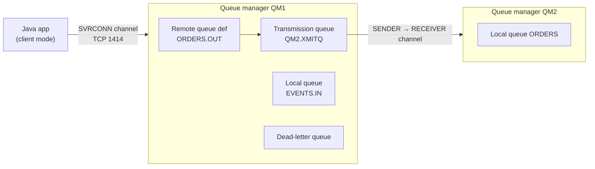
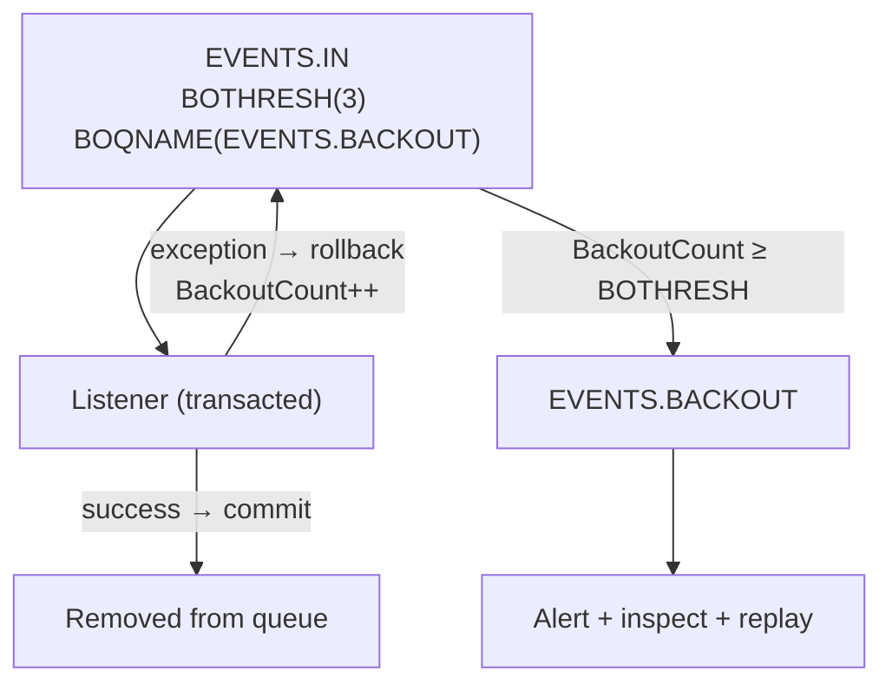
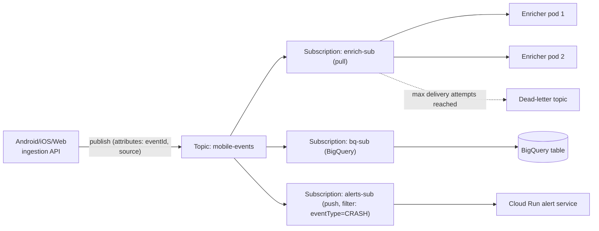
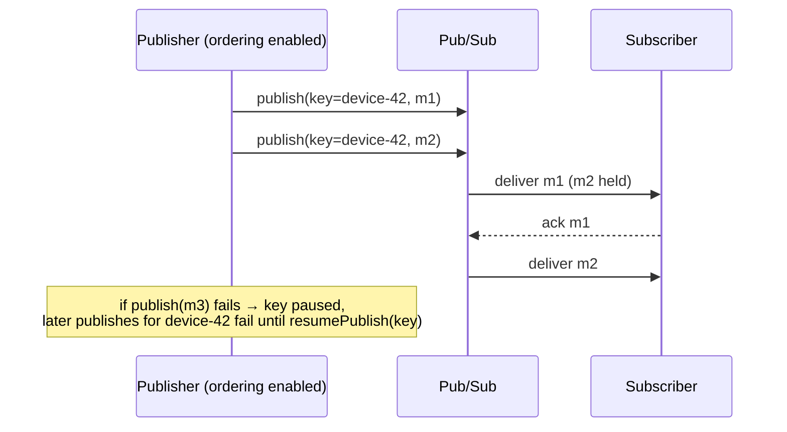
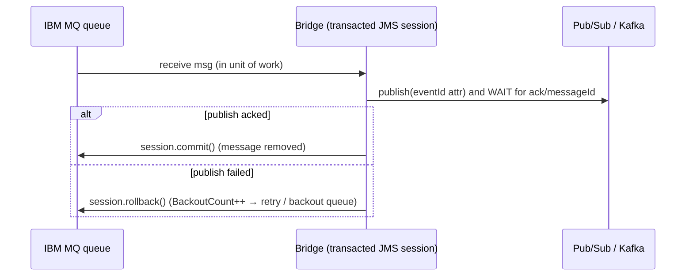

# IBM MQ & GCP Pub/Sub: Interview Notes

**Why this matters in interviews:** Many backends ingest events through more than one broker. Classic enterprise systems speak **IBM MQ** (transactional queues, JMS), while cloud-native services on GCP use **Pub/Sub**. Interviewers probe whether you understand each broker's delivery model (queue vs log vs managed pub/sub), acknowledgement, redelivery, ordering and dead-lettering, and whether you can bridge brokers without losing or duplicating events. This file is built around high-volume event ingestion from Android, iOS and web clients.

> [!NOTE]
> Java examples use **Java 8** with the IBM MQ classes for JMS (`com.ibm.mq.allclient` 9.3), Spring JMS 5.3, and the `google-cloud-pubsub` Java client (1.125.x, a Java 8-compatible release). Defaults and limits change over time, so check the current IBM and Google documentation before quoting exact numbers in production decisions.

Difficulty legend: 🟢 Basic · 🟡 Intermediate · 🔴 Advanced · ⚡ Scenario

## Table of Contents

1. [Messaging Fundamentals](#1-messaging-fundamentals)
2. [IBM MQ Architecture](#2-ibm-mq-architecture)
3. [IBM MQ with JMS and Spring](#3-ibm-mq-with-jms-and-spring)
4. [IBM MQ Reliability and Operations](#4-ibm-mq-reliability-and-operations)
5. [GCP Pub/Sub Fundamentals](#5-gcp-pubsub-fundamentals)
6. [Pub/Sub Delivery, Ordering and Exactly-Once](#6-pubsub-delivery-ordering-and-exactly-once)
7. [Pub/Sub in Java and Spring](#7-pubsub-in-java-and-spring)
8. [Choosing and Bridging Brokers](#8-choosing-and-bridging-brokers)
9. [Coding / Hands-on](#9-coding--hands-on)
10. [Production Scenarios](#10-production-scenarios)
11. [Cheat Sheet](#11-cheat-sheet)
12. [Revision Checklist](#12-revision-checklist)
13. [Beyond Java 8](#13-beyond-java-8)

---

## 1. Messaging Fundamentals

> **Mental model:** A **queue** is a *to-do tray*. Each task is taken by one worker, and once it's done it's removed. A **topic (pub/sub)** is a *newsletter*. Every subscriber gets their own copy. A **log (Kafka)** is a *newspaper archive*. Everyone reads the same pages at their own pace, and nothing is thrown away when read.

### Q1. 🟢 Point-to-point vs publish-subscribe?

| | Point-to-point (queue) | Publish-subscribe (topic) |
|---|---|---|
| Consumers per message | Exactly one | One copy per subscription |
| Scaling | Competing consumers on one queue | Each subscription scales independently |
| IBM MQ | Local queue | Topic + subscriptions |
| Pub/Sub | One subscription, many subscribers (competing) | Many subscriptions on a topic |

<details><summary>Cross-questions</summary>

**Q:** How does Pub/Sub do point-to-point then?

**A:** Attach several subscriber clients to **one subscription**. They compete for its messages. Every separate subscription still gets every message.
</details>

### Q2. 🟢 What does "acknowledgement" mean in messaging?

The consumer tells the broker "I've processed this, so you can forget it". Until the ack arrives, the broker keeps the message and will **redeliver** it if the consumer fails, times out, or rolls back. Acking **after** processing gives at-least-once delivery.

<details><summary>Cross-questions</summary>

**Q:** What is the ack mechanism in each system?

**A:** In MQ/JMS it's a session commit (transacted) or `message.acknowledge()` (`CLIENT_ACKNOWLEDGE`). In Pub/Sub, `consumer.ack()` (or a 2xx response for push). In Kafka it's an **offset commit**, which is per partition position rather than per message.
</details>

### Q3. 🟡 Queue broker vs log broker: what changes for the application?

| | Queue broker (MQ, RabbitMQ, Pub/Sub*) | Log broker (Kafka) |
|---|---|---|
| Ack granularity | Per message | Per partition offset |
| Redelivery unit | Single message | Everything after committed offset |
| Parallelism | Add consumers freely | ≤ partitions per group |
| Replay | Limited (Pub/Sub seek; MQ none) | Native (offset reset) |
| Poison message | Retried/backed out per message | Blocks the partition unless handled |

\*Pub/Sub is a managed pub/sub service with per-message acks.

<details><summary>Cross-questions</summary>

**Q:** Why can Pub/Sub scale subscribers beyond any partition count?

**A:** It has no partitions visible to the client. Messages are leased individually to any subscriber, unless you use ordering keys.
</details>

### Q4. 🟢 What are the delivery guarantees across these brokers?

All three are **at-least-once** by default. Design every consumer to be **idempotent**. Kafka offers exactly-once within Kafka through transactions. Pub/Sub offers **exactly-once delivery** on pull subscriptions (a subscription setting). MQ provides once-and-once-only delivery of **persistent** messages between queue managers, and transactional (syncpoint or XA) processing, but a consumer that crashes after a side effect and before the commit still sees a redelivery.

<details><summary>Cross-questions</summary>

**Q:** So why is idempotency still required with "exactly-once" features?

**A:** Those features cover the broker's own ack bookkeeping, not your side effects (DB writes, HTTP calls, files on GCS).
</details>

### Q5. 🟡 What is a dead-letter queue, and why does every pipeline need one?

It's a destination for messages that **can't be processed** after N attempts (poison messages). Without one, a poison message is redelivered forever: it blocks ordering, wastes CPU, and hides real failures. With one, the pipeline keeps flowing, and the bad messages wait for inspection and **replay**.

<details><summary>Cross-questions</summary>

**Q:** What's the most important operational rule for DLQs?

**A:** Alert on them, and own them. A DLQ nobody reads is just silent data loss.
</details>

### Q6. 🟡 What is message persistence, and what does it cost?

**Persistent** messages are logged to disk (they survive broker restarts). Non-persistent ones live in memory (faster, but lost on restart). Durable business events must be persistent. Telemetry-like data might accept non-persistent delivery for speed.

<details><summary>Cross-questions</summary>

**Q:** Are Pub/Sub messages persistent?

**A:** Yes. Pub/Sub stores published messages durably (replicated across zones) until they're acked or the retention period expires. There's no non-persistent mode.
</details>

### Q7. 🟡 What is request/reply over messaging?

The requester sends a message with a **reply-to** destination and a **correlation ID**. The responder puts the reply on the reply-to destination with the same correlation ID. It's used heavily with MQ for integration with mainframe or back-office systems.

<details><summary>Cross-questions</summary>

**Q:** What's the JMS convention for correlation?

**A:** The reply's `JMSCorrelationID` is set to the request's `JMSMessageID`. Some systems use a business correlation ID instead, and both sides must agree.
</details>

### Q8. 🟡 What are temporal decoupling and load levelling?

**Temporal decoupling** means the producer and consumer don't need to be up at the same time. **Load levelling** means the queue absorbs bursts (morning traffic peaks from mobile apps) while consumers process at a steady rate. That's why ingestion endpoints publish to a broker instead of calling processors directly.

<details><summary>Cross-questions</summary>

**Q:** What metric tells you load levelling is working or failing?

**A:** Backlog (queue depth, undelivered messages, lag) and the age of the oldest message. A growing age means consumers are falling behind.
</details>

### Q9. 🟡 Push vs pull consumption?

- **Pull**: the consumer asks for messages and controls the rate (MQ `MQGET`/JMS receive, Pub/Sub StreamingPull, Kafka poll).
- **Push**: the broker calls the consumer (a JMS `MessageListener` is still pull under the hood; **Pub/Sub push** subscriptions POST to an HTTPS endpoint).

Pull gives the consumer flow control. Push suits serverless targets (Cloud Run).

<details><summary>Cross-questions</summary>

**Q:** How does Pub/Sub push apply backpressure?

**A:** It adapts its delivery rate based on how many requests succeed or fail. Slow responses and non-2xx replies reduce the rate.
</details>

### Q10. 🟡 What message metadata do you standardise across brokers?

`eventId` (idempotency), `eventType`, `schemaVersion`, `source` (ANDROID, IOS or WEB), `occurredAt`, `traceId`, and `tenant`. These map to MQ message properties (JMS properties), Pub/Sub **attributes**, and Kafka **headers**, so consumers route and dedupe the same way everywhere.

<details><summary>Cross-questions</summary>

**Q:** Why not keep everything in the payload?

**A:** Attributes and headers allow filtering and routing without parsing the payload, and Pub/Sub subscriptions can **filter on attributes** server-side.
</details>

---

## 2. IBM MQ Architecture

> **Mental model:** A **queue manager** is a *post office*. **Queues** are its mailboxes. **Channels** are the delivery vans between post offices (or from a customer's car, which is a client connection). A letter addressed to another post office waits in the **transmission queue** (the outgoing van bay) until the van takes it.



### Q11. 🟢 What is a queue manager?

It's the MQ server process that owns queues, channels and other objects, stores messages (in queue files plus a **recovery log** for persistent messages), handles transactions, and enforces security. Applications connect to a queue manager, locally or as a client over the network.

<details><summary>Cross-questions</summary>

**Q:** What is the recovery log for?

**A:** Persistent message operations and transactional units of work are logged, so the queue manager can recover a consistent state after a crash.
</details>

### Q12. 🟢 What types of queues exist?

| Queue type | Purpose |
|---|---|
| **Local** | Actually holds messages |
| **Remote (definition)** | Local pointer to a queue on another QM; puts go via a transmission queue |
| **Alias** | Another name for a queue/topic (decouple apps from real names; permissions) |
| **Model** | Template for dynamic queues (e.g., temporary reply queues) |
| **Transmission** | Local queue holding messages destined for another QM |
| **Dead-letter** | QM-level destination for undeliverable messages |

<details><summary>Cross-questions</summary>

**Q:** Why use an alias queue?

**A:** Applications reference a stable name, and administrators can repoint it or grant access to the alias only, without code changes.
</details>

### Q13. 🟢 What are channels?

Channels are communication links:

- **MQI channels** (`SVRCONN` on the server side) connect client applications.
- **Message channels** connect queue managers: `SENDER` → `RECEIVER` pairs, or `CLUSSDR` / `CLUSRCVR` in clusters.

A **listener** accepts incoming connections (port 1414 by default).

<details><summary>Cross-questions</summary>

**Q:** What is a channel's "in-doubt" state?

**A:** A message channel batch where the sender doesn't know whether the receiver committed. The channel resolves it on restart, so messages are neither lost nor duplicated between queue managers (for persistent messages).
</details>

### Q14. 🟢 Client mode vs bindings mode?

| | Bindings mode | Client mode |
|---|---|---|
| Connection | Shared memory/IPC on same host | TCP via SVRCONN channel |
| Performance | Fastest | Network hop |
| Deployment | App on QM host | App anywhere (containers, cloud) |

Microservices almost always use **client mode**.

<details><summary>Cross-questions</summary>

**Q:** What connection details does a client need?

**A:** The queue manager name, the connection name (`host(port)`), the channel name, credentials or TLS settings, and optionally a CCDT (client channel definition table) for failover lists.
</details>

### Q15. 🟡 What does the message descriptor (MQMD) contain?

The key fields are `MsgId`, `CorrelId`, `Persistence`, `Priority`, `Expiry`, `ReplyToQ` / `ReplyToQMgr`, `Format`, `Encoding` / `CodedCharSetId`, and **`BackoutCount`**. JMS maps these to `JMSMessageID`, `JMSCorrelationID`, `JMSDeliveryMode`, `JMSPriority`, `JMSExpiration`, `JMSReplyTo` and the `JMSXDeliveryCount`-style properties.

<details><summary>Cross-questions</summary>

**Q:** Why do character sets (CCSID) matter?

**A:** Messages exchanged with mainframes (EBCDIC) need conversion. Wrong CCSID settings give garbled text. MQ can convert on `MQGET` when the format is `MQSTR`.
</details>

### Q16. 🟡 How does MQ order messages?

Within one queue, messages of the **same priority** put by one application in one unit of work are retrieved in **FIFO** order (by default, the queue's delivery sequence is priority order). **Multiple consumers** on one queue break the processing order, because each takes the next message in parallel. For strict ordering, use a single consumer, or **message groups** to keep related messages together.

<details><summary>Cross-questions</summary>

**Q:** How do you scale while keeping per-customer order?

**A:** Partition by key across several queues (one consumer each), similar to Kafka partitions, or use message groups so one consumer gets a whole group.
</details>

### Q17. 🟡 What is syncpoint (unit of work) in MQ?

Gets and puts done **under syncpoint** become visible or removed only when the application **commits**, and are undone on **backout**. In JMS terms, that's a **transacted session**: `session.commit()` or `session.rollback()`.

<details><summary>Cross-questions</summary>

**Q:** What happens to a message that was got under syncpoint and then rolled back?

**A:** It goes back on the queue with its **`BackoutCount` incremented**, and it will be redelivered.
</details>

### Q18. 🟡 What are MQ clusters for?

A **cluster** groups queue managers so they auto-define channels and share queue definitions. The main uses are **workload balancing** (the same queue hosted on several QMs, with messages spread across them) and simpler administration. Clusters **don't replicate messages**: each message lives on one QM.

<details><summary>Cross-questions</summary>

**Q:** Is a cluster a high-availability solution?

**A:** Not for the data. Messages already on a failed QM wait until it comes back. Use multi-instance queue managers, RDQM, or Native HA (on containers) for message availability.
</details>

### Q19. 🟡 What is a multi-instance queue manager?

An active and a standby instance of the **same** queue manager share networked storage (the data and logs). If the active instance fails, the standby takes over and clients reconnect (automatic client reconnect, or a CCDT or connection list containing both hosts).

<details><summary>Cross-questions</summary>

**Q:** What must the client do during failover?

**A:** Reconnect (JMS client reconnect options, or the Spring listener container's recovery), and handle in-flight transactions that were rolled back.
</details>

### Q20. 🟡 How does publish/subscribe work in IBM MQ?

Publishers put to a **topic** (a topic string, optionally with administered topic objects). Subscribers create **subscriptions**, which are **durable** (they survive disconnects, with messages kept on a queue) or non-durable. MQ also supports hierarchical topic strings and wildcards.

<details><summary>Cross-questions</summary>

**Q:** What happens to messages for a durable subscriber that's offline?

**A:** They accumulate on the subscription's queue, so monitor its depth like any other queue.
</details>

### Q21. 🟡 What is `MAXDEPTH`, and what happens when a queue is full?

`MAXDEPTH` limits the number of messages on a queue. When it's reached, puts fail with **`MQRC_Q_FULL` (2053)**. For messages arriving over a channel, the receiving side may route them to the dead-letter queue instead (depending on the channel settings).

<details><summary>Cross-questions</summary>

**Q:** How should the producer react to 2053?

**A:** Back off and retry, apply backpressure upstream, and alert. A full queue means consumers are down or too slow.
</details>

### Q22. 🟡 Which MQ reason codes should you recognise?

| Code | Name | Typical cause |
|---|---|---|
| 2009 | `MQRC_CONNECTION_BROKEN` | Network drop, QM restart, idle timeout |
| 2033 | `MQRC_NO_MSG_AVAILABLE` | Get with wait found nothing (normal) |
| 2035 | `MQRC_NOT_AUTHORIZED` | Security: channel auth/user permissions |
| 2053 | `MQRC_Q_FULL` | Queue at MAXDEPTH |
| 2059 | `MQRC_Q_MGR_NOT_AVAILABLE` | QM down, wrong host/port/channel |
| 2085 | `MQRC_UNKNOWN_OBJECT_NAME` | Queue name wrong / not defined |

<details><summary>Cross-questions</summary>

**Q:** A new deployment gets 2035. What do you check?

**A:** The channel authentication records (CHLAUTH), the user mapping (the MCAUSER / connection authentication user), and the object authorities for that user on the queue (`setmqaut` / `dspmqaut`).
</details>

### Q23. 🟡 How do you inspect a queue from the command line?

```text
runmqsc QM1
DISPLAY QLOCAL(EVENTS.IN) CURDEPTH MAXDEPTH IPPROCS OPPROCS
DISPLAY QSTATUS(EVENTS.IN) TYPE(QUEUE) MSGAGE UNCOM
DISPLAY CHSTATUS(APP.SVRCONN) ALL
```

`IPPROCS` and `OPPROCS` show how many apps have the queue open for input and output. `MSGAGE` shows the age of the oldest message (it needs queue monitoring enabled).

<details><summary>Cross-questions</summary>

**Q:** `CURDEPTH` is growing and `IPPROCS` is 0. What does that tell you?

**A:** No consumer has the queue open. The consumer app is down, disconnected, or pointing at the wrong queue.
</details>

### Q24. 🟡 How do message expiry and priority work?

The producer sets `Expiry` (in tenths of a second in the MQMD, or through JMS `setTimeToLive` in ms). Expired messages are discarded when they're encountered, or by the queue manager's expiry scan. `Priority` ranges from 0 to 9. Queues ordered by priority deliver higher-priority messages first.

<details><summary>Cross-questions</summary>

**Q:** Is expiry a good way to drop stale events?

**A:** For truly time-sensitive messages (like a real-time price), yes. For business events, no: they'd vanish silently. Prefer explicit handling.
</details>

### Q25. 🟡 How is MQ secured?

- **TLS on channels** (a CipherSpec on the channel, with keystores).
- **Channel authentication records** (CHLAUTH), which allow or block by IP, certificate DN or user.
- **Connection authentication** (user ID and password checked against the OS or LDAP).
- **Object authorities** (put, get, browse, inquire per queue).

Never run application channels with administrative privileges.

<details><summary>Cross-questions</summary>

**Q:** Why is the `SYSTEM.DEF.SVRCONN` channel risky?

**A:** It's a default channel that could allow unintended access. Best practice is to block it with CHLAUTH and define dedicated application channels.
</details>

### Q26. 🟡 What is browsing a message, and when do you use it?

It means reading a message **without removing it** (`MQGMO_BROWSE_*`, or a JMS `QueueBrowser`). You use it for diagnostics (tools like `amqsbcg`), and for selectors or peeking in custom dispatchers.

<details><summary>Cross-questions</summary>

**Q:** Why avoid browse-then-get designs at scale?

**A:** They're racy with several consumers, and slower. Use selectors or separate queues.
</details>

### Q27. 🟡 What are message selectors?

A JMS selector (an SQL-92-like expression on properties, such as `eventType = 'LOGIN'`) makes the consumer receive only the matching messages. Selectors on `JMSCorrelationID` or `JMSMessageID` are efficient in MQ. Arbitrary property selectors can be slow on deep queues.

<details><summary>Cross-questions</summary>

**Q:** Better design than heavy selectors?

**A:** Route to separate queues at put time (for example, a topic with several subscriptions, or distinct queues).
</details>

### Q28. 🟡 What does triggering do in MQ?

A queue can be configured so that the arrival of messages (first, every, or at depth) puts a **trigger message** on an initiation queue. A trigger monitor then starts an application. It's a classic mechanism for on-demand processing, and less common with long-running containerised consumers.

<details><summary>Cross-questions</summary>

**Q:** Why rarely use triggering in Kubernetes?

**A:** Consumers are long-lived and autoscaled on queue depth instead (for example, with KEDA's IBM MQ scaler).
</details>

### Q29. 🟡 What is a CCDT?

The **Client Channel Definition Table** (binary, or JSON in 9.1.2+) lists the connection details of one or more queue managers. It enables failover and workload distribution across QMs without hard-coding hosts, and it's shared with clients as a file or a URL.

<details><summary>Cross-questions</summary>

**Q:** How does a connection list differ?

**A:** A connection list (`host1(1414),host2(1414)`) is simpler, but it can only express a single channel definition and name.
</details>

### Q30. 🟡 What is the difference between MQ and Kafka for a mainframe integration?

MQ provides **transactional, once-and-once-only transfer** of persistent messages between queue managers, mainframe (z/OS) support, request/reply patterns and XA. Kafka provides **high-throughput streaming with replay**. Integration architectures often keep MQ at the enterprise boundary and bridge into Kafka or Pub/Sub for fan-out and analytics.

<details><summary>Cross-questions</summary>

**Q:** Which tool bridges MQ to Kafka without custom code?

**A:** The Kafka Connect IBM MQ source and sink connectors, open-sourced by IBM. Custom Spring bridges are also common when the transformation logic is needed.
</details>

---
## 3. IBM MQ with JMS and Spring

> **Mental model:** JMS is a *universal remote control*. The buttons (`send`, `receive`, `commit`) are the same for any JMS broker, and the IBM MQ JMS client is the adapter for the MQ "TV". Spring JMS adds a *butler* (the listener container) who holds the remote, retries on failure, and manages transactions.

### Q31. 🟢 What are the main JMS objects?

`ConnectionFactory` → `Connection` → `Session` (transacted or acknowledge mode) → `MessageProducer` / `MessageConsumer` → `Message` (`TextMessage`, `BytesMessage`, `MapMessage` and others). JMS 2.0 adds a simplified `JMSContext` API.

<details><summary>Cross-questions</summary>

**Q:** Which JMS objects are thread-safe?

**A:** `ConnectionFactory` and `Connection` are. **`Session`, producers and consumers aren't**: use one per thread. Spring's `CachingConnectionFactory` and the listener containers manage this for you.
</details>

### Q32. 🟢 How do you connect to IBM MQ from Java 8 in client mode?

```java
import javax.jms.JMSException;
import com.ibm.mq.jms.MQConnectionFactory;
import com.ibm.msg.client.wmq.WMQConstants;

public class MqFactory {
    public static MQConnectionFactory create() throws JMSException {
        MQConnectionFactory cf = new MQConnectionFactory();
        cf.setTransportType(WMQConstants.WMQ_CM_CLIENT);
        cf.setQueueManager("QM1");
        cf.setChannel("APP.SVRCONN");
        cf.setConnectionNameList("mq-a(1414),mq-b(1414)");     // failover list (multi-instance QM)
        cf.setClientReconnectOptions(WMQConstants.WMQ_CLIENT_RECONNECT);
        cf.setClientReconnectTimeout(300);                      // seconds
        cf.setStringProperty(WMQConstants.USERID, System.getenv("MQ_USER"));
        cf.setStringProperty(WMQConstants.PASSWORD, System.getenv("MQ_PASSWORD"));
        cf.setBooleanProperty(WMQConstants.USER_AUTHENTICATION_MQCSP, true);
        return cf;
    }
}
```

With Spring Boot, the `com.ibm.mq:mq-jms-spring-boot-starter` (a 2.x release for Boot 2) configures the factory from `ibm.mq.queueManager`, `ibm.mq.channel`, `ibm.mq.connName`, `ibm.mq.user` and `ibm.mq.password`.

<details><summary>Cross-questions</summary>

**Q:** Where do the credentials come from?

**A:** Environment variables or a secret manager, never source code. Prefer TLS with client certificates where the organisation supports it.
</details>

### Q33. 🟡 What are the JMS acknowledge modes and transacted sessions?

| Mode | Behaviour |
|---|---|
| Transacted session | `commit()` acks all received msgs & sends all produced msgs atomically; `rollback()` redelivers |
| `AUTO_ACKNOWLEDGE` | Acked when `receive` returns / listener returns normally |
| `CLIENT_ACKNOWLEDGE` | App calls `message.acknowledge()` (acks all msgs received so far in the session) |
| `DUPS_OK_ACKNOWLEDGE` | Lazy acks; duplicates possible, less overhead |

<details><summary>Cross-questions</summary>

**Q:** Which mode do you use for critical ingestion?

**A:** A **transacted session** (`sessionTransacted=true` in Spring). If the listener throws, the message is rolled back and redelivered, and the backout count protects against poison messages.

**Q:** What's the `CLIENT_ACKNOWLEDGE` gotcha?

**A:** `acknowledge()` acks **every** message consumed so far in that session, not just the one you call it on.
</details>

### Q34. 🟡 How do you write a Spring JMS listener for MQ?

```java
import javax.jms.JMSException;
import javax.jms.TextMessage;
import org.springframework.jms.annotation.JmsListener;
import org.springframework.stereotype.Component;

@Component
public class MqEventListener {

    @JmsListener(destination = "EVENTS.IN", concurrency = "3-10")
    public void onMessage(TextMessage msg) throws JMSException {
        String eventId = msg.getStringProperty("eventId");
        String body = msg.getText();
        // idempotent processing keyed by eventId; throwing → rollback → redelivery
    }
}
```

```java
import javax.jms.ConnectionFactory;
import org.springframework.context.annotation.Bean;
import org.springframework.context.annotation.Configuration;
import org.springframework.jms.config.DefaultJmsListenerContainerFactory;

@Configuration
public class JmsConfig {
    @Bean
    public DefaultJmsListenerContainerFactory jmsListenerContainerFactory(ConnectionFactory cf) {
        DefaultJmsListenerContainerFactory f = new DefaultJmsListenerContainerFactory();
        f.setConnectionFactory(cf);
        f.setSessionTransacted(true);            // local JMS transaction per message
        f.setConcurrency("3-10");                // min-max consumers
        f.setReceiveTimeout(5000L);
        return f;
    }
}
```

<details><summary>Cross-questions</summary>

**Q:** What does `concurrency = "3-10"` mean with `DefaultMessageListenerContainer`?

**A:** It starts 3 consumers and scales up to 10 dynamically based on load. Each consumer has its own session and thread, so per-queue ordering is lost when the concurrency is above 1.
</details>

### Q35. 🟡 How do you send with `JmsTemplate`?

```java
import org.springframework.jms.core.JmsTemplate;
import org.springframework.stereotype.Service;

@Service
public class MqPublisher {
    private final JmsTemplate jms;
    public MqPublisher(JmsTemplate jms) { this.jms = jms; }

    public void send(final String eventId, final String json) {
        jms.send("EVENTS.OUT", session -> {
            javax.jms.TextMessage m = session.createTextMessage(json);
            m.setStringProperty("eventId", eventId);
            m.setStringProperty("schemaVersion", "2");
            return m;
        });
    }
}
```

<details><summary>Cross-questions</summary>

**Q:** Why wrap the connection factory in `CachingConnectionFactory` for `JmsTemplate`?

**A:** `JmsTemplate` opens and closes a connection and session **per send** by default. Caching avoids a TCP and handshake cost on every message. (Don't cache consumers for the listener containers. They manage their own.)
</details>

### Q36. 🟡 How does poison-message (backout) handling work with MQ and JMS?

Every rollback increments the message's **`BackoutCount`**. The IBM MQ classes for JMS compare it with the queue's **`BOTHRESH`** (backout threshold). When the count reaches the threshold, the message is moved to the **`BOQNAME`** (backout requeue queue). If that isn't defined or can't be used, it goes to the queue manager's **dead-letter queue**.



#### 🎯 Predict the output

This is a small **model** of the rule above, not the MQ client itself.

```java
public class BackoutModel {
    public static void main(String[] args) {
        int bothresh = 3;
        int backoutCount = 0;
        int deliveries = 0;
        String location = "EVENTS.IN";
        while (location.equals("EVENTS.IN")) {
            if (backoutCount >= bothresh) {      // checked when the message is next received
                location = "EVENTS.BACKOUT";
                break;
            }
            deliveries++;                        // listener runs and throws (poison)
            backoutCount++;                      // rollback increments BackoutCount
        }
        System.out.println("deliveries=" + deliveries + " finalBackoutCount=" + backoutCount + " -> " + location);
    }
}
```

<details><summary>Answer</summary>

`deliveries=3 finalBackoutCount=3 -> EVENTS.BACKOUT`. With `BOTHRESH(3)`, the listener sees the poison message **three** times (backout counts 0, 1 and 2). On the next receive, the count of 3 meets the threshold, and the message is requeued to the backout queue instead of being delivered.
</details>

<details><summary>Cross-questions</summary>

**Q:** What happens if `BOTHRESH` is 0 (not set)?

**A:** There's no automatic backout, so the poison message is redelivered **forever**, a tight failure loop. Always set `BOTHRESH` and `BOQNAME` for application queues.
</details>

### Q37. 🟡 What is a JMS message selector, and what does it cost with MQ?

`@JmsListener(destination = "REPLIES", selector = "JMSCorrelationID = 'ID:...'")` is efficient for correlation IDs. Selectors on arbitrary properties force MQ to scan messages, which hurts deep queues. Route to separate queues instead.

<details><summary>Cross-questions</summary>

**Q:** How does `JmsTemplate.sendAndReceive` implement request/reply?

**A:** It creates a temporary reply queue (from a model queue in MQ), sets `JMSReplyTo`, sends, and waits on that temporary queue for the reply (with `receiveTimeout`).
</details>

### Q38. 🟡 How do you implement request/reply with a fixed reply queue and correlation?

The requester sends with `JMSReplyTo = REPLY.Q`, then receives from `REPLY.Q` with the selector `JMSCorrelationID = '<request JMSMessageID>'`. The responder copies the request's `JMSMessageID` into the reply's `JMSCorrelationID`. Always set a **timeout**, and handle late replies (discard them, or route them to a "late replies" handler).

<details><summary>Cross-questions</summary>

**Q:** Synchronous request/reply over MQ inside a REST call: good idea?

**A:** Only with tight timeouts and a bounded thread usage. A slow back end ties up request threads. Asynchronous callbacks (a 202 plus a later result) scale better.
</details>

### Q39. 🟡 How do JMS message types map to MQ?

`TextMessage` maps to MQ format `MQSTR` (character data, convertible between CCSIDs). `BytesMessage` maps to raw bytes. MQ also adds an **RFH2** header to carry JMS properties. Non-JMS consumers (C or COBOL apps) may not expect RFH2, so use `targetClient=MQ` (`WMQ_CLIENT_NONJMS_MQ`) on the destination when you send to them.

<details><summary>Cross-questions</summary>

**Q:** A mainframe app reports "garbage at the start of the message". Why?

**A:** The RFH2 header is being sent to a non-JMS consumer. Set the destination's target client to non-JMS (MQ).
</details>

### Q40. 🟡 How do you make a Spring JMS consumer resilient to MQ outages?

`DefaultMessageListenerContainer` **recovers automatically**: it retries connecting with `recoveryInterval` or a `BackOff`. Combine that with the MQ client's reconnect options and connection lists. Log the connection failures (the container logs them) and alert when the consumers stay disconnected.

<details><summary>Cross-questions</summary>

**Q:** Why can the MQ client reconnect and Spring's recovery conflict?

**A:** Both try to handle the failure. With transacted listeners, many teams rely on the Spring container's recovery plus a connection list, and enable automatic client reconnect carefully according to IBM's guidance for managed environments.
</details>

### Q41. 🟡 Can a DB update and an MQ get happen in one transaction?

Yes, with **XA** (a JTA transaction manager such as Atomikos or Narayana, or an app server) and both resources enlisted, so both commit or both roll back. It costs performance and adds operational complexity. The lighter alternative is a **local JMS transaction plus an idempotent DB write**: commit the DB, then commit the JMS session. A crash in between causes a redelivery, which the idempotent write absorbs.

<details><summary>Cross-questions</summary>

**Q:** Why is the "DB first, then JMS commit" order safe?

**A:** If the JMS commit fails, the message is redelivered and the DB write is repeated idempotently. The reverse order (ack first) could lose the message.
</details>

### Q42. 🟡 How do you consume MQ messages in batches for DB efficiency?

Use a transacted session: receive up to N messages (or until a short timeout), write them in one JDBC batch, then **commit the DB and the session**. Spring's `DefaultMessageListenerContainer` is per-message, so for batching, use a custom loop with `JmsTemplate.execute` or a `SessionCallback`, or aggregate in memory with care.

<details><summary>Cross-questions</summary>

**Q:** What's the trade-off of batch size?

**A:** Bigger batches mean higher throughput, but a longer unit of work, more redeliveries on failure, and more locks held. Tune to around 100–500 and measure.
</details>

### Q43. 🟡 How does JMS priority and delivery mode map to MQ?

`producer.setDeliveryMode(DeliveryMode.PERSISTENT)` maps to MQ persistent. `setPriority(0–9)` maps to MQ priority. `setTimeToLive(ms)` maps to MQ expiry. For business events, use persistent messages and the default priority unless there's a real need.

<details><summary>Cross-questions</summary>

**Q:** Does MQ honour JMS priority by default?

**A:** The queue's `MSGDLVSQ(PRIORITY)`, the default, delivers higher priority first. With `FIFO`, priority is ignored for ordering.
</details>

### Q44. 🟡 How do you test MQ integration locally?

Run the **IBM MQ developer container image** (`icr.io/ibm-messaging/mq`) with Testcontainers, or use an embedded or in-memory JMS broker (ActiveMQ Artemis) for pure JMS logic. Contract-test the message formats. Test poison messages to confirm the backout behaviour.

<details><summary>Cross-questions</summary>

**Q:** Why not test only against ActiveMQ?

**A:** MQ-specific behaviour (backout queues, RFH2, CCSID conversion, reason codes) differs. Run at least one integration test against a real MQ container.
</details>

### Q45. 🟡 How do you propagate trace context over MQ?

Put the trace or correlation IDs in **JMS string properties** (for example `traceparent` and `eventId`), and restore them into the MDC in the listener. Sleuth in Boot 2 instruments JMS through properties.

<details><summary>Cross-questions</summary>

**Q:** Why not use `JMSCorrelationID` for tracing?

**A:** It's often already used for request/reply correlation. Keep tracing in separate properties.
</details>

### Q46. 🟡 Is `JmsTemplate.receive()` in a loop OK for consuming?

For simple or batch tools, yes, with `receiveTimeout` set (the default is to block indefinitely). For services, prefer a **listener container**, which handles concurrency, recovery, transactions and graceful shutdown.

<details><summary>Cross-questions</summary>

**Q:** What happens with `receiveTimeout = 0` (the default) on shutdown?

**A:** `receive` blocks forever, and the thread can't stop cleanly. Always set a timeout.
</details>

---

## 4. IBM MQ Reliability and Operations

> **Mental model:** MQ reliability rests on three promises: **persistent messages** survive restarts, **units of work** make gets and puts all-or-nothing, and **channels** hand messages between queue managers exactly once. Your job is to avoid breaking those promises in application code (acking early, ignoring backouts, unbounded queues).

### Q47. 🟡 What makes MQ messages survive a queue manager crash?

**Persistent** messages, together with the recovery log (linear or circular logging) and syncpoint. After a restart, committed persistent messages are restored and uncommitted units of work are rolled back. **Non-persistent** messages are lost on restart (unless the queue is set to `NPMCLASS(HIGH)`, which keeps them across a normal shutdown).

<details><summary>Cross-questions</summary>

**Q:** Linear vs circular logging?

**A:** **Circular** reuses its log extents, which is simpler and supports restart recovery only. **Linear** keeps the logs for **media recovery** (recreating damaged queue files), but it needs log archiving and management.
</details>

### Q48. 🟡 Which metrics do you monitor on MQ?

- Queue **depth** (`CURDEPTH`) and depth vs `MAXDEPTH`, oldest message age, and enqueue and dequeue rates.
- `IPPROCS` (consumers present).
- DLQ and backout queue depth.
- Channel status (`RUNNING`, `RETRYING`, `STOPPED`) and in-doubt channels.
- Queue manager log and file system usage.
- Connection counts.

Export them through the IBM MQ Prometheus exporter or your enterprise monitoring tools.

<details><summary>Cross-questions</summary>

**Q:** What alert catches a stuck consumer fastest?

**A:** Queue depth above a threshold combined with **dequeue rate 0**, or oldest-message age above your SLA.
</details>

### Q49. 🟡 Why do channels go into RETRYING, and what happens to the messages?

The target queue manager is unreachable (network, down, or TLS or auth mismatch). Messages **accumulate in the transmission queue** on the sending side. They aren't lost, but they're delayed, and the transmission queue can fill up. Fix the connectivity; the channel resumes and drains the backlog.

<details><summary>Cross-questions</summary>

**Q:** Which queue would you watch?

**A:** The transmission queue's depth on the sender side.
</details>

### Q50. 🟡 What goes to the queue manager's dead-letter queue?

Messages that **can't be delivered** to their target: the queue is full, put-inhibited or unknown, conversion failed, or they're backed-out messages without a usable backout queue. Each DLQ message gets a **dead-letter header (MQDLH)** with the reason code and the original destination. The `runmqdlq` handler can retry or forward messages based on rules.

<details><summary>Cross-questions</summary>

**Q:** Should applications consume from the queue manager's DLQ?

**A:** Usually not directly. Ops tooling manages it. Use per-application backout queues for poison messages, so the application team owns them.
</details>

### Q51. 🟡 How do you scale MQ consumers?

Add consumer instances or threads on the queue (competing consumers). Every message goes to one consumer. Watch for broken ordering and for downstream capacity. For very high volumes, spread the work over several queues or queue managers (a cluster workload), or bridge to Kafka or Pub/Sub for fan-out.

<details><summary>Cross-questions</summary>

**Q:** How do you autoscale MQ consumers on Kubernetes?

**A:** KEDA's IBM MQ scaler scales on queue depth through the MQ REST API.
</details>

### Q52. 🟡 Why can many short-lived connections hurt MQ?

Each client connection is a channel instance, with a TLS handshake and authentication. Creating one per message (for example, `JmsTemplate` without caching) overloads the queue manager and hits `MAXINST` / `MAXINSTC` limits. Use pooled or cached connections and sessions.

<details><summary>Cross-questions</summary>

**Q:** Which channel attributes limit connections?

**A:** `MAXINST` (the total instances of the channel) and `MAXINSTC` (instances per client IP).
</details>

### Q53. 🟡 What happens to in-flight messages when a consumer pod is killed?

With a transacted session, the uncommitted unit of work is **rolled back** when the connection breaks, and the message returns to the queue (its backout count may increase). It's redelivered to another consumer, so processing must be idempotent.

<details><summary>Cross-questions</summary>

**Q:** Why might redelivery be delayed after a pod crash?

**A:** The queue manager only notices the dead connection after the TCP keepalive or heartbeat (`HBINT`) timeout. Until then, the message stays locked in the dead unit of work.
</details>

### Q54. 🟡 How do you handle large messages in MQ?

MQ supports large messages (the default max message length is 4 MB and it can be raised to 100 MB), but large messages increase log and IO costs. Prefer the **claim-check** pattern: store the payload in object storage or a database, and send a reference.

<details><summary>Cross-questions</summary>

**Q:** Which attributes must allow a large message?

**A:** `MAXMSGL` on the queue manager, the queue and the channels involved.
</details>

### Q55. 🟡 How do you replay messages from a backout queue after a fix?

Use a controlled tool (a small app, `dmpmqmsg`, or `runmqdlq`) that moves messages back to the input queue **at a limited rate**, resets or ignores the backout count where appropriate, and logs every replayed ID. Consumers must be idempotent in case some were partially processed.

<details><summary>Cross-questions</summary>

**Q:** What should you verify before replay?

**A:** That the fix is deployed, that the messages are still valid (not expired by business rules), and that downstream capacity can absorb the replay.
</details>

### Q56. 🟡 How do you migrate an MQ consumer to Kafka or Pub/Sub without data loss?

1. Build a **bridge**: consume from MQ in a transaction, publish to the new broker, **wait for the ack**, then commit MQ.
2. Run old and new consumers in parallel (the new ones reading from Kafka or Pub/Sub, with idempotent sinks).
3. Compare the outputs.
4. Switch producers to publish natively.
5. Decommission the bridge.

<details><summary>Cross-questions</summary>

**Q:** Why wait for the ack before committing the MQ get?

**A:** Committing first would lose the message if the publish then failed.
</details>

### Q57. 🟡 What is the "message affinity" problem in MQ clusters?

With cluster workload balancing, consecutive related messages (for example, a sequence for one order) may go to **different** queue managers, and they're consumed out of order. Use `DEFBIND(OPEN)` (bind on open) or message groups, or route by key explicitly, when affinity matters.

<details><summary>Cross-questions</summary>

**Q:** What does `DEFBIND(NOTFIXED)` do?

**A:** It lets each put choose a target queue manager independently, which balances load best and gives no affinity.
</details>

### Q58. 🟡 How do you handle MQ connection failures gracefully in the ingestion API (the producer side)?

Use a pooled or cached connection factory with reconnect, a short put timeout, and a circuit breaker. On failure, either return 503 (clients retry with the same `eventId`), or buffer to a durable **outbox** and publish when MQ recovers. Never block request threads indefinitely.

<details><summary>Cross-questions</summary>

**Q:** Which is preferable for mobile events?

**A:** Usually 503 plus client retry (the mobile SDK queues the events locally) or an outbox. Choose based on SLA and cost.
</details>

### Q59. 🟡 What are common MQ performance tuning points?

Use persistent messages only where needed, avoid tiny units of work per message where batching is possible, cache connections and sessions, avoid deep-queue selectors, keep queues shallow (a deep queue slows gets with selectors and increases restart time), put the logs on fast storage, and right-size the log files.

<details><summary>Cross-questions</summary>

**Q:** Why do deep queues hurt?

**A:** More messages to scan, larger queue files, and longer recovery. Queues are for flow, not long-term storage.
</details>

### Q60. 🟡 How do you debug "messages sent, but consumer never receives"?

Check, in order:

1. The producer's target: the right queue manager and queue name? A remote queue pointing somewhere else? Is the transmission queue growing (channel down)?
2. The DLQ, for the reason code.
3. The consumer's queue manager and queue, and `IPPROCS`.
4. The selector (does it filter everything out?).
5. Expiry (did the messages expire?).
6. Authorisation (2035 in the consumer logs).

<details><summary>Cross-questions</summary>

**Q:** Which single command shows where messages are piling up?

**A:** `DISPLAY QLOCAL(*) WHERE(CURDEPTH GT 0)` on each queue manager in the path.
</details>

---
## 5. GCP Pub/Sub Fundamentals

> **Mental model:** Pub/Sub is a *managed newsletter service*. You publish to a **topic** (the newsletter). Each **subscription** is a mailing list that gets its own copy. Readers on the same list share the copies (competing subscribers), and each reader must say "got it" (**ack**) within a deadline, or the copy is sent again. Google runs the presses; you never see partitions or brokers.



### Q61. 🟢 What are topics, subscriptions and messages?

- A **topic** is the named resource that publishers send to.
- A **subscription** is attached to one topic, and gets **every** message published after it's created (subject to filters).
- A **message** has `data` (bytes, up to 10 MB), **attributes** (key-value strings), a server-assigned `messageId` and `publishTime`, and an optional `orderingKey`.

<details><summary>Cross-questions</summary>

**Q:** Does a new subscription receive messages published before it existed?

**A:** No. A subscription only sees messages published after it was created (unless you seek to a snapshot or use topic retention with seek).
</details>

### Q62. 🟢 Which subscription types exist?

| Type | Delivery | Use |
|---|---|---|
| **Pull** (incl. StreamingPull) | Client pulls and acks | Services on GKE/VMs, high throughput, flow control |
| **Push** | Pub/Sub POSTs to HTTPS endpoint; 2xx = ack | Cloud Run/Functions, webhooks |
| **BigQuery** | Writes directly to a BigQuery table | Ingestion to analytics without code |
| **Cloud Storage** | Writes batches to GCS files | Archival/data lake |

<details><summary>Cross-questions</summary>

**Q:** Why was a BigQuery subscription attractive for raw mobile events?

**A:** It gives zero-code streaming into analytics tables. Custom consumers are then only needed for enrichment and business logic.
</details>

### Q63. 🟡 How do ack deadlines work?

When a message is delivered, the subscriber holds a **lease** for the ack deadline (10 s by default, configurable from 10 to 600 s). If it doesn't ack or extend (`modifyAckDeadline`) in time, the message is **redelivered**, possibly to another subscriber. The Java client **extends leases automatically** while your receiver is still processing, up to `maxAckExtensionPeriod` (60 minutes by default in the Java client).

<details><summary>Cross-questions</summary>

**Q:** What does a `nack()` do?

**A:** It sets the deadline to 0, so the message becomes available for redelivery immediately, or after the subscription's retry-policy backoff.
</details>

### Q64. 🟡 How long are messages retained?

Unacked messages are retained on a subscription for its **message retention duration** (7 days by default, and the maximum for subscriptions). Acked messages are removed unless `retain_acked_messages` is on. **Topic retention** (up to 31 days) lets new or seeking subscriptions replay older messages.

<details><summary>Cross-questions</summary>

**Q:** What happens to a subscription with no activity?

**A:** Subscriptions can **expire** after a period of inactivity (31 days by default, configurable or set to never). Set it to never for production subscriptions.
</details>

### Q65. 🟡 How does publisher batching work?

The client batches messages per topic, and sends a batch when one of the thresholds is reached: an element count, request bytes, or a delay. The Java client's defaults are small (100 messages, 1,000 bytes, or 1 ms). Raise them for high-volume ingestion to improve throughput, and lower the delay for latency-sensitive paths.

<details><summary>Cross-questions</summary>

**Q:** What does `publish()` return?

**A:** An `ApiFuture<String>` that completes with the **message ID** once the server has durably stored the message. That's your "ack".
</details>

### Q66. 🟡 How does subscriber flow control work?

`FlowControlSettings` caps the **outstanding** (unacked) messages and bytes per subscriber client. The Java client defaults to around 1,000 messages and 100 MiB. When the limit is reached, the client stops pulling, which is backpressure that protects your memory and downstream systems.

<details><summary>Cross-questions</summary>

**Q:** What happens if flow control is too high for a slow downstream?

**A:** The subscriber buffers many messages and keeps extending their leases, so memory grows, and a crash causes a big redelivery burst. Size it to what you can process within a reasonable time.
</details>

### Q67. 🟡 What are subscription filters?

A filter expression on **attributes**, set **when the subscription is created**, for example `attributes.eventType = "CRASH"` or `hasPrefix(attributes.source, "IOS")`. Messages that don't match are acked automatically and never delivered. It's cheaper than filtering in code.

<details><summary>Cross-questions</summary>

**Q:** Can you change a filter later?

**A:** No. Filters are immutable, so create a new subscription and migrate to it.
</details>

### Q68. 🟡 What IAM roles are involved?

`roles/pubsub.publisher` on the topic (publishers), `roles/pubsub.subscriber` on the subscription (consumers), and `roles/pubsub.viewer` or `editor` for management. On GKE, grant them to the workload's service account through **Workload Identity**, not JSON keys.

<details><summary>Cross-questions</summary>

**Q:** Which extra permissions does a dead-letter topic need?

**A:** The **Pub/Sub service agent** needs publish permission on the dead-letter topic and subscribe permission on the source subscription, so it can forward the messages.
</details>

### Q69. 🟡 How do push subscriptions authenticate to your endpoint?

Configure the push subscription with a **service account**. Pub/Sub then attaches an **OIDC JWT** in the `Authorization` header. Your endpoint (for example, Cloud Run with authentication required) verifies the token's audience and issuer. Never expose an unauthenticated push endpoint.

<details><summary>Cross-questions</summary>

**Q:** Which responses ack a push message?

**A:** Success codes (the 2xx family, such as 200, 201, 202 and 204, plus 102). Anything else, or a timeout, means redelivery with backoff.
</details>

### Q70. 🟡 How does Pub/Sub scale?

It's fully managed and scales automatically. Throughput grows with the number of publishers and subscriber clients, with no partitions to plan. Quotas (per project and region, for publish and subscribe throughput) are the limits to watch, and **ordering keys** limit per-key throughput.

<details><summary>Cross-questions</summary>

**Q:** Why can one subscriber client with a huge flow control still be a bottleneck?

**A:** Processing is bounded by its executor threads and CPU. Scale out the pods, and size the executor.
</details>

### Q71. 🟡 What are snapshots and seek?

- A **snapshot** captures a subscription's ack state at a point in time.
- **Seek** rewinds (or fast-forwards) a subscription to a snapshot or a timestamp.

Use them before a risky deploy (snapshot, then seek back if the new code mishandled messages), or to replay after a bug. Seeking to a timestamp covers acked messages only if they were retained.

<details><summary>Cross-questions</summary>

**Q:** What's required for replaying already-acked messages by timestamp?

**A:** `retain_acked_messages=true` on the subscription (or topic retention), and a timestamp within the retention window.
</details>

### Q72. 🟡 How do you evolve message schemas in Pub/Sub?

Attach an **Avro or Protobuf schema** to the topic (Pub/Sub schemas). Publishing messages that don't conform is rejected. Schema revisions allow controlled evolution. Alternatively, use JSON with a `schemaVersion` attribute and tolerant readers.

<details><summary>Cross-questions</summary>

**Q:** What's the benefit of rejecting at publish?

**A:** Bad data never enters the pipeline, and producers find out immediately.
</details>

### Q73. 🟡 How do you test Pub/Sub code locally?

Use the **Pub/Sub emulator** (`gcloud beta emulators pubsub start`, or a Testcontainers module) and point the client at it with `PUBSUB_EMULATOR_HOST`, or a channel provider with plaintext. Note that the emulator doesn't support every feature. Some advanced features (for example, certain exactly-once and dead-letter behaviours) need a real project to test.

<details><summary>Cross-questions</summary>

**Q:** What's the most common emulator mistake?

**A:** Forgetting that topics and subscriptions must be created in the emulator (it starts empty), or accidentally using real credentials against production.
</details>

### Q74. 🟡 What does "at-least-once" imply for Pub/Sub consumers?

Messages can be delivered **more than once**: after ack-deadline expiry, a `nack`, a subscriber crash, or occasionally even after a successful ack (without exactly-once delivery). Consumers must dedupe on an application `eventId` attribute (not only on `messageId`, which changes if the producer republishes the same event).

<details><summary>Cross-questions</summary>

**Q:** Why isn't `messageId` enough for idempotency?

**A:** A producer retrying a failed publish creates a **new** message with a new ID for the same business event. Dedupe on the business `eventId`.
</details>

### Q75. 🟡 How does message ordering throughput work with ordering keys?

Messages with the **same ordering key** are delivered in order, so they can't be processed in parallel. Throughput per key is limited (Google documents a per-key publish limit of about 1 MBps). Use fine-grained keys (device ID, not "ALL").

<details><summary>Cross-questions</summary>

**Q:** Would you use one ordering key for all events?

**A:** No. That serialises everything, like a Kafka topic with one partition.
</details>

### Q76. 🟡 What's the difference between Pub/Sub topics and Kafka topics, conceptually?

A Kafka topic is a set of **partitioned logs**, and consumers track offsets. A Pub/Sub topic fans out to **subscriptions**, each of which tracks per-message ack state, with no partitions exposed. Kafka gives you offsets and replay by position. Pub/Sub gives you per-message acks, auto-scaling, and replay through seek or snapshots.

<details><summary>Cross-questions</summary>

**Q:** What's the Pub/Sub equivalent of a Kafka consumer group?

**A:** A **subscription**. Subscriber clients attached to one subscription share its messages.
</details>

---

## 6. Pub/Sub Delivery, Ordering and Exactly-Once

> **Mental model:** Every Pub/Sub delivery is a *library book loan with a due date* (the ack deadline). Return it on time (ack) and it's done. Keep reading and renew the loan (lease extension). Lose it (crash) and the library lends it to someone else. Borrow the same book too many times without returning it, and it goes to the "damaged books" shelf (the dead-letter topic).

### Q77. 🟡 How do dead-letter topics work in Pub/Sub?

Configure a subscription with a **dead-letter topic** and **max delivery attempts** (5–100). After that many failed deliveries (nacks or deadline expiries), Pub/Sub forwards the message to the DLT, adding attributes such as the delivery attempt count and source subscription. Attach a subscription to the DLT, or it has nowhere to go.

<details><summary>Cross-questions</summary>

**Q:** How can a consumer read the current delivery attempt?

**A:** The Java client exposes it (`Subscriber.getDeliveryAttempt(message)`) when dead-lettering is enabled. It's useful for "on the last attempt, log in detail".
</details>

### Q78. 🟡 What is the retry policy?

By default, redelivery is **immediate** after a nack or deadline expiry. With a retry policy, Pub/Sub uses **exponential backoff** between a minimum and maximum delay. That prevents tight failure loops against a struggling downstream.

<details><summary>Cross-questions</summary>

**Q:** Should you rely on retry backoff instead of a circuit breaker in the consumer?

**A:** Use both. Backoff spaces out the redeliveries, and a circuit breaker (or pausing the subscriber) stops you hammering a dead dependency.
</details>

### Q79. 🔴 How do ordering keys work end to end?

1. **Enable message ordering** on the subscription (at creation).
2. The publisher sets `setEnableMessageOrdering(true)` and publishes with an `orderingKey`, using a regional endpoint so the same key goes through the same region.
3. Messages with the same key are delivered **in publish order**. The next message for a key isn't delivered until the earlier ones are acked (or have expired), so one slow message blocks its key.

If a publish for a key **fails**, the client **pauses** that key, and later publishes for it fail until you call `publisher.resumePublish(key)`. That protects the order.



<details><summary>Cross-questions</summary>

**Q:** Does ordering guarantee exactly-once?

**A:** No. Redelivery can resend a message (and those after it for the same key). Consumers still need idempotency.
</details>

### Q80. 🔴 What is Pub/Sub exactly-once delivery?

It's a **pull-subscription** setting. When enabled, a successfully acked message **isn't redelivered**, and no message is redelivered while its ack deadline is valid. Acks return a result (`ackWithResponse` in the Java client), so you know whether the ack actually succeeded. It works within a region, and adds some latency.

<details><summary>Cross-questions</summary>

**Q:** Does it make your DB writes exactly-once?

**A:** No. If you crash after writing to the DB but before the ack, the message is redelivered. Pair it with idempotent writes, or check the ack result before committing irreversible side effects.
</details>

### Q81. 🟡 Why do duplicate deliveries spike when processing is slow?

If processing exceeds the ack deadline and the lease isn't extended (for example, `maxAckExtensionPeriod` is too short, or the client is overloaded and can't send `modifyAckDeadline` in time), messages expire and are redelivered **while the first copy is still being processed**. **Fix:** sensible flow control, fast processing, adequate extension settings, and idempotent consumers.

<details><summary>Cross-questions</summary>

**Q:** How do you spot it?

**A:** Look at the "expired ack deadlines" metric or the duplicate `eventId` rate in your sink, together with the processing latency.
</details>

### Q82. 🟡 How do you measure backlog in Pub/Sub?

Cloud Monitoring metrics: `subscription/num_undelivered_messages` (the backlog), **`oldest_unacked_message_age`** (the key SLA signal), ack and nack rates, and `dead_letter_message_count`. Alert on the age, not only the count.

<details><summary>Cross-questions</summary>

**Q:** Why is age better than count?

**A:** A count of 100K can be fine during a burst if it drains quickly. An age of 30 minutes directly violates freshness SLAs.
</details>

### Q83. 🟡 How do you handle poison messages in pull subscribers?

Catch exceptions per message. For **non-retryable** errors (validation, schema), publish the message to a *custom* invalid-events topic or store it, then **ack** it. For **transient** errors, **nack** it (or let it expire), so it's retried with backoff, and the DLT catches it after max attempts.

<details><summary>Cross-questions</summary>

**Q:** Why ack an invalid message instead of nacking it?

**A:** Retrying won't fix invalid data. Nacking wastes attempts and delays dead-lettering. Handle it explicitly.
</details>

### Q84. 🟡 What happens to ordering when a message is dead-lettered?

With ordering enabled, once a message for a key is forwarded to the DLT, delivery of the **later messages for that key** continues. The consumer must decide whether a gap in the sequence is acceptable, or pause and reconcile.

<details><summary>Cross-questions</summary>

**Q:** How would you handle a gap for a device's state events?

**A:** Use versioned events: consumers apply only newer versions, and a missing intermediate event gets reconciled from the source of truth.
</details>

### Q85. 🟡 How does Pub/Sub handle regional failures?

Pub/Sub is a **global service** with regional storage. Messages are stored in the region where they're published (constrained by message storage policies), replicated across zones. Publishers and subscribers can use the global or regional endpoints. For strict data residency, set a **message storage policy** on the topic.

<details><summary>Cross-questions</summary>

**Q:** Why do ordering keys prefer regional endpoints?

**A:** Ordering is guaranteed for messages published in the **same region** with the same key. Regional endpoints keep a publisher's messages together.
</details>

### Q86. 🟡 What are the common Pub/Sub consumer anti-patterns?

- Acking **before** processing (you lose messages on a crash).
- Doing long blocking work with a tiny executor and huge flow control (expired leases, duplicates).
- Creating a new `Subscriber` or `Publisher` per message.
- Ignoring the publish futures (silent publish failures).
- One ordering key for everything.
- No DLT.

<details><summary>Cross-questions</summary>

**Q:** Why is creating a `Publisher` per message bad?

**A:** Each publisher has its own channels, threads and batching. Creating one per message defeats batching and leaks resources unless it's shut down. Reuse one publisher per topic.
</details>

### Q87. 🟡 How do you make a Pub/Sub consumer shut down cleanly on Kubernetes?

On SIGTERM: `subscriber.stopAsync()` stops pulling new messages and lets in-flight callbacks finish. Then `awaitTerminated(timeout)`. Unacked messages are redelivered to other pods. Keep `terminationGracePeriodSeconds` above your maximum processing time.

<details><summary>Cross-questions</summary>

**Q:** What happens to messages buffered in the client but not yet processed?

**A:** They're not acked, so after their leases expire (or are released), they're redelivered elsewhere. That's why idempotency matters.
</details>

### Q88. 🟡 Can you publish with a transaction (DB + Pub/Sub atomically)?

No. Pub/Sub has no transactions spanning external resources. Use the **transactional outbox**: write the event to an outbox table in the DB transaction, and have a relay publish it and mark it sent. Consumers dedupe on `eventId`.

<details><summary>Cross-questions</summary>

**Q:** Is there a managed CDC path on GCP?

**A:** Datastream can capture DB changes (for example, into BigQuery or GCS). Many teams still run Debezium into Kafka, or a polling relay into Pub/Sub, for outbox events.
</details>

### Q89. 🟡 What is the flow from a mobile event to BigQuery with Pub/Sub?

1. The mobile SDK batches the events.
2. The ingestion API authenticates and validates, and publishes to `mobile-events` with attributes.
3. A **BigQuery subscription** streams the raw events into a table.
4. A **pull subscription** feeds an enrichment service, which writes enriched events to another topic or table.
5. A DLT plus alerts catches the failures.
6. Replay through seek or snapshot.

<details><summary>Cross-questions</summary>

**Q:** How do you avoid duplicate rows in BigQuery?

**A:** Include the `eventId`, and dedupe downstream (a `MERGE` or `QUALIFY ROW_NUMBER() OVER (PARTITION BY eventId ...) = 1` in views or scheduled jobs). Exactly-once isn't guaranteed end to end.
</details>

### Q90. 🟡 How do you estimate Pub/Sub cost drivers?

It's billed mainly on the **data volume** published and delivered (per subscription, so fan-out multiplies it), plus retention of acked messages or topic retention, snapshots, and network egress. Compression and compact encodings (Avro or Protobuf instead of verbose JSON) reduce it.

<details><summary>Cross-questions</summary>

**Q:** Why does adding a 5th subscription increase cost?

**A:** Each subscription receives, and is billed for, its own copy of the throughput.
</details>

---

## 7. Pub/Sub in Java and Spring

> **Mental model:** The Java client gives you two long-lived workers. The **Publisher** is a batching courier: give it messages and it hands you back receipts (futures). The **Subscriber** is a StreamingPull reader that calls your `MessageReceiver` on its executor, extends leases while you work, and waits for your ack or nack.

### Q91. 🟡 How do you publish reliably with the Java client (Java 8)?

```java
import com.google.api.core.ApiFuture;
import com.google.api.core.ApiFutureCallback;
import com.google.api.core.ApiFutures;
import com.google.api.gax.batching.BatchingSettings;
import com.google.cloud.pubsub.v1.Publisher;
import com.google.common.util.concurrent.MoreExecutors;
import com.google.protobuf.ByteString;
import com.google.pubsub.v1.PubsubMessage;
import com.google.pubsub.v1.TopicName;
import java.io.IOException;
import java.util.concurrent.TimeUnit;

public class EventPublisher {
    private final Publisher publisher;

    public EventPublisher(String project, String topic) throws IOException {
        BatchingSettings batching = BatchingSettings.newBuilder()
            .setElementCountThreshold(500L)
            .setRequestByteThreshold(1_000_000L)                       // ~1 MB
            .setDelayThreshold(org.threeten.bp.Duration.ofMillis(20))
            .build();
        this.publisher = Publisher.newBuilder(TopicName.of(project, topic))
            .setBatchingSettings(batching)
            .build();                                                 // uses Application Default Credentials
    }

    public ApiFuture<String> publish(String eventId, String source, String json) {
        PubsubMessage msg = PubsubMessage.newBuilder()
            .setData(ByteString.copyFromUtf8(json))
            .putAttributes("eventId", eventId)
            .putAttributes("source", source)
            .build();
        ApiFuture<String> future = publisher.publish(msg);
        ApiFutures.addCallback(future, new ApiFutureCallback<String>() {
            @Override public void onSuccess(String messageId) { }
            @Override public void onFailure(Throwable t) {
                System.err.println("publish failed for " + eventId + ": " + t);   // retry/outbox/alert
            }
        }, MoreExecutors.directExecutor());
        return future;
    }

    public void close() throws InterruptedException {
        publisher.shutdown();                                        // flushes pending batches
        publisher.awaitTermination(30, TimeUnit.SECONDS);
    }
}
```

<details><summary>Cross-questions</summary>

**Q:** Why must you call `shutdown()`?

**A:** Pending batches are flushed on shutdown. Skipping it on exit can drop the messages still buffered in the client.

**Q:** Does the client retry publishes?

**A:** Yes. It retries transient errors per its retry settings. The future fails only once the retries are exhausted or the error isn't retryable.
</details>

### Q92. 🟡 How do you subscribe with flow control and proper ack/nack?

```java
import com.google.api.gax.batching.FlowControlSettings;
import com.google.cloud.pubsub.v1.AckReplyConsumer;
import com.google.cloud.pubsub.v1.MessageReceiver;
import com.google.cloud.pubsub.v1.Subscriber;
import com.google.pubsub.v1.ProjectSubscriptionName;
import com.google.pubsub.v1.PubsubMessage;

public class EventSubscriber {
    public interface Handler { void handle(String eventId, String json) throws Exception; }

    public static Subscriber start(String project, String subscription, final Handler handler) {
        MessageReceiver receiver = (PubsubMessage message, AckReplyConsumer consumer) -> {
            String eventId = message.getAttributesOrDefault("eventId", message.getMessageId());
            try {
                handler.handle(eventId, message.getData().toStringUtf8());   // idempotent
                consumer.ack();                                              // ack AFTER success
            } catch (IllegalArgumentException invalid) {
                // non-retryable: record it elsewhere, then ack so it isn't retried
                consumer.ack();
            } catch (Exception transientError) {
                consumer.nack();                                             // retry with backoff / DLT
            }
        };
        FlowControlSettings flow = FlowControlSettings.newBuilder()
            .setMaxOutstandingElementCount(500L)
            .setMaxOutstandingRequestBytes(50L * 1024 * 1024)
            .build();
        Subscriber subscriber = Subscriber.newBuilder(ProjectSubscriptionName.of(project, subscription), receiver)
            .setFlowControlSettings(flow)
            .setParallelPullCount(2)
            .build();
        subscriber.startAsync().awaitRunning();
        return subscriber;
    }
}
```

<details><summary>Cross-questions</summary>

**Q:** Which threads run the receiver?

**A:** The subscriber's executor (configurable with `setExecutorProvider`). Size it so the outstanding messages can be processed within the lease-extension limits.
</details>

### Q93. 🟡 What does Spring Cloud GCP offer for Pub/Sub?

`spring-cloud-gcp-starter-pubsub` (Spring Cloud GCP 3.x supports Boot 2.6/2.7 and Java 8) provides `PubSubTemplate` for publish and subscribe, `PubSubAdmin`, auto-configured credentials, and a **Spring Cloud Stream binder** (functional `Consumer` and `Function` beans). Configure flow control and executors through `spring.cloud.gcp.pubsub.*` properties.

<details><summary>Cross-questions</summary>

**Q:** Stream binder or native client?

**A:** The binder is great for portability and simple functional pipelines. The native client gives full control (ordering, exactly-once ack results, fine-tuned flow control).
</details>

### Q94. 🟡 How do you publish with ordering keys and handle a paused key?

```java
import com.google.api.core.ApiFuture;
import com.google.cloud.pubsub.v1.Publisher;
import com.google.protobuf.ByteString;
import com.google.pubsub.v1.PubsubMessage;
import java.util.concurrent.ExecutionException;

public class OrderedPublish {
    public static String publishOrdered(Publisher orderedPublisher, String deviceId, String json)
            throws InterruptedException {
        PubsubMessage msg = PubsubMessage.newBuilder()
            .setData(ByteString.copyFromUtf8(json))
            .setOrderingKey(deviceId)
            .build();
        ApiFuture<String> f = orderedPublisher.publish(msg);
        try {
            return f.get();
        } catch (ExecutionException e) {
            // key is now paused; decide: retry this message, then resume the key
            orderedPublisher.resumePublish(deviceId);
            throw new IllegalStateException("ordered publish failed for " + deviceId, e.getCause());
        }
    }
}
```

The publisher must be built with `.setEnableMessageOrdering(true)` (preferably against a regional endpoint).

<details><summary>Cross-questions</summary>

**Q:** Why doesn't the client auto-resume?

**A:** Resuming without handling the failed message would publish the later messages ahead of it, which breaks the order. The application must decide.
</details>

### Q95. 🟡 How do you use exactly-once ack results in Java?

With exactly-once delivery enabled, use `AckReplyConsumerWithResponse` in a `MessageReceiverWithAckResponse`. `consumer.ack()` returns a `Future<AckResponse>` (`SUCCESSFUL`, `INVALID`, `PERMISSION_DENIED`, `FAILED_PRECONDITION`, `OTHER`). Only treat the message as done when the ack succeeded.

<details><summary>Cross-questions</summary>

**Q:** When is checking the ack result worth the latency?

**A:** Before irreversible, non-idempotent side effects. In most pipelines, idempotent sinks are simpler.
</details>

### Q96. 🟡 How do you create topics and subscriptions as code?

Use Terraform (`google_pubsub_topic`, `google_pubsub_subscription` with the dead-letter policy, retry policy, filter, ordering, retention and expiration) or `gcloud` scripts in CI. Avoid creating them from application startup code in production. Review the IAM bindings alongside.

<details><summary>Cross-questions</summary>

**Q:** Which subscription settings can't be changed later?

**A:** The **filter**, and **message ordering** (at least historically). Plan them at creation, and migrate by creating a new subscription.
</details>

### Q97. 🟡 How do you propagate trace context through Pub/Sub?

Put the W3C `traceparent` (and `eventId`) in **attributes** at publish time. In the receiver, extract them into the MDC or tracing context before processing, and clear them afterwards. Spring Cloud GCP and OpenTelemetry offer instrumentation.

<details><summary>Cross-questions</summary>

**Q:** Why clear the context after each message?

**A:** Executor threads are reused, and a leftover trace ID would pollute the next message's logs.
</details>

### Q98. 🟡 How do you process Pub/Sub messages in batches for DB efficiency?

Collect the messages from the receiver into a bounded in-memory buffer, with their `AckReplyConsumer`s, and flush every N messages or T milliseconds in one DB transaction. On success, ack them all. On failure, nack them all (or ack them individually after an idempotent retry). Keep T well below the lease-extension limits.

<details><summary>Cross-questions</summary>

**Q:** What's the risk?

**A:** A crash loses the in-memory buffer, but the messages aren't acked, so they're redelivered. Idempotent upserts absorb the duplicates.
</details>

---

## 8. Choosing and Bridging Brokers

> **Mental model:** Pick the broker like picking a *vehicle*. **IBM MQ** is an armoured bank van: transactional, guaranteed, enterprise routes. **Kafka** is a freight train with a replayable manifest: huge volume, ordered carriages, you can re-run the route. **Pub/Sub** is a courier network run by someone else: it scales instantly and you never maintain the fleet.

### Q99. 🟡 When would you choose each broker?

| Need | Choose |
|---|---|
| Integration with mainframe/enterprise apps, XA, request/reply | **IBM MQ** |
| High-throughput streaming, replay by offset, compaction, stream processing, CDC | **Kafka** |
| GCP-native async, zero ops, autoscaling, push to Cloud Run, BigQuery/GCS sinks | **Pub/Sub** |
| Strict per-entity ordering at high scale | Kafka (partitions) or Pub/Sub ordering keys |
| Long retention for reprocessing | Kafka (or Pub/Sub topic retention up to 31 days) |

<details><summary>Cross-questions</summary>

**Q:** How would you justify using all three in one platform?

**A:** Each fits a boundary. MQ connects the legacy and enterprise systems. Pub/Sub serves GCP-native services and managed sinks. Kafka is the central replayable stream for analytics and multi-consumer processing. Bridges keep the semantics explicit.
</details>

### Q100. 🔴 How do you bridge IBM MQ → Pub/Sub (or Kafka) without losing messages?



This gives **at-least-once**: a crash after the publish but before the commit re-publishes the message. Downstream consumers dedupe on `eventId`.

<details><summary>Cross-questions</summary>

**Q:** How do you keep throughput high in the bridge?

**A:** Run several concurrent sessions (if ordering allows), batch publishes, and commit MQ every N messages after all of their publish futures succeed.
</details>

### Q101. 🟡 How do you keep a consistent event envelope across brokers?

Define one **envelope schema**: `eventId`, `type`, `version`, `source`, `occurredAt`, `traceId`, plus the payload. Map the metadata to MQ properties, Pub/Sub attributes and Kafka headers in one shared library, so consumers can switch brokers without logic changes.

<details><summary>Cross-questions</summary>

**Q:** Is CloudEvents relevant?

**A:** Yes. CloudEvents is a CNCF spec for event metadata, with bindings for Kafka, HTTP and others. It's a good standard to align with.
</details>

### Q102. 🟡 What changes about idempotency when you bridge brokers?

Every hop is at-least-once, so duplicates **accumulate across hops**. Carry the same `eventId` end to end (never regenerate it at the bridge), and dedupe at the final sinks.

<details><summary>Cross-questions</summary>

**Q:** What's a common bug?

**A:** A bridge that generates a new UUID per message, so every redelivery becomes a "new" event that downstream dedupe can't catch.
</details>

### Q103. 🟡 How do the ordering guarantees differ when bridging?

MQ with several consumers or bridge threads loses ordering. Kafka keeps order per partition (so key it). Pub/Sub keeps order per ordering key (enabled on both ends). A bridge must preserve order deliberately: run a single-threaded bridge per key range, or re-sequence with versions downstream.

<details><summary>Cross-questions</summary>

**Q:** What's the pragmatic approach?

**A:** Accept unordered transport, and make consumers **order-tolerant** using entity versions.
</details>

### Q104. 🟡 How do the dead-letter mechanisms compare?

| | IBM MQ | Pub/Sub | Kafka (Spring) |
|---|---|---|---|
| Trigger | `BackoutCount ≥ BOTHRESH` | Delivery attempts ≥ max (5–100) | Error handler retries exhausted |
| Destination | `BOQNAME` (else QM DLQ) | Dead-letter topic | `<topic>.DLT` via `DeadLetterPublishingRecoverer` |
| Metadata | MQDLH on QM DLQ; properties | Attributes (attempt count, source) | `kafka_dlt-*` headers |
| Replay | Move messages back (tools) | Subscribe to DLT, republish | Consume DLT, republish |

<details><summary>Cross-questions</summary>

**Q:** What's common to all three?

**A:** Someone must **monitor and own** the DLQ, and replays must be idempotent and rate-limited.
</details>

---
## 9. Coding / Hands-on

> **Mental model:** For broker coding questions, write the **ack point** first ("I ack or commit *here*, after *this* succeeds") and then fill in the processing. The whole correctness argument hangs on where that line sits.

### Q105. 🟡 How do you write an MQ → Pub/Sub bridge with a transacted JMS session?

```java
import com.google.api.core.ApiFuture;
import com.google.cloud.pubsub.v1.Publisher;
import com.google.protobuf.ByteString;
import com.google.pubsub.v1.PubsubMessage;
import java.util.concurrent.TimeUnit;
import javax.jms.Connection;
import javax.jms.ConnectionFactory;
import javax.jms.JMSException;
import javax.jms.Message;
import javax.jms.MessageConsumer;
import javax.jms.Session;
import javax.jms.TextMessage;

public class MqToPubSubBridge implements Runnable {
    private final ConnectionFactory cf;
    private final Publisher publisher;
    private volatile boolean running = true;

    public MqToPubSubBridge(ConnectionFactory cf, Publisher publisher) { this.cf = cf; this.publisher = publisher; }
    public void stop() { running = false; }

    @Override public void run() {
        try (Connection conn = cf.createConnection()) {
            Session session = conn.createSession(true, Session.SESSION_TRANSACTED);
            MessageConsumer consumer = session.createConsumer(session.createQueue("EVENTS.IN"));
            conn.start();
            while (running) {
                Message m = consumer.receive(1000);
                if (m == null) continue;
                try {
                    String eventId = m.getStringProperty("eventId");      // keep the SAME id end to end
                    PubsubMessage out = PubsubMessage.newBuilder()
                        .setData(ByteString.copyFromUtf8(((TextMessage) m).getText()))
                        .putAttributes("eventId", eventId == null ? m.getJMSMessageID() : eventId)
                        .build();
                    ApiFuture<String> ack = publisher.publish(out);
                    ack.get(30, TimeUnit.SECONDS);                        // wait for durable publish
                    session.commit();                                     // only now remove from MQ
                } catch (Exception e) {
                    session.rollback();                                   // BackoutCount++ → retry/backout queue
                }
            }
        } catch (JMSException e) {
            throw new IllegalStateException("MQ connection failed", e);
        }
    }
}
```

<details><summary>Cross-questions</summary>

**Q:** Why not publish asynchronously and commit immediately?

**A:** If the publish then failed, the message would already be gone from MQ. The commit must follow a confirmed publish.
</details>

### Q106. 🟡 How do ordering keys behave after a failed publish?

This is a small **model** of the client's ordering-key behaviour (Q79), not the client itself.

#### 🎯 Predict the output

```java
import java.util.ArrayList;
import java.util.HashSet;
import java.util.List;
import java.util.Set;

public class OrderingKeyModel {
    private final Set<String> paused = new HashSet<String>();
    private final List<String> published = new ArrayList<String>();

    String publish(String key, String msg, boolean networkFails) {
        if (paused.contains(key)) return "REJECTED(paused)";
        if (networkFails) { paused.add(key); return "FAILED"; }
        published.add(key + ":" + msg);
        return "OK";
    }
    void resume(String key) { paused.remove(key); }

    public static void main(String[] args) {
        OrderingKeyModel p = new OrderingKeyModel();
        System.out.println(p.publish("dev-1", "m1", false));
        System.out.println(p.publish("dev-1", "m2", true));
        System.out.println(p.publish("dev-1", "m3", false));
        System.out.println(p.publish("dev-2", "x1", false));
        p.resume("dev-1");
        System.out.println(p.publish("dev-1", "m2", false));
        System.out.println(p.published);
    }
}
```

<details><summary>Answer</summary>

```text
OK
FAILED
REJECTED(paused)
OK
OK
[dev-1:m1, dev-2:x1, dev-1:m2]
```

A failure pauses **only that key**. `m3` is rejected rather than being allowed to overtake `m2`, while `dev-2` is unaffected. After `resume`, the application republishes `m2`, and then `m3` would follow. That's how the real Pub/Sub publisher protects ordering.
</details>

### Q107. 🟡 How do you write a Pub/Sub push endpoint in Spring MVC?

```java
import java.nio.charset.StandardCharsets;
import java.util.Base64;
import java.util.Map;
import org.springframework.http.ResponseEntity;
import org.springframework.web.bind.annotation.PostMapping;
import org.springframework.web.bind.annotation.RequestBody;
import org.springframework.web.bind.annotation.RestController;

@RestController
public class PushEndpoint {

    public static class PushEnvelope {
        public Map<String, Object> message;   // {data: base64, attributes: {...}, messageId, publishTime}
        public String subscription;
    }

    @PostMapping("/pubsub/push")
    public ResponseEntity<Void> receive(@RequestBody PushEnvelope env) {
        // Authorization: Bearer <OIDC token> must be verified (Spring Security resource server / Cloud Run auth)
        String data = new String(Base64.getDecoder().decode((String) env.message.get("data")),
                                 StandardCharsets.UTF_8);
        try {
            process(data);                                // idempotent
            return ResponseEntity.noContent().build();    // 204 → ack
        } catch (IllegalArgumentException invalid) {
            return ResponseEntity.noContent().build();    // ack invalid after recording it
        } catch (RuntimeException transientError) {
            return ResponseEntity.status(503).build();    // non-2xx → redelivery with backoff
        }
    }
    private void process(String json) { }
}
```

<details><summary>Cross-questions</summary>

**Q:** What if processing takes longer than the push ack deadline?

**A:** Pub/Sub treats a timeout as a failure and redelivers the message. Keep push handlers fast, or hand off to a job queue and return 204.
</details>

### Q108. 🟡 How do you dedupe events across several brokers with one `eventId` store?

```java
import java.util.concurrent.ConcurrentHashMap;

public class CrossBrokerDedupe {
    // stand-in for a DB table with PRIMARY KEY(event_id) or Redis SETNX with TTL
    private final ConcurrentHashMap<String, Boolean> seen = new ConcurrentHashMap<String, Boolean>();

    public boolean firstTime(String eventId) { return seen.putIfAbsent(eventId, Boolean.TRUE) == null; }

    public static void main(String[] args) {
        CrossBrokerDedupe d = new CrossBrokerDedupe();
        String[] arrivals = {"e1(mq)", "e1(pubsub-redelivery)", "e2(kafka)", "e1(kafka-replay)"};
        int processed = 0;
        for (String a : arrivals) if (d.firstTime(a.substring(0, a.indexOf('(')))) processed++;
        System.out.println(processed);   // 2
    }
}
```

<details><summary>Cross-questions</summary>

**Q:** Where must this check happen relative to the side effect?

**A:** In the **same transaction** as the side effect (a DB unique key). Otherwise a crash between "mark seen" and "do work" loses the event.
</details>

### Q109. 🟡 How do you implement request/reply over MQ with Spring `JmsTemplate`?

```java
import javax.jms.JMSException;
import javax.jms.Message;
import javax.jms.TextMessage;
import org.springframework.jms.core.JmsTemplate;

public class MqRequestReply {
    private final JmsTemplate jms;

    public MqRequestReply(JmsTemplate jms) {
        this.jms = jms;
        this.jms.setReceiveTimeout(5000);           // never wait forever
    }

    public String lookupAccount(final String accountId) throws JMSException {
        Message reply = jms.sendAndReceive("ACCOUNT.LOOKUP.REQ",
            session -> session.createTextMessage("{\"accountId\":\"" + accountId + "\"}"));
        if (reply == null) throw new IllegalStateException("timeout waiting for reply");
        return ((TextMessage) reply).getText();
    }
}
```

<details><summary>Cross-questions</summary>

**Q:** Where does the reply go?

**A:** `sendAndReceive` creates a temporary queue (from the model queue) as `JMSReplyTo`, and the responder sends the reply there.
</details>

### Q110. 🟡 How do you size a Pub/Sub subscriber for 5,000 messages per second with 40 ms processing each?

Required concurrency ≈ throughput × latency = 5,000 × 0.04 = **200 concurrent handlers**. Spread them across pods (for example, 5 pods × 40 executor threads), set flow control per pod slightly above its concurrency (for example, 50–80 outstanding messages), and leave headroom (about 30%) for bursts. Verify with the backlog age after load testing.

<details><summary>Cross-questions</summary>

**Q:** What law is that?

**A:** **Little's Law**: L = λ × W (items in the system = arrival rate × time in the system). It's useful for sizing pools, flow control and connection counts.
</details>

---

## 10. Production Scenarios

> **Mental model:** For broker incidents, always locate the backlog first: **is it the queue or subscription, the transmission queue, the DLQ, or the client's buffer?** The backlog's location tells you which side is broken.

### Q111. ⚡ MQ queue depth keeps rising, the consumers look "up", but `IPPROCS` is 0. What happened?

The consumer apps are running but **not connected** to the queue. Likely causes: an authentication failure (2035) after a credential rotation, a wrong queue name after a config change (2085), or a connection failure the container is still retrying (2059). Check the consumer logs for reason codes, fix the configuration or credentials, and add an alert on `IPPROCS == 0` together with depth above 0.

<details><summary>Cross-questions</summary>

**Q:** Why didn't health checks catch it?

**A:** The health endpoint reported the app as UP without checking the listener containers' connection state. Add a custom health indicator for the JMS listener status.
</details>

### Q112. ⚡ One malformed MQ message makes a consumer log the same exception thousands of times per minute. Why, and what's the fix?

It's a poison message with **no backout threshold** (`BOTHRESH` 0 or unset). Every rollback redelivers it instantly. **Fix:** set `BOTHRESH` and `BOQNAME` on the queue, treat validation errors as non-retryable (move the message to an error queue and commit), and alert on the backout queue depth.

<details><summary>Cross-questions</summary>

**Q:** Could the backlog behind it also be stuck?

**A:** Yes. With a single consumer, or ordered processing, the queue effectively stalls. With several consumers, the others continue, but CPU and logs are wasted.
</details>

### Q113. ⚡ Pub/Sub `oldest_unacked_message_age` climbs to 40 minutes during peak while the subscriber CPU sits at 20%. What do you check?

1. **Flow control too low** for the processing latency (subscribers waiting for acks)?
2. **Executor too small** (threads blocked on slow DB or HTTP calls)?
3. Too few pods (scale on backlog or age with KEDA or HPA custom metrics)?
4. Downstream throttling (DB locks, API rate limits)?
5. Ordering keys concentrating the load (hot keys)?

Use Little's Law (Q110) to size the concurrency, and batch the DB writes.

<details><summary>Cross-questions</summary>

**Q:** Why doesn't CPU rise?

**A:** The work is IO-bound. Threads wait on the downstream, so CPU is a misleading scaling signal here.
</details>

### Q114. ⚡ Duplicate rows appear in the database from a Pub/Sub consumer, even though the code acks after processing. Why?

- The ack deadline expired during long processing, causing redelivery while the first copy was still running.
- The subscriber crashed after writing but before the ack.
- The publisher republished after a timeout (a new message ID for the same event).
- Normal at-least-once redelivery.

**Fix:** idempotent upserts on `eventId`, proper lease extension and flow control, and (optionally) exactly-once delivery with ack-result checking.

<details><summary>Cross-questions</summary>

**Q:** Would exactly-once delivery alone fix the publisher-retry duplicates?

**A:** No. Those are different messages (different message IDs). Only business-key idempotency handles them.
</details>

### Q115. ⚡ After enabling ordering keys, a subset of devices stops receiving updates entirely. Why?

A message for those keys keeps **failing** (nacked or expired), and with ordering, later messages for the same key **wait behind it**. Or, on the publisher side, a failed publish **paused the key** and the code never calls `resumePublish`. **Fix:** configure a DLT with max attempts (so the blocker moves aside), handle the publish failures and resume the keys, and alert on the per-key backlog and DLT count.

<details><summary>Cross-questions</summary>

**Q:** How would you find the stuck keys?

**A:** Log the ordering key on failures and nacks, and track the delivery attempts (`getDeliveryAttempt`) per key.
</details>

### Q116. ⚡ Messages published to an MQ remote queue never arrive at the target queue manager. Where do you look?

At the **transmission queue** depth on the sending queue manager (are messages accumulating?), and at the **channel status** (`RETRYING` or `STOPPED`: a network issue, a TLS or CipherSpec mismatch, or an authentication problem). Check the target queue manager's **DLQ** (the target queue is missing or full), and the queue manager error logs (`AMQERR01.LOG`).

<details><summary>Cross-questions</summary>

**Q:** What's the fix for a mismatched CipherSpec?

**A:** Align the `SSLCIPH` on both ends of the channel pair and make sure the certificates are trusted, then restart the channel.
</details>

### Q117. ⚡ The ingestion API's latency spikes, and memory grows, when Pub/Sub publishing slows down. Why?

The publisher client **buffers** outstanding messages. Without publisher flow control, the in-flight futures pile up, and request threads may wait on `future.get()`. **Fix:** configure the publisher's flow control limits (block or throw when exceeded), return 503 or queue to an outbox when saturated, avoid synchronous `get()` on request threads (or use a short timeout), and monitor the publish latency.

<details><summary>Cross-questions</summary>

**Q:** Where are the publisher flow-control settings in the Java client?

**A:** `BatchingSettings.setFlowControlSettings(...)` with a `LimitExceededBehavior` (Block or ThrowException), available in recent client versions.
</details>

### Q118. ⚡ A bug corrupted enrichment for 6 hours. How do you reprocess from Pub/Sub?

If the subscription retains acked messages (or the topic has retention), **seek** the subscription to a timestamp before the bug (or to a snapshot taken before the deploy). Deploy the fix first, and make sure the consumers are idempotent (upserts). If the messages aren't retained, replay from the raw archive (the BigQuery or GCS subscription) through a backfill job.

<details><summary>Cross-questions</summary>

**Q:** What's the preventive practice?

**A:** Take a **snapshot before risky deploys**, and enable retention of acked messages on critical subscriptions.
</details>

### Q119. ⚡ The Pub/Sub dead-letter topic is filling up, but nobody noticed for a week. What process do you put in place?

- Alert on `dead_letter_message_count` and the DLT subscription backlog.
- Dashboards per pipeline.
- An on-call runbook: inspect → classify (bug, bad data, downstream outage) → fix → replay through a controlled republisher.
- Weekly DLQ reviews, and SLOs that include the DLT rate.

<details><summary>Cross-questions</summary>

**Q:** How do you replay safely?

**A:** Republish to the source topic at a limited rate, with the original `eventId`, after deploying the fix. Consumers dedupe any records that were partially processed.
</details>

### Q120. ⚡ A mobile app release floods ingestion with a new event type that has a bad payload, and both MQ and Pub/Sub consumers start failing. How do you contain it?

1. **Contain:** reject or quarantine the new event type at the ingestion API (a feature flag or validation rule), and return a clear error to that app version.
2. **Protect the consumers:** messages already in flight go to the DLT or backout queue via the validation paths (ack or commit invalid messages, don't retry them).
3. **Fix:** a schema update plus a consumer update, or an app hotfix.
4. **Replay** the quarantined events once they're supported.
5. **Prevent:** schema validation at publish time (Pub/Sub schemas, a schema registry) and contract tests with the mobile team.

<details><summary>Cross-questions</summary>

**Q:** Why validate at the edge rather than only in consumers?

**A:** One validation point protects every broker and consumer downstream, and gives the client immediate feedback.
</details>

---

## 11. Cheat Sheet

| Topic | Key facts |
|---|---|
| Semantics | All three at-least-once by default → idempotent consumers keyed by business `eventId` |
| MQ objects | QM, local/remote/alias/model/transmission queues, DLQ; channels (SVRCONN, SDR/RCVR, cluster) |
| MQ ack | Transacted session commit/rollback (syncpoint); rollback → BackoutCount++ |
| MQ poison | `BOTHRESH` + `BOQNAME` (else QM DLQ); unset threshold → infinite redelivery loop |
| MQ reason codes | 2009 broken, 2033 no msg, 2035 not authorized, 2053 queue full, 2059 QM unavailable, 2085 unknown object |
| MQ ordering | FIFO within priority; multiple consumers break processing order; message groups |
| MQ HA | Multi-instance QM / RDQM / Native HA; clusters balance workload but don't replicate messages |
| MQ JMS | Session not thread-safe; cache connections for `JmsTemplate`; `concurrency="3-10"`; RFH2 vs non-JMS target |
| Pub/Sub model | Topic → subscriptions (each gets all msgs); subscribers on one subscription compete |
| Ack deadline | Default 10s (10–600s); client auto-extends (max extension 60 min default); nack = redeliver |
| Retention | Subscription up to 7 days (default 7d); topic retention up to 31 days; seek/snapshot for replay |
| Pub/Sub DLT | Max delivery attempts 5–100; service agent needs permissions |
| Ordering keys | Enable on subscription + publisher; per-key order; failed publish pauses key → `resumePublish` |
| Exactly-once | Pull subscriptions only; ack results; still idempotent sinks |
| Limits | Message 10 MB; per-ordering-key throughput limited |
| Monitoring | MQ: CURDEPTH, IPPROCS, MSGAGE, channel status, DLQ; Pub/Sub: oldest_unacked_message_age, undelivered, DLT count |
| Bridging | Receive in tx → publish → wait for ack → commit source; keep eventId end to end |

---

## 12. Revision Checklist

- [ ] Compare point-to-point, pub/sub and the log model
- [ ] Draw the MQ architecture (queue manager, queues, channels, transmission queue, DLQ)
- [ ] Explain client vs bindings mode and CCDT or connection lists
- [ ] Explain syncpoint, transacted sessions and the JMS acknowledge modes
- [ ] Configure `MQConnectionFactory` and a transacted Spring JMS listener
- [ ] Explain backout handling (`BOTHRESH`, `BOQNAME`) and solve the backout model puzzle
- [ ] Know the common MQ reason codes and how to debug each one
- [ ] Explain MQ ordering limits, clusters vs HA
- [ ] Explain Pub/Sub topics, subscriptions and the subscription types
- [ ] Explain ack deadlines, lease extension, nack and retry policy
- [ ] Configure a DLT and explain the required permissions
- [ ] Explain ordering keys, paused keys and `resumePublish`
- [ ] Explain Pub/Sub exactly-once delivery and its limits
- [ ] Write a publisher with batching and callbacks, and a subscriber with flow control
- [ ] Design an MQ → Pub/Sub or Kafka bridge without loss
- [ ] Size consumers with Little's Law, and debug the backlog-age alerts

---

## 13. Beyond Java 8

- **Jakarta Messaging (JMS 3.x)** under `jakarta.jms`: IBM provides `com.ibm.mq.jakarta.client` and the Spring Boot 3 starter (`mq-jms-spring-boot-starter` 3.x).
- **Spring Cloud GCP 4.x/5.x** (Boot 3) moved to `CompletableFuture`-based APIs.
- **Google Cloud Java clients** are gradually raising their minimum Java version, so check the release notes before upgrading on Java 8.
- **IBM MQ Native HA** for containers (the IBM MQ Operator) provides replicated queue managers on Kubernetes without shared storage.
