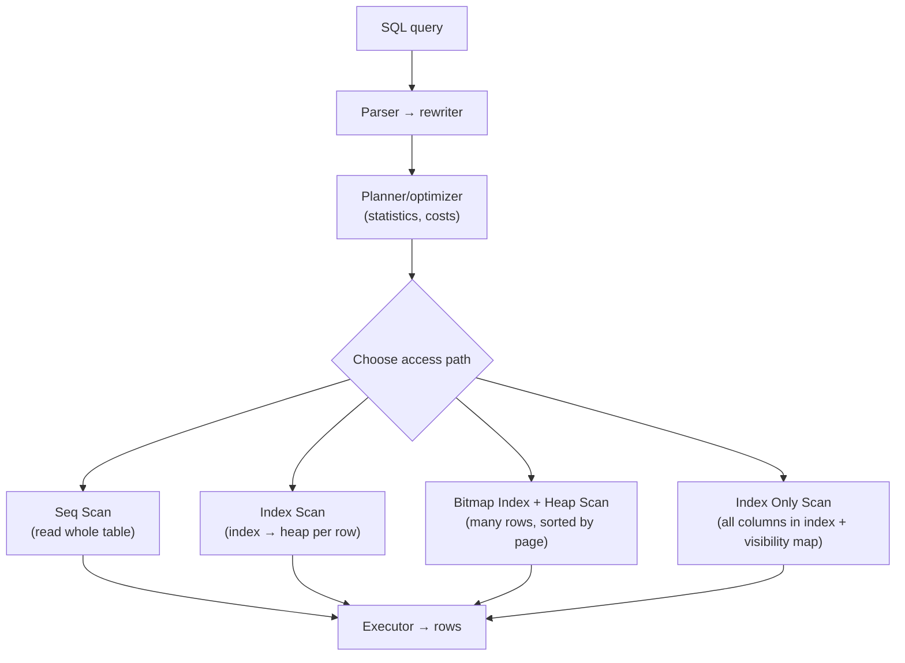
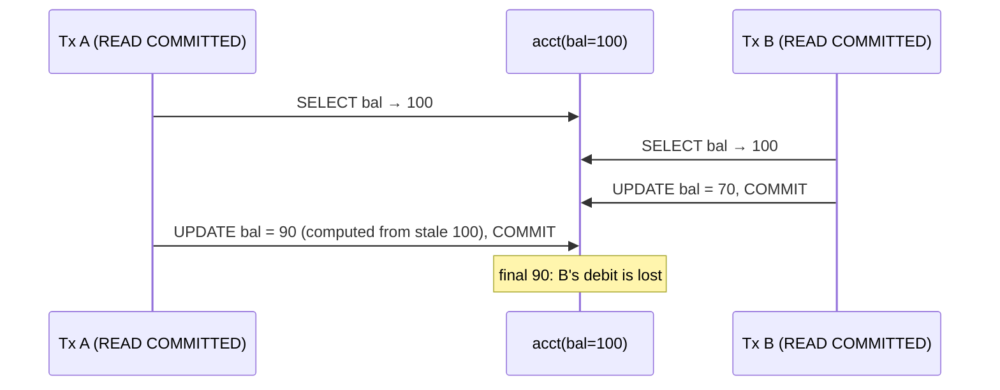
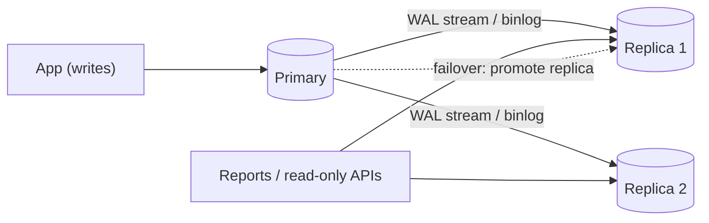

# SQL (PostgreSQL & MySQL): Interview Notes

**Why this matters in interviews:** Every backend eventually becomes a database question. Senior interviews test whether you can write correct SQL (NULLs, joins, window functions), explain **why** a query is slow (indexes, plans, statistics), and reason about concurrency (isolation levels, MVCC, locks, deadlocks). The best answers connect all three to real incidents, like a batch job fighting live traffic or a report query melting the primary.

> [!NOTE]
> Every "Predict the output" puzzle and EXPLAIN claim below was run on **PostgreSQL 16**, using the sample schema in [Section 0](#0-sample-schema). MySQL notes refer to **MySQL 8.0 / InnoDB** and are stated only where the behaviour is well established.

Difficulty legend: 🟢 Basic · 🟡 Intermediate · 🔴 Advanced · ⚡ Scenario

## Table of Contents

0. [Sample Schema](#0-sample-schema)
1. [SQL Fundamentals and NULL Semantics](#1-sql-fundamentals-and-null-semantics)
2. [Joins, Subqueries, Aggregation and Window Functions](#2-joins-subqueries-aggregation-and-window-functions)
3. [Indexes and Query Planning](#3-indexes-and-query-planning)
4. [Transactions, Isolation, MVCC and Locking](#4-transactions-isolation-mvcc-and-locking)
5. [Schema Design, Normalization and Partitioning](#5-schema-design-normalization-and-partitioning)
6. [PostgreSQL vs MySQL Specifics](#6-postgresql-vs-mysql-specifics)
7. [Replication, Scaling and Operations](#7-replication-scaling-and-operations)
8. [Coding / Hands-on](#8-coding--hands-on)
9. [Production Scenarios](#9-production-scenarios)
10. [Cheat Sheet](#10-cheat-sheet)
11. [Revision Checklist](#11-revision-checklist)
12. [Beyond Java 8](#12-beyond-java-8)

---

## 0. Sample Schema

The puzzles use this small data set. Note the deliberate `NULL`s: customer 3 has no city, and order 15 has no customer.

```sql
CREATE TABLE customers (
  id      BIGINT PRIMARY KEY,
  name    VARCHAR(50) NOT NULL,
  city    VARCHAR(50),               -- nullable on purpose
  tier    VARCHAR(10) NOT NULL DEFAULT 'FREE'
);
CREATE TABLE orders (
  id          BIGINT PRIMARY KEY,
  customer_id BIGINT REFERENCES customers(id),
  amount      NUMERIC(10,2) NOT NULL,
  status      VARCHAR(10) NOT NULL,
  created_at  DATE NOT NULL
);
CREATE TABLE events (
  event_id   VARCHAR(40) PRIMARY KEY,
  device_id  VARCHAR(20) NOT NULL,
  source     VARCHAR(10) NOT NULL,          -- ANDROID / IOS / WEB
  created_at TIMESTAMP NOT NULL
);
INSERT INTO customers VALUES
 (1,'Asha','Pune','GOLD'),(2,'Ravi','Mumbai','FREE'),(3,'Meera',NULL,'FREE'),(4,'John','Pune','SILVER');
INSERT INTO orders VALUES
 (10,1,500.00,'PAID','2024-01-05'),(11,1,250.00,'PAID','2024-01-20'),
 (12,2,900.00,'CANCELLED','2024-01-07'),(13,2,100.00,'PAID','2024-02-02'),
 (14,4,300.00,'PAID','2024-02-10'),(15,NULL,75.00,'PAID','2024-02-11');
INSERT INTO events VALUES
 ('e1','d1','ANDROID','2024-03-01 10:00'),('e2','d1','ANDROID','2024-03-01 10:05'),
 ('e3','d2','IOS','2024-03-01 11:00'),('e4','d3','WEB','2024-03-02 09:00'),
 ('e5','d2','IOS','2024-03-02 12:00'),('e6','d1','ANDROID','2024-03-03 08:00');
```

---

## 1. SQL Fundamentals and NULL Semantics

> **Mental model:** SQL is **declarative**: you describe *what* you want and the planner decides *how*. And `NULL` isn't a value, it means **"unknown"**. Any comparison with "unknown" is also unknown, which is why NULLs quietly drop rows from `WHERE` clauses and break `NOT IN`.

### Q1. 🟢 What is the logical order of evaluation of a SELECT?

`FROM` / `JOIN` → `WHERE` → `GROUP BY` → `HAVING` → `SELECT` (including window functions) → `DISTINCT` → `ORDER BY` → `LIMIT` / `OFFSET`.


<details><summary>Cross-questions</summary>

**Q:** Why can't you use a SELECT alias in WHERE?

**A:** `WHERE` is evaluated before `SELECT`, so the alias doesn't exist yet. (`ORDER BY` can use it, and PostgreSQL also allows output aliases in `GROUP BY`.)

**Q:** Why can't window functions go in WHERE?

**A:** They're computed during the SELECT phase, after WHERE. Wrap the query in a subquery or CTE and filter outside it.
</details>

### Q2. 🟢 How does three-valued logic work?

Comparisons with NULL yield **UNKNOWN**. `WHERE` keeps only rows that evaluate to **TRUE**.

#### 🎯 Predict the output

```sql
SELECT NULL = NULL AS eq, NULL IS NULL AS isnull, (NULL OR TRUE) AS o, (NULL AND FALSE) AS a;
```

<details><summary>Answer</summary>

| eq | isnull | o | a |
|---|---|---|---|
| NULL | true | true | false |

`NULL = NULL` is unknown (NULL), not true. `TRUE OR anything` is true, and `FALSE AND anything` is false. Use `IS NULL`, `IS DISTINCT FROM` (PostgreSQL) or `<=>` (MySQL null-safe equals).
</details>

### Q3. 🟢 Why do NULLs disappear from `<>` filters?

#### 🎯 Predict the output

```sql
SELECT name FROM customers WHERE city <> 'Pune';
```

<details><summary>Answer</summary>

Only `Ravi`. Meera's city is NULL, `NULL <> 'Pune'` is unknown, and unknown rows are filtered out. To include her, write `WHERE city <> 'Pune' OR city IS NULL`, or `WHERE city IS DISTINCT FROM 'Pune'`.
</details>

<details><summary>Cross-questions</summary>

**Q:** Is this a common production bug?

**A:** Very. "Exclude cancelled orders" written as `status <> 'CANCELLED'` silently drops every row where `status` is NULL. Make columns `NOT NULL` wherever the business allows it.
</details>

### Q4. 🟡 What is the `NOT IN` + NULL trap?

#### 🎯 Predict the output

```sql
-- customers who never ordered?
SELECT name FROM customers WHERE id NOT IN (SELECT customer_id FROM orders);
```

<details><summary>Answer</summary>

**Zero rows**. `orders.customer_id` contains a NULL (order 15). `x NOT IN (1, 2, 4, NULL)` becomes `x <> 1 AND x <> 2 AND x <> 4 AND x <> NULL`, and the last term is unknown for every `x`, so nothing qualifies. Use `NOT EXISTS`, which returns `Meera` correctly:

```sql
SELECT name FROM customers c
WHERE NOT EXISTS (SELECT 1 FROM orders o WHERE o.customer_id = c.id);
```
</details>

<details><summary>Cross-questions</summary>

**Q:** Is `NOT EXISTS` also faster?

**A:** Often. Planners turn it into an **anti-join**. PostgreSQL can't do that for `NOT IN` over a nullable subquery, precisely because of the NULL semantics.
</details>

### Q5. 🟢 `COUNT(*)` vs `COUNT(col)` vs `COUNT(DISTINCT col)`?

#### 🎯 Predict the output

```sql
SELECT COUNT(*), COUNT(city), COUNT(DISTINCT city) FROM customers;
```

<details><summary>Answer</summary>

`4 | 3 | 2`. `COUNT(*)` counts rows. `COUNT(city)` skips NULLs. `COUNT(DISTINCT city)` counts the distinct non-null values (Pune and Mumbai).
</details>

### Q6. 🟡 How do aggregates treat NULLs?

#### 🎯 Predict the output

```sql
SELECT AVG(x), SUM(x), COUNT(x), COUNT(*) FROM (VALUES (10),(NULL),(20)) t(x);
```

<details><summary>Answer</summary>

`AVG = 15`, `SUM = 30`, `COUNT(x) = 2`, `COUNT(*) = 3`. Aggregates **ignore NULLs**, so the average is 30/2, not 30/3. `SUM` over zero non-null rows returns **NULL**, not 0, so use `COALESCE(SUM(x), 0)`.
</details>

<details><summary>Cross-questions</summary>

**Q:** Should missing values count as zero in an "average session length"?

**A:** It's a business decision. Be explicit with `AVG(COALESCE(x, 0))` or a filter, and never rely on the default by accident.
</details>

### Q7. 🟢 How does integer division behave?

#### 🎯 Predict the output

```sql
SELECT 7/2 AS i, 7/2.0 AS d, 7 % 3 AS m;
```

<details><summary>Answer</summary>

`3 | 3.5 | 1` in PostgreSQL. Integer / integer **truncates**. MySQL's `/` returns a decimal (3.5000), and `DIV` does integer division. Percentages like `paid / total` silently become 0 in PostgreSQL unless you cast: `paid::numeric / total`.
</details>

### Q8. 🟢 What's the difference between `WHERE` and `HAVING`?

`WHERE` filters **rows** before grouping. `HAVING` filters **groups** after aggregation. Put non-aggregate conditions in `WHERE` (it's cheaper, and indexes can help).

```sql
SELECT customer_id, SUM(amount) AS total
FROM orders
WHERE status = 'PAID'
GROUP BY customer_id
HAVING SUM(amount) > 300;
```

<details><summary>Cross-questions</summary>

**Q:** Can you use `HAVING` without `GROUP BY`?

**A:** Yes. The whole table is then one group: `SELECT COUNT(*) FROM orders HAVING COUNT(*) > 5`.
</details>

### Q9. 🟢 `DELETE` vs `TRUNCATE` vs `DROP`?

| | DELETE | TRUNCATE | DROP |
|---|---|---|---|
| Removes | Selected rows (WHERE) | All rows | Table + data + definition |
| Speed | Row-by-row, logged | Fast (deallocates) | Fast |
| Triggers | Row triggers fire | Not row triggers | — |
| Transactional | Yes | Yes in PostgreSQL; **implicit commit in MySQL** | PG yes; MySQL implicit commit |
| Space | PG: dead tuples until VACUUM | Reclaimed immediately | Reclaimed |

<details><summary>Cross-questions</summary>

**Q:** Why can a huge `DELETE` hurt production?

**A:** Long locks, huge WAL or binlog volume, replica lag, and in PostgreSQL millions of dead tuples waiting for vacuum. Delete in **batches** (for example 10K rows per transaction), or drop old partitions.
</details>

### Q10. 🟢 `UNION` vs `UNION ALL`?

`UNION` removes duplicates, which needs a sort or hash step. `UNION ALL` keeps every row and is cheaper. Use `UNION ALL` unless you truly need deduplication.

<details><summary>Cross-questions</summary>

**Q:** What must the two sides have in common?

**A:** The same number of columns, with compatible types. The column names come from the first query.
</details>

### Q11. 🟢 What do `COALESCE`, `NULLIF` and `CASE` do?

`COALESCE(a, b, c)` returns the first non-null argument. `NULLIF(a, b)` returns NULL if `a = b`, which is handy to avoid divide-by-zero: `x / NULLIF(y, 0)`. `CASE WHEN ... THEN ... ELSE ... END` gives conditional logic, and `SUM(CASE WHEN ...)` gives conditional aggregation.

```sql
SELECT customer_id,
       SUM(CASE WHEN status = 'PAID' THEN amount ELSE 0 END)      AS paid,
       SUM(CASE WHEN status = 'CANCELLED' THEN amount ELSE 0 END) AS cancelled
FROM orders GROUP BY customer_id;
```

<details><summary>Cross-questions</summary>

**Q:** Is there a PostgreSQL shortcut for conditional aggregation?

**A:** Yes: `SUM(amount) FILTER (WHERE status = 'PAID')`.
</details>

### Q12. 🟢 How are NULLs sorted?

PostgreSQL sorts NULLs **last in ascending order** and first in descending order by default, and you can control it with `NULLS FIRST` or `NULLS LAST`. MySQL treats NULLs as the **smallest** values (first in ascending order). Be explicit in queries that must behave the same across databases.

<details><summary>Cross-questions</summary>

**Q:** What does `DISTINCT` do with NULLs?

**A:** It treats every NULL as one group, so `SELECT DISTINCT city` returns Mumbai, Pune and a single NULL row.
</details>

### Q13. 🟡 What are constraints, and why enforce them in the database?

`PRIMARY KEY`, `UNIQUE`, `NOT NULL`, `CHECK`, `FOREIGN KEY` and `EXCLUDE` (PostgreSQL). They guarantee integrity **regardless of which app or script** writes the data, and they're the only reliable protection against concurrent duplicates (see check-then-insert races).

<details><summary>Cross-questions</summary>

**Q:** Do foreign keys hurt performance?

**A:** They add checks on insert and delete. The bigger issue is **unindexed FK columns**: deleting a parent then scans the child table, and joins suffer. Index FK columns (PostgreSQL doesn't do it automatically).
</details>

### Q14. 🟡 `CHAR` vs `VARCHAR` vs `TEXT`?

In PostgreSQL, `TEXT` and `VARCHAR(n)` perform the same, and `VARCHAR(n)` only adds a length check. `CHAR(n)` pads with spaces and is rarely useful. In MySQL, `VARCHAR` is stored inline with a length prefix, while `TEXT` columns have indexing limits (prefix indexes) and may be stored off-page.

<details><summary>Cross-questions</summary>

**Q:** Which type for money?

**A:** `NUMERIC` / `DECIMAL(p, s)`, never FLOAT or DOUBLE. Or integer minor units (cents) in a `BIGINT`.
</details>

### Q15. 🟡 How should you store timestamps?

Store instants in **UTC**. In PostgreSQL, use `TIMESTAMPTZ`: it stores UTC and converts on display according to the session time zone. In MySQL, `TIMESTAMP` converts to UTC for storage (with a 2038 range limit), while `DATETIME` stores exactly what you give it. Keep the application servers, the JDBC settings and the DB time zone consistent.

<details><summary>Cross-questions</summary>

**Q:** Which bug does naive `TIMESTAMP` (without time zone) cause?

**A:** Events from different regions or DST changes are ambiguous, and "last 24 hours" queries shift by hours around DST transitions.
</details>

### Q16. 🟢 What's the difference between DDL, DML, DCL and TCL?

**DDL** is `CREATE`, `ALTER`, `DROP`. **DML** is `SELECT`, `INSERT`, `UPDATE`, `DELETE`. **DCL** is `GRANT`, `REVOKE`. **TCL** is `BEGIN`, `COMMIT`, `ROLLBACK`, `SAVEPOINT`.

<details><summary>Cross-questions</summary>

**Q:** Is DDL transactional?

**A:** In PostgreSQL, **yes**: you can roll back a `CREATE TABLE` or `ALTER`. In MySQL, most DDL causes an **implicit commit**, which matters for migration scripts.
</details>

### Q17. 🟡 What does `EXISTS` vs `IN` vs `JOIN` mean for semi-joins?

- `EXISTS` asks "is there at least one match?", and it stops at the first one.
- `IN (subquery)` is similar, and planners usually turn both into semi-joins.
- A `JOIN` **duplicates** the left rows when there are several matches.

Use `EXISTS` or `IN` when you only need to filter, not to fetch columns from the other table.

<details><summary>Cross-questions</summary>

**Q:** Why can a join-based "customers with orders" return duplicates?

**A:** A customer with 2 orders appears twice. Patching that with `DISTINCT` works, but it's wasteful. `EXISTS` states the intent.
</details>

### Q18. 🟡 What are CTEs, and are they optimisation fences?

`WITH x AS (...)` names a subquery. In **PostgreSQL 12+**, non-recursive CTEs that are referenced once are **inlined** (optimised like subqueries) unless you write `AS MATERIALIZED`. Before version 12, they were always materialised (a fence). MySQL 8 supports CTEs, including recursive ones.

<details><summary>Cross-questions</summary>

**Q:** When would you force `MATERIALIZED`?

**A:** When the CTE is expensive and referenced several times, or to stop the planner pushing a bad predicate into it.
</details>

---
## 2. Joins, Subqueries, Aggregation and Window Functions

> **Mental model:** A **join** pairs rows from two tables, like matching guests to their tables at a wedding. **LEFT JOIN** keeps every guest, even the ones without a table. **Window functions** are *looking around the room without leaving your seat*: each row can see its neighbours (rank, running total, previous value) while staying its own row, unlike `GROUP BY`, which merges rows together.

### Q19. 🟢 What are the join types?

| Join | Returns |
|---|---|
| `INNER` | Only matching pairs |
| `LEFT [OUTER]` | All left rows; right columns NULL if no match |
| `RIGHT [OUTER]` | All right rows |
| `FULL [OUTER]` | All rows from both (MySQL lacks it — emulate with UNION) |
| `CROSS` | Cartesian product |
| Self join | Table joined to itself (e.g., employee → manager) |

<details><summary>Cross-questions</summary>

**Q:** How do you emulate a FULL OUTER JOIN in MySQL?

**A:** Use `LEFT JOIN ... UNION ... RIGHT JOIN ... WHERE left.id IS NULL`, or `UNION ALL` with an anti-join on the second part.
</details>

### Q20. 🔴 Where should a filter on the right table go in a LEFT JOIN, in ON or in WHERE?

#### 🎯 Predict the output

```sql
-- A: filter in WHERE
SELECT c.name, o.id FROM customers c
LEFT JOIN orders o ON o.customer_id = c.id
WHERE o.status = 'PAID' ORDER BY c.name, o.id;

-- B: filter in ON
SELECT c.name, o.id FROM customers c
LEFT JOIN orders o ON o.customer_id = c.id AND o.status = 'PAID'
ORDER BY c.name, o.id;
```

<details><summary>Answer</summary>

**A** returns 4 rows: (Asha 10), (Asha 11), (John 14), (Ravi 13). **Meera disappears**. Her joined `o.status` is NULL, and `WHERE` removes the row, which **silently turns the LEFT JOIN into an INNER JOIN**.

**B** returns 5 rows: the same four plus **(Meera, NULL)**. The filter restricts which orders match, but every customer stays.
</details>

<details><summary>Cross-questions</summary>

**Q:** When is a WHERE filter on the right table correct?

**A:** When you deliberately want an anti-join: `WHERE o.id IS NULL` finds customers without matching orders.
</details>

### Q21. 🟡 What does GROUP BY do with NULL keys?

#### 🎯 Predict the output

```sql
SELECT customer_id, SUM(amount) FROM orders
GROUP BY customer_id ORDER BY customer_id NULLS LAST;
```

<details><summary>Answer</summary>

| customer_id | sum |
|---|---|
| 1 | 750.00 |
| 2 | 1000.00 |
| 4 | 300.00 |
| NULL | 75.00 |

All the NULL keys form **one group**. Customer 2's total includes the cancelled order (900), because nothing filtered it out, which is a classic reporting bug.
</details>

### Q22. 🟡 Correlated vs uncorrelated subqueries?

An **uncorrelated** subquery runs independently (once). A **correlated** subquery references the outer row, so it's logically evaluated per row. Modern planners often decorrelate these into joins, but not always, so check `EXPLAIN`.

```sql
-- correlated: latest order per customer
SELECT c.name,
       (SELECT MAX(o.created_at) FROM orders o WHERE o.customer_id = c.id) AS last_order
FROM customers c;
```

<details><summary>Cross-questions</summary>

**Q:** What's the PostgreSQL feature for "top-N per group" with correlation?

**A:** `LATERAL` joins: `LEFT JOIN LATERAL (SELECT ... WHERE o.customer_id = c.id ORDER BY created_at DESC LIMIT 3) x ON true`. MySQL 8.0.14+ supports `LATERAL` too.
</details>

### Q23. 🟡 `RANK` vs `DENSE_RANK` vs `ROW_NUMBER`?

#### 🎯 Predict the output

```sql
SELECT id, amount,
       RANK()       OVER (ORDER BY amount DESC) r,
       DENSE_RANK() OVER (ORDER BY amount DESC) dr,
       ROW_NUMBER() OVER (ORDER BY amount DESC) rn
FROM (VALUES (1,300),(2,300),(3,200),(4,100)) t(id, amount);
```

<details><summary>Answer</summary>

| id | amount | r | dr | rn |
|---|---|---|---|---|
| 1 | 300 | 1 | 1 | 1 |
| 2 | 300 | 1 | 1 | 2 |
| 3 | 200 | **3** | **2** | 3 |
| 4 | 100 | 4 | 3 | 4 |

`RANK` leaves **gaps** after ties, `DENSE_RANK` doesn't, and `ROW_NUMBER` is always unique (its order among ties is arbitrary unless you add a tiebreaker).
</details>

<details><summary>Cross-questions</summary>

**Q:** Which do you use for "second highest salary", including ties?

**A:** `DENSE_RANK() = 2`.
</details>

### Q24. 🟡 How do you get the latest row per group?

#### 🎯 Predict the output

```sql
SELECT device_id, event_id, created_at FROM (
  SELECT e.*, ROW_NUMBER() OVER (PARTITION BY device_id ORDER BY created_at DESC) rn
  FROM events e
) x WHERE rn = 1 ORDER BY device_id;
```

<details><summary>Answer</summary>

| device_id | event_id | created_at |
|---|---|---|
| d1 | e6 | 2024-03-03 08:00 |
| d2 | e5 | 2024-03-02 12:00 |
| d3 | e4 | 2024-03-02 09:00 |

This is the standard "latest event per device" pattern. In PostgreSQL, `SELECT DISTINCT ON (device_id) * FROM events ORDER BY device_id, created_at DESC` is a concise alternative.
</details>

<details><summary>Cross-questions</summary>

**Q:** Which index helps this query?

**A:** `(device_id, created_at DESC)`, which lets the database walk each device's newest row cheaply.
</details>

### Q25. 🟡 How do running totals and moving averages work?

#### 🎯 Predict the output

```sql
SELECT id, amount, SUM(amount) OVER (ORDER BY id) AS running
FROM orders WHERE status = 'PAID' ORDER BY id;
```

<details><summary>Answer</summary>

| id | amount | running |
|---|---|---|
| 10 | 500.00 | 500.00 |
| 11 | 250.00 | 750.00 |
| 13 | 100.00 | 850.00 |
| 14 | 300.00 | 1150.00 |
| 15 | 75.00 | 1225.00 |

With an `ORDER BY` in the window, the default frame is `RANGE BETWEEN UNBOUNDED PRECEDING AND CURRENT ROW`, which gives the running total. For a 3-row moving average, use `AVG(amount) OVER (ORDER BY id ROWS BETWEEN 2 PRECEDING AND CURRENT ROW)`.
</details>

<details><summary>Cross-questions</summary>

**Q:** What's the trap with the default `RANGE` frame when there are ties?

**A:** Rows that tie on the `ORDER BY` value are all included in each other's "current row" range, so they get the **same** running total. Use `ROWS` for strict row-by-row behaviour.
</details>

### Q26. 🟡 What do `LAG` and `LEAD` do?

They read the previous or next row's value within the window. They're useful for deltas and session gaps:

```sql
SELECT device_id, created_at,
       created_at - LAG(created_at) OVER (PARTITION BY device_id ORDER BY created_at) AS gap
FROM events;
```

<details><summary>Cross-questions</summary>

**Q:** How do you split events into "sessions" (a new session after 30 minutes of inactivity)?

**A:** Flag the rows where `gap > 30 min` (or where there's no previous row), then compute a running `SUM(flag)` per device to get a session number.
</details>

### Q27. 🟡 How do you pivot rows into columns?

Use conditional aggregation (`SUM(CASE WHEN source = 'IOS' THEN 1 ELSE 0 END) AS ios`), which is portable, or `COUNT(*) FILTER (WHERE ...)` in PostgreSQL. PostgreSQL's `crosstab` (the tablefunc extension) exists but is rarely needed.

```sql
SELECT DATE(created_at) AS day,
       COUNT(*) FILTER (WHERE source = 'ANDROID') AS android,
       COUNT(*) FILTER (WHERE source = 'IOS')     AS ios,
       COUNT(*) FILTER (WHERE source = 'WEB')     AS web
FROM events GROUP BY DATE(created_at) ORDER BY day;
```

<details><summary>Cross-questions</summary>

**Q:** Why keep pivots out of the database for dynamic columns?

**A:** SQL needs a fixed set of columns. Dynamic pivots belong in the reporting layer, or in generated SQL whose column names come from an allow-list.
</details>

### Q28. 🟡 What are recursive CTEs used for?

They walk hierarchies and graphs: org charts, category trees, bill-of-materials, and generating date series.

```sql
WITH RECURSIVE days(d) AS (
  SELECT DATE '2024-03-01'
  UNION ALL
  SELECT d + 1 FROM days WHERE d < DATE '2024-03-05'
)
SELECT d FROM days;
```

<details><summary>Cross-questions</summary>

**Q:** How do you stop infinite recursion on a cyclic graph?

**A:** Track the visited path (an array in PostgreSQL) and exclude cycles, or cap the depth. PostgreSQL 14+ also has a `CYCLE` clause.
</details>

### Q29. 🟡 How do you find duplicate rows and delete all but one?

```sql
-- find
SELECT device_id, created_at, COUNT(*) FROM events
GROUP BY device_id, created_at HAVING COUNT(*) > 1;

-- delete all but the smallest event_id per duplicate group (PostgreSQL)
DELETE FROM events e
USING (
  SELECT event_id, ROW_NUMBER() OVER (PARTITION BY device_id, created_at ORDER BY event_id) rn
  FROM events
) d
WHERE e.event_id = d.event_id AND d.rn > 1;
```

<details><summary>Cross-questions</summary>

**Q:** How do you prevent duplicates from coming back?

**A:** Add a **unique constraint** on the natural key, and make the ingestion use `ON CONFLICT DO NOTHING`.
</details>

### Q30. 🟡 How do you get the Nth highest value?

```sql
SELECT DISTINCT amount FROM orders ORDER BY amount DESC OFFSET 1 LIMIT 1;           -- 2nd highest
-- or with ties handled explicitly:
SELECT amount FROM (SELECT amount, DENSE_RANK() OVER (ORDER BY amount DESC) dr FROM orders) x
WHERE dr = 2 LIMIT 1;
```

<details><summary>Cross-questions</summary>

**Q:** What should it return if there's no 2nd value?

**A:** Clarify with the interviewer. Usually NULL, which you get by wrapping the query: `SELECT (SELECT ... ) AS second`.
</details>

### Q31. 🟡 Do `GROUP BY` rules differ between PostgreSQL and MySQL?

PostgreSQL requires every non-aggregated SELECT column to be in `GROUP BY`, or functionally dependent on the primary key being grouped. MySQL 8 enforces this too, because `ONLY_FULL_GROUP_BY` is on by default. Old MySQL modes allowed arbitrary values from the group, which caused silent bugs.

<details><summary>Cross-questions</summary>

**Q:** What's "functional dependency" here?

**A:** If you group by `customers.id` (the PK), you can select `customers.name` without grouping by it, because the PK determines it.
</details>

### Q32. 🟡 What are `GROUPING SETS`, `ROLLUP` and `CUBE`?

They compute several levels of aggregation in one query: subtotals and grand totals.

```sql
SELECT source, DATE(created_at) AS day, COUNT(*)
FROM events
GROUP BY ROLLUP (source, DATE(created_at));
```

This gives counts per (source, day), per source, and a grand total, with NULLs marking the rolled-up levels. Use `GROUPING()` to tell those rollup NULLs apart from real NULL values.

<details><summary>Cross-questions</summary>

**Q:** Does MySQL support these?

**A:** `WITH ROLLUP` yes. `CUBE` and `GROUPING SETS` aren't supported in MySQL 8.0.
</details>

### Q33. 🟡 What's the difference between `JOIN ... USING` and `ON`, and what is a natural join?

`USING (col)` joins on a column with the same name and outputs it once. `NATURAL JOIN` joins on **all** columns with the same name. It's dangerous, because adding a column (such as `created_at`) to both tables silently changes the join.

<details><summary>Cross-questions</summary>

**Q:** Would you ever use `NATURAL JOIN` in production code?

**A:** No. Be explicit.
</details>

### Q34. 🟡 How do you compute percentages of a total with window functions?

```sql
SELECT source, COUNT(*) AS n,
       ROUND(100.0 * COUNT(*) / SUM(COUNT(*)) OVER (), 1) AS pct
FROM events GROUP BY source;
```

`SUM(COUNT(*)) OVER ()` is a window function applied over the aggregated rows, which gives the grand total on every row.

<details><summary>Cross-questions</summary>

**Q:** Why `100.0` and not `100`?

**A:** To avoid integer division (Q7).
</details>

### Q35. 🟡 How do you write an upsert?

```sql
-- PostgreSQL
INSERT INTO events(event_id, device_id, source, created_at)
VALUES ('e7','d4','WEB','2024-03-04 10:00')
ON CONFLICT (event_id) DO NOTHING;

INSERT INTO customers(id, name, city) VALUES (2, 'Ravi K', 'Pune')
ON CONFLICT (id) DO UPDATE SET name = EXCLUDED.name, city = EXCLUDED.city;
```

```sql
-- MySQL
INSERT INTO customers(id, name, city) VALUES (2, 'Ravi K', 'Pune')
ON DUPLICATE KEY UPDATE name = VALUES(name), city = VALUES(city);   -- 8.0.20+ prefers row alias syntax
```

<details><summary>Cross-questions</summary>

**Q:** What's the gotcha with MySQL's `ON DUPLICATE KEY` when a table has several unique keys?

**A:** It triggers on a conflict with **any** unique index, which may update an unexpected row. PostgreSQL requires you to name the conflict target.
</details>

### Q36. 🟡 `MERGE` statements?

PostgreSQL 15+ supports SQL-standard `MERGE` (`WHEN MATCHED THEN UPDATE`, `WHEN NOT MATCHED THEN INSERT`). MySQL has no `MERGE`, so use `INSERT ... ON DUPLICATE KEY UPDATE`. BigQuery uses `MERGE` heavily for deduplicating ingestion.

<details><summary>Cross-questions</summary>

**Q:** `MERGE` or `ON CONFLICT` for concurrent upserts in PostgreSQL?

**A:** `ON CONFLICT` is built for concurrency: it's atomic against unique-index races. `MERGE` can still fail with a unique violation under concurrent inserts.
</details>

---

## 3. Indexes and Query Planning

> **Mental model:** A B-tree index is a *phone book sorted by (last name, first name)*. Looking up "Sharma, Priya" is fast. Finding everyone named "Priya" (the second column alone) means reading the whole book. Wrapping the name in a function ("lower-cased last name") uses a different ordering, so the phone book no longer helps unless you print one sorted that way.



### Q37. 🟢 What is an index, and what does it cost?

It's an extra data structure (a B-tree by default) that maps key values to row locations for fast lookups, range scans and ordering. The costs are **slower writes** (every insert or update maintains every index), storage, and more work for vacuum and cache.

<details><summary>Cross-questions</summary>

**Q:** Why not index every column?

**A:** Write amplification. A 200K-row batch insert into a table with 10 indexes does 11 structure updates per row. Index what your queries need, and drop unused indexes (`pg_stat_user_indexes.idx_scan = 0`).
</details>

### Q38. 🟡 What is the composite-index leftmost-prefix rule?

With index `(device_id, created_at)`:

| Query predicate | Uses index efficiently? |
|---|---|
| `device_id = ?` | Yes |
| `device_id = ? AND created_at > ?` | **Yes** (equality then range) |
| `created_at > ?` alone | **No** — verified: PostgreSQL chose a Seq Scan on 200K rows |
| `device_id = ? ORDER BY created_at` | Yes, and avoids a sort |

**Column order rule of thumb:** equality columns first, then range or sort columns. Prefer the more selective equality column first when the queries allow it.

<details><summary>Cross-questions</summary>

**Q:** Can PostgreSQL ever use the index for the second column alone?

**A:** It may do a full index scan if that's cheaper than the table (for example, when the index covers the query), but it can't *seek*. PostgreSQL 18 adds "skip scan" for some such cases. MySQL 8.0.13+ has a skip-scan optimisation.
</details>

### Q39. 🟡 Why does wrapping a column in a function prevent index use?

The index stores `email`, not `lower(email)`. **Verified** on 200K rows: `WHERE lower(email) = '...'` → Parallel Seq Scan. After `CREATE INDEX ON big_events (lower(email))`, the same query → Index Scan.

```sql
CREATE INDEX idx_lower_email ON users (lower(email));      -- expression index (PostgreSQL)
-- MySQL 8.0.13+: functional key parts
CREATE INDEX idx_lower_email ON users ((lower(email)));
```

The same applies to `DATE(created_at) = '2024-03-01'`. Rewrite it as a range: `created_at >= '2024-03-01' AND created_at < '2024-03-02'`.

<details><summary>Cross-questions</summary>

**Q:** What other hidden "function" kills index use?

**A:** **Implicit type conversion**, for example comparing a `VARCHAR` column with a number in MySQL (`WHERE phone = 12345`), which casts every row. Match the parameter types to the column types (watch the JDBC setters).
</details>

### Q40. 🟡 Why doesn't `LIKE 'abc%'` always use a B-tree index in PostgreSQL?

In a non-`C` collation (for example the common `en_US.UTF-8` or `C.UTF-8`), a plain B-tree can't serve prefix `LIKE`. **Verified**: on `C.UTF-8`, `email LIKE 'User42%'` did a Seq Scan with a normal index, and a Bitmap Index Scan after `CREATE INDEX ... (email text_pattern_ops)`. `LIKE '%abc'` (leading wildcard) can't use a B-tree at all. Use a **trigram GIN index** (`pg_trgm`) or full-text search.

<details><summary>Cross-questions</summary>

**Q:** How does MySQL behave?

**A:** InnoDB B-tree indexes can serve `LIKE 'abc%'` prefix searches. Leading wildcards still need full scans or a full-text index.
</details>

### Q41. 🔴 What is an index-only scan, and why did it appear only after VACUUM?

If every column the query needs is in the index, PostgreSQL can skip the table (heap). But MVCC visibility lives in the heap, so PostgreSQL checks the **visibility map**: pages marked all-visible don't need a heap visit. **Verified**: `SELECT device_id, created_at WHERE device_id = 'dev42'` used a Bitmap Heap Scan right after the table was loaded, and an **Index Only Scan after `VACUUM`** set the visibility map.

<details><summary>Cross-questions</summary>

**Q:** How do you make more queries index-only?

**A:** Use covering indexes: `CREATE INDEX ... (device_id) INCLUDE (created_at, source)` (PostgreSQL 11+). Keep autovacuum healthy on hot tables. In MySQL InnoDB, a secondary index always contains the PK, so "covering" means the index columns plus the PK columns.
</details>

### Q42. 🟡 Clustered vs non-clustered indexes (InnoDB vs PostgreSQL)?

| | MySQL InnoDB | PostgreSQL |
|---|---|---|
| Table storage | **Clustered by primary key** (table = PK B-tree) | Heap (unordered); all indexes secondary |
| Secondary index leaf | Stores **PK value** → second lookup in PK tree | Stores tuple location (ctid) |
| PK choice impact | Big: random PKs (UUIDv4) fragment the table | Smaller (index only) |

<details><summary>Cross-questions</summary>

**Q:** Why are auto-increment or time-ordered PKs recommended for InnoDB?

**A:** Inserts append at the end of the clustered B-tree. Random UUIDs cause page splits, fragmentation and poor buffer-pool locality.

**Q:** What does PostgreSQL's `CLUSTER` command do?

**A:** It physically reorders the table **once** by an index. The order isn't maintained afterwards, and it takes an exclusive lock.
</details>

### Q43. 🟡 How do you read `EXPLAIN` and `EXPLAIN ANALYZE`?

- `EXPLAIN` shows the **estimated** plan: node types, estimated rows and costs.
- `EXPLAIN (ANALYZE, BUFFERS)` **runs** the query and adds the actual rows, timings, loops and buffer hits and reads.

Read the tree bottom-up (from the most indented node). Look for estimated vs actual row mismatches (bad statistics), Seq Scans on large tables with selective filters, sorts or hashes spilling to disk, and nested loops with huge loop counts.

<details><summary>Cross-questions</summary>

**Q:** Why be careful with `EXPLAIN ANALYZE` on production?

**A:** It **executes** the statement. For `UPDATE` or `DELETE`, wrap it in `BEGIN; ... ROLLBACK;`, and beware of long-running queries.
</details>

### Q44. 🟡 When is a sequential scan the *right* choice?

When a large fraction of the table matches (low selectivity). **Verified**: `WHERE source = 'IOS'` (a third of the rows) used a Seq Scan even with other indexes available. Random index lookups for a third of the table would cost more than reading it sequentially.

<details><summary>Cross-questions</summary>

**Q:** Would an index on `source` alone help?

**A:** Rarely. It's low cardinality. It can help as part of a composite index (`(source, created_at)`), or as a **partial index** for a rare value.
</details>

### Q45. 🟡 What are partial indexes?

An index on a subset of rows: `CREATE INDEX ON orders (created_at) WHERE status = 'PENDING'`. It's small and fast when queries always include that predicate. It's perfect for queues and "active" rows. That's PostgreSQL; MySQL has no partial indexes.

<details><summary>Cross-questions</summary>

**Q:** How does it help a DB-backed job queue?

**A:** `WHERE status = 'PENDING' ORDER BY created_at LIMIT 100 FOR UPDATE SKIP LOCKED` stays fast, however many completed jobs accumulate.
</details>

### Q46. 🟡 Which index types does PostgreSQL offer?

| Type | Good for |
|---|---|
| **B-tree** (default) | Equality, ranges, sorting |
| **Hash** | Equality only (WAL-logged since PG 10) |
| **GIN** | Arrays, JSONB containment (`@>`), full-text, trigrams |
| **GiST / SP-GiST** | Geometric, ranges, nearest-neighbour, exclusion constraints |
| **BRIN** | Huge, naturally ordered tables (time-series): tiny index of block ranges |

<details><summary>Cross-questions</summary>

**Q:** Why is BRIN great for append-only event tables?

**A:** Rows arrive roughly in time order, so each block range holds a narrow time window. The index is kilobytes instead of gigabytes, and still prunes most blocks for time-range queries.
</details>

### Q47. 🟡 How do statistics affect plans, and when do you run ANALYZE?

The planner estimates row counts from per-column statistics (histograms, most common values, n_distinct). Stale statistics after big loads cause bad plans. Autovacuum runs ANALYZE automatically, but **after a bulk load of 200K+ rows, run `ANALYZE table` explicitly**. For correlated columns (city and zip), PostgreSQL has **extended statistics** (`CREATE STATISTICS`).

<details><summary>Cross-questions</summary>

**Q:** How do you spot bad statistics in a plan?

**A:** `EXPLAIN ANALYZE` shows estimated rows=1 against actual rows=500000, which leads to the wrong join strategy (for example, a nested loop).
</details>

### Q48. 🟡 What are the join algorithms, and when is each used?

| Algorithm | Best when |
|---|---|
| **Nested loop** | Small outer side + index on inner join key |
| **Hash join** | Large unsorted inputs, equality joins (build hash on smaller side) |
| **Merge join** | Both inputs sorted on join key (e.g., via indexes) |

MySQL 8.0.18+ added hash joins. Before that it used nested loops (with block nested loop).

<details><summary>Cross-questions</summary>

**Q:** Why can a nested loop become catastrophic?

**A:** If the outer side's estimate is 10 rows but the reality is 1M, the inner lookup runs 1M times. That's usually a statistics problem.
</details>

### Q49. 🟡 Why is `OFFSET` pagination slow on deep pages, and what replaces it?

`OFFSET 100000 LIMIT 50` still reads and discards 100K rows. **Keyset pagination** (`WHERE (created_at, id) < (:lastTs, :lastId) ORDER BY created_at DESC, id DESC LIMIT 50`) seeks straight to the position using an index. It's stable under concurrent inserts too.

<details><summary>Cross-questions</summary>

**Q:** Why include `id` in the keyset?

**A:** As a **tiebreaker**, so rows with the same timestamp aren't skipped or duplicated across pages.
</details>

### Q50. 🟡 How do you index JSON columns?

In PostgreSQL, use `JSONB` with a **GIN** index for containment (`WHERE payload @> '{"source":"IOS"}'`), or an **expression index** on one extracted key: `((payload->>'deviceId'))`. In MySQL 8, index generated columns or functional indexes that extract JSON paths.

<details><summary>Cross-questions</summary>

**Q:** When should a JSON attribute become a real column?

**A:** When it's filtered, joined or sorted often. Real columns get better statistics, constraints and simpler indexes.
</details>

### Q51. 🟡 What is index selectivity and cardinality?

**Cardinality** is the number of distinct values. **Selectivity** is the fraction of rows a predicate returns. High-cardinality, selective predicates benefit most from indexes. Low-cardinality columns (booleans, status) rarely do alone, except through partial indexes or as the leading equality column of a composite index.

<details><summary>Cross-questions</summary>

**Q:** Which is a better leading column, `tenant_id` or `event_id`?

**A:** It depends on the queries. If every query filters by tenant first (multi-tenant isolation), `(tenant_id, ...)` serves all of them. For point lookups by `event_id`, use the unique index on `event_id`.
</details>

### Q52. 🟡 How do you create an index on a busy production table without blocking writes?

In PostgreSQL, `CREATE INDEX CONCURRENTLY` doesn't block writes. It's slower, can't run inside a transaction, and may leave an **INVALID** index on failure (drop and retry it). MySQL InnoDB supports online DDL (`ALGORITHM=INPLACE, LOCK=NONE`) for index creation, and gh-ost or pt-online-schema-change are tools for other changes.

<details><summary>Cross-questions</summary>

**Q:** How do Flyway migrations handle `CONCURRENTLY`?

**A:** The migration must run outside a transaction. Flyway detects this for PostgreSQL non-transactional statements in newer versions, or you configure it explicitly.
</details>

### Q53. 🟡 Why can an index make things slower?

It slows writes. The planner may choose it wrongly because of stale statistics (random IO for many rows). It bloats (PostgreSQL). And duplicate or overlapping indexes waste memory. Measure with `pg_stat_statements` and the index usage stats.

<details><summary>Cross-questions</summary>

**Q:** How do you find unused indexes in PostgreSQL?

**A:** `SELECT relname, indexrelname, idx_scan FROM pg_stat_user_indexes WHERE idx_scan = 0`. Check the replicas too, because statistics are per server.
</details>

### Q54. 🟡 What are covering indexes and `INCLUDE` columns?

A **covering** index holds every column the query needs, which enables index-only scans. PostgreSQL 11+ `INCLUDE (...)` adds non-key payload columns to the leaf pages without affecting ordering or uniqueness. SQL Server has the same feature. MySQL gets it implicitly through the PK in secondary indexes, or by adding columns to the key.

<details><summary>Cross-questions</summary>

**Q:** Why not just add the extra columns as key columns?

**A:** Key columns affect uniqueness and ordering, and make the internal nodes bigger. `INCLUDE` keeps the tree lean.
</details>

### Q55. 🟡 How do you find the slowest queries?

In PostgreSQL, use **`pg_stat_statements`**: total time, calls and mean time per normalised query. Combine it with `log_min_duration_statement` and `auto_explain` for plans. In MySQL, use the **slow query log**, `performance_schema` or the `sys` schema views. Optimise by **total time** (calls × mean), not just the single slowest run.

<details><summary>Cross-questions</summary>

**Q:** Why total time?

**A:** A 5 ms query called 2 million times costs more than a 10 s report run once a day.
</details>

### Q56. 🟡 Can you run the "index or not" checklist for a slow query?

1. Get the actual SQL and parameters.
2. Run `EXPLAIN (ANALYZE, BUFFERS)`.
3. Check the estimates against the actual rows (statistics?).
4. Check whether an index exists that matches the predicates and the order (leftmost prefix, expressions, types, collation).
5. Check whether the query can be rewritten (sargable ranges, `EXISTS`, avoiding `SELECT *`).
6. Consider a covering or partial index.
7. Re-measure, and check the write impact.

<details><summary>Cross-questions</summary>

**Q:** What does "sargable" mean?

**A:** **S**earch **ARG**ument **able**: a predicate written so an index can be used (`col >= x`, not `f(col) = x`).
</details>

---
## 4. Transactions, Isolation, MVCC and Locking

> **Mental model:** **MVCC** gives every transaction a *snapshot photograph* of the database. Readers look at their photo and never block writers. Writers create new row versions instead of erasing the old ones. **Isolation levels** decide *when* your photo is taken: once per statement (READ COMMITTED) or once per transaction (REPEATABLE READ). **Locks** handle the cases a photo can't: two people editing the same row.

### Q57. 🟢 What does ACID mean?

- **Atomicity**: all or nothing (undo or rollback).
- **Consistency**: the constraints hold before and after.
- **Isolation**: concurrent transactions don't see each other's partial work (to the degree set by the isolation level).
- **Durability**: committed work survives crashes (WAL / redo log, fsync).

<details><summary>Cross-questions</summary>

**Q:** Which mechanism provides durability in PostgreSQL and InnoDB?

**A:** Write-ahead logging: PostgreSQL's **WAL**, and InnoDB's **redo log**. The log is flushed at commit, and the data pages are written later.
</details>

### Q58. 🟡 What are the read anomalies, and which isolation level prevents each?

| Anomaly | Meaning |
|---|---|
| Dirty read | See another tx's **uncommitted** changes |
| Non-repeatable read | Same row read twice → different values (other tx committed an update) |
| Phantom read | Same query twice → different set of rows (other tx inserted) |
| Lost update | Two read-modify-write cycles overwrite each other |
| Write skew | Two txs read overlapping data, write disjoint rows, jointly violate a rule |

| Level | Dirty | Non-repeatable | Phantom | Notes |
|---|---|---|---|---|
| READ UNCOMMITTED | allowed* | allowed | allowed | *PostgreSQL treats it as READ COMMITTED |
| **READ COMMITTED** (PG default) | no | allowed | allowed | new snapshot **per statement** |
| **REPEATABLE READ** (MySQL default) | no | no | PG: no; InnoDB: consistent reads no, locking reads use gap/next-key locks | snapshot **per transaction** |
| SERIALIZABLE | no | no | no | PG: SSI aborts conflicting txs; InnoDB: locking reads |

<details><summary>Cross-questions</summary>

**Q:** Does REPEATABLE READ prevent write skew?

**A:** No. Only SERIALIZABLE (or explicit locks or constraints) does. The classic example: two doctors both check "at least one other doctor is on call" and both go off call.
</details>

### Q59. 🔴 How does the lost update play out at each isolation level?

This was verified on PostgreSQL 16 with two concurrent sessions, starting from `acct.bal = 100`:

| Pattern | Isolation | Session A | Session B | Final `bal` |
|---|---|---|---|---|
| App reads 100, computes, writes constant | READ COMMITTED | `SET bal = 100-10` | `SET bal = 100-30` | **90** (B's −30 **lost**) |
| `UPDATE ... SET bal = bal - x` | READ COMMITTED | `bal - 10` | `bal - 30` | **60** (correct; second waits for row lock, re-reads) |
| A reads then updates | REPEATABLE READ | `bal - 10` → **ERROR: could not serialize access due to concurrent update** | `bal - 30` commits | **70** (A must retry) |



<details><summary>Cross-questions</summary>

**Q:** What are the fixes, from simplest to most general?

**A:** An atomic `UPDATE ... SET bal = bal - ? WHERE bal >= ?`, `SELECT ... FOR UPDATE`, optimistic locking with a version column, or REPEATABLE READ / SERIALIZABLE with a **retry loop**.
</details>

### Q60. 🔴 How does MVCC work in PostgreSQL vs InnoDB?

| | PostgreSQL | InnoDB |
|---|---|---|
| Update creates | New **tuple version** in the table (heap) | Row updated in place; old version in **undo log** |
| Old versions cleaned by | **VACUUM** (dead tuples) | **Purge** thread (undo) |
| Visibility | Tuple `xmin`/`xmax` vs snapshot | Read view + undo chain |
| Long-running tx impact | Blocks vacuum → **table/index bloat** | Undo grows (history list length) → slower reads |

<details><summary>Cross-questions</summary>

**Q:** Why are long-running transactions dangerous in both?

**A:** They hold an old snapshot, so old row versions can't be cleaned up. PostgreSQL bloats and loses index-only scans, and InnoDB's undo history grows. An idle-in-transaction connection from a leaky app has the same effect.
</details>

### Q61. 🟡 What does VACUUM do, and what is autovacuum?

VACUUM reclaims space from dead tuples (for reuse), updates the **visibility map** (which enables index-only scans), and **freezes** old transaction IDs to prevent wraparound. Autovacuum runs it automatically, based on thresholds. `VACUUM FULL` rewrites the table to shrink it, and it takes an **exclusive lock**.

<details><summary>Cross-questions</summary>

**Q:** What is transaction ID wraparound?

**A:** PostgreSQL's 32-bit XIDs wrap around. Without freezing, old rows would suddenly look like they're "in the future". PostgreSQL forces aggressive anti-wraparound vacuums, and ultimately stops accepting writes to protect the data. Monitor `age(datfrozenxid)`.
</details>

### Q62. 🟡 Which row-level locking statements exist?

| Statement | Effect |
|---|---|
| `SELECT ... FOR UPDATE` | Exclusive row lock; others' updates/`FOR UPDATE` wait |
| `SELECT ... FOR SHARE` | Shared lock; blocks updates, allows other shares |
| `FOR UPDATE NOWAIT` | Error immediately if locked |
| `FOR UPDATE SKIP LOCKED` | Skip locked rows (job queues) |
| PG `FOR NO KEY UPDATE` / `FOR KEY SHARE` | Weaker variants used by FKs |

<details><summary>Cross-questions</summary>

**Q:** Do plain SELECTs block writers in PostgreSQL or InnoDB?

**A:** No. MVCC reads are non-locking in both (consistent reads). Only locking reads take row locks.
</details>

### Q63. 🔴 What are InnoDB gap and next-key locks?

At REPEATABLE READ, InnoDB **locking reads** and updates on a range lock the matching index records **and the gaps between them** (next-key locks). That prevents phantoms for those statements, but it can block inserts into a range and cause surprising deadlocks. At READ COMMITTED, gap locking is mostly disabled (except for FK and duplicate-key checks).

<details><summary>Cross-questions</summary>

**Q:** Why do some MySQL shops run READ COMMITTED?

**A:** Fewer gap locks means less lock contention and fewer deadlocks for high-concurrency OLTP, at the cost of repeatable reads within a transaction.
</details>

### Q64. 🟡 How do deadlocks happen, and how do databases handle them?

T1 locks row A and wants B, while T2 locks B and wants A. Both PostgreSQL and InnoDB **detect** the cycle and abort one transaction (PostgreSQL: "deadlock detected", SQLSTATE 40P01; MySQL: error 1213). The application must **retry** it.

**Prevent** them with a consistent lock order (sort the IDs before updating), short transactions, the right indexes (so fewer rows are locked), and batches that don't overlap.

<details><summary>Cross-questions</summary>

**Q:** How do you see the last deadlock in MySQL?

**A:** `SHOW ENGINE INNODB STATUS` has a "LATEST DETECTED DEADLOCK" section. In PostgreSQL, deadlock details appear in the server log.
</details>

### Q65. 🟡 How do you find blocking sessions?

```sql
-- PostgreSQL: who blocks whom
SELECT a.pid, a.state, a.query, pg_blocking_pids(a.pid) AS blocked_by, now() - a.xact_start AS tx_age
FROM pg_stat_activity a
WHERE cardinality(pg_blocking_pids(a.pid)) > 0;
```

In MySQL, use `performance_schema.data_lock_waits` and the `sys.innodb_lock_waits` view.

<details><summary>Cross-questions</summary>

**Q:** A session is "idle in transaction" for 20 minutes holding locks. What happened?

**A:** The application opened a transaction and never committed (a leak, or a slow remote call inside the transaction). Set `idle_in_transaction_session_timeout` and fix the code.
</details>

### Q66. 🟡 What is SERIALIZABLE in PostgreSQL (SSI)?

**Serializable Snapshot Isolation** runs transactions on snapshots, tracks read/write dependencies, and **aborts** one transaction (SQLSTATE 40001) if the combined outcome couldn't have happened serially. It has no blocking read locks, but the application **must retry** serialization failures.

<details><summary>Cross-questions</summary>

**Q:** When is SERIALIZABLE worth it?

**A:** For complex invariants across rows (write skew) where designing explicit locks is error-prone, and the conflict rate is low.
</details>

### Q67. 🟡 What are savepoints used for?

`SAVEPOINT s1; ... ROLLBACK TO s1;` undoes part of a transaction. In PostgreSQL, an error aborts the whole transaction **unless** you roll back to a savepoint. Some drivers and ORMs use per-statement savepoints to "continue after an error", which is expensive at scale.

<details><summary>Cross-questions</summary>

**Q:** For batch ingestion with occasional duplicate keys, savepoints or `ON CONFLICT`?

**A:** `ON CONFLICT DO NOTHING`: no error, no savepoint overhead.
</details>

### Q68. 🟡 What locks does DDL take, and why does `ALTER TABLE` sometimes freeze production?

Many `ALTER TABLE` forms take an **ACCESS EXCLUSIVE** lock in PostgreSQL. The dangerous part is the **queue**: if a long-running query holds a lock, the `ALTER` waits, and **every new query queues behind the ALTER**. **Mitigate** with `SET lock_timeout = '5s'` and retries, run at low traffic, and use forms that don't rewrite the table (adding a nullable column, or one with a constant default, is fast in PostgreSQL 11+).

<details><summary>Cross-questions</summary>

**Q:** How do you add a NOT NULL column to a huge table safely?

**A:** Add it nullable (or with a default), backfill in batches, add a `CHECK (col IS NOT NULL) NOT VALID` constraint, `VALIDATE CONSTRAINT` it (a weaker lock), then set `NOT NULL` (PostgreSQL 12+ uses the validated check to skip the scan).
</details>

### Q69. 🟡 What are advisory locks?

They're application-defined locks keyed by numbers: `pg_advisory_lock(key)`, the transaction-scoped `pg_advisory_xact_lock`, and `pg_try_advisory_lock`. Use them for "run this job on only one instance" or to serialise work per tenant without locking rows. MySQL has `GET_LOCK('name', timeout)`.

<details><summary>Cross-questions</summary>

**Q:** How can advisory locks bite you with connection pools?

**A:** Session-level locks stay held on a pooled connection after your code is "done", unless they're released explicitly. Prefer the transaction-scoped variants.
</details>

### Q70. 🟡 How do isolation levels map to JDBC and Spring?

`Connection.setTransactionIsolation(TRANSACTION_READ_COMMITTED / REPEATABLE_READ / SERIALIZABLE)`, or `@Transactional(isolation = Isolation.REPEATABLE_READ)`. `Isolation.DEFAULT` uses the database's default: READ COMMITTED in PostgreSQL, REPEATABLE READ in MySQL. The same code behaves **differently** on the two databases.

<details><summary>Cross-questions</summary>

**Q:** What does that mean for portability?

**A:** Test your concurrency assumptions on the actual production database, and don't rely on the default isolation for correctness. Use explicit locks, constraints or atomic updates.
</details>

### Q71. 🟡 What's the right way to implement "reserve inventory if available"?

```sql
UPDATE inventory SET qty = qty - 1
WHERE sku = 'ABC' AND qty >= 1;          -- check affected rows: 1 = reserved, 0 = sold out
```

It's one atomic statement with no read-modify-write race, safe at READ COMMITTED.

<details><summary>Cross-questions</summary>

**Q:** Why not `SELECT qty` and then `UPDATE`?

**A:** Two buyers can both read `qty = 1` and both "reserve" it (Q59).
</details>

### Q72. 🟡 How do long transactions hurt replication and backups?

In PostgreSQL, they delay vacuum (bloat), and on hot standbys they can cause **query cancellations** (conflicts with recovery) or, with `hot_standby_feedback`, bloat on the primary. In MySQL, huge transactions produce large binlog events, which causes **replica lag** spikes, because the replica applies them as a single unit.

<details><summary>Cross-questions</summary>

**Q:** How do you run a 10M-row backfill safely?

**A:** In batches of 5–50K per transaction, with a pause between batches, monitoring replica lag, idempotent and resumable, keyed by the PK range.
</details>

### Q73. 🟡 What does a transaction commit cost?

A WAL or redo-log **fsync** (durability). Many tiny transactions (one per row) are dominated by commit latency. Batching rows into fewer transactions (for example 500–1,000 per commit) cuts the cost dramatically, which is part of why chunked batch loading is so much faster. PostgreSQL's `synchronous_commit = off` trades a small window of possible loss for speed on non-critical data.

<details><summary>Cross-questions</summary>

**Q:** Does `synchronous_commit = off` risk corruption?

**A:** No. It risks losing the **last few hundred milliseconds** of commits on a crash, but the database stays consistent.
</details>

### Q74. 🟡 How do you choose between optimistic and pessimistic concurrency at the SQL level?

Use **optimistic** concurrency (a version column: `UPDATE ... SET v = v + 1 WHERE id = ? AND v = ?`, then check the row count) when conflicts are rare, and for request/response flows across HTTP. Use **pessimistic** locking (`FOR UPDATE`) for short, high-contention critical sections inside a single transaction.

<details><summary>Cross-questions</summary>

**Q:** Where do hot rows cause trouble either way?

**A:** A single "counter" row updated by every request serialises all writers. Shard the counter (N rows summed together), or aggregate asynchronously.
</details>

---

## 5. Schema Design, Normalization and Partitioning

> **Mental model:** **Normalisation** is *not repeating yourself*: each fact lives in one place, so it can't disagree with itself. **Denormalisation** is *keeping photocopies for speed*: faster reads, but you must keep the copies in sync. **Partitioning** is *splitting a giant filing cabinet by year*: queries open only the drawers they need, and old drawers get thrown out whole.

### Q75. 🟢 What are 1NF, 2NF and 3NF (briefly)?

- **1NF**: atomic values, no repeating groups (no `tags = 'a,b,c'` comma lists).
- **2NF**: 1NF, plus no partial dependency on part of a composite key.
- **3NF**: 2NF, plus no transitive dependencies (a non-key column mustn't depend on another non-key column, for example `zip → city`).

<details><summary>Cross-questions</summary>

**Q:** Is BCNF worth mentioning?

**A:** Briefly. It's a stricter 3NF where every determinant is a candidate key. In practice, 3NF plus pragmatic denormalisation is the norm.
</details>

### Q76. 🟡 When do you denormalise?

For read-heavy paths where joins or aggregations are too slow: pre-computed totals, a copy of the customer name on orders for reporting, summary or rollup tables, materialised views. Denormalise **deliberately**, with a sync mechanism (triggers, events, batch refresh) and an acceptable staleness.

<details><summary>Cross-questions</summary>

**Q:** How did reporting avoid hammering OLTP tables?

**A:** With daily or hourly **rollup tables** (events per source per day) built by batch jobs, plus heavy ad-hoc queries on a replica or warehouse, exported to CSV, JSON, Avro or Parquet files on GCS.
</details>

### Q77. 🟡 What is table partitioning, and when should you use it?

PostgreSQL declarative partitioning (`PARTITION BY RANGE / LIST / HASH`) and MySQL partitioning split one logical table into child tables. The benefits: **partition pruning** (queries touch only the relevant partitions), fast **retention** (`DROP` or `DETACH` an old partition instead of a massive `DELETE`), and smaller indexes per partition.

```sql
CREATE TABLE event_log (
  event_id   TEXT NOT NULL,
  device_id  TEXT NOT NULL,
  created_at TIMESTAMPTZ NOT NULL,
  payload    JSONB,
  PRIMARY KEY (event_id, created_at)          -- PK must include the partition key
) PARTITION BY RANGE (created_at);

CREATE TABLE event_log_2024_03 PARTITION OF event_log
  FOR VALUES FROM ('2024-03-01') TO ('2024-04-01');
```

<details><summary>Cross-questions</summary>

**Q:** What's the catch with unique constraints?

**A:** Unique constraints and PKs must include the partition key, so global uniqueness of `event_id` alone isn't enforced across partitions. Use a separate dedupe table, or accept `(event_id, created_at)` uniqueness.

**Q:** When does partitioning *not* help?

**A:** When queries don't filter on the partition key: they scan every partition, which can be slower.
</details>

### Q78. 🟡 What is sharding, and how is it different from partitioning?

**Partitioning** splits data within **one** database server. **Sharding** spreads it across **several** servers, by a shard key (tenant ID, user ID). Sharding scales writes and storage, but it complicates cross-shard queries, transactions, rebalancing and operations. Tools and products include Citus (PostgreSQL), Vitess (MySQL), and application-level routing.

<details><summary>Cross-questions</summary>

**Q:** What makes a good shard key?

**A:** High cardinality, even distribution, and a match with the dominant access pattern (most queries hit one shard). Tenant ID is common for B2B.
</details>

### Q79. 🟡 What are the trade-offs between UUID and BIGINT primary keys?

| | BIGINT (sequence/identity) | UUID v4 | UUID v7 / ULID |
|---|---|---|---|
| Size | 8 bytes | 16 bytes | 16 bytes |
| Index locality | Excellent (append) | Poor (random) | Good (time-ordered) |
| Generated where | DB | Anywhere (app/mobile) | Anywhere |
| Guessable | Yes (enumerable) | No | Partially (time prefix) |

<details><summary>Cross-questions</summary>

**Q:** Which suits mobile-generated event IDs?

**A:** Client-generated UUIDs for **idempotency** (the `event_id` unique key), and possibly a DB-generated BIGINT surrogate for internal joins and clustering.
</details>

### Q80. 🟡 Soft delete vs hard delete vs archive?

- **Soft delete** (a `deleted_at` column) is recoverable and auditable, but every query and unique index must account for it (a partial unique index `WHERE deleted_at IS NULL`), and tables grow.
- **Hard delete** is clean, but irreversible.
- **Archive** moves old rows or partitions to cheaper storage (GCS, a warehouse).

Privacy rules (the right to erasure) may require a true delete.

<details><summary>Cross-questions</summary>

**Q:** How do you keep "email unique among active users" with soft delete?

**A:** In PostgreSQL, `CREATE UNIQUE INDEX ON users (email) WHERE deleted_at IS NULL`.
</details>

### Q81. 🟡 How do you model multi-tenancy in SQL?

| Model | Isolation | Ops cost |
|---|---|---|
| Shared tables + `tenant_id` column | Logical (must filter everywhere; PG Row-Level Security helps) | Lowest |
| Schema per tenant | Better | Many schemas to migrate |
| Database per tenant | Strongest | Highest |

<details><summary>Cross-questions</summary>

**Q:** How does PostgreSQL Row-Level Security help?

**A:** Policies (`USING (tenant_id = current_setting('app.tenant')::bigint)`) filter rows automatically for a role. Even a forgotten `WHERE` can't leak another tenant's data.
</details>

### Q82. 🟡 How do you store an audit history?

With an append-only history table (who, when, what, before and after) written by the application or by triggers. Or with CDC (Debezium) into a separate store. Temporal tables are native in some databases (MariaDB has system-versioned tables), but not in PostgreSQL or MySQL 8.

<details><summary>Cross-questions</summary>

**Q:** Triggers or app-level auditing?

**A:** Triggers catch every write path, including manual SQL. App-level auditing has richer context (the user, the reason). Many systems use both.
</details>

### Q83. 🟡 What are materialised views?

A stored query result (PostgreSQL `CREATE MATERIALIZED VIEW`, refreshed with `REFRESH MATERIALIZED VIEW [CONCURRENTLY]`, which needs a unique index). They're great for expensive report aggregates. MySQL has no native materialised views, so you build summary tables instead.

<details><summary>Cross-questions</summary>

**Q:** What's the downside of `REFRESH` without `CONCURRENTLY`?

**A:** It locks out readers for the duration of the refresh.
</details>

### Q84. 🟡 How do you design a table for high-volume event ingestion (for example, 50M rows per day)?

- **Append-only** and **time-partitioned** (daily or monthly) with automated partition creation and retention (drop old partitions).
- Narrow hot columns; raw payload in JSONB or externally in GCS.
- A unique `event_id` for idempotency (with the partition-key caveat).
- BRIN on time, plus a B-tree on the lookup keys.
- **Batch inserts** or `COPY`.
- Consider whether the OLTP database is even the right sink, rather than BigQuery.

<details><summary>Cross-questions</summary>

**Q:** Why is `COPY` faster than batched INSERTs in PostgreSQL?

**A:** It streams rows in a single command with minimal per-row parsing and protocol overhead. It's often several times faster for bulk loads.
</details>

### Q85. 🟡 How should you use enums or lookup tables for status?

Use a lookup table with an FK (flexible, and you can add attributes), a `CHECK (status IN (...))` constraint (simple), or a PostgreSQL `ENUM` type (compact, but adding values needs `ALTER TYPE`, and they can't be removed easily). Never rely on application code alone to keep statuses valid.

<details><summary>Cross-questions</summary>

**Q:** Which is easiest to evolve?

**A:** A lookup table, or a `CHECK` constraint (replace the constraint in a migration).
</details>

### Q86. 🟡 What are generated columns?

Columns computed from others: `GENERATED ALWAYS AS (...) STORED` in PostgreSQL 12+, and virtual or stored in MySQL 5.7+. They're useful for indexing an expression, or a JSON field extracted as a typed column.

<details><summary>Cross-questions</summary>

**Q:** Generated column or expression index?

**A:** Use a generated column if you also want to **select or filter** on the value by name. Use an expression index if you only need the lookup.
</details>

---

## 6. PostgreSQL vs MySQL Specifics

> **Mental model:** They're both excellent, just with different philosophies. **PostgreSQL** is a *feature-rich Swiss Army knife*: strict, extensible, advanced SQL and indexes. **MySQL/InnoDB** is a *well-tuned sports car for OLTP*: a clustered PK design, a huge ecosystem, and simple replication. Most interview questions probe where they differ.

### Q87. 🟡 What are the key differences in one table?

| Area | PostgreSQL | MySQL 8 (InnoDB) |
|---|---|---|
| Default isolation | READ COMMITTED | REPEATABLE READ |
| Storage | Heap + secondary indexes | Clustered by PK |
| MVCC cleanup | VACUUM | Purge (undo) |
| DDL | Transactional | Mostly implicit commit; online DDL options |
| Upsert | `ON CONFLICT` (explicit target) | `ON DUPLICATE KEY UPDATE` (any unique key) |
| Index types | B-tree, GIN, GiST, BRIN, hash, partial, expression | B-tree, full-text, spatial, functional (8.0.13+) |
| JSON | JSONB with GIN | JSON type + generated/functional indexes |
| Replication | Physical streaming + logical | Binlog (row-based), GTID |
| Extensions | Rich (PostGIS, pg_trgm, pg_stat_statements…) | Plugins; fewer |

<details><summary>Cross-questions</summary>

**Q:** Which would you pick for the FastAPI reporting platform's metadata DB, and why?

**A:** PostgreSQL: JSONB for flexible report definitions, strong SQL for ad-hoc analytics, partial and expression indexes, and transactional migrations. Either works for simple CRUD.
</details>

### Q88. 🟡 Why is `SELECT COUNT(*)` on a big table slow in both?

With MVCC, each transaction may see a different row count, so the database must scan (a table or index scan) to count the visible rows. There's no cached exact count (unlike MyISAM). For UI totals, use estimates (`pg_class.reltuples`, or `information_schema.TABLES.TABLE_ROWS` in MySQL, both approximate) or maintained counters.

<details><summary>Cross-questions</summary>

**Q:** Does PostgreSQL use index-only scans for COUNT?

**A:** It can, if the visibility map is mostly set (a well-vacuumed table).
</details>

### Q89. 🟡 What is table bloat in PostgreSQL, and how do you fix it?

Updates and deletes leave dead tuples. If vacuum can't keep up (because of long transactions or poorly tuned autovacuum), tables and indexes grow and slow down. Tune the autovacuum per table (a lower `autovacuum_vacuum_scale_factor` for large hot tables), kill long transactions, use `REINDEX CONCURRENTLY` (PostgreSQL 12+), or `pg_repack` to rebuild without long locks.

<details><summary>Cross-questions</summary>

**Q:** Why does a table with 1M live rows take 20 GB?

**A:** Heavy updates without effective vacuum, which leaves lots of dead space. Check `pg_stat_user_tables.n_dead_tup` and the last autovacuum time.
</details>

### Q90. 🟡 What's the InnoDB buffer pool and the PostgreSQL shared_buffers?

Both are the database's page cache for data and indexes. InnoDB relies on the **buffer pool** heavily (often 50–75% of RAM on dedicated servers). PostgreSQL uses **shared_buffers** (often around 25% of RAM) **plus the OS page cache**, and `effective_cache_size` tells the planner how much caching to assume.

<details><summary>Cross-questions</summary>

**Q:** What does a cache hit ratio tell you?

**A:** A low ratio on OLTP means the working set doesn't fit, so you add RAM, cut the working set (indexes, archiving), or fix queries that scan too much.
</details>

### Q91. 🟡 Why do PostgreSQL connections need a pooler?

Each PostgreSQL connection is a **process** (several MB each, plus snapshot overhead), so thousands of connections hurt. Use app-side pools (HikariCP) plus a server-side **PgBouncer** (transaction pooling) for many app instances. MySQL uses threads per connection, which is cheaper, but it still benefits from pooling.

<details><summary>Cross-questions</summary>

**Q:** What breaks under PgBouncer's transaction pooling mode?

**A:** Session state: session-level advisory locks, `SET` without `LOCAL`, temp tables, and (historically) server-side prepared statements, which PgBouncer 1.21+ can support with configuration.
</details>

### Q92. 🟡 How do the JSON features compare?

PostgreSQL's **JSONB** is binary, decomposed, and indexable with GIN, with a rich operator set (`->`, `->>`, `@>`, `?`, `jsonb_path_query`). MySQL's `JSON` type is validated and stored binary, with functions (`JSON_EXTRACT`, `->`, `->>`), indexed through generated columns or functional indexes, and multi-valued indexes for arrays (8.0.17+).

<details><summary>Cross-questions</summary>

**Q:** Is JSONB a replacement for a document DB?

**A:** For moderate flexibility, yes. For document-first workloads with huge nested documents and document-level sharding, MongoDB may fit better (file 10).
</details>

### Q93. 🟡 How do you do full-text search in each?

PostgreSQL has `tsvector` / `tsquery` with GIN indexes and ranking. `pg_trgm` covers fuzzy and `LIKE '%x%'` search. MySQL has `FULLTEXT` indexes with `MATCH ... AGAINST`. For advanced relevance, facets or large scale, use Elasticsearch or OpenSearch.

<details><summary>Cross-questions</summary>

**Q:** When is built-in search enough?

**A:** For simple keyword search on moderate data volumes, where it saves you running another system.
</details>

### Q94. 🟡 What are the MySQL SQL-mode and strictness pitfalls?

Older non-strict modes silently truncated too-long strings or converted invalid dates to zero. MySQL 8 defaults to **strict mode** (`STRICT_TRANS_TABLES`) and `ONLY_FULL_GROUP_BY`. Legacy databases may still run permissive modes, so check `@@sql_mode`.

<details><summary>Cross-questions</summary>

**Q:** Which charset should MySQL use?

**A:** `utf8mb4`, the default in 8.0. The old `utf8` (`utf8mb3`) can't store 4-byte characters like emoji, and mobile event payloads contain them.
</details>

### Q95. 🟡 How do the JDBC batch rewrite settings differ?

MySQL Connector/J: `rewriteBatchedStatements=true` turns batched INSERTs into multi-row INSERTs, which is a big speedup. PostgreSQL JDBC: `reWriteBatchedInserts=true` does the same for INSERT batches. Without these flags, batches still save round trips, but each row is its own statement on the server.

<details><summary>Cross-questions</summary>

**Q:** How did this matter in the 200K-record job?

**A:** JDBC batching plus the driver rewrite flag, with chunked commits, turned hundreds of thousands of round trips into a few hundred multi-row statements. It was a major part of the batch-time reduction.
</details>

### Q96. 🟡 How do you stream large results with each JDBC driver?

PostgreSQL needs **autocommit off plus `setFetchSize(n)`** to use a cursor; otherwise the driver loads everything. MySQL Connector/J streams with `setFetchSize(Integer.MIN_VALUE)` (row-by-row streaming), or uses cursor fetch with `useCursorFetch=true` and a positive fetch size.

<details><summary>Cross-questions</summary>

**Q:** What's the symptom when this is misconfigured?

**A:** `OutOfMemoryError` in the service that exports a big table, even though the code "streams".
</details>

### Q97. 🟡 Which sequence, identity and auto-increment behaviours matter?

PostgreSQL: `GENERATED ... AS IDENTITY` (preferred over `SERIAL`), and sequences aren't transactional (gaps are normal), with a cache per session possible. MySQL: `AUTO_INCREMENT` (whose counter persists across restarts since 8.0). Batch inserts can get gaps as well. Never rely on gapless IDs.

<details><summary>Cross-questions</summary>

**Q:** What if the business needs gapless invoice numbers?

**A:** Use a dedicated counter row, locked with `FOR UPDATE` inside the invoice transaction. It serialises invoice creation, and that's the accepted cost.
</details>

### Q98. 🟡 Which extensions and tools do you know for PostgreSQL?

`pg_stat_statements` (query stats), `auto_explain`, `pg_trgm`, `PostGIS`, `pgcrypto`, `pg_partman` (partition management), `pg_repack`, `PgBouncer`, and `pgBackRest` (backups). For MySQL: Percona Toolkit (`pt-query-digest`, `pt-online-schema-change`), `gh-ost`, and `mysqldump` / XtraBackup.

<details><summary>Cross-questions</summary>

**Q:** Which is the first extension you enable on a new PostgreSQL database?

**A:** `pg_stat_statements`. You can't tune what you can't see.
</details>

---
## 7. Replication, Scaling and Operations

> **Mental model:** A primary with replicas is a *head chef with apprentices copying every recipe step*. The apprentices can serve read-only plates (reads), but they're always a few seconds behind, and only the head chef may change a recipe (writes). If the head chef faints, you promote an apprentice, and you'd better know how far behind they were.



### Q99. 🟡 How does replication work in PostgreSQL and MySQL?

- **PostgreSQL** streaming replication ships **WAL** to standbys (physical, a byte-level copy of the whole cluster). **Logical replication** publishes row changes per table (selective, and it works across versions).
- **MySQL** replicas pull the **binlog** (row-based format recommended) and apply it. **GTIDs** simplify failover and positioning.
- Both are **asynchronous** by default. Synchronous or semi-synchronous options exist, at a latency cost.

<details><summary>Cross-questions</summary>

**Q:** What does asynchronous replication mean for failover?

**A:** Transactions committed on the primary but not yet replicated are **lost** when you promote a lagging replica. The RPO is greater than zero.
</details>

### Q100. 🟡 What is replication lag, and how do you handle read-your-writes?

Replicas apply changes with a delay, from milliseconds to minutes under heavy writes or long replica queries. A user who writes and immediately reads from a replica may not see their change. Mitigations:

- Route a user's reads to the primary for a short window after they write.
- Read critical data from the primary.
- Wait for the replica to reach the write's LSN or GTID.
- Show "processing" states in the UI.

<details><summary>Cross-questions</summary>

**Q:** How do you measure lag?

**A:** In PostgreSQL, `pg_stat_replication` (write, flush and replay lag) on the primary, or `now() - pg_last_xact_replay_timestamp()` on the standby. In MySQL, `SHOW REPLICA STATUS` (`Seconds_Behind_Source`) or the heartbeat tables.
</details>

### Q101. 🟡 How do you scale reads vs writes?

- **Reads:** replicas, caching (Redis), materialised or summary tables, CQRS read models, and moving analytics to a warehouse.
- **Writes:** batching, fewer indexes, partitioning, faster storage, async processing through queues, and finally **sharding**.

<details><summary>Cross-questions</summary>

**Q:** Why doesn't adding replicas help a write-bound database?

**A:** Every replica must apply **all** the writes too, so replicas scale reads only.
</details>

### Q102. 🟡 What are the backup strategies?

- **Logical** backups (`pg_dump`, `mysqldump`): portable, but slow for big databases.
- **Physical** backups (`pg_basebackup` / pgBackRest, Percona XtraBackup): fast, the whole cluster.
- **Point-in-time recovery (PITR)**: a base backup plus archived WAL or binlogs, so you can restore to just before "the bad DELETE".
- **Test restores regularly.** An untested backup isn't a backup.

<details><summary>Cross-questions</summary>

**Q:** How do managed services (Cloud SQL, RDS) help?

**A:** They give you automated backups plus PITR within a retention window, but you still own restore drills and cross-region copies.
</details>

### Q103. 🟡 What should you monitor on a production database?

Connections (used vs max), active and idle-in-transaction sessions, lock waits and deadlocks, replication lag, cache hit ratio, disk and IOPS, WAL or binlog volume, slow queries (`pg_stat_statements`), dead tuples and autovacuum activity (PostgreSQL), and the InnoDB history list length (MySQL).

<details><summary>Cross-questions</summary>

**Q:** Which alert catches runaway transactions?

**A:** The oldest transaction age (`max(now() - xact_start)`) above, say, 10 minutes, together with idle-in-transaction counts.
</details>

### Q104. 🟡 How do you size connection pools against the database?

The database's capacity (cores, IO) bounds useful concurrency. Total connections = instances × pool size, which must stay under `max_connections` minus headroom. The HikariCP guidance `(cores × 2) + effective_spindles` is a starting point for the **database side**. Many small pools across 50 pods quickly exceed PostgreSQL's comfortable limits, so put PgBouncer in between.

<details><summary>Cross-questions</summary>

**Q:** 30 pods × a Hikari pool of 20 = 600 connections to a 16-core PostgreSQL. What happens?

**A:** Heavy context switching and memory use, and throughput falls. Shrink the pools and add PgBouncer.
</details>

### Q105. 🟡 How do statement timeouts protect the database?

PostgreSQL `statement_timeout` (per role, database or session) and MySQL `max_execution_time` (a SELECT hint or variable) kill runaway queries. Set conservative timeouts for app roles, and longer ones for reporting roles on replicas. Combine them with `lock_timeout` and `idle_in_transaction_session_timeout`.

<details><summary>Cross-questions</summary>

**Q:** How do you set a per-request timeout from Spring?

**A:** `@Transactional(timeout = 5)` (Spring sets the JDBC query timeout) or `JdbcTemplate.setQueryTimeout`. Keep it consistent with the HTTP timeout budget.
</details>

### Q106. 🟡 OLTP vs OLAP: why not run analytics on the primary?

OLTP is optimised for many small transactions (row storage, indexes, low latency). OLAP scans huge ranges (columnar storage, massive parallelism). Heavy reports on the primary steal IO and CPU, hold snapshots (bloat), and lock resources. Offload them to replicas, or better, to a **warehouse** (BigQuery), fed by CDC or batch exports.

<details><summary>Cross-questions</summary>

**Q:** Why do columnar formats (Parquet) suit analytics exports?

**A:** Queries read only the columns they need, the compression is excellent, and engines can skip row groups using min/max statistics.
</details>

---

## 8. Coding / Hands-on

> **Mental model:** For SQL whiteboard problems, sketch the **grain** first (one row per what?), then the **filters**, the **grouping**, and finally the **windows**. Most wrong answers come from joining at the wrong grain and double-counting.

### Q107. 🟡 How do you find the top 2 orders per customer?

```sql
SELECT customer_id, id, amount
FROM (
  SELECT o.*, ROW_NUMBER() OVER (PARTITION BY customer_id ORDER BY amount DESC, id) AS rn
  FROM orders o
  WHERE customer_id IS NOT NULL
) x
WHERE rn <= 2
ORDER BY customer_id, amount DESC;
```

<details><summary>Answer on the sample data (verified)</summary>

| customer_id | id | amount |
|---|---|---|
| 1 | 10 | 500.00 |
| 1 | 11 | 250.00 |
| 2 | 12 | 900.00 |
| 2 | 13 | 100.00 |
| 4 | 14 | 300.00 |

</details>

<details><summary>Cross-questions</summary>

**Q:** Should cancelled orders count?

**A:** Ask. Requirements hide in "top orders". Add `AND status = 'PAID'` if they shouldn't.
</details>

### Q108. 🟡 How do you compute month-over-month revenue change?

```sql
WITH m AS (
  SELECT date_trunc('month', created_at)::date AS month, SUM(amount) AS revenue
  FROM orders WHERE status = 'PAID'
  GROUP BY 1
)
SELECT month, revenue, revenue - LAG(revenue) OVER (ORDER BY month) AS delta
FROM m ORDER BY month;
```

<details><summary>Answer on the sample data (verified)</summary>

| month | revenue | delta |
|---|---|---|
| 2024-01-01 | 750.00 | NULL |
| 2024-02-01 | 475.00 | -275.00 |

</details>

<details><summary>Cross-questions</summary>

**Q:** What if a month has no orders at all?

**A:** It's missing from `m`, so `LAG` compares with an older month. Generate a month series (`generate_series` or a calendar table) and `LEFT JOIN` it.
</details>

### Q109. 🟡 How do you find the gaps in a sequence of IDs?

```sql
SELECT id + 1 AS gap_start, next_id - 1 AS gap_end
FROM (
  SELECT id, LEAD(id) OVER (ORDER BY id) AS next_id
  FROM (VALUES (1),(2),(3),(7),(8),(10)) t(id)
) x
WHERE next_id - id > 1;
```

<details><summary>Answer (verified)</summary>

| gap_start | gap_end |
|---|---|
| 4 | 6 |
| 9 | 9 |

</details>

### Q110. 🟡 How do you compute daily active devices from events?

```sql
SELECT DATE(created_at) AS day, COUNT(DISTINCT device_id) AS dau
FROM events GROUP BY 1 ORDER BY 1;
```

<details><summary>Answer on the sample data (verified)</summary>

| day | dau |
|---|---|
| 2024-03-01 | 2 |
| 2024-03-02 | 2 |
| 2024-03-03 | 1 |

</details>

<details><summary>Cross-questions</summary>

**Q:** How do you compute a 7-day rolling count of *distinct* active devices?

**A:** You can't sum the daily distinct counts, because they overlap. Join each day to the events in its 7-day window and `COUNT(DISTINCT)`, or use HyperLogLog sketches in a warehouse for scale.
</details>

### Q111. 🟡 How do you compute a median?

```sql
SELECT percentile_cont(0.5) WITHIN GROUP (ORDER BY amount) AS median FROM orders;
```

The result on the sample data is **275** (the average of 250 and 300, the two middle values of six). `percentile_disc` returns an actual value from the set instead. MySQL has no built-in median function, so use window functions (`ROW_NUMBER` and `COUNT` over the ordered set).

### Q112. 🟡 How do you find customers with at least 2 paid orders?

```sql
SELECT c.name
FROM customers c
JOIN orders o ON o.customer_id = c.id
WHERE o.status = 'PAID'
GROUP BY c.id, c.name
HAVING COUNT(*) >= 2;
```

On the sample data, this returns only **Asha**.

<details><summary>Cross-questions</summary>

**Q:** Why group by `c.id` as well as the name?

**A:** Names aren't unique. Grouping by the key avoids merging two different customers who share a name.
</details>

### Q113. 🟡 How do you write a batched, resumable backfill?

```sql
-- run repeatedly until 0 rows updated; each run is its own short transaction
WITH batch AS (
  SELECT id FROM orders
  WHERE status = 'PAID' AND id > :last_id
  ORDER BY id
  LIMIT 5000
)
UPDATE orders o SET status = 'SETTLED'
FROM batch
WHERE o.id = batch.id
RETURNING o.id;          -- app stores MAX(id) as the next :last_id
```

<details><summary>Cross-questions</summary>

**Q:** Why key the batches by `id > :last_id` instead of `OFFSET`?

**A:** Keyset batching stays fast as it progresses, and it's resumable after a crash: store the last processed ID.
</details>

### Q114. 🟡 How do you find the sessions from events with a 30-minute inactivity gap?

```sql
SELECT device_id, created_at,
       SUM(new_session) OVER (PARTITION BY device_id ORDER BY created_at) AS session_no
FROM (
  SELECT device_id, created_at,
         CASE WHEN LAG(created_at) OVER (PARTITION BY device_id ORDER BY created_at) IS NULL
                OR created_at - LAG(created_at) OVER (PARTITION BY device_id ORDER BY created_at)
                   > INTERVAL '30 minutes'
              THEN 1 ELSE 0 END AS new_session
  FROM events
) t
ORDER BY device_id, created_at;
```

For device `d1`, the events at 10:00 and 10:05 are session 1 (5 minutes apart), and the event on 03-03 is session 2.

<details><summary>Cross-questions</summary>

**Q:** Where would you compute this at scale?

**A:** In the warehouse (BigQuery) or a stream processor with session windows (Kafka Streams or Flink), not on the OLTP primary.
</details>

---

## 9. Production Scenarios

> **Mental model:** Database incidents usually come down to **locks** (something is waiting), **plans** (something is scanning), or **capacity** (something is saturated). `pg_stat_activity`, `EXPLAIN (ANALYZE, BUFFERS)` and the resource graphs tell you which within minutes.

### Q115. ⚡ A query that took 50 ms yesterday takes 20 s today, with no code change. What happened?

The likely causes: **stale statistics** after a big load (a bad plan), data growth crossing a planner threshold, **parameter sniffing / generic plans** (prepared statements in PostgreSQL switch to a generic plan after 5 executions, which can be bad for skewed values), table bloat, or a dropped or invalid index (a failed `CREATE INDEX CONCURRENTLY`).

**Steps:** compare `EXPLAIN ANALYZE` with the old plan, run `ANALYZE` on the table, check the indexes (`pg_index.indisvalid`), and check dead tuples. For skewed parameters, consider `plan_cache_mode = force_custom_plan` for that role or statement.

<details><summary>Cross-questions</summary>

**Q:** How do you avoid the stale-statistics trap in batch pipelines?

**A:** Run `ANALYZE` on the target tables at the end of large loads, before the reports read them.
</details>

### Q116. ⚡ The API times out. `pg_stat_activity` shows 150 sessions waiting on a lock, all behind one `ALTER TABLE`. What happened, and how do you prevent it?

A migration's `ALTER TABLE` requested an **ACCESS EXCLUSIVE** lock, and waited behind a long-running query. Every new query queued behind the `ALTER` (lock queueing), which is effectively an outage. **Immediate fix:** cancel the `ALTER` (or the blocker). **Prevention:** `SET lock_timeout = '3s'` in migrations with retries, run heavy DDL off-peak, use non-blocking DDL forms, and kill long idle transactions.

<details><summary>Cross-questions</summary>

**Q:** How do you find the root blocker quickly?

**A:** `pg_blocking_pids()` chains (Q65). The root is the session that's blocked by nobody but blocks others.
</details>

### Q117. ⚡ Deadlock errors spike when the 200K-record batch runs in parallel with live traffic. How do you fix it?

The parallel chunks and user transactions update overlapping rows in **different orders**. **Fix:**

- Sort the keys within each chunk (a consistent lock order).
- Partition the chunks by key range, so the workers don't overlap.
- Keep the chunk transactions short (500–1,000 rows).
- Retry on deadlock (40P01 / 1213) with backoff.
- Consider running heavy batches off-peak.
- Add the missing indexes so updates lock fewer rows or gaps (especially in InnoDB).

<details><summary>Cross-questions</summary>

**Q:** Why can missing indexes increase deadlocks in InnoDB?

**A:** Without a usable index, an UPDATE scans and **locks many more index records and gaps** than it needs, which widens the conflict surface.
</details>

### Q118. ⚡ Disk usage on PostgreSQL grows 10 GB a day while row counts are flat. Why?

**Bloat**: frequent updates or deletes whose dead tuples aren't being vacuumed, because of a long-running or idle-in-transaction session holding back the xmin horizon, an abandoned **replication slot**, or `hot_standby_feedback` from a long replica query. Or WAL piling up from a stuck archive command or replication slot.

**Check** `pg_stat_activity` (oldest xact), `pg_replication_slots` (inactive slots with old `restart_lsn`), and dead tuples. **Fix** the root cause, then `VACUUM` (or `pg_repack` for severe bloat).

<details><summary>Cross-questions</summary>

**Q:** Why is an unused logical replication slot so dangerous?

**A:** The primary retains **all WAL** since the slot's position, and the disk fills up until the database stops. Monitor the slot lag, and drop stale slots.
</details>

### Q119. ⚡ Reports run on a read replica, but the replica keeps canceling queries with "canceling statement due to conflict with recovery". What are the options?

Long queries on a hot standby conflict with WAL replay (for example, with vacuum removing rows the query still needs). The options:

- Increase `max_standby_streaming_delay` on the reporting replica (it lags more, but its queries survive).
- Enable `hot_standby_feedback` (queries survive, but the **primary** bloats).
- Use a dedicated reporting replica with relaxed settings.
- Move the heavy analytics to a warehouse.

<details><summary>Cross-questions</summary>

**Q:** Which would you choose for nightly Parquet exports?

**A:** A dedicated replica with a large standby delay, or better, export from a snapshot or warehouse, so the OLTP primary is never affected.
</details>

### Q120. ⚡ After a failover, some recent writes are missing. Why, and what do you tell stakeholders?

Asynchronous replication: the promoted replica hadn't received the last transactions (RPO > 0). **Recovery:** check whether the old primary's WAL or binlog can be recovered to replay the missing transactions, reconcile from upstream sources (Kafka and Pub/Sub event replays, which is why keeping raw events is so valuable), and communicate the window. **Prevention:** synchronous or semi-synchronous replication for critical data, or accept a documented RPO.

<details><summary>Cross-questions</summary>

**Q:** How does event sourcing or a raw event log help here?

**A:** You can replay the events after the failover point into the database idempotently, and restore the missing state.
</details>

### Q121. ⚡ An export endpoint OOMs the service even though it "streams" rows from PostgreSQL. What's wrong?

The PostgreSQL JDBC driver **loads the entire result set** unless autocommit is off **and** a fetch size is set (Q96). With autocommit on (the default outside a transaction), `setFetchSize` is ignored. **Fix:** run the export in a read-only transaction with `fetchSize` of around 1,000, stream rows to the writer (CSV, JSON, Avro or Parquet to GCS), and don't collect them into a list.

<details><summary>Cross-questions</summary>

**Q:** How do you prove the fix?

**A:** A heap profile or GC log during an export shows a flat heap, and memory no longer scales with the row count.
</details>

### Q122. ⚡ A `NOT IN` filter suddenly returns zero rows in a daily report. What changed?

A NULL appeared in the subquery column (Q4), for example a new "guest checkout" order with a NULL `customer_id`. **Fix:** rewrite with `NOT EXISTS`, and consider a `NOT NULL` constraint, or excluding NULLs explicitly in the subquery.

<details><summary>Cross-questions</summary>

**Q:** How would you catch this class of bug earlier?

**A:** Data-quality checks (row count against the previous day's range) and tests seeded with NULL edge cases.
</details>

### Q123. ⚡ Inserts into the events table slowed from 20K/s to 3K/s over a few months. What would you investigate?

- **Index count and size**: a new index added? Indexes grown beyond memory, causing random IO?
- **Random primary keys** (UUIDv4) fragmenting the clustered index in InnoDB, or B-tree pages in PostgreSQL.
- **Autovacuum** falling behind (bloat).
- **FK checks** against huge parent tables.
- **Triggers.**
- **WAL or checkpoint pressure.**

**Fixes:** partition by time (smaller, hot indexes), switch to time-ordered keys, drop unused indexes, and batch or `COPY`.

<details><summary>Cross-questions</summary>

**Q:** Why does partitioning help insert speed?

**A:** New rows land in the current partition, whose indexes are small and cache-resident. Old partitions don't slow new inserts down.
</details>

### Q124. ⚡ A developer ran `UPDATE orders SET status = 'PAID'` without a WHERE clause in production. What do you do?

1. **Stop the bleeding**: if the transaction is still open, roll it back. Freeze the writes that depend on this data.
2. Assess the scope, including the exact time.
3. **Recover**: point-in-time restore into a **separate** instance just before the statement, then extract the correct values and `UPDATE ... FROM` the restored copy into production for the affected rows (don't overwrite newer legitimate changes). Or replay from event logs.
4. **Communicate.**
5. **Prevent**: least-privilege roles, `sql_safe_updates` in MySQL clients, reviewed migrations, and no ad-hoc writes without a peer and a transaction.

<details><summary>Cross-questions</summary>

**Q:** Why restore into a separate instance rather than restoring production?

**A:** A full restore would roll back every legitimate change made since the incident. Surgical repair keeps them.
</details>

---

## 10. Cheat Sheet

| Topic | Key facts |
|---|---|
| Evaluation order | FROM → WHERE → GROUP BY → HAVING → SELECT/windows → DISTINCT → ORDER BY → LIMIT |
| NULL | Unknown; `= NULL` never true; aggregates skip NULLs; `NOT IN` + NULL → no rows (use `NOT EXISTS`) |
| LEFT JOIN trap | Right-table filter in WHERE turns it into INNER JOIN; put it in ON |
| Windows | ROW_NUMBER (unique), RANK (gaps), DENSE_RANK (no gaps); default frame with ORDER BY = RANGE … CURRENT ROW |
| Composite index | Leftmost prefix; equality first, then range/sort; functions/casts/collation defeat indexes |
| Index-only scan | Needs covering index + visibility map (VACUUM); `INCLUDE` columns (PG 11+) |
| Pagination | Keyset (`WHERE (ts,id) < (…)`) over OFFSET |
| Isolation defaults | PG READ COMMITTED; MySQL REPEATABLE READ |
| Lost update | Verified: app-side RMW loses updates at RC; use atomic UPDATE, FOR UPDATE, version column, or RR/SERIALIZABLE + retry |
| MVCC | PG: dead tuples + VACUUM; InnoDB: undo + purge; long txs = bloat/undo growth |
| Locks | FOR UPDATE / SHARE / NOWAIT / SKIP LOCKED; InnoDB gap & next-key locks at RR |
| Deadlocks | Detected & one tx aborted (40P01 / 1213) → consistent lock order + retry |
| DDL safety | `lock_timeout`, `CREATE INDEX CONCURRENTLY`, expand/contract |
| Upsert | PG `ON CONFLICT (…)`; MySQL `ON DUPLICATE KEY UPDATE` (any unique key) |
| Partitioning | Pruning + drop-partition retention; PK/unique must include partition key |
| JDBC | Batch rewrite flags; PG streaming needs autocommit off + fetchSize |
| Ops | pg_stat_statements / slow log, replication lag, idle-in-transaction, replication slots, PITR tested |

---

## 11. Revision Checklist

- [ ] Explain the logical query order, and why aliases and windows can't appear in WHERE
- [ ] Solve every NULL puzzle (`<>`, `NOT IN`, `COUNT`, `AVG`)
- [ ] Explain the LEFT JOIN ON-vs-WHERE trap with the sample data
- [ ] Write top-N per group, running totals, LAG/LEAD, sessionisation and gap detection
- [ ] Explain the composite-index leftmost prefix, expression indexes and `text_pattern_ops`
- [ ] Explain index-only scans and the visibility map
- [ ] Read an `EXPLAIN (ANALYZE, BUFFERS)` plan and spot bad estimates
- [ ] Explain the anomalies and which isolation level prevents each
- [ ] Walk through the verified lost-update experiment and its four fixes
- [ ] Compare MVCC in PostgreSQL and InnoDB, VACUUM, bloat and wraparound
- [ ] Explain gap and next-key locks, and deadlock prevention
- [ ] Run DDL safely on big tables (lock_timeout, CONCURRENTLY, NOT VALID)
- [ ] Design a partitioned event table, and explain the uniqueness caveat
- [ ] Compare PostgreSQL and MySQL on storage, isolation, upsert, JSON and replication
- [ ] Configure JDBC batching and streaming correctly for each database
- [ ] Handle replica lag, failover data loss and accidental mass updates

---

## 12. Beyond Java 8

This file is about SQL rather than Java, but these recent database features are worth knowing:

- **PostgreSQL 15–18:** SQL `MERGE` (15), `UNIQUE NULLS NOT DISTINCT` (15), `SQL/JSON` constructors and `JSON_TABLE` (16–17), incremental backups and faster vacuum (17), asynchronous I/O and B-tree **skip scan** (18).
- **MySQL 8.0 → 8.4 LTS / 9.x:** `EXPLAIN ANALYZE` (8.0.18), hash joins, `CHECK` constraints enforced (8.0.16), instant `ADD COLUMN`, and the move to LTS and innovation release tracks.
- **Java side:** newer JDBC drivers require newer Java versions, so pin Java 8-compatible driver versions (PostgreSQL JDBC 42.x still supports Java 8).
