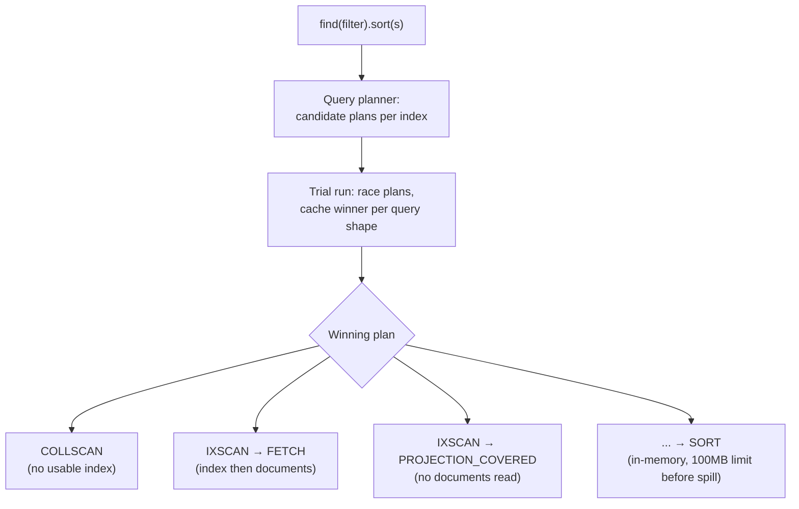
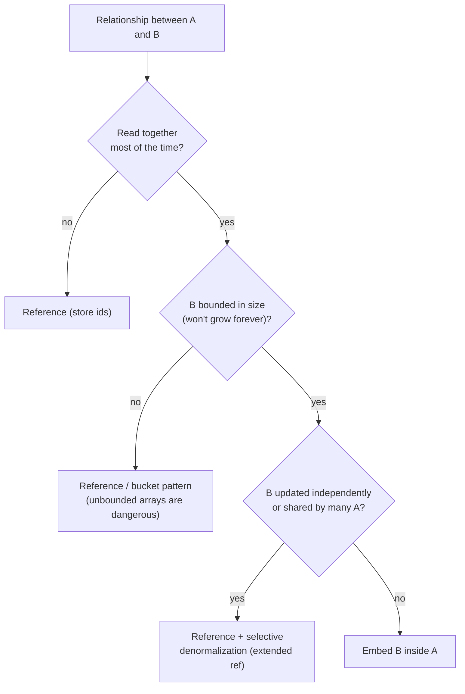
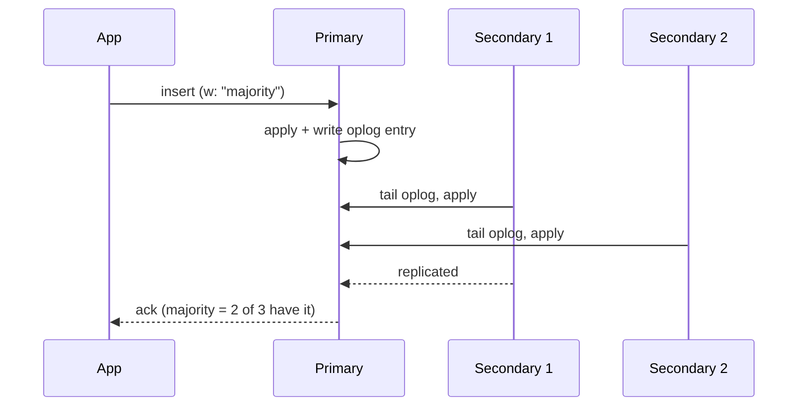
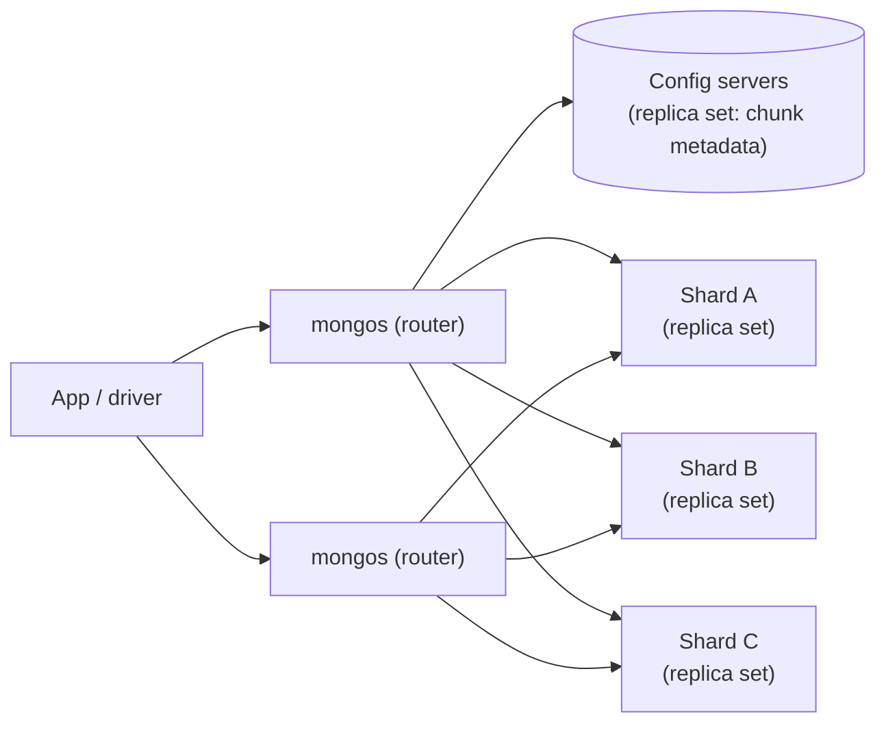

# MongoDB: Interview Notes

**Why this matters in interviews:** MongoDB questions test whether you can **model data for access patterns** instead of normalising by habit, and whether you understand what the database guarantees: indexes, write and read concerns, replica set failover, transactions and sharding. Senior candidates are expected to say *when not* to use MongoDB, and to debug slow queries with `explain()` as confidently as in SQL.

> [!NOTE]
> Every puzzle and `explain()` claim below was run on **MongoDB 7.0** (a single-node replica set) with `mongosh`. Java examples target **Java 8** with the MongoDB Java driver 4.11 and Spring Data MongoDB 3.4 (Boot 2.7).

Difficulty legend: 🟢 Basic · 🟡 Intermediate · 🔴 Advanced · ⚡ Scenario

## Table of Contents

1. [Fundamentals and the Document Model](#1-fundamentals-and-the-document-model)
2. [Querying and Updating](#2-querying-and-updating)
3. [Indexing and Explain](#3-indexing-and-explain)
4. [Aggregation Framework](#4-aggregation-framework)
5. [Data Modeling](#5-data-modeling)
6. [Replication, Consistency and Transactions](#6-replication-consistency-and-transactions)
7. [Sharding](#7-sharding)
8. [Java and Spring Data MongoDB](#8-java-and-spring-data-mongodb)
9. [Coding / Hands-on](#9-coding--hands-on)
10. [Production Scenarios](#10-production-scenarios)
11. [Cheat Sheet](#11-cheat-sheet)
12. [Revision Checklist](#12-revision-checklist)
13. [Beyond Java 8](#13-beyond-java-8)

---

## 1. Fundamentals and the Document Model

> **Mental model:** A relational database is a *filing cabinet of spreadsheets* that you join at read time. MongoDB is a *filing cabinet of folders*, where each folder (document) already holds everything you usually need together. Reads get cheap, and the design question moves to "what do I read together?"

### Q1. 🟢 What is MongoDB, and when is it a good fit?

A distributed **document database** storing **BSON** documents in collections, with flexible schemas, rich queries, secondary indexes, aggregation, replica sets and sharding.

**It's a good fit for:** aggregates read as a whole (profiles, catalogues, device state), semi-structured or evolving data, high write throughput with horizontal scaling, and event or telemetry storage with TTL.

**It's a poor fit for:** heavily relational data with many ad-hoc cross-entity joins and multi-entity invariants everywhere (classic accounting ledgers).

<details><summary>Cross-questions</summary>

**Q:** Is "schemaless" true?

**A:** The database doesn't enforce a schema by default, but your application always has one. Use **schema validation** (`$jsonSchema`) to enforce the critical rules.
</details>

### Q2. 🟢 What is BSON, and how does it differ from JSON?

BSON is a binary, typed serialisation of JSON-like documents. It adds types such as `ObjectId`, `Date`, `Decimal128`, `Int32`/`Int64`, `Binary` and `Timestamp`, and it's designed for fast traversal. The maximum document size is **16 MB**.

<details><summary>Cross-questions</summary>

**Q:** Which type should you use for money?

**A:** `Decimal128`. Never `double`.
</details>

### Q3. 🟢 What is an `ObjectId`?

It's a 12-byte default `_id`: a **4-byte timestamp** (seconds), a 5-byte random value per process, and a 3-byte counter. It's roughly time-ordered and generated client-side, so no DB round trip is needed. `ObjectId.getTimestamp()` returns the creation time.

<details><summary>Cross-questions</summary>

**Q:** Can you use your own `_id`?

**A:** Yes, any unique immutable value. For example, the client-generated `eventId` as `_id` gives you free idempotent inserts: a duplicate insert fails with E11000.
</details>

### Q4. 🟢 How do the terms map from RDBMS to MongoDB?

| RDBMS | MongoDB |
|---|---|
| Database | Database |
| Table | Collection |
| Row | Document |
| Column | Field |
| Index | Index |
| JOIN | Embedding or `$lookup` |
| Foreign key | Reference (no enforcement) |
| Transaction | Single-document atomic; multi-document transactions (4.0+) |

<details><summary>Cross-questions</summary>

**Q:** Does MongoDB enforce references?

**A:** No. There are no FK constraints or cascades, so the application (or a scheduled check) keeps references consistent.
</details>

### Q5. 🟡 Why are single-document writes atomic, and why does that matter for modelling?

Every write to **one document**, including its embedded arrays and subdocuments, is atomic. If an aggregate's invariants live in one document (an order with its lines), you rarely need multi-document transactions.

<details><summary>Cross-questions</summary>

**Q:** Give an example of designing for single-document atomicity.

**A:** A device document holding `lastSeen`, `eventCount` and a bounded `recentEvents` array, all updated in one `updateOne` with `$set`, `$inc` and `$push` + `$slice`.
</details>

### Q6. 🟡 What storage engine does MongoDB use?

**WiredTiger** (the default since 3.2) provides document-level concurrency control (MVCC), compression (snappy by default, zstd and zlib optional), a checkpoint every 60 seconds plus a **journal** (write-ahead log) for durability, and an internal cache (by default 50% of (RAM − 1 GB), with a 256 MB minimum).

<details><summary>Cross-questions</summary>

**Q:** Why can MongoDB use far more RAM than its WiredTiger cache?

**A:** The OS filesystem cache also holds compressed data files. Leave room for it.
</details>

### Q7. 🟢 What is a replica set, briefly?

A group of `mongod` nodes with one **primary** (which takes all writes) and several **secondaries** that replicate the **oplog**. Automatic **elections** pick a new primary on failure. It's the basis of high availability, and it's required for transactions and change streams.

<details><summary>Cross-questions</summary>

**Q:** Why at least 3 voting members?

**A:** Elections need a **majority**. With 2 nodes, losing one leaves no majority, so no primary.
</details>

### Q8. 🟡 MongoDB vs PostgreSQL JSONB?

| | MongoDB | PostgreSQL + JSONB |
|---|---|---|
| Primary model | Documents | Relational + JSON columns |
| Horizontal scale | Native sharding | Extensions (Citus) / app sharding |
| Joins | `$lookup` (limited) | Full SQL joins |
| Constraints | Unique/partial indexes, `$jsonSchema` | Full relational constraints |
| Transactions | Multi-doc since 4.0 (with limits) | Mature ACID everywhere |

<details><summary>Cross-questions</summary>

**Q:** How would you decide for a new service?

**A:** Look at the access patterns and consistency needs. For aggregate-shaped data that needs horizontal scale, choose MongoDB. For relational data with rich ad-hoc queries and strong constraints, choose PostgreSQL.
</details>

### Q9. 🟢 What are capped collections?

Fixed-size collections that keep insertion order and overwrite the oldest documents when full. They're used for logs and queues, and for the oplog itself. You can't delete individual documents, and updates can't grow a document.

<details><summary>Cross-questions</summary>

**Q:** What's the alternative for expiring data by age?

**A:** A **TTL index** on a date field.
</details>

### Q10. 🟡 What is schema validation?

A collection-level `validator` with `$jsonSchema` (required fields, types, enums, ranges), plus `validationLevel` (`strict` or `moderate`) and `validationAction` (`error` or `warn`). It protects against bad writes from every client.

```javascript
db.createCollection("events", {
  validator: { $jsonSchema: {
    bsonType: "object",
    required: ["eventId", "deviceId", "source", "ts"],
    properties: {
      eventId:  { bsonType: "string" },
      source:   { enum: ["ANDROID", "IOS", "WEB"] },
      ts:       { bsonType: "date" }
    }
  }},
  validationAction: "error"
});
```

<details><summary>Cross-questions</summary>

**Q:** How do you roll validation out on an existing collection with old data?

**A:** Use `validationLevel: "moderate"` (it only checks inserts, plus updates to documents that are already valid), or `warn` first, then fix the data, then switch to strict.
</details>

### Q11. 🟢 What are time-series collections?

Special collections (5.0+) optimised for measurements. Documents with a `timeField` and a `metaField` are stored internally in **buckets**, which gives much better compression and faster time-range queries. They're good for device telemetry.

<details><summary>Cross-questions</summary>

**Q:** Why group by the `metaField` (for example deviceId)?

**A:** Buckets are organised per meta value and time span. Queries by device and time touch few buckets.
</details>

### Q12. 🟡 What are change streams?

A resumable stream of changes (insert, update, delete) on a collection, database or cluster, built on the oplog. It needs a replica set. It's used for CDC, cache invalidation, and publishing events to Kafka or Pub/Sub. The **resume token** lets consumers restart where they left off.

<details><summary>Cross-questions</summary>

**Q:** What happens if a consumer is down longer than the oplog window?

**A:** The resume token falls off the oplog and can't resume. You must resync (a full scan). Size the oplog for the maximum expected downtime.
</details>

### Q13. 🟢 What are the main limits to remember?

A 16 MB document size, a nesting depth of 100 levels, index key size limits (relaxed in 4.2+), transactions that should stay short (60 s default lifetime), and 64 indexes per collection.

<details><summary>Cross-questions</summary>

**Q:** What if you truly need larger binary objects?

**A:** Store them in object storage (GCS) with a reference, or use GridFS, which chunks files into 255 KB pieces.
</details>

### Q14. 🟡 How is MongoDB offered as a service?

MongoDB Atlas is managed across AWS, GCP and Azure, with automated backups, scaling, and monitoring and Performance Advisor. You can also self-manage it (VMs, the Kubernetes operator). Atlas also offers search (Lucene-based `$search`) and vector search.

<details><summary>Cross-questions</summary>

**Q:** What stays your responsibility on Atlas?

**A:** Data modelling, indexes, query shapes, read and write concerns, the shard key, and connection-pool configuration.
</details>

---

## 2. Querying and Updating

> **Mental model:** A MongoDB query is a *template document*: "find documents that look like this". Arrays are the twist. A condition on an array field matches if **any** element matches, and several conditions on an array can each be satisfied by **different** elements unless you use `$elemMatch`.

These puzzles use this data:

```javascript
db.devices.insertMany([
  { _id: 1, name: "pixel",  tags: ["android", "beta"], readings: [{ type: "temp", v: 40 }, { type: "cpu", v: 90 }] },
  { _id: 2, name: "iphone", tags: ["ios"],             readings: [{ type: "temp", v: 95 }, { type: "cpu", v: 10 }] },
  { _id: 3, name: "web",    tags: [],                  readings: [] },
  { _id: 4, name: "legacy" }
]);
```

### Q15. 🟢 How does an equality match on an array field work?

#### 🎯 Predict the output

```javascript
db.devices.find({ tags: "android" }, { _id: 1 })
```

<details><summary>Answer</summary>

`[{ _id: 1 }]`. An equality match on an array field matches documents whose array **contains** the value. To match the exact array, use `{ tags: ["android", "beta"] }` (order matters).
</details>

### Q16. 🔴 `$elemMatch` vs dotted conditions on arrays of subdocuments?

#### 🎯 Predict the output

```javascript
// A
db.devices.find({ "readings.type": "temp", "readings.v": { $gt: 80 } }, { _id: 1 })
// B
db.devices.find({ readings: { $elemMatch: { type: "temp", v: { $gt: 80 } } } }, { _id: 1 })
```

<details><summary>Answer</summary>

**A** returns `[{_id: 1}, {_id: 2}]`. **B** returns `[{_id: 2}]`.

In A, each condition may be satisfied by a **different** array element. Pixel has a "temp" reading (v=40) and a *different* reading with v=90, so it matches even though its temperature is only 40. `$elemMatch` requires **one element** to satisfy both conditions.
</details>

<details><summary>Cross-questions</summary>

**Q:** Where does this bug appear in real systems?

**A:** In alerting ("devices with temperature > 80"), which fires for the wrong devices and floods on-call. Always use `$elemMatch` for multi-field conditions on array elements.
</details>

### Q17. 🟡 How do null, missing and empty arrays behave in queries?

#### 🎯 Predict the output

```javascript
db.devices.find({ tags: { $size: 0 } }, { _id: 1 })        // ?
db.devices.find({ tags: { $exists: false } }, { _id: 1 })  // ?
db.devices.find({ tags: null }, { _id: 1 })                // ?
```

<details><summary>Answer</summary>

`[{_id: 3}]`, then `[{_id: 4}]`, then `[{_id: 4}]`. An empty array isn't null or missing. `{ field: null }` matches documents where the field is **null or missing**. Use `{ $type: "null" }` to match only explicit nulls. With `{v: 1}`, `{v: null}` and `{}`: `v: null` counts **2**, `$exists: false` counts 1, and `$type: "null"` counts 1 (all verified).
</details>

### Q18. 🟢 What are the common query operators?

Comparison: `$eq`, `$ne`, `$gt`, `$gte`, `$lt`, `$lte`, `$in`, `$nin`. Logical: `$and`, `$or`, `$not`, `$nor`. Element: `$exists`, `$type`. Array: `$all`, `$elemMatch`, `$size`. Evaluation: `$regex`, `$expr`, `$jsonSchema`, `$mod`, `$text`.

<details><summary>Cross-questions</summary>

**Q:** What does `$expr` enable?

**A:** Comparing fields within the same document (`{ $expr: { $gt: ["$spent", "$budget"] } }`), using aggregation expressions.
</details>

### Q19. 🟢 What are projections?

A projection is the second argument to `find`: `{ name: 1, _id: 0 }` includes fields, and `{ payload: 0 }` excludes them. You can't mix include and exclude, except for `_id`. `$slice` and `$elemMatch` projections limit array output.

<details><summary>Cross-questions</summary>

**Q:** Why do projections matter for performance?

**A:** They cut network and deserialisation cost, and when every projected field is in the index, the query is **covered** (no document fetch).
</details>

### Q20. 🟢 What are the main update operators?

`$set`, `$unset`, `$inc`, `$mul`, `$min`, `$max`, `$rename`, `$currentDate`. For arrays: `$push` (with `$each`, `$slice`, `$sort`), `$addToSet`, `$pull`, `$pop`, and the positional `$`, `$[]` and `$[<id>]` with `arrayFilters`.

<details><summary>Cross-questions</summary>

**Q:** What's the difference between `$push` and `$addToSet`?

**A:** `$addToSet` adds the value only if it isn't already present (set semantics). `$push` always appends.
</details>

### Q21. 🟡 What does upsert with `$inc` do?

#### 🎯 Predict the output

```javascript
db.counters.updateOne({ _id: "events" }, { $inc: { n: 5 } }, { upsert: true });
db.counters.updateOne({ _id: "events" }, { $inc: { n: 5 } }, { upsert: true });
db.counters.findOne()
```

<details><summary>Answer</summary>

`{ _id: "events", n: 10 }`. The first call **inserts** `{_id, n: 5}` (the `$inc` of a missing field starts from 0). The second increments it to 10. It's an atomic counter, with no read-modify-write.
</details>

<details><summary>Cross-questions</summary>

**Q:** Can concurrent upserts create duplicates?

**A:** If the query field isn't unique-indexed, two concurrent upserts can both insert. Upsert on `_id`, or on a **unique index**, so one of them retries as an update.
</details>

### Q22. 🟡 How do dotted `$set` paths create nested documents?

#### 🎯 Predict the output

```javascript
db.devices.updateOne({ _id: 4 }, { $set: { "meta.os.version": "1.0" } });
db.devices.findOne({ _id: 4 })
```

<details><summary>Answer</summary>

`{ _id: 4, name: "legacy", meta: { os: { version: "1.0" } } }`. Missing intermediate documents are created. In contrast, `$set: { meta: { os: {...} } }` would **replace** the entire `meta` subdocument.
</details>

### Q23. 🟡 How do you update specific array elements?

```javascript
// first matching element (positional $)
db.devices.updateOne({ _id: 1, "readings.type": "cpu" }, { $set: { "readings.$.v": 50 } });
// all elements
db.devices.updateOne({ _id: 1 }, { $inc: { "readings.$[].v": 1 } });
// only elements matching a filter
db.devices.updateOne({ _id: 1 }, { $set: { "readings.$[r].alert": true } },
                     { arrayFilters: [ { "r.v": { $gt: 80 } } ] });
```

<details><summary>Cross-questions</summary>

**Q:** Why do unbounded arrays hurt update performance?

**A:** Large arrays make every update rewrite a bigger document, indexes on array fields grow (multikey), and you risk the 16 MB limit.
</details>

### Q24. 🟢 `updateOne` vs `updateMany` vs `replaceOne` vs `findOneAndUpdate`?

`updateOne` and `updateMany` apply operators. `replaceOne` replaces the whole document (except `_id`). `findOneAndUpdate` atomically updates and **returns** the document before or after the change (`returnDocument: "after"`), which suits queues, counters and claims.

<details><summary>Cross-questions</summary>

**Q:** How do you claim one pending job atomically?

**A:** `findOneAndUpdate({ status: "PENDING" }, { $set: { status: "RUNNING", owner: me, startedAt: now } }, { sort: { createdAt: 1 } })`. Only one worker can win each document.
</details>

### Q25. 🟡 What is `bulkWrite`, and what do ordered vs unordered mean?

`bulkWrite` sends many inserts, updates and deletes in one request. **Ordered** (the default) stops at the first error. **Unordered** keeps going and reports all the errors, and it's faster (the server can parallelise). For ingestion with occasional duplicate keys, use unordered and treat E11000 as "already processed".

<details><summary>Cross-questions</summary>

**Q:** How large should batches be?

**A:** Drivers split them automatically (by message size and batch limits), but application batches of a few hundred to a few thousand operations balance throughput against memory and retry cost.
</details>

### Q26. 🟡 How do sort, skip and limit behave, and how does paging work?

`skip(n)` still walks the skipped documents, so deep pages get slow, like SQL `OFFSET`. Use **range-based (keyset) pagination** instead: `find({ _id: { $gt: lastId } }).sort({ _id: 1 }).limit(50)`, or on `(ts, _id)`.

<details><summary>Cross-questions</summary>

**Q:** What happens to a sort without a supporting index on a big result?

**A:** An in-memory `SORT` stage. Blocking sorts are limited to 100 MB, and beyond that they spill to disk (`allowDiskUse`, the default for `find` since 6.0) or fail.
</details>

### Q27. 🟡 How are arrays sorted?

#### 🎯 Predict the output

```javascript
db.devices.find({}, { _id: 1 }).sort({ tags: 1 })
```

<details><summary>Answer</summary>

`[3, 4, 1, 2]`. For an ascending sort on an array field, MongoDB uses the array's **smallest** element: pixel sorts by "android" and iphone by "ios". The empty array (3) sorts before the missing field (4, which compares as null). Arrays make sorts surprising, so avoid sorting on them.
</details>

### Q28. 🟢 What does `countDocuments` vs `estimatedDocumentCount` do?

`countDocuments(filter)` runs an aggregation, so it's accurate but can be slow. `estimatedDocumentCount()` uses collection metadata, so it's instant but approximate, it can't take a filter, and it may be off after an unclean shutdown.

<details><summary>Cross-questions</summary>

**Q:** Which suits a UI badge on a huge collection?

**A:** An estimate, or a maintained counter document updated with `$inc`.
</details>

### Q29. 🟡 How do text search and regex queries perform?

- A **prefix** regex (`/^d7/`) can use an index with tight bounds. **Verified**: about 1,100 keys examined for about 1,100 matches.
- A **suffix or contains** regex (`/7$/`) scans the whole index. **Verified**: 50,000 keys for 5,000 matches.
- A `$text` index gives basic stemming and full-text search.
- **Atlas Search** (Lucene) gives relevance, fuzzy matching and facets.

<details><summary>Cross-questions</summary>

**Q:** Case-insensitive search without a slow `/i` regex?

**A:** Use an index with a **collation** of strength 2 and query with the same collation, or store a normalised lowercase field.
</details>

### Q30. 🟡 What is `$lookup` vs doing joins in the application?

`$lookup` performs a left outer join to another collection inside an aggregation, which is useful for occasional joins and reporting. Frequent joins on hot paths suggest you should **embed** or denormalise instead. It's supported on sharded collections since 5.1 (with restrictions).

<details><summary>Cross-questions</summary>

**Q:** Which index does `$lookup` need?

**A:** An index on the `foreignField` in the joined collection. Otherwise each input document scans the whole foreign collection.
</details>

### Q31. 🟡 What does `findOneAndUpdate` return when no document matches, and how does `upsert` change that?

Without `upsert`, it returns `null` and modifies nothing. With `upsert: true`, it inserts a new document built from the equality fields in the filter plus the update operators (and `$setOnInsert` for fields set only on insert). Use `returnDocument: "after"` to get the new document.

<details><summary>Cross-questions</summary>

**Q:** What's `$setOnInsert` for?

**A:** Fields that should be set only when the upsert **creates** the document, such as `createdAt` or initial status, and never on later updates.
</details>

### Q32. 🟡 How do you delete large amounts of data safely?

A `deleteMany` over millions of documents is heavy (oplog volume, replication lag, cache churn). Prefer **TTL indexes** for age-based expiry, dropping whole collections or time-bucketed collections, or batched deletes with pauses. On sharded clusters, consider zone- or range-based archival.

<details><summary>Cross-questions</summary>

**Q:** Is TTL deletion instant?

**A:** No. A background monitor runs about every 60 seconds and deletes in batches, so expiry is approximate, and heavy TTL deletes still generate oplog traffic.
</details>

---
## 3. Indexing and Explain

> **Mental model:** MongoDB indexes are B-trees over field values, just like in SQL. The **leftmost prefix** rule, "equality before range", and covered queries all carry over. The MongoDB-specific twist is the **ESR rule** (Equality, Sort, Range) for compound indexes, and **multikey** indexes on arrays.

The `explain()` results below come from a 50,000-document `events` collection (`deviceId` with 500 values, `source` with 3 values, a timestamp `ts`).



### Q33. 🟢 What does `explain("executionStats")` tell you?

The **winning plan** stages (`COLLSCAN`, `IXSCAN`, `FETCH`, `SORT`, `PROJECTION_COVERED`), plus `totalKeysExamined`, `totalDocsExamined` and `nReturned`. The ideal ratio is keys ≈ docs ≈ returned.

**Verified:** `find({deviceId: "d7"})` with no index gave `COLLSCAN keys=0 docs=50000 n=100`. After `createIndex({deviceId: 1, ts: 1})`, it gave `IXSCAN keys=100 docs=100 n=100`.

<details><summary>Cross-questions</summary>

**Q:** What does "docs examined ≫ returned" mean?

**A:** The index narrows the search poorly, and many documents are fetched and then filtered out. Add the filtered field to the index, or reorder its fields.
</details>

### Q34. 🟡 What is the leftmost-prefix rule for compound indexes?

The index `{deviceId: 1, ts: 1}` supports queries on `deviceId`, and on `deviceId + ts`, but **not** on `ts` alone. **Verified:** `find({ts: {$gt: ...}})` did a `COLLSCAN` over all 50,000 documents despite the index.

<details><summary>Cross-questions</summary>

**Q:** What would you add for time-range queries across all devices?

**A:** A separate `{ts: 1}` index, or a compound index that leads with `ts` for those query shapes. Check the write cost first.
</details>

### Q35. 🔴 What is the ESR rule?

Order compound index fields as **Equality → Sort → Range**:

1. **Equality** fields first (exact matches narrow the key space).
2. **Sort** fields next (the index order then provides the sort, so there's no in-memory `SORT`).
3. **Range** fields last (`$gt`, `$lt`, `$in` with sort caveats).

Example query: `find({ source: "IOS", ts: { $gte: t } }).sort({ deviceId: 1 })`. The ESR index is `{ source: 1, deviceId: 1, ts: 1 }`.

<details><summary>Cross-questions</summary>

**Q:** Why not put the range field before the sort field?

**A:** After a range scan, the keys aren't ordered by the sort field, so MongoDB must sort in memory.
</details>

### Q36. 🟡 How can an index provide the sort, even backwards?

**Verified:** `find({deviceId: "d7", source: "IOS"}).sort({ts: -1})` used `IXSCAN(deviceId_1_ts_1)` walked **backwards**, with no `SORT` stage. `source` was filtered in `FETCH` (keys=100, docs=100, returned 34). A single-field sort can use the index in either direction. For compound sorts, the direction pattern must match the index, or be its exact inverse.

<details><summary>Cross-questions</summary>

**Q:** Does `{a: 1, b: -1}` support `sort({a: 1, b: 1})`?

**A:** No. The directions must match `{a: 1, b: -1}` or `{a: -1, b: 1}`.
</details>

### Q37. 🟡 What is a covered query?

All the filter and projection fields are in the index, and `_id` is excluded (unless it's indexed as part of the index). **Verified:** `find({deviceId: "d7"}, {_id: 0, deviceId: 1, ts: 1})` → `PROJECTION_COVERED` with **0 documents examined**.

<details><summary>Cross-questions</summary>

**Q:** Why does including `_id` often break coverage?

**A:** `_id` is returned by default, and it's not in the compound index, so MongoDB must fetch the document.
</details>

### Q38. 🟡 What is a multikey index?

It's an index on an array field. MongoDB indexes **each element**, so a document with 10 tags gives 10 index keys. A compound index can include at most **one** array field per document (you can't index two parallel arrays together).

<details><summary>Cross-questions</summary>

**Q:** Why are multikey indexes on huge arrays costly?

**A:** Writes update many keys, the index balloons, and bounds on multikey fields can be looser.
</details>

### Q39. 🟡 What do unique indexes do with missing fields?

#### 🎯 Predict the output

```javascript
db.users.createIndex({ email: 1 }, { unique: true });
db.users.insertOne({ _id: 1, name: "a" });   // no email
db.users.insertOne({ _id: 2, name: "b" });   // no email
```

<details><summary>Answer</summary>

The second insert fails with **E11000 duplicate key**. A missing field is indexed as `null`, so two documents without `email` collide. **Fix:** a **partial** unique index, `{ unique: true, partialFilterExpression: { email: { $exists: true } } }`. **Verified**: both inserts succeed with it.
</details>

<details><summary>Cross-questions</summary>

**Q:** What about sparse indexes?

**A:** `sparse: true` also skips missing fields, but partial indexes are more expressive and preferred.
</details>

### Q40. 🟡 What are partial, sparse and TTL indexes?

- **Partial**: indexes only the documents matching a filter (for example `status: "PENDING"`). It's small and fast, and queries must include a compatible filter.
- **Sparse**: skips documents missing the field.
- **TTL**: on a date field with `expireAfterSeconds`. A background task deletes expired documents, roughly every 60 seconds.

<details><summary>Cross-questions</summary>

**Q:** A TTL index for "delete 30 days after `createdAt`"?

**A:** `createIndex({ createdAt: 1 }, { expireAfterSeconds: 2592000 })`. The field must hold BSON Date values.
</details>

### Q41. 🟡 What other index types exist?

Hashed (for hashed sharding and equality), text, 2dsphere and 2d (geo), wildcard (`{"attributes.$**": 1}` for unpredictable fields), clustered collections (5.3+), and compound indexes of these where allowed.

<details><summary>Cross-questions</summary>

**Q:** When is a wildcard index appropriate?

**A:** For user-defined attributes you can't predict. It's not a substitute for designed compound indexes on known query shapes.
</details>

### Q42. 🟡 How does the query planner choose a plan, and what is the plan cache?

For a new **query shape**, the planner generates candidate plans (one per usable index), runs a short **trial race**, and caches the winner. The cache entry is re-evaluated when performance degrades, and cleared when indexes change or the server restarts.

<details><summary>Cross-questions</summary>

**Q:** How do you force an index in an emergency?

**A:** `.hint({deviceId: 1, ts: 1})`, or an index filter (`planCacheSetFilter`). Fix the root cause afterwards.
</details>

### Q43. 🟡 `$in` and sort: why can a multi-value equality still need merging?

**Verified:** `find({source: "IOS", deviceId: {$in: ["d7", "d8"]}}).sort({ts: 1})` produced `SORT_MERGE` over two IXSCANs. Each `$in` value's range is sorted within the index, and the planner merges them, which is cheap for small `$in` lists and costly for large ones.

<details><summary>Cross-questions</summary>

**Q:** Is `$in` equality or range in the ESR rule?

**A:** It behaves like equality for filtering, but for **sorting** it can act like a range (it needs a merge or an in-memory sort). Treat large `$in` lists carefully.
</details>

### Q44. 🟡 How do indexes affect write performance?

Every insert and update maintains every index that covers the changed fields. More indexes mean slower writes and more RAM needed to keep indexes in cache. Drop unused indexes (`$indexStats` shows usage), and combine them where a compound index serves several queries.

<details><summary>Cross-questions</summary>

**Q:** Why is it important that indexes fit in RAM?

**A:** Index lookups that miss the cache hit disk randomly, and latency jumps by orders of magnitude.
</details>

### Q45. 🟡 How do you build an index on a large production collection?

Since 4.2, index builds use an optimised process that holds an exclusive lock only briefly at the start and end. It still costs CPU and IO, and it replicates to secondaries. Build during low traffic. For very large clusters, use a **rolling index build** (one member at a time, taken out of the replica set).

<details><summary>Cross-questions</summary>

**Q:** What happens if a unique index build finds duplicates?

**A:** The build fails. Find and clean the duplicates first with an aggregation (`$group` by key with `count > 1`).
</details>

### Q46. 🟡 What is index selectivity in MongoDB terms?

The same as in SQL: a field with many distinct values narrows results well. A low-cardinality field (`source` with 3 values) rarely helps alone. **Verified**: `source` queries on 50,000 documents favour a scan. It's useful as the equality prefix of a compound index, or in a partial filter.

<details><summary>Cross-questions</summary>

**Q:** Where would a boolean field be useful in an index?

**A:** In a partial filter (`{processed: false}`), so the index stays tiny.
</details>

### Q47. 🟡 How do collations and case-insensitive indexes work?

A collection or index can have a **collation** (locale, strength). With strength 1 or 2 (case-insensitive), `{ email: 1 }` created with that collation serves case-insensitive equality, **if the query specifies the same collation**.

<details><summary>Cross-questions</summary>

**Q:** What if the query doesn't pass the collation?

**A:** The index with a different collation can't be used for string comparisons, which means a slow scan or wrong results.
</details>

### Q48. 🟡 How do you find slow queries?

Use the **database profiler** (`db.setProfilingLevel(1, { slowms: 100 })`, results in `system.profile`), the slow query log lines (`COLLSCAN`, `planSummary`, `keysExamined`, `docsExamined`), `$currentOp` for queries running right now, and Atlas Performance Advisor or Query Insights.

<details><summary>Cross-questions</summary>

**Q:** Which log field instantly flags a missing index?

**A:** `planSummary: COLLSCAN` on a large collection, with a high `docsExamined`.
</details>

### Q49. 🟡 What are hidden indexes?

`hideIndex` (4.4+) keeps an index maintained but invisible to the planner, so you can **test dropping it** safely: if performance holds, drop it; if not, unhide it instantly, with no rebuild.

<details><summary>Cross-questions</summary>

**Q:** Why is this safer than dropping and recreating?

**A:** Rebuilding a large index takes time and IO. Unhiding is instant.
</details>

### Q50. 🟡 What is the index strategy for an events collection read by device and time?

Use `{deviceId: 1, ts: -1}` for "latest events per device" (equality then sort), a TTL index or time-series collection for retention, `_id = eventId` (or a unique index on it) for idempotency, and avoid indexing large payload fields.

<details><summary>Cross-questions</summary>

**Q:** How would you support "all events in the last hour across devices"?

**A:** A `{ts: 1}` index, or use a time-series collection. Keep it bounded by the time range to avoid huge scans.
</details>

---

## 4. Aggregation Framework

> **Mental model:** An aggregation pipeline is a *factory conveyor belt*: `$match` (discard early), `$project` / `$addFields` (reshape), `$group` (combine), `$sort`, `$lookup` (join), `$unwind` (explode arrays), and `$out` / `$merge` (store). Put the filters at the **front**, so less material travels down the belt.

### Q51. 🟢 What are the core stages?

| Stage | Purpose |
|---|---|
| `$match` | Filter (uses indexes when early) |
| `$project` / `$addFields` / `$set` | Reshape/compute fields |
| `$group` | Aggregate by key (`$sum`, `$avg`, `$min`, `$max`, `$push`, `$addToSet`, `$first`) |
| `$sort`, `$limit`, `$skip` | Order/page |
| `$unwind` | One document per array element |
| `$lookup` | Left outer join |
| `$facet` | Multiple sub-pipelines on same input |
| `$bucket` / `$bucketAuto` | Histograms |
| `$merge` / `$out` | Write results to a collection |

<details><summary>Cross-questions</summary>

**Q:** Which stages can use indexes?

**A:** `$match` and `$sort` at the **start** of the pipeline (before any reshaping). The optimiser moves some stages earlier automatically when it's safe.
</details>

### Q52. 🟡 How do you group and total?

#### 🎯 Predict the output

```javascript
// orders: {cid:1,amt:500,PAID}, {cid:1,amt:250,PAID}, {cid:2,amt:900,CANCELLED}, {cid:2,amt:100,PAID}
db.orders.aggregate([
  { $match: { status: "PAID" } },
  { $group: { _id: "$cid", total: { $sum: "$amt" }, n: { $sum: 1 } } },
  { $sort: { total: -1 } }
])
```

<details><summary>Answer</summary>

`[{_id: 1, total: 750, n: 2}, {_id: 2, total: 100, n: 1}]`. `$match` first removes the cancelled order, and `{ $sum: 1 }` counts documents.
</details>

### Q53. 🟡 How does `$lookup` behave for customers without orders?

#### 🎯 Predict the output

```javascript
db.customers.aggregate([
  { $lookup: { from: "orders", localField: "_id", foreignField: "cid", as: "o" } },
  { $project: { name: 1, count: { $size: "$o" } } },
  { $sort: { _id: 1 } }
])
```

<details><summary>Answer</summary>

`Asha 2`, `Ravi 2`, `Meera 0`. `$lookup` is a **left outer join**, so Meera gets an empty array. (Ravi's count includes his cancelled order, because this pipeline doesn't filter the orders.)
</details>

<details><summary>Cross-questions</summary>

**Q:** How do you filter inside a lookup?

**A:** Use the `pipeline` form of `$lookup` (with `let` / `$expr` or, in 5.0+, `localField`/`foreignField` plus `pipeline`) to `$match status: "PAID"` inside the join.
</details>

### Q54. 🟡 What does `$unwind` do with empty or missing arrays?

#### 🎯 Predict the output

```javascript
// devices: pixel(2 readings), iphone(2), web(readings: []), legacy(no readings field)
db.devices.aggregate([{ $unwind: "$readings" }, { $count: "n" }])
db.devices.aggregate([{ $unwind: { path: "$readings", preserveNullAndEmptyArrays: true } }, { $count: "n" }])
```

<details><summary>Answer</summary>

`4`, then `6`. By default, `$unwind` **drops** documents whose array is empty or missing. With `preserveNullAndEmptyArrays: true`, they're kept as one document each.
</details>

<details><summary>Cross-questions</summary>

**Q:** Why is `$unwind` followed by `$group` a common performance issue?

**A:** It multiplies the documents (N × array size) before regrouping them. Array operators (`$size`, `$filter`, `$reduce`) often avoid the unwind.
</details>

### Q55. 🟡 How do `$avg` and `$sum` treat missing values?

`$sum` ignores non-numeric and missing values, and `$avg` ignores them too, like SQL. **Verified:** the average of 500, 250, 900 and 100 is **437.5**. A group with no numeric values gives `$sum = 0` and `$avg = null`.

<details><summary>Cross-questions</summary>

**Q:** How do you count only documents where a field exists?

**A:** `{ $sum: { $cond: [{ $ifNull: ["$field", false] }, 1, 0] } }`, or `$match` before the group.
</details>

### Q56. 🟡 What are the memory limits of aggregation stages?

Blocking stages (`$group`, `$sort`, `$bucket`) have a **100 MB** memory limit per stage before spilling to disk with `allowDiskUse`. In 6.0+, `allowDiskUseByDefault` is true for many operations. Spilling is slow, so design pipelines to reduce the data early.

<details><summary>Cross-questions</summary>

**Q:** How does `$sort` + `$limit` coalesce?

**A:** The optimiser combines them into a top-k sort that keeps only `limit` documents in memory.
</details>

### Q57. 🟡 What is `$facet` good for?

Running several aggregations over the same filtered input in **one** pass: a search page's result list plus counts per source plus a date histogram. The output is one document with one array per facet (subject to the 16 MB limit).

<details><summary>Cross-questions</summary>

**Q:** What's the risk?

**A:** Every facet processes the whole input. With large inputs, facets can be slow and memory-heavy.
</details>

### Q58. 🟡 `$merge` vs `$out`?

`$out` **replaces** the target collection (it can write to a different database since 4.4, but the **target can't be a sharded collection**). `$merge` (4.2+) upserts into an existing collection (possibly sharded), with configurable match and merge behaviour. It's ideal for incremental materialised views (a daily rollup per device).

<details><summary>Cross-questions</summary>

**Q:** How would you maintain "events per device per day" incrementally?

**A:** Every hour, aggregate the last hour's events, `$group` by `{deviceId, day}`, then `$merge` into `daily_device_stats` with `whenMatched: [{ $set: { count: { $add: ["$count", "$$new.count"] } } }]`, or recompute each day idempotently.
</details>

### Q59. 🟡 How do window functions work in aggregation?

`$setWindowFields` (5.0+) gives running totals, ranks, moving averages and `$shift` (like LAG and LEAD) per partition, the same idea as SQL window functions.

```javascript
db.events.aggregate([
  { $setWindowFields: {
      partitionBy: "$deviceId",
      sortBy: { ts: 1 },
      output: { seq: { $documentNumber: {} } }
  } }
])
```

<details><summary>Cross-questions</summary>

**Q:** Which SQL function does `$documentNumber` mirror?

**A:** `ROW_NUMBER()`.
</details>

### Q60. 🟡 How do you do date bucketing in aggregations?

Use `$dateTrunc` (5.0+) or `$dateToString` to group by day or hour, with an explicit **timezone**:

```javascript
{ $group: { _id: { $dateTrunc: { date: "$ts", unit: "day", timezone: "Asia/Kolkata" } }, n: { $sum: 1 } } }
```

<details><summary>Cross-questions</summary>

**Q:** Why pass the timezone?

**A:** Dates are stored in UTC. A "day" for IST users spans two UTC days, so without the timezone the totals look shifted.
</details>

### Q61. 🟡 How do you optimise an aggregation pipeline?

Put `$match` and `$sort` first (so they use indexes), `$project` away unused fields early, avoid `$unwind` where array operators suffice, index the `$lookup` foreign fields, limit before joins where you can, and check with `explain()` on the aggregation.

<details><summary>Cross-questions</summary>

**Q:** Why is `$lookup` before `$match` a smell?

**A:** You join every document and then throw most of them away. Filter first.
</details>

### Q62. 🟡 When do you move analytics out of MongoDB?

When aggregations scan large portions of big collections regularly, compete with OLTP traffic, or need warehouse features. Export through change streams or Kafka Connect to **BigQuery**, or use Atlas Data Federation or analytics nodes. Keep MongoDB for the operational queries.

<details><summary>Cross-questions</summary>

**Q:** What are analytics nodes?

**A:** Secondaries tagged for analytics workloads (in Atlas), so heavy reads are isolated from the primary and the operational secondaries.
</details>

---

## 5. Data Modeling

> **Mental model:** Model for **how you read**, not for how the data "looks". Embed what you read together and what's bounded in size. Reference what's shared, unbounded, or updated independently. Every design choice trades read speed against write complexity and document growth.



### Q63. 🟢 Embedding vs referencing?

| | Embed | Reference |
|---|---|---|
| Reads | One query, atomic | Multiple queries or `$lookup` |
| Writes | Single-doc atomic | May need transactions |
| Growth | Bounded only (16 MB) | Unbounded OK |
| Duplication | Possible | None |
| Example | Order + order lines, user + addresses | Customer → orders (thousands), product ↔ category |

<details><summary>Cross-questions</summary>

**Q:** Why not embed all of a customer's orders in the customer document?

**A:** The array grows without bound: slower updates, a risk of hitting 16 MB, and every customer read loads their whole order history.
</details>

### Q64. 🟡 How do you model one-to-few, one-to-many and one-to-squillions?

- **One-to-few** (addresses): embed an array.
- **One-to-many** (products → reviews, hundreds): a reference array in the parent, or the parent ID in the children.
- **One-to-squillions** (device → millions of events): the **child references the parent** (`event.deviceId`), and is never stored as an array in the parent.

<details><summary>Cross-questions</summary>

**Q:** Where does "latest N events" live then?

**A:** In a bounded `recentEvents` array (`$push` with `$slice: -20`) on the device document for fast dashboards, plus the full event collection.
</details>

### Q65. 🟡 What is the bucket pattern?

Group many small time-series measurements into one document per (device, hour) with an array of readings plus summary fields (count, min, max). This reduces the document count and index size, and speeds up range reads. Time-series collections implement it automatically.

```javascript
{ _id: "d7:2024-03-01T10", deviceId: "d7", hour: ISODate("2024-03-01T10:00:00Z"),
  count: 3, maxTemp: 91,
  readings: [ { t: ISODate("2024-03-01T10:00:05Z"), temp: 40 }, { t: ISODate("2024-03-01T10:20:00Z"), temp: 91 } ] }
```

<details><summary>Cross-questions</summary>

**Q:** How do you write into a bucket safely?

**A:** With an upsert on the bucket `_id`: `$push` the reading, `$inc` the count, and `$max` the maximum. It's one atomic operation.
</details>

### Q66. 🟡 What is the extended reference pattern?

Copy a few frequently read fields of a referenced document into the referencing one. For example, store `customer: {id, name, tier}` inside the order. Reads avoid a lookup, and you accept updating the copies when the source changes (asynchronously, through change streams or events).

<details><summary>Cross-questions</summary>

**Q:** Which fields are safe to duplicate?

**A:** Fields that change rarely, or where a historical snapshot is actually correct. The customer's name *at order time* is often what you want anyway.
</details>

### Q67. 🟡 What are the computed and subset patterns?

- **Computed**: precompute aggregates on write (`$inc` counters, running totals) instead of aggregating on every read.
- **Subset**: keep the most-used portion embedded (the top 10 reviews) and the rest in a separate collection.

<details><summary>Cross-questions</summary>

**Q:** What's the consistency risk with the computed pattern?

**A:** The counter can drift from reality after partial failures. Reconcile periodically with a real aggregation.
</details>

### Q68. 🟡 What is the polymorphic pattern?

Store different but related shapes in one collection with a `type` discriminator (ANDROID, IOS or WEB events with type-specific fields). Queries and indexes stay unified, and the application handles the type-specific fields. Schema validation can use `oneOf` per type.

<details><summary>Cross-questions</summary>

**Q:** How does Spring Data MongoDB handle it?

**A:** It stores a `_class` type hint by default, and maps back to the subclass. You can customise or disable the hint.
</details>

### Q69. 🟡 How do you model many-to-many?

With arrays of references on one side or both sides (`student.courseIds`, `course.studentIds`) when they're bounded, or a separate **link collection** (`enrollments: {studentId, courseId, grade}`) when they're large or the link carries attributes.

<details><summary>Cross-questions</summary>

**Q:** Why can two-sided reference arrays drift?

**A:** Updating both sides isn't atomic without a transaction. Pick one source of truth, or use a transaction.
</details>

### Q70. 🟡 What is schema versioning in MongoDB?

Add a `schemaVersion` field. The application reads all the versions it supports and lazily upgrades documents on write, or a background migration upgrades them in batches. This lets you evolve without downtime or a big-bang migration.

<details><summary>Cross-questions</summary>

**Q:** How long must you support old versions?

**A:** Until the background migration confirms none remain: `countDocuments({ schemaVersion: { $lt: 3 } }) == 0`.
</details>

### Q71. 🟡 How do you model trees and hierarchies?

Parent references (`parentId`), child references, an **array of ancestors** (fast subtree queries: `{ ancestors: "electronics" }`), or materialised paths (`path: ",root,electronics,phones,"` with prefix regex queries). `$graphLookup` traverses recursively.

<details><summary>Cross-questions</summary>

**Q:** Which suits fast "all descendants" queries?

**A:** An ancestors array, indexed as multikey, which finds all descendants with one equality query.
</details>

### Q72. 🟡 How do you model device state plus event history for mobile ingestion?

- `devices`: one document per device (current state, `lastSeen`, counters, a bounded `recentEvents` array), updated with a single atomic `updateOne`.
- `events`: one document per event, `_id = eventId` (idempotent), indexed on `{deviceId: 1, ts: -1}`, with a TTL or a time-series collection for retention.
- Aggregates (daily per source) go in a rollup collection through `$merge`, or in the warehouse.

<details><summary>Cross-questions</summary>

**Q:** Why keep the full events outside the device document?

**A:** The volume is unbounded, and devices are read far more often than the full history.
</details>

### Q73. 🟡 What are the anti-patterns to name in an interview?

Unbounded arrays, massive documents near 16 MB, too many collections (one per user or day), unnecessary indexes, case-insensitive queries without matching collation indexes, `$lookup` on every request, storing large blobs inline, and deep `skip()` pagination.

<details><summary>Cross-questions</summary>

**Q:** Why is "one collection per tenant or day" harmful?

**A:** Every collection has index files and metadata overhead. Thousands of them strain WiredTiger file handles and the cache. Use a tenant or date field plus indexes, or TTL.
</details>

### Q74. 🟡 How does MongoDB denormalisation compare with SQL normalisation, in interview terms?

SQL normalises by default and joins at read time. MongoDB **denormalises by default**, shaped by the reads, and keeps the duplicates consistent through application logic, transactions or asynchronous propagation. It trades storage and write complexity for read speed and horizontal scale.

<details><summary>Cross-questions</summary>

**Q:** When would you say MongoDB is the *wrong* choice?

**A:** When you'd be doing many cross-entity transactions and ad-hoc joins on every request. The relational model fits better.
</details>

### Q75. 🟡 How do you enforce uniqueness across a "compound business key"?

A **unique compound index**, for example `{ tenantId: 1, externalId: 1 }`. Add a partial filter if some documents legitimately lack the fields. On sharded collections, unique indexes must be prefixed by the shard key.

<details><summary>Cross-questions</summary>

**Q:** How do you guarantee global uniqueness of email on a collection sharded by `userId`?

**A:** A unique index on `email` alone isn't allowed there. Keep a separate `emails` collection with `_id = email` (sharded by `_id`) as a uniqueness registry, and write both documents in a transaction.
</details>

### Q76. 🟡 How do you store money and dates correctly?

Money: `Decimal128` (or integer minor units). Dates: BSON `Date` (a UTC instant), never strings. Keep the timezone as a separate field if the local time matters. Mapping Java `Instant` to BSON `Date` is lossless at millisecond precision.

<details><summary>Cross-questions</summary>

**Q:** What precision do BSON dates have?

**A:** Milliseconds. Microsecond or nanosecond timestamps get truncated.
</details>

---
## 6. Replication, Consistency and Transactions

> **Mental model:** Write concern is *how many witnesses must sign before you call a write done*. Read concern is *how certain you need to be that what you read won't be undone*. Read preference is *which copy of the book you read from*. Stronger settings mean more latency and more certainty.

### Q77. 🟡 How does replication work?

The primary records every write in the **oplog** (a capped collection of idempotent operations). Secondaries **tail** the oplog and apply it. Members exchange **heartbeats** (every 2 s). If the primary is unreachable for `electionTimeoutMillis` (10 s by default), an eligible secondary calls an **election** and wins with a majority of votes.



<details><summary>Cross-questions</summary>

**Q:** Why should oplog entries be idempotent?

**A:** Secondaries may re-apply entries after restarts. For example, `$inc` is recorded as the resulting `$set` value.
</details>

### Q78. 🟡 What are write concerns?

- `w: 1`: acked by the primary only.
- `w: "majority"`: acked once a **majority** of voting members have the write. This is the default since 5.0 in most deployments.
- `j: true`: wait for the on-disk journal.
- `wtimeout`: stop *waiting* after N ms. The write isn't undone; it may still replicate.

<details><summary>Cross-questions</summary>

**Q:** What happens to a `w: 1` write if the primary crashes before replicating it?

**A:** After a new primary is elected, the old primary rejoins and **rolls back** the unreplicated writes (saved to rollback files), so the write is lost to the application. Use `majority` for business data.
</details>

### Q79. 🟡 What are read concerns?

| Level | Guarantee |
|---|---|
| `local` (default) | Latest data on that node — may be rolled back |
| `available` | Like local; on sharded clusters may return orphans |
| `majority` | Data acknowledged by a majority — won't be rolled back |
| `linearizable` | Reflects all majority writes before the read (primary only, slow) |
| `snapshot` | Consistent point-in-time view (transactions) |

<details><summary>Cross-questions</summary>

**Q:** How do you guarantee reading your own write on a secondary?

**A:** Use **causally consistent sessions** with `majority` read and write concerns. The driver passes cluster times, so the secondary waits until it has caught up.
</details>

### Q80. 🟡 What are read preferences?

`primary` (the default), `primaryPreferred`, `secondary`, `secondaryPreferred` and `nearest`, optionally with **tags** (for example an analytics node) and `maxStalenessSeconds`. Reading from secondaries scales reads, but the data may be **stale**.

<details><summary>Cross-questions</summary>

**Q:** When would you read from secondaries?

**A:** For reports, analytics and exports that tolerate staleness, ideally on tagged nodes. Never for read-after-write flows without causal consistency.
</details>

### Q81. 🟡 What happens during a failover from the application's point of view?

For about 10–12 seconds, writes fail with "not primary" or network errors. Drivers discover the new primary. **Retryable writes** (on by default in modern drivers) retry **once** automatically, and retryable reads retry too. Transactions in flight get `TransientTransactionError` and must be retried.

<details><summary>Cross-questions</summary>

**Q:** Which operations aren't retryable?

**A:** Multi-document writes like `updateMany` and `deleteMany` aren't retryable writes. Design them to be idempotent, or retry them yourself carefully.
</details>

### Q82. 🟡 What is an arbiter, and why is it discouraged?

A voting member with no data. It lets you keep an odd number of voters cheaply. But with P-S-A, if the secondary is down, `w: "majority"` writes **can't be acknowledged** (only 1 data-bearing member), and majority read concern stalls. Prefer P-S-S.

<details><summary>Cross-questions</summary>

**Q:** What's the failure mode of majority writes with P-S-A when S is down?

**A:** Writes succeed on the primary but wait forever (or until `wtimeout`) for majority acknowledgement, and the majority commit point stops advancing.
</details>

### Q83. 🔴 How do multi-document transactions work?

They're supported on replica sets since 4.0 and sharded clusters since 4.2. They use **snapshot isolation**. There's a 60-second default lifetime, and **write-write conflicts** abort one transaction.

#### 🎯 Predict the output (verified with mongosh on MongoDB 7.0)

```javascript
db.accounts.insertMany([{ _id: "A", bal: 100 }, { _id: "B", bal: 0 }]);
const s = db.getMongo().startSession();
const acc = s.getDatabase("prep").accounts;
s.startTransaction({ readConcern: { level: "snapshot" }, writeConcern: { w: "majority" } });
acc.updateOne({ _id: "A" }, { $inc: { bal: -30 } });
acc.updateOne({ _id: "B" }, { $inc: { bal: 30 } });
printjson(db.accounts.find().sort({ _id: 1 }).toArray());   // read OUTSIDE the transaction
s.abortTransaction();
printjson(db.accounts.find().sort({ _id: 1 }).toArray());
```

<details><summary>Answer</summary>

Both prints show `A: 100, B: 0`. Uncommitted transactional writes are **invisible outside the transaction**, and after `abortTransaction()` they're discarded entirely.
</details>

<details><summary>Cross-questions</summary>

**Q:** Should you use transactions everywhere?

**A:** No. They cost performance, locks and the cache pressure of keeping snapshots. Model for single-document atomicity first, and use transactions for genuine multi-document invariants (a transfer, a uniqueness registry).
</details>

### Q84. 🟡 How should transactions be retried?

Use the driver's **`withTransaction`** callback API. It retries the whole transaction on the `TransientTransactionError` label, and retries the commit on `UnknownTransactionCommitResult`. The callback must be **idempotent** with respect to side effects outside MongoDB.

<details><summary>Cross-questions</summary>

**Q:** Why keep transactions short?

**A:** Long transactions pin old snapshots in the WiredTiger cache (cache pressure), conflict more, and may hit `transactionLifetimeLimitSeconds`.
</details>

### Q85. 🟡 What is a write conflict, and how does MongoDB handle it?

Two concurrent operations modifying the same document: outside transactions, WiredTiger retries internally. Inside transactions, the later one gets a **WriteConflict**, labelled `TransientTransactionError`, and must retry. Hot documents (a global counter) cause frequent conflicts.

<details><summary>Cross-questions</summary>

**Q:** How do you reduce hot-document contention?

**A:** Shard the counter across N documents, bucket the writes, or aggregate asynchronously.
</details>

### Q86. 🟡 What are retryable writes, and how do they give idempotency?

The driver attaches a **transaction number** (a session ID plus txnNumber) to single-document writes. If a network error happens, it retries once, and the server recognises an already-applied write and returns its original result, with no duplicate. That covers `insertOne`, `updateOne`, `findOneAndUpdate` and others, but not multi-document writes.

<details><summary>Cross-questions</summary>

**Q:** Does this remove the need for application idempotency?

**A:** No. It only covers **one** automatic retry within the driver session. Application retries (a user resubmitting, a message redelivery) still need business keys.
</details>

### Q87. 🟡 How do you get read-your-own-writes consistency with secondaries?

Use a **causally consistent session** (`ClientSession` with `causallyConsistent(true)`), with `majority` read and write concerns. Reads in that session wait for the node to reach the operation time of your write.

<details><summary>Cross-questions</summary>

**Q:** Is it on by default?

**A:** Sessions are causally consistent by default when you explicitly start one, but you must pass that session to every operation.
</details>

### Q88. 🟡 How do you size the oplog?

It needs to cover the **longest planned downtime or lag** of a secondary (maintenance, initial sync, change stream consumers). Check `rs.printReplicationInfo()` for the oplog window in hours. Since 4.0, the oplog can grow past its configured size to preserve the majority commit point, and 4.4 added a minimum retention period option.

<details><summary>Cross-questions</summary>

**Q:** What happens when a secondary falls off the oplog?

**A:** It becomes **stale** and needs a full initial sync, which is costly on big datasets.
</details>

### Q89. 🟡 How do you run backups and restores?

Options are `mongodump` / `mongorestore` (logical, slow for big data), filesystem snapshots (with journaling, consistent across the shard and config servers), and Atlas continuous backup with point-in-time restore. Test the restores regularly.

<details><summary>Cross-questions</summary>

**Q:** Why is `mongodump` risky on a busy sharded cluster?

**A:** It isn't consistent across shards without stopping the balancer and coordinating. Use managed or snapshot-based backups.
</details>

### Q90. 🟡 How do you choose between CAP-style trade-offs in MongoDB?

MongoDB replica sets are **CP by default** for writes: a primary requires a majority, and a minority partition can't accept writes. You can loosen this for availability or latency (`w: 1`, secondary reads), at the cost of rollback or stale reads. Tune per operation.

<details><summary>Cross-questions</summary>

**Q:** Which setting would you use for mobile event ingestion writes?

**A:** `w: "majority"` for durable business events. Possibly `w: 1` for high-volume, loss-tolerant telemetry, as long as the product accepts rare rollbacks.
</details>

---

## 7. Sharding

> **Mental model:** Sharding is *splitting a library across several buildings by call number*. The **shard key** is the call number, **mongos** is the librarian who knows which building holds which range, and the **balancer** moves shelves between buildings to keep them even. A bad call number system (a bad shard key) means one building overflows while the others sit empty.



### Q91. 🟡 What are the components of a sharded cluster?

- **Shards**: each is a replica set holding a subset of the data.
- **mongos**: stateless routers that clients connect to.
- **Config servers**: a replica set storing the metadata (chunk ranges and their locations).

<details><summary>Cross-questions</summary>

**Q:** Where do you run mongos?

**A:** Often next to the app servers, or as a service. They're stateless, so run several for availability.
</details>

### Q92. 🔴 What makes a good shard key?

- **High cardinality**, so it can split into many chunks.
- **Even write distribution**: avoid **monotonically increasing** keys like a timestamp or ObjectId alone, which send every insert to one "hot" shard.
- **Query isolation**: most queries include the shard key, so they're **targeted** to one shard instead of **scatter-gather** to all.

| Strategy | Pros | Cons |
|---|---|---|
| Ranged on `{tenantId, ts}` | Targeted range queries per tenant | Big tenants → hot/jumbo chunks |
| Hashed on `deviceId` | Even writes | Range queries on deviceId scatter |
| Compound `{deviceId: "hashed", ts: 1}` (4.4+) | Even writes + ordered ts within device | More complex |

<details><summary>Cross-questions</summary>

**Q:** Why is `{ts: 1}` alone a terrible shard key for events?

**A:** Every new event has the largest timestamp, so every insert goes to the last chunk on one shard. That shard runs hot while the others idle.
</details>

### Q93. 🟡 What are chunks and the balancer?

Data is split into **chunks** (contiguous shard-key ranges, 128 MB by default since 6.0). The **balancer** migrates chunks between shards to even out the data (since 6.0 it balances on data size, not chunk count). Migrations cost IO and network, so you can schedule a balancing window.

<details><summary>Cross-questions</summary>

**Q:** What is a jumbo chunk?

**A:** A chunk that can't be split, because too many documents share the same shard-key value (low cardinality). It can't be moved easily and causes imbalance.
</details>

### Q94. 🟡 Targeted vs scatter-gather queries?

If the query includes the shard key (equality or range on its prefix), mongos routes it to the relevant shards only. Otherwise it **broadcasts** to all shards and merges the results. That's fine occasionally, but costly for high-QPS paths.

<details><summary>Cross-questions</summary>

**Q:** How does sorting work in scatter-gather?

**A:** Each shard sorts locally (ideally with an index), and mongos merges the sorted streams.
</details>

### Q95. 🟡 Can you change a shard key?

Since **5.0**, `reshardCollection` rebuilds the collection under a new shard key online (it needs capacity and time). Since 4.4, `refineCollectionShardKey` can add suffix fields to an existing key. Since 4.2, a document's shard-key **value** can be updated (in a transaction or retryable write).

<details><summary>Cross-questions</summary>

**Q:** Why is choosing the shard key still a big decision?

**A:** Resharding a huge collection is expensive, and a bad key causes hotspots and scatter queries until you fix it.
</details>

### Q96. 🟡 What is zone sharding?

It assigns shard-key ranges to specific shards through tags, for **data residency** (EU tenants on EU shards) or tiered hardware (hot data on fast shards).

<details><summary>Cross-questions</summary>

**Q:** Which shard key supports residency by region?

**A:** A key prefixed by `region` or `tenantRegion`, so the zone ranges map cleanly.
</details>

### Q97. 🟡 When should you shard at all?

When a single replica set can no longer handle the **write throughput** or the **data size** (working set versus RAM, disk), or when you need geographic distribution. Vertical scaling and better indexes come first, because sharding adds operational complexity.

<details><summary>Cross-questions</summary>

**Q:** Is sharding a fix for slow queries?

**A:** Rarely. Missing indexes or bad query shapes stay slow, and now they're slow on every shard.
</details>

### Q98. 🟡 What are orphaned documents?

Documents left on a shard after a chunk migration was interrupted or not yet cleaned up. Reads with `local` / `majority` read concern through mongos filter them out, but direct shard reads or `available` read concern may return them. Range deleters clean them up asynchronously.

<details><summary>Cross-questions</summary>

**Q:** Why should apps always connect through mongos?

**A:** Routing, filtering of orphaned documents, and metadata consistency all depend on it.
</details>

---

## 8. Java and Spring Data MongoDB

> **Mental model:** The Java driver is the *engine*: connection pool, retries, codecs. Spring Data MongoDB is the *car around it*: `MongoTemplate` for full control, repositories for CRUD, and mapping annotations. Know what's configured for you, and what isn't, such as transactions and index creation.

### Q99. 🟡 How do you configure the Java driver correctly?

```java
import com.mongodb.ConnectionString;
import com.mongodb.MongoClientSettings;
import com.mongodb.ReadPreference;
import com.mongodb.WriteConcern;
import com.mongodb.client.MongoClient;
import com.mongodb.client.MongoClients;
import java.util.concurrent.TimeUnit;

public class MongoClientFactory {
    public static MongoClient create(String uri) {
        MongoClientSettings settings = MongoClientSettings.builder()
            .applyConnectionString(new ConnectionString(uri))
            .writeConcern(WriteConcern.MAJORITY)
            .readPreference(ReadPreference.primary())
            .retryWrites(true)
            .applyToConnectionPoolSettings(b -> b.maxSize(50).minSize(5)
                .maxWaitTime(2, TimeUnit.SECONDS))
            .applyToSocketSettings(b -> b.connectTimeout(3, TimeUnit.SECONDS)
                .readTimeout(10, TimeUnit.SECONDS))
            .build();
        return MongoClients.create(settings);    // create ONCE per application; it is thread-safe
    }
}
```

<details><summary>Cross-questions</summary>

**Q:** What's the default pool size?

**A:** `maxPoolSize` is 100 per server by default. Size it deliberately, because pods × pool must stay under the server's connection capacity.

**Q:** Why must you never create a `MongoClient` per request?

**A:** Each client owns connection pools and monitoring threads. Creating them repeatedly exhausts server connections and leaks resources.
</details>

### Q100. 🟡 How do you do idempotent bulk inserts with the Java driver?

```java
import com.mongodb.MongoBulkWriteException;
import com.mongodb.bulk.BulkWriteError;
import com.mongodb.client.MongoClient;
import com.mongodb.client.MongoClients;
import com.mongodb.client.MongoCollection;
import com.mongodb.client.model.InsertManyOptions;
import java.util.ArrayList;
import java.util.List;
import org.bson.Document;

public class IdempotentInsert {
    public static void main(String[] args) {
        try (MongoClient client = MongoClients.create("mongodb://127.0.0.1:27018/?directConnection=true")) {
            MongoCollection<Document> events = client.getDatabase("prep").getCollection("java_events");
            events.drop();
            List<Document> batch = new ArrayList<Document>();
            for (String id : new String[]{"e1", "e2", "e1", "e3", "e2"}) {        // duplicates from redelivery
                batch.add(new Document("_id", id).append("deviceId", "d1"));
            }
            int duplicates = 0;
            try {
                events.insertMany(batch, new InsertManyOptions().ordered(false));    // keep going past dups
            } catch (MongoBulkWriteException e) {
                for (BulkWriteError err : e.getWriteErrors()) {
                    if (err.getCode() == 11000) duplicates++; else throw e;
                }
            }
            System.out.println("stored=" + events.countDocuments() + " duplicates=" + duplicates);
        }
    }
}
```

This was **run against MongoDB 7.0**, and it prints `stored=3 duplicates=2`. Using the client-generated `eventId` as `_id` makes replays harmless, and an **unordered** insert means one duplicate doesn't stop the rest of the batch.

<details><summary>Cross-questions</summary>

**Q:** What would `ordered(true)` do?

**A:** It stops at the first duplicate (the 3rd document), so `e3` would never be inserted, even though it's new.
</details>

### Q101. 🟡 How do you map documents with Spring Data MongoDB?

```java
import java.time.Instant;
import org.springframework.data.annotation.Id;
import org.springframework.data.annotation.Version;
import org.springframework.data.mongodb.core.index.CompoundIndex;
import org.springframework.data.mongodb.core.mapping.Document;
import org.springframework.data.mongodb.core.mapping.Field;

@Document("devices")
@CompoundIndex(name = "tenant_lastSeen", def = "{'tenantId': 1, 'lastSeen': -1}")
public class DeviceDoc {
    @Id private String id;                 // maps to _id
    private String tenantId;
    @Field("os") private String platform;  // stored as "os"
    private Instant lastSeen;
    private long eventCount;
    @Version private Long version;         // optimistic locking

    public String getId() { return id; }
    public void setId(String id) { this.id = id; }
}
```

> [!WARNING]
> Spring Data MongoDB 3.x **doesn't create indexes automatically** (`spring.data.mongodb.auto-index-creation` defaults to false). Manage indexes explicitly: migrations (Mongock), startup scripts, or IaC.

<details><summary>Cross-questions</summary>

**Q:** What does `@Version` do in MongoDB?

**A:** Spring adds the version to the update filter and increments it. A mismatch throws `OptimisticLockingFailureException`.
</details>

### Q102. 🟡 `MongoTemplate` vs `MongoRepository`?

Repositories give derived queries (`findByTenantIdAndLastSeenAfter`), paging and `@Query` JSON queries. They're quick for CRUD. `MongoTemplate` gives full control: `Query` / `Criteria`, partial updates (`Update.update(...).inc(...)`), `findAndModify`, bulk operations and aggregations. Prefer the template for atomic partial updates, rather than repository `save()`, which **replaces** the whole document.

```java
import java.time.Instant;
import org.springframework.data.mongodb.core.FindAndModifyOptions;
import org.springframework.data.mongodb.core.MongoTemplate;
import org.springframework.data.mongodb.core.query.Criteria;
import org.springframework.data.mongodb.core.query.Query;
import org.springframework.data.mongodb.core.query.Update;

public class DeviceUpdater {
    private final MongoTemplate mongo;
    public DeviceUpdater(MongoTemplate mongo) { this.mongo = mongo; }

    public DeviceDoc recordEvent(String deviceId, Instant ts) {
        Query q = Query.query(Criteria.where("_id").is(deviceId));
        Update u = new Update().max("lastSeen", ts).inc("eventCount", 1);   // atomic, no read-modify-write
        return mongo.findAndModify(q, u,
            FindAndModifyOptions.options().upsert(true).returnNew(true), DeviceDoc.class);
    }
}
```

<details><summary>Cross-questions</summary>

**Q:** Why is `repository.save(entity)` risky under concurrency?

**A:** It writes the whole document. Two concurrent saves of stale copies overwrite each other's fields: a lost update. Use `@Version`, or targeted `$set` / `$inc` updates.
</details>

### Q103. 🟡 How do you use transactions in Spring Boot with MongoDB?

Define a `MongoTransactionManager` bean (Boot doesn't auto-configure one), then use `@Transactional` on service methods. You need a replica set or sharded cluster. Collections must exist beforehand on older servers (4.2 and below can't create collections inside transactions).

```java
import org.springframework.context.annotation.Bean;
import org.springframework.context.annotation.Configuration;
import org.springframework.data.mongodb.MongoDatabaseFactory;
import org.springframework.data.mongodb.MongoTransactionManager;

@Configuration
public class MongoTxConfig {
    @Bean
    public MongoTransactionManager transactionManager(MongoDatabaseFactory factory) {
        return new MongoTransactionManager(factory);
    }
}
```

<details><summary>Cross-questions</summary>

**Q:** What if the app also uses JPA with a `JpaTransactionManager`?

**A:** You now have two transaction managers. Name them and use `@Transactional("mongoTransactionManager")`. There's no atomicity across the two databases.
</details>

### Q104. 🟡 How do you stream a large collection in Java without OOM?

Iterate a cursor (`find().batchSize(1000)` with `MongoCursor`, or Spring's `mongoTemplate.stream(query, X.class)`), process documents one at a time, and close the cursor. Avoid `find().into(list)` on big collections.

<details><summary>Cross-questions</summary>

**Q:** What happens to idle cursors?

**A:** The server times them out after 10 minutes of inactivity by default. Long per-batch processing can hit that, so use smaller batches or sessions with refresh.
</details>

### Q105. 🟡 How do you consume change streams in Java?

```java
import com.mongodb.client.MongoChangeStreamCursor;
import com.mongodb.client.MongoCollection;
import com.mongodb.client.model.changestream.ChangeStreamDocument;
import org.bson.BsonDocument;
import org.bson.Document;

public class DeviceChangeRelay {
    public static void relay(MongoCollection<Document> devices, BsonDocument resumeToken) {
        MongoChangeStreamCursor<ChangeStreamDocument<Document>> cursor =
            (resumeToken == null ? devices.watch() : devices.watch().resumeAfter(resumeToken)).cursor();
        try {
            while (cursor.hasNext()) {
                ChangeStreamDocument<Document> change = cursor.next();
                // publish change.getFullDocument() / getDocumentKey() to Kafka or Pub/Sub, then persist token
                BsonDocument token = change.getResumeToken();
            }
        } finally {
            cursor.close();
        }
    }
}
```

<details><summary>Cross-questions</summary>

**Q:** When must the resume token be persisted?

**A:** **After** the event is safely published, so a restart resumes without loss. Duplicates are possible, so downstream consumers dedupe.
</details>

### Q106. 🟡 What mapping pitfalls come up in Spring Data MongoDB?

- The `_class` field is added (it wastes space, and renaming classes breaks mapping, so configure type aliases).
- Java `BigDecimal` is stored as a String by default in older versions, so configure `Decimal128`.
- `LocalDateTime` loses its timezone, so prefer `Instant`.
- Derived query methods on unindexed fields cause silent collection scans.

<details><summary>Cross-questions</summary>

**Q:** How do you store `BigDecimal` as `Decimal128`?

**A:** Configure `MongoCustomConversions` (for example `@Field(targetType = FieldType.DECIMAL128)` in newer versions), and verify in the stored documents.
</details>

---

## 9. Coding / Hands-on

> **Mental model:** MongoDB coding rounds reward **atomic single-document operations** (`$inc`, `$push` with `$slice`, `findOneAndUpdate`) over read-modify-write loops, and pipelines that **filter early**.

### Q107. 🟡 How do you keep a bounded "recent events" list per device in one update?

```javascript
db.devices.updateOne(
  { _id: "d7" },
  {
    $set:  { lastSeen: ISODate("2024-03-01T10:00:00Z") },
    $inc:  { eventCount: 1 },
    $push: { recentEvents: { $each: [ { id: "e9", type: "OPEN" } ], $slice: -20 } }   // keep last 20
  },
  { upsert: true }
);
```

<details><summary>Cross-questions</summary>

**Q:** Why is this better than reading the device, modifying it in Java, and saving it?

**A:** It's one atomic server-side operation, with no lost updates between concurrent events and no extra round trip.
</details>

### Q108. 🟡 How do you write a daily active devices report?

```javascript
db.events.aggregate([
  { $match: { ts: { $gte: ISODate("2024-03-01"), $lt: ISODate("2024-03-08") } } },
  { $group: { _id: { day: { $dateTrunc: { date: "$ts", unit: "day" } }, device: "$deviceId" } } },
  { $group: { _id: "$_id.day", activeDevices: { $sum: 1 } } },
  { $sort: { _id: 1 } }
]);
```

<details><summary>Cross-questions</summary>

**Q:** Which index supports the first stage?

**A:** `{ ts: 1 }` (or a time-series collection). The two `$group` stages then work on a bounded set.
</details>

### Q109. 🟡 How do you implement a job queue with `findOneAndUpdate`?

```javascript
db.jobs.findOneAndUpdate(
  { status: "PENDING", runAt: { $lte: new Date() } },
  { $set: { status: "RUNNING", owner: "worker-3", startedAt: new Date() }, $inc: { attempts: 1 } },
  { sort: { runAt: 1 }, returnDocument: "after" }
);
// index: { status: 1, runAt: 1 }  (or partial index on status: "PENDING")
```

<details><summary>Cross-questions</summary>

**Q:** How do you recover jobs whose worker died?

**A:** A sweeper resets `RUNNING` jobs whose `startedAt` is older than the timeout back to `PENDING` (or dead-letters them after max attempts).
</details>

### Q110. 🟡 How do you find duplicates before creating a unique index?

```javascript
db.users.aggregate([
  { $group: { _id: { $toLower: "$email" }, ids: { $push: "$_id" }, n: { $sum: 1 } } },
  { $match: { n: { $gt: 1 } } }
], { allowDiskUse: true });
```

<details><summary>Cross-questions</summary>

**Q:** Then what?

**A:** Merge or clean the duplicates according to business rules, then create the unique index, with a case-insensitive collation if needed.
</details>

### Q111. 🟡 How do you page through a collection efficiently in Java?

```java
import static com.mongodb.client.model.Filters.gt;
import static com.mongodb.client.model.Sorts.ascending;

import com.mongodb.client.MongoCollection;
import java.util.ArrayList;
import java.util.List;
import org.bson.Document;
import org.bson.conversions.Bson;

public class KeysetPager {
    public static List<Document> nextPage(MongoCollection<Document> coll, Object lastId, int size) {
        Bson filter = lastId == null ? new Document() : gt("_id", lastId);
        return coll.find(filter).sort(ascending("_id")).limit(size).into(new ArrayList<Document>());
    }
}
```

<details><summary>Cross-questions</summary>

**Q:** Why not `skip(page * size)`?

**A:** `skip` walks all the previous documents, so each page gets slower. The keyset approach seeks straight to its position through the `_id` index.
</details>

---

## 10. Production Scenarios

> **Mental model:** MongoDB incidents usually come from **query shapes without indexes** (`COLLSCAN`), **documents growing without bounds**, **write concern or failover surprises**, or **a bad shard key**. The slow log and `explain()` identify most of them in minutes.

### Q112. ⚡ CPU on the primary is at 100% after a feature launch. What do you do?

Check the slow query log or profiler for new query shapes with `COLLSCAN`, or a high `docsExamined` to `nReturned` ratio. Run `$currentOp` to find the running offenders. Typical causes: the new feature filters on an unindexed field, or sorts in memory. **Fix:** add the right compound index (ESR), build it at low traffic, and kill the runaway operations if needed.

<details><summary>Cross-questions</summary>

**Q:** How do you prevent it next time?

**A:** Review the query shapes and explain plans in code review, and run a staging load test with production-like data.
</details>

### Q113. ⚡ Writes started failing with "document too large". Why?

A document hit **16 MB**. It's almost always an **unbounded array**, for example appending every event to a device document. **Fix:** move the unbounded data into its own collection (the child references the parent), or bucket it, and keep only a bounded summary in the parent. Migrate the existing oversized documents.

<details><summary>Cross-questions</summary>

**Q:** Were there earlier symptoms?

**A:** Yes: slowly rising update latency and cache pressure as the documents grew. Monitor the average document size per collection.
</details>

### Q114. ⚡ After a primary failover, a few recent writes are missing. Why?

They were written with `w: 1` and hadn't replicated before the old primary went down, so they were **rolled back** (saved to rollback files on the old primary). **Fix:** use `w: "majority"` for important writes, re-apply the rollback data after review if needed, and make producers able to replay events (Kafka or Pub/Sub retention).

<details><summary>Cross-questions</summary>

**Q:** Where do rolled-back documents go?

**A:** To BSON rollback files under the dbPath on the member that rolled back. An operator can inspect and re-apply them.
</details>

### Q115. ⚡ In a sharded cluster, one shard's CPU and disk are twice the others'. Why?

It's a **hot shard**: a monotonically increasing shard key (timestamp or ObjectId) sends every insert to one chunk, or a heavy tenant dominates a ranged key, or there are jumbo chunks. **Fix:** hashed or compound shard keys (reshard in 5.0+), splitting large tenants, and zone sharding. Also check that the balancer is running.

<details><summary>Cross-questions</summary>

**Q:** Why doesn't the balancer fix a monotonic key?

**A:** New inserts still target the maximum chunk. The balancer moves old data, but it can't spread the incoming writes.
</details>

### Q116. ⚡ A report aggregation times out and slows the operational API. How do you fix it?

Move `$match` first and make sure an index serves it, `$project` early, and drop an unnecessary `$unwind`. Run heavy reports on **secondaries / analytics nodes** (read preference with tags). Precompute with `$merge` rollups, or export to BigQuery for heavy analytics.

<details><summary>Cross-questions</summary>

**Q:** What's the risk of reading from secondaries for reports?

**A:** Stale data (usually acceptable for reports), and load on secondaries could increase replication lag if they're undersized.
</details>

### Q117. ⚡ Connection counts on the cluster hit their limit when pods autoscale. Why?

Each pod has a pool of up to `maxPoolSize` connections (100 by default) **per server**. Many pods × 100 exceeds the server's capacity. **Fix:** lower `maxPoolSize` to the real concurrency need, set `maxIdleTimeMS`, and check for code that creates a `MongoClient` per request.

<details><summary>Cross-questions</summary>

**Q:** What does the server log show?

**A:** A rapidly increasing connection count, and "connection refused because too many open connections" errors.
</details>

### Q118. ⚡ The change stream consumer that syncs MongoDB to Kafka fails with "resume token not found" after a weekend outage. What happened?

The consumer was down longer than the **oplog window**, so the resume token's entry was overwritten. **Recovery:** do a full resync (snapshot the collection to Kafka, then start a new stream from the current time), with idempotent consumers downstream. **Prevention:** size the oplog for the maximum downtime, set a minimum retention period, and alert on consumer lag.

<details><summary>Cross-questions</summary>

**Q:** How do you monitor it?

**A:** Compare the consumer's last processed cluster time with the oplog window (and with the current time).
</details>

### Q119. ⚡ Some users see stale profile data right after saving. Which settings cause this?

Reads go to secondaries (`secondaryPreferred`) without causal consistency, so replication lag shows old data. **Fix:** read from the primary for read-after-write flows, or use causally consistent sessions with majority concerns. Keep secondary reads for tolerant use cases.

<details><summary>Cross-questions</summary>

**Q:** How do you measure the lag?

**A:** `rs.printSecondaryReplicationInfo()`, or the replication lag metrics in monitoring and Atlas.
</details>

### Q120. ⚡ A deploy added a unique index, and the build failed in production, while writes created more duplicates meanwhile. How do you roll it out safely?

1. Detect and clean the duplicates (Q110) in batches.
2. Stop new duplicates at the source: an application-level upsert on the natural key, or a temporary guard collection.
3. Build the unique index at low traffic.
4. Then enforce it in code with upserts or E11000 handling.

In future, create unique indexes when the collection is **created**.

<details><summary>Cross-questions</summary>

**Q:** Why did duplicates keep appearing?

**A:** Nothing enforced uniqueness while the index build was pending, so concurrent inserts of the same key kept arriving (for example from retries).
</details>

---

## 11. Cheat Sheet

| Topic | Key facts |
|---|---|
| Model | BSON docs, 16 MB max; single-document writes atomic |
| Arrays | Equality matches any element; multi-condition needs `$elemMatch` |
| Null/missing | `{f: null}` matches null **and** missing; `$type:"null"` only explicit null; `[]` is neither |
| Upsert + `$inc` | Atomic counters; upsert on unique key to avoid duplicate inserts |
| Indexes | Leftmost prefix; ESR (Equality, Sort, Range); covered = PROJECTION_COVERED, 0 docs |
| Unique + missing | Missing indexed as null → E11000 on 2nd; use partial index |
| Regex | Prefix `/^x/` bounded; suffix/contains scans whole index |
| Explain | Aim keys ≈ docs ≈ returned; COLLSCAN on big collection = missing index |
| Aggregation | `$match`/`$sort` first; `$unwind` drops empty/missing unless preserve; 100 MB stage limit |
| Modeling | Embed bounded & read-together; reference unbounded/shared; bucket, extended ref, computed, subset patterns |
| Write concern | `majority` default (5.0+); `w:1` writes can roll back on failover |
| Read concern/pref | local default; majority/linearizable/snapshot; secondaries = stale unless causal session |
| Transactions | Snapshot isolation; 60 s default; `withTransaction` retries; uncommitted writes invisible (verified) |
| Retryable writes | One automatic retry for single-doc writes; not updateMany/deleteMany |
| Sharding | mongos + config servers + shard replica sets; avoid monotonic keys; hashed/compound; reshard 5.0+ |
| Java/Spring | One MongoClient per app; pool 100 default; Spring Data: no auto index creation, define MongoTransactionManager, prefer `$set`/`$inc` updates over `save()` |

---

## 12. Revision Checklist

- [ ] Explain when MongoDB fits and when it doesn't
- [ ] Solve the array puzzles (`$elemMatch` vs dotted conditions)
- [ ] Explain null vs missing vs empty array semantics
- [ ] Use update operators and arrayFilters, and bounded `$push` with `$slice`
- [ ] Read `explain("executionStats")`, and apply the ESR rule
- [ ] Explain covered queries, multikey indexes, and partial vs sparse vs TTL indexes
- [ ] Fix the unique-index-with-missing-field problem
- [ ] Build `$group`, `$lookup`, `$unwind` and `$setWindowFields` pipelines, and optimise their order
- [ ] Choose embed vs reference, and explain the bucket and extended reference patterns
- [ ] Model device state plus an event history
- [ ] Explain write concern, read concern and read preference, with failover rollback
- [ ] Use transactions and retries correctly (`withTransaction`)
- [ ] Explain retryable writes and causal consistency
- [ ] Choose a shard key and explain hot shards and jumbo chunks
- [ ] Configure the Java driver, idempotent unordered bulk inserts, and Spring Data pitfalls
- [ ] Debug CPU spikes, 16 MB errors, stale reads and change stream gaps

---

## 13. Beyond Java 8

- **MongoDB 7.0 / 8.0:** queryable encryption (GA in 7.0), faster query execution in 8.0, improved resharding, and `$vectorSearch` through Atlas Vector Search.
- **Java driver 5.x** dropped Java 8 support in later releases (check the compatibility matrix). Stay on 4.11.x for Java 8.
- **Spring Data MongoDB 4.x** (Boot 3, Java 17): observability through Micrometer, and improvements to the `@Aggregation` repository methods.
