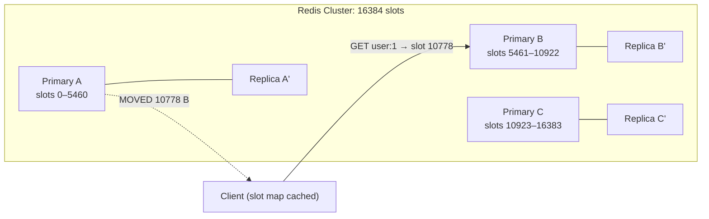
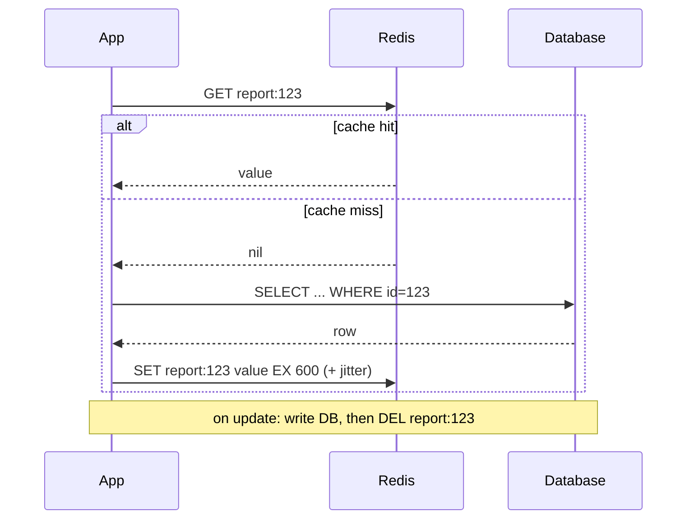
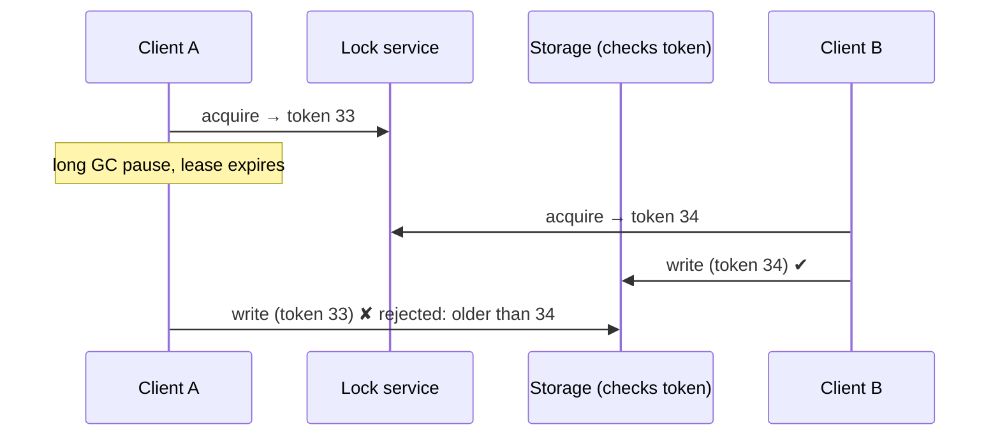

# Redis: Interview Notes

**Why this matters in interviews:** Redis shows up in almost every backend design, as a cache, rate limiter, lock, leaderboard, session store or lightweight queue. Interviewers use it to test your grasp of **caching strategy** (invalidation, stampedes, TTLs), **atomicity** (single-threaded commands, Lua, transactions that don't roll back), and **operations** (eviction, persistence, failover, cluster hash slots). Your Redis caching work, the part of the 40% batch-time reduction that came from caching, fits right in.

> [!NOTE]
> Every `redis-cli` puzzle below was run on **Redis 7.0**. Java examples target **Java 8** with Jedis 3.8, Lettuce 6.1 and Spring Data Redis 2.7 (Boot 2.7). The Java examples are compile-checked.

Difficulty legend: 🟢 Basic · 🟡 Intermediate · 🔴 Advanced · ⚡ Scenario

## Table of Contents

1. [Fundamentals and Data Structures](#1-fundamentals-and-data-structures)
2. [Keys, Expiry, Eviction and Memory](#2-keys-expiry-eviction-and-memory)
3. [Persistence, Replication, Sentinel and Cluster](#3-persistence-replication-sentinel-and-cluster)
4. [Caching Patterns](#4-caching-patterns)
5. [Atomicity: Transactions, Lua, Pipelines, Locks](#5-atomicity-transactions-lua-pipelines-locks)
6. [Messaging: Pub/Sub and Streams](#6-messaging-pubsub-and-streams)
7. [Java and Spring Data Redis](#7-java-and-spring-data-redis)
8. [Coding / Hands-on](#8-coding--hands-on)
9. [Production Scenarios](#9-production-scenarios)
10. [Cheat Sheet](#10-cheat-sheet)
11. [Revision Checklist](#11-revision-checklist)
12. [Beyond Java 8](#12-beyond-java-8)

---

## 1. Fundamentals and Data Structures

> **Mental model:** Redis is a *giant, lightning-fast `ConcurrentHashMap` in another process*, where the values aren't just strings but **data structures** (lists, sets, sorted sets, hashes, streams). Every command runs one at a time on a single main thread, so each command is atomic. The art is picking the structure whose built-in operations do your work server-side.

### Q1. 🟢 What is Redis, and why is it fast?

An in-memory data structure server. It's fast because:

- Data lives in **RAM**.
- It uses a **single-threaded event loop** for command execution, so there are no locks or context switches on data.
- Its data structures are efficient (listpacks, skip lists, hash tables).
- It uses non-blocking IO multiplexing (epoll).
- Since 6.0, it has optional **IO threads** for network reads and writes.

<details><summary>Cross-questions</summary>

**Q:** If Redis is single-threaded, how does it use multiple cores?

**A:** Command execution is single-threaded per instance. IO threads (6.0+) and background threads (persistence, lazy freeing) use other cores, and you scale out with **Redis Cluster** or several instances.
</details>

### Q2. 🟢 What are the core data types and their typical uses?

| Type | Commands | Use |
|---|---|---|
| **String** | GET/SET/INCR/SETNX/GETDEL | Cache values, counters, locks, flags |
| **Hash** | HSET/HGET/HINCRBY/HGETALL | Objects (user profile fields) |
| **List** | LPUSH/RPOP/LRANGE/BLPOP | Queues, recent-items lists |
| **Set** | SADD/SISMEMBER/SINTER | Unique members, tags, dedupe |
| **Sorted set (ZSET)** | ZADD/ZRANGE/ZREVRANK/ZRANGEBYSCORE | Leaderboards, time-ordered indexes, rate windows |
| **Stream** | XADD/XREADGROUP/XACK | Durable-ish event log with consumer groups |
| **HyperLogLog** | PFADD/PFCOUNT | Approximate unique counts (~12 KB) |
| **Bitmap** | SETBIT/BITCOUNT | Daily active flags per user id |
| **Geo** | GEOADD/GEOSEARCH | Nearby queries |

<details><summary>Cross-questions</summary>

**Q:** Why use a Hash rather than a JSON string for a user object?

**A:** You can read and update individual fields atomically (`HINCRBY visits`) without rewriting the whole object, and small hashes are memory-efficient.
</details>

### Q3. 🟢 How do `INCR` and non-integer values behave?

#### 🎯 Predict the output

```text
127.0.0.1:6390> INCR c
127.0.0.1:6390> INCRBY c 5
127.0.0.1:6390> SET s abc
127.0.0.1:6390> INCR s
```

<details><summary>Answer</summary>

`1`, `6`, `OK`, then `ERR value is not an integer or out of range`. `INCR` on a missing key starts from 0. It's **atomic**, so concurrent increments never lose updates, which makes it the standard for counters and rate limits.
</details>

### Q4. 🟡 How do sorted sets order tied scores?

#### 🎯 Predict the output

```text
ZADD lb 100 asha 250 ravi 250 meera 50 john
ZREVRANGE lb 0 2 WITHSCORES
ZREVRANK lb asha
```

<details><summary>Answer</summary>

`ravi 250`, `meera 250`, `asha 100`, then rank **2**. Members with equal scores are ordered **lexicographically** by member name ("meera" < "ravi"), and `ZREVRANGE` reverses that order, so ravi comes before meera. Ranks are 0-based.
</details>

<details><summary>Cross-questions</summary>

**Q:** What's the time complexity of `ZADD` and `ZRANK`?

**A:** O(log N). Sorted sets use a skip list plus a hash table (or a listpack when small).
</details>

### Q5. 🟢 How do Lists work as queues?

#### 🎯 Predict the output

```text
LPUSH q a b c
RPOP q
LRANGE q 0 -1
```

<details><summary>Answer</summary>

`RPOP` returns `a`, and `LRANGE` shows `c b`. `LPUSH a b c` pushes each element to the head in turn (giving c, b, a), and `RPOP` takes from the tail, so LPUSH + RPOP is **FIFO**. `BRPOP` blocks until an item arrives.
</details>

<details><summary>Cross-questions</summary>

**Q:** Why is a plain list a weak queue for important work?

**A:** Once popped, an item is gone. If the consumer crashes, it's **lost**. Use `LMOVE` into a processing list (the reliable-queue pattern), or **Streams** with consumer groups and acks.
</details>

### Q6. 🟢 What makes Sets useful?

They hold unique members: O(1) `SADD` and `SISMEMBER`, set algebra (`SINTER`, `SUNION`, `SDIFF`), and random members. Adding an existing member is a no-op, so `SADD s1 a b c` followed by `SADD s1 a` leaves `SCARD = 3`.

<details><summary>Cross-questions</summary>

**Q:** Can a Set dedupe event IDs forever?

**A:** Not without bounds, because memory grows forever. Use per-window sets with a TTL, or `SET eventId 1 NX EX 86400` per ID, or a Bloom filter (the RedisBloom module).
</details>

### Q7. 🟡 What is HyperLogLog?

A probabilistic structure for approximate **distinct counts** (a standard error of about 0.81%), using at most about 12 KB per key regardless of cardinality. `PFADD hll d1 d2 d3 d1` followed by `PFCOUNT hll` returns `3`. `PFMERGE` combines keys, for example daily counts into a weekly one.

<details><summary>Cross-questions</summary>

**Q:** Where would you use it?

**A:** Daily or monthly active devices per source at high volume, where exact precision isn't required.
</details>

### Q8. 🟡 What are Bitmaps good for?

Bit operations on strings: `SETBIT active:2024-03-01 <userId> 1`, `BITCOUNT`, and `BITOP AND/OR` across days (for example, "active on all 7 days"). They're extremely compact for dense integer IDs.

<details><summary>Cross-questions</summary>

**Q:** When are bitmaps a bad idea?

**A:** For sparse, huge IDs (such as a user ID of 2 billion with few users), where the bitmap allocates up to the highest offset. Use HyperLogLog or sets instead.
</details>

### Q9. 🟢 What is the time complexity of the common commands, and what are the traps?

Most single-key operations are O(1) or O(log N). The traps are O(N) commands on big keys: `KEYS *`, `HGETALL` or `SMEMBERS` on huge collections, `LRANGE 0 -1` on long lists, and `DEL` on a huge key (use `UNLINK`). Because Redis is single-threaded, **one slow command blocks everyone**.

<details><summary>Cross-questions</summary>

**Q:** What replaces `KEYS *` in production?

**A:** `SCAN` with a cursor and `MATCH` / `COUNT`, which iterates incrementally without blocking.
</details>

### Q10. 🟡 How does Redis compare with Memcached?

| | Redis | Memcached |
|---|---|---|
| Data types | Rich structures | Strings only |
| Persistence | RDB/AOF | None |
| Replication/HA | Replicas, Sentinel, Cluster | Client-side only |
| Threading | Single-threaded exec (+IO threads) | Multi-threaded |
| Use | Cache + many patterns | Simple large cache |

<details><summary>Cross-questions</summary>

**Q:** Why pick Redis for a cache even without persistence?

**A:** Its data structures (counters, sorted sets for ranking, hashes) and atomic operations make many features possible that go beyond key/value.
</details>

### Q11. 🟡 What are Redis modules, and Redis Stack?

Modules extend Redis: RedisJSON (a JSON document type), RediSearch (secondary indexes and full-text search), RedisBloom (Bloom and Cuckoo filters, Top-K), RedisTimeSeries. Redis Stack bundles them. Managed offerings vary in module support.

<details><summary>Cross-questions</summary>

**Q:** Is Google Memorystore module-compatible?

**A:** Support is limited and varies by tier and engine version. Check before designing around modules.
</details>

### Q12. 🟢 How do you store objects: String (JSON) or Hash?

| | JSON String | Hash |
|---|---|---|
| Read all | 1 GET | HGETALL |
| Update one field | Read-modify-write (race) | HSET/HINCRBY atomic |
| TTL | Per key | Per key (not per field before 7.4) |
| Nested data | Natural | Flat only |

<details><summary>Cross-questions</summary>

**Q:** What's the cache-friendly choice for API DTOs?

**A:** A serialised JSON string of the whole DTO. It's read as a whole, and it's invalidated as a whole.
</details>

### Q13. 🟡 What does a TTL do to hash updates?

#### 🎯 Predict the output

```text
HSET u:1 name Asha visits 1
HINCRBY u:1 visits 2
EXPIRE u:1 60
HSET u:1 city Pune
TTL u:1
```

<details><summary>Answer</summary>

`HINCRBY` returns `3`, and `TTL` is still `60` (or just under). Modifying a key's **contents** keeps its TTL. Only commands that *overwrite* the key (`SET`, or `DEL` + re-create) clear it.
</details>

### Q14. 🟡 How does `SET` interact with an existing TTL?

#### 🎯 Predict the output

```text
SET k v EX 100
SET k v2
TTL k
```

<details><summary>Answer</summary>

`-1`. A plain `SET` **replaces the value and clears the TTL**, so the key now lives forever. This is a classic cache bug: a refresh path that uses `SET` without `EX` creates immortal keys. Use `SET k v EX n` each time, or `SET k v KEEPTTL` (6.0+).
</details>

### Q15. 🟢 What do `TTL` return codes mean?

`-2`: the key doesn't exist. `-1`: the key exists with no expiry. `>= 0`: the seconds remaining. (`PTTL` gives milliseconds.)

<details><summary>Cross-questions</summary>

**Q:** Why check for `-1` in a cache audit?

**A:** Keys without TTLs in a cache namespace are candidates for memory leaks.
</details>

### Q16. 🟡 What is `SET NX EX`, and why is it the building block of locks?

`SET key value NX EX 30` sets the key **only if it doesn't exist**, with a 30 s expiry, **atomically** in one command.

#### 🎯 Predict the output

```text
SET lock a NX EX 30
SET lock b NX EX 30
GET lock
```

<details><summary>Answer</summary>

`OK`, `(nil)`, then `a`. The second client fails to acquire. Never use separate `SETNX` and `EXPIRE` commands: a crash in between leaves a lock that never expires.
</details>

### Q17. 🟡 What does `MGET` return for missing keys?

`MGET a b nope` returns `1`, `2` and `(nil)`, with one reply per key in order, and nil for the missing ones. It saves round trips. In a cluster, all the keys must be in the **same hash slot** (use hash tags) for a single command.

<details><summary>Cross-questions</summary>

**Q:** How do clients handle `MGET` across slots in a cluster?

**A:** Some clients (Lettuce) split the command per slot and merge the results. Raw commands fail with `CROSSSLOT`.
</details>

### Q18. 🟡 What are `GETDEL`, `GETEX` and `GETSET` for?

`GETDEL` (6.2+) reads and deletes atomically (one-time tokens). `GETEX` reads and changes the TTL (sliding expiry). `GETSET` (deprecated, use `SET ... GET`) swaps a value atomically and returns the old one.

<details><summary>Cross-questions</summary>

**Q:** Use case for `GETDEL`?

**A:** Redeeming a one-time login or verification token exactly once.
</details>

### Q19. 🟡 What are the key naming conventions?

Colon-separated namespaces: `app:env:entity:id:field`, for example `rpt:prod:report:123:meta`. Keep them short but readable, include the **tenant** for multi-tenant data, and include a **version** for cache schema changes (`v2:`), so a deploy can switch namespaces instead of flushing.

<details><summary>Cross-questions</summary>

**Q:** Why version cache keys?

**A:** After a DTO shape change, old cached JSON would fail to deserialise. A new key prefix avoids mixing formats. The old keys expire naturally.
</details>

### Q20. 🟡 What is `OBJECT ENCODING`, and why do small collections use less memory?

Redis uses compact encodings for small collections: `listpack` (earlier `ziplist`) for small hashes, lists and sorted sets, and `intset` for small integer sets. Beyond thresholds (`hash-max-listpack-entries` and similar), they convert to full hash tables and skip lists. Verified: `SADD ints 1 2 3` → `intset`, and a small integer string → `int`.

<details><summary>Cross-questions</summary>

**Q:** How can you exploit this?

**A:** Bucket many small objects into hashes of about 100 fields (for example `user:{id/100}` with field `id % 100`) to cut memory. It's a known optimisation.
</details>

### Q21. 🟡 What are Redis databases (0–15), and should you use them?

Logical namespaces within one instance (`SELECT 1`). They aren't supported in **Redis Cluster** (only DB 0), they share one thread and memory, and they're poor for isolation. Prefer key prefixes or separate instances.

<details><summary>Cross-questions</summary>

**Q:** Why separate instances for cache vs locks or queues?

**A:** Different eviction policies. A cache wants `allkeys-lru`, while locks or queues must **never** be evicted (`noeviction`).
</details>

### Q22. 🟢 Is Redis a database or a cache?

Both, depending on configuration. As a cache, data is disposable, with eviction on and persistence optional. As a primary store, you need AOF persistence, replication, backups, and an understanding that asynchronous replication can lose recent writes on failover.

<details><summary>Cross-questions</summary>

**Q:** Would you keep the only copy of orders in Redis?

**A:** Generally no. Keep the source of truth in a durable database, and use Redis for speed.
</details>

---

## 2. Keys, Expiry, Eviction and Memory

> **Mental model:** Redis memory is a *fixed-size backpack*. **TTLs** are items with expiry dates you throw out when you notice they've expired. **Eviction** is what you do when the backpack is full and you must drop something: least recently used, least frequently used, or refusing new items altogether.

### Q23. 🟡 How does key expiry work internally?

There are two mechanisms. **Lazy** expiry checks the TTL when a key is accessed. **Active** expiry runs a periodic sampling of keys with TTLs, deleting the expired ones and repeating while many are found. So expired keys may linger briefly in memory, but they're never returned.

<details><summary>Cross-questions</summary>

**Q:** What happens to expired keys on replicas?

**A:** Replicas don't expire keys themselves (the primary sends `DEL`), but they hide logically expired keys from reads.
</details>

### Q24. 🟡 What are the eviction policies?

| Policy | Evicts |
|---|---|
| `noeviction` (default) | Nothing — writes fail with OOM error when full |
| `allkeys-lru` | Least recently used, any key |
| `allkeys-lfu` | Least frequently used, any key (4.0+) |
| `volatile-lru` / `volatile-lfu` | LRU/LFU among keys **with TTL** |
| `volatile-ttl` | Keys with nearest expiry |
| `allkeys-random` / `volatile-random` | Random |

**Verified defaults:** `maxmemory 0` (no limit) and `maxmemory-policy noeviction`.

<details><summary>Cross-questions</summary>

**Q:** Which policy for a pure cache?

**A:** `allkeys-lru` or `allkeys-lfu`, with `maxmemory` set. With `volatile-*` and keys lacking TTLs, Redis may have nothing to evict and fail writes.

**Q:** Is Redis LRU exact?

**A:** No. It's **approximated** by sampling (`maxmemory-samples`, 5 by default). That's good enough and cheap.
</details>

### Q25. 🟡 What happens when `maxmemory` is reached under `noeviction`?

Write commands that could increase memory fail with `OOM command not allowed when used memory > 'maxmemory'`. Reads still work. For lock or queue instances that's intentional. For caches it's an outage, so set a policy.

<details><summary>Cross-questions</summary>

**Q:** What if `maxmemory` is 0 on a box with 4 GB of RAM?

**A:** Redis grows until the OS swaps or the OOM killer strikes. Always set `maxmemory` (leaving headroom for fork copy-on-write and buffers).
</details>

### Q26. 🟡 What are "big keys", and why are they dangerous?

Keys with huge values (a 50 MB string, a hash with millions of fields). Reading them is slow (network and serialisation), deleting them blocks (`DEL` frees memory synchronously, so use `UNLINK`), they cause uneven cluster slots, and they cause replication spikes. Find them with `redis-cli --bigkeys` or `--memkeys`, or `MEMORY USAGE key`.

<details><summary>Cross-questions</summary>

**Q:** How do you break a big key apart?

**A:** Shard it into sub-keys (`feed:{user}:0..N`), or use appropriate data structures with paging (`HSCAN`, `ZRANGE` with limits).
</details>

### Q27. 🟡 What are "hot keys"?

A single key receiving a disproportionate share of traffic (a global counter, the home-page config). In a cluster, it overloads one shard. Mitigate with a **local in-process cache** in front (Caffeine with a short TTL), key replication (`hot:1`..`hot:N` with random reads), or splitting the counter.

<details><summary>Cross-questions</summary>

**Q:** How do you find them?

**A:** `redis-cli --hotkeys` (with an LFU policy), `MONITOR` briefly (it's expensive), or client-side metrics per key prefix.
</details>

### Q28. 🟡 How do you reduce Redis memory usage?

- Shorter keys, and compact encodings (small hashes).
- Compression of large JSON values (for example gzip or Snappy client-side, when it pays off).
- TTLs everywhere.
- Avoiding storing duplicate data.
- HyperLogLog or Bloom filters instead of sets for counts and membership.
- `activedefrag` for fragmentation.

<details><summary>Cross-questions</summary>

**Q:** What does `mem_fragmentation_ratio` tell you?

**A:** RSS divided by used memory. Well above 1.5 means fragmentation (consider active defrag or a restart). Below 1 means swapping, which is very bad.
</details>

### Q29. 🟢 What is `UNLINK` vs `DEL`?

`DEL` frees memory synchronously, so it's O(size) for big keys and blocks. `UNLINK` removes the key from the keyspace immediately and frees the memory in a **background thread**. With `lazyfree-lazy-user-del yes`, `DEL` behaves like `UNLINK`.

<details><summary>Cross-questions</summary>

**Q:** What about `FLUSHALL`?

**A:** Use `FLUSHALL ASYNC` (or lazyfree settings) to avoid blocking. Better still, never flush production caches wholesale during peak (stampede risk).
</details>

### Q30. 🟡 How do you implement sliding expiration (session-style)?

Refresh the TTL on each access: `GETEX key EX 1800` (6.2+), or `EXPIRE` after a read (two commands, which is fine for sessions). Spring Session's Redis store refreshes the expiry on access automatically.

<details><summary>Cross-questions</summary>

**Q:** What's the risk with sliding expiry on a cache?

**A:** Hot-but-stale data may never expire. Use absolute TTLs for correctness-sensitive caches.
</details>

### Q31. 🟡 Why add TTL jitter?

If thousands of keys are written together with the same TTL (for example at deploy or batch warm-up), they **all expire together**, and the database gets hammered by the misses (the cache avalanche). Add random jitter: `ttl = base + random(0, base * 0.1)`.

<details><summary>Cross-questions</summary>

**Q:** Where did this matter for batch jobs?

**A:** When a batch warm-up loads reference data into Redis at 02:00 with a 24 h TTL, it all expires at 02:00 the next day, just as the next batch starts. Jitter or refresh-ahead prevents that.
</details>

### Q32. 🟡 How do you count keys by pattern safely?

Use `SCAN 0 MATCH rpt:* COUNT 1000` iteratively. Never use `KEYS` in production. For frequent counts, maintain the counts yourself (a set of IDs, or a counter updated on write).

<details><summary>Cross-questions</summary>

**Q:** Can `SCAN` return duplicates?

**A:** Yes. `SCAN` guarantees full coverage of keys that existed throughout the scan, but it may return some keys more than once, so dedupe client-side.
</details>

### Q33. 🟡 What is client output buffer overflow?

Slow clients (subscribers, replicas, big `MONITOR` or `KEYS` responses) accumulate output buffers. `client-output-buffer-limit` disconnects clients that exceed their limits. A replica disconnected during a full sync can go into a **resync loop**.

<details><summary>Cross-questions</summary>

**Q:** How can pub/sub hurt Redis memory?

**A:** A slow subscriber's output buffer grows until the limit is hit and it's disconnected, losing messages.
</details>

### Q34. 🟡 What is the `maxmemory` headroom rule?

Leave RAM for **fork copy-on-write** during RDB and AOF rewrites (write-heavy instances may need up to 2× in the worst case), replication buffers, client buffers and fragmentation. A common guideline is `maxmemory` at 60–75% of the instance's RAM for write-heavy workloads.

<details><summary>Cross-questions</summary>

**Q:** Why does `fork()` latency matter?

**A:** Forking a large process copies page tables. It's a blocking pause of milliseconds to seconds on big heaps (worse with transparent huge pages enabled, so disable THP).
</details>

### Q35. 🟡 How do keyspace notifications work?

`notify-keyspace-events` makes Redis publish events (for example expired or evicted keys) on pub/sub channels. It's useful for cache invalidation hooks, but it's **fire-and-forget**: a disconnected subscriber misses events, and expired events fire when the deletion happens (lazy or active), not exactly at TTL time.

<details><summary>Cross-questions</summary>

**Q:** Would you build billing on expiry notifications?

**A:** No. They're unreliable timing and delivery. Use a durable scheduler or delay queue.
</details>

### Q36. 🟡 What is the `MEMORY DOCTOR` / `INFO memory` checklist?

`used_memory`, `used_memory_rss`, `mem_fragmentation_ratio`, `maxmemory`, `evicted_keys`, `expired_keys`, and the keyspace hits and misses (hit ratio). Alert on the eviction rate, a low hit ratio, memory close to max, and a high fragmentation ratio.

<details><summary>Cross-questions</summary>

**Q:** How do you compute the cache hit ratio?

**A:** `keyspace_hits / (keyspace_hits + keyspace_misses)`. Track it per application namespace with client metrics too.
</details>

---
## 3. Persistence, Replication, Sentinel and Cluster

> **Mental model:** **RDB** is a *periodic photograph* of memory: compact, and quick to restore, but you lose everything since the last photo. **AOF** is a *diary* of every write: more durable, larger, and slower to replay. **Replicas** are *understudies* that copy the lead asynchronously. **Sentinel** is the *stage manager* who promotes an understudy. **Cluster** *splits the play* across several stages by hash slot.

### Q37. 🟡 RDB vs AOF?

| | RDB snapshot | AOF (append-only file) |
|---|---|---|
| How | Fork + write point-in-time dump | Log every write command |
| Data loss window | Since last snapshot (minutes) | `appendfsync everysec` → ~1 s; `always` → none (slow) |
| File size / restart | Compact / fast load | Larger / slower replay (rewrite compacts) |
| Use | Backups, fast restarts | Durability |

Many deployments use **both** (in 7.0+, the AOF uses a multi-part base plus increment format).

<details><summary>Cross-questions</summary>

**Q:** What does `appendfsync everysec` risk?

**A:** Up to about one second of writes lost on a crash, which is the usual trade-off.

**Q:** For a pure cache, which persistence would you use?

**A:** Often **none**, or RDB for faster warm restarts. A cache can be rebuilt from the source of truth.
</details>

### Q38. 🟡 How does replication work?

Replicas connect to the primary, receive a **full sync** (an RDB snapshot plus buffered commands) initially, then a **stream of commands**. After short disconnects, a **partial resync** uses the replication backlog, if the offset is still in it. Replication is **asynchronous**. `WAIT n timeout` can block until n replicas have acked, but that isn't strong consistency.

<details><summary>Cross-questions</summary>

**Q:** Why can a failover lose acknowledged writes?

**A:** The primary acked the client before the replicas received the write. If it dies, the promoted replica doesn't have it.
</details>

### Q39. 🟡 What does Redis Sentinel do?

It **monitors** the primary and replicas, **notifies**, performs automatic **failover** (a quorum of Sentinels agrees the primary is down, a leader Sentinel promotes a replica, and the others reconfigure), and acts as a **config provider**: clients ask Sentinel for the current primary's address.

<details><summary>Cross-questions</summary>

**Q:** Why run at least 3 Sentinels?

**A:** Quorum and leader election need a majority. With 2 Sentinels, a partition can block failover, or cause split decisions.
</details>

### Q40. 🔴 How does Redis Cluster shard data?

The keyspace is split into **16,384 hash slots**: `slot = CRC16(key) mod 16384`. Each primary owns a range of slots and has replicas. Clients cache the slot → node map, and follow `MOVED` (a permanent redirect) or `ASK` (during migration) redirections.



<details><summary>Cross-questions</summary>

**Q:** What limits do multi-key commands have in a cluster?

**A:** All the keys must map to the **same slot**, or you get `CROSSSLOT`. That includes `MGET`, `MSET`, transactions and Lua scripts (for their KEYS).
</details>

### Q41. 🟡 What are hash tags?

If a key contains `{...}`, only the substring inside the braces is hashed. So `{user:1}:profile` and `{user:1}:cart` land in the **same slot**, which enables multi-key operations, transactions and Lua on them.

#### 🎯 Predict the output

```java
import io.lettuce.core.cluster.SlotHash;

public class HashTags {
    public static void main(String[] args) {
        int a = SlotHash.getSlot("{user:1}:profile");
        int b = SlotHash.getSlot("{user:1}:cart");
        int c = SlotHash.getSlot("user:1");
        System.out.println(a == b);
        System.out.println(a == c);
        System.out.println(a >= 0 && a < 16384);
    }
}
```

<details><summary>Answer</summary>

`true`, `true`, `true`. Both tagged keys hash only `user:1`, which is also exactly the plain key `user:1`, so all three share a slot (10778 in this run). Overusing a single tag, such as `{global}`, puts **everything on one shard** and defeats sharding.
</details>

### Q42. 🟡 What happens during a cluster failover?

When a primary fails, its replicas notice (through cluster bus heartbeats and `cluster-node-timeout`), one replica is elected by the other primaries, and it takes over the slots. Clients get connection errors, then `MOVED` redirects, and they refresh their topology. Writes acked but not yet replicated can be lost.

<details><summary>Cross-questions</summary>

**Q:** What must client libraries be configured for?

**A:** Topology refresh (periodic and adaptive refresh in Lettuce), timeouts and retries. Otherwise clients keep hitting dead nodes.
</details>

### Q43. 🟡 Sentinel or Cluster?

| | Sentinel (+ replicas) | Cluster |
|---|---|---|
| Scales writes/memory | No (single primary) | Yes (multiple primaries) |
| Multi-key ops | Unrestricted | Same-slot only |
| DBs 0–15 | Yes | Only DB 0 |
| Complexity | Lower | Higher |

<details><summary>Cross-questions</summary>

**Q:** When does a cache need Cluster?

**A:** When the data set or write throughput exceeds what one primary can handle (memory beyond tens of GB, or very high ops/sec).
</details>

### Q44. 🟡 How do managed Redis offerings fit (Memorystore, ElastiCache, Azure Cache)?

They handle provisioning, replicas, failover, patching and monitoring. Differences to watch: failover behaviour and duration, supported versions and modules, persistence options, cluster vs standalone tiers, network access (VPC or private IP), and maintenance windows.

<details><summary>Cross-questions</summary>

**Q:** What's your responsibility on Memorystore?

**A:** Key design, TTLs, eviction policy, client timeouts and retries, connection pooling, and handling brief failover errors gracefully.
</details>

### Q45. 🟡 What does `WAIT` give you?

`WAIT numreplicas timeout` blocks until the preceding writes are acknowledged by N replicas. It reduces the chance of loss on failover, but it's **not** strong consistency: a replica can still lose the write, and failover may pick a replica that didn't ack.

<details><summary>Cross-questions</summary>

**Q:** Is `WAIT` enough to use Redis as a ledger?

**A:** No. Use a database designed for durable consistency.
</details>

### Q46. 🟡 How do you back up Redis?

Copy RDB snapshots (`BGSAVE`, then copy `dump.rdb` off-host), or use managed backups and exports. Test the restores. For a cache, backups mainly speed up warm-up, and the source of truth is elsewhere.

<details><summary>Cross-questions</summary>

**Q:** Why is `SAVE` (not `BGSAVE`) dangerous in production?

**A:** It blocks the whole server while writing the snapshot.
</details>

### Q47. 🟡 What is the replica read consistency concern?

Replicas lag. Reading from replicas (`READONLY` in cluster, or Lettuce `ReadFrom.REPLICA_PREFERRED`) scales reads, but it can return stale values. Use it only for read-heavy, staleness-tolerant data.

<details><summary>Cross-questions</summary>

**Q:** Which reads must go to the primary?

**A:** Locks, rate-limit counters, and anything read right after a write.
</details>

### Q48. 🟡 How do you scale a cluster (resharding)?

Add nodes, then migrate slots (`redis-cli --cluster reshard` or `rebalance`). Keys move slot by slot. During migration, clients receive `ASK` redirects for keys that have already moved. Big keys make migrations slow and blocking.

<details><summary>Cross-questions</summary>

**Q:** Why do big keys hurt resharding?

**A:** Migrating a key is atomic per key, so a huge key blocks both nodes while it's serialised and transferred.
</details>

### Q49. 🟡 What is split-brain in Redis, and how do settings limit the damage?

A partitioned old primary keeps accepting writes from clients on its side, and those writes are lost when it rejoins as a replica. `min-replicas-to-write` together with `min-replicas-max-lag` make a primary **refuse writes** when it can't see enough healthy replicas, which reduces the loss window.

<details><summary>Cross-questions</summary>

**Q:** What's the trade-off?

**A:** Availability. The primary stops accepting writes during a network issue even if it's healthy.
</details>

### Q50. 🟡 What does persistence cost for latency?

`fork()` pauses on a big dataset, disk IO contention during AOF fsync or rewrite, and copy-on-write memory growth. Monitor `latest_fork_usec`, and use `LATENCY DOCTOR`. Put persistence on fast disks, or offload it to replicas.

<details><summary>Cross-questions</summary>

**Q:** Can you disable persistence on the primary and persist on a replica?

**A:** Possible, but dangerous: if the primary restarts empty, the replicas sync from it and **wipe their data**. Use it only with care (for example, disable auto-restart).
</details>

### Q51. 🟡 How does a client find the primary under Sentinel?

The client connects to the Sentinels, asks `SENTINEL get-master-addr-by-name mymaster`, and subscribes to the switch-master events. Spring Data Redis supports it with `spring.redis.sentinel.master` and `nodes`.

<details><summary>Cross-questions</summary>

**Q:** What if the app hard-codes the primary IP?

**A:** After a failover, it keeps writing to the old node (now a replica, read-only), and you get write errors until a redeploy.
</details>

### Q52. 🟡 What are the typical cluster sizing numbers?

Common guidance: shard to keep each node's dataset moderate (tens of GB at most). Every primary needs at least one replica for HA. Plan memory as data + overhead + fork headroom. Use at least 3 primaries for a proper quorum.

<details><summary>Cross-questions</summary>

**Q:** Why at least 3 primaries?

**A:** Failover election needs a majority of primaries. With fewer, a single failure can block failover.
</details>

### Q53. 🟡 What is Redis's position in CAP?

Replication is asynchronous, so Redis (Sentinel or Cluster) favours **availability and low latency** over strong consistency. It's not linearizable across failovers. Design with that in mind for locks and counters.

<details><summary>Cross-questions</summary>

**Q:** How does this affect distributed locks?

**A:** A lock acquired on a primary that fails before replicating can be acquired again on the new primary, so two holders exist. That's the root of the Redlock debate (Q84).
</details>

### Q54. 🟡 How do you monitor Redis in production?

`INFO` (memory, stats, replication, persistence, clients), `SLOWLOG GET`, `LATENCY` monitoring, and an exporter to Prometheus (redis_exporter) or cloud monitoring. The key alerts: memory percentage, evictions, the hit ratio, connected clients, blocked clients, replication lag, failed rejections (`rejected_connections`), and slowlog entries.

<details><summary>Cross-questions</summary>

**Q:** What does `SLOWLOG` capture?

**A:** Commands whose **execution time** exceeded `slowlog-log-slower-than` (10 ms by default). It excludes network and queue time.
</details>

---

## 4. Caching Patterns

> **Mental model:** A cache is a *sticky note on your monitor* holding an answer you looked up in the big book (the database). It's fast, but it can be **stale**, and it can fall off. Every caching decision answers three questions: *when do I write the note*, *when do I throw it away*, and *what happens when a hundred people look for the same missing note at once*.



### Q55. 🟢 What is cache-aside (lazy loading)?

The application checks the cache, and on a miss it loads from the database and populates the cache with a TTL. On a write, it updates the DB and **invalidates** (deletes) the cache key. It's the most common pattern (Spring's `@Cacheable` is cache-aside).

<details><summary>Cross-questions</summary>

**Q:** Why delete on update instead of setting the new value?

**A:** Deleting avoids races where two concurrent writers set values in the wrong order, and it avoids caching values nobody reads. The next read repopulates.
</details>

### Q56. 🟡 What are write-through, write-behind and refresh-ahead?

| Pattern | How | Pros | Cons |
|---|---|---|---|
| Write-through | Write cache and DB synchronously | Cache always warm | Write latency; caches unread data |
| Write-behind | Write cache; flush to DB asynchronously | Fast writes, batching | Data loss risk, complexity |
| Refresh-ahead | Refresh hot keys before TTL expiry | No miss latency for hot keys | Extra load, prediction |

<details><summary>Cross-questions</summary>

**Q:** Where does write-behind make sense?

**A:** For high-frequency counters or metrics (increment in Redis, flush aggregates to the DB every minute), where losing a few seconds is acceptable.
</details>

### Q57. 🔴 What are cache stampede, penetration and avalanche, and their fixes?

| Problem | What happens | Fixes |
|---|---|---|
| **Stampede / thundering herd** | Hot key expires → many concurrent misses hit DB | Per-key lock/single-flight, `@Cacheable(sync=true)` (per JVM), early probabilistic refresh, stale-while-revalidate |
| **Penetration** | Requests for keys that **don't exist** always miss → DB hammered (attack or bug) | Cache negative results with short TTL, Bloom filter of valid ids, input validation |
| **Avalanche** | Many keys expire at the same time or Redis goes down → DB overwhelmed | TTL jitter, staggered warm-up, circuit breaker + local cache fallback, HA Redis |

<details><summary>Cross-questions</summary>

**Q:** How does a distributed single-flight work?

**A:** On a miss, a request does `SET lock:key token NX PX 5000`. The winner loads the data and populates the cache. The losers wait briefly and re-read the cache, or serve stale data.
</details>

### Q58. 🟡 How do you choose TTLs?

Base them on how **stale** the business can tolerate, how often the data changes, and the cost of a miss. Examples: reference data (countries) gets hours to days, plus explicit invalidation. User profiles get minutes. Report results get the report's freshness SLA. Always add jitter.

<details><summary>Cross-questions</summary>

**Q:** Why not an infinite TTL with invalidation only?

**A:** A missed invalidation (a bug or a failed event) leaves stale data forever. A TTL is the safety net.
</details>

### Q59. 🔴 What is the classic cache-DB race condition, and how do you close it?

In cache-aside: thread A misses and reads the **old** value from the DB. Thread B updates the DB and deletes the key. Thread A then writes the **old** value into the cache, which stays stale until its TTL.

The mitigations:

- Short TTLs.
- **Delayed double delete** (delete again after about 500 ms).
- Versioned values: only set if the version is newer (a Lua compare).
- CDC-driven invalidation from the DB log (Debezium) after the commit.

<details><summary>Cross-questions</summary>

**Q:** Why invalidate *after* the DB commit, not before?

**A:** If you delete first, a concurrent read can repopulate the cache with the old value before the DB commit.
</details>

### Q60. 🟡 Local cache (Caffeine) vs distributed cache (Redis)?

| | Local (in-process) | Redis |
|---|---|---|
| Latency | Nanoseconds | ~0.2–1 ms network |
| Consistency across pods | Each pod differs | Shared |
| Memory | JVM heap (GC pressure) | Separate |
| Invalidation | Hard (need pub/sub) | Single place |

A **two-level cache** (Caffeine L1 with a short TTL, plus Redis L2) is common for hot, read-mostly data.

<details><summary>Cross-questions</summary>

**Q:** How do you invalidate L1 caches across pods?

**A:** Publish an invalidation message (Redis pub/sub or Kafka) that every pod subscribes to, and keep the L1 TTLs short as a safety net.
</details>

### Q61. 🟡 How did caching contribute to the batch optimisation?

The batch enriched 200K records with **reference lookups** (for example, customer tier and config per record). Without caching, that's N remote or DB lookups. The fix was to preload the reference data into a local map for the job, backed by Redis for data shared across instances, and to **batch-fetch** misses with `MGET` or pipelining. Together with chunking and parallelism, that gave the 40% reduction.

> [!TIP]
> Say it like a senior engineer: "The biggest win wasn't the cache itself, it was turning 200K point lookups into a few hundred batched ones. I measured the hit ratio and made sure warm-up didn't stampede the database."

<details><summary>Cross-questions</summary>

**Q:** How did you keep the cached reference data from going stale mid-batch?

**A:** The batch took a snapshot at the start (a consistent view for the whole job), with a TTL shorter than the reference data's change frequency, and it invalidated on reference-data update events.
</details>

### Q62. 🟡 How do you cache paginated or list results?

Cache the **IDs** of the list (a sorted set or a list of IDs per query key), and cache each **entity** separately. Invalidation then touches individual entities, and lists refresh by TTL. Or cache small first pages only, and never deep pagination.

<details><summary>Cross-questions</summary>

**Q:** Why not cache the full JSON of every page?

**A:** One entity update invalidates many pages, and the key space explodes with the filter combinations.
</details>

### Q63. 🟡 How do you cache in multi-tenant systems?

Put the tenant (and the user or role, where the result depends on permissions) **in the key**: `t:{tenantId}:report:{id}`. Never cache authorisation-dependent results under a shared key. Consider per-tenant quotas to stop one tenant from evicting everyone's hot keys.

<details><summary>Cross-questions</summary>

**Q:** What's the worst multi-tenant cache bug?

**A:** A key without the tenant, which serves tenant A's report to tenant B, a data breach.
</details>

### Q64. 🟡 What is negative caching?

Caching a "not found" marker (`SET user:999 "__NULL__" EX 60`) so repeated lookups for missing items don't hit the DB. Use short TTLs, and invalidate them when the item is created.

<details><summary>Cross-questions</summary>

**Q:** What's the risk?

**A:** A newly created item appears missing until the negative entry expires, unless the create path deletes it.
</details>

### Q65. 🟡 How does Spring's `@Cacheable` map onto Redis?

`RedisCacheManager` stores entries under `cacheName::key` with the configured TTL and serialiser (JDK serialisation by default, so configure JSON). `sync = true` gives single-flight **per JVM** only. `@CacheEvict(allEntries = true)` uses `KEYS` or `SCAN`-based deletion, which is expensive on big caches.

<details><summary>Cross-questions</summary>

**Q:** Why switch from the JDK serialiser to JSON?

**A:** It's language-neutral and readable, it avoids `Serializable` requirements and class-version breakage, and it's often smaller.
</details>

### Q66. 🟡 How do you warm a cache safely after a deploy or flush?

Warm the top-N hot keys gradually (rate-limited), using the access logs or a precomputed list. Let the rest fill lazily. Avoid mass `SET`s with identical TTLs (jitter them). Watch DB load during warm-up.

<details><summary>Cross-questions</summary>

**Q:** Why not just flush and let traffic refill it?

**A:** A cold cache at peak equals a DB stampede. That's the avalanche scenario.
</details>

### Q67. 🟡 What's a good serialisation format for cached values?

JSON (readable, portable), Smile or MessagePack (smaller), or Protobuf (compact, schema'd). Add a **version** prefix to keys or values, and compress large values. Measure the serialisation CPU, since it can dominate cache latency.

<details><summary>Cross-questions</summary>

**Q:** How do you roll out a DTO change without deserialisation errors?

**A:** Bump the key version (`v3:`), so new code reads new keys and old keys expire. Or use tolerant deserialisation (ignore unknown fields).
</details>

### Q68. 🟡 Should you cache DB query results or computed API responses?

Cache at the layer with the **highest reuse and cost**. Expensive aggregations and report metadata cache well as computed DTOs. Row-level caching duplicates what the DB buffer cache already does, unless the DB is remote or overloaded.

<details><summary>Cross-questions</summary>

**Q:** What about caching report files?

**A:** Cache the **metadata** plus a GCS signed URL (with a TTL shorter than the URL's expiry), not the file bytes in Redis.
</details>

### Q69. 🟡 How do you measure whether a cache helps?

Look at the hit ratio per key prefix, latency with and without the cache (p50 and p99), DB load reduction, memory use, and eviction rate. A cache with a 20% hit ratio may just add latency and complexity.

<details><summary>Cross-questions</summary>

**Q:** What's a good hit ratio?

**A:** It depends on the workload. For hot reference data, above 95%. For long-tail content, lower can still pay off if the misses are expensive.
</details>

### Q70. 🟡 How do you invalidate caches on data changes from other services?

Consume **change events** (Kafka, Pub/Sub, CDC) and delete the affected keys. Keep TTLs as a safety net. Make the invalidation handlers idempotent, and design the key naming so invalidation can compute keys from the event.

<details><summary>Cross-questions</summary>

**Q:** What if an invalidation event is lost?

**A:** The TTL eventually corrects it. For critical freshness, use versioned reads or shorter TTLs.
</details>

### Q71. 🟡 How do you cache with Redis in a request path without making Redis a single point of failure?

Use short client timeouts (for example 50–100 ms), a circuit breaker around Redis calls, and a fallback to the DB (with a rate limit or bulkhead to protect it). Optionally keep a local L1 cache. Never let a Redis outage block all request threads.

<details><summary>Cross-questions</summary>

**Q:** What's the danger of falling back to the DB for everything when Redis is down?

**A:** An avalanche on the DB. Protect it with load shedding, and serve stale data from L1 where possible.
</details>

### Q72. 🟡 What is a rate limiter, and which Redis structures implement it?

| Algorithm | Redis implementation | Trait |
|---|---|---|
| Fixed window | `INCR key:{minute}` + `EXPIRE` | Simple; burst at window edges |
| Sliding log | ZSET of timestamps, `ZREMRANGEBYSCORE` + `ZCARD` | Accurate; memory per request |
| Sliding window counter | Two fixed windows weighted | Good approximation |
| Token bucket | Lua script storing tokens + last refill | Smooth bursts (used by Spring Cloud Gateway) |

<details><summary>Cross-questions</summary>

**Q:** Why implement the token bucket in Lua?

**A:** The read-compute-write must be atomic across concurrent requests and instances. Lua runs atomically on the Redis server.
</details>

---
## 5. Atomicity: Transactions, Lua, Pipelines, Locks

> **Mental model:** Every single Redis command is atomic, because only one runs at a time. `MULTI`/`EXEC` is a *sealed envelope of commands* delivered together, but if one command inside fails, the others still happen: **there's no rollback**. A **Lua script** is a *tiny stored procedure* that runs as one atomic step, and it's where real conditional logic belongs.

### Q73. 🔴 What do `MULTI`/`EXEC` guarantee, and what don't they?

#### 🎯 Predict the output

```text
MULTI
SET a 1
INCR a
LPUSH a x        # wrong type: a is a string
SET b 2
EXEC
GET a
GET b
```

<details><summary>Answer</summary>

The `EXEC` replies are `OK`, `2`, `WRONGTYPE Operation against a key holding the wrong kind of value`, `OK`. Then `GET a` returns `2` and `GET b` returns `2`.

Commands are queued and executed **together, with nothing else interleaved**, but a command that fails at *runtime* **doesn't roll back** the others. Only syntax errors detected at queue time abort the whole transaction.
</details>

<details><summary>Cross-questions</summary>

**Q:** Why doesn't Redis roll back?

**A:** By design: runtime errors are programming errors (the wrong type), and supporting rollback would complicate the engine and slow it down.
</details>

### Q74. 🟡 What does `WATCH` add?

Optimistic locking. `WATCH key`, read the value, then `MULTI` … `EXEC`. If a watched key changed after the `WATCH`, `EXEC` returns **nil** (aborted), and the client retries. It's a check-and-set.

<details><summary>Cross-questions</summary>

**Q:** Why do many teams prefer Lua over WATCH?

**A:** With Lua there's no retry loop, the logic runs server-side in one round trip, and it's simpler under contention.
</details>

### Q75. 🟡 How do Lua scripts give atomic conditional logic?

`EVAL` runs the script atomically. No other command runs while it executes.

#### 🎯 Predict the output

```text
SET n 10
EVAL "local v=tonumber(redis.call('GET',KEYS[1])); if v>=tonumber(ARGV[1]) then return redis.call('DECRBY',KEYS[1],ARGV[1]) else return -1 end" 1 n 3
EVAL "<same script>" 1 n 20
```

<details><summary>Answer</summary>

`7`, then `-1`. The first call reserves 3 of 10. The second refuses (20 > 7) without changing anything. That's an atomic "decrement if enough stock", with no race between check and write.
</details>

<details><summary>Cross-questions</summary>

**Q:** What are the rules for Lua in Redis?

**A:** Keep scripts short (they block the server), pass every key through `KEYS[]` (required for cluster slot routing), use `EVALSHA` or cached scripts to avoid resending, and make them deterministic.
</details>

### Q76. 🟡 What is pipelining, and how is it different from transactions?

**Pipelining** sends many commands without waiting for each reply, which saves network **round trips** (huge for batch operations). The commands aren't atomic as a group, and other clients' commands can interleave. **Transactions** are atomic (no interleaving) but still send every command. You can pipeline a `MULTI` block too.

<details><summary>Cross-questions</summary>

**Q:** How much can pipelining help a batch job?

**A:** With 1 ms RTT, 200K sequential GETs take about 200 s of network wait. Pipelined in batches of 1,000, it's about 200 round trips, which takes seconds.
</details>

### Q77. 🟡 How do you implement a correct single-instance distributed lock?

1. **Acquire:** `SET lock:job:42 <uniqueToken> NX PX 30000`.
2. **Release:** a Lua script that deletes **only if the value equals your token**, so you never delete someone else's lock after your own lease expired.
3. **Lease time** must exceed the expected work, or you renew it (a watchdog) while working.

```text
-- release.lua
if redis.call("GET", KEYS[1]) == ARGV[1] then
  return redis.call("DEL", KEYS[1])
else
  return 0
end
```

<details><summary>Cross-questions</summary>

**Q:** What goes wrong with a plain `DEL` to release?

**A:** Client A's lock expires during a long GC pause. Client B acquires it. A wakes up and `DEL`s **B's** lock, so now C can enter too, and several holders run at once.
</details>

### Q78. 🔴 Can a Redis lock guarantee mutual exclusion?

Not strictly. Leases can expire during GC pauses, and asynchronous failover can lose the lock key, so two holders are possible. For correctness-critical work, add **fencing tokens**: an incrementing number issued with the lock, which the protected resource checks and rejects if it's older. Or use a consensus-based store (ZooKeeper, etcd) or DB row locks.



<details><summary>Cross-questions</summary>

**Q:** When is a Redis lock good enough?

**A:** For **efficiency** locks (avoiding duplicate work, like two pods running the same scheduled job), where an occasional double execution is tolerable because the work is idempotent.
</details>

### Q79. 🟡 What is Redisson, and what does it add?

A Java Redis client with high-level primitives: `RLock` (a reentrant lock with a **watchdog** that auto-extends the lease while the holder is alive), fair locks, read/write locks, semaphores, rate limiters, and distributed collections. It's convenient, and the same caveats about failover apply.

<details><summary>Cross-questions</summary>

**Q:** What does the watchdog solve?

**A:** Picking a lease time. The lock renews while the JVM holds it, and expires soon after a crash.
</details>

### Q80. 🟡 How do you implement a distributed rate limiter with Lua (fixed window)?

```text
-- KEYS[1]=rl:{client}:{window}  ARGV[1]=limit  ARGV[2]=windowSeconds
local current = redis.call("INCR", KEYS[1])
if current == 1 then
  redis.call("EXPIRE", KEYS[1], ARGV[2])
end
if current > tonumber(ARGV[1]) then
  return 0
end
return 1
```

<details><summary>Cross-questions</summary>

**Q:** Why set the EXPIRE only when `current == 1`?

**A:** So the window isn't extended on every request. The script's atomicity guarantees the key never lives without a TTL.
</details>

### Q81. 🟡 Are commands in a pipeline or transaction atomic in a Redis Cluster?

Transactions and Lua require **every key in one slot**, so use hash tags. Pipelines across slots are split by the client per node, with no atomicity at all.

<details><summary>Cross-questions</summary>

**Q:** How do you do an atomic multi-key operation for one user in a cluster?

**A:** Name the keys `{user:42}:...`, so they share a slot, then use `MULTI` or Lua.
</details>

### Q82. 🟡 What is a Redis Function (7.0+)?

Server-side libraries of Lua functions, loaded with `FUNCTION LOAD` and called with `FCALL`. Unlike `EVAL` scripts, they're persisted and replicated as part of the data set, which gives a cleaner deployment of server-side logic.

<details><summary>Cross-questions</summary>

**Q:** `EVAL` or Functions?

**A:** Functions suit shared, versioned server logic on 7.0+. `EVAL` or `EVALSHA` works everywhere, and is what most client libraries and Spring use.
</details>

### Q83. 🟡 How do you make idempotent message processing with Redis?

`SET processed:{eventId} 1 NX EX 86400`. If it returns `OK`, process the message. If it returns nil, skip it as a duplicate. The trade-off: if processing fails after the mark, you must delete the mark (or mark only **after** success, accepting the race). For strict correctness, keep the dedupe in the same DB transaction as the side effect.

<details><summary>Cross-questions</summary>

**Q:** Why is Redis dedupe usually a *first line* rather than the guarantee?

**A:** Redis and the DB aren't atomic together, and Redis may lose recent keys on failover.
</details>

### Q84. 🔴 What is Redlock, and why is it controversial?

The Redlock algorithm acquires a lock on a **majority of N independent Redis masters** within a time bound, to survive single-node failures. Critics (Martin Kleppmann) argue it depends on timing assumptions (clock drift, process pauses) and lacks fencing, so it's unsafe for correctness-critical mutual exclusion. The pragmatic view: fine for efficiency, and use fencing tokens or consensus systems for correctness.

<details><summary>Cross-questions</summary>

**Q:** What would you say in an interview?

**A:** "I'd use a simple single-primary Redis lock for de-duplicating scheduled work (it's idempotent anyway), and a DB constraint or row lock, or etcd or ZooKeeper, when two holders would corrupt data."
</details>

### Q85. 🟡 How do you implement a leaderboard?

`ZINCRBY lb 10 player42` updates the score. `ZREVRANGE lb 0 9 WITHSCORES` gives the top 10. `ZREVRANK lb player42` gives a player's rank. Every operation is O(log N). For time-boxed boards, use per-period keys with a TTL, and `ZUNIONSTORE` to combine periods.

<details><summary>Cross-questions</summary>

**Q:** How do you break ties by "who scored first"?

**A:** Encode the time into the score: `score = points * 1e10 + (MAX_TS - ts)`, or keep a secondary ZSET.
</details>

### Q86. 🟡 How do you do atomic "get and delete" of a batch from a queue?

Use `LMPOP` (7.0+), or `LRANGE` + `LTRIM` inside `MULTI`, or a Lua script that pops N items atomically. For reliability, `LMOVE source processing` moves an item into a processing list, which you remove it from after it succeeds.

<details><summary>Cross-questions</summary>

**Q:** How do you recover items stuck in the processing list?

**A:** A reaper moves items older than the timeout back to the main queue. Store the timestamps alongside the items.
</details>

### Q87. 🟡 What do `SETNX`-based "run once" guards look like for scheduled jobs across pods?

`SET job:daily-export:2024-03-01 {pod} NX EX 7200`. Only one pod succeeds per day. Combine it with idempotent job logic, and store the completion status durably in the DB, not only in Redis.

<details><summary>Cross-questions</summary>

**Q:** Why the date in the key?

**A:** It makes the guard naturally per-run, and it expires by itself.
</details>

### Q88. 🟡 Why must long-running Lua scripts or commands be avoided?

They block every other client, so latency spikes across the app. Redis has `busy-reply-threshold` (`lua-time-limit`, 5 s by default). After that, it replies BUSY to others, and only `SCRIPT KILL` (if the script hasn't written) or `SHUTDOWN NOSAVE` can stop it.

<details><summary>Cross-questions</summary>

**Q:** How do you process a big set in Lua safely?

**A:** Don't. Iterate from the client with `SSCAN` or `ZSCAN` in chunks, and keep the atomic parts small.
</details>

---

## 6. Messaging: Pub/Sub and Streams

> **Mental model:** Redis **Pub/Sub** is a *radio broadcast*: if you're not tuned in at that moment, you miss the message. Redis **Streams** are a *recorded podcast feed* with bookmarks per listener group: messages persist, and consumers acknowledge what they've processed.

### Q89. 🟢 How does Redis Pub/Sub work, and what are its limits?

`PUBLISH channel msg` is delivered to the **currently connected** `SUBSCRIBE`rs. There's **no persistence, no acks and no replay**: offline or slow subscribers lose messages (slow ones get disconnected by buffer limits).

<details><summary>Cross-questions</summary>

**Q:** What's it good for?

**A:** Ephemeral signals, like L1 cache invalidation broadcasts, or live notifications where loss is acceptable.
</details>

### Q90. 🟡 What are Redis Streams?

An append-only log per key: `XADD` gives each entry an ID (`<ms>-<seq>`), and `XRANGE` / `XREAD` read it. **Consumer groups** (`XGROUP CREATE`, `XREADGROUP`) distribute the entries to consumers with a **Pending Entries List** until `XACK`. `XAUTOCLAIM` or `XCLAIM` reassigns stuck entries. Trim with `MAXLEN` or `MINID`.

```text
XADD events * device d1 type open
XGROUP CREATE events g1 0
XREADGROUP GROUP g1 c1 COUNT 1 STREAMS events >
XACK events g1 <id>
```

<details><summary>Cross-questions</summary>

**Q:** What does `>` mean in `XREADGROUP`?

**A:** Messages never delivered to any consumer in the group. Using an ID instead (for example `0`) re-reads that consumer's own pending messages, which is how you recover after a crash.
</details>

### Q91. 🟡 Redis Streams or Kafka?

| | Redis Streams | Kafka |
|---|---|---|
| Storage | In memory (+ persistence) | Disk log, long retention |
| Scale | Single key per shard | Partitioned topics, huge throughput |
| Retention | Limited by RAM (trim) | Days/months, compaction |
| Ecosystem | Light | Connect, Streams, schema registry |
| Fit | Lightweight queues, small event feeds | Backbone event streaming |

<details><summary>Cross-questions</summary>

**Q:** When would you choose Streams?

**A:** For a small internal work queue where Redis already exists and volumes fit in memory: notification fan-out within one service, or job dispatch.
</details>

### Q92. 🟡 How do you handle poison messages in Streams?

Check the delivery count through `XPENDING` (it tracks the number of deliveries per entry). After N deliveries, move the entry to a dead-letter stream (`XADD events-dlq ...`) and `XACK` the original.

<details><summary>Cross-questions</summary>

**Q:** What happens to pending entries of a consumer that crashed?

**A:** They stay in the PEL, assigned to it, until another consumer claims them with `XAUTOCLAIM` (after an idle time).
</details>

### Q93. 🟡 How do Spring and Redis Pub/Sub work for cache invalidation?

Publish `cache-invalidate` messages with the keys. Each pod's `RedisMessageListenerContainer` subscribes and evicts from its local Caffeine L1. Messages can be lost, so keep the L1 TTLs short.

<details><summary>Cross-questions</summary>

**Q:** Why not rely on keyspace notifications for L1 invalidation?

**A:** They carry the same no-persistence limitation, and they add server load. Explicit publishes are clearer.
</details>

### Q94. 🟡 What are the ordering guarantees in Streams and Pub/Sub?

Streams are ordered per stream key (IDs increase monotonically). With a consumer group, several consumers process **in parallel**, so the processing order across consumers isn't guaranteed. Pub/Sub delivers in publish order per connection, with no delivery guarantee.

<details><summary>Cross-questions</summary>

**Q:** How do you keep per-device order with Streams?

**A:** Use one stream per shard (`events:{hash(device) % N}`), each consumed by one consumer, which mirrors Kafka partitions.
</details>

### Q95. 🟡 Can Redis replace Pub/Sub or MQ for durable business events?

Rarely. Asynchronous replication can lose acknowledged entries on failover, memory limits retention, and there's no cross-region replication story like the managed brokers have. Use Kafka, Pub/Sub or MQ for durable business events. Redis suits ephemeral or rebuildable work.

<details><summary>Cross-questions</summary>

**Q:** Where does Redis fit in the event pipeline then?

**A:** Dedupe markers, rate limits, per-device state caches, leaderboards and short-lived coordination around the brokers.
</details>

### Q96. 🟡 What are blocking commands, and what are their pitfalls?

`BLPOP` / `BRPOP` / `BLMOVE` / `XREAD BLOCK` wait for data on the server, and each holds a connection. With connection pools, a blocking call ties up a pooled connection, so use a dedicated connection for blockers. In Lettuce, avoid blocking commands on the shared connection.

<details><summary>Cross-questions</summary>

**Q:** Why is this important with Lettuce's shared native connection?

**A:** Lettuce multiplexes commands over one connection. A blocking command would stall every other command queued behind it.
</details>

---
## 7. Java and Spring Data Redis

> **Mental model:** Spring Data Redis is an *adapter panel*. Pick a driver (**Lettuce**, the default, which is thread-safe and multiplexed, or **Jedis**, which is pooled and blocking), pick serialisers for keys and values, then use `RedisTemplate` / `StringRedisTemplate` or `@Cacheable`. Most production bugs live in serialiser and timeout configuration.

### Q97. 🟡 Lettuce vs Jedis?

| | Lettuce (Boot default) | Jedis |
|---|---|---|
| Model | Netty, async/reactive, **thread-safe shared connection** | Blocking, one connection per thread (pool) |
| Pooling | Usually not needed (except blocking/transactions) | Required (`JedisPool`) |
| Cluster/Sentinel | Yes, with adaptive topology refresh | Yes |
| Reactive | Yes | No |

<details><summary>Cross-questions</summary>

**Q:** When do you need a pool with Lettuce?

**A:** For blocking commands (`BLPOP`), and for `MULTI` / `WATCH` transactions that need dedicated connections.
</details>

### Q98. 🟡 How do you configure `RedisTemplate` with JSON serialisation?

```java
import org.springframework.context.annotation.Bean;
import org.springframework.context.annotation.Configuration;
import org.springframework.data.redis.connection.RedisConnectionFactory;
import org.springframework.data.redis.core.RedisTemplate;
import org.springframework.data.redis.serializer.GenericJackson2JsonRedisSerializer;
import org.springframework.data.redis.serializer.StringRedisSerializer;

@Configuration
public class RedisConfig {
    @Bean
    public RedisTemplate<String, Object> redisTemplate(RedisConnectionFactory cf) {
        RedisTemplate<String, Object> t = new RedisTemplate<String, Object>();
        t.setConnectionFactory(cf);
        t.setKeySerializer(new StringRedisSerializer());                 // readable keys
        t.setHashKeySerializer(new StringRedisSerializer());
        t.setValueSerializer(new GenericJackson2JsonRedisSerializer());  // JSON, not JDK serialization
        t.setHashValueSerializer(new GenericJackson2JsonRedisSerializer());
        return t;
    }
}
```

<details><summary>Cross-questions</summary>

**Q:** Why do keys look like `\xac\xed\x00\x05t\x00...` in some apps?

**A:** The default `JdkSerializationRedisSerializer` was used for keys. Always use `StringRedisSerializer` for keys (or `StringRedisTemplate`).
</details>

### Q99. 🟡 How do you configure `@Cacheable` TTLs per cache?

```java
import java.time.Duration;
import org.springframework.boot.autoconfigure.cache.RedisCacheManagerBuilderCustomizer;
import org.springframework.context.annotation.Bean;
import org.springframework.context.annotation.Configuration;
import org.springframework.data.redis.cache.RedisCacheConfiguration;
import org.springframework.data.redis.serializer.GenericJackson2JsonRedisSerializer;
import org.springframework.data.redis.serializer.RedisSerializationContext;

@Configuration
public class CacheTtlConfig {
    @Bean
    public RedisCacheManagerBuilderCustomizer ttlCustomizer() {
        RedisCacheConfiguration base = RedisCacheConfiguration.defaultCacheConfig()
            .disableCachingNullValues()
            .serializeValuesWith(RedisSerializationContext.SerializationPair
                .fromSerializer(new GenericJackson2JsonRedisSerializer()));
        return builder -> builder
            .cacheDefaults(base.entryTtl(Duration.ofMinutes(10)))
            .withCacheConfiguration("countries", base.entryTtl(Duration.ofHours(12)))
            .withCacheConfiguration("reportMeta", base.entryTtl(Duration.ofMinutes(2)));
    }
}
```

<details><summary>Cross-questions</summary>

**Q:** What's the default TTL of `RedisCacheManager`?

**A:** **None** (entries never expire) unless you configure `entryTtl` or `spring.cache.redis.time-to-live`.
</details>

### Q100. 🟡 Which client timeouts and settings matter?

The command timeout (`spring.redis.timeout`, for example 200–500 ms for cache calls), the connect timeout, pool sizes, cluster topology refresh (Lettuce: `spring.redis.lettuce.cluster.refresh.adaptive=true`), and TLS for managed Redis.

<details><summary>Cross-questions</summary>

**Q:** Why short timeouts for cache reads?

**A:** A cache must never be slower than the database it protects. On a timeout, fall back to the DB (behind a circuit breaker).
</details>

### Q101. 🟡 How do you run Lua scripts from Spring?

```java
import java.util.Collections;
import org.springframework.data.redis.core.StringRedisTemplate;
import org.springframework.data.redis.core.script.DefaultRedisScript;

public class LockReleaser {
    private static final DefaultRedisScript<Long> RELEASE = new DefaultRedisScript<Long>(
        "if redis.call('GET', KEYS[1]) == ARGV[1] then return redis.call('DEL', KEYS[1]) else return 0 end",
        Long.class);

    private final StringRedisTemplate redis;
    public LockReleaser(StringRedisTemplate redis) { this.redis = redis; }

    public boolean release(String lockKey, String token) {
        Long r = redis.execute(RELEASE, Collections.singletonList(lockKey), token);
        return r != null && r == 1L;
    }
}
```

<details><summary>Cross-questions</summary>

**Q:** Does Spring resend the script text every time?

**A:** No. It tries `EVALSHA` first, and falls back to `EVAL` if the script isn't cached on the server.
</details>

### Q102. 🟡 How do you pipeline in Spring Data Redis?

`redisTemplate.executePipelined((RedisCallback<Object>) conn -> { ... return null; })`. The commands inside are sent without waiting, and the method returns the list of results. It's great for batch warm-up or bulk reads.

<details><summary>Cross-questions</summary>

**Q:** What's the catch inside the callback?

**A:** Individual command results are `null` inside the callback. They're only available in the list that's returned afterwards.
</details>

### Q103. 🟡 How do you use Redis for HTTP sessions in Spring?

Add `spring-session-data-redis`, and let Boot auto-configure it (`spring.session.store-type=redis`). Sessions are stored as hashes with expiry and shared across instances, so no sticky sessions are needed.

<details><summary>Cross-questions</summary>

**Q:** Which eviction policy must a session Redis use?

**A:** `noeviction`, or a volatile policy with a TTL on everything. Evicting live sessions logs users out at random.
</details>

### Q104. 🟡 How do you run MULTI/EXEC correctly from Spring?

Use `redisTemplate.execute(new SessionCallback<...>() { ... multi(); ...; return exec(); })`, which pins **one connection**. Calling `multi()` and `exec()` directly on the template may use different connections and fail. For atomic logic, prefer Lua.

<details><summary>Cross-questions</summary>

**Q:** What does `setEnableTransactionSupport(true)` do?

**A:** It binds Redis commands to the Spring transaction, queuing them until commit. It's subtle, because reads inside the transaction return null, so use it with care.
</details>

---

## 8. Coding / Hands-on

> **Mental model:** Redis coding comes down to three idioms: **atomic single commands** (`INCR`, `SET NX PX`), **Lua for check-then-act**, and **pipelining for bulk work**.

### Q105. 🟡 How do you write a distributed lock with a token and a safe release?

#### 🎯 Predict the output

```java
import java.util.Collections;
import java.util.UUID;
import redis.clients.jedis.Jedis;
import redis.clients.jedis.params.SetParams;

public class TokenLock {
    static final String RELEASE =
        "if redis.call('GET', KEYS[1]) == ARGV[1] then return redis.call('DEL', KEYS[1]) else return 0 end";

    static String acquire(Jedis j, String key, long ttlMs) {
        String token = UUID.randomUUID().toString();
        String ok = j.set(key, token, SetParams.setParams().nx().px(ttlMs));
        return "OK".equals(ok) ? token : null;
    }
    static boolean release(Jedis j, String key, String token) {
        Object r = j.eval(RELEASE, Collections.singletonList(key), Collections.singletonList(token));
        return Long.valueOf(1L).equals(r);
    }

    public static void main(String[] args) {
        try (Jedis j = new Jedis("127.0.0.1", 6379)) {
            j.del("lock:export");
            String a = acquire(j, "lock:export", 5000);
            String b = acquire(j, "lock:export", 5000);
            System.out.println((a != null) + " " + (b != null));
            System.out.println(release(j, "lock:export", "not-my-token"));
            System.out.println(release(j, "lock:export", a));
            System.out.println(acquire(j, "lock:export", 5000) != null);
            j.del("lock:export");
        }
    }
}
```

<details><summary>Answer</summary>

```text
true false
false
true
true
```

The second acquire fails while A holds the lock. Releasing with the wrong token does nothing. A's release succeeds, and the lock is then free again.
</details>

### Q106. 🟡 How do you write a fixed-window rate limiter?

```java
import java.util.Arrays;
import java.util.Collections;
import redis.clients.jedis.Jedis;

public class FixedWindowLimiter {
    static final String SCRIPT =
        "local c = redis.call('INCR', KEYS[1]) " +
        "if c == 1 then redis.call('EXPIRE', KEYS[1], ARGV[2]) end " +
        "if c > tonumber(ARGV[1]) then return 0 end return 1";

    static boolean allow(Jedis j, String client, int limit, int windowSec) {
        long window = System.currentTimeMillis() / 1000 / windowSec;
        String key = "rl:" + client + ":" + window;
        Object r = j.eval(SCRIPT, Collections.singletonList(key),
                          Arrays.asList(String.valueOf(limit), String.valueOf(windowSec)));
        return Long.valueOf(1L).equals(r);
    }
}
```

With a limit of 5, eight quick calls allow 5 and reject 3 (unless the window rolls over mid-loop).

<details><summary>Cross-questions</summary>

**Q:** What's the weakness of a fixed window?

**A:** Bursts at the window edges: up to 2× the limit in a short span. A sliding window or token bucket fixes that.
</details>

### Q107. 🟡 How do you write cache-aside with TTL jitter and negative caching?

```java
import java.util.concurrent.ThreadLocalRandom;
import java.util.function.Function;
import redis.clients.jedis.Jedis;
import redis.clients.jedis.params.SetParams;

public class CacheAside {
    static final String NULL_MARKER = "__NULL__";

    static String get(Jedis j, String key, Function<String, String> loader, int baseTtl) {
        String cached = j.get(key);
        if (cached != null) return NULL_MARKER.equals(cached) ? null : cached;
        String value = loader.apply(key);                                              // DB call
        if (value == null) {
            j.set(key, NULL_MARKER, SetParams.setParams().ex(30));                     // short negative TTL
        } else {
            int ttl = baseTtl + ThreadLocalRandom.current().nextInt(baseTtl / 10 + 1); // jitter
            j.set(key, value, SetParams.setParams().ex(ttl));
        }
        return value;
    }
}
```

<details><summary>Cross-questions</summary>

**Q:** What's still missing for a hot key under heavy concurrency?

**A:** Single-flight on a miss (a per-key lock), so a hundred concurrent misses don't all hit the DB.
</details>

### Q108. 🟡 How do you use pipelining for bulk writes?

```java
import redis.clients.jedis.Jedis;
import redis.clients.jedis.Pipeline;

public class PipelineDemo {
    static void bulkSet(Jedis j, int n) {
        Pipeline p = j.pipelined();
        for (int i = 0; i < n; i++) p.set("p:" + i, "v");
        p.sync();                       // one flush, n replies read together
    }
}
```

With a 1 ms round trip, 5,000 sequential `SET`s spend about 5 s waiting on the network. Pipelined, it's a handful of round trips.

<details><summary>Cross-questions</summary>

**Q:** Is a pipeline atomic?

**A:** No. Wrap it in `MULTI`, or use Lua, if you need atomicity.
</details>

### Q109. 🟡 How do you get the top K devices by event count?

```text
ZINCRBY device:events:2024-03-01 1 d7      # per event
EXPIRE device:events:2024-03-01 172800     # keep 2 days
ZREVRANGE device:events:2024-03-01 0 9 WITHSCORES   # top 10
```

<details><summary>Cross-questions</summary>

**Q:** How do you get a weekly top 10?

**A:** `ZUNIONSTORE device:events:week 7 <day keys...>`, then `ZREVRANGE`.
</details>

### Q110. 🟡 How do you write a sliding-log rate limiter with a ZSET?

```text
-- KEYS[1]=rl:{client}  ARGV[1]=now_ms  ARGV[2]=window_ms  ARGV[3]=limit  ARGV[4]=unique_member
redis.call('ZREMRANGEBYSCORE', KEYS[1], 0, ARGV[1] - ARGV[2])
local count = redis.call('ZCARD', KEYS[1])
if count >= tonumber(ARGV[3]) then return 0 end
redis.call('ZADD', KEYS[1], ARGV[1], ARGV[4])
redis.call('PEXPIRE', KEYS[1], ARGV[2])
return 1
```

<details><summary>Cross-questions</summary>

**Q:** Why does each request need a unique member?

**A:** ZSET members are unique, so two requests in the same millisecond would collapse into one entry.
</details>

---

## 9. Production Scenarios

> **Mental model:** Ask whether Redis is **slow** (big keys, O(N) commands, fork), **full** (evictions, OOM), **gone** (failover, network), or whether **the cache is wrong** (stale data, a stampede). Each has its own signature in `INFO`, `SLOWLOG` and the app metrics.

### Q111. ⚡ The DB CPU spikes to 100% at the same time every day, and Redis looks healthy. What's happening?

It's a **cache avalanche**: a warm-up or batch set many keys with the same TTL, and they all expire together. **Fix:** TTL jitter, refresh-ahead for hot keys, single-flight on misses, and a DB circuit breaker. Confirm it by correlating the miss-rate spikes with key creation times.

<details><summary>Cross-questions</summary>

**Q:** Which metrics prove it?

**A:** `keyspace_misses` and the DB query rate spiking together at the same wall-clock time every day.
</details>

### Q112. ⚡ Redis latency periodically jumps for everyone. What do you check?

`SLOWLOG GET` (for `KEYS`, huge `HGETALL`, `DEL` of big keys), `latest_fork_usec` during persistence, big-key network saturation, and host CPU or swap. **Fix:** use `SCAN` / `UNLINK`, split big keys, tune persistence, and disable THP.

<details><summary>Cross-questions</summary>

**Q:** Which offender is the most common?

**A:** A `KEYS pattern*` in a cleanup job, or `@CacheEvict(allEntries = true)` on a huge cache.
</details>

### Q113. ⚡ Writes fail with "OOM command not allowed". Why?

The policy is `noeviction` (the default), or `volatile-*` with keys that have no TTL, and memory is full. **Fix:** `allkeys-lru` or `lfu` plus TTLs for caches, find the immortal keys, and scale if the data really grew.

<details><summary>Cross-questions</summary>

**Q:** Why keep `noeviction` deliberately on some instances?

**A:** Locks, rate limits, queues and sessions mustn't disappear silently. Keep them on a separate instance from the cache.
</details>

### Q114. ⚡ After a failover, two pods ran the same once-a-day job. Why?

The lock key hadn't replicated before the primary died, so the new primary didn't have it. **Fix:** make the job idempotent, and record the run durably (a DB unique key on job + date). A Redis lock alone isn't a correctness guarantee.

<details><summary>Cross-questions</summary>

**Q:** Does `WAIT` fix it?

**A:** It narrows the window, but doesn't close it.
</details>

### Q115. ⚡ Users sometimes see an outdated report status. How do you fix it?

It's the cache-aside race or missed invalidations. Invalidate after the commit on every write path (centralised, or through CDC), use delayed double-delete or versioned values, use short TTLs for status keys, or don't cache fast-changing status at all.

<details><summary>Cross-questions</summary>

**Q:** Should a rapidly changing status be cached?

**A:** Usually not. Cache the static metadata, and serve the status from the indexed DB.
</details>

### Q116. ⚡ A slow Redis makes the whole API slow. What do you change?

Short command timeouts, a circuit breaker around cache calls (skip the cache and go to the DB behind a bulkhead), and treating the cache as optional in the code paths.

<details><summary>Cross-questions</summary>

**Q:** What's the fallback's risk?

**A:** DB overload. Limit concurrency and serve stale data from L1 where possible.
</details>

### Q117. ⚡ `CROSSSLOT` errors appear after moving to Redis Cluster. Why?

Multi-key commands touch different slots. **Fix:** hash-tag the keys that belong together (`{user:42}:...`), or split the operations. Don't put everything under one tag, because that creates a hot shard.

<details><summary>Cross-questions</summary>

**Q:** Can the client help?

**A:** Lettuce can fan `MGET` out per slot when atomicity isn't needed.
</details>

### Q118. ⚡ Memory keeps growing despite TTLs. What's leaking?

`SET` without `EX` clearing TTLs, lock or negative-cache keys without an expiry, untrimmed Streams or dedupe sets, slow-client output buffers, or fragmentation. Audit with `--bigkeys`, `MEMORY USAGE`, and scans for `TTL == -1`.

<details><summary>Cross-questions</summary>

**Q:** How do you stop immortal keys?

**A:** A shared cache helper that always sets a TTL, plus code-review rules against raw `SET`.
</details>

### Q119. ⚡ An app bug floods an endpoint, and the Redis rate limiter becomes the bottleneck. What do you do?

Rate-limit coarsely at the **edge** (gateway, Cloud Armor), keep the fine-grained per-user limits in Redis, use cheap algorithms, and block known-bad app versions at the gateway.

<details><summary>Cross-questions</summary>

**Q:** Why is the edge better?

**A:** It rejects traffic before it uses app threads, Redis or the database.
</details>

### Q120. ⚡ Reference-data caching in the 200K-record batch had a 99% hit ratio, but the job wasn't faster. Why?

Every record still made a **separate Redis round trip** (200K × about 1 ms is roughly 200 s), or the real bottleneck was the DB writes. **Fix:** batch the cache reads (`MGET` or a pipeline per chunk), or keep the small reference set in an in-process map for the job, then profile the write path (JDBC batching).

> [!TIP]
> Interview line: "A high hit ratio isn't the same as a fast system. Round trips and the real bottleneck matter more."

<details><summary>Cross-questions</summary>

**Q:** How do you find the real bottleneck?

**A:** Time each stage per chunk (read, enrich, write), and profile. Optimise the biggest stage first.
</details>

---

## 10. Cheat Sheet

| Topic | Key facts |
|---|---|
| Why fast | In-memory, single-threaded execution (atomic commands), efficient encodings, IO multiplexing |
| Types | String, Hash, List, Set, ZSET, Stream, HLL, Bitmap, Geo |
| TTL gotchas | `SET` clears TTL (use `EX`/`KEEPTTL`); hash/list edits keep TTL; `TTL` -2 missing, -1 none |
| Locks | `SET key token NX PX`; Lua compare-and-delete release; fencing tokens for correctness |
| Transactions | MULTI/EXEC: no interleaving, **no rollback**; WATCH = optimistic CAS |
| Lua | Atomic check-then-act; KEYS[] for cluster routing; keep short |
| Pipelining | Fewer round trips; not atomic |
| Eviction | Default `noeviction`, `maxmemory 0`; caches → `allkeys-lru/lfu` |
| Memory traps | Big keys (UNLINK/split), hot keys (L1), immortal keys, fork headroom |
| Persistence/HA | RDB vs AOF (`everysec` ≈ 1 s); async replication loses acked writes; Sentinel ≥ 3 |
| Cluster | 16384 slots, CRC16, MOVED/ASK, hash tags `{…}`, CROSSSLOT |
| Caching | Cache-aside + delete-after-commit; TTL + jitter; stampede/penetration/avalanche fixes |
| Rate limiting | INCR+EXPIRE window, ZSET sliding log, Lua token bucket |
| Messaging | Pub/Sub fire-and-forget; Streams with groups, PEL, XACK |
| Spring | Lettuce default; String keys + JSON values; RedisCacheManager no TTL by default |

---

## 11. Revision Checklist

- [ ] Explain why Redis is fast and what "single-threaded" means
- [ ] Choose data structures for counters, leaderboards, queues, dedupe and unique counts
- [ ] Solve the TTL puzzles
- [ ] Choose eviction policies for a cache vs a lock store
- [ ] Explain big keys and hot keys, and their fixes
- [ ] Compare RDB and AOF, and explain failover data loss
- [ ] Explain Cluster hash slots and hash tags
- [ ] Implement cache-aside with jitter and negative caching
- [ ] Explain stampede, penetration and avalanche, and the cache-DB race
- [ ] Explain MULTI/EXEC (no rollback), WATCH and Lua
- [ ] Implement a token lock and explain fencing and Redlock
- [ ] Implement two rate limiters
- [ ] Compare Pub/Sub, Streams and Kafka
- [ ] Configure Spring Data Redis serialisers, TTLs and timeouts
- [ ] Tell the "99% hit ratio but not faster" story

---

## 12. Beyond Java 8

- **Redis 7.4+ / 8.x:** per-field hash TTL (`HEXPIRE`), and query, JSON and time-series features in the core distribution. The 2024 licence change led to the **Valkey** fork, and many clouds now offer Valkey-compatible services.
- **Spring Data Redis 3.x** (Boot 3): the `spring.data.redis.*` property prefix.
- **Newer Jedis and Lettuce** releases raised their minimum Java versions, so pin Java 8-compatible versions.
