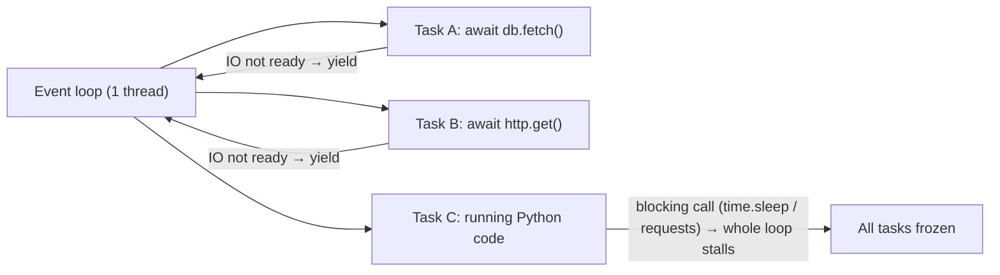
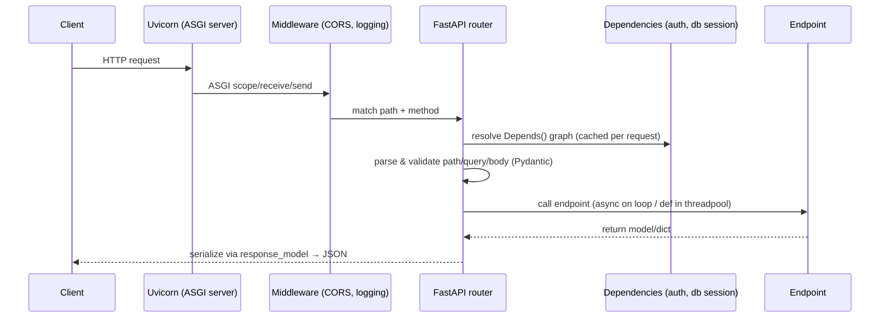
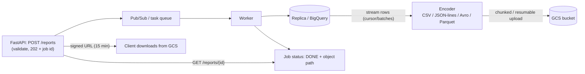

# Python & FastAPI: Interview Notes

**Why this matters in interviews:** As a Java engineer who also ships Python, you'll be tested on whether you *really* know Python: mutability traps, the GIL, async vs threads, decorators and generators. Then comes FastAPI: dependency injection, Pydantic validation, the async pitfalls that freeze the event loop, and how to serve large reports without running out of memory. The FastAPI query-execution and reporting platform (CSV, JSON, Avro, Parquet to GCS) is your anchor story.

> [!NOTE]
> The examples target **Python 3.10+**, **FastAPI 0.100+** and **Pydantic v2** (with notes where v1 differs). Every Python block is syntax-checked, and the "Predict the output" puzzles marked `# RUN` were executed with Python 3.11.

Difficulty legend: 🟢 Basic · 🟡 Intermediate · 🔴 Advanced · ⚡ Scenario

## Table of Contents

1. [Python Core](#1-python-core)
2. [Concurrency: Threads, Processes, asyncio](#2-concurrency-threads-processes-asyncio)
3. [FastAPI Fundamentals](#3-fastapi-fundamentals)
4. [Pydantic and Validation](#4-pydantic-and-validation)
5. [Data Access and Performance](#5-data-access-and-performance)
6. [Security and Testing](#6-security-and-testing)
7. [Deployment and Observability](#7-deployment-and-observability)
8. [Reporting Platform: Files, Formats, GCS](#8-reporting-platform-files-formats-gcs)
9. [Coding / Hands-on](#9-coding--hands-on)
10. [Production Scenarios](#10-production-scenarios)
11. [Cheat Sheet](#11-cheat-sheet)
12. [Revision Checklist](#12-revision-checklist)
13. [Beyond Java 8](#13-beyond-java-8)

---

## 1. Python Core

> **Mental model:** In Python, **everything is an object, and variables are name tags** stuck on objects. Assignment moves a tag, it never copies the object. Most Python "gotchas" come from two tags on one mutable object, or from code that runs **once at definition time** when you expected it to run on every call.

### Q1. 🟢 Mutable vs immutable types?

| Immutable | Mutable |
|---|---|
| `int`, `float`, `bool`, `str`, `tuple`, `frozenset`, `bytes` | `list`, `dict`, `set`, `bytearray`, most user classes |

Only immutable (hashable) objects can be dict keys or set members.

<details><summary>Cross-questions</summary>

**Q:** Is a tuple containing a list immutable?

**A:** The tuple can't change *which* objects it holds, but the list inside can still be mutated, and such a tuple isn't hashable.
</details>

### Q2. 🟡 What is the mutable default argument trap?

#### 🎯 Predict the output

```python
# RUN
def add_event(e, bucket=[]):
    bucket.append(e)
    return bucket

print(add_event("a"))
print(add_event("b"))
print(add_event("c", []))
print(add_event("d"))
```

<details><summary>Answer</summary>

```text
['a']
['a', 'b']
['c']
['a', 'b', 'd']
```

Default values are evaluated **once**, when the function is defined, so every call shares the same list. The fix is `bucket=None` followed by `if bucket is None: bucket = []`.
</details>

### Q3. 🟢 `is` vs `==`?

`==` compares **values** (`__eq__`). `is` compares **identity** (the same object). Use `is` only for singletons: `None`, `True`, `False`.

#### 🎯 Predict the output

```python
# RUN
a = [1, 2]; b = [1, 2]; c = a
print(a == b, a is b, a is c)
x = None
print(x is None)
```

<details><summary>Answer</summary>

`True False True`, then `True`. Two equal lists are still distinct objects.
</details>

### Q4. 🟡 How do shallow and deep copies differ?

#### 🎯 Predict the output

```python
# RUN
import copy
orig = {"tags": ["a"], "n": 1}
shallow = copy.copy(orig)
deep = copy.deepcopy(orig)
shallow["tags"].append("b")
shallow["n"] = 99
print(orig)
print(deep)
```

<details><summary>Answer</summary>

`{'tags': ['a', 'b'], 'n': 1}` and `{'tags': ['a'], 'n': 1}`. The shallow copy shares the nested list, so the append shows up in `orig`. Rebinding `n` on the copy doesn't affect `orig`. The deep copy is fully independent.
</details>

### Q5. 🟡 What is the LEGB scope rule, and what do `global` and `nonlocal` do?

Name lookup goes **L**ocal → **E**nclosing function → **G**lobal (module) → **B**uiltins. Assigning to a name inside a function makes it local, unless you declare it `global` (module level) or `nonlocal` (the enclosing function).

<details><summary>Cross-questions</summary>

**Q:** Why does `x += 1` inside a function raise `UnboundLocalError` when `x` is global?

**A:** The assignment makes `x` local for the **whole** function, so reading it before the assignment fails.
</details>

### Q6. 🔴 What is the late-binding closure trap?

#### 🎯 Predict the output

```python
# RUN
fns = [lambda: i for i in range(3)]
print([f() for f in fns])
fixed = [lambda i=i: i for i in range(3)]
print([f() for f in fixed])
```

<details><summary>Answer</summary>

`[2, 2, 2]`, then `[0, 1, 2]`. Closures capture the **variable**, not its value at creation time, so every lambda sees the final `i`. A default argument binds the current value.
</details>

### Q7. 🟢 What are `*args` and `**kwargs`?

`*args` collects extra positional arguments into a tuple, and `**kwargs` collects extra keyword arguments into a dict. At a call site, `*` and `**` unpack them. A bare `*` in a signature forces keyword-only arguments after it, and `/` (3.8+) marks positional-only ones before it.

<details><summary>Cross-questions</summary>

**Q:** Why use keyword-only parameters in APIs?

**A:** Call sites become self-documenting (`export(fmt="parquet")`), and parameters can be added or reordered safely.
</details>

### Q8. 🟡 How do decorators work?

A decorator is a function that takes a function and returns a replacement. `@timed` is shorthand for `f = timed(f)`. Use `functools.wraps` to keep the name and docstring.

```python
import functools
import time

def timed(fn):
    @functools.wraps(fn)
    def wrapper(*args, **kwargs):
        start = time.perf_counter()
        try:
            return fn(*args, **kwargs)
        finally:
            print(f"{fn.__name__} took {(time.perf_counter() - start) * 1000:.1f} ms")
    return wrapper

@timed
def run_query(sql: str) -> int:
    return len(sql)
```

<details><summary>Cross-questions</summary>

**Q:** How do you write a decorator that takes arguments, such as `@retry(times=3)`?

**A:** Add one more level: `retry(times)` returns a decorator, which returns the wrapper.

**Q:** Does this decorator work on `async def` functions?

**A:** No. It would time only the creation of the coroutine. Write an async wrapper that does `return await fn(...)`.
</details>

### Q9. 🟡 What are generators, and why do they matter for big data?

A function containing `yield` returns a **lazy iterator**: each value is produced on demand, so memory stays constant however large the data is. That's essential for streaming 200K+ row exports.

#### 🎯 Predict the output

```python
# RUN
def rows():
    for i in range(3):
        print("produce", i)
        yield i

g = rows()
print("created")
print(next(g))
print(sum(g))
```

<details><summary>Answer</summary>

```text
created
produce 0
0
produce 1
produce 2
3
```

Nothing runs until the first `next()`. Then `sum()` consumes the rest (1 + 2).
</details>

<details><summary>Cross-questions</summary>

**Q:** List comprehension or generator expression?

**A:** `[x for x in data]` builds the whole list in memory. `(x for x in data)` is lazy. Use the generator for pipelines over large inputs.
</details>

### Q10. 🟢 What are context managers?

A `with` block guarantees setup and teardown: `__enter__` / `__exit__`, or `contextlib.contextmanager`. Use them for files, DB connections, locks and temp files, and `async with` for async resources.

```python
from contextlib import contextmanager

@contextmanager
def db_transaction(conn):
    try:
        yield conn
        conn.commit()
    except Exception:
        conn.rollback()
        raise
```

<details><summary>Cross-questions</summary>

**Q:** What's the Java equivalent?

**A:** try-with-resources with `AutoCloseable`.
</details>

### Q11. 🟡 `@dataclass` vs a plain class vs a Pydantic model?

| | `@dataclass` | Pydantic `BaseModel` |
|---|---|---|
| Purpose | Plain data containers | Validation + parsing + serialization |
| Validation | None (types are hints only) | Runtime type coercion & validation |
| Speed | Fast | Slower (v2 core in Rust is fast) |
| Use | Internal domain objects | API boundaries, config, external data |

<details><summary>Cross-questions</summary>

**Q:** Do type hints get enforced at runtime?

**A:** No, not by Python itself. Tools like mypy check them statically, and Pydantic enforces them at runtime.
</details>

### Q12. 🟢 How do dict ordering and comprehensions work?

Dicts keep **insertion order** (guaranteed since 3.7). Comprehensions: `{k: v for k, v in pairs}`, `{x for x in items}`. `dict.get(k, default)` and `setdefault` avoid `KeyError`, and `collections.defaultdict` / `Counter` handle grouping and counting.

<details><summary>Cross-questions</summary>

**Q:** How do you count events per source in one line?

**A:** `Counter(e["source"] for e in events)`.
</details>

### Q13. 🟡 How does Python manage memory?

Mostly through **reference counting** (an object is freed when its count hits 0), plus a **cyclic garbage collector** for reference cycles. CPython also uses small-object allocators (pymalloc), and memory isn't always returned to the OS.

<details><summary>Cross-questions</summary>

**Q:** How do you find a memory leak?

**A:** Use `tracemalloc` snapshots, compare them over time, and look for growing caches or global lists.
</details>

### Q14. 🔴 What is the GIL?

CPython's **Global Interpreter Lock** lets only one thread execute Python bytecode at a time. Threads still help for **IO-bound** work (the GIL is released during IO). For **CPU-bound** work, use processes or native extensions (NumPy and pyarrow release the GIL).

<details><summary>Cross-questions</summary>

**Q:** Is the GIL going away?

**A:** PEP 703 introduced an experimental **free-threaded** build in Python 3.13. The default build still has the GIL.
</details>

### Q15. 🟡 How do exceptions work, and what are the best practices?

`try` / `except` / `else` (runs if no exception) / `finally`. Catch specific exceptions, chain them with `raise NewError(...) from e`, never use a bare `except:` (it catches `KeyboardInterrupt` and `SystemExit` too), and define domain exception classes.

<details><summary>Cross-questions</summary>

**Q:** What does `raise ... from None` do?

**A:** It suppresses the chained context in the traceback, which is useful to hide internal details.
</details>

### Q16. 🟡 What are `__slots__` and why use them?

`__slots__` replaces the per-instance `__dict__` with fixed attribute slots, which saves memory for millions of small objects and prevents typos from creating new attributes.

<details><summary>Cross-questions</summary>

**Q:** When would it matter for you?

**A:** When holding many row objects in memory. Better still, use tuples, dicts, or columnar pyarrow tables.
</details>

### Q17. 🟢 What are type hints, and how do they help in a FastAPI codebase?

Annotations like `def f(ids: list[int]) -> dict[str, int]` feed static checking (mypy, pyright), IDE support, and **FastAPI and Pydantic**, which use them for validation, parsing and OpenAPI docs.

<details><summary>Cross-questions</summary>

**Q:** `Optional[str]` vs `str | None`?

**A:** They're equivalent. The `|` syntax works at runtime from 3.10.
</details>

### Q18. 🟡 What are iterables, iterators and the iterator protocol?

An iterable has `__iter__` and returns an iterator. An iterator has `__next__` and raises `StopIteration` when it's done. Iterators are **single-use**, just like Java streams.

#### 🎯 Predict the output

```python
# RUN
it = iter([1, 2, 3])
print(list(it))
print(list(it))
```

<details><summary>Answer</summary>

`[1, 2, 3]`, then `[]`. The iterator is exhausted after the first pass.
</details>

### Q19. 🟡 What does `functools.lru_cache` do?

It memoizes function results by argument (arguments must be hashable), with a `maxsize` and LRU eviction. It's per process, so it isn't shared across Gunicorn or Uvicorn workers and has no TTL.

<details><summary>Cross-questions</summary>

**Q:** Why can `lru_cache` on a method leak memory?

**A:** `self` becomes part of the cache key, so the cache keeps instances alive.
</details>

### Q20. 🟢 How do you compare the Python and Java approaches to interfaces?

Python uses **duck typing** plus `abc.ABC` abstract base classes or `typing.Protocol` (structural typing, 3.8+). A Protocol is like a Java interface, except classes don't have to declare that they implement it.

<details><summary>Cross-questions</summary>

**Q:** Where would you use a Protocol?

**A:** For pluggable writers: any object with `write_rows(rows) -> None` can be a `FormatWriter` (CSV, JSON, Avro or Parquet).
</details>

### Q21. 🟡 How do packaging and virtual environments work?

Use a per-project environment (`venv`, Poetry, uv) with pinned dependencies (a lock file). Never install into the system Python. `pyproject.toml` is the modern project metadata standard.

<details><summary>Cross-questions</summary>

**Q:** Why pin transitive dependencies?

**A:** For reproducible builds. A new transitive release can break production at deploy time.
</details>

### Q22. 🟡 How do string formatting and f-strings work?

f-strings, as in `f"{name!r} took {ms:.1f} ms"`, are the fastest and most readable option. Never build SQL with f-strings: use parameterised queries.

<details><summary>Cross-questions</summary>

**Q:** Why avoid f-strings in logging calls?

**A:** `logger.debug("x %s", obj)` defers formatting until the message is actually emitted, which is cheaper when DEBUG is off.
</details>

### Q23. 🟡 What does `if __name__ == "__main__":` mean?

That code runs only when the file is executed directly, not when it's imported. It's required for `multiprocessing` on spawn-based platforms, to avoid recursively spawning processes.

<details><summary>Cross-questions</summary>

**Q:** Why does it matter for multiprocessing on macOS and Windows?

**A:** "Spawn" re-imports the main module in each child process. Unguarded code would run again in every child.
</details>

### Q24. 🟡 What is the difference between `sort()` and `sorted()`, and how does key-based sorting work?

`list.sort()` sorts in place and returns `None`. `sorted()` returns a new list. Both are **stable** (Timsort), and take `key=` and `reverse=`. Sort by several keys with `key=lambda r: (r.tenant, -r.score)`.

<details><summary>Cross-questions</summary>

**Q:** How do you sort by one field descending and another ascending when you can't negate the values (strings)?

**A:** Use stable multi-pass sorting (sort by the secondary key first, then the primary key), or `functools.cmp_to_key`.
</details>

---

## 2. Concurrency: Threads, Processes, asyncio

> **Mental model:** **asyncio** is one *chef juggling many pots*: while one pot simmers (IO), they stir another, but if they stop to chop onions for five minutes (CPU or blocking code), every pot burns. **Threads** are several chefs sharing one knife (the GIL), which is fine when they mostly wait. **Processes** are separate kitchens, for heavy chopping (CPU work).

### Q25. 🟡 When do you use threads, processes or asyncio?

| Workload | Tool |
|---|---|
| Many concurrent IO waits (HTTP, DB, GCS) with async libraries | **asyncio** |
| IO-bound with blocking libraries | **Threads** (`ThreadPoolExecutor`) |
| CPU-bound (parsing, compression, transformations) | **Processes** (`ProcessPoolExecutor`) or native libs (pyarrow) |

<details><summary>Cross-questions</summary>

**Q:** Why doesn't asyncio speed up CPU-bound work?

**A:** Everything runs on one thread. The CPU work blocks the loop, so there's no parallelism at all.
</details>

### Q26. 🟡 How does the asyncio event loop work?

Coroutines (`async def`) run until they reach an `await` on something that isn't ready, then yield control to the loop. The loop runs other ready tasks and resumes coroutines when their IO completes (through epoll or kqueue). It's cooperative multitasking on **one thread**.



<details><summary>Cross-questions</summary>

**Q:** What's the most common asyncio bug?

**A:** Calling blocking code (`time.sleep`, `requests`, synchronous DB drivers, heavy CPU work) inside `async def`, which freezes every request on that worker.
</details>

### Q27. 🟡 What does `asyncio.gather` do, and how does it handle errors?

#### 🎯 Predict the output

```python
# RUN
import asyncio

async def fetch(name, delay, fail=False):
    await asyncio.sleep(delay)
    if fail:
        raise ValueError(name)
    return name

async def main():
    print(await asyncio.gather(fetch("a", 0.02), fetch("b", 0.01)))
    res = await asyncio.gather(fetch("c", 0.01), fetch("d", 0.01, fail=True), return_exceptions=True)
    print([type(r).__name__ if isinstance(r, Exception) else r for r in res])

asyncio.run(main())
```

<details><summary>Answer</summary>

`['a', 'b']`, then `['c', 'ValueError']`. `gather` returns the results in **argument order**, not completion order. With `return_exceptions=True`, failures come back as values instead of cancelling the whole call.
</details>

<details><summary>Cross-questions</summary>

**Q:** How do you limit concurrency when calling an API 10,000 times?

**A:** Use an `asyncio.Semaphore(50)` around each call, or process in batches. Never fire 10,000 requests at once.
</details>

### Q28. 🟡 How do you run blocking code from async code?

Use `await loop.run_in_executor(None, blocking_fn, args)` or `await asyncio.to_thread(blocking_fn, args)` (3.9+), which run it in a thread pool. Use a `ProcessPoolExecutor` for CPU-heavy work. In FastAPI, a plain `def` endpoint is run in the threadpool automatically.

<details><summary>Cross-questions</summary>

**Q:** Why does `to_thread` help with IO but not with CPU work?

**A:** Threads release the GIL during IO. CPU-bound Python code still serialises on the GIL.
</details>

### Q29. 🟡 How do timeouts and cancellation work in asyncio?

`await asyncio.wait_for(coro, timeout=5)` cancels the coroutine on timeout. Cancellation raises `CancelledError` inside the task, so clean up in `finally` and don't swallow it. Python 3.11 adds `asyncio.timeout()` and `TaskGroup` for structured concurrency.

<details><summary>Cross-questions</summary>

**Q:** What happens to a request's work when the client disconnects in FastAPI?

**A:** The ASGI server may cancel the request task, depending on the server and how the response is being streamed. Long background work shouldn't depend on the client connection. Use a job queue.
</details>

### Q30. 🟡 How do `threading.Lock` and `asyncio.Lock` differ?

A `threading.Lock` blocks the OS thread, so never use it in async code, where it would block the loop. An `asyncio.Lock` suspends only the coroutine, and it works within one event loop.

<details><summary>Cross-questions</summary>

**Q:** Does an `asyncio.Lock` protect across Uvicorn workers?

**A:** No. Workers are separate processes. For cross-process locking, use Redis or the database.
</details>

### Q31. 🟡 How do `concurrent.futures` executors work?

`ThreadPoolExecutor` and `ProcessPoolExecutor` offer `submit()` → `Future`, `map()`, and `as_completed()`. They're the Python analogue of Java's `ExecutorService`. Process pools pickle their arguments and results, so keep them small.

```python
from concurrent.futures import ThreadPoolExecutor, as_completed

def upload(path: str) -> str:
    return path          # real code: GCS upload (blocking client)

with ThreadPoolExecutor(max_workers=8) as pool:
    futures = [pool.submit(upload, p) for p in ["a.csv", "b.csv", "c.csv"]]
    for f in as_completed(futures):
        f.result()        # re-raises worker exceptions
```

<details><summary>Cross-questions</summary>

**Q:** What's the Python equivalent of "exceptions swallowed by `submit()`"?

**A:** It's the same trap: an exception is stored in the `Future` until you call `.result()`.
</details>

### Q32. 🟡 How do you choose between multiprocessing and pyarrow or pandas vectorisation?

For columnar transformations, **vectorised** libraries (pyarrow compute, pandas, polars) run in C or Rust and often release the GIL, so they're orders of magnitude faster than Python loops. Reach for multiprocessing only when the per-row logic can't be vectorised.

<details><summary>Cross-questions</summary>

**Q:** Why can pandas be memory-hungry for exports?

**A:** It loads everything into memory. Use chunked reading (`chunksize`) or pyarrow record batches to stream.
</details>

### Q33. 🟡 What are async generators, and how do they help streaming?

`async def` combined with `yield` produces values asynchronously, for example rows from an async DB cursor, which `StreamingResponse` can consume. That keeps memory flat while the client downloads.

<details><summary>Cross-questions</summary>

**Q:** Can `StreamingResponse` take a sync generator?

**A:** Yes. Starlette iterates it in a threadpool, so blocking IO inside it doesn't stall the loop.
</details>

### Q34. 🟡 What are `asyncio.Queue` and producer/consumer pipelines in asyncio?

`asyncio.Queue(maxsize=N)` is a **bounded** queue that gives you backpressure. Producers `await q.put()`, and consumer tasks `await q.get()` and then `q.task_done()`. It's useful for "read rows → transform → upload in parts" pipelines.

<details><summary>Cross-questions</summary>

**Q:** Why bound the queue?

**A:** Otherwise a fast producer fills memory while slow uploads lag behind, exactly as with Java's unbounded executors.
</details>

### Q35. 🟡 What does "async all the way down" mean?

Every IO call in an async path must be async: the DB (asyncpg, SQLAlchemy async), HTTP (httpx.AsyncClient), and Redis (redis.asyncio). One blocking library in the path negates the benefit, unless you offload it to a thread.

<details><summary>Cross-questions</summary>

**Q:** What if the GCS client library is blocking?

**A:** Call it with `asyncio.to_thread`, or from a sync `def` endpoint (which runs in the threadpool). Or use an async-capable library.
</details>

### Q36. 🟡 How do you share an HTTP client in async code?

Create one `httpx.AsyncClient` (a connection pool) at application startup (in the lifespan), reuse it for every request, and close it on shutdown. Creating a client per request wastes TCP and TLS handshakes.

<details><summary>Cross-questions</summary>

**Q:** What's the Java analogue?

**A:** A single shared `RestTemplate` or `WebClient` with a pooled connection manager.
</details>

### Q37. 🟡 What is `contextvars`, and why does it matter for async logging?

`contextvars.ContextVar` holds per-task context (a request ID or user) that's correctly isolated between concurrent coroutines. It's the async-safe replacement for thread-locals, and log filters read it to add correlation IDs.

<details><summary>Cross-questions</summary>

**Q:** Why not use `threading.local` in asyncio?

**A:** Many tasks share one thread, so they'd overwrite each other's values.
</details>

### Q38. 🔴 How many concurrent requests can one Uvicorn worker handle?

For async endpoints doing awaitable IO: thousands of concurrent connections, bounded by downstream pools (DB connections, HTTP limits). For sync `def` endpoints, the **threadpool size** is the limit (the AnyIO default is 40 tokens). For CPU work: effectively one at a time per worker. Scale out with more workers or processes.

<details><summary>Cross-questions</summary>

**Q:** Where did the threadpool limit show up in practice?

**A:** In sync endpoints calling a blocking warehouse client. Beyond 40 concurrent calls, requests queued inside the worker. The fix was async clients, or raising the limiter tokens deliberately, plus more workers.
</details>

---
## 3. FastAPI Fundamentals

> **Mental model:** FastAPI is a *type-driven receptionist*. You declare what each endpoint expects (path, query, body and dependencies as type hints), and FastAPI **parses, validates, injects and documents** everything before your function runs. Your function receives clean Python objects, and FastAPI turns what you return into JSON.



### Q39. 🟢 What are FastAPI, Starlette, Uvicorn and ASGI?

- **ASGI** is the async server interface (the successor to WSGI).
- **Uvicorn** is an ASGI server (uvloop + httptools).
- **Starlette** is the ASGI toolkit: routing, middleware, requests and responses.
- **FastAPI** builds on Starlette and **Pydantic**, adding validation, dependency injection and automatic OpenAPI docs (`/docs`, `/redoc`).

<details><summary>Cross-questions</summary>

**Q:** What's the Spring Boot analogy?

**A:** Uvicorn ≈ embedded Tomcat or Netty, Starlette ≈ Spring MVC or WebFlux core, FastAPI ≈ the annotation-driven controller layer with validation and springdoc.
</details>

### Q40. 🟢 How do you declare path, query and body parameters?

```python
from typing import Literal
from fastapi import FastAPI, Query
from pydantic import BaseModel, Field

app = FastAPI()

class ReportRequest(BaseModel):
    query_id: str
    format: Literal["csv", "json", "avro", "parquet"] = "csv"
    limit: int = Field(10_000, gt=0, le=1_000_000)

@app.post("/reports/{tenant_id}", status_code=202)
async def create_report(tenant_id: str, req: ReportRequest,
                        dry_run: bool = Query(False)) -> dict:
    return {"tenant": tenant_id, "format": req.format, "dry_run": dry_run}
```

The rules: a name in the path template is a **path** parameter, a Pydantic model is the **body**, and other simple types are **query** parameters.

<details><summary>Cross-questions</summary>

**Q:** What happens if `limit` is 0?

**A:** FastAPI returns **422 Unprocessable Entity** with a detailed validation error, before your code runs.
</details>

### Q41. 🔴 `async def` vs `def` endpoints: what's the real difference?

- `async def` runs **on the event loop**. It must only `await` non-blocking IO. Any blocking call freezes the whole worker.
- `def` runs in a **threadpool** (40 threads by default). Blocking IO is fine there, but concurrency is capped by the pool.

> [!WARNING]
> The worst combination is `async def` calling `requests.get(...)`, a synchronous DB driver, or `time.sleep`. Every request on that worker stalls. Either make the endpoint a plain `def`, or use async libraries.

<details><summary>Cross-questions</summary>

**Q:** Which would you choose for an endpoint calling a blocking BigQuery or GCS client?

**A:** A `def` endpoint (the threadpool), or `async def` with `await asyncio.to_thread(...)`. Never a blocking call directly inside `async def`.
</details>

### Q42. 🟡 How does dependency injection with `Depends` work?

A dependency is any callable, function or class, whose parameters are resolved recursively. The results are **cached per request** by default (`use_cache=True`). Generator dependencies (`yield`) provide setup and teardown, such as a DB session that's closed after the response.

```python
from typing import Iterator
from fastapi import Depends, FastAPI, Header, HTTPException

app = FastAPI()

class Session:
    def close(self) -> None: ...

def get_db() -> Iterator[Session]:
    db = Session()
    try:
        yield db                 # injected into the endpoint
    finally:
        db.close()               # runs after the response is sent

def current_tenant(x_tenant_id: str = Header(...)) -> str:
    if not x_tenant_id:
        raise HTTPException(status_code=400, detail="missing tenant")
    return x_tenant_id

@app.get("/reports")
def list_reports(tenant: str = Depends(current_tenant), db: Session = Depends(get_db)) -> list:
    return []
```

<details><summary>Cross-questions</summary>

**Q:** How do you swap dependencies in tests?

**A:** `app.dependency_overrides[get_db] = fake_db`, which is the FastAPI equivalent of `@MockBean`.

**Q:** Can dependencies apply to a whole router?

**A:** Yes: `APIRouter(dependencies=[Depends(verify_token)])`, or `app = FastAPI(dependencies=[...])`.
</details>

### Q43. 🟢 What do `response_model` and return type annotations do?

They **filter and validate** the output: only the model's fields are returned, which prevents leaking internal fields like a password hash, and they document the schema. `response_model_exclude_none=True` drops null fields.

<details><summary>Cross-questions</summary>

**Q:** Why not return ORM objects directly?

**A:** They'd leak internal fields and trigger lazy loads. Map them to response models (Pydantic `from_attributes=True` for ORM objects in v2).
</details>

### Q44. 🟢 How do you return errors properly?

Raise `HTTPException(status_code=404, detail="...")` for expected cases. Register **exception handlers** (`@app.exception_handler(DomainError)`) to map domain exceptions to consistent JSON. Override the handler for `RequestValidationError` to customise the 422 format.

```python
from fastapi import FastAPI, Request
from fastapi.responses import JSONResponse

app = FastAPI()

class ReportNotFound(Exception):
    def __init__(self, report_id: str):
        self.report_id = report_id

@app.exception_handler(ReportNotFound)
async def report_not_found(request: Request, exc: ReportNotFound) -> JSONResponse:
    return JSONResponse(status_code=404, content={"error": "REPORT_NOT_FOUND", "id": exc.report_id})
```

<details><summary>Cross-questions</summary>

**Q:** What should a 500 response contain?

**A:** A generic message and a correlation ID. No stack traces, SQL or internal hostnames.
</details>

### Q45. 🟡 How does middleware work in FastAPI?

Starlette middleware wraps every request (CORS, GZip, TrustedHost, or custom `@app.middleware("http")`). The order matters: the last one added is the outermost. Use it for cross-cutting concerns (request IDs, timing, logging), not for business logic.

```python
import time
import uuid
from fastapi import FastAPI, Request

app = FastAPI()

@app.middleware("http")
async def request_context(request: Request, call_next):
    request_id = request.headers.get("x-request-id", str(uuid.uuid4()))
    start = time.perf_counter()
    response = await call_next(request)
    response.headers["x-request-id"] = request_id
    response.headers["x-elapsed-ms"] = f"{(time.perf_counter() - start) * 1000:.1f}"
    return response
```

<details><summary>Cross-questions</summary>

**Q:** Why can `BaseHTTPMiddleware` be a problem for streaming responses?

**A:** Historically it had performance and streaming or background-task caveats. Pure ASGI middleware avoids them. Keep the middleware lightweight.
</details>

### Q46. 🟡 What are `BackgroundTasks`, and when are they not enough?

`BackgroundTasks` runs a function **after the response is sent**, in the same process. That's fine for light, best-effort work (an audit log, sending an email). It's **not** durable: a crash, a restart or scale-down loses it. Heavy report generation belongs in a real queue (Pub/Sub, Celery, Cloud Tasks) with workers.

<details><summary>Cross-questions</summary>

**Q:** How did the reporting platform run long queries?

**A:** The API validated and enqueued a job (returning 202 with a job ID). Workers executed the query, wrote the output to GCS, and updated the job status. The API only served the status and signed URLs.
</details>

### Q47. 🟡 How do you manage startup and shutdown (the lifespan)?

Use the `lifespan` context manager (the modern replacement for `@app.on_event`) to create shared resources: DB pools, an HTTP client, a GCS client, config. Store them on `app.state`, and close them on shutdown.

```python
from contextlib import asynccontextmanager
import httpx
from fastapi import FastAPI

@asynccontextmanager
async def lifespan(app: FastAPI):
    app.state.http = httpx.AsyncClient(timeout=10.0)
    yield
    await app.state.http.aclose()

app = FastAPI(lifespan=lifespan)
```

<details><summary>Cross-questions</summary>

**Q:** Why not create clients at module import time?

**A:** It makes testing and configuration harder, and resources created before workers fork may not be fork-safe.
</details>

### Q48. 🟢 How do you organise a larger FastAPI app?

`APIRouter` per domain (`routers/reports.py`, `routers/queries.py`), `app.include_router(router, prefix="/v1/reports", tags=["reports"])`. Separate schemas (Pydantic), services (business logic), repositories (data access) and settings. It mirrors the controller, service and repository layering in Spring.

<details><summary>Cross-questions</summary>

**Q:** Where does business logic go?

**A:** In service modules that know nothing about HTTP. Endpoints parse, call the service, and map the result, which keeps the services unit-testable.
</details>

### Q49. 🟡 How do you handle configuration?

Use `pydantic-settings` `BaseSettings`. It reads environment variables and `.env` files with types and validation, and a cached `get_settings()` dependency returns it. Secrets come from environment variables or Secret Manager, never from the code.

```python
from functools import lru_cache
from pydantic_settings import BaseSettings

class Settings(BaseSettings):
    gcs_bucket: str
    db_url: str
    max_export_rows: int = 1_000_000

@lru_cache
def get_settings() -> Settings:
    return Settings()
```

<details><summary>Cross-questions</summary>

**Q:** Where did `BaseSettings` live in Pydantic v1?

**A:** In `pydantic` itself. In v2 it moved to the separate `pydantic-settings` package.
</details>

### Q50. 🟡 How do you version and document the API?

Use URL prefixes (`/v1`), tags, summaries and descriptions. The OpenAPI schema is generated automatically. Add `response_model` and `responses={404: {...}}` for accurate docs, and generate clients from `/openapi.json`.

<details><summary>Cross-questions</summary>

**Q:** Should `/docs` be public in production?

**A:** Usually not for internal APIs. Disable it (`docs_url=None`) or protect it.
</details>

### Q51. 🟡 How do you stream a large response?

Use `StreamingResponse` with a generator (sync or async) that yields chunks, so memory stays constant. Set `media_type` and a `Content-Disposition` header.

```python
import csv
import io
from typing import Iterator
from fastapi import FastAPI
from fastapi.responses import StreamingResponse

app = FastAPI()

def fetch_rows() -> Iterator[tuple]:
    for i in range(200_000):                 # real code: server-side DB cursor
        yield (i, f"device-{i % 500}")

def csv_stream() -> Iterator[str]:
    buf = io.StringIO()
    w = csv.writer(buf)
    w.writerow(["id", "device"])
    for n, row in enumerate(fetch_rows(), 1):
        w.writerow(row)
        if n % 5000 == 0:
            yield buf.getvalue(); buf.seek(0); buf.truncate(0)
    yield buf.getvalue()

@app.get("/export.csv")
def export() -> StreamingResponse:
    return StreamingResponse(csv_stream(), media_type="text/csv",
                             headers={"Content-Disposition": "attachment; filename=export.csv"})
```

<details><summary>Cross-questions</summary>

**Q:** When is streaming from the API the wrong choice?

**A:** For very large or slow exports. A client disconnect loses the work, and it ties up a worker. Generate asynchronously to GCS and return a signed URL.
</details>

### Q52. 🟡 How do you upload files?

Use `UploadFile` (a spooled temp file: small files are held in memory, and larger ones spill to disk). Read in chunks (`await file.read(1 << 20)`), validate the type and size, and stream to GCS. For very large uploads, have clients upload **directly to GCS with a signed URL**.

<details><summary>Cross-questions</summary>

**Q:** Why not `await file.read()` all at once?

**A:** A 2 GB upload loads 2 GB into memory. Always chunk.
</details>

### Q53. 🟡 What do the status codes mean for an async job API?

`202 Accepted` plus a `Location` header when a job is created, `200` with the status when polling (`PENDING`, `RUNNING`, `DONE` or `FAILED`), `303 See Other` or a signed URL when it's done, `409` for a conflicting duplicate, `422` for validation errors, and `429` for rate limits.

<details><summary>Cross-questions</summary>

**Q:** How do you make job creation idempotent?

**A:** Accept an `Idempotency-Key` header, or derive a key from (tenant, query hash, parameters), and return the existing job for duplicates.
</details>

### Q54. 🟡 How do you add CORS?

`app.add_middleware(CORSMiddleware, allow_origins=["https://app.example.com"], allow_methods=["GET", "POST"], allow_headers=["Authorization", "Content-Type"], allow_credentials=True)`. Never combine `"*"` with credentials.

<details><summary>Cross-questions</summary>

**Q:** Is CORS a security boundary?

**A:** No. It only restricts browsers reading responses. Server-side auth is still required.
</details>

### Q55. 🟡 What are path operation order and route conflicts?

Routes match **in declaration order**. `/reports/latest` must be declared before `/reports/{report_id}`, or `latest` gets captured as an ID (which is then a 422 or a 404).

<details><summary>Cross-questions</summary>

**Q:** How do you constrain a path parameter?

**A:** Type it (`report_id: UUID`), or use `Path(..., pattern=...)`, so an invalid value fails validation.
</details>

### Q56. 🟡 How do WebSockets and SSE fit in?

FastAPI supports WebSockets (`@app.websocket`) for bidirectional real-time traffic. Server-Sent Events can be streamed with `StreamingResponse` (`text/event-stream`), which suits pushing job progress to the UI.

<details><summary>Cross-questions</summary>

**Q:** Polling or SSE for report status?

**A:** Polling every few seconds is simple and robust. SSE reduces latency and load for many concurrent watchers.
</details>

### Q57. 🟡 How do you apply rate limiting in FastAPI?

At the edge (gateway or Cloud Armor), or with middleware or dependencies backed by Redis (`slowapi` implements fixed and sliding windows). Rate-limit per tenant or API key, and return 429 with `Retry-After`.

<details><summary>Cross-questions</summary>

**Q:** Why not use an in-memory limiter?

**A:** Each worker and pod has its own memory, so the effective limit becomes N × the limit.
</details>

### Q58. 🟡 How does FastAPI compare with Flask and Django?

| | FastAPI | Flask | Django (+DRF) |
|---|---|---|---|
| Async | Native ASGI | Limited (WSGI core) | Partial (ASGI views) |
| Validation | Pydantic built-in | Extensions | Serializers |
| Docs | Auto OpenAPI | Extensions | DRF schemas |
| Batteries | Minimal | Minimal | ORM, admin, auth |

<details><summary>Cross-questions</summary>

**Q:** Why FastAPI for the reporting service?

**A:** Async IO for many concurrent status and download calls, strict request validation for query parameters, and auto-generated OpenAPI docs for the consuming teams.
</details>

---

## 4. Pydantic and Validation

> **Mental model:** Pydantic is a *customs checkpoint* at your system's borders. Raw, untrusted data (JSON bodies, env vars, messages) is inspected, converted to proper types, and either admitted as a clean object or rejected with a precise list of problems.

### Q59. 🟢 What does Pydantic do?

It parses and validates data against type-annotated models, **coercing** where it's safe (in lax mode, `"5"` → `5`), rejecting where it isn't, and serialising back with `model_dump()` / `model_dump_json()`. v2's core is written in Rust (`pydantic-core`), which makes it much faster than v1.

<details><summary>Cross-questions</summary>

**Q:** How do you disable coercion?

**A:** Strict mode: `model_config = ConfigDict(strict=True)`, or strict types (`StrictInt`).
</details>

### Q60. 🟡 How do you write field and model validators in v2?

```python
from datetime import date
from pydantic import BaseModel, field_validator, model_validator

class ExportRequest(BaseModel):
    sql_template_id: str
    start: date
    end: date
    columns: list[str]

    @field_validator("columns")
    @classmethod
    def no_empty_columns(cls, v: list[str]) -> list[str]:
        if not v:
            raise ValueError("at least one column required")
        return v

    @model_validator(mode="after")
    def check_range(self) -> "ExportRequest":
        if self.end < self.start:
            raise ValueError("end must be >= start")
        if (self.end - self.start).days > 366:
            raise ValueError("range too large")
        return self
```

<details><summary>Cross-questions</summary>

**Q:** What were these called in v1?

**A:** `@validator` and `@root_validator`. v2 renamed them to `@field_validator` and `@model_validator`.
</details>

### Q61. 🟡 What are the main v1 → v2 migration points?

| v1 | v2 |
|---|---|
| `.dict()`, `.json()` | `.model_dump()`, `.model_dump_json()` |
| `parse_obj()` | `model_validate()` |
| `class Config: orm_mode = True` | `model_config = ConfigDict(from_attributes=True)` |
| `@validator` / `@root_validator` | `@field_validator` / `@model_validator` |
| `BaseSettings` in pydantic | `pydantic-settings` package |

<details><summary>Cross-questions</summary>

**Q:** Why do performance numbers change after the upgrade?

**A:** v2 validation is typically several times faster, but custom validators written in Python still cost Python time.
</details>

### Q62. 🟡 How do you separate input, output and DB models?

Use different models per boundary: `ReportCreate` (input: no ID, no status), `ReportOut` (output: public fields only), and the ORM or persistence model. That prevents mass-assignment bugs (a client setting `status` or `owner`) and data leaks.

<details><summary>Cross-questions</summary>

**Q:** What's mass assignment?

**A:** When a client sends extra fields that the server blindly copies into the stored object. Pydantic ignores unknown fields by default (`extra="ignore"`), and `extra="forbid"` rejects them.
</details>

### Q63. 🟡 What are discriminated unions?

A union of models selected by a literal field, for example `Annotated[Union[CsvOptions, ParquetOptions], Field(discriminator="format")]`. It gives exact validation per variant and clean error messages, which is ideal for per-format export options.

<details><summary>Cross-questions</summary>

**Q:** Why is it better than a plain `Union`?

**A:** Pydantic picks the right model immediately from the discriminator, instead of trying each variant and producing confusing errors.
</details>

### Q64. 🟡 How do you validate query-execution requests safely?

Allow-list the query templates and column names (with `Literal` or enums), bound the date ranges and limits, reject raw SQL fragments, and pass all values as **bound parameters** to the database. Validation at the model level documents the rules in OpenAPI too.

<details><summary>Cross-questions</summary>

**Q:** Why can't sort columns be bound parameters?

**A:** Identifiers can't be parameterised in SQL. Map an allowed enum value to the real column name.
</details>

### Q65. 🟡 How do you serialise datetimes, decimals and custom types?

Pydantic v2 serialises `datetime` to ISO 8601, and `Decimal` to a string in JSON mode (configurable). Use `field_serializer` or `PlainSerializer` for custom formats. Always emit timezone-aware UTC datetimes from APIs.

<details><summary>Cross-questions</summary>

**Q:** Why avoid naive datetimes?

**A:** Consumers can't tell their timezone, so reports shift by hours around DST.
</details>

### Q66. 🟡 How much does validation cost at high volume, and how do you mitigate it?

Validating millions of rows through Pydantic models is costly. For bulk data paths (exports, ingestion), validate the **request and schema once**, then process the rows with pyarrow or plain tuples. Use `model_construct()` (no validation) only for data you already trust.

<details><summary>Cross-questions</summary>

**Q:** Where would validating every row still be justified?

**A:** When ingesting untrusted external files. Do it in streaming chunks, collect the row errors, and don't abort the whole file.
</details>

---

## 5. Data Access and Performance

> **Mental model:** A FastAPI worker is a *small, busy restaurant*. Tables (DB connections) and waiters (threads or the event loop) are limited. Performance work means **not holding a table while waiting for the kitchen** (no long transactions), **serving big orders in portions** (streaming), and **not re-cooking the same dish** (caching).

### Q67. 🟡 How do you use SQLAlchemy 2.0 with FastAPI?

Create one engine per process (it's a connection pool), and a `sessionmaker` or `async_sessionmaker`. Add a per-request session dependency with `yield` that commits or rolls back and closes. The async variant uses `create_async_engine("postgresql+asyncpg://...")`.

```python
from typing import AsyncIterator
from sqlalchemy.ext.asyncio import AsyncSession, async_sessionmaker, create_async_engine

engine = create_async_engine("postgresql+asyncpg://app@db/reports", pool_size=10, max_overflow=5,
                             pool_pre_ping=True)
SessionLocal = async_sessionmaker(engine, expire_on_commit=False)

async def get_session() -> AsyncIterator[AsyncSession]:
    async with SessionLocal() as session:
        yield session
```

<details><summary>Cross-questions</summary>

**Q:** Why is `expire_on_commit=False` common in async apps?

**A:** Otherwise, accessing attributes after a commit triggers lazy refreshes, which fail in async code without an explicit await.
</details>

### Q68. 🟡 How do you size connection pools across workers?

Total connections = pods × workers × (`pool_size` + `max_overflow`). Keep that under the database's limits (PostgreSQL `max_connections` minus headroom), and use PgBouncer for many workers. It's the same arithmetic as Hikari in Java.

<details><summary>Cross-questions</summary>

**Q:** 10 pods × 4 workers × 15 connections = 600. What happens?

**A:** You exceed the typical PostgreSQL limits and get too many processes, so shrink the pools and add PgBouncer.
</details>

### Q69. 🟡 How do you stream rows from PostgreSQL without loading everything?

Use a server-side cursor: `conn.execution_options(stream_results=True, yield_per=5000)` in SQLAlchemy, a named cursor in psycopg, or asyncpg's `cursor()` inside a transaction. Yield the rows to the writer (CSV, Parquet) in chunks.

<details><summary>Cross-questions</summary>

**Q:** What's the Java equivalent trap?

**A:** The PostgreSQL JDBC driver needs autocommit off plus a fetch size. Without them, "streaming" code still loads everything (see file 09).
</details>

### Q70. 🟡 How do you avoid N+1 queries with SQLAlchemy?

Use eager-loading options: `selectinload()` (one extra `IN` query per relationship, which works well with collections) or `joinedload()` (a single join). Or query DTO-shaped columns directly. Enable SQL logging (`echo=True`) in development to spot repeated queries.

<details><summary>Cross-questions</summary>

**Q:** Which is safer for collections with pagination?

**A:** `selectinload`. A join-based load multiplies rows and breaks LIMIT semantics, just like Hibernate's HHH000104.
</details>

### Q71. 🟡 How do you cache in FastAPI services?

Use a per-process `lru_cache` or `cachetools.TTLCache` for small static data, and Redis (`redis.asyncio`) for shared caches, with TTLs, jitter and tenant-scoped keys. Cache report **metadata** and signed URLs, not large files.

<details><summary>Cross-questions</summary>

**Q:** Why can `lru_cache` give inconsistent results across pods?

**A:** Each worker process has its own cache. After an update, some workers serve stale values until they restart.
</details>

### Q72. 🟡 How do you speed up JSON serialisation?

Use `ORJSONResponse` (the orjson library) as the default response class, return lists of plain dicts or tuples for large payloads instead of deep model trees, and add pagination. Also consider GZip middleware for large responses (with a minimum size).

<details><summary>Cross-questions</summary>

**Q:** When is compression counterproductive?

**A:** For tiny responses (overhead), or already compressed content (Parquet, gzip files).
</details>

### Q73. 🟡 How do you profile a slow FastAPI endpoint?

Add timing middleware and structured logs per stage, use `py-spy` (a sampling profiler that attaches to a running process, with no code changes) or `cProfile` locally, look at SQL timings (SQLAlchemy events, or `pg_stat_statements`), and add OpenTelemetry traces for downstream calls.

<details><summary>Cross-questions</summary>

**Q:** Why is py-spy good in production?

**A:** It samples stacks externally, has low overhead, and needs no restart.
</details>

### Q74. 🟡 How do you run DB queries with timeouts?

Set statement timeouts on the DB role or session (`SET statement_timeout`), and use driver timeouts (asyncpg `command_timeout`) plus `asyncio.wait_for` at the call. Report queries get longer limits on replicas or the warehouse, and API lookups get short ones.

<details><summary>Cross-questions</summary>

**Q:** Does cancelling the coroutine stop the query in the DB?

**A:** Not necessarily. Rely on the server-side `statement_timeout`, or explicit cancellation (asyncpg sends a cancel request when the task is cancelled).
</details>

### Q75. 🟡 How do you paginate APIs efficiently?

Use keyset or cursor pagination (`?after=<last_id>`) with an index on the sort key, and return a `next_cursor`. Avoid deep `OFFSET`. Encode cursors opaquely (base64 JSON) so clients don't depend on the internal format.

<details><summary>Cross-questions</summary>

**Q:** How do you keep cursors stable when items share the same timestamp?

**A:** Include a unique tiebreaker (the ID) in the cursor and the `ORDER BY`.
</details>

### Q76. 🟡 How do you process 200K+ rows in Python efficiently?

Stream from the DB in chunks, and transform with vectorised libraries (pyarrow, polars) or simple tuples. Batch the writes (`executemany`, `COPY`, bulk inserts), parallelise IO-bound uploads with threads or asyncio (bounded), and measure each stage. It's the same ideas as the Java batch: chunking, bounded concurrency and caching.

<details><summary>Cross-questions</summary>

**Q:** What's the fastest way to bulk-load PostgreSQL from Python?

**A:** `COPY FROM STDIN` (psycopg `copy`, or asyncpg `copy_records_to_table`).
</details>

### Q77. 🟡 How many Uvicorn workers should you run?

A common starting point is **1 worker per CPU core** for async apps in containers (let Kubernetes scale the pods), or Gunicorn with Uvicorn workers at about `2 × cores + 1` on VMs. Validate with load tests, watching CPU, memory per worker and DB connections.

<details><summary>Cross-questions</summary>

**Q:** Why prefer 1 worker per container on Kubernetes?

**A:** It simplifies resource limits and health, and it scales through the replica count.
</details>

### Q78. 🟡 How do you avoid memory growth in long-running workers?

Avoid unbounded module-level caches and lists, stream large data, close clients and cursors, and watch for C-extension leaks. As a pragmatic guard, Gunicorn's `--max-requests` recycles workers periodically.

<details><summary>Cross-questions</summary>

**Q:** Is worker recycling a fix?

**A:** It's a mitigation. Find the leak with `tracemalloc` or memray.
</details>

### Q79. 🟡 How do you call downstream services resiliently?

Use a shared `httpx.AsyncClient` with timeouts (connect, read and pool), bounded concurrency (limits), and retries with backoff and jitter for idempotent calls (tenacity). Add a circuit breaker (pybreaker, or custom code) for failing dependencies.

<details><summary>Cross-questions</summary>

**Q:** What's httpx's default timeout?

**A:** 5 seconds for each timeout type, unless configured. Set explicit values anyway.
</details>

### Q80. 🟡 What does "don't hold a DB transaction across awaits on other services" mean?

It's the same rule as in Java: a transaction held open while awaiting an HTTP or GCS call keeps a connection busy and holds its locks. Do the DB work, commit, and then call out. Use an outbox for reliable publishing.

<details><summary>Cross-questions</summary>

**Q:** Where does this happen easily in FastAPI?

**A:** A session dependency opened at the start of the request stays open until the response is sent, including during slow downstream calls. Keep transactions narrow inside the service.
</details>

---
## 6. Security and Testing

> **Mental model:** Security in FastAPI is **just dependencies**. A `Depends(get_current_user)` guards an endpoint the way a Spring Security filter does. Testing is **just swapping dependencies**: `dependency_overrides` replaces the real database, auth or clients with fakes.

### Q81. 🟡 How do you implement bearer-token (JWT) authentication?

```python
from fastapi import Depends, FastAPI, HTTPException, status
from fastapi.security import HTTPAuthorizationCredentials, HTTPBearer

app = FastAPI()
bearer = HTTPBearer()

def decode_and_verify(token: str) -> dict:
    # real code: verify signature via IdP JWKS (e.g., PyJWT + cached keys), check exp/iss/aud
    if token != "valid":
        raise ValueError("invalid token")
    return {"sub": "user-42", "tenant": "t1", "scope": "reports:read"}

def current_user(creds: HTTPAuthorizationCredentials = Depends(bearer)) -> dict:
    try:
        return decode_and_verify(creds.credentials)
    except ValueError:
        raise HTTPException(status.HTTP_401_UNAUTHORIZED, "invalid token",
                            headers={"WWW-Authenticate": "Bearer"})

def require_scope(scope: str):
    def checker(user: dict = Depends(current_user)) -> dict:
        if scope not in user.get("scope", "").split():
            raise HTTPException(status.HTTP_403_FORBIDDEN, "insufficient scope")
        return user
    return checker

@app.get("/reports/{rid}")
def get_report(rid: str, user: dict = Depends(require_scope("reports:read"))) -> dict:
    return {"id": rid, "tenant": user["tenant"]}
```

<details><summary>Cross-questions</summary>

**Q:** Which claims must you validate?

**A:** The signature (with pinned algorithms), `exp`, `iss` and `aud`. It's the same as in Spring (file 04).

**Q:** Where does the tenant check happen?

**A:** In the service or query: every query filters by `user["tenant"]`, which prevents IDOR across tenants.
</details>

### Q82. 🟡 What is `OAuth2PasswordBearer` for?

It's a helper that reads `Authorization: Bearer` tokens and documents the password flow in OpenAPI. The password grant is deprecated for third-party apps, so in production, validate tokens issued by an IdP (the authorization code flow happens elsewhere).

<details><summary>Cross-questions</summary>

**Q:** Should your FastAPI service issue its own tokens?

**A:** Prefer an IdP (Keycloak, Okta, Google Identity). The service acts as a resource server.
</details>

### Q83. 🟡 How do you prevent SQL injection in a query-execution platform?

Use **parameterised queries only**, allow-listed templates and identifiers, a read-only DB role with a statement timeout and row limits, and no string-formatted SQL from user input. Audit every executed query (user, template, parameters, duration).

<details><summary>Cross-questions</summary>

**Q:** What if analysts need free-form SQL?

**A:** Run it against a sandboxed warehouse or replica with a restricted role, cost limits and a parser that blocks DDL and DML, never against the OLTP primary.
</details>

### Q84. 🟡 How do you secure file downloads?

Check authorisation per request (does the tenant own the report?), then return a **short-lived GCS signed URL** (for example, 15 minutes) instead of proxying the bytes. Never expose public buckets, and use unguessable object names plus IAM on the bucket.

<details><summary>Cross-questions</summary>

**Q:** Why are signed URLs better than streaming through the API?

**A:** They offload bandwidth and time from your workers, support resumable downloads, and expire automatically.
</details>

### Q85. 🟢 How do you test endpoints?

```python
from fastapi import Depends, FastAPI
from fastapi.testclient import TestClient

app = FastAPI()

def get_repo() -> dict:
    raise RuntimeError("real DB not available in tests")

@app.get("/reports/{rid}")
def read(rid: str, repo: dict = Depends(get_repo)) -> dict:
    return {"id": rid, "status": repo.get(rid, "UNKNOWN")}

def test_read_report():
    app.dependency_overrides[get_repo] = lambda: {"r1": "DONE"}
    client = TestClient(app)
    resp = client.get("/reports/r1")
    assert resp.status_code == 200
    assert resp.json() == {"id": "r1", "status": "DONE"}
    app.dependency_overrides.clear()
```

<details><summary>Cross-questions</summary>

**Q:** How do you test async code paths without `TestClient`?

**A:** Use `httpx.AsyncClient(transport=ASGITransport(app=app))` with `pytest-asyncio` or `anyio`.
</details>

### Q86. 🟡 What are pytest fixtures, and how do you use them?

Fixtures provide setup and teardown through dependency injection by name. `scope="function|module|session"` controls reuse, and `yield` fixtures clean up after themselves. Put shared fixtures in `conftest.py`. Use Testcontainers-python for a real PostgreSQL or Redis in integration tests.

<details><summary>Cross-questions</summary>

**Q:** Why are session-scoped DB fixtures risky?

**A:** State leaks between tests. Wrap each test in a transaction that's rolled back, or truncate tables between tests.
</details>

### Q87. 🟡 How do you mock external services in tests?

Use `unittest.mock.patch` or `pytest-mock` for functions, `respx` for httpx calls, fake GCS clients (or an emulator such as fake-gcs-server), and dependency overrides for injected clients. Prefer injecting clients over patching globals.

<details><summary>Cross-questions</summary>

**Q:** What's the "patch where it's used" rule?

**A:** Patch the name in the module under test (`app.services.export.storage_client`), not where it's originally defined.
</details>

### Q88. 🟡 How do you test streaming and large-export endpoints?

Assert the headers (`content-type`, `content-disposition`), stream the body in chunks (`client.stream("GET", ...)`), check the first and last lines and the row count, and test with a generator that yields many rows, to confirm memory stays flat.

<details><summary>Cross-questions</summary>

**Q:** How do you test a Parquet output?

**A:** Read it back with `pyarrow.parquet.read_table` and assert the schema, row count and a few values.
</details>

### Q89. 🟡 What does a good test pyramid look like for a FastAPI service?

Many unit tests for the services (pure Python), endpoint tests with overridden dependencies, a few integration tests with real PostgreSQL, Redis and an emulator (Testcontainers), and contract tests for the consumers. Keep the tests fast and deterministic.

<details><summary>Cross-questions</summary>

**Q:** What should run in CI on every PR?

**A:** Lint (ruff), type check (mypy or pyright), unit and endpoint tests, and a dependency vulnerability scan (pip-audit).
</details>

### Q90. 🟡 How do you secure configuration and secrets?

Use environment variables injected from Secret Manager or Kubernetes Secrets, and never commit `.env` files (add them to `.gitignore`). On GKE and Cloud Run, rely on **Workload Identity** or the service identity for Google APIs, so no key files are needed. Keep secrets out of logs and exceptions.

<details><summary>Cross-questions</summary>

**Q:** How does `pydantic-settings` help here?

**A:** `SecretStr` fields mask their values in reprs and logs, and validation fails fast when a required secret is missing.
</details>

### Q91. 🟡 How do you apply input size limits?

Limit the request body size at the proxy or ingress, validate list lengths and string sizes in the models (`Field(max_length=...)`), cap the export row counts and date ranges, and set upload size limits. It protects against memory exhaustion and abuse.

<details><summary>Cross-questions</summary>

**Q:** Does Uvicorn limit body size by default?

**A:** It doesn't enforce an application-level maximum body size, so enforce limits at the proxy or ingress and in the app.
</details>

### Q92. 🟡 How do you log safely and usefully?

Use structured JSON logs (structlog, or python-json-logger), a request ID from `contextvars`, tenant and job IDs, and durations. Never log tokens, credentials or query result data. Log at INFO for business events and at DEBUG for details, and sample high-volume logs.

<details><summary>Cross-questions</summary>

**Q:** How do you correlate logs across the API and workers?

**A:** Propagate the request or job ID through Pub/Sub attributes or task payloads, and restore it into `contextvars` in the worker.
</details>

---

## 7. Deployment and Observability

> **Mental model:** Deploying a FastAPI app is *choosing how many identical kitchens to open* (workers and pods), making sure each kitchen **announces when it's ready** (health checks), **closes gracefully** (lifespan shutdown), and **reports what it's doing** (metrics, logs, traces).

### Q93. 🟡 How do you run FastAPI in production?

Run `uvicorn app.main:app --host 0.0.0.0 --port 8080 --workers N`, or `gunicorn -k uvicorn.workers.UvicornWorker -w N app.main:app`, behind a load balancer or ingress. On Kubernetes, one worker per container is common, with the pods scaled by the HPA.

<details><summary>Cross-questions</summary>

**Q:** Should you use `--reload` in production?

**A:** Never. It's for development only.
</details>

### Q94. 🟡 What does a good Dockerfile for FastAPI look like?

```dockerfile
FROM python:3.11-slim AS base
ENV PYTHONDONTWRITEBYTECODE=1 PYTHONUNBUFFERED=1
WORKDIR /app
COPY requirements.txt .
RUN pip install --no-cache-dir -r requirements.txt
COPY app/ app/
RUN useradd --create-home appuser
USER appuser
EXPOSE 8080
CMD ["uvicorn", "app.main:app", "--host", "0.0.0.0", "--port", "8080"]
```

Copy the dependencies before the code for layer caching, run as a non-root user, and use a slim base. File 13 covers more.

<details><summary>Cross-questions</summary>

**Q:** Why `PYTHONUNBUFFERED=1`?

**A:** Logs are flushed immediately to stdout, so container log collectors see them in real time.
</details>

### Q95. 🟡 How do you implement health checks?

Use `/healthz` (liveness: the process is responsive, with no dependency checks) and `/readyz` (readiness: the DB pool and critical dependencies are reachable, and warm-up is done). Kubernetes probes then remove unready pods from the Service without restarting them.

<details><summary>Cross-questions</summary>

**Q:** Why keep liveness dependency-free?

**A:** A DB outage would otherwise restart every pod, which makes the incident worse.
</details>

### Q96. 🟡 How do you expose metrics?

Use `prometheus-fastapi-instrumentator` or the OpenTelemetry metrics SDK for request counts, latency histograms and in-progress requests, plus custom metrics (reports generated, bytes uploaded, queue depth). Label by route template, **not** by raw path with IDs (cardinality).

<details><summary>Cross-questions</summary>

**Q:** What's the multi-process catch with Prometheus?

**A:** Each Gunicorn worker has its own registry. Use the multiprocess mode of `prometheus_client`, or push through OpenTelemetry.
</details>

### Q97. 🟡 How do you add distributed tracing?

The OpenTelemetry instrumentations for FastAPI, httpx, SQLAlchemy and redis propagate W3C `traceparent` and export to Cloud Trace, Jaeger or Tempo. Add trace attributes for the tenant and job ID. Propagate the context into Pub/Sub message attributes for async hops.

<details><summary>Cross-questions</summary>

**Q:** What's the first thing to check when a trace breaks at a worker?

**A:** Whether the trace context was injected into the message attributes and extracted in the consumer.
</details>

### Q98. 🟡 How does graceful shutdown work?

On SIGTERM, Uvicorn stops accepting new connections, waits for in-flight requests (`--timeout-graceful-shutdown`), then runs the lifespan shutdown (closing pools and clients). Kubernetes should have a `preStop` delay and a `terminationGracePeriodSeconds` longer than your slowest request.

<details><summary>Cross-questions</summary>

**Q:** What happens to `BackgroundTasks` on shutdown?

**A:** Pending tasks may be cut off, which is another reason to use a durable queue for important work.
</details>

### Q99. 🟡 Cloud Run or GKE for a FastAPI reporting API?

**Cloud Run** gives scale-to-zero, request-based autoscaling, simple ops, and request timeouts (configurable up to 60 minutes). **GKE** gives full control, long-running workers, sidecars and custom networking. A common split: the API on Cloud Run, and heavy export workers on Cloud Run Jobs or GKE.

<details><summary>Cross-questions</summary>

**Q:** Why not run long exports inside Cloud Run request handlers?

**A:** Request timeouts, instance recycling, and paying for instances idling on long IO. Jobs or workers pulling from a queue fit better.
</details>

### Q100. 🟡 How do you manage dependencies and vulnerabilities?

Pin versions in a lock file (Poetry or uv), make regular automated updates (Dependabot or Renovate), run `pip-audit` in CI, use minimal base images, and scan images (Trivy). Rebuild images regularly to pick up OS patches.

<details><summary>Cross-questions</summary>

**Q:** Why rebuild even without code changes?

**A:** Base images get security patches. Stale images accumulate CVEs.
</details>

---

## 8. Reporting Platform: Files, Formats, GCS

> **Mental model:** A report job is a *factory line*: **validate** the request → **run** the query (on a replica or warehouse) → **stream** the rows → **encode** them (CSV, JSON, Avro or Parquet) → **upload** in parts to GCS → **publish** "done" with a signed URL. Memory stays flat because the rows flow through the line and never pile up.



### Q101. 🟡 CSV vs JSON vs Avro vs Parquet?

| Format | Layout | Schema | Size/Speed | Best for |
|---|---|---|---|---|
| CSV | Row, text | None (header) | Large, simple | Spreadsheets, humans |
| JSON Lines | Row, text | Implicit | Large, flexible | APIs, semi-structured |
| **Avro** | Row, binary | Embedded schema | Compact, fast writes | Data exchange, streaming, schema evolution |
| **Parquet** | **Columnar**, binary | Embedded schema | Very compact, fast analytic reads | Warehouses, Spark/BigQuery |

<details><summary>Cross-questions</summary>

**Q:** Why is Parquet great for analytics but awkward for streaming row by row?

**A:** It writes **row groups** column by column, so the writer buffers a row group in memory before flushing it. Choose the row-group size to balance memory against compression.
</details>

### Q102. 🟡 How do you write Parquet incrementally with pyarrow?

```python
import pyarrow as pa
import pyarrow.parquet as pq

schema = pa.schema([("event_id", pa.string()), ("device_id", pa.string()), ("bytes", pa.int64())])

def write_parquet(batches, path: str) -> int:
    """batches: iterable of lists of tuples (streamed from the DB)."""
    total = 0
    with pq.ParquetWriter(path, schema, compression="snappy") as writer:
        for rows in batches:
            cols = list(zip(*rows)) if rows else [[], [], []]
            table = pa.Table.from_arrays([pa.array(c) for c in cols], schema=schema)
            writer.write_table(table)          # one row group per batch
            total += table.num_rows
    return total
```

<details><summary>Cross-questions</summary>

**Q:** How big should batches or row groups be?

**A:** Tens of thousands to a few hundred thousand rows (or roughly 64–128 MB uncompressed). Too small hurts compression and read speed, and too big uses more memory.
</details>

### Q103. 🟡 How do you write Avro in Python?

Use `fastavro.writer(out, parsed_schema, records_iterable)`. It streams records with the schema embedded in the file header, and supports codecs (deflate, snappy). Validate that the schema matches the query columns before you start.

```python
from fastavro import parse_schema, writer

schema = parse_schema({
    "type": "record", "name": "Event",
    "fields": [{"name": "event_id", "type": "string"},
               {"name": "device_id", "type": "string"},
               {"name": "bytes", "type": ["null", "long"], "default": None}],
})

def write_avro(records, fo) -> None:
    writer(fo, schema, records, codec="deflate")     # records can be a generator
```

<details><summary>Cross-questions</summary>

**Q:** Why declare nullable fields as a union with a default?

**A:** Avro types aren't nullable by default. `["null", "long"]` with a default allows missing values, and supports schema evolution.
</details>

### Q104. 🟡 How do you upload large files to GCS without holding them in memory?

Write to a local temp file and upload it with `blob.upload_from_filename` (the client uses resumable uploads for large files), or stream through `blob.open("wb")` (a file-like writer that uploads in chunks). Set `content_type` and metadata (the job ID and row count).

```python
from google.cloud import storage

def upload_stream(bucket_name: str, object_name: str, chunks) -> None:
    client = storage.Client()                 # ADC / Workload Identity; create once per process in real code
    blob = client.bucket(bucket_name).blob(object_name)
    with blob.open("wb", content_type="text/csv") as f:
        for chunk in chunks:                  # bytes chunks from the encoder
            f.write(chunk)
```

<details><summary>Cross-questions</summary>

**Q:** How do you make uploads idempotent on retry?

**A:** Use a deterministic object name per job (`reports/{tenant}/{job_id}.parquet`), so a retry overwrites the same object. Or use generation preconditions to avoid clobbering.
</details>

### Q105. 🟡 How do you generate signed URLs?

`blob.generate_signed_url(version="v4", expiration=timedelta(minutes=15), method="GET")`. On GKE or Cloud Run with Workload Identity, signing needs the IAM **signBlob** permission (`iam.serviceAccounts.signBlob`) on the service account, because there's no private key file.

<details><summary>Cross-questions</summary>

**Q:** Why short expirations?

**A:** Anyone holding the URL can download the file until it expires. Treat signed URLs as bearer secrets.
</details>

### Q106. 🟡 How do you handle report job states and retries?

Use a state machine: `PENDING → RUNNING → DONE | FAILED`, stored in a DB with attempts, an error message and timestamps. Workers claim jobs atomically, make the output idempotent (a deterministic path), retry transient errors with backoff, and mark permanent failures without retrying. A sweeper requeues stuck `RUNNING` jobs.

<details><summary>Cross-questions</summary>

**Q:** How do you avoid two workers processing the same job?

**A:** An atomic claim (`UPDATE ... SET status='RUNNING', owner=? WHERE id=? AND status='PENDING'`, then check the row count), or Pub/Sub ack deadlines plus an idempotent output path.
</details>

### Q107. 🟡 How do you estimate and control query cost?

Enforce row limits and date-range caps in the request models, `EXPLAIN` or dry-run first (a BigQuery dry run returns bytes processed), apply per-tenant quotas, and set timeouts. Reject or queue expensive requests at low priority.

<details><summary>Cross-questions</summary>

**Q:** What does a BigQuery dry run give you?

**A:** The bytes that would be processed, without running the query. It's useful for cost checks and validation.
</details>

### Q108. 🟡 How did the platform keep memory flat for 200K+ row exports?

Server-side cursors or batched result pages → encoding per batch (the CSV writer, fastavro record streams, Parquet row groups) → chunked or resumable uploads to GCS → no full-result lists in memory. The workers' memory stays roughly proportional to the **batch size**, not the report size.

> [!TIP]
> Say it like a senior engineer: "I designed the export path so memory scales with the batch size, not the result size. That let one worker produce multi-GB Parquet files within a fixed memory limit."

<details><summary>Cross-questions</summary>

**Q:** Which format needed the most care for memory?

**A:** Parquet, because of the row-group buffering. The row-group size is the knob.
</details>

---

## 9. Coding / Hands-on

> **Mental model:** Python coding rounds reward **idiomatic, lazy and correct** code: generators for streams, `collections` for counting, context managers for resources, and clear handling of edge cases.

### Q109. 🟡 How do you chunk an iterator lazily?

#### 🎯 Predict the output

```python
# RUN
from itertools import islice

def chunks(iterable, size):
    it = iter(iterable)
    while True:
        batch = list(islice(it, size))
        if not batch:
            return
        yield batch

print(list(chunks(range(7), 3)))
```

<details><summary>Answer</summary>

`[[0, 1, 2], [3, 4, 5], [6]]`. It works on any iterable, including a DB cursor, without materialising the whole thing. (Python 3.12 adds `itertools.batched`.)
</details>

### Q110. 🟡 How do you count events per source and find the top 2?

#### 🎯 Predict the output

```python
# RUN
from collections import Counter
events = ["ANDROID", "IOS", "ANDROID", "WEB", "ANDROID", "IOS"]
c = Counter(events)
print(c.most_common(2))
print(c["BLACKBERRY"])
```

<details><summary>Answer</summary>

`[('ANDROID', 3), ('IOS', 2)]`, then `0`. A `Counter` returns 0 for missing keys instead of raising `KeyError`.
</details>

### Q111. 🟡 How do you write a retry decorator with exponential backoff?

```python
import functools
import random
import time

def retry(times: int = 3, base: float = 0.1, retry_on: tuple = (ConnectionError, TimeoutError)):
    def deco(fn):
        @functools.wraps(fn)
        def wrapper(*args, **kwargs):
            for attempt in range(1, times + 1):
                try:
                    return fn(*args, **kwargs)
                except retry_on:
                    if attempt == times:
                        raise
                    time.sleep(random.uniform(0, base * 2 ** (attempt - 1)))   # full jitter
        return wrapper
    return deco
```

<details><summary>Cross-questions</summary>

**Q:** Why restrict `retry_on`?

**A:** Retrying validation errors or 4xx responses is pointless. Retry only transient failures, and only idempotent operations.
</details>

### Q112. 🟡 How do you dedupe events keeping the latest per ID?

#### 🎯 Predict the output

```python
# RUN
events = [
    {"id": "e1", "ts": 1, "v": "a"},
    {"id": "e2", "ts": 5, "v": "b"},
    {"id": "e1", "ts": 3, "v": "c"},
]
latest = {}
for e in events:
    cur = latest.get(e["id"])
    if cur is None or e["ts"] > cur["ts"]:
        latest[e["id"]] = e
print(sorted((k, v["v"]) for k, v in latest.items()))
```

<details><summary>Answer</summary>

`[('e1', 'c'), ('e2', 'b')]`. Keep the event with the greatest timestamp for each ID, in O(n).
</details>

### Q113. 🟡 How do you run bounded concurrent async calls?

#### 🎯 Predict the output

```python
# RUN
import asyncio

async def main():
    sem = asyncio.Semaphore(2)
    active = 0
    peak = 0

    async def call(i):
        nonlocal active, peak
        async with sem:
            active += 1
            peak = max(peak, active)
            await asyncio.sleep(0.01)
            active -= 1
            return i * i

    results = await asyncio.gather(*(call(i) for i in range(6)))
    print(results, "peak concurrency:", peak)

asyncio.run(main())
```

<details><summary>Answer</summary>

`[0, 1, 4, 9, 16, 25] peak concurrency: 2`. The semaphore caps in-flight calls at 2, and `gather` keeps the results in order.
</details>

### Q114. 🟡 How do you stream a CSV from an iterator of dicts?

```python
import csv
import io
from typing import Iterable, Iterator

def to_csv(rows: Iterable[dict], columns: list[str], every: int = 1000) -> Iterator[bytes]:
    buf = io.StringIO()
    w = csv.DictWriter(buf, fieldnames=columns, extrasaction="ignore")
    w.writeheader()
    for n, row in enumerate(rows, 1):
        w.writerow(row)
        if n % every == 0:
            yield buf.getvalue().encode("utf-8")
            buf.seek(0); buf.truncate(0)
    yield buf.getvalue().encode("utf-8")
```

<details><summary>Cross-questions</summary>

**Q:** What's `extrasaction="ignore"` for?

**A:** Rows with extra keys don't raise `ValueError`. Only the declared columns are written, and in a fixed order.
</details>

---

## 10. Production Scenarios

> **Mental model:** FastAPI incidents are usually **a blocked event loop**, **exhausted pools or threadpools**, **memory growth from materialised data**, or **lost background work**. Timings per stage, pool metrics and py-spy stack dumps pinpoint them quickly.

### Q115. ⚡ Under load, every endpoint on a pod becomes slow, including `/healthz`. CPU is moderate. Why?

The **event loop is blocked**: an `async def` endpoint calls blocking code (`requests`, a synchronous DB driver, `time.sleep`, heavy parsing). While it runs, no other request progresses. **Diagnose** with `py-spy dump` (the event loop thread is stuck inside the blocking call) or asyncio debug mode (`PYTHONASYNCIODEBUG=1` logs slow callbacks). **Fix:** use async libraries, `asyncio.to_thread`, or a plain `def` endpoint.

<details><summary>Cross-questions</summary>

**Q:** Why did `/healthz` fail too?

**A:** It runs on the same blocked loop, so the probes time out and Kubernetes may restart the pod, which makes things worse.
</details>

### Q116. ⚡ Sync endpoints calling a slow downstream service queue up at 40 concurrent requests. Why?

Starlette runs `def` endpoints in the **AnyIO threadpool**, which is limited to 40 threads by default. Extra requests wait. **Fix:** convert to async IO, raise the limiter's token count deliberately (with the downstream capacity in mind), add timeouts and circuit breakers, or add workers or pods.

<details><summary>Cross-questions</summary>

**Q:** Why not just set it to 1,000 threads?

**A:** Memory, context switching and overwhelming the downstream. The real fix is bounded, async IO with timeouts.
</details>

### Q117. ⚡ Export workers get OOM-killed on large reports. What do you check?

Look for anything that materialises the whole result: `fetchall()`, `pd.read_sql` without `chunksize`, building the whole file in `BytesIO`, `list()` of a generator, or Parquet row groups that are too large. **Fix:** server-side cursors and batches, streaming encoders, and chunked or resumable uploads. Set the memory limit to (batch buffer × concurrency) plus headroom.

<details><summary>Cross-questions</summary>

**Q:** How do you prove the fix works?

**A:** Run a large-report test with a memory profiler (memray or tracemalloc) and check that the peak stays flat as the row count grows.
</details>

### Q118. ⚡ Some report jobs never finish after a deploy. Why?

They were run in `BackgroundTasks` or in-memory tasks, and the pods were replaced mid-job. **Fix:** a durable queue (Pub/Sub or Cloud Tasks) with workers, job state in a DB, idempotent outputs, a sweeper for stuck `RUNNING` jobs, and graceful shutdown that stops taking new work and finishes or requeues the current job.

<details><summary>Cross-questions</summary>

**Q:** How long should the termination grace period be?

**A:** Longer than a typical job chunk, or the job must checkpoint (resumable by chunk) so interruption is cheap.
</details>

### Q119. ⚡ PostgreSQL reports "too many connections" after scaling the API to 20 pods. What happened?

Each pod × each worker × the SQLAlchemy pool (`pool_size` + `max_overflow`) exceeded `max_connections`. **Fix:** reduce the per-worker pools, use PgBouncer (transaction pooling), and make sure sessions are closed (the dependency with `yield`/`finally`). Monitor the active connections.

<details><summary>Cross-questions</summary>

**Q:** What's the async-specific leak to look for?

**A:** Sessions or connections that are never closed because an exception skipped the cleanup. Always use `async with` and dependencies with `finally`.
</details>

### Q120. ⚡ Users receive 422 errors after a frontend change, and nothing changed in the backend. How do you debug it?

Read the 422 body: Pydantic lists every failing field (for example, `format` must be one of csv, json, avro or parquet, or a date format changed). The frontend is probably sending a new field format or casing. **Fix:** align the contract (OpenAPI-generated clients help), and version the API if the change is intentional.

<details><summary>Cross-questions</summary>

**Q:** How do you make 422s easier for clients to consume?

**A:** Use a custom `RequestValidationError` handler that returns a consistent error schema (field, message, code), and document it in OpenAPI.
</details>

### Q121. ⚡ The signed download links started returning 403 after moving to GKE Workload Identity. Why?

There's no local private key, so URL signing uses the IAM **signBlob** API, and the service account lacks `iam.serviceAccounts.signBlob` (roles/iam.serviceAccountTokenCreator on itself). Or the credentials don't have a service-account email configured for signing. **Fix:** grant the permission, and pass `service_account_email` and `access_token` to `generate_signed_url`.

<details><summary>Cross-questions</summary>

**Q:** Why is this still better than key files?

**A:** There are no long-lived secrets to leak or rotate, and signing is audited through IAM.
</details>

### Q122. ⚡ After a Pydantic v1 → v2 upgrade, some endpoints fail or change their output. What typically breaks?

Renamed APIs (`.dict()` → `.model_dump()`, `orm_mode` → `from_attributes`), stricter or changed coercion (numbers to strings are no longer silently coerced in some cases), validator decorators, `Optional` fields without a default now being **required**, and JSON serialisation differences (datetime and decimal formats). **Fix:** follow the migration guide, use `bump-pydantic`, and run contract tests on the responses.

<details><summary>Cross-questions</summary>

**Q:** Why does `Optional[int]` without a default become required in v2?

**A:** In v2, `Optional` only means "may be None". A field is optional only when it has a default (`= None`).
</details>

### Q123. ⚡ Report generation latency doubled after adding per-row Pydantic validation. How do you fix it without losing safety?

Validate the **request and schema once**, and the column types at the query boundary. For rows, use vectorised checks (pyarrow casts with safe options, plus null checks per column batch) or validate a sample. Keep strict per-row validation only for untrusted external inputs.

<details><summary>Cross-questions</summary>

**Q:** How much faster are vectorised checks?

**A:** Often one to two orders of magnitude, because the loops run in C++ over whole columns instead of in Python per row.
</details>

### Q124. ⚡ The reporting API is slow because each request lists GCS objects to find a report file. How do you redesign?

Store the object path, size, format and status in the **job table** when the upload completes. The API reads a single row by job ID (indexed) and generates a signed URL, with no bucket listing. Listing is slow, paginated, and eventually consistent for some operations. Keep it for maintenance jobs only.

<details><summary>Cross-questions</summary>

**Q:** How do you clean up old report files?

**A:** A GCS **lifecycle rule** (delete after N days) on the reports prefix, plus DB job records that expire, or are marked expired, alongside it.
</details>

---

## 11. Cheat Sheet

| Topic | Key facts |
|---|---|
| Names & objects | Variables are tags; mutable defaults evaluated once; late-binding closures |
| Copies | `copy.copy` shares nested objects; `deepcopy` doesn't |
| Generators | Lazy, single-use; constant memory for streams |
| GIL | One thread runs bytecode; threads fine for IO, processes/native libs for CPU |
| asyncio | Cooperative, single thread; never block the loop; `gather` keeps order; Semaphore bounds concurrency |
| FastAPI endpoints | `async def` on loop; `def` in threadpool (40 default) |
| DI | `Depends`, cached per request; `yield` for teardown; `dependency_overrides` in tests |
| Errors | `HTTPException`, custom handlers; 422 on validation failure |
| Lifespan | Create pools/clients on startup, close on shutdown; store on `app.state` |
| BackgroundTasks | After response, same process, not durable → use a queue for real jobs |
| Pydantic v2 | `model_dump`, `model_validate`, `field_validator`, `model_validator`, `from_attributes`, `pydantic-settings` |
| DB | One engine per process; pools × workers × pods ≤ DB limit; server-side cursors for streaming |
| Streaming | `StreamingResponse` with generators; or async export to GCS + signed URL |
| Formats | CSV/JSON rows (text); Avro rows + schema; Parquet columnar (row groups) |
| Deploy | Uvicorn/Gunicorn workers; `/healthz` vs `/readyz`; graceful shutdown; OTel tracing |

---

## 12. Revision Checklist

- [ ] Solve every Python puzzle (mutable defaults, closures, copies, generators, iterators)
- [ ] Explain the GIL, and when to use threads, processes or asyncio
- [ ] Explain the event loop, and why blocking calls freeze all requests
- [ ] Use `gather`, `Semaphore`, `wait_for` and `to_thread` correctly
- [ ] Explain `async def` vs `def` endpoints and the threadpool limit
- [ ] Build dependencies with `yield`, and override them in tests
- [ ] Write Pydantic v2 models with validators, and separate input and output models
- [ ] Configure the lifespan, settings, middleware and exception handlers
- [ ] Stream large responses, and design async export jobs with GCS signed URLs
- [ ] Compare CSV, JSON, Avro and Parquet, and write Parquet and Avro incrementally
- [ ] Size DB pools across workers and pods
- [ ] Implement JWT auth and scope checks as dependencies
- [ ] Explain health checks, metrics, tracing and graceful shutdown
- [ ] Debug a blocked event loop, threadpool exhaustion, OOM exports and lost background tasks

---

## 13. Beyond Java 8

This file is Python-focused, but these recent changes are worth knowing:

- **Python 3.11–3.13:** big interpreter speedups (3.11), `TaskGroup` and `asyncio.timeout` (3.11), `itertools.batched` (3.12), and an experimental **free-threaded** (no-GIL) build (3.13).
- **FastAPI / Pydantic:** Pydantic v2 is the standard. FastAPI keeps adding Annotated-style dependencies (`Annotated[str, Depends(...)]`).
- **Java comparison:** Java 21 virtual threads and Python's asyncio both aim at cheap concurrency for IO-bound services. The same rules about bounded downstream capacity apply to both.
