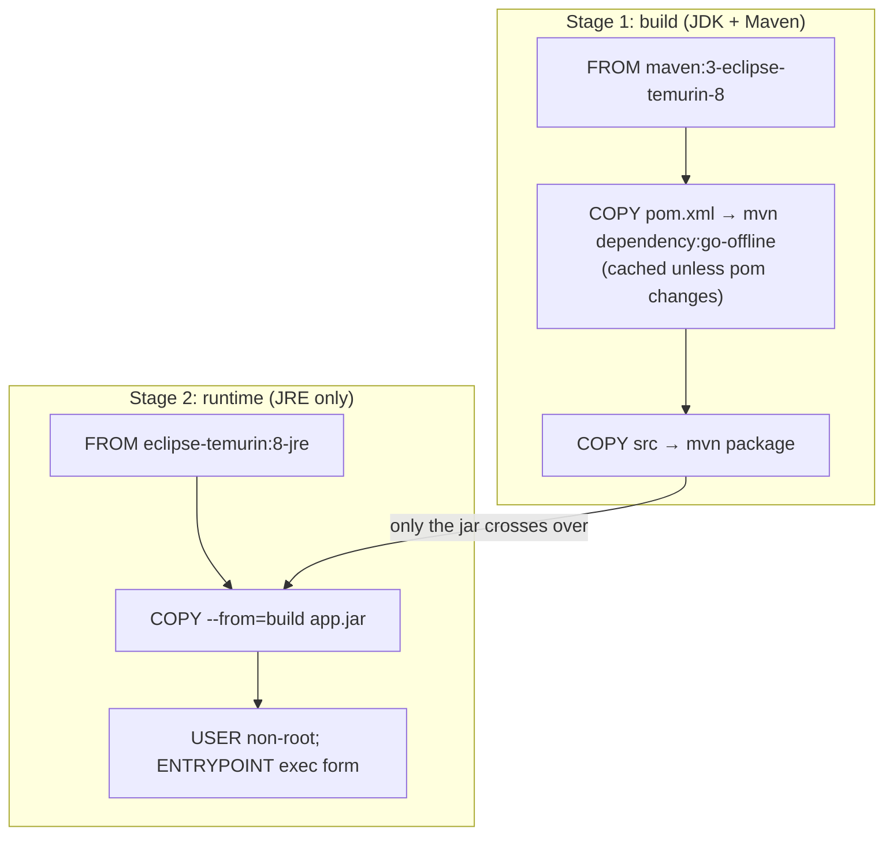
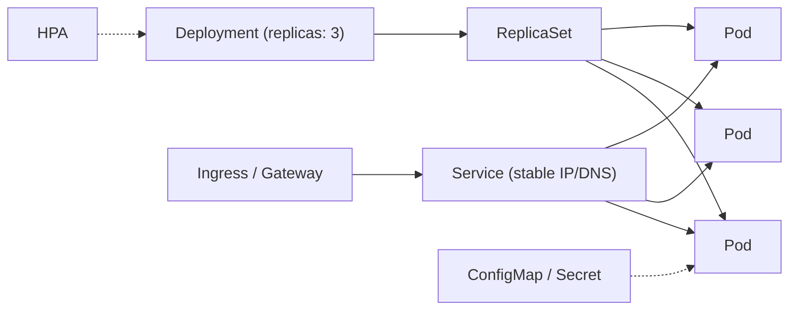
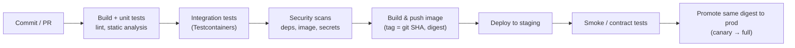

# Docker & CI/CD: Interview Notes

**Why this matters in interviews:** Senior backend engineers are expected to own their service from commit to production: build a small, secure image, run the JVM or Python correctly inside a container, deploy safely to Kubernetes, and build pipelines that catch problems before users do. Interviewers probe image layering, container memory limits, probes, rollouts and rollbacks, and how you ship with confidence and without downtime.

> [!NOTE]
> Examples use Docker/BuildKit, Kubernetes manifests, GitHub Actions and Cloud Build-style YAML. Every YAML block is syntax-checked. Java images assume **Java 8** (8u191+ is container-aware).

Difficulty legend: 🟢 Basic · 🟡 Intermediate · 🔴 Advanced · ⚡ Scenario

## Table of Contents

1. [Container Fundamentals](#1-container-fundamentals)
2. [Dockerfiles and Images](#2-dockerfiles-and-images)
3. [Container Runtime: Networking, Storage, Resources](#3-container-runtime-networking-storage-resources)
4. [Kubernetes for Backend Engineers](#4-kubernetes-for-backend-engineers)
5. [CI/CD Pipelines](#5-cicd-pipelines)
6. [Deployment Strategies and GitOps](#6-deployment-strategies-and-gitops)
7. [Coding / Hands-on](#7-coding--hands-on)
8. [Production Scenarios](#8-production-scenarios)
9. [Cheat Sheet](#9-cheat-sheet)
10. [Revision Checklist](#10-revision-checklist)
11. [Beyond Java 8](#11-beyond-java-8)

---

## 1. Container Fundamentals

> **Mental model:** A container is a *normal Linux process wearing blinkers*. **Namespaces** limit what it can *see* (its own PIDs, network, filesystem), and **cgroups** limit what it can *use* (CPU, memory). An **image** is a stack of read-only filesystem layers, like transparent sheets. There's no separate OS kernel. That's what makes containers fast and light compared with VMs.

### Q1. 🟢 Container vs virtual machine?

| | Container | VM |
|---|---|---|
| Isolation | Process-level (namespaces, cgroups) | Hardware-level (hypervisor) |
| Kernel | Shared host kernel | Own kernel |
| Startup | Milliseconds–seconds | Seconds–minutes |
| Size | MBs | GBs |
| Security boundary | Weaker (shared kernel) | Stronger |

<details><summary>Cross-questions</summary>

**Q:** Why can't you run a Windows container on a Linux host natively?

**A:** Containers share the host kernel, so a Windows binary needs a Windows kernel. Docker Desktop on Mac and Windows runs a Linux VM under the hood for Linux containers.
</details>

### Q2. 🟢 What are namespaces and cgroups?

- **Namespaces** isolate views: `pid`, `net`, `mnt`, `uts` (hostname), `ipc`, `user`, `cgroup`.
- **cgroups** limit and account for resources: CPU shares and quotas, memory limits (exceeding them gets the process OOM-killed), IO and PIDs.

<details><summary>Cross-questions</summary>

**Q:** What happens when a container exceeds its memory limit?

**A:** The kernel OOM killer kills a process in the cgroup, usually the main one. Docker reports exit code **137** (128 + SIGKILL 9), and Kubernetes shows `OOMKilled`.
</details>

### Q3. 🟢 Image vs container vs registry?

An **image** is an immutable template (layers plus config). A **container** is a running (or stopped) instance with a thin writable layer on top. A **registry** stores images (Docker Hub, Artifact Registry, ECR). Images are addressed by a **tag** (mutable) or a **digest** (`sha256:...`, immutable).

<details><summary>Cross-questions</summary>

**Q:** Why deploy by digest rather than `:latest`?

**A:** Tags can be moved. A digest guarantees the exact bytes that were tested, which gives reproducible deploys and rollbacks.
</details>

### Q4. 🟡 How do image layers and the union filesystem work?

Each Dockerfile instruction that changes files creates a **layer**. Layers are stacked with a union filesystem (overlay2), and a container adds a copy-on-write layer on top. Identical layers are shared between images and cached during builds.

<details><summary>Cross-questions</summary>

**Q:** Why does deleting a file in a later layer not shrink the image?

**A:** The file still exists in the earlier layer. The later layer only adds a "whiteout" marker. Delete it in the **same** `RUN` that created it, or use multi-stage builds.
</details>

### Q5. 🟢 What is OCI?

The **Open Container Initiative** standardises the image format, the runtime (runc) and distribution. Images built by Docker, BuildKit, Buildah, Kaniko or Jib run on any OCI runtime (containerd, CRI-O).

<details><summary>Cross-questions</summary>

**Q:** Does Kubernetes need Docker?

**A:** No. Since 1.24, Kubernetes talks to containerd or CRI-O through the CRI, and Docker-built images still run because they're OCI images.
</details>

### Q6. 🟡 What is PID 1, and why does it matter?

The first process in a container is PID 1. It receives signals (SIGTERM on `docker stop` or a pod deletion), and it must **reap zombie processes**. If your app doesn't handle SIGTERM, or it's wrapped in a shell that doesn't forward signals, graceful shutdown breaks and the process gets SIGKILLed after the grace period.

<details><summary>Cross-questions</summary>

**Q:** How do you fix signal handling in shell-wrapped entrypoints?

**A:** Use the **exec form** (`ENTRYPOINT ["java", "-jar", "app.jar"]`), or `exec java ...` inside the script, or a tiny init such as `tini` (`docker run --init`).
</details>

### Q7. 🟢 What do `docker run` flags you must know do?

`-d` (detached), `-p 8080:8080` (publish a port), `-e KEY=val`, `--env-file`, `-v host:container` or `--mount`, `--name`, `--rm`, `--memory`, `--cpus`, `--network`, `--restart`, `--user`, `--read-only`.

<details><summary>Cross-questions</summary>

**Q:** What's the difference between `EXPOSE` and `-p`?

**A:** `EXPOSE` is documentation metadata. `-p` actually publishes the port on the host.
</details>

### Q8. 🟡 What makes containers "immutable infrastructure"?

You never patch a running container. You build a new image and replace the containers. That gives identical artifacts across environments, easy rollback (redeploy the old digest), and no configuration drift.

<details><summary>Cross-questions</summary>

**Q:** Where does per-environment configuration go then?

**A:** Environment variables, mounted ConfigMaps and Secrets, or a config service. The same image goes everywhere (12-factor).
</details>

### Q9. 🟡 What's the difference between `docker stop` and `docker kill`?

`stop` sends **SIGTERM**, waits (10 s by default), then sends SIGKILL. `kill` sends SIGKILL immediately (or a chosen signal). Your app should shut down gracefully on SIGTERM, within the grace period.

<details><summary>Cross-questions</summary>

**Q:** What's the Kubernetes equivalent of the 10 s?

**A:** `terminationGracePeriodSeconds`, which is 30 s by default.
</details>

### Q10. 🟢 What is Docker Compose for?

It defines multi-container local environments in YAML (the app plus PostgreSQL, Redis, a Kafka or Pub/Sub emulator), and brings them up with `docker compose up`. It's great for dev and integration tests, and not a production orchestrator.

```yaml
services:
  api:
    build: .
    ports: ["8080:8080"]
    environment:
      DB_URL: postgresql://app:app@db:5432/reports
      REDIS_URL: redis://cache:6379
    depends_on:
      db:
        condition: service_healthy
  db:
    image: postgres:16
    environment:
      POSTGRES_USER: app
      POSTGRES_PASSWORD: app
      POSTGRES_DB: reports
    healthcheck:
      test: ["CMD-SHELL", "pg_isready -U app"]
      interval: 5s
      retries: 10
  cache:
    image: redis:7
```

<details><summary>Cross-questions</summary>

**Q:** Why use `depends_on` with a `service_healthy` condition?

**A:** Plain `depends_on` only waits for the container to *start*, not for the DB to accept connections.
</details>

### Q11. 🟡 How do containers get their DNS names and network in Compose and Docker?

On a user-defined bridge network, containers resolve each other **by service name** (for example `db:5432`). The default bridge has no automatic DNS. From inside a container, `localhost` refers to the container itself, not the host.

<details><summary>Cross-questions</summary>

**Q:** A containerised app can't reach `localhost:5432`, but the DB is running on the host. Why?

**A:** Inside the container, `localhost` is the container. Use the service name, `host.docker.internal` (Docker Desktop), or host networking.
</details>

### Q12. 🟡 What does a `.dockerignore` do?

It excludes files from the **build context** sent to the builder: `.git`, `target/`, `node_modules`, local `.env` files, IDE folders. That gives faster builds, better cache hits, and no secrets accidentally copied into the image.

<details><summary>Cross-questions</summary>

**Q:** How can a missing `.dockerignore` leak secrets?

**A:** `COPY . .` copies `.env` or credential files into a layer, and anyone who pulls the image can extract them.
</details>

### Q13. 🟢 What are the container restart policies?

`no`, `on-failure[:max]`, `always`, `unless-stopped`. In Kubernetes, the pod's `restartPolicy` (Always for Deployments) plus probes handle restarts, with exponential backoff (`CrashLoopBackOff`).

<details><summary>Cross-questions</summary>

**Q:** What does `CrashLoopBackOff` mean?

**A:** The container keeps exiting after it starts, and Kubernetes waits longer between each restart. Check `kubectl logs --previous` and the exit code.
</details>

### Q14. 🟡 What do container exit codes mean?

`0`: success. `1`: application error. `137`: SIGKILL (often OOMKilled). `143`: SIGTERM (a graceful stop). `139`: segfault. `126` / `127`: command not executable or not found (a bad entrypoint).

<details><summary>Cross-questions</summary>

**Q:** Exit code 137 but no OOMKilled status in Kubernetes. What else?

**A:** A liveness probe failure or a grace-period expiry leads to SIGKILL. Check the events (`kubectl describe pod`).
</details>

---

## 2. Dockerfiles and Images

> **Mental model:** A Dockerfile is a *recipe cooked in layers*, and the builder **reuses any step whose ingredients didn't change**. So put the things that rarely change (base image, dependencies) at the top, and the things that change often (your code) at the bottom. Ship only the *finished dish* (runtime artifacts), not the kitchen (compilers, caches).



### Q15. 🟢 What are the main Dockerfile instructions?

`FROM`, `WORKDIR`, `COPY` / `ADD`, `RUN`, `ENV`, `ARG`, `EXPOSE`, `USER`, `ENTRYPOINT`, `CMD`, `HEALTHCHECK`, `LABEL`, `VOLUME`.

<details><summary>Cross-questions</summary>

**Q:** `COPY` vs `ADD`?

**A:** Prefer `COPY`. `ADD` can also fetch URLs and auto-extract tar archives, which is surprising behaviour and a security risk.
</details>

### Q16. 🟡 `ENTRYPOINT` vs `CMD`?

`ENTRYPOINT` is the executable. `CMD` supplies the default arguments, or the whole command if there's no `ENTRYPOINT`. Arguments to `docker run image X` **replace `CMD`**, and `--entrypoint` overrides the entrypoint.

#### 🎯 Predict the output

```dockerfile
FROM alpine:3.19
ENTRYPOINT ["echo", "hello"]
CMD ["world"]
```

`docker run img` prints …? And `docker run img there` prints …?

<details><summary>Answer</summary>

`hello world`, then `hello there`. The run arguments replace `CMD` but are appended to `ENTRYPOINT`.
</details>

### Q17. 🟡 Exec form vs shell form?

- **Exec form** `["java", "-jar", "app.jar"]`: the process becomes PID 1 and receives signals directly.
- **Shell form** `java -jar app.jar`: runs through `/bin/sh -c`, so the shell is PID 1 and may **not forward SIGTERM**, which means no graceful shutdown.

<details><summary>Cross-questions</summary>

**Q:** How do you use env var expansion with the exec form?

**A:** Use a small entrypoint script that ends with `exec java $JAVA_OPTS -jar app.jar`, or rely on the JVM reading `JAVA_TOOL_OPTIONS` itself.
</details>

### Q18. 🔴 How do you write an efficient, secure Dockerfile for a Java 8 Spring Boot app?

```dockerfile
# ---- build stage ----
FROM maven:3.9-eclipse-temurin-8 AS build
WORKDIR /src
COPY pom.xml .
RUN mvn -B -q dependency:go-offline            # cached while pom.xml is unchanged
COPY src ./src
RUN mvn -B -q package -DskipTests

# ---- runtime stage ----
FROM eclipse-temurin:8-jre
WORKDIR /app
RUN groupadd --system app && useradd --system --gid app app
COPY --from=build /src/target/*.jar app.jar
USER app
EXPOSE 8080
ENV JAVA_TOOL_OPTIONS="-XX:MaxRAMPercentage=75.0 -XX:+ExitOnOutOfMemoryError"
ENTRYPOINT ["java", "-jar", "/app/app.jar"]
```

- **Multi-stage**: build tools stay out of the runtime image.
- **Dependency layer first**: better caching.
- **JRE** base.
- **Non-root** user.
- **Container-aware heap**.
- **Exec form** entrypoint.

<details><summary>Cross-questions</summary>

**Q:** Why `-XX:+ExitOnOutOfMemoryError`?

**A:** On OOM, the JVM exits and Kubernetes restarts a clean pod, instead of leaving a half-broken JVM running. (It's available since 8u92.)

**Q:** Why skip tests in the image build?

**A:** The tests run in an earlier CI stage. The image build should be fast and deterministic. Running them again inside Docker duplicates work and needs services.
</details>

### Q19. 🟡 What are Spring Boot layered jars and Jib?

- **Layered jars** (Boot 2.3+): `java -Djarmode=layertools -jar app.jar extract` splits the jar into dependencies, spring-boot-loader, snapshot-dependencies and application. Copy them as separate layers, so a code change only rebuilds the small application layer.
- **Jib** (a Maven or Gradle plugin) builds optimised layered images **without a Dockerfile or Docker daemon**.

<details><summary>Cross-questions</summary>

**Q:** Why does layering speed up deploys?

**A:** Nodes already hold the unchanged dependency layers, so only a few MB of application layer are pushed and pulled.
</details>

### Q20. 🟡 How does build caching work, and what invalidates it?

The builder reuses a layer if the instruction **and all its inputs** are unchanged: the files a `COPY` copies, and all the previous layers. Once one layer changes, **every later layer** is rebuilt. So `COPY . .` before dependency installation busts the cache on every code change.

<details><summary>Cross-questions</summary>

**Q:** How do you cache Maven or pip downloads across builds in CI?

**A:** BuildKit cache mounts (`RUN --mount=type=cache,target=/root/.m2 mvn ...`) or registry-based cache (`--cache-from` / `--cache-to`).
</details>

### Q21. 🟡 How do you choose a base image?

Consider the size, the attack surface, glibc vs musl, and patching cadence:

- `eclipse-temurin:8-jre` / `python:3.11-slim`: Debian-based, compatible, reasonably small.
- **Alpine**: tiny, but musl libc can break native libraries (for example some Python wheels or netty-native).
- **Distroless**: no shell or package manager, minimal CVEs, but harder to debug.

<details><summary>Cross-questions</summary>

**Q:** Why can Alpine make Python images *bigger* and slower to build?

**A:** Many wheels are built for glibc (manylinux), so on musl pip has to compile them from source, which needs build tools.
</details>

### Q22. 🟡 `ARG` vs `ENV`?

`ARG` is available **only at build time** (`--build-arg`). `ENV` is set in the image and at runtime. Neither is safe for secrets: build args are visible in `docker history`, and env vars are visible to anyone who can inspect the container.

<details><summary>Cross-questions</summary>

**Q:** How do you use a secret during a build (for example, a private Maven repo token)?

**A:** With a BuildKit secret mount: `RUN --mount=type=secret,id=mvnsettings,target=/root/.m2/settings.xml mvn ...`. It isn't stored in any layer.
</details>

### Q23. 🟡 How do you make images smaller?

Use multi-stage builds, runtime-only base images, `.dockerignore`, and combine install-and-clean in **one** `RUN` (`apt-get install ... && rm -rf /var/lib/apt/lists/*`), with `--no-install-recommends` and `pip --no-cache-dir`. Don't ship source code, tests or build tools.

<details><summary>Cross-questions</summary>

**Q:** How do you see which layer is large?

**A:** `docker history <image>`, or the `dive` tool.
</details>

### Q24. 🟡 Why run as non-root, and what else hardens containers?

A root process that escapes the container (a kernel or runtime bug) is root on the host. Harden with a `USER` directive, a read-only root filesystem, dropped Linux capabilities, no privileged mode, seccomp or AppArmor profiles, and no secrets in the image.

<details><summary>Cross-questions</summary>

**Q:** How do you enforce this in Kubernetes?

**A:** `securityContext` (`runAsNonRoot: true`, `readOnlyRootFilesystem: true`, `allowPrivilegeEscalation: false`, `capabilities.drop: ["ALL"]`) plus Pod Security Admission.
</details>

### Q25. 🟡 What does `HEALTHCHECK` in a Dockerfile do, and should you use it with Kubernetes?

It makes Docker mark the container healthy or unhealthy based on a command. Kubernetes **ignores** Dockerfile `HEALTHCHECK` and uses its own liveness and readiness probes. It's useful for Compose or plain Docker.

<details><summary>Cross-questions</summary>

**Q:** What's the Compose equivalent?

**A:** The `healthcheck:` block, plus `depends_on` conditions (Q10).
</details>

### Q26. 🟡 How do you tag images?

Use an immutable, traceable tag: the **git SHA** (`api:3f9c2ab`), optionally with a semantic version (`api:1.4.2`), and deploy by digest. Never deploy `latest` in production. Add OCI labels (source repository, revision, build date).

<details><summary>Cross-questions</summary>

**Q:** Why can a moving `latest` break rollbacks?

**A:** "Roll back to latest" is ambiguous. You need the exact previous digest.
</details>

### Q27. 🟡 What is image scanning, and what is an SBOM?

Scanners (Trivy, Grype, Artifact Registry scanning) check OS packages and language dependencies for CVEs. An **SBOM** (Software Bill of Materials, in SPDX or CycloneDX format) lists every component, for audits and fast CVE impact checks (like Log4Shell).

<details><summary>Cross-questions</summary>

**Q:** Should a HIGH CVE always fail the build?

**A:** Use a policy: fail on fixable critical and high findings in runtime components, and allow documented exceptions with expiry dates. Otherwise teams drown in noise.
</details>

### Q28. 🟡 What is image signing, and how does it relate to supply-chain security?

Sign images (Sigstore cosign, or Binary Authorization on GKE) and verify the signatures at deploy time, so only CI-built, scanned images can run. Combine it with provenance attestations (SLSA) to prove how and where an image was built.

<details><summary>Cross-questions</summary>

**Q:** What attack does this stop?

**A:** Someone pushing a malicious image to your registry (a stolen credential) and getting it deployed.
</details>

### Q29. 🟡 How do you build multi-architecture images?

`docker buildx build --platform linux/amd64,linux/arm64 -t repo/app:sha --push .` produces a **manifest list**, so each node pulls the right architecture. That matters for ARM nodes (Graviton, Tau T2A) and Apple Silicon laptops.

<details><summary>Cross-questions</summary>

**Q:** What breaks on ARM?

**A:** Native libraries or wheels without ARM builds, and base images that only publish amd64.
</details>

### Q30. 🟡 Why pin base image versions?

`FROM python:3` can jump from 3.11 to 3.12 silently. Pin a specific tag (`python:3.11-slim`), or even a digest, for reproducibility, and update deliberately with Renovate or Dependabot, rebuilding regularly for patches.

<details><summary>Cross-questions</summary>

**Q:** Isn't pinning a digest a security risk, since you'd miss patches?

**A:** Only if you never update. Automate update PRs so the pins move with tested patches.
</details>

### Q31. 🟡 How do you containerise a Python/FastAPI app well?

Use a slim base, install the dependencies from a lock file **before** copying the code, `pip install --no-cache-dir`, a non-root user, `PYTHONUNBUFFERED=1`, the exec-form `CMD` for uvicorn, and optionally a multi-stage build that compiles wheels and copies a virtualenv. See file 12 (Q94).

<details><summary>Cross-questions</summary>

**Q:** Why copy a virtualenv between stages?

**A:** The build stage has compilers for building wheels, and the runtime stage gets only the installed packages.
</details>

### Q32. 🟡 What is a distroless image, and how do you debug one?

It contains only the runtime (for example, a JRE) and its dependencies, with no shell or package manager, so it has a tiny attack surface. You debug it with **ephemeral debug containers** (`kubectl debug -it pod --image=busybox --target=app`), or with a `:debug` variant image in non-production.

<details><summary>Cross-questions</summary>

**Q:** Why is having no shell a security win?

**A:** Many exploits rely on spawning a shell or downloading tools. Without a shell, those post-exploitation steps are much harder.
</details>

### Q33. 🟡 What do `docker build --no-cache` and `--pull` do?

`--no-cache` ignores the layer cache (a clean rebuild). `--pull` always fetches the newest version of the base tag. Use them in scheduled rebuilds to pick up base-image security patches.

<details><summary>Cross-questions</summary>

**Q:** Why not use `--no-cache` on every CI build?

**A:** It's slow and wasteful. Rely on the cache for normal builds, and do a periodic clean rebuild.
</details>

### Q34. 🟡 What does a reproducible build mean for containers?

The same source gives the same image, byte for byte (or at least functionally): pinned bases and dependencies, lock files, no network fetches of "latest" during the build, deterministic timestamps (Jib does this). It gives trust, caching, and auditable releases.

<details><summary>Cross-questions</summary>

**Q:** Which tool gives reproducible Java images by default?

**A:** Jib, which sets fixed file timestamps and a deterministic layer order.
</details>

---
## 3. Container Runtime: Networking, Storage, Resources

> **Mental model:** At runtime, a container is a process with *borrowed* resources: a virtual network card, a filesystem that disappears on deletion unless you attach a volume, and CPU and memory **quotas**. Most production surprises come from forgetting that the quota, not the host, is the real limit.

### Q35. 🟡 How does the JVM behave in containers?

Java 8u191+ is **container-aware**: it reads the cgroup memory and CPU limits. Size the heap with `-XX:MaxRAMPercentage=70–75` instead of a hard `-Xmx`, and leave room for metaspace, thread stacks and direct buffers. Older Java 8 builds read the host's memory, then oversized their heap and got OOM-killed.

<details><summary>Cross-questions</summary>

**Q:** Why is the heap limit below the container limit?

**A:** Non-heap memory (metaspace, thread stacks, code cache, direct buffers, GC structures) also counts against the container's cgroup limit.
</details>

### Q36. 🟡 How do volumes, bind mounts and tmpfs differ?

- A **volume** is managed by Docker and survives the container.
- A **bind mount** maps a host path, which is handy for dev and brittle in production.
- **tmpfs** is in memory, and its data is lost on stop.

Data written to the container's writable layer is lost when the container is removed.

<details><summary>Cross-questions</summary>

**Q:** Where do stateful services store data on Kubernetes?

**A:** On PersistentVolumeClaims, usually through a StatefulSet. Managed databases are often better still.
</details>

### Q37. 🟡 How do CPU limits and throttling affect latency?

CFS quotas pause a container that uses up its CPU quota within a period. JIT and GC bursts cause **throttling**, which shows up as latency spikes. Set sensible requests, set limits carefully (some teams avoid CPU limits for latency-sensitive services), and watch the throttling metrics.

<details><summary>Cross-questions</summary>

**Q:** Which metric shows throttling?

**A:** `container_cpu_cfs_throttled_seconds_total` (cAdvisor or Prometheus).
</details>

---

## 4. Kubernetes for Backend Engineers

> **Mental model:** Kubernetes is a *control loop*: you declare the desired state (3 replicas of image X, healthy and reachable), and controllers keep reconciling the actual state towards it. Pods are cattle, Services are stable addresses, and probes decide when traffic flows to a pod.



### Q38. 🟢 What are the core objects?

- **Pod**: one or more containers sharing a network and volumes.
- **Deployment**: stateless replicas with rolling updates.
- **StatefulSet**: stable identities and storage.
- **Service**: stable virtual IP and DNS, with load balancing.
- **Ingress**: HTTP routing.
- **ConfigMap / Secret**: configuration.
- **Job / CronJob**: batch work.
- **HPA**: autoscaling.

<details><summary>Cross-questions</summary>

**Q:** Deployment or StatefulSet for a Kafka consumer?

**A:** A Deployment, since consumers are stateless. A StatefulSet is useful if you want stable `group.instance.id` values for static membership.
</details>

### Q39. 🟡 What do liveness, readiness and startup probes do?

- **Readiness**: failing removes the pod from the Service endpoints, and there's no restart.
- **Liveness**: failing **restarts** the container. Keep it dependency-free.
- **Startup**: protects slow-starting JVMs from being killed by liveness before they've finished booting.

```yaml
apiVersion: apps/v1
kind: Deployment
metadata:
  name: report-api
spec:
  replicas: 3
  selector:
    matchLabels: { app: report-api }
  template:
    metadata:
      labels: { app: report-api }
    spec:
      terminationGracePeriodSeconds: 45
      containers:
        - name: app
          image: asia-south1-docker.pkg.dev/proj/repo/report-api@sha256:abc123
          ports: [{ containerPort: 8080 }]
          resources:
            requests: { cpu: "500m", memory: "1Gi" }
            limits:   { memory: "1Gi" }
          startupProbe:
            httpGet: { path: /actuator/health/liveness, port: 8080 }
            failureThreshold: 30
            periodSeconds: 5
          livenessProbe:
            httpGet: { path: /actuator/health/liveness, port: 8080 }
          readinessProbe:
            httpGet: { path: /actuator/health/readiness, port: 8080 }
          lifecycle:
            preStop:
              exec: { command: ["sh", "-c", "sleep 10"] }
          securityContext:
            runAsNonRoot: true
            allowPrivilegeEscalation: false
```

<details><summary>Cross-questions</summary>

**Q:** Why the `preStop` sleep?

**A:** Endpoint removal is asynchronous. The sleep lets load balancers stop routing to the pod before the app begins shutting down.
</details>

### Q40. 🟡 What do requests and limits mean, and what are QoS classes?

**Requests** are used for scheduling (a guaranteed share). **Limits** are the maximum (memory above the limit means an OOM kill, and CPU above the limit means throttling). The QoS classes are Guaranteed (requests = limits), Burstable and BestEffort. Under node pressure, BestEffort pods are evicted first.

<details><summary>Cross-questions</summary>

**Q:** Why set memory request = limit for JVM services?

**A:** It gives predictable scheduling, and avoids surprise evictions or OOM kills when the node is under pressure.
</details>

### Q41. 🟡 How do ConfigMaps and Secrets work?

They're injected as environment variables or mounted files. Secrets are only base64-encoded by default, so enable encryption at rest or use External Secrets or Secret Manager. Changing an env-var-based ConfigMap needs a pod restart to take effect.

<details><summary>Cross-questions</summary>

**Q:** How do you trigger a rollout when config changes?

**A:** Put a checksum of the config in a pod-template annotation (the Helm pattern), so changes roll the pods.
</details>

### Q42. 🟡 How does the HPA work?

It scales the replica count on CPU or memory, or on custom and external metrics (requests per second, Kafka lag, Pub/Sub backlog through KEDA). Stabilisation windows prevent flapping.

<details><summary>Cross-questions</summary>

**Q:** Why does CPU-based scaling fail for IO-bound consumers?

**A:** Their CPU stays low while the backlog grows, so scale on lag or backlog age instead.
</details>

### Q43. 🟡 What is a PodDisruptionBudget?

It limits how many pods can be voluntarily evicted at once (during node drains or upgrades), for example `minAvailable: 2`, which keeps capacity up during maintenance.

<details><summary>Cross-questions</summary>

**Q:** Can a PDB block node upgrades?

**A:** Yes, if it's too strict (for example `minAvailable` = replicas). Size it sensibly.
</details>

### Q44. 🟡 How do you debug a failing pod?

`kubectl describe pod` (events, probe failures, OOMKilled), `kubectl logs [--previous]`, `kubectl exec` or an ephemeral debug container, `kubectl get events`, and a resource check with `kubectl top`.

<details><summary>Cross-questions</summary>

**Q:** What does `ImagePullBackOff` mean?

**A:** A wrong image name or tag, a missing digest, or no registry permissions for the node's service account.
</details>

---

## 5. CI/CD Pipelines

> **Mental model:** A pipeline is a *conveyor belt of increasingly expensive checks*. Fast, cheap checks come first (lint, unit tests), and slow, expensive ones later (integration tests, security scans, deploys). A red light anywhere stops the belt. The artifact is built **once** and promoted unchanged through the environments.



### Q45. 🟢 CI vs continuous delivery vs continuous deployment?

**CI** means every change is built and tested automatically. **Continuous delivery** means every green build is *deployable* (release is a button). **Continuous deployment** means every green build goes to production automatically.

<details><summary>Cross-questions</summary>

**Q:** What must be in place before continuous deployment?

**A:** Strong automated tests, observability, fast rollback, and feature flags.
</details>

### Q46. 🟡 What does a GitHub Actions pipeline for a Java 8 service look like?

```yaml
name: ci
on:
  pull_request:
  push:
    branches: [main]
jobs:
  build:
    runs-on: ubuntu-latest
    steps:
      - uses: actions/checkout@v4
      - uses: actions/setup-java@v4
        with:
          distribution: temurin
          java-version: "8"
          cache: maven
      - name: Build and test
        run: mvn -B verify
      - name: Build image
        if: github.ref == 'refs/heads/main'
        run: docker build -t registry.example.com/report-api:${{ github.sha }} .
```

<details><summary>Cross-questions</summary>

**Q:** How do you authenticate to a cloud from CI without long-lived keys?

**A:** OIDC federation (GitHub → GCP Workload Identity Federation), which gives short-lived tokens with no stored secrets.
</details>

### Q47. 🟡 "Build once, deploy many": why?

The exact artifact (the image digest) that passed the tests is the one that runs in staging and production. Rebuilding per environment risks differences in dependencies or base images.

<details><summary>Cross-questions</summary>

**Q:** How does the environment config differ then?

**A:** Through runtime configuration (ConfigMaps, secrets, env vars), not through a different image.
</details>

### Q48. 🟡 How do you keep pipelines fast?

Cache dependencies (Maven, pip), run test jobs in parallel, use incremental builds, use the Docker layer cache, run only the affected modules in monorepos, and keep integration tests focused.

<details><summary>Cross-questions</summary>

**Q:** What's a reasonable PR pipeline time?

**A:** Under about 10–15 minutes. Slower pipelines push developers to batch changes, which increases risk.
</details>

### Q49. 🟡 Which quality and security gates do you add?

Unit and integration tests, coverage trends (not a hard vanity number), static analysis (SpotBugs, Sonar, ruff), dependency scanning (OWASP Dependency-Check, pip-audit), secret scanning, image scanning, and SBOM plus signing.

<details><summary>Cross-questions</summary>

**Q:** How do you keep flaky tests from blocking everyone?

**A:** Track them, quarantine them with an owner and a deadline, and fix the root cause. Never just retry until green.
</details>

### Q50. 🟡 How do database migrations fit into CD?

Flyway or Liquibase migrations run once per deploy (a Job or init step), are **backward compatible** (expand/contract), are reviewed like code, and are tested in CI against a real database.

<details><summary>Cross-questions</summary>

**Q:** Why not run migrations on every pod's startup?

**A:** Several pods could race. Use one controlled migration step, or rely on the tool's lock table.
</details>

---

## 6. Deployment Strategies and GitOps

> **Mental model:** A deployment strategy is *how you swap the engine while the plane is flying*: gradually (rolling), side by side (blue-green), or with a few passengers first (canary). GitOps means the desired state of the cluster lives in git, and a controller syncs it.

### Q51. 🟡 Rolling vs blue-green vs canary?

| | Rolling | Blue-green | Canary |
|---|---|---|---|
| How | Replace pods gradually | Two full envs, switch traffic | Small % first, then ramp |
| Rollback | Roll back (minutes) | Instant switch | Shift traffic back |
| Cost | Low | 2× capacity | Low–medium |
| Needs | Readiness probes, compatibility | Env duplication | Metrics-based analysis |

<details><summary>Cross-questions</summary>

**Q:** What must hold for any strategy?

**A:** The old and new versions must work at the same time with the same DB schema and events.
</details>

### Q52. 🟡 What is GitOps (Argo CD, Flux)?

Manifests (Helm or Kustomize) live in git. A controller in the cluster pulls and reconciles them, and detects drift. Deploys and rollbacks become git commits and reverts, with a full audit trail.

<details><summary>Cross-questions</summary>

**Q:** How does CI hand off to GitOps?

**A:** CI builds and pushes the image, then opens a PR or commit that updates the image digest in the manifests repository.
</details>

### Q53. 🟡 What does Helm give you?

Templated Kubernetes manifests (charts) with per-environment values, versioned releases, and `helm rollback`. The cost is the complexity of templates, so keep charts simple, or use Kustomize overlays.

<details><summary>Cross-questions</summary>

**Q:** Helm or Kustomize?

**A:** Helm for reusable, parameterised packages. Kustomize for simple overlays on plain YAML.
</details>

---

## 7. Coding / Hands-on

> **Mental model:** Hands-on DevOps questions are usually "write a Dockerfile", "write a probe config" or "write a pipeline". Show multi-stage builds, non-root users, the exec form, probes and immutable tags.

### Q54. 🟡 How do you write a production Dockerfile for a FastAPI service?

```dockerfile
FROM python:3.11-slim AS build
WORKDIR /w
COPY requirements.txt .
RUN pip install --no-cache-dir --prefix=/install -r requirements.txt

FROM python:3.11-slim
ENV PYTHONUNBUFFERED=1 PYTHONDONTWRITEBYTECODE=1
WORKDIR /app
COPY --from=build /install /usr/local
COPY app/ app/
RUN useradd --create-home app
USER app
EXPOSE 8080
CMD ["uvicorn", "app.main:app", "--host", "0.0.0.0", "--port", "8080"]
```

<details><summary>Cross-questions</summary>

**Q:** Why install into `/install` and copy it across?

**A:** The build stage can contain compilers for building wheels, and the runtime image receives only the installed packages.
</details>

---

## 8. Production Scenarios

> **Mental model:** Container incidents usually come down to **limits** (OOMKilled, throttling), **probes** (restart loops, traffic sent too early), **signals** (no graceful shutdown), or **images** (a wrong tag, a missing permission). `kubectl describe` and the exit codes point to which one.

### Q55. ⚡ Pods restart every few hours with exit code 137 and `OOMKilled`, but the JVM heap looks fine. Why?

Container memory = heap + non-heap. The heap was set too close to the limit (or an old JVM ignored the limit entirely). **Fix:** use `MaxRAMPercentage` around 70–75, cap the threads and direct buffers, check native memory tracking, and raise the limit if the working set is legitimate.

<details><summary>Cross-questions</summary>

**Q:** How do you tell this apart from a Java OOM?

**A:** A Java OOM throws `OutOfMemoryError` in the logs (and a heap dump if configured). An OOMKill has no Java stack trace, just exit code 137.
</details>

### Q56. ⚡ Every deploy causes a burst of 502 and 503 errors for about 10 seconds. What do you fix?

Add readiness probes (so no traffic reaches a pod before it's ready), a `preStop` sleep, graceful shutdown in the app (exec-form entrypoint so SIGTERM reaches it), `maxUnavailable: 0` with `maxSurge: 1`, and a startup probe for slow JVMs.

<details><summary>Cross-questions</summary>

**Q:** Why can the shell form alone cause this?

**A:** The shell doesn't forward SIGTERM, so the app is SIGKILLed mid-request at the end of the grace period.
</details>

### Q57. ⚡ Pods are stuck in `CrashLoopBackOff` right after a release. How do you respond?

1. `kubectl logs --previous` and `describe`: look for a config error, missing secret, bad entrypoint or failed migration.
2. **Roll back** to the previous digest (GitOps revert or `kubectl rollout undo`).
3. Fix forward with a test that would have caught it.

<details><summary>Cross-questions</summary>

**Q:** Why deploy by digest?

**A:** Rollback then targets the exact previously running bytes.
</details>

### Q58. ⚡ A secret was found baked into an image layer. What do you do?

1. Rotate the secret immediately.
2. Delete the image tags and digests from the registry.
3. Rebuild without it: use BuildKit secret mounts, `.dockerignore`, and runtime injection.
4. Add secret and image scanning in CI.

Removing the file in a later layer doesn't help, because it's still in the earlier layer.

<details><summary>Cross-questions</summary>

**Q:** How do you check whether other images are affected?

**A:** Scan the registry with a secret scanner (for example, trufflehog on the images), and check the build history for the same Dockerfile pattern.
</details>

---

## 9. Cheat Sheet

| Topic | Key facts |
|---|---|
| Container | Namespaces (see) + cgroups (use); shared kernel; exit 137 = SIGKILL/OOM, 143 = SIGTERM |
| Image | Layers, cache invalidates everything after a change; deploy by digest, tag by git SHA |
| Dockerfile | Multi-stage, deps before code, JRE/slim base, non-root, exec-form ENTRYPOINT, `.dockerignore` |
| Secrets | Never ARG/ENV/COPY; BuildKit secret mounts; runtime injection |
| JVM in containers | 8u191+ container-aware; `MaxRAMPercentage` ~75; leave non-heap headroom |
| Kubernetes | Deployment/Service/Ingress; readiness vs liveness vs startup; requests vs limits; HPA; PDB |
| Shutdown | SIGTERM → preStop → graceful shutdown within `terminationGracePeriodSeconds` |
| CI/CD | Fast checks first; build once, promote the same digest; scans + SBOM + signing |
| Deploys | Rolling / blue-green / canary; expand/contract migrations; GitOps rollbacks = git revert |

---

## 10. Revision Checklist

- [ ] Explain containers vs VMs, namespaces and cgroups
- [ ] Write a multi-stage Dockerfile for Java 8 and for FastAPI
- [ ] Explain layer caching, the exec vs shell form, and ENTRYPOINT vs CMD
- [ ] Size the JVM heap in containers, and explain OOMKilled vs Java OOM
- [ ] Configure liveness, readiness and startup probes, plus preStop and graceful shutdown
- [ ] Explain requests vs limits, CPU throttling, HPA and PDB
- [ ] Design a CI pipeline with quality and security gates
- [ ] Compare rolling, blue-green and canary deploys, and explain GitOps
- [ ] Respond to CrashLoopBackOff and a leaked secret in an image

---

## 11. Beyond Java 8

- **Java 17+ images** are more container-friendly by default (improved cgroup v2 support, CDS/AppCDS for faster startup). GraalVM native images give very fast startup.
- **Kubernetes Gateway API** is replacing Ingress for richer routing, and **sidecar-less meshes** (Istio ambient) reduce the per-pod overhead.
