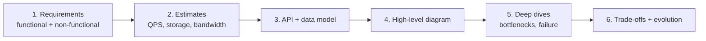
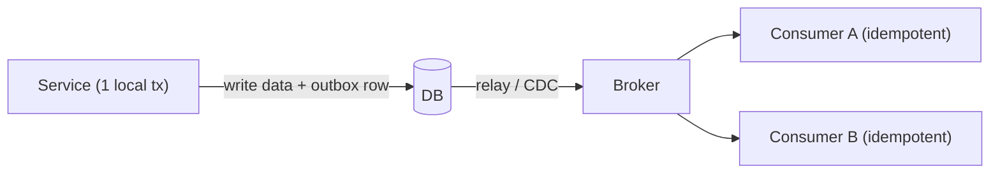
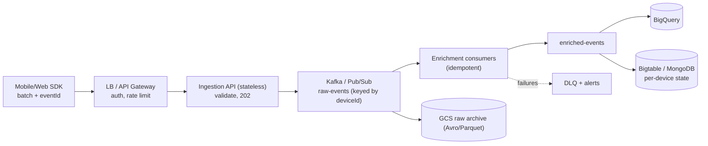

# System Design: Interview Notes

**Why this matters in interviews:** The system design round decides senior-level offers. Interviewers want a structured approach: clarify requirements, estimate scale, sketch the architecture, go deep on the bottlenecks, and discuss trade-offs. Your real systems (event ingestion over Kafka, MQ and Pub/Sub, batch pipelines, Redis caching, and a reporting platform) give you credible examples to draw on.

Difficulty legend: 🟢 Basic · 🟡 Intermediate · 🔴 Advanced · ⚡ Scenario

## Table of Contents

1. [Approach and Estimation](#1-approach-and-estimation)
2. [Building Blocks](#2-building-blocks)
3. [Data and Consistency](#3-data-and-consistency)
4. [Reliability and Scale](#4-reliability-and-scale)
5. [Design Problems](#5-design-problems)
6. [Cheat Sheet](#6-cheat-sheet)
7. [Revision Checklist](#7-revision-checklist)

---

## 1. Approach and Estimation

> **Mental model:** A design interview is a *guided conversation, not a drawing contest*. Clarify → estimate → high-level design → deep dives → trade-offs → wrap-up. Always state your assumptions out loud.

### Q1. 🟢 What's the first thing you do in a design round?

Clarify the scope. Establish the **functional requirements** (what the system does) and the **non-functional** ones (scale, latency, availability, consistency, durability, cost), plus what's out of scope. Write them down.

Cross-questions

**Q:** Which non-functional requirement changes a design the most?

**A:** The consistency and latency targets. Strong consistency across regions versus eventual consistency leads to completely different architectures.

### Q2. 🟢 How do you do back-of-the-envelope estimates?

Daily active users × actions per user ÷ 86,400 gives the average QPS, and peak ≈ 2–10× the average. Storage = items per day × size × retention. Bandwidth = QPS × payload size. Round aggressively, because the point is the order of magnitude.

Cross-questions

**Q:** 10M devices sending 100 events a day at 1 KB each. What's the load?

**A:** 1B events a day ≈ **11.6K events/s** on average (peak perhaps 50K/s), about 1 TB a day of raw data, and about 30 TB a month before compression.

### Q3. 🟢 Which latency numbers should you know?

| Operation | Approx |
|---|---|
| L1 cache / main memory | ~1 ns / ~100 ns |
| SSD random read | ~100 µs |
| Same-DC network round trip | ~0.5 ms |
| Redis GET (in DC) | ~0.2–1 ms |
| Indexed DB query | ~1–10 ms |
| Cross-region round trip | ~50–150 ms |

Cross-questions

**Q:** Why do these numbers matter?

**A:** They tell you whether a design fits a latency budget. For example, 5 sequential cross-region calls can never meet a 200 ms SLA.

### Q4. 🟡 What are SLI, SLO and SLA, and how do availability "nines" translate?

The **SLI** is the measurement, the **SLO** is the target, and the **SLA** is the contractual promise. 99.9% availability ≈ 43 minutes of downtime a month, and 99.99% ≈ 4.3 minutes a month.

Cross-questions

**Q:** What's the availability of 3 serial dependencies at 99.9% each?

**A:** About 99.7%, because serial availabilities multiply.

### Q5. 🟡 How do you present trade-offs?

Use the pattern "Option A gives X at the cost of Y; I choose A because requirement Z matters more." Common axes: consistency vs availability, latency vs cost, simplicity vs flexibility, and read vs write optimisation.

Cross-questions

**Q:** What do interviewers penalise?

**A:** One "perfect" design with no trade-offs mentioned, or diving into details before the requirements are clear.

---

## 2. Building Blocks

> **Mental model:** Every system is built from the same *Lego bricks*: load balancers, stateless services, caches, databases, queues, object storage, a CDN and search. The skill is choosing the right brick for each requirement.

### Q6. 🟢 What does a load balancer do, and L4 vs L7?

It spreads traffic across instances and removes unhealthy ones. **L4** works at TCP level, which is fast but content-unaware. **L7** works at HTTP level, and can route by path or header, terminate TLS, and do retries.

Cross-questions

**Q:** Round robin vs least connections?

**A:** Least connections suits requests with uneven durations, such as report downloads.

### Q7. 🟢 Why keep services stateless?

Any instance can serve any request, so you can scale horizontally and survive failures. State goes into databases, caches or object storage.

Cross-questions

**Q:** Where do sessions go?

**A:** In JWTs (client side) or a shared store like Redis.

### Q8. 🟢 Vertical vs horizontal scaling?

**Vertical** means a bigger machine: simple, but limited and a single point of failure. **Horizontal** means more machines: it needs statelessness, partitioning and load balancing.

Cross-questions

**Q:** What's hardest to scale horizontally?

**A:** Stateful, strongly consistent writes, such as a relational primary. That's where sharding or a different data model comes in.

### Q9. 🟡 Where can caching happen in a system?

The client or browser, the CDN, the API gateway, the application (local L1), a distributed cache (Redis), and the database buffer cache. The patterns are cache-aside, write-through and write-behind. See file 11 for the full treatment.

Cross-questions

**Q:** What's the hardest part of caching?

**A:** Invalidation and stampedes. Use TTL plus jitter, delete-after-commit, and single-flight on a miss.

### Q10. 🟡 What does a CDN do?

It caches static and cacheable content at edge locations, which reduces latency and origin load. It's also used for large downloads, often through signed URLs.

Cross-questions

**Q:** Can a CDN serve per-user data?

**A:** Only with a careful cache key or signed-URL design. Otherwise it risks leaking private data.

### Q11. 🟡 When do you introduce a message queue or stream?

For asynchronous processing, absorbing traffic spikes (load levelling), decoupling producers from consumers, fan-out to several consumers, and retries with DLQs. The choice is Kafka (a replayable log), Pub/Sub (managed) or MQ (enterprise transactional). See files 07 and 08.

Cross-questions

**Q:** What does a queue cost you?

**A:** Eventual consistency, duplicate handling (idempotency) and operational complexity.

### Q12. 🟡 SQL or NoSQL?

**SQL** gives relations, ACID, ad-hoc queries and strong constraints. **Document stores** give aggregate-shaped data with flexible schemas. **Wide-column** stores (Bigtable, Cassandra) give massive write throughput with key-based access. **Key-value** stores give simple, fast lookups. Choose by access patterns and consistency needs.

Cross-questions

**Q:** Where would you store 1B events a day for time-range queries by device?

**A:** A wide-column store (Bigtable) keyed by `deviceId#reverseTs`, or a partitioned warehouse (BigQuery) for analytics.

### Q13. 🟡 What do object storage and a data lake give you?

Object storage (GCS, S3) is cheap, durable and effectively unlimited, and is used for files, exports, backups and raw events (Parquet or Avro). Warehouses query it directly (BigQuery external tables).

Cross-questions

**Q:** Why not store report files in the database?

**A:** Cost, DB bloat and throughput. Store the path in the DB and the bytes in GCS.

### Q14. 🟡 What does an API gateway do?

It gives you a single entry point: auth, rate limiting, routing, TLS, request IDs and quotas. See file 06.

Cross-questions

**Q:** What's the risk of a gateway?

**A:** It's a single point of failure and a bottleneck. Run it highly available and keep it thin.

### Q15. 🟡 When do you need a search index?

For full-text search, fuzzy matching, faceting and relevance ranking. Use Elasticsearch or OpenSearch, fed asynchronously from the source of truth through CDC or events.

Cross-questions

**Q:** Is the search index a source of truth?

**A:** No. It's derived and eventually consistent, and can always be rebuilt.

---

## 3. Data and Consistency

> **Mental model:** Distributed data is a *trade between speed, availability and agreement*. You can't have perfect agreement instantly everywhere during failures, so decide per use case what can be eventually consistent.

### Q16. 🟡 What is the CAP theorem?

During a network **P**artition, a system must choose between **C**onsistency (every read sees the latest write, or gets an error) and **A**vailability (every request gets a non-error response). **PACELC** extends it: *else* (when there's no partition), you trade **L**atency against **C**onsistency.

Cross-questions

**Q:** Is a single-node relational database CA?

**A:** The CAP theorem only applies to distributed systems. Once you add replicas, you choose behaviour under partition.

### Q17. 🟡 Strong vs eventual consistency?

**Strong** means reads reflect the latest committed write (linearizable). **Eventual** means replicas converge over time. There are models in between: read-your-writes, monotonic reads and causal consistency.

Cross-questions

**Q:** Where is eventual consistency fine?

**A:** Like counts, analytics dashboards and search indexes. It's not fine for balances or inventory reservation.

### Q18. 🟡 What are the replication models?

Single-leader (simple, but writes are limited to one node), multi-leader (multi-region writes, with conflict resolution) and leaderless (quorums, as in Dynamo or Cassandra: W + R > N gives read-your-writes).

Cross-questions

**Q:** What does W + R > N guarantee?

**A:** The read and write quorums overlap, so a read sees at least one up-to-date replica.

### Q19. 🟡 How do you shard or partition data?

By **hash** (even distribution, but range queries scatter), **range** (efficient ranges, but hotspots) or **directory** (flexible, but needs a lookup service). Pick a key that has high cardinality, spreads the load evenly, and matches the queries. Use **consistent hashing** to move less data when nodes are added.

Cross-questions

**Q:** Why is a timestamp alone a bad shard key?

**A:** Every new write lands on the "latest" shard, which becomes a hotspot.

### Q20. 🔴 How do you keep data consistent across services?

Use local transactions plus events: the **outbox** pattern, **sagas** with compensations, and **idempotent consumers**. Avoid 2PC. See file 06.

Cross-questions

**Q:** What guarantee does the outbox give?

**A:** At-least-once publishing, so consumers must dedupe.

### Q21. 🟡 What's the difference between idempotency and exactly-once?

Exactly-once *delivery* is impractical end to end. Instead, **at-least-once delivery plus idempotent processing** (unique event IDs and upserts) gives effectively-once outcomes.

Cross-questions

**Q:** Where does the event ID come from?

**A:** The originating client, such as the mobile SDK, and it's carried unchanged across every hop.

### Q22. 🟡 What does CQRS with read models give you?

Separate write and read models, where the read side is updated by events and optimised per query (dashboards, search). The costs are eventual consistency and projection maintenance.

Cross-questions

**Q:** When is CQRS overkill?

**A:** For simple CRUD, where the reads and writes have the same shape.

### Q23. 🟡 OLTP vs OLAP?

**OLTP** handles many small transactions (row stores, indexes). **OLAP** handles large scans and aggregations (columnar warehouses such as BigQuery). Feed OLAP from OLTP through CDC or batch jobs, and never run heavy reports on the OLTP primary.

Cross-questions

**Q:** How did the reporting platform follow this?

**A:** It queried replicas or the warehouse, and exported CSV, JSON, Avro or Parquet files to GCS.

### Q24. 🟡 What are the batch vs stream processing trade-offs?

**Batch** gives high throughput, simplicity and easy reprocessing, but high latency. **Stream** gives low latency, but it's more complex (ordering, state, late events). Lambda and Kappa architectures combine or unify the two.

Cross-questions

**Q:** How did you speed up a 200K-record batch by 40%?

**A:** Chunking with JDBC batching, bounded parallelism sized to the DB pool, and caching the reference lookups.

### Q25. 🟡 How do you handle hot keys and partitions?

Split the key (salting), add caching or replication for hot reads, write to several sub-counters and aggregate them, and isolate large tenants.

Cross-questions

**Q:** What's the Kafka-specific fix?

**A:** A better partition key, or salting it when strict per-key ordering isn't required.

---

## 4. Reliability and Scale

> **Mental model:** Design for failure. Every dependency *will* be slow or down sometimes. Timeouts, retries with backoff, circuit breakers, bulkheads, redundancy and graceful degradation keep one failure from becoming an outage.

### Q26. 🟡 Which resilience patterns do you mention by default?

Timeouts, retries with jitter (for idempotent operations only), circuit breakers, bulkheads, rate limiting, load shedding, fallbacks and DLQs. See file 06.

Cross-questions

**Q:** Which one comes first?

**A:** Timeouts. Without them, the other patterns can't detect failure.

### Q27. 🟡 How do you design for high availability?

No single points of failure: multiple instances across zones, replicated data stores with automatic failover, health checks, and stateless services. Multi-region only when the RTO and RPO demand it.

Cross-questions

**Q:** What are RTO and RPO?

**A:** The **RTO** is how long recovery may take. The **RPO** is how much data you can lose.

### Q28. 🟡 How do you do rate limiting at scale?

Enforce it at the edge (gateway or WAF) plus a distributed limiter (a Redis token bucket), keyed per user, API key or tenant. Return 429 with `Retry-After`.

Cross-questions

**Q:** Token bucket vs fixed window?

**A:** A token bucket allows controlled bursts and smooth refill. A fixed window allows spikes at the window edges.

### Q29. 🟡 How does backpressure work end to end?

Bounded queues, flow control (Pub/Sub, Kafka `pause()`), 429 or 503 at the API, and clients that back off. Never buffer without a bound.

Cross-questions

**Q:** Why is a durable broker a better buffer than the heap?

**A:** It survives crashes and scales storage independently of the application's memory.

### Q30. 🟡 What does observability look like in a design?

Metrics (RED and USE), structured logs with trace IDs, distributed tracing, SLO-based alerting, and dashboards per service and pipeline (lag, DLQ size, freshness).

Cross-questions

**Q:** Which metric is the best single health signal for a pipeline?

**A:** End-to-end latency, or the age of the oldest unprocessed item.

### Q31. 🟡 How do you scale reads?

Caching, read replicas, CDN, denormalised read models, and search indexes.

Cross-questions

**Q:** What's the catch with read replicas?

**A:** Replication lag breaks read-your-writes, so route those reads to the primary.

### Q32. 🟡 How do you scale writes?

Batching, async processing through queues, partitioning or sharding, append-only designs, and fewer indexes on the hot tables.

Cross-questions

**Q:** Why do append-only designs scale well?

**A:** There are no in-place update contentions, the IO is sequential, and they're easy to partition by time.

### Q33. 🟡 How do you do zero-downtime deploys?

Rolling, blue-green or canary deploys, readiness probes, graceful shutdown, backward-compatible APIs and events, and expand/contract DB migrations.

Cross-questions

**Q:** What breaks most rolling deploys?

**A:** Schema or contract changes that the old and new versions can't both handle.

### Q34. 🟡 What are the multi-tenancy design concerns?

Data isolation (a tenant ID everywhere, or separate schemas or databases), noisy neighbours (per-tenant quotas and queues), per-tenant encryption keys if required, and tenant-aware caching and metrics.

Cross-questions

**Q:** What's the most dangerous multi-tenant bug?

**A:** A cache key or query missing the tenant ID, which leaks data across tenants.

### Q35. 🟡 How do you design for cost?

Right-size and autoscale (scale to zero where possible), put storage lifecycle rules in place (hot → cold → delete), compress data (Parquet), cache expensive calls, and avoid cross-region egress.

Cross-questions

**Q:** What's a hidden cloud cost?

**A:** Network egress, and per-request charges on chatty designs.

---

## 5. Design Problems

> **Mental model:** For every problem, reuse the framework: requirements → estimates → API → data model → architecture → deep dives (scaling, failures) → trade-offs.

### Q36. ⚡ How would you design a high-volume mobile event ingestion pipeline?

**Requirements:** 1B events/day from Android, iOS and web, no data loss, analytics within minutes, and replay.

- The SDK batches events and generates an `eventId`.
- The API validates and publishes, returning 202 once the publish is acknowledged.
- The broker is keyed by device.
- Consumers are idempotent.
- A raw archive supports replay, the warehouse serves analytics, and a DLQ catches failures.
- Scaling: partitions and consumers, driven by lag.

Cross-questions

**Q:** How do you guarantee no data loss?

**A:** `acks=all` with min ISR 2 (or Pub/Sub's durable publish), ack only after the publish succeeds, idempotent sinks, and a DLQ instead of dropping events.

### Q37. ⚡ How would you design a report or export generation platform (like the FastAPI one)?

`POST /reports` validates the request and creates a job (202 with a job ID) → a queue → workers stream the query results from a replica or warehouse → encode CSV, JSON, Avro or Parquet → chunked upload to GCS → job status DONE → the client gets a signed URL. Add quotas, timeouts, idempotency keys and a lifecycle rule for old files.

Cross-questions

**Q:** How do you keep worker memory flat?

**A:** Stream the rows and encode them in batches, so memory scales with the batch size, not the report size.

### Q38. ⚡ How would you design a URL shortener?

Create: generate a short code (base62 of an ID from a sequence or Snowflake, or a hash with collision checks) → store `code → url` in a key-value or SQL store. Redirect: cache-heavy (Redis or a CDN), responding 301 or 302. Scale: reads dominate (100:1). Analytics go to a stream.

Cross-questions

**Q:** 301 or 302?

**A:** A 301 is cached by browsers, which gives less load but lost click analytics. A 302 goes through your service every time.

### Q39. ⚡ How would you design a rate limiter service?

Token buckets per key in Redis through a Lua script (atomic), a local pre-check cache for hot keys, rule configuration per plan, response headers (`X-RateLimit-*`), and a fail-open or fail-closed decision.

Cross-questions

**Q:** Fail open or closed when Redis is down?

**A:** Usually fail open for availability. Fail closed for abuse-sensitive endpoints such as login.

### Q40. ⚡ How would you design a notification system?

An API accepts notification requests → a queue per channel (push, email, SMS) → workers call the providers with retries and a DLQ → user preferences and quiet hours → deduplication by an idempotency key → templates → delivery-status tracking.

Cross-questions

**Q:** How do you avoid double notifications?

**A:** Use an idempotency key per (user, event, channel) with a unique constraint or Redis `SETNX` before sending.

### Q41. ⚡ How would you design a leaderboard?

A Redis sorted set per board or period (`ZINCRBY`, `ZREVRANGE`), persisted to a database periodically. Shard by region or board for very large sets, and use approximate ranks for billions of users.

Cross-questions

**Q:** How do you show "your rank" among 100M users?

**A:** `ZREVRANK` is O(log N) on a sorted set, and it's fine up to very large sizes per shard.

### Q42. ⚡ How would you design a distributed job scheduler?

Store job definitions in a database. A scheduler (leader-elected, or using `SKIP LOCKED` polling) enqueues due jobs → workers execute idempotently → heartbeats and timeouts requeue stuck jobs → retries with backoff and a DLQ → history and metrics.

Cross-questions

**Q:** How do you stop the same job running twice?

**A:** An atomic claim in the database (status transition with a row count check), plus idempotent job logic.

### Q43. ⚡ How would you design a news feed or timeline?

**Fan-out on write** (push posts into followers' feed caches) for normal users, **fan-out on read** for celebrities (merge at read time), with feeds cached in Redis lists or sorted sets and ranking applied at read time.

Cross-questions

**Q:** Why the hybrid?

**A:** Pushing a celebrity's post to millions of feeds on every post is too expensive.

### Q44. ⚡ How would you design a ranking pipeline (Chain of Responsibility)?

Candidate retrieval → an ordered chain of scoring and filtering steps (dedupe, business rules, boosts, penalties), each a pluggable handler that's configurable per tenant and can short-circuit, with metrics per step → final sort → cache the results.

Cross-questions

**Q:** Why Chain of Responsibility?

**A:** You can add or reorder rules without changing the others (Open/Closed), test each step alone, and toggle them with feature flags.

### Q45. ⚡ How would you design a file upload service?

The client requests an upload → the server returns a **signed resumable upload URL** (GCS) → the client uploads directly → an object-finalise event (Pub/Sub notification) → a virus scan and processing pipeline → metadata in the database.

Cross-questions

**Q:** Why not upload through the API?

**A:** Bandwidth, timeouts and memory. Direct-to-storage offloads all of it.

### Q46. ⚡ How would you design a chat or messaging system?

WebSocket gateways (connection state per user), a message service that persists to a partitioned store (by conversation), a broker for fan-out to online recipients' gateways, push notifications for offline users, per-conversation ordering through sequence numbers, and delivery or read receipts.

Cross-questions

**Q:** How do you route a message to the right gateway?

**A:** A presence registry (in Redis) mapping user → gateway node, or pub/sub channels per user.

### Q47. ⚡ How would you design a metrics or monitoring system?

Agents push or pull time series → an ingestion tier → a time-series database with downsampling and retention tiers → a query and alerting engine → dashboards. Watch label cardinality.

Cross-questions

**Q:** What kills a TSDB?

**A:** High-cardinality labels, such as user IDs or request IDs used as tags.

### Q48. ⚡ How would you design a distributed cache?

Consistent hashing across nodes, replication for HA, eviction (LRU or LFU), TTLs, client-side routing, hot-key mitigation, and a warm-up strategy. Or use managed Redis Cluster.

Cross-questions

**Q:** What happens when a cache node dies?

**A:** Its keys miss and go to the database. Protect the DB with request coalescing and rate limits.

### Q49. ⚡ How would you design an idempotent payment or order API?

An `Idempotency-Key` header, stored with the request hash and the response. Order creation plus an outbox event in one transaction. A saga across payment, inventory and shipping, with compensations. Reconciliation jobs against the provider.

Cross-questions

**Q:** Same key, different body?

**A:** Reject it with 422 or 409, because it's likely a client bug.

### Q50. ⚡ How would you evolve a monolith batch system into event-driven services?

Use the strangler pattern: emit events from the monolith (through the outbox or CDC), build new consumers for new features, move one capability at a time, run the old and new paths in parallel, compare the outputs, then cut over.

Cross-questions

**Q:** What must exist before any split?

**A:** Observability, contract tests, and idempotent consumers.

---

## 6. Cheat Sheet

| Topic | Key facts |
|---|---|
| Framework | Requirements → estimates → API/data → diagram → deep dives → trade-offs |
| Estimates | QPS = daily ops ÷ 86,400; peak 2–10×; storage = items × size × retention |
| Nines | 99.9% ≈ 43 min/month; 99.99% ≈ 4.3 min/month; serial deps multiply |
| CAP/PACELC | Partition → C or A; else latency vs consistency |
| Sharding | Hash (even), range (ranges, hotspots), consistent hashing for rebalancing |
| Consistency across services | Outbox + saga + idempotent consumers; no 2PC |
| Caching | Cache-aside, TTL + jitter, invalidate after commit, single-flight |
| Async | Queues for spikes, decoupling, fan-out; DLQs; backpressure |
| Resilience | Timeouts first, retries w/ jitter, circuit breaker, bulkhead, load shedding |
| Data | OLTP vs OLAP; object storage for files; warehouse for analytics |
| Deploys | Rolling/blue-green/canary, expand/contract migrations |

---

## 7. Revision Checklist

- [ ] Run the 6-step framework on any problem within 5 minutes
- [ ] Estimate QPS, storage and bandwidth confidently
- [ ] Explain CAP/PACELC and the consistency models
- [ ] Choose SQL, NoSQL, cache, queue or search with justification
- [ ] Explain sharding, hot keys and consistent hashing
- [ ] Explain the outbox, sagas and idempotency
- [ ] List the resilience patterns, and explain backpressure
- [ ] Design event ingestion and the report export platform end to end
- [ ] Design a URL shortener, rate limiter, notification system and job scheduler
- [ ] Explain your real 40% batch optimisation as a design story
