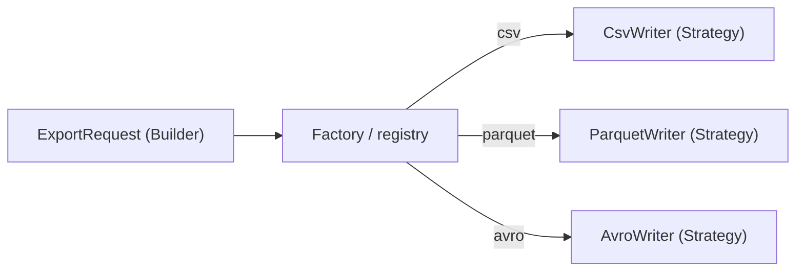
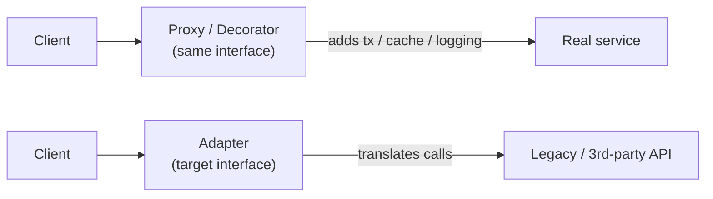
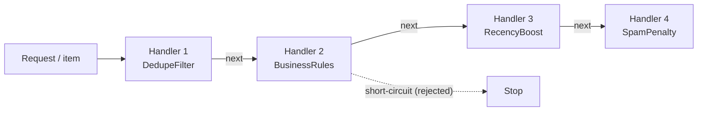

# Design Patterns (Java 8): Interview Notes

**Why this matters in interviews:** Pattern questions check whether you can name a design, justify it, and spot it inside frameworks like Spring. Senior answers tie each pattern to a real problem, such as the Chain of Responsibility ranking pipeline, a Strategy per export format, or a Builder for query requests, and they mention the downsides of over-engineering.

Difficulty legend: 🟢 Basic · 🟡 Intermediate · 🔴 Advanced · ⚡ Scenario

## Table of Contents

1. [SOLID and Principles](#1-solid-and-principles)
2. [Creational Patterns](#2-creational-patterns)
3. [Structural Patterns](#3-structural-patterns)
4. [Behavioral Patterns](#4-behavioral-patterns)
5. [Patterns in Spring and Enterprise Code](#5-patterns-in-spring-and-enterprise-code)
6. [Cheat Sheet](#6-cheat-sheet)
7. [Revision Checklist](#7-revision-checklist)
8. [Beyond Java 8](#8-beyond-java-8)

---

## 1. SOLID and Principles

> **Mental model:** Patterns are *named solutions*, and principles are *why they work*. SOLID keeps code **easy to change**. Apply it where change is likely, not everywhere.

### Q1. 🟢 What does SOLID stand for?

- **S**ingle Responsibility: one reason to change.
- **O**pen/Closed: open for extension, closed for modification.
- **L**iskov Substitution: subtypes must be usable wherever their parent is.
- **I**nterface Segregation: small, focused interfaces.
- **D**ependency Inversion: depend on abstractions, not concretions.

<details><summary>Cross-questions</summary>

**Q:** Which principle does Spring DI embody most?

**A:** Dependency Inversion. Classes receive their abstractions, and the container wires the concrete implementations.
</details>

### Q2. 🟡 Can you give an Open/Closed example from real work?

In the ranking pipeline, each rule is a `RankingStep` bean. Adding a rule means adding a class, with no edit to the pipeline.

<details><summary>Cross-questions</summary>

**Q:** What's the risk of OCP taken too far?

**A:** Speculative abstraction: interfaces for things that never vary.
</details>

### Q3. 🟡 What is a classic Liskov violation?

`Square extends Rectangle`, where `setWidth` also changes the height and breaks callers' expectations. Also: a subclass throwing `UnsupportedOperationException` for an inherited method (like `Arrays.asList().add()`).

<details><summary>Cross-questions</summary>

**Q:** How do you fix it?

**A:** Model the two as separate types, or use composition, rather than inheritance.
</details>

### Q4. 🟢 What do DRY, KISS and YAGNI mean?

Don't repeat knowledge, keep it simple, and don't build features before they're needed. Patterns should reduce complexity, not add it.

<details><summary>Cross-questions</summary>

**Q:** When is duplication acceptable?

**A:** When two pieces of code look alike but change for different reasons. Merging them couples unrelated things.
</details>

### Q5. 🟡 Composition over inheritance: why?

Composition gives looser coupling, lets you swap behaviour at runtime, and avoids the fragile base class problem. Most behavioural patterns (Strategy, Decorator) are built on composition.

<details><summary>Cross-questions</summary>

**Q:** When is inheritance right?

**A:** For a true is-a relationship with a stable base contract, such as the Template Method pattern in frameworks.
</details>

---

## 2. Creational Patterns

> **Mental model:** Creational patterns answer *"who builds the object, and how?"*: one instance (Singleton), complex step-by-step construction (Builder), or choosing the concrete type later (Factory).



### Q6. 🟢 Singleton: how do you implement it correctly in Java 8?

Use an **enum** singleton or the **holder idiom**. Double-checked locking needs `volatile`. See file 01 (Q110) for all three.

```java
public enum AppConfig {
    INSTANCE;
    private final String region = System.getProperty("region", "asia-south1");
    public String region() { return region; }
}
```

<details><summary>Cross-questions</summary>

**Q:** Why is Singleton often called an anti-pattern?

**A:** It's global state, it creates hidden dependencies, and it's hard to test. Prefer Spring singleton beans that are injected.
</details>

### Q7. 🟢 Factory Method vs Abstract Factory?

A **Factory Method** is one method that decides which subclass to create. An **Abstract Factory** is a family of related factories (for example, `ReportWriterFactory` producing a writer and a schema for each format).

```java
interface ExportWriter { String write(java.util.List<String> rows); }

class CsvWriter implements ExportWriter {
    public String write(java.util.List<String> rows) { return String.join("\n", rows); }
}
class JsonWriter implements ExportWriter {
    public String write(java.util.List<String> rows) { return "[\"" + String.join("\",\"", rows) + "\"]"; }
}

public final class ExportWriters {
    private ExportWriters() { }
    public static ExportWriter forFormat(String fmt) {
        switch (fmt.toLowerCase()) {
            case "csv":  return new CsvWriter();
            case "json": return new JsonWriter();
            default: throw new IllegalArgumentException("unsupported format " + fmt);
        }
    }
}
```

<details><summary>Cross-questions</summary>

**Q:** How do you avoid the growing `switch`?

**A:** Register the implementations in a `Map<String, ExportWriter>`, for example injected by Spring by bean name.
</details>

### Q8. 🟢 Builder: when and why?

Use it for objects with many optional parameters, to get readable construction, immutability, and validation in `build()`. See file 01 (Q123) for the `QueryRequest` builder.

<details><summary>Cross-questions</summary>

**Q:** Builder vs telescoping constructors?

**A:** A Builder avoids unreadable `new X(a, null, null, true, 5)` calls, and it can validate all the fields together.
</details>

### Q9. 🟡 What is the Prototype pattern?

You create new objects by copying a configured prototype. In Java that means copy constructors (preferred over `clone()`). Spring's prototype scope is related, but it isn't the GoF pattern.

<details><summary>Cross-questions</summary>

**Q:** Why avoid `clone()`?

**A:** It gives a shallow copy by default, uses a checked exception, and bypasses constructors.
</details>

### Q10. 🟡 What are object pools?

They reuse expensive objects (DB connections, threads). Examples are HikariCP and thread pools. Don't pool cheap objects: the JVM allocates them fast.

<details><summary>Cross-questions</summary>

**Q:** What's the risk of a pool?

**A:** Leaks (objects never returned) and sizing mistakes (exhaustion or overload of the downstream system).
</details>

### Q11. 🟡 What is a static factory method, and how does it compare with a constructor?

Examples: `Integer.valueOf`, `Optional.of`, `Collections.emptyList`. It has a name, can return cached instances or subtypes, and doesn't have to create a new object each time.

<details><summary>Cross-questions</summary>

**Q:** What's the downside?

**A:** It's less discoverable, and a class with only private constructors can't be subclassed.
</details>

### Q12. 🟡 What is dependency injection as a creational pattern?

Objects receive their dependencies instead of constructing them. The Spring IoC container acts as a big configurable factory.

<details><summary>Cross-questions</summary>

**Q:** Service Locator vs DI?

**A:** A Service Locator hides dependencies (`ctx.getBean`), while DI makes them explicit in the constructor.
</details>

---

## 3. Structural Patterns

> **Mental model:** Structural patterns are *adapters and wrappers*. They let objects fit together (Adapter), add features without changing the original (Decorator), control access (Proxy), or simplify something complex (Facade).



### Q13. 🟢 What is the Adapter pattern?

It converts one interface into another that the client expects. For example, wrapping an IBM MQ or Pub/Sub client behind a common `EventPublisher` interface.

```java
interface EventPublisher { void publish(String key, String payload); }

class LegacyMqClient { void put(String queue, byte[] body) { } }

public class MqPublisherAdapter implements EventPublisher {
    private final LegacyMqClient mq = new LegacyMqClient();
    public void publish(String key, String payload) {
        mq.put("EVENTS.OUT", payload.getBytes(java.nio.charset.StandardCharsets.UTF_8));
    }
}
```

<details><summary>Cross-questions</summary>

**Q:** Adapter vs Facade?

**A:** An Adapter changes an interface to fit an expected one. A Facade *simplifies* a subsystem behind a new, easier interface.
</details>

### Q14. 🟡 How does the Decorator pattern work?

It wraps an object with the **same interface** to add behaviour (caching, metrics, retries) without modifying it. Java's `BufferedInputStream(new FileInputStream(...))` is the classic example.

```java
import java.util.Map;
import java.util.concurrent.ConcurrentHashMap;

interface CountryLookup { String name(String code); }

public class CachingCountryLookup implements CountryLookup {
    private final CountryLookup delegate;
    private final Map<String, String> cache = new ConcurrentHashMap<String, String>();
    public CachingCountryLookup(CountryLookup delegate) { this.delegate = delegate; }
    public String name(String code) { return cache.computeIfAbsent(code, delegate::name); }
}
```

<details><summary>Cross-questions</summary>

**Q:** Decorator vs inheritance?

**A:** Decorators can be combined at runtime (cache(retry(metrics(real)))). Inheritance would need a subclass for every combination.
</details>

### Q15. 🟡 How is the Proxy pattern used in Spring?

It's a stand-in that controls access: lazy loading, security, transactions, caching. Spring AOP proxies (`@Transactional`, `@Cacheable`) and Hibernate lazy proxies are examples. See file 03.

<details><summary>Cross-questions</summary>

**Q:** Proxy vs Decorator?

**A:** The structure is the same. The intent differs: a Proxy *controls access*, and a Decorator *adds responsibilities*.
</details>

### Q16. 🟢 What is the Facade pattern?

A simple interface over a complex subsystem. For example, `ReportService.generate()` hides the query execution, encoding, GCS upload and status updates.

<details><summary>Cross-questions</summary>

**Q:** What's the risk?

**A:** A "god facade" that grows into a dumping ground. Keep it thin, and delegate to focused services.
</details>

### Q17. 🟡 What is the Composite pattern?

It treats individual objects and groups uniformly (tree structures). Examples: a rule group containing rules or other groups, and UI component trees.

<details><summary>Cross-questions</summary>

**Q:** Where could Composite help a ranking engine?

**A:** Nested rule sets: an `AllOf` or `AnyOf` group of filters, evaluated through the same interface as a single filter.
</details>

### Q18. 🟡 What is the Bridge pattern?

It separates an abstraction from its implementation so both can vary independently. For example, `Report` types × storage backends (GCS, S3) without a class explosion.

<details><summary>Cross-questions</summary>

**Q:** Bridge vs Strategy?

**A:** A Bridge is a structural split of two hierarchies. A Strategy swaps one algorithm.
</details>

### Q19. 🟡 What is the Flyweight pattern?

Share immutable intrinsic state to save memory. Examples: `Integer` caching, String interning, and enum constants.

<details><summary>Cross-questions</summary>

**Q:** What must a flyweight be?

**A:** Immutable, because it's shared.
</details>

---

## 4. Behavioral Patterns

> **Mental model:** Behavioral patterns describe *how objects collaborate*: pick an algorithm at runtime (Strategy), pass a request along a line (Chain of Responsibility), notify subscribers (Observer), or fix the skeleton and let the steps vary (Template Method).



### Q20. 🔴 How do you implement Chain of Responsibility (your ranking pipeline)?

Each handler processes the request and decides whether to pass it on. It's great for pipelines of independent rules.

```java
import java.util.ArrayList;
import java.util.Arrays;
import java.util.List;

public class RankingChain {
    static class Item {
        final String id; double score; boolean rejected;
        Item(String id, double score) { this.id = id; this.score = score; }
    }

    interface Handler { void handle(Item item, Chain chain); }

    static class Chain {
        private final List<Handler> handlers; private int index = 0;
        Chain(List<Handler> handlers) { this.handlers = handlers; }
        void proceed(Item item) {
            if (index < handlers.size() && !item.rejected) handlers.get(index++).handle(item, this);
        }
    }

    public static void main(String[] args) {
        Handler spamFilter = (item, chain) -> { if (item.id.startsWith("spam")) item.rejected = true; chain.proceed(item); };
        Handler boost      = (item, chain) -> { item.score *= 1.2; chain.proceed(item); };
        Handler penalty    = (item, chain) -> { item.score -= 5; chain.proceed(item); };
        List<Handler> steps = Arrays.asList(spamFilter, boost, penalty);

        List<Item> ranked = new ArrayList<Item>();
        for (Item it : Arrays.asList(new Item("a", 10), new Item("spam-b", 50), new Item("c", 20))) {
            new Chain(steps).proceed(it);
            if (!it.rejected) ranked.add(it);
        }
        ranked.sort((x, y) -> Double.compare(y.score, x.score));
        for (Item it : ranked) System.out.println(it.id + " " + it.score);   // c 19.0, a 7.0
    }
}
```

<details><summary>Cross-questions</summary>

**Q:** How do you wire this in Spring?

**A:** Inject a `List<Handler>` ordered with `@Order`, add per-step metrics, and toggle steps with feature flags (see file 03, Q7).

**Q:** Where else is CoR used?

**A:** Servlet filters, the Spring Security filter chain, and logging handlers.
</details>

### Q21. 🟢 Strategy: what is it, and what's an example?

A family of interchangeable algorithms behind one interface, chosen at runtime. For example, `ExportWriter` per format (CSV, JSON, Avro, Parquet), or pricing strategies. Java 8 lambdas make strategies lightweight.

<details><summary>Cross-questions</summary>

**Q:** Strategy vs State?

**A:** A Strategy is chosen by the client. A State object changes itself as the context's internal state changes.
</details>

### Q22. 🟡 Template Method: what is it, and where is it used?

A base class defines the algorithm's skeleton, and subclasses fill in the steps. Examples: `JdbcTemplate` (the callback style), Spring Batch `ItemReader`/`Processor`/`Writer`, and abstract batch jobs.

```java
public abstract class BatchJob<T> {
    public final int run() {                      // skeleton is fixed
        java.util.List<T> items = read();
        int ok = 0;
        for (T item : items) if (process(item)) ok++;
        onComplete(ok);
        return ok;
    }
    protected abstract java.util.List<T> read();
    protected abstract boolean process(T item);
    protected void onComplete(int ok) { }         // optional hook
}
```

<details><summary>Cross-questions</summary>

**Q:** Why is `run()` final?

**A:** So subclasses can't break the algorithm's order, only customise its steps.
</details>

### Q23. 🟢 How does the Observer pattern work, and how does it relate to pub/sub?

Subjects notify registered observers of changes. Examples: Spring `ApplicationEvent` with `@EventListener`, and listeners. **Pub/sub** is the distributed version, with a broker decoupling the two sides.

<details><summary>Cross-questions</summary>

**Q:** What's the risk of in-process observers?

**A:** Synchronous listeners slow down the publisher, and exceptions propagate back to it. Use async or transactional listeners where appropriate.
</details>

### Q24. 🟡 What is the Command pattern?

It encapsulates a request as an object (execute, undo, queue, log). Examples: tasks submitted to executors (`Runnable`), job messages on a queue, and undoable operations.

<details><summary>Cross-questions</summary>

**Q:** How does Command relate to sagas?

**A:** Each saga step is a command with a compensating command.
</details>

### Q25. 🟡 What is the State pattern?

An object changes its behaviour when its state changes, with the state logic spread across state classes. For example, a report job going PENDING → RUNNING → DONE or FAILED, with valid transitions enforced.

```java
public enum JobState {
    PENDING { JobState next(boolean ok) { return RUNNING; } },
    RUNNING { JobState next(boolean ok) { return ok ? DONE : FAILED; } },
    DONE    { JobState next(boolean ok) { throw new IllegalStateException("terminal"); } },
    FAILED  { JobState next(boolean ok) { throw new IllegalStateException("terminal"); } };
    abstract JobState next(boolean ok);
}
```

<details><summary>Cross-questions</summary>

**Q:** Why an enum state machine?

**A:** It's compact and type-safe, and illegal transitions fail loudly.
</details>

### Q26. 🟡 What is the Iterator pattern?

It traverses a collection without exposing its internals. Java's `Iterator` and `Iterable`, and streams, are examples.

<details><summary>Cross-questions</summary>

**Q:** Fail-fast vs weakly consistent iterators?

**A:** See file 01, Q38.
</details>

### Q27. 🟡 What is the Mediator pattern?

A central object coordinates the interactions between colleagues so they don't reference each other directly. Examples: an orchestrator in a saga, and a message broker.

<details><summary>Cross-questions</summary>

**Q:** What's the risk?

**A:** The mediator becomes a god object. Keep it focused on coordination.
</details>

### Q28. 🟡 What is the Visitor pattern?

It adds operations over a stable object structure without changing the classes (double dispatch). Examples: AST processing, and exporting different node types.

<details><summary>Cross-questions</summary>

**Q:** What's the downside?

**A:** Adding a new element type forces a change to every visitor.
</details>

### Q29. 🟡 What is the Null Object pattern?

A do-nothing implementation instead of `null`, such as `NoopPublisher` when a feature is disabled. It removes null checks.

<details><summary>Cross-questions</summary>

**Q:** Null Object vs `Optional`?

**A:** `Optional` makes absence explicit in return values. A Null Object provides safe default behaviour.
</details>

### Q30. 🟡 What is the Memento pattern?

It captures and restores an object's state without breaking encapsulation. Examples: undo, and checkpoints in batch jobs (the last processed key).

<details><summary>Cross-questions</summary>

**Q:** Where's a real checkpoint example?

**A:** A restartable batch job storing its last committed chunk ID, so a rerun resumes from there.
</details>

---

## 5. Patterns in Spring and Enterprise Code

> **Mental model:** Frameworks are *patterns you already use*. Naming them in an interview ("Spring's `@Transactional` is a Proxy, `JdbcTemplate` is a Template Method, Security filters are a Chain of Responsibility") shows you understand the tools rather than just using them.

### Q31. 🟡 Which GoF patterns appear inside Spring?

| Spring feature | Pattern |
|---|---|
| `BeanFactory` / `ApplicationContext` | Factory, Singleton registry |
| AOP, `@Transactional`, `@Cacheable` | Proxy / Decorator |
| `JdbcTemplate`, `RestTemplate` | Template Method (callbacks) |
| Security filter chain, servlet filters | Chain of Responsibility |
| `ApplicationEvent` / listeners | Observer |
| `HandlerAdapter` | Adapter |
| `Resource` loaders, strategies (`PasswordEncoder`) | Strategy |

<details><summary>Cross-questions</summary>

**Q:** Which one explains the self-invocation bug?

**A:** Proxy. Internal calls bypass the proxy object.
</details>

### Q32. 🟡 What does the Repository pattern give you?

A collection-like abstraction over data access (Spring Data repositories), which keeps domain logic free of SQL details.

<details><summary>Cross-questions</summary>

**Q:** Repository vs DAO?

**A:** A Repository is domain-oriented (aggregates). A DAO is table or persistence-oriented. In practice they often overlap.
</details>

### Q33. 🟡 What is the DTO pattern?

Simple objects that carry data across boundaries (API, messaging), decoupling the external contracts from the internal entities.

<details><summary>Cross-questions</summary>

**Q:** Why not expose JPA entities?

**A:** Lazy-loading exceptions, leaked fields, and API changes whenever the schema changes.
</details>

### Q34. 🟡 What is the Circuit Breaker pattern?

It stops calling a failing dependency for a while, failing fast, and then probes it again (CLOSED, OPEN, HALF_OPEN). See file 06.

<details><summary>Cross-questions</summary>

**Q:** Which library in Spring Boot 2?

**A:** Resilience4j (Hystrix is retired).
</details>

### Q35. 🟡 What is the Outbox pattern?

Write the domain change and an event row in one transaction, and relay the event to the broker. See file 06.

<details><summary>Cross-questions</summary>

**Q:** Why not publish directly in the transaction?

**A:** The dual-write problem: the DB and the broker can't commit atomically.
</details>

### Q36. 🟡 What is the Saga pattern?

A sequence of local transactions, with compensations when a step fails. It comes in orchestration and choreography styles. See file 06.

<details><summary>Cross-questions</summary>

**Q:** Which GoF patterns do sagas use?

**A:** Command (the steps and compensations), and Mediator (the orchestrator).
</details>

### Q37. 🟡 What is the Retry with Backoff pattern?

Retry transient failures with exponential backoff and jitter, for idempotent operations only. See files 02 and 06.

<details><summary>Cross-questions</summary>

**Q:** What's a retry storm?

**A:** Every client retrying at the same moment, which overloads a recovering service.
</details>

### Q38. 🟡 What is the Bulkhead pattern?

It isolates resources (thread pools, connections) per dependency, so one failure can't sink the whole service.

<details><summary>Cross-questions</summary>

**Q:** Semaphore or thread-pool bulkhead?

**A:** A semaphore is lightweight. A thread pool gives isolation plus async timeouts.
</details>

### Q39. 🟡 What is the Specification pattern?

It encapsulates business rules or query predicates as composable objects (`and`, `or`, `not`). Spring Data JPA Specifications are an example. See file 05.

<details><summary>Cross-questions</summary>

**Q:** Where is it useful?

**A:** For dynamic search filters built from optional UI parameters.
</details>

### Q40. 🟡 What is the Producer-Consumer pattern?

It decouples producing and consuming work through a (bounded) queue, whether a `BlockingQueue` or a broker. See file 02.

<details><summary>Cross-questions</summary>

**Q:** Why bounded?

**A:** It gives backpressure and prevents out-of-memory errors under bursts.
</details>

### Q41. 🟡 What is the Cache-Aside pattern?

The application checks the cache, loads from the source on a miss, and populates the cache. Writes invalidate it. See file 11.

<details><summary>Cross-questions</summary>

**Q:** What's the classic race?

**A:** A stale read repopulating the cache after an invalidation.
</details>

### Q42. 🟡 What is the Idempotent Receiver pattern?

Consumers detect and ignore duplicate messages, using a message ID store or upserts.

<details><summary>Cross-questions</summary>

**Q:** Where must the dedupe record live?

**A:** In the same transaction as the side effect.
</details>

### Q43. 🟡 What is the Strangler Fig pattern?

Replace a legacy system incrementally behind a facade or gateway. See file 06.

<details><summary>Cross-questions</summary>

**Q:** Which GoF pattern does the facade resemble?

**A:** Facade and Proxy.
</details>

### Q44. 🟡 What is the Pipes and Filters pattern?

A chain of independent processing stages connected by channels: stream processing, or a batch read → transform → write pipeline.

<details><summary>Cross-questions</summary>

**Q:** How does it differ from Chain of Responsibility?

**A:** In Pipes and Filters, every stage processes the data. In CoR, a handler may stop the request, or handle it alone.
</details>

### Q45. 🟡 What is the Event Sourcing pattern?

State is derived from an append-only log of events. You get auditability and replay, at the cost of complexity. See file 06.

<details><summary>Cross-questions</summary>

**Q:** What pairs naturally with it?

**A:** CQRS read models.
</details>

### Q46. ⚡ Which patterns would you use for a multi-format report exporter?

Strategy (a writer per format), Factory or registry (to pick the writer), Template Method (read → encode → upload → finalise), Builder (the export request), and Decorator (compression, metrics).

<details><summary>Cross-questions</summary>

**Q:** How do you add a new format like ORC?

**A:** Add one new strategy class and register it. The rest of the code is untouched (Open/Closed).
</details>

### Q47. ⚡ Which patterns fit a multi-broker event publisher (Kafka, MQ, Pub/Sub)?

Adapter (per broker client), Strategy (routing per event type), Decorator (retry, metrics, tracing), and Null Object (a disabled channel).

<details><summary>Cross-questions</summary>

**Q:** How do you test it?

**A:** Swap the adapters for in-memory fakes through DI.
</details>

### Q48. ⚡ When is using a pattern a mistake?

When it adds indirection without a real variation point: a Factory for a single implementation, an interface for every class, Singletons as global state, or deep inheritance hierarchies.

<details><summary>Cross-questions</summary>

**Q:** How do you decide?

**A:** Introduce the pattern when the second or third variant appears (the "rule of three").
</details>

### Q49. ⚡ How do Java 8 features change classic patterns?

Lambdas replace one-method Strategy, Command and Observer classes. `Supplier` acts as a lightweight Factory. Default methods reduce the need for abstract adapters. Streams replace explicit Iterators.

```java
import java.util.HashMap;
import java.util.Map;
import java.util.function.DoubleUnaryOperator;

public class LambdaStrategies {
    public static void main(String[] args) {
        Map<String, DoubleUnaryOperator> pricing = new HashMap<String, DoubleUnaryOperator>();
        pricing.put("FREE", p -> p);
        pricing.put("GOLD", p -> p * 0.8);
        System.out.println(pricing.get("GOLD").applyAsDouble(100.0));   // 80.0
    }
}
```

<details><summary>Cross-questions</summary>

**Q:** When do you still want a class instead of a lambda?

**A:** When the strategy has state, dependencies, a name for metrics, or complex logic that needs its own tests.
</details>

### Q50. ⚡ How do you explain your ranking pipeline design in 60 seconds?

"Candidates flow through a Chain of Responsibility of ranking steps. Each step is a Spring bean implementing one interface, ordered with `@Order`. Steps can short-circuit (for example, compliance filters), emit per-step metrics, and be toggled by feature flags. That made the ranking logic Open/Closed: new rules ship as new classes, each tested in isolation."

<details><summary>Cross-questions</summary>

**Q:** What would you change at 10× the scale?

**A:** Parallelise independent steps, cache the expensive features, and move the heavy scoring to a precomputed offline pipeline.
</details>

---

## 6. Cheat Sheet

| Category | Pattern | One-liner / real example |
|---|---|---|
| Creational | Singleton | Enum/holder; prefer Spring singleton beans |
| | Factory / Abstract Factory | Pick writer per export format |
| | Builder | Immutable `QueryRequest` with validation |
| Structural | Adapter | Wrap MQ/PubSub/Kafka clients behind one interface |
| | Decorator | Add caching/metrics/retry around a service |
| | Proxy | Spring AOP `@Transactional`, Hibernate lazy proxies |
| | Facade | `ReportService.generate()` over many subsystems |
| | Composite | Nested rule groups |
| Behavioral | Chain of Responsibility | Ranking pipeline, Security filter chain |
| | Strategy | Pricing / export format / ranking rules |
| | Template Method | `JdbcTemplate`, batch job skeleton |
| | Observer | `@EventListener`, pub/sub |
| | Command | Runnable tasks, saga steps |
| | State | Job status state machine (enum) |
| Enterprise | Repository, DTO, Outbox, Saga, Circuit Breaker, Bulkhead, Cache-Aside, Idempotent Receiver, Strangler |

---

## 7. Revision Checklist

- [ ] Explain SOLID with one real example each
- [ ] Implement a thread-safe Singleton (enum/holder) and know why DI is preferred
- [ ] Write a Factory and a Builder in Java 8
- [ ] Contrast Adapter, Decorator, Proxy and Facade
- [ ] Implement Chain of Responsibility and explain the ranking pipeline
- [ ] Explain Strategy vs State and Template Method with examples
- [ ] Map the Spring features to GoF patterns
- [ ] Name the enterprise and resilience patterns (Outbox, Saga, Circuit Breaker, Bulkhead)
- [ ] Explain when *not* to use a pattern
- [ ] Show how lambdas simplify Strategy, Command and Observer

---

## 8. Beyond Java 8

- **Sealed interfaces + records + pattern matching** (Java 17–21) make State and Visitor-style designs safer: exhaustive `switch` over sealed types.
- **Virtual threads** (Java 21) simplify Producer-Consumer and thread-per-task designs.
